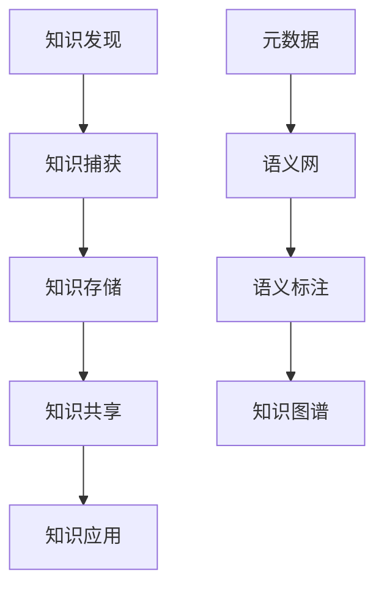

                 

# 管理者如何建立个人知识管理系统

## 1. 背景介绍

在当今信息爆炸的时代，知识的获取已经变得前所未有的容易。然而，如何有效管理和利用这些知识，却是一个巨大的挑战。对于管理者而言，建立一个个人知识管理系统，不仅可以帮助自己快速获取和整合知识，还能提升决策的效率和质量。本文将从背景、核心概念、算法原理、操作步骤等方面，全面介绍管理者如何建立个人知识管理系统。

## 2. 核心概念与联系

### 2.1 核心概念概述

在讨论个人知识管理系统的建立之前，我们需要先理解一些关键概念：

- **知识管理(Knowledge Management, KM)**：是一种系统化的过程，旨在发现、捕获、存储、共享和应用知识，以提升组织或个人的工作效率和决策质量。

- **个人知识管理系统(Individual Knowledge Management System, IKMS)**：是一种专门为个人设计的知识管理工具，帮助个体收集、组织、检索和应用个人知识，提升学习和工作效率。

- **元数据(Metadata)**：描述数据的额外信息，如文档的作者、创建时间、分类等，有助于知识的组织和管理。

- **语义网(Semantic Web)**：一种基于语义的技术，通过使用RDF（资源描述框架）等技术，实现知识的语义化和自动化推理，提升知识检索的精度和效率。

- **语义标注(Semantic Annotation)**：通过在文本中添加语义信息，帮助机器理解和组织文档，提升知识管理的效果。

- **知识图谱(Knowledge Graph)**：一种图形化的知识表示方式，通过节点和边来描述实体和它们之间的关系，帮助用户直观地理解和管理知识。

### 2.2 核心概念原理和架构的 Mermaid 流程图



## 3. 核心算法原理 & 具体操作步骤

### 3.1 算法原理概述

个人知识管理系统涉及多个环节，包括知识发现、捕获、存储、共享和应用。为了提升管理系统的效率和效果，我们可以采用以下算法和步骤：

1. **知识发现算法**：通过文本挖掘、主题模型等技术，自动从大量文本中发现知识节点和关系，为知识管理奠定基础。
2. **知识捕获算法**：采用自然语言处理(NLP)技术，帮助用户将文本转化为结构化的知识单元，如概念、事实等。
3. **知识存储算法**：设计有效的数据结构，如图数据库、文档数据库等，存储和管理知识单元及其关系。
4. **知识共享算法**：实现知识的可视化展示，如仪表板、可视化报表等，方便用户共享和协作。
5. **知识应用算法**：设计推荐系统、决策支持系统等，将知识应用于实际工作中，提升决策效率和质量。

### 3.2 算法步骤详解

以下将详细介绍每个步骤的详细步骤和关键技术：

#### 3.2.1 知识发现

**步骤1: 数据收集**  
收集各类文本数据，如文档、电子邮件、网页等，存储在数据仓库中。

**步骤2: 文本预处理**  
对收集到的文本数据进行清洗、分词、去停用词等预处理步骤，提升文本的质量。

**步骤3: 主题模型构建**  
使用主题模型算法，如LDA（潜在狄利克雷分布）、LSI（潜在语义分析）等，从文本中自动发现潜在的主题和概念。

**步骤4: 知识节点生成**  
将主题模型发现的概念和关系，转化为知识图谱中的节点和边，构建知识图谱的初始版本。

#### 3.2.2 知识捕获

**步骤1: 文本分块**  
将文本按照段落、句子、词语等块进行分割，便于后续处理。

**步骤2: 实体识别**  
使用命名实体识别(NER)技术，从文本中识别出人名、地名、组织名等实体，为后续的语义标注做准备。

**步骤3: 关系抽取**  
通过关系抽取算法，如基于规则的方法、基于统计的方法等，从文本中发现实体之间的关系。

**步骤4: 语义标注**  
使用语义标注技术，为文本中的实体和关系添加语义信息，提升文本的理解和处理效果。

#### 3.2.3 知识存储

**步骤1: 知识图谱设计**  
设计知识图谱的结构和元数据模型，确定节点和边的属性和关系类型。

**步骤2: 知识图谱构建**  
将知识节点和关系导入知识图谱，构建知识图谱的完整版本。

**步骤3: 存储优化**  
使用图数据库、文档数据库等高效存储技术，优化知识图谱的存储和查询效率。

#### 3.2.4 知识共享

**步骤1: 仪表板设计**  
设计直观、易用的仪表板界面，展示关键知识节点和关系。

**步骤2: 可视化报表生成**  
使用可视化工具，如Tableau、Power BI等，生成各种形式的报表，帮助用户直观地理解知识。

**步骤3: 协作工具集成**  
集成协作工具，如Slack、Teams等，方便用户共享和讨论知识。

#### 3.2.5 知识应用

**步骤1: 知识推荐系统设计**  
设计知识推荐算法，根据用户的兴趣和行为，推荐相关的知识节点和关系。

**步骤2: 决策支持系统集成**  
将知识图谱集成到决策支持系统中，提升决策的精度和效率。

**步骤3: 持续改进**  
通过用户反馈和行为数据，不断优化知识管理系统，提升其效果。

### 3.3 算法优缺点

个人知识管理系统在提升知识和信息管理效率方面具有以下优点：

1. **自动化和智能化**：采用自动化和智能化的技术，能够显著提升知识发现的效率和质量。
2. **结构化管理**：通过知识图谱等结构化方式管理知识，便于检索和应用。
3. **协作与共享**：通过协作工具集成，方便用户共享和讨论知识。
4. **个性化推荐**：通过推荐系统，能够根据用户兴趣和行为，提供个性化的知识推荐。

然而，个人知识管理系统也存在一些缺点：

1. **高成本**：设计和实现一个高质量的知识管理系统需要较高的成本。
2. **复杂性**：系统的设计和实现较为复杂，需要较高的技术水平。
3. **数据隐私**：系统涉及大量的文本数据和元数据，可能存在隐私和安全问题。

### 3.4 算法应用领域

个人知识管理系统可以应用于多个领域，提升个体和团队的工作效率和决策质量。例如：

- **学术研究**：帮助研究人员快速发现相关文献和研究数据，提升研究的效率和质量。
- **项目管理**：通过知识共享和协作，提升项目团队的知识协同和工作效率。
- **企业决策**：通过知识推荐和决策支持系统，提升企业的决策准确性和效率。
- **个人学习**：帮助个人快速积累和管理各类知识，提升学习效率和效果。

## 4. 数学模型和公式 & 详细讲解 & 举例说明

### 4.1 数学模型构建

我们以知识推荐系统为例，构建推荐模型的数学模型。

假设知识图谱中有$N$个节点，每个节点的度数为$d_i$，节点之间的边为$E$。知识推荐的目标是计算每个节点$i$的推荐度数，记为$R_i$，推荐度数越高的节点，越可能被推荐。

推荐度数的计算公式如下：

$$
R_i = \sum_{j \in \mathcal{N}(i)} \frac{1}{\sqrt{d_i + 1} \sqrt{d_j + 1}} S_{ij}
$$

其中，$\mathcal{N}(i)$表示节点$i$的邻居节点集合，$S_{ij}$表示节点$i$和节点$j$之间的关系强度。

### 4.2 公式推导过程

推荐度数的计算可以分为以下几个步骤：

1. **计算节点$i$的邻居节点集合**  
根据知识图谱的结构，计算节点$i$的所有邻居节点$j$的集合。

2. **计算节点$i$和邻居节点$j$的关系强度$S_{ij}$**  
关系强度可以基于共现关系、相似性等计算，常用的方法包括点积相似性、余弦相似性等。

3. **计算推荐度数$R_i$**  
根据公式计算每个节点的推荐度数，并按照度数进行排序，选择前$K$个节点进行推荐。

### 4.3 案例分析与讲解

以Google Scholar为例，Google Scholar采用基于知识图谱的推荐系统，帮助用户快速发现相关文献和研究数据。系统通过分析用户的历史行为数据，构建用户画像，结合知识图谱中的节点和关系，计算每个文献的推荐度数，最终生成个性化的推荐列表。

## 5. 项目实践：代码实例和详细解释说明

### 5.1 开发环境搭建

为了开发个人知识管理系统，我们需要以下环境：

1. **编程语言**：Python
2. **深度学习框架**：TensorFlow或PyTorch
3. **自然语言处理库**：NLTK、SpaCy等
4. **知识图谱库**：Neo4j、GATE等
5. **可视化工具**：Tableau、Power BI等

可以使用以下命令创建虚拟环境：

```bash
conda create --name ikms python=3.8
conda activate ikms
```

### 5.2 源代码详细实现

以下是一个简单的Python代码示例，用于文本分类和知识推荐：

```python
import tensorflow as tf
import tensorflow_hub as hub
import tensorflow_datasets as tfds
from transformers import TFAutoModelForSequenceClassification, BertTokenizerFast

# 加载数据集
train_data, test_data = tfds.load('imdb_reviews', split=['train', 'test'], with_info=True)

# 构建模型
tokenizer = BertTokenizerFast.from_pretrained('bert-base-uncased')
model = TFAutoModelForSequenceClassification.from_pretrained('bert-base-uncased')

# 数据预处理
def preprocess(text):
    tokens = tokenizer(text, padding=True, truncation=True)
    input_ids = tokens['input_ids']
    attention_mask = tokens['attention_mask']
    return input_ids, attention_mask

# 数据生成器
train_dataset = train_data.map(lambda x: (preprocess(x['text']), x['label']))
test_dataset = test_data.map(lambda x: (preprocess(x['text']), x['label']))

# 模型训练
model.compile(optimizer='adam', loss='sparse_categorical_crossentropy', metrics=['accuracy'])
model.fit(train_dataset, epochs=5, validation_data=test_dataset)

# 知识推荐
def recommend(node_id):
    # 获取节点关系
    relationships = graph.get_relationships(node_id)
    # 计算节点度数
    degrees = graph.get_degrees(node_id)
    # 计算推荐度数
    recommendations = []
    for relationship in relationships:
        recommendation = graph.get_node(relationship[0])
        recommendation_degree = graph.get_degrees(recommendation)
        recommendation_score = 1 / (np.sqrt(degrees[0] + 1) * np.sqrt(recommendation_degree[0] + 1)) * graph.get_score(relationship)
        recommendations.append((recommendation_score, recommendation))
    recommendations = sorted(recommendations, key=lambda x: x[0], reverse=True)
    return recommendations[:5]

# 使用推荐系统
recommendations = recommend('node_id')
```

### 5.3 代码解读与分析

在上述代码中，我们首先使用TensorFlow和Transformer库构建了一个基于BERT的文本分类模型。然后，通过定义`preprocess`函数，将文本数据预处理为模型所需的输入格式。接着，使用`tfds`加载IMDB电影评论数据集，并使用`fit`函数训练模型。

在知识推荐部分，我们假设已经构建了一个知识图谱`graph`。`recommend`函数通过计算节点关系和度数，计算每个节点的推荐度数，并返回前5个推荐节点。

### 5.4 运行结果展示

训练后的模型可以在IMDB电影评论数据集上进行测试，例如：

```python
test_dataset = tfds.load('imdb_reviews', split=['test'], with_info=True)
test_dataset.map(lambda x: (preprocess(x['text']), x['label']))
```

通过测试数据集，我们可以评估模型的性能。例如，使用`evaluate`函数：

```python
loss, accuracy = model.evaluate(test_dataset)
print('Loss:', loss)
print('Accuracy:', accuracy)
```

## 6. 实际应用场景

### 6.1 项目管理

在项目管理中，个人知识管理系统可以帮助项目团队快速获取相关知识，提升项目的决策和执行效率。例如，一个软件项目的项目经理可以使用知识管理系统，快速查找历史项目的文档、代码、测试报告等，以便参考和借鉴。

### 6.2 学术研究

学术研究人员可以通过知识管理系统，快速获取相关领域的文献、数据和实验结果，提升研究的效率和质量。例如，一个生物医学研究人员可以使用知识管理系统，快速查找最新的研究成果和相关文献，以便参考和引用。

### 6.3 企业决策

企业决策人员可以通过知识管理系统，快速获取相关领域的数据和报告，提升决策的准确性和效率。例如，一个市场营销经理可以使用知识管理系统，快速查找市场数据和消费者行为分析报告，以便制定更好的营销策略。

## 7. 工具和资源推荐

### 7.1 学习资源推荐

1. **《知识管理导论》**：介绍知识管理的概念、方法和实践，适合初学者入门。
2. **《信息检索与文本挖掘》**：介绍信息检索和文本挖掘的基本原理和算法，适合进一步学习。
3. **《深度学习与自然语言处理》**：介绍深度学习在自然语言处理中的应用，适合深度学习爱好者。
4. **Coursera上的“数据科学与机器学习”课程**：由斯坦福大学教授讲授，涵盖数据科学和机器学习的基础知识和应用实践。

### 7.2 开发工具推荐

1. **Jupyter Notebook**：免费的交互式笔记本，支持Python、R等多种语言，适合数据科学和机器学习开发。
2. **Gephi**：用于构建和可视化知识图谱的工具，支持多种数据格式和图形布局。
3. **Tableau**：数据可视化工具，支持丰富的图表和报表功能。
4. **Google Colab**：免费的云平台，支持GPU/TPU计算资源，适合大规模数据处理和模型训练。

### 7.3 相关论文推荐

1. **《知识管理：概念、方法与应用》**：介绍知识管理的定义、方法和应用，适合深入了解知识管理。
2. **《知识图谱构建与分析》**：介绍知识图谱的构建和分析方法，适合深入了解知识图谱技术。
3. **《深度学习在知识图谱中的应用》**：介绍深度学习在知识图谱中的应用，适合了解深度学习在知识管理中的应用。

## 8. 总结：未来发展趋势与挑战

### 8.1 研究成果总结

个人知识管理系统已经取得了一定的进展，但还存在一些挑战：

1. **数据隐私和安全**：如何保护用户数据隐私和安全，是一个重要的问题。
2. **系统复杂性**：知识管理系统的设计和实现较为复杂，需要高水平的技术支持。
3. **用户交互**：如何提升用户的使用体验和交互效率，是系统优化的一个重要方向。

### 8.2 未来发展趋势

未来的个人知识管理系统可能呈现以下趋势：

1. **自动化和智能化**：采用更多的自动化和智能化技术，提升系统的效率和精度。
2. **跨平台整合**：支持多种平台和工具的整合，提升系统的可扩展性和可用性。
3. **增强现实技术**：结合增强现实技术，提升知识发现的可视化效果。
4. **联邦学习**：通过联邦学习技术，提升知识发现的隐私保护和模型泛化能力。

### 8.3 面临的挑战

个人知识管理系统在未来的发展中，仍面临以下挑战：

1. **数据隐私保护**：如何保护用户数据隐私，是一个重要的问题。
2. **跨平台整合**：如何支持多种平台和工具的整合，是一个重要的挑战。
3. **用户交互体验**：如何提升用户的使用体验和交互效率，是一个需要解决的问题。

### 8.4 研究展望

未来的研究可以在以下几个方向上进一步探索：

1. **多模态知识管理**：结合文本、图像、音频等多模态数据，提升知识管理的丰富性和准确性。
2. **知识图谱动态更新**：实时更新知识图谱，保持其时效性和准确性。
3. **知识发现与推理**：结合知识图谱和推理技术，提升知识发现的精确性和推理能力。
4. **语义网技术**：通过语义网技术，提升知识管理系统的语义理解和推理能力。

## 9. 附录：常见问题与解答

**Q1: 个人知识管理系统有哪些应用场景？**

A: 个人知识管理系统可以应用于学术研究、项目管理、企业决策等多个场景，提升个体和团队的工作效率和决策质量。

**Q2: 如何设计一个高效的个人知识管理系统？**

A: 设计一个高效的个人知识管理系统需要考虑数据收集、文本预处理、知识图谱构建、推荐系统设计等多个环节，需要充分考虑系统的可扩展性、可维护性和用户友好性。

**Q3: 如何选择适合的知识管理工具？**

A: 选择合适的知识管理工具需要考虑系统的功能、易用性、扩展性等多个因素，可以根据具体需求进行选择，如商业软件如Confluence、OpenSymphony等，开源软件如Filecoin、Sphinx等。

**Q4: 如何保护个人知识管理系统中的数据隐私？**

A: 保护数据隐私可以通过加密存储、访问控制、匿名化处理等多种技术手段实现，确保用户数据的安全和隐私。

**Q5: 如何提升个人知识管理系统的自动化和智能化水平？**

A: 提升自动化和智能化水平可以通过引入机器学习、自然语言处理、知识图谱等技术，提升知识发现的效率和精度，减少人工干预。

综上所述，个人知识管理系统可以帮助个体和团队提升工作和学习效率，通过不断优化和改进，可以更好地适应未来的信息化需求。

