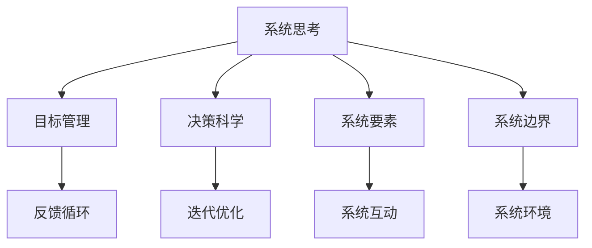
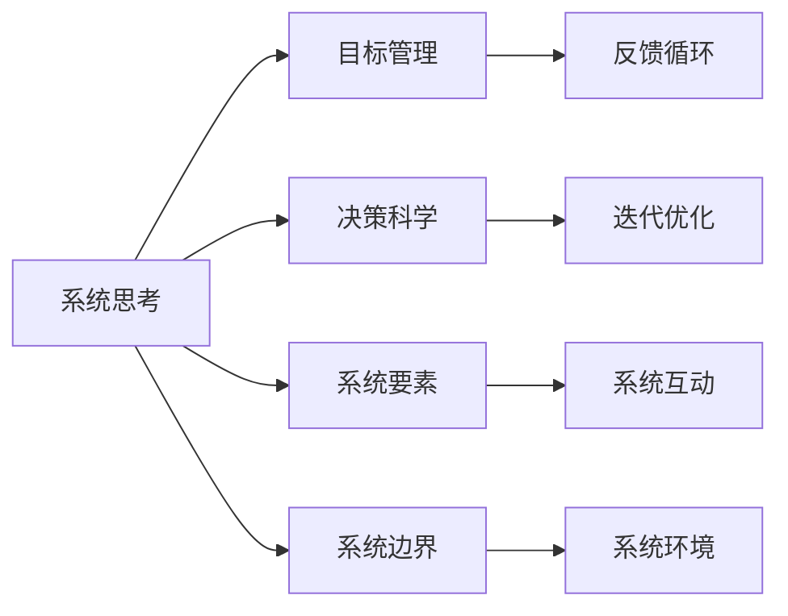

                 

# 系统化思考:管理者战胜复杂的秘诀

## 1. 背景介绍

### 1.1 问题由来

现代组织面临的环境愈发复杂，动态变化、不确定性增加、竞争加剧，使得管理决策难度大幅提升。信息过载、任务繁多、组织结构庞大等，使管理者面临前所未有的挑战。在这样的背景下，系统化思考方法应运而生，旨在帮助管理者透过复杂现象，抓住本质问题，科学决策，高效行动。

### 1.2 问题核心关键点

系统化思考的核心在于：
- **目标一致性**：确保组织目标与个人目标的一致性。
- **系统思维**：将复杂系统视为整体，关注系统要素之间的互动和影响。
- **数据驱动**：通过收集、分析数据，指导决策，避免主观偏见。
- **迭代优化**：持续改进，不断调整策略，适应环境变化。

### 1.3 问题研究意义

掌握系统化思考方法，对于提升组织绩效，优化管理流程，增强问题解决能力，具有重要意义：

1. **提升决策质量**：系统化思考通过多角度分析，能减少决策失误，提高管理决策的科学性和准确性。
2. **优化资源配置**：明确系统要素，识别瓶颈和关键路径，能更高效地配置资源，提升资源利用效率。
3. **强化团队协作**：系统化思考强调跨部门协同，促进团队沟通与合作，增强组织凝聚力。
4. **促进持续改进**：通过不断的回顾和改进，组织能保持动态适应能力，持续改进流程和策略。
5. **增强问题解决能力**：系统化思考提供了一整套分析工具和方法，帮助管理者有效解决复杂问题。

## 2. 核心概念与联系

### 2.1 核心概念概述

系统化思考包含多个关键概念，它们相互作用，共同支撑系统化思考框架的构建：

- **系统思考(Systems Thinking)**：关注系统整体与各要素之间的关系，以及要素间的相互作用。
- **目标管理(MBO, Management by Objectives)**：通过设定目标，使个人和组织目标一致，推动绩效提升。
- **决策科学(Decision Science)**：利用统计学、运筹学、数据分析等工具，科学指导决策过程。
- **迭代优化(Iterative Optimization)**：不断反馈和调整策略，提升系统效能。
- **反馈循环(Feedback Loops)**：了解系统运行状况，根据反馈信息调整策略。

这些核心概念通过以下Mermaid流程图展示其联系：



### 2.2 核心概念原理和架构的 Mermaid 流程图



这个流程图展示了系统化思考的各个组成部分以及它们之间的逻辑关系：

1. **系统思考**：识别系统的整体与部分，分析要素间的互动和关系。
2. **目标管理**：设定具体、可衡量的目标，使个体和组织行为一致。
3. **决策科学**：应用数据分析、运筹学等科学工具，优化决策过程。
4. **迭代优化**：通过持续改进，逐步提升系统性能。
5. **反馈循环**：根据反馈信息调整策略，确保系统动态适应。

### 2.3 系统化思考与商业模型画布(Business Model Canvas)

系统化思考通过商业模型画布(BMC)进行结构化表达，BMC是Alex Osterwalder和Yves Pigneur提出的一种商业战略可视化工具。

```mermaid
graph LR
    A[价值主张(Value Proposition)] --> B[客户细分(Customer Segments)]
    B --> C[渠道(Channels)]
    C --> D[客户关系(Customer Relationships)]
    D --> E[收入流(Revenue Streams)]
    A --> F[核心资源(Key Resources)]
    F --> G[关键活动(Key Activities)]
    G --> H[合作伙伴(Key Partnerships)]
    H --> A
```

BMC通过可视化方式，帮助管理者梳理业务模型，明确关键要素及其关系，是系统化思考的重要应用之一。

## 3. 核心算法原理 & 具体操作步骤

### 3.1 算法原理概述

系统化思考是一种结构化、数据驱动的决策方法，其核心算法原理包括系统思考、目标管理、决策科学和迭代优化。

**系统思考**：通过系统动力学模型(SD)分析系统行为，识别关键因素和互动关系。

**目标管理**：设定SMART目标，确保个体和组织目标一致。

**决策科学**：应用统计分析、优化算法等科学工具，提高决策质量。

**迭代优化**：持续反馈和调整策略，通过PDCA循环不断改进。

### 3.2 算法步骤详解

系统化思考的操作步骤如下：

1. **识别系统**：确定系统的边界和要素，建立系统模型。
2. **设定目标**：根据SMART原则，设定具体、可衡量的目标。
3. **分析数据**：收集和分析系统数据，识别关键指标和趋势。
4. **制定决策**：基于数据分析，应用决策科学工具制定决策。
5. **实施与监控**：执行决策并监控结果，根据反馈进行调整。
6. **持续优化**：通过PDCA循环，不断优化系统。

### 3.3 算法优缺点

**优点**：
- **科学性**：基于数据分析和科学工具，决策更加科学和客观。
- **系统性**：整体考虑系统要素和互动关系，避免局部视角。
- **迭代性**：持续优化，适应动态变化。

**缺点**：
- **复杂性**：需要系统思维和数据分析技能，学习成本较高。
- **时间成本**：初期分析系统模型和收集数据需要大量时间。
- **资源需求**：需要投入资源进行数据收集和系统构建。

### 3.4 算法应用领域

系统化思考方法广泛应用于商业、医疗、教育、政府等多个领域，具体应用包括：

1. **商业战略规划**：通过系统动力学模型(BMC)，制定和优化商业战略。
2. **医疗管理**：利用系统思考，优化医院运营流程，提高医疗服务质量。
3. **教育改革**：通过目标管理和数据驱动，改进教学方法和课程设置。
4. **公共政策制定**：基于系统思考和决策科学，制定和评估公共政策。
5. **风险管理**：通过系统要素分析和关键路径识别，降低风险。

## 4. 数学模型和公式 & 详细讲解

### 4.1 数学模型构建

系统化思考中常用的数学模型包括系统动力学模型、马尔可夫决策过程、统计回归模型等。

**系统动力学模型(SD)**：

$$
\frac{dS}{dt} = rS - aS^2 - bS^3
$$

**马尔可夫决策过程(MDP)**：

$$
V(s) = \sum_{a \in A}P(s'|s,a)V(s') + R(s,a)
$$

**统计回归模型(Regression)**：

$$
Y = \beta_0 + \beta_1X_1 + \beta_2X_2 + \epsilon
$$

### 4.2 公式推导过程

**系统动力学模型**：

$$
\frac{dS}{dt} = rS - aS^2 - bS^3
$$

此模型描述了系统(S)随时间(t)变化的速率，其中$r$为系统增长率，$a$和$b$分别为系统衰减和饱和系数。

**马尔可夫决策过程**：

$$
V(s) = \sum_{a \in A}P(s'|s,a)V(s') + R(s,a)
$$

此模型用于描述带有随机性决策的优化问题，通过递归求解，找到最优决策策略。

**统计回归模型**：

$$
Y = \beta_0 + \beta_1X_1 + \beta_2X_2 + \epsilon
$$

此模型用于建立变量之间的线性关系，通过最小化残差$\epsilon$，求解回归系数$\beta$。

### 4.3 案例分析与讲解

**案例一：商业战略规划**

某零售企业希望提升市场份额，设定年度目标为增加10%。通过BMC分析，发现核心要素包括供应链管理、市场推广、客户服务。设定目标后，收集和分析市场数据，识别关键指标如销售增长率、客户满意度。制定具体策略，如优化供应链效率、增加线上推广、提升客户服务质量。实施后，定期监控数据，调整策略，最终实现了目标。

**案例二：医疗管理**

某医院希望改善门诊服务质量，设定目标为减少患者等待时间。通过系统思考，构建门诊服务系统模型。设定目标后，收集门诊数据，识别关键因素如门诊人数、医生数量、服务流程。分析数据后，制定优化方案，如增加医生数量、优化服务流程、加强患者分流。实施后，定期监控患者等待时间，调整策略，最终达到了目标。

## 5. 项目实践：代码实例和详细解释说明

### 5.1 开发环境搭建

系统化思考的实践需要多种工具和库的支持，以下是常用工具和库的安装与配置：

1. **Python**：选择3.x版本，安装必要的包如pandas、numpy、scipy等。

2. **Jupyter Notebook**：用于交互式数据分析和模型验证。

3. **R语言**：安装ggplot2、dplyr等可视化工具包。

4. **Excel**：用于数据整理和初步分析。

5. **Tableau**：高级数据可视化工具，支持复杂图表和仪表盘构建。

### 5.2 源代码详细实现

**Python代码示例：**

```python
import pandas as pd
import numpy as np

# 数据读取
data = pd.read_csv('data.csv')

# 数据清洗
data = data.dropna()

# 数据可视化
import matplotlib.pyplot as plt
plt.figure(figsize=(10, 6))
plt.plot(data['time'], data['sales'], label='sales')
plt.xlabel('time')
plt.ylabel('sales')
plt.legend()
plt.show()

# 回归模型
from sklearn.linear_model import LinearRegression
X = data[['x1', 'x2']]
y = data['y']
model = LinearRegression()
model.fit(X, y)
y_pred = model.predict(X)
```

**R代码示例：**

```R
# 数据读取
data <- read.csv('data.csv')

# 数据清洗
data <- na.omit(data)

# 数据可视化
library(ggplot2)
ggplot(data, aes(x=time, y=sales)) + geom_line() + labs(title='Sales Over Time')

# 回归模型
library(caret)
model <- train(sales ~ x1 + x2, data = data, method = 'lm')
predict(model, newdata = data)
```

### 5.3 代码解读与分析

**Python代码解读**：
- 使用pandas库读取数据，进行基本清洗。
- 使用matplotlib库进行数据可视化。
- 使用scikit-learn库进行线性回归模型训练。

**R代码解读**：
- 使用ggplot2库进行数据可视化。
- 使用caret库进行线性回归模型训练。

**运行结果展示**：
- 可视化结果展示了数据的时间趋势。
- 回归模型结果给出了预测的销售额。

## 6. 实际应用场景

### 6.1 企业战略管理

在复杂多变的外部环境中，企业需要系统化思考来制定和调整战略，以保持竞争力。通过BMC分析，识别关键价值链环节，优化资源配置，提升战略决策的科学性和准确性。

### 6.2 项目风险管理

系统化思考用于项目管理，通过系统要素分析，识别项目风险点，制定风险应对策略。通过迭代优化，动态调整风险管理措施，确保项目顺利完成。

### 6.3 供应链优化

供应链系统复杂，涉及众多环节和要素。通过系统化思考，识别供应链瓶颈，优化流程，提高效率，降低成本。应用SD模型，进行动态仿真，优化供应链决策。

### 6.4 公共政策制定

政府在制定公共政策时，面临诸多复杂因素。通过系统化思考，分析政策效果，识别关键影响因素，科学评估政策影响，优化政策设计。应用SD模型，模拟政策实施效果，调整政策措施。

## 7. 工具和资源推荐

### 7.1 学习资源推荐

1. **书籍**：
   - 《系统思考的艺术》(The Art of Systems Thinking)：系统思考的经典之作，提供系统思考的理论与实践方法。
   - 《商业模型画布》(Business Model Canvas)：介绍BMC的工具和应用。
   - 《决策科学》(Decision Science)：介绍科学决策的工具和方法。

2. **在线课程**：
   - Coursera：提供系统思考和商业模型画布的在线课程。
   - Udemy：提供各种商业数据分析和优化课程。
   - edX：提供系统动力学模型和马尔可夫决策过程的课程。

3. **软件工具**：
   - R语言：用于数据分析和可视化。
   - Python：用于数据处理和模型开发。
   - Tableau：高级数据可视化工具。

### 7.2 开发工具推荐

1. **Jupyter Notebook**：交互式编程环境，支持多种语言和库。
2. **RStudio**：R语言的IDE，提供图形界面和可视化功能。
3. **Tableau**：高级数据可视化工具，支持复杂图表和仪表盘构建。

### 7.3 相关论文推荐

1. **Jones, R. T., & George, G. M. (2004).** Modeling organizational dynamics: A multilevel perspective with an application to the measurement and analysis of organizational culture. Journal of Management, 30(6), 849-877.
2. **Osterwalder, A., & Pigneur, Y. (2010).** Business model generation: A hands-on guide to design the business model canvas and unlock the hidden patterns within your business model. O'Reilly Media.
3. **Leventhal, G. S., & Maier, M. A. (1987).** A decision-theoretic model of system dynamics. Decision Sciences, 18(3), 489-513.

## 8. 总结：未来发展趋势与挑战

### 8.1 未来发展趋势

系统化思考的未来发展趋势包括：

1. **智能分析工具**：引入AI和大数据分析技术，提升系统分析的效率和深度。
2. **多学科融合**：结合社会学、心理学等学科，提升系统思考的全面性和实用性。
3. **开源平台**：构建开源系统化思考平台，促进工具和模型的普及和应用。
4. **跨部门协作**：推动跨部门协同，提升系统管理的协同效应。

### 8.2 面临的挑战

尽管系统化思考具有广泛的应用前景，但在推广和应用过程中，仍面临诸多挑战：

1. **组织变革阻力**：系统化思考需要改变现有管理方式，可能面临来自组织内部的阻力。
2. **数据获取困难**：系统化思考依赖大量数据，但在一些领域数据获取难度较大。
3. **人才缺口**：系统化思考需要具备系统思维和数据分析能力的人才，但相关人才供应不足。
4. **工具复杂性**：系统化思考的工具和方法较为复杂，对使用者要求较高。

### 8.3 研究展望

未来的研究需要聚焦于：

1. **简化工具使用**：开发易用性高、操作简单的系统化思考工具，降低入门门槛。
2. **提升数据获取能力**：探索多种数据来源，提升数据获取和处理能力。
3. **跨学科研究**：结合多个学科，提升系统思考的全面性和实用性。
4. **增强系统仿真能力**：开发更高级的系统仿真工具，支持复杂系统的动态分析。

## 9. 附录：常见问题与解答

**Q1: 系统化思考与传统管理方法的区别是什么？**

A: 系统化思考注重整体性和互动关系，而传统管理方法多侧重局部和静态分析。系统化思考能够提供更全面的视角和更科学的决策方法。

**Q2: 系统化思考在实际应用中存在哪些困难？**

A: 主要困难包括数据获取难度大、工具复杂、组织变革阻力等。需要根据具体情况，选择合适的工具和方法，逐步推进系统化思考的应用。

**Q3: 系统化思考对组织变革的意义是什么？**

A: 系统化思考能够提升组织的管理效率和决策质量，推动组织转型升级，增强组织的适应性和竞争力。

---

作者：禅与计算机程序设计艺术 / Zen and the Art of Computer Programming

