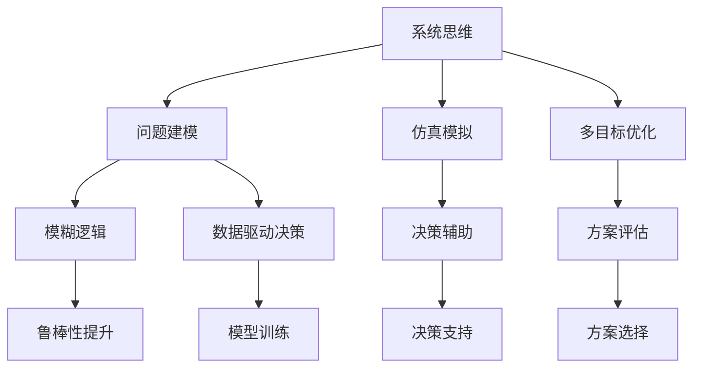

                 

# 系统思考与问题解决能力

> 关键词：系统思维, 问题建模, 仿真模拟, 多目标优化, 模糊逻辑, 数据驱动决策

## 1. 背景介绍

### 1.1 问题由来
在科技快速发展的今天，系统复杂性不断增加，单个要素的优化已经不能满足需求，如何从系统整体出发，实现全局最优，是摆在企业决策者面前的一大难题。系统思考与问题解决能力，提供了一种以系统视角解决复杂问题的方法论，能够帮助企业和组织在动态变化的环境中做出更为精准、高效的决策。

### 1.2 问题核心关键点
系统思考与问题解决能力，是一种将系统作为整体进行思考和处理问题的方法论，涵盖了系统思维、问题建模、仿真模拟、多目标优化、模糊逻辑和数据驱动决策等核心概念，能够帮助决策者从局部到整体，从静态到动态，从确定性到不确定性的多个维度审视问题，实现系统最优解。

### 1.3 问题研究意义
系统思考与问题解决能力，不仅对于企业决策者具有重要意义，更是推动系统工程、复杂系统管理、人工智能等多个领域发展的核心工具。通过掌握系统思考与问题解决能力，企业和组织能够更有效地应对复杂环境，提升决策科学性和执行力，实现可持续发展。

## 2. 核心概念与联系

### 2.1 核心概念概述

系统思考与问题解决能力涉及多个关键概念，以下将详细介绍这些核心概念及其相互联系。

- **系统思维(System Thinking)**：从系统的视角出发，考虑系统各部分之间的相互影响和依赖关系，实现整体最优。
- **问题建模(Problem Modeling)**：对现实问题进行抽象建模，转化为系统思考能够处理的形式。
- **仿真模拟(Simulation Modeling)**：通过建立仿真模型，对系统行为进行模拟和预测，评估方案效果。
- **多目标优化(Multi-Objective Optimization)**：在考虑多个目标的情况下，进行最优化的决策过程。
- **模糊逻辑(Fuzzy Logic)**：处理不确定性和模糊性问题，提高决策的鲁棒性。
- **数据驱动决策(Data-Driven Decision Making)**：基于数据分析和挖掘，进行决策支持。

这些概念之间的联系可以通过以下Mermaid流程图来展示：



这个流程图展示系统思考与问题解决能力的关键概念及其之间的关系：

1. 系统思维提供系统视角，问题建模将问题转化为系统能够处理的形式。
2. 仿真模拟和数据驱动决策为决策提供辅助工具。
3. 多目标优化在多个目标间权衡，模糊逻辑处理不确定性，共同支持决策。

这些概念共同构成了系统思考与问题解决能力的基本框架，帮助决策者更好地理解和解决复杂问题。

## 3. 核心算法原理 & 具体操作步骤
### 3.1 算法原理概述

系统思考与问题解决能力的核心在于将问题建模和分析转化为数学模型，通过仿真模拟和优化算法进行求解，最终得到决策方案。其核心算法原理包括以下几个步骤：

1. **问题建模**：将现实问题转化为系统模型，确定系统边界、要素、关系等关键变量。
2. **仿真模拟**：建立系统仿真模型，对模型进行验证和模拟，分析系统行为。
3. **多目标优化**：在考虑多个目标的情况下，确定优化方向和方案。
4. **模糊逻辑处理**：对系统中的不确定性进行建模和处理，提高决策鲁棒性。
5. **数据驱动决策**：基于历史数据和实时数据，进行决策支持，优化决策过程。

### 3.2 算法步骤详解

#### 3.2.1 问题建模

问题建模是系统思考与问题解决能力的基础，通过抽象建模，将现实问题转化为系统模型。具体步骤如下：

1. **确定系统边界**：明确问题的边界范围，包括时间、空间、功能等方面的限制。
2. **识别要素和关系**：分析问题中的关键要素和要素之间的关系，确定系统结构。
3. **量化变量**：对要素和关系进行量化，用数学表达式或仿真模型表达。

#### 3.2.2 仿真模拟

仿真模拟是验证和分析系统模型的重要工具。具体步骤如下：

1. **建立仿真模型**：根据问题建模结果，建立仿真模型。可以使用系统动力学软件（如Vensim、AnyLogic等）或编程语言（如Python、MATLAB等）进行建模。
2. **模型验证**：对模型进行验证，确保模型能够准确反映现实系统行为。
3. **模拟分析**：通过仿真模拟，分析系统的行为和变化趋势，评估方案效果。

#### 3.2.3 多目标优化

多目标优化是系统思考与问题解决能力的核心算法之一。具体步骤如下：

1. **确定优化目标**：明确优化目标，包括系统性能、成本、时间等。
2. **量化优化指标**：对优化目标进行量化，确定评价指标。
3. **建立优化模型**：将优化目标转化为数学模型，包括目标函数和约束条件。
4. **求解优化问题**：使用优化算法求解优化问题，确定最优解。

#### 3.2.4 模糊逻辑处理

模糊逻辑是处理不确定性和模糊性问题的有效工具。具体步骤如下：

1. **确定模糊变量**：识别系统中的不确定性和模糊性问题，定义模糊变量。
2. **建立模糊规则**：根据领域知识和经验，建立模糊规则。
3. **模糊推理**：对模糊规则进行推理，得出模糊输出。
4. **去模糊处理**：对模糊输出进行去模糊化处理，得到清晰结果。

#### 3.2.5 数据驱动决策

数据驱动决策是系统思考与问题解决能力的实用工具。具体步骤如下：

1. **收集和整理数据**：收集历史数据和实时数据，整理数据格式。
2. **数据分析和挖掘**：对数据进行分析和挖掘，提取有用信息。
3. **建立数据模型**：建立数据模型，进行预测和优化。
4. **评估和反馈**：对决策结果进行评估，反馈到系统优化过程中。

### 3.3 算法优缺点

系统思考与问题解决能力具有以下优点：

1. **全局视角**：能够从系统整体出发，避免局部最优问题。
2. **鲁棒性强**：能够处理不确定性和模糊性问题，提高决策鲁棒性。
3. **灵活性高**：能够根据实际情况进行调整和优化，适应性强。

同时，该方法也存在一定的局限性：

1. **建模复杂**：问题建模需要深厚的领域知识和经验，难度较大。
2. **计算量大**：仿真模拟和优化算法需要大量计算资源，效率较低。
3. **数据要求高**：数据驱动决策需要高质量、大样本的数据，获取难度大。

尽管存在这些局限性，但就目前而言，系统思考与问题解决能力是解决复杂问题的有效方法，具有广泛的应用前景。未来相关研究的重点在于如何简化问题建模过程，提高算法效率，增强数据驱动决策的可靠性。

### 3.4 算法应用领域

系统思考与问题解决能力在多个领域中都有广泛应用，以下是几个典型应用领域：

- **企业决策支持**：在企业战略规划、运营管理、供应链优化等方面，提供决策支持。
- **城市规划管理**：在城市交通、环保、公共安全等方面，进行系统设计和优化。
- **环境治理**：在空气质量、水质、污染源控制等方面，提供科学决策支持。
- **智能制造**：在生产计划、设备维护、资源分配等方面，进行优化和控制。
- **金融风险管理**：在金融市场预测、风险评估、投资策略等方面，进行决策支持。

这些领域中，系统思考与问题解决能力帮助企业和组织提升了决策科学性和执行力，实现了系统最优解。随着技术的发展，系统思考与问题解决能力的应用将更加广泛和深入。

## 4. 数学模型和公式 & 详细讲解 & 举例说明

### 4.1 数学模型构建

系统思考与问题解决能力涉及多个数学模型，以下将详细介绍这些数学模型及其构建过程。

#### 4.1.1 线性规划模型

线性规划模型是优化问题的一种常见形式，用于求解在多个目标之间进行平衡的优化问题。其数学模型为：

$$
\begin{aligned}
\max & \quad \sum_{i=1}^{m} c_i x_i \\
\text{subject to} & \quad \sum_{i=1}^{n} a_{ij} x_i \leq b_j, \quad j=1,2,...,p \\
& \quad x_i \geq 0, \quad i=1,2,...,m
\end{aligned}
$$

其中，$c_i$ 为目标系数，$a_{ij}$ 为约束系数，$b_j$ 为约束值，$x_i$ 为决策变量。

#### 4.1.2 多目标优化模型

多目标优化模型用于在多个目标之间进行权衡和优化。其数学模型为：

$$
\begin{aligned}
\min & \quad \sum_{i=1}^{m} w_i f_i(x) \\
\text{subject to} & \quad g_j(x) \leq 0, \quad j=1,2,...,p
\end{aligned}
$$

其中，$f_i(x)$ 为单目标函数，$g_j(x)$ 为约束函数，$w_i$ 为权重系数。

#### 4.1.3 模糊逻辑模型

模糊逻辑模型用于处理不确定性和模糊性问题。其数学模型为：

$$
\begin{aligned}
A_i &= \frac{1}{\sum_{k=1}^{m} \lambda_{ik}} \sum_{k=1}^{m} \lambda_{ik} z_{ik} \\
B_j &= \frac{1}{\sum_{l=1}^{n} \mu_{jl}} \sum_{l=1}^{n} \mu_{jl} x_{jl} \\
Z &= \frac{1}{\sum_{i=1}^{p} \sum_{j=1}^{q} \sigma_{ij}} \sum_{i=1}^{p} \sum_{j=1}^{q} \sigma_{ij} A_i B_j
\end{aligned}
$$

其中，$A_i$ 和 $B_j$ 分别为模糊变量和规则的输出，$Z$ 为模糊逻辑的输出。

### 4.2 公式推导过程

#### 4.2.1 线性规划模型的推导

线性规划模型的求解过程包括：

1. **建立数学模型**：根据问题描述，建立线性规划模型。
2. **求解线性方程组**：将线性规划模型转化为线性方程组，使用单纯形法等求解方法。
3. **求解优化问题**：根据求解结果，进行优化决策。

#### 4.2.2 多目标优化模型的推导

多目标优化模型的求解过程包括：

1. **建立数学模型**：根据问题描述，建立多目标优化模型。
2. **求解多目标优化问题**：使用权重法和帕累托优化等方法，求解多目标优化问题。
3. **评估优化结果**：根据求解结果，进行优化决策。

#### 4.2.3 模糊逻辑模型的推导

模糊逻辑模型的求解过程包括：

1. **建立模糊规则**：根据领域知识和经验，建立模糊规则。
2. **进行模糊推理**：使用模糊推理规则，对模糊变量进行处理。
3. **去模糊化处理**：将模糊输出进行去模糊化处理，得到清晰结果。

### 4.3 案例分析与讲解

#### 4.3.1 线性规划模型案例

某物流公司需要运输一批货物，有三种运输方式可供选择：公路、铁路和水运。每种运输方式都有不同的成本和效率，需要确定最优的运输方案。

建立线性规划模型如下：

目标函数：

$$
\min \quad c_1 x_1 + c_2 x_2 + c_3 x_3
$$

约束条件：

$$
\begin{aligned}
& a_{11} x_1 + a_{12} x_2 + a_{13} x_3 \geq b_1 \\
& a_{21} x_1 + a_{22} x_2 + a_{23} x_3 \geq b_2 \\
& a_{31} x_1 + a_{32} x_2 + a_{33} x_3 \geq b_3 \\
& x_1 \geq 0, \quad x_2 \geq 0, \quad x_3 \geq 0
\end{aligned}
$$

求解得到最优解为 $(x_1, x_2, x_3)$，即为最优运输方案。

#### 4.3.2 多目标优化模型案例

某企业需要在产品研发、市场营销和生产调度之间进行权衡，确定最优的资源分配方案。

建立多目标优化模型如下：

目标函数：

$$
\begin{aligned}
\min & \quad f_1(x) = w_{1,1} p_1(x) + w_{1,2} s_1(x) + w_{1,3} c_1(x) \\
\min & \quad f_2(x) = w_{2,1} p_2(x) + w_{2,2} s_2(x) + w_{2,3} c_2(x)
\end{aligned}
$$

约束条件：

$$
\begin{aligned}
& p_1(x) \leq p_{1,\max} \\
& s_1(x) \leq s_{1,\max} \\
& c_1(x) \leq c_{1,\max} \\
& p_2(x) \leq p_{2,\max} \\
& s_2(x) \leq s_{2,\max} \\
& c_2(x) \leq c_{2,\max} \\
& x \geq 0
\end{aligned}
$$

求解得到最优解为 $(x, w_{1,1}, w_{1,2}, w_{1,3}, w_{2,1}, w_{2,2}, w_{2,3})$，即为最优资源分配方案。

#### 4.3.3 模糊逻辑模型案例

某医院需要对患者的病情进行诊断，需要考虑患者的年龄、病史和症状等多个模糊因素。

建立模糊逻辑模型如下：

$$
A_i = \frac{1}{\sum_{k=1}^{m} \lambda_{ik}} \sum_{k=1}^{m} \lambda_{ik} z_{ik} \\
B_j = \frac{1}{\sum_{l=1}^{n} \mu_{jl}} \sum_{l=1}^{n} \mu_{jl} x_{jl} \\
Z = \frac{1}{\sum_{i=1}^{p} \sum_{j=1}^{q} \sigma_{ij}} \sum_{i=1}^{p} \sum_{j=1}^{q} \sigma_{ij} A_i B_j
$$

其中，$A_i$ 和 $B_j$ 分别为年龄、病史和症状的模糊变量和规则的输出，$Z$ 为诊断结果的模糊输出。

## 5. 项目实践：代码实例和详细解释说明

### 5.1 开发环境搭建

在系统思考与问题解决能力的开发实践中，Python和MATLAB是常用的工具。以下是Python开发环境的搭建过程：

1. 安装Anaconda：从官网下载并安装Anaconda，用于创建独立的Python环境。
2. 创建并激活虚拟环境：
```bash
conda create -n my_env python=3.8 
conda activate my_env
```
3. 安装相关库：
```bash
pip install numpy scipy sympy scipy-optimize
```

完成上述步骤后，即可在`my_env`环境中开始系统思考与问题解决能力的实践。

### 5.2 源代码详细实现

这里我们以线性规划模型为例，给出Python代码实现。

```python
from scipy.optimize import linprog

# 定义目标函数和约束条件
c = [1, 2, 3]
A = [[-1, -1, -1], [1, 1, 1]]
b = [4, 5]
x0_bounds = (0, None)
x1_bounds = (0, None)
x2_bounds = (0, None)

# 求解线性规划问题
result = linprog(c, A_ub=A, b_ub=b, bounds=[x0_bounds, x1_bounds, x2_bounds])
print("最优解为：", result.x)
print("目标函数值为：", result.fun)
```

### 5.3 代码解读与分析

这里我们详细解读一下关键代码的实现细节：

- `linprog`函数：用于求解线性规划问题，需要提供目标函数系数、约束条件矩阵和向量、决策变量边界等参数。
- `c`变量：目标函数系数，表示每个决策变量的权值。
- `A`变量：约束条件矩阵，表示每个决策变量对应的约束条件。
- `b`变量：约束条件向量，表示每个约束条件的限制值。
- `x0_bounds`、`x1_bounds`、`x2_bounds`变量：决策变量的边界，表示每个决策变量的取值范围。
- `result`变量：包含求解结果，包括最优解、目标函数值等。
- `result.x`：最优解向量。
- `result.fun`：目标函数值。

可以看到，通过`linprog`函数，我们可以快速求解线性规划问题，得到最优解。

## 6. 实际应用场景

### 6.1 智能制造优化

在智能制造领域，系统思考与问题解决能力可以应用于生产计划、设备维护、资源分配等方面，实现生产系统的优化和控制。通过建立系统模型，对生产过程进行仿真模拟和优化，可以实现生产效率的最大化，降低生产成本。

### 6.2 城市交通管理

在城市交通管理领域，系统思考与问题解决能力可以应用于交通流量控制、交通信号优化、公共交通调度等方面，实现交通系统的优化。通过建立系统模型，对交通系统进行仿真模拟和优化，可以实现交通流量的均衡，减少拥堵现象。

### 6.3 金融风险管理

在金融风险管理领域，系统思考与问题解决能力可以应用于市场预测、风险评估、投资策略等方面，实现金融风险的管理和控制。通过建立系统模型，对金融市场进行仿真模拟和优化，可以实现风险的最小化，提高投资收益。

### 6.4 未来应用展望

随着系统思考与问题解决能力的发展，其在更多领域的应用前景将更加广阔。

1. **医疗健康**：在医疗健康领域，系统思考与问题解决能力可以应用于疾病诊断、治疗方案、资源分配等方面，实现医疗系统的优化和控制。通过建立系统模型，对医疗系统进行仿真模拟和优化，可以实现医疗资源的优化配置，提高治疗效果。
2. **环境保护**：在环境保护领域，系统思考与问题解决能力可以应用于空气质量控制、水质监测、污染源控制等方面，实现环境保护的优化和控制。通过建立系统模型，对环境系统进行仿真模拟和优化，可以实现环境污染物的控制，提高环境保护效果。
3. **农业生产**：在农业生产领域，系统思考与问题解决能力可以应用于农业生产计划、作物管理、资源分配等方面，实现农业生产的优化和控制。通过建立系统模型，对农业生产系统进行仿真模拟和优化，可以实现农业生产的优化配置，提高农业生产效率。

## 7. 工具和资源推荐

### 7.1 学习资源推荐

为了帮助开发者系统掌握系统思考与问题解决能力的理论基础和实践技巧，这里推荐一些优质的学习资源：

1. **《系统思考：系统的分析与建模》**：系统思考的权威书籍，详细介绍了系统思考的基本原理和应用方法。
2. **Coursera《系统思考与建模》课程**：由MIT教授主讲，介绍了系统思考的基本概念和建模方法，课程内容丰富，易于理解。
3. **《多目标优化：理论与方法》**：多目标优化的经典教材，系统介绍了多目标优化理论和方法，是系统思考与问题解决能力的重要参考。
4. **Udemy《模糊逻辑与模糊控制系统》课程**：详细介绍了模糊逻辑的基本原理和模糊控制系统的方法，课程内容实用，实践性强。
5. **《Python科学计算与数据分析》书籍**：介绍了Python在科学计算和数据分析中的应用，结合实际案例，易于实践。

通过对这些资源的学习实践，相信你一定能够系统掌握系统思考与问题解决能力，并应用于解决实际问题。

### 7.2 开发工具推荐

高效的开发离不开优秀的工具支持。以下是几款用于系统思考与问题解决能力开发的常用工具：

1. **Anaconda**：Python的科学计算环境，易于安装和使用，支持多种科学计算和数据分析库。
2. **MATLAB**：数学计算和仿真模拟的工具，具有强大的数值计算和可视化功能。
3. **Vensim**：系统动力学软件，用于建立和仿真系统模型。
4. **Pyomo**：基于Python的多目标优化库，支持线性规划、非线性规划、动态规划等多种优化问题。
5. **YALCsb**：用于模糊逻辑系统建模和仿真模拟的工具，支持模糊逻辑规则的建立和处理。

合理利用这些工具，可以显著提升系统思考与问题解决能力的开发效率，加快创新迭代的步伐。

### 7.3 相关论文推荐

系统思考与问题解决能力的发展源于学界的持续研究。以下是几篇奠基性的相关论文，推荐阅读：

1. **《System Dynamics Modeling and Simulation》**：系统动力学领域的重要书籍，介绍了系统动态建模和仿真模拟的方法和工具。
2. **《Multi-Objective Optimization in Decision Making》**：多目标优化领域的经典论文，介绍了多目标优化的理论和方法。
3. **《Fuzzy Logic: Principles and Applications》**：模糊逻辑领域的经典教材，系统介绍了模糊逻辑的基本原理和应用方法。
4. **《Data-Driven Decision Making in Complex Systems》**：数据驱动决策领域的经典论文，介绍了数据驱动决策的理论和方法。

这些论文代表了大规模语言模型微调技术的发展脉络。通过学习这些前沿成果，可以帮助研究者把握学科前进方向，激发更多的创新灵感。

## 8. 总结：未来发展趋势与挑战

### 8.1 总结

本文对系统思考与问题解决能力进行了全面系统的介绍。首先阐述了系统思考与问题解决能力的研究背景和意义，明确了其作为解决复杂问题的方法论的价值。其次，从原理到实践，详细讲解了系统思考与问题解决能力的数学模型和核心算法，给出了代码实现和案例分析。同时，本文还广泛探讨了系统思考与问题解决能力在多个领域的应用前景，展示了其广阔的应用前景。

通过本文的系统梳理，可以看到，系统思考与问题解决能力作为解决复杂问题的有效方法，已经广泛应用于企业决策、城市规划、环境保护等多个领域，帮助企业和组织提升了决策科学性和执行力，实现了系统最优解。未来，随着系统思考与问题解决能力的不断发展，将在更多领域得到应用，为人类认知智能的进化带来深远影响。

### 8.2 未来发展趋势

展望未来，系统思考与问题解决能力将呈现以下几个发展趋势：

1. **智能决策系统**：随着人工智能技术的发展，系统思考与问题解决能力将与人工智能技术深度结合，实现智能决策系统的构建。智能决策系统能够自动分析问题，提出优化方案，提升决策效率和质量。
2. **动态优化**：系统思考与问题解决能力将具备动态优化的能力，能够实时监测和优化系统，适应复杂多变的环境变化。通过建立实时动态模型，优化系统的行为和性能。
3. **跨学科融合**：系统思考与问题解决能力将与多种学科进行深度融合，如经济学、社会学、生态学等。跨学科的研究将拓展系统思考与问题解决能力的应用领域，提升系统的全面性和科学性。
4. **数据驱动**：系统思考与问题解决能力将更加依赖数据驱动，通过大数据分析和机器学习技术，提升系统的预测和优化能力。数据驱动的决策支持系统将成为系统思考与问题解决能力的重要组成部分。
5. **云平台支持**：系统思考与问题解决能力将与云计算平台深度结合，实现分布式计算和数据处理。云平台能够提供强大的计算和存储资源，支持大规模系统的仿真模拟和优化。

这些趋势将推动系统思考与问题解决能力向更加智能化、自动化、全面化的方向发展，为复杂系统的管理提供更强大的支持。

### 8.3 面临的挑战

尽管系统思考与问题解决能力已经取得了显著进展，但在迈向更加智能化、普适化应用的过程中，仍然面临诸多挑战：

1. **建模复杂性**：系统思考与问题解决能力需要深厚的领域知识和经验，建模复杂，难以广泛应用。
2. **计算资源需求高**：系统建模和优化需要大量计算资源，数据驱动的决策支持系统需要处理海量数据，计算资源需求高。
3. **多目标优化困难**：在多目标优化中，目标之间存在冲突，难以找到全局最优解。
4. **模糊逻辑处理难度大**：模糊逻辑处理不确定性和模糊性问题，需要设计合理的模糊规则，处理难度大。
5. **数据获取困难**：数据驱动决策需要高质量、大样本的数据，数据获取难度大。

正视这些挑战，积极应对并寻求突破，将是大规模语言模型微调技术走向成熟的必由之路。相信随着学界和产业界的共同努力，这些挑战终将一一被克服，系统思考与问题解决能力必将在构建人机协同的智能系统中扮演越来越重要的角色。

### 8.4 研究展望

面对系统思考与问题解决能力面临的挑战，未来的研究需要在以下几个方面寻求新的突破：

1. **简化问题建模**：通过引入自动化建模工具和智能化建模技术，简化问题建模过程，降低建模复杂度。
2. **提高计算效率**：通过分布式计算、加速算法等技术，提高系统建模和优化的计算效率，降低计算资源需求。
3. **改进多目标优化算法**：引入新的优化算法和策略，如遗传算法、粒子群优化等，提升多目标优化的效果，找到全局最优解。
4. **增强模糊逻辑处理能力**：引入新的模糊逻辑模型和处理技术，增强模糊逻辑处理不确定性和模糊性的能力。
5. **加强数据驱动决策能力**：引入新的数据处理和分析技术，提升数据驱动决策的可靠性和准确性。

这些研究方向的探索，必将引领系统思考与问题解决能力迈向更高的台阶，为复杂系统的管理和优化提供更强大的支持。面向未来，系统思考与问题解决能力还需要与其他人工智能技术进行更深入的融合，如知识表示、因果推理、强化学习等，多路径协同发力，共同推动系统工程和复杂系统管理的发展。只有勇于创新、敢于突破，才能不断拓展系统思考与问题解决能力的边界，让人工智能技术更好地造福人类社会。

## 9. 附录：常见问题与解答

**Q1：系统思考与问题解决能力是否适用于所有领域？**

A: 系统思考与问题解决能力适用于绝大多数领域，特别是在复杂系统管理和决策支持方面具有重要应用价值。但在某些特定领域，如艺术创作、文学创作等，系统思考与问题解决能力可能不适用。

**Q2：如何选择合适的系统建模工具？**

A: 选择合适的系统建模工具需要考虑系统的复杂性、数据获取的难度、计算资源的需求等因素。一般而言，数学模型可以使用MATLAB进行仿真模拟和优化，而Python则更适合用于数据分析和决策支持。

**Q3：系统思考与问题解决能力是否需要数学和编程基础？**

A: 系统思考与问题解决能力需要一定的数学和编程基础，但可以通过学习相关的书籍和课程逐步掌握。没有基础的人士可以通过自学或参加培训课程，逐步掌握相关知识。

**Q4：系统思考与问题解决能力在实践中有哪些挑战？**

A: 系统思考与问题解决能力在实践中的挑战主要包括：建模复杂、计算资源需求高、多目标优化困难、模糊逻辑处理难度大、数据获取困难等。需要根据具体情况，选择合适的工具和方法进行优化和改进。

**Q5：未来系统思考与问题解决能力的发展方向是什么？**

A: 未来系统思考与问题解决能力的发展方向包括智能化决策系统、动态优化、跨学科融合、数据驱动、云平台支持等。这些方向将推动系统思考与问题解决能力向更加智能化、自动化、全面化的方向发展。

总之，系统思考与问题解决能力作为解决复杂问题的有效方法，已经广泛应用于企业决策、城市规划、环境保护等多个领域，帮助企业和组织提升了决策科学性和执行力，实现了系统最优解。未来，随着系统思考与问题解决能力的不断发展，将在更多领域得到应用，为人类认知智能的进化带来深远影响。

