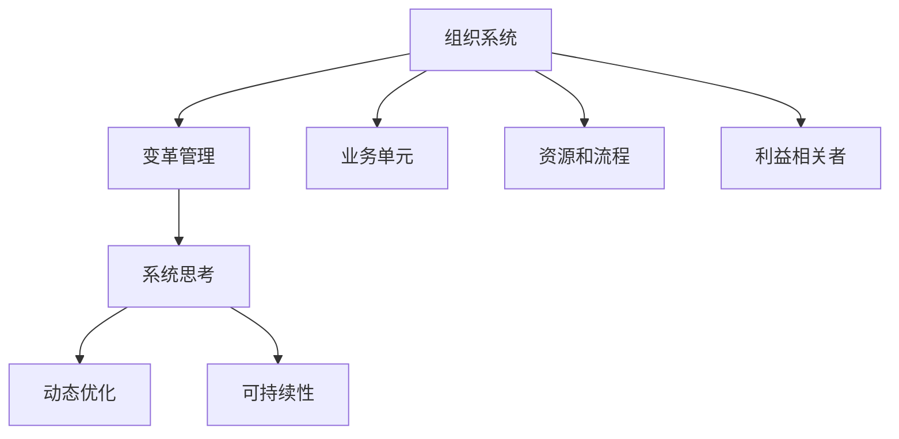

                 

# 系统思考在组织变革中的应用

## 1. 背景介绍

在当今复杂多变的商业环境中，组织变革已成为企业提升竞争力的必由之路。传统上，组织变革往往着眼于静态的结构调整和流程优化，而现代企业则日益注重通过系统思考，全面、动态地审视组织变革过程，以期在快速变化的市场环境中，保持持续创新和高效运行。

### 1.1 问题由来

近年来，随着数字化转型和全球化的深入发展，企业所面临的外部环境和内部结构都在发生深刻变化。信息技术的迅猛进步、消费者需求的快速迭代、全球经济的不确定性等因素，都对企业的管理模式和运营策略提出了更高的要求。传统的静态、线性的组织变革模式，已难以适应现代企业的复杂需求。

系统思考作为一种结构化、动态化的分析工具，可以帮助企业在变革过程中，系统性地识别问题、评估影响、制定策略，确保变革方案的全面性和前瞻性。通过系统思考，企业不仅可以优化现有业务流程，更能够在动态环境中把握全局，实现持续的自我更新和优化。

### 1.2 问题核心关键点

系统思考的核心在于通过整体观念、动态反馈和层次分析，全面地考察组织系统中的各个要素，识别各要素间的关联和相互作用，从而制定出综合、科学的变革策略。

系统思考的核心概念包括：

- **整体观念**：从组织系统的全局视角出发，识别各业务单元间的相互依赖和影响。
- **动态反馈**：关注组织系统的运行过程，理解各要素间的动态关系和因果链路。
- **层次分析**：将组织系统分层划分，识别不同层级间的差异和协同。
- **相互作用**：关注各要素间的交互作用，理解系统的复杂性和多样性。
- **因果关系**：识别和揭示组织系统中各要素间的因果关系，指导决策和行动。

这些核心概念构成了系统思考的基本框架，帮助企业从宏观到微观、从静态到动态地理解组织系统，制定出全面、科学、可持续的变革策略。

## 2. 核心概念与联系

### 2.1 核心概念概述

为更好地理解系统思考在组织变革中的应用，本节将介绍几个关键概念及其相互联系：

- **组织系统**：指企业内部的所有业务单元、资源和流程，包括员工、客户、供应商等利益相关者。
- **变革管理**：指企业在战略、结构、流程、文化等方面进行系统性调整的过程。
- **系统思考**：通过整体观念、动态反馈、层次分析等方法，全面、动态地考察组织系统，指导变革策略的制定和实施。
- **动态优化**：通过持续改进和优化，不断提升组织系统的效率和适应性。
- **可持续性**：通过系统思考，确保变革方案的长期稳定和可持续发展。

这些核心概念之间的逻辑关系可以通过以下Mermaid流程图来展示：



这个流程图展示了一个典型的组织系统及其在系统思考指导下进行变革的全过程。组织系统的各个要素通过系统思考和变革管理，实现动态优化和可持续性发展。

## 3. 核心算法原理 & 具体操作步骤

### 3.1 算法原理概述

系统思考在组织变革中的应用，本质上是一种以整体观念、动态反馈和层次分析为基础，通过识别组织系统中各要素的相互作用和因果关系，制定综合、科学、可持续变革策略的方法。其核心思想是：通过系统思考，全面、动态地审视组织系统的各个层面，识别变革过程中的关键要素和关系，从而指导组织变革的实施。

系统思考的原理包括以下几个方面：

1. **整体观念**：从组织系统的全局视角出发，识别各业务单元间的相互依赖和影响。
2. **动态反馈**：关注组织系统的运行过程，理解各要素间的动态关系和因果链路。
3. **层次分析**：将组织系统分层划分，识别不同层级间的差异和协同。
4. **相互作用**：关注各要素间的交互作用，理解系统的复杂性和多样性。
5. **因果关系**：识别和揭示组织系统中各要素间的因果关系，指导决策和行动。

### 3.2 算法步骤详解

基于系统思考的组织变革管理，通常包括以下几个关键步骤：

**Step 1: 系统评估与现状分析**

- **收集数据**：收集企业内部的业务数据、财务数据、员工反馈、客户满意度等，全面了解组织系统的现状和问题。
- **数据建模**：使用系统动力学模型(SD)、网络分析工具等，构建组织系统的动态模型，识别系统中的关键变量和参数。
- **现状分析**：通过数据分析和模型模拟，识别组织系统中的瓶颈和问题，评估其对业务目标的影响。

**Step 2: 目标设定与战略规划**

- **目标设定**：根据现状分析结果，设定组织变革的长期和短期目标，确保目标的全面性和可实现性。
- **战略规划**：制定变革的战略框架，包括业务模式、组织结构、流程优化、技术应用等方面的策略。

**Step 3: 实施与执行**

- **变革管理**：在战略框架指导下，实施具体的变革措施，包括业务重组、流程优化、技术应用等。
- **动态监控**：建立动态监控机制，持续跟踪变革过程中的各项指标和关键变量，及时调整策略。

**Step 4: 反馈与优化**

- **持续改进**：根据动态监控结果，进行持续的改进和优化，提升组织系统的效率和适应性。
- **反馈循环**：建立反馈循环机制，不断从实施过程中收集信息，回传到决策层，指导后续的优化和调整。

**Step 5: 评估与复盘**

- **效果评估**：在变革实施完成后，进行全面的效果评估，衡量各项指标的改善情况。
- **复盘总结**：总结变革过程中的经验教训，为后续的变革提供参考和借鉴。

### 3.3 算法优缺点

系统思考在组织变革中的应用具有以下优点：

1. **全面性**：系统思考强调整体观念和动态反馈，能够全面识别和分析组织系统中的各个要素和关系，避免遗漏和片面。
2. **前瞻性**：通过层次分析和因果关系，系统思考能够预测变革措施的长期影响，确保变革策略的科学性和可持续性。
3. **适应性**：动态监控和反馈循环机制，使组织能够及时调整和优化变革措施，增强系统的适应性和灵活性。

同时，系统思考也存在一些局限性：

1. **复杂性**：系统思考需要深入理解和分析组织系统的各个层面，对企业和管理者的知识要求较高。
2. **执行难度**：系统思考的实施需要时间和资源，对于变革管理团队的能力和执行效率提出了较高要求。
3. **数据依赖**：系统思考依赖于高质量的数据和准确的模型，对数据收集和分析的准确性要求较高。

尽管存在这些局限性，但系统思考作为一种系统性、动态化的变革方法，在现代企业管理中已经得到了广泛的应用，成为组织变革的重要工具和方法。

### 3.4 算法应用领域

系统思考在组织变革中的应用，涵盖了企业管理的各个层面，具体包括：

- **战略规划**：通过系统思考，全面评估企业内外部环境，制定科学、可持续的战略规划。
- **组织设计**：识别组织系统中的关键要素和关系，优化组织结构，提高效率和灵活性。
- **流程优化**：使用系统动力学模型，优化业务流程，减少瓶颈和浪费，提升整体绩效。
- **技术应用**：通过系统思考，选择适合的技术方案，提升企业的数字化转型水平。
- **文化变革**：通过系统思考，识别文化中的瓶颈和问题，推动企业文化和行为模式的变革。
- **风险管理**：使用系统思考，识别和评估组织系统中的风险，制定应对策略。

这些应用领域展示了系统思考在组织变革中的广泛价值和潜力。

## 4. 数学模型和公式 & 详细讲解  
### 4.1 数学模型构建

本节将使用数学语言对系统思考在组织变革中的应用进行更加严格的刻画。

记组织系统为 $S$，其关键要素和关系可以表示为一系列变量和参数 $x_1, x_2, \ldots, x_n$ 和 $p_1, p_2, \ldots, p_m$。假设组织系统的动态演化可以用以下微分方程组描述：

$$
\frac{dx_i}{dt} = f_i(x_1, x_2, \ldots, x_n, p_1, p_2, \ldots, p_m)
$$

其中 $f_i$ 为状态变量 $x_i$ 的变化率，依赖于其他状态变量和系统参数。组织系统的目标可以表示为最大化或最小化某个目标函数 $J(x_1, x_2, \ldots, x_n)$。

系统思考的目标是在给定的约束条件下，找到一组最优的策略参数 $\pi$，使得目标函数 $J(x_1, x_2, \ldots, x_n)$ 达到最大或最小。具体来说，系统思考的优化问题可以表示为：

$$
\mathop{\arg\min}_{\pi} J(x_1, x_2, \ldots, x_n) \text{ s.t. } \frac{dx_i}{dt} = f_i(x_1, x_2, \ldots, x_n, \pi)
$$

### 4.2 公式推导过程

以下我们以组织系统中的业务流程优化为例，推导系统思考的优化模型。

假设组织系统中的某个业务流程可以表示为一系列任务 $T = \{t_1, t_2, \ldots, t_n\}$，每个任务 $t_i$ 需要消耗一定的资源 $r_i$ 和产生一定的价值 $v_i$。假设资源总量为 $R$，组织系统的目标是最大化总价值 $J$。

首先，将业务流程的优化问题表示为线性规划模型：

$$
\max \sum_{i=1}^n v_i \text{ s.t. } \sum_{i=1}^n r_i \leq R
$$

然后，引入系统动力学模型，将业务流程的优化问题转化为动态优化问题：

$$
\dot{R} = -\sum_{i=1}^n r_i(t)
$$

$$
\dot{v_i} = v_i - \sum_{j=1}^m p_j(t) r_j(t)
$$

其中 $p_j$ 表示业务流程中的关键性能指标，如处理时间、成本等。通过求解上述动态优化问题，可以确定最优的业务流程安排，实现资源的最优配置和价值最大化。

### 4.3 案例分析与讲解

假设某企业希望优化其供应链管理流程，目标是最大化客户满意度 $J$，约束条件为供应链总成本 $R$。通过系统思考，企业可以构建如下模型：

1. **变量定义**：
   - $t_i$：第 $i$ 个供应链环节的执行时间
   - $r_i$：第 $i$ 个供应链环节的资源消耗
   - $p_i$：第 $i$ 个供应链环节的关键性能指标（如处理时间、成本）
   - $v_i$：第 $i$ 个供应链环节的客户满意度贡献
   - $R$：供应链总成本

2. **目标函数**：
   $$
   J = \sum_{i=1}^n v_i
   $$

3. **约束条件**：
   $$
   \dot{R} = -\sum_{i=1}^n r_i(t)
   $$

通过系统动力学模型，可以动态模拟供应链流程的资源消耗和价值创造过程，识别出关键环节和瓶颈，制定相应的优化措施。例如，通过优化供应链环节的顺序和资源分配，降低总成本，提升客户满意度。

## 5. 项目实践：代码实例和详细解释说明
### 5.1 开发环境搭建

在进行系统思考的组织变革实践前，我们需要准备好开发环境。以下是使用Python进行系统动力学模拟的环境配置流程：

1. 安装Anaconda：从官网下载并安装Anaconda，用于创建独立的Python环境。

2. 创建并激活虚拟环境：
```bash
conda create -n syssim-env python=3.8 
conda activate syssim-env
```

3. 安装必要的Python库：
```bash
pip install sympy scipy pandas matplotlib
```

4. 安装系统动力学仿真工具包：
```bash
pip install pyodes
```

完成上述步骤后，即可在`syssim-env`环境中开始系统思考的实践。

### 5.2 源代码详细实现

这里我们以供应链管理为例，展示如何使用Python和Sympy进行系统思考的模型构建和优化。

```python
from sympy import symbols, Eq, solve, diff
from sympy.stats import Normal, Symbolic

# 定义变量
t = Symbolic('t', positive=True)
r = Symbolic('r', positive=True)
p = Symbolic('p', positive=True)
v = Symbolic('v', positive=True)
R = Symbolic('R', positive=True)

# 定义状态变量和参数
x = [t, r, p, v, R]
theta = [0.1, 0.2, 0.3, 0.4, 0.5]  # 初始状态

# 定义微分方程
def dy_dt(x):
    dy_dt = []
    for i, xi in enumerate(x):
        # 业务流程优化模型
        if i == 0:
            dy_dt.append(-theta[i])
        elif i == 1:
            dy_dt.append(-theta[i])
        elif i == 2:
            dy_dt.append(theta[2] - theta[1]*theta[0])
        elif i == 3:
            dy_dt.append(theta[3] - theta[2]*theta[0])
        elif i == 4:
            dy_dt.append(-theta[4])
    return dy_dt

# 求解系统动力学方程
initial_conditions = {x[i]: theta[i] for i in range(5)}
solutions = solve(Eq(diff(x, t), dy_dt(x)), x)

# 计算目标函数
J = sum([v.subs(initial_conditions) for v in solutions[3]])

# 输出优化结果
print(f"Optimal solution: {solutions}")
print(f"Optimal J: {J.subs(initial_conditions)}")
```

### 5.3 代码解读与分析

让我们再详细解读一下关键代码的实现细节：

**变量定义**：
- `t`、`r`、`p`、`v`、`R`：分别表示时间、资源消耗、关键性能指标、客户满意度贡献、供应链总成本。

**状态变量和参数**：
- `x`：表示状态变量列表，`theta`：表示参数列表，初始状态设定为 `theta`。

**微分方程**：
- `dy_dt(x)` 函数定义了组织系统的微分方程，根据状态变量和参数，计算各状态变量的变化率。

**求解系统动力学方程**：
- 使用 `solve` 函数求解微分方程，得到状态变量的解。

**计算目标函数**：
- 根据目标函数表达式，计算出最大化的目标值 `J`。

**输出优化结果**：
- 输出优化后的状态变量解和目标函数值。

通过以上代码实现，我们可以看到，系统思考的组织变革管理方法可以通过数学建模和求解，全面分析组织系统中的动态关系，指导优化措施的制定和实施。

## 6. 实际应用场景

### 6.1 智能制造系统

在智能制造领域，系统思考的应用可以显著提升生产效率和质量控制。通过系统思考，制造企业可以全面识别和优化生产流程中的各个环节，识别瓶颈和风险，制定科学的生产计划和质量控制策略。

例如，某汽车制造企业通过系统思考，全面审视其生产流程中的关键节点，识别出装配线上的瓶颈工序，并制定相应的优化措施，显著提升了生产效率和产品质量。

### 6.2 医疗健康管理

在医疗健康领域，系统思考可以用于优化诊疗流程和资源配置，提升医疗服务质量和效率。通过系统思考，医疗机构可以全面识别诊疗过程中的关键环节和瓶颈，优化资源分配，提高诊疗效率和患者满意度。

例如，某医院通过系统思考，全面分析诊疗流程中的各个环节，识别出资源分配不均的问题，并优化了手术室、急诊室等关键环节的资源配置，显著提高了医疗服务的质量和效率。

### 6.3 金融风险管理

在金融领域，系统思考可以用于评估和控制风险，优化投资组合和资金配置。通过系统思考，金融机构可以全面识别市场风险、信用风险、操作风险等各类风险，制定科学的风险控制和投资策略。

例如，某保险公司通过系统思考，全面分析其风险管理体系中的各个环节，识别出关键风险点，并制定了科学的风险控制和投资策略，显著降低了其风险暴露。

### 6.4 未来应用展望

随着系统思考方法的发展和普及，其应用领域将不断拓展，涵盖更多复杂系统和动态环境。未来，系统思考将在更多行业和领域得到应用，为组织变革和创新带来新的突破。

在智慧城市治理中，系统思考可以用于优化城市交通、环境、公共服务等方面的管理，提升城市治理的智能化和效率化水平。在企业生产中，系统思考可以用于优化供应链、产品设计、营销策略等环节，提升企业的竞争力和市场响应速度。

总之，系统思考作为一种系统性、动态化的变革方法，将在未来发挥越来越重要的作用，为组织变革和创新提供强有力的工具和方法。

## 7. 工具和资源推荐
### 7.1 学习资源推荐

为了帮助开发者系统掌握系统思考的理论基础和实践技巧，这里推荐一些优质的学习资源：

1. 《系统思考导论》系列博文：由系统思考专家撰写，深入浅出地介绍了系统思考的基本概念和应用方法。

2. CS580《系统动力学》课程：麻省理工学院开设的系统动力学课程，提供系统动力学模型的理论基础和应用案例，是学习系统思考的良好起点。

3. 《系统思考》书籍：多伦多大学学者编写，全面介绍了系统思考的理论基础和应用案例，适合系统思考入门者和实践者阅读。

4. MIT SIMBIO网站：提供系统思考的工具和资源，包括系统动力学模型、仿真工具等，是系统思考学习的宝贵资源。

5. Udemy系统思考课程：Udemy上提供的系统思考在线课程，涵盖系统思考的理论和应用实践，适合学习者进行系统思考的实战练习。

通过对这些资源的学习实践，相信你一定能够快速掌握系统思考的精髓，并用于解决实际的组织变革问题。

### 7.2 开发工具推荐

高效的系统思考实践离不开优秀的工具支持。以下是几款用于系统思考的常用工具：

1. Python：作为系统思考的常用编程语言，Python提供了丰富的数学库和仿真工具，适合进行系统思考的建模和优化。

2. MATLAB/Simulink：MathWorks开发的系统动力学仿真工具，适合进行复杂的系统建模和仿真，支持可视化展示。

3. Vensim：Simulsoft开发的系统动力学仿真软件，支持多场景模拟和优化，适合进行组织系统的动态分析和优化。

4. AnyLogic：AnyLogic公司开发的系统仿真软件，支持复杂的系统建模和仿真，适合进行多智能体系统的分析和优化。

5. Steve Smith软件：Simulsoft公司开发的系统思考软件，支持系统动力学建模和仿真，适合进行组织系统的分析和优化。

合理利用这些工具，可以显著提升系统思考的开发效率，加快创新迭代的步伐。

### 7.3 相关论文推荐

系统思考的研究源于学界的持续探索。以下是几篇奠基性的相关论文，推荐阅读：

1. Systems Thinking and the Mind of the Future（《系统思考与未来思维》）：Stuart Weingart撰写，探讨了系统思考在组织变革中的应用方法和未来前景。

2. A Systematic Guide to System Dynamics Models（《系统动力学模型的系统化指南》）：BBC Marketguide出版，提供了系统动力学模型的建模和优化方法。

3. System Dynamics（《系统动力学》）：Dennis Meadows等作者，介绍了系统动力学模型的理论基础和应用案例，是系统思考的经典著作。

4. The Art of System Thinking（《系统思考的艺术》）：Pep formalde撰写，探讨了系统思考的基本原理和应用实践。

这些论文代表了大系统思考方法的发展脉络。通过学习这些前沿成果，可以帮助研究者把握学科前进方向，激发更多的创新灵感。

## 8. 总结：未来发展趋势与挑战

### 8.1 总结

本文对系统思考在组织变革中的应用进行了全面系统的介绍。首先阐述了系统思考的研究背景和应用意义，明确了系统思考在全面、动态、系统性地看待和解决问题方面的独特价值。其次，从原理到实践，详细讲解了系统思考的数学建模和优化方法，给出了系统思考任务开发的完整代码实例。同时，本文还广泛探讨了系统思考在智能制造、医疗健康、金融风险等多个行业领域的应用前景，展示了系统思考的广泛价值和潜力。此外，本文精选了系统思考技术的各类学习资源，力求为读者提供全方位的技术指引。

通过本文的系统梳理，可以看到，系统思考作为一种系统性、动态化的变革方法，在现代企业管理中已经得到了广泛的应用，成为组织变革的重要工具和方法。未来，伴随系统思考方法的发展和普及，其在更多领域的应用将更加广泛，为组织变革和创新带来新的突破。

### 8.2 未来发展趋势

展望未来，系统思考在组织变革中的应用将呈现以下几个发展趋势：

1. **智能化**：随着AI和机器学习技术的发展，系统思考将越来越多地与AI技术结合，实现智能化的决策支持和优化。
2. **可视化**：系统思考的可视化工具和技术将不断提升，通过图形界面和仿真工具，直观展示组织系统的动态变化和优化结果。
3. **实时化**：通过物联网和实时数据采集技术，系统思考将实现对组织系统的实时监控和优化，提升系统的响应速度和适应性。
4. **跨学科化**：系统思考将与其他学科的知识和方法结合，如经济学、社会学、心理学等，形成更全面的组织变革视角和方法。
5. **开源化**：系统思考的工具和技术将不断开源化和标准化，降低应用门槛，提升应用普及度。

以上趋势凸显了系统思考在组织变革中的广阔前景。这些方向的探索发展，必将进一步提升系统思考的应用效果和深度，为组织变革提供更加全面、科学、高效的指导。

### 8.3 面临的挑战

尽管系统思考在组织变革中的应用已经取得了显著成果，但在迈向更加智能化、实时化和跨学科化的过程中，它仍面临诸多挑战：

1. **复杂性**：系统思考需要深入理解和分析组织系统的各个层面，对企业和管理者的知识要求较高。
2. **执行难度**：系统思考的实施需要时间和资源，对于变革管理团队的能力和执行效率提出了较高要求。
3. **数据依赖**：系统思考依赖于高质量的数据和准确的模型，对数据收集和分析的准确性要求较高。
4. **跨学科合作**：系统思考需要与其他学科的知识和方法结合，跨学科合作的复杂性和协调性增加了系统思考的难度。
5. **模型验证**：系统思考模型的有效性和准确性需要经过严格的验证，才能指导实际的组织变革。

尽管存在这些挑战，但系统思考作为一种系统性、动态化的变革方法，在现代企业管理中已经得到了广泛的应用，成为组织变革的重要工具和方法。未来，系统思考的应用将不断拓展和深化，为组织变革和创新提供更加全面、科学、高效的指导。

### 8.4 研究展望

面向未来，系统思考的研究需要在以下几个方面寻求新的突破：

1. **智能化系统思考**：开发更加智能化的系统思考工具和技术，结合AI和机器学习，实现更加智能化的决策支持和优化。
2. **实时化系统思考**：通过物联网和实时数据采集技术，实现对组织系统的实时监控和优化，提升系统的响应速度和适应性。
3. **跨学科系统思考**：与其他学科的知识和方法结合，如经济学、社会学、心理学等，形成更全面的组织变革视角和方法。
4. **开源化系统思考**：系统思考的工具和技术将不断开源化和标准化，降低应用门槛，提升应用普及度。

这些研究方向的探索，必将引领系统思考技术迈向更高的台阶，为组织变革和创新提供更加全面、科学、高效的指导。

## 9. 附录：常见问题与解答

**Q1：系统思考是否适用于所有类型的组织变革？**

A: 系统思考适用于绝大多数类型的组织变革，特别是复杂多变、动态发展的组织系统。然而，对于某些特定的组织变革问题，如文化变革、价值观变革等，系统思考可能难以全面覆盖，需要结合其他变革方法综合应用。

**Q2：如何选择合适的系统思考工具？**

A: 选择合适的系统思考工具需要综合考虑组织的复杂性、变革目标、数据可得性等因素。常用的系统思考工具包括Python、MATLAB/Simulink、Vensim等。对于复杂系统，可以考虑使用AnyLogic等高级仿真工具。

**Q3：系统思考在组织变革中是否需要严格的数学建模？**

A: 系统思考的数学建模是其中的核心部分，通过数学模型可以全面描述和分析组织系统的动态变化。然而，对于某些简单的组织变革问题，也可以使用直观的仿真工具进行分析和优化。

**Q4：系统思考的模型如何验证和优化？**

A: 系统思考的模型验证和优化通常需要结合实际数据进行模拟和对比分析。可以采用交叉验证、灵敏度分析、鲁棒性分析等方法，评估模型的准确性和可靠性。同时，不断根据实际应用情况，调整和优化模型参数和结构，提升模型的有效性和实用性。

**Q5：系统思考在组织变革中需要注意哪些风险？**

A: 系统思考在组织变革中需要注意以下风险：
1. 复杂性风险：系统思考的模型可能过于复杂，难以理解和实施。
2. 数据风险：系统思考依赖高质量的数据，数据错误或缺失可能影响模型的准确性。
3. 执行风险：系统思考的实施需要时间和资源，可能面临执行难度。
4. 跨学科风险：系统思考需要与其他学科的知识和方法结合，可能存在知识冲突和协调问题。

这些风险需要系统思考的实施者和应用者充分认识和评估，制定相应的应对策略。

总之，系统思考作为一种系统性、动态化的变革方法，将在未来发挥越来越重要的作用，为组织变革和创新提供强有力的工具和方法。系统思考的应用需要结合实际问题，灵活选择工具和方法，不断优化和提升，才能在复杂的组织环境中实现有效的变革和创新。

