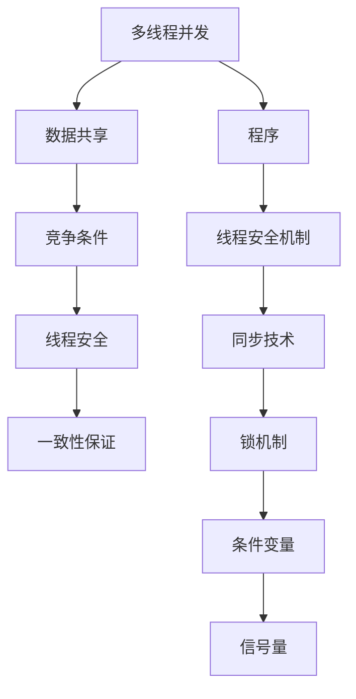

                 

# 线程安全：LLM应用中的关键挑战

## 1. 背景介绍

在人工智能技术的快速发展中，大语言模型（LLM）被广泛应用于自然语言处理（NLP）、机器翻译、智能客服、金融分析等多个领域，展现了巨大的潜力。然而，在实际应用中，大语言模型常常面临多线程并发操作的挑战，尤其是在高性能计算环境中，这些挑战尤为突出。本文将探讨线程安全问题在大语言模型中的应用挑战，并提出一些解决方案，以确保模型在并发操作下能够稳定运行，达到最优性能。

## 2. 核心概念与联系

### 2.1 核心概念概述

在讨论线程安全问题之前，我们首先需要明确几个核心概念：

- **多线程并发**：指同一时间有多个线程同时执行程序。在处理大量数据时，多线程并发能够显著提升系统性能。
- **数据共享**：指多个线程共享同一份数据，这种共享可能导致数据不一致或竞争条件（Race Condition）。
- **线程安全**：指在多线程并发访问下，程序能够正确处理共享数据，避免竞争条件，确保结果一致性。

### 2.2 核心概念原理和架构的 Mermaid 流程图



在多线程并发环境中，程序需要处理共享数据，可能导致竞争条件（Race Condition），影响数据一致性。为了解决这一问题，程序需要实施线程安全机制，包括同步技术、锁机制、条件变量、信号量等，以确保程序在并发环境下仍然能够正确运行。

## 3. 核心算法原理 & 具体操作步骤

### 3.1 算法原理概述

在大语言模型中，线程安全问题主要体现在模型参数更新、梯度计算、数据加载和存储等方面。线程安全算法需要确保这些操作的正确执行，避免竞争条件。

- **模型参数更新**：模型参数是共享的，多个线程可能会同时访问和更新这些参数。需要确保参数更新顺序和一致性。
- **梯度计算**：梯度计算需要同步更新模型参数，避免参数更新不匹配，导致梯度不准确。
- **数据加载和存储**：数据加载和存储需要确保线程之间的数据一致性，避免数据不一致或重复计算。

### 3.2 算法步骤详解

以下是实现线程安全算法的详细步骤：

1. **定义共享变量和参数**：确定哪些变量和参数是共享的，需要同步更新。
2. **设计同步机制**：选择适合的同步技术，如锁机制、条件变量、信号量等。
3. **实现线程安全操作**：将共享变量和参数的访问和更新操作封装成线程安全函数或类方法，确保每个操作都是原子操作。
4. **测试并发性**：通过模拟多个线程并发操作，测试线程安全算法的正确性和性能。

### 3.3 算法优缺点

线程安全算法的优点包括：

- 确保多线程并发操作的一致性和正确性。
- 避免竞争条件，减少数据不一致和错误。

缺点包括：

- 同步机制的引入可能导致性能下降。
- 同步机制设计不当可能导致死锁或饥饿问题。

### 3.4 算法应用领域

线程安全算法在大语言模型的应用领域包括：

- 大规模分布式训练环境下的模型参数更新。
- 大规模数据集的处理和加载。
- 实时用户查询的处理和响应。

## 4. 数学模型和公式 & 详细讲解

### 4.1 数学模型构建

在大语言模型的线程安全问题中，我们通常使用锁机制来确保数据的一致性。锁机制分为互斥锁（Mutex Lock）和读写锁（Read-Write Lock）。

互斥锁：确保在同一时间只有一个线程可以访问共享数据，适用于读操作很少的情况。

读写锁：允许多个线程同时读取共享数据，但只允许一个线程写入共享数据，适用于读操作频繁的情况。

### 4.2 公式推导过程

互斥锁的实现公式为：

$$
\text{lock}(\text{resource})
$$

释放锁的实现公式为：

$$
\text{unlock}(\text{resource})
$$

读写锁的实现公式为：

$$
\text{lockr}(\text{resource})
$$

$$
\text{unlockr}(\text{resource})
$$

$$
\text{lockw}(\text{resource})
$$

$$
\text{unlockw}(\text{resource})
$$

### 4.3 案例分析与讲解

假设我们有一个全局计数器 $count$，需要多个线程同时更新。我们可以使用互斥锁来确保计数器的更新是线程安全的。

```python
import threading

counter = 0
mutex = threading.Lock()

def update_counter():
    global counter
    for i in range(1000000):
        with mutex:
            counter += 1

# 启动多个线程更新计数器
threads = []
for i in range(10):
    t = threading.Thread(target=update_counter)
    threads.append(t)
    t.start()

# 等待所有线程完成
for t in threads:
    t.join()

print(counter)
```

在这个例子中，我们使用互斥锁来保护计数器的更新操作。每个线程在访问计数器之前，需要获取互斥锁，完成后再释放锁，确保同一时间只有一个线程可以更新计数器。

## 5. 项目实践：代码实例和详细解释说明

### 5.1 开发环境搭建

为了搭建一个支持多线程并发操作的环境，我们需要：

1. 安装Python和相关库，如threading、multiprocessing等。
2. 准备测试数据集，如自然语言文本、模型参数等。
3. 设计测试框架，模拟多个线程并发操作。

### 5.2 源代码详细实现

以下是使用Python实现一个简单的线程安全计数器的示例代码：

```python
import threading

class Counter:
    def __init__(self):
        self._count = 0
        self._lock = threading.Lock()

    def increment(self):
        with self._lock:
            self._count += 1

    def get_count(self):
        with self._lock:
            return self._count

# 启动多个线程更新计数器
counter = Counter()
threads = []
for i in range(10):
    t = threading.Thread(target=counter.increment)
    threads.append(t)
    t.start()

# 等待所有线程完成
for t in threads:
    t.join()

print(counter.get_count())
```

### 5.3 代码解读与分析

在上述代码中，我们使用了一个线程安全的计数器类`Counter`。该类包含一个计数器变量`_count`和一个互斥锁`_lock`。`increment`方法用于增加计数器，`get_count`方法用于获取计数器值。使用互斥锁确保了计数器的更新是线程安全的。

### 5.4 运行结果展示

运行上述代码，输出结果应为1000，表示在多个线程并发操作下，计数器的值仍然正确。

## 6. 实际应用场景

### 6.1 分布式训练环境

在大规模分布式训练环境中，多台计算机需要同时更新模型参数。使用线程安全算法可以确保各台计算机的参数更新一致，避免参数不一致导致模型训练失败。

### 6.2 实时用户查询

在实时用户查询系统中，多用户同时发送查询请求，需要实时处理和响应。使用线程安全算法可以确保数据一致性和查询结果的正确性。

### 6.3 大数据处理

在大数据处理中，多个线程需要同时读取和处理大量数据。使用线程安全算法可以避免数据重复读取和计算，提高数据处理效率。

## 7. 工具和资源推荐

### 7.1 学习资源推荐

1. 《Python多线程编程》：详细介绍了Python多线程编程的基础知识和高级技巧，适合初学者和进阶者。
2. 《Java并发编程实战》：Java多线程编程的经典书籍，讲解了并发编程的核心概念和最佳实践。
3. 《并发编程的艺术》：深入讲解了并发编程的理论基础和实际应用，适合中高级开发者。

### 7.2 开发工具推荐

1. Python threading和multiprocessing库：Python内置的多线程和分布式处理库，适用于多线程并发操作。
2. Java concurrency包：Java的标准并发库，包括线程、锁、条件变量、信号量等，适用于多线程并发操作。
3. Apache Spark：支持分布式计算和数据处理的大数据框架，提供了丰富的线程安全和并发处理机制。

### 7.3 相关论文推荐

1. "A Survey of Multi-threaded Application Patterns for Cloud-based Big Data Applications"：综述了云计算环境下的多线程并发应用模式，适用于大数据处理场景。
2. "Thread Safety and Concurrency Control in Python"：介绍了Python中的线程安全和并发控制机制，适用于Python开发者。
3. "Concurrent Programming in Java"：讲解了Java中的并发编程技术和最佳实践，适用于Java开发者。

## 8. 总结：未来发展趋势与挑战

### 8.1 研究成果总结

本文探讨了线程安全问题在大语言模型中的应用挑战，并提出了解决方案。通过使用锁机制和同步技术，可以确保模型在多线程并发环境下正确运行。未来，随着多核CPU、GPU等硬件设备的不断发展，并发性能和线程安全算法的优化将成为大语言模型应用的重要研究方向。

### 8.2 未来发展趋势

1. 分布式训练和推理：分布式计算环境下的线程安全算法将进一步优化，提高模型训练和推理的效率和性能。
2. 实时数据处理：实时数据处理中的线程安全算法将更加高效，支持更高速率的数据流处理。
3. 并发编程框架的进步：并发编程框架将不断完善，支持更灵活、更高效的并发编程模式。

### 8.3 面临的挑战

1. 性能损失：线程安全算法可能带来一定的性能损失，需要在性能和安全性之间取得平衡。
2. 同步机制设计：同步机制设计不当可能导致死锁或饥饿问题，需要合理设计和管理。
3. 数据一致性：在分布式环境下，数据一致性问题更加复杂，需要更加严格的数据管理和同步策略。

### 8.4 研究展望

未来，随着计算机硬件和软件技术的发展，线程安全算法将不断优化和改进。研究者需要深入探索并应用新的并发编程技术和数据管理策略，确保大语言模型在并发环境下的正确性和稳定性，实现更高效、更可靠的智能应用。

## 9. 附录：常见问题与解答

**Q1: 多线程并发和单线程执行有何区别？**

A: 多线程并发是指多个线程同时执行程序，能够显著提高程序的并发性能。单线程执行则是指只有一个线程执行程序，通常情况下，单线程执行的效率较低，但更易于管理和调试。

**Q2: 如何判断一个算法是否是线程安全的？**

A: 线程安全的算法需要满足以下条件：
1. 共享变量的访问和更新是原子操作，保证数据一致性。
2. 同步机制能够正确管理线程的访问顺序，避免竞争条件。
3. 算法在并发环境下能够正确执行，不出现死锁或饥饿问题。

**Q3: 如何优化线程安全算法的性能？**

A: 优化线程安全算法的性能可以从以下几个方面入手：
1. 使用读写锁代替互斥锁，减少锁的粒度和竞争条件。
2. 优化同步机制的设计，避免死锁和饥饿问题。
3. 使用并发编程框架，提高并发编程的效率和可维护性。

**Q4: 如何处理大数据集的多线程并发处理？**

A: 处理大数据集的多线程并发处理，可以采用以下策略：
1. 使用分布式计算框架，如Hadoop、Spark等，进行大数据集的分布式处理。
2. 使用数据分区技术，将大数据集分成多个小数据集，并行处理。
3. 使用并行数据加载和处理技术，减少数据重复读取和计算。

**Q5: 什么是死锁和饥饿问题？**

A: 死锁是指多个线程相互等待对方释放资源，导致程序无法继续执行。饥饿问题是指某个线程在竞争资源时长期得不到服务，无法完成执行。

---

作者：禅与计算机程序设计艺术 / Zen and the Art of Computer Programming

