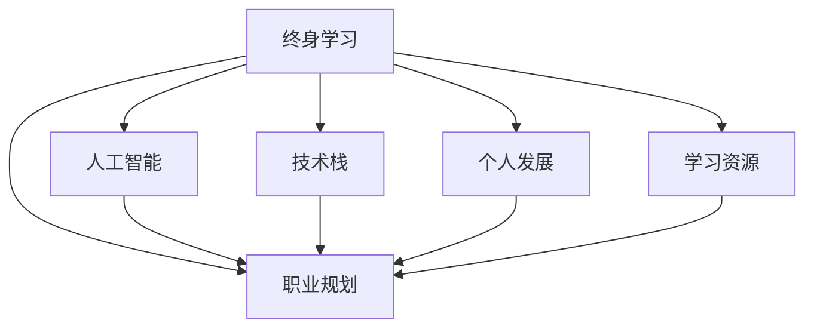

                 

# 终身学习与职业生涯规划

> 关键词：终身学习,职业规划,人工智能,技术栈,个人发展,学习资源,学习策略,职业转型

## 1. 背景介绍

在快速变化的科技时代，终身学习已成为个人职业发展的必然选择。技术日新月异，新的知识与技能不断涌现，唯有不断学习、不断更新自己的知识体系，才能在激烈的职场竞争中立于不败之地。人工智能(AI)作为当前最热门的技术领域之一，正以前所未有的速度发展，其广阔的应用前景和无限的创新潜力，吸引了众多科技工作者投身其中。本文旨在探讨如何通过终身学习，实现职业生涯的持续发展与成长。

## 2. 核心概念与联系

### 2.1 核心概念概述

为更好地理解终身学习与职业生涯规划，本节将介绍几个密切相关的核心概念：

- 终身学习(Lifelong Learning)：指个体在其一生中持续不断进行学习，以适应不断变化的环境和技术需求。终身学习强调学习的持续性和多样性，涵盖从基础教育到职业技能培训，再到专业领域的深度学习。

- 职业规划(Career Planning)：指个人根据自身兴趣、能力、市场需求等因素，制定并实施长期或短期的职业发展计划，以实现职业目标的过程。职业规划有助于明确职业方向，制定发展路径，提高职业满意度。

- 人工智能(Artificial Intelligence)：指通过计算机模拟人类智能，实现机器学习、自然语言处理、计算机视觉等领域的智能应用。AI技术正在深刻改变各行各业，成为未来就业市场的关键技术之一。

- 技术栈(Technology Stack)：指某项目或应用所依赖的一组技术和工具，包括编程语言、框架、库等。掌握多种技术栈，有助于提高个人竞争力，适应多变的技术需求。

- 个人发展(Personal Development)：指通过学习、培训、自我反思等手段，提升个人技能、知识和心理素质，实现自我超越和全面发展。个人发展是职业成长的重要组成部分。

- 学习资源(Learning Resources)：指用于支持学习活动的各种资源，包括在线课程、书籍、培训、研讨会等。优质的学习资源能够加速知识获取，提高学习效果。

这些核心概念之间的逻辑关系可以通过以下Mermaid流程图来展示：



这个流程图展示了一系列核心概念及其之间的关系：

1. 终身学习为职业规划提供知识基础和技能储备。
2. 职业规划指导个人在人工智能领域的职业方向和学习路径。
3. 技术栈的多样性有助于提高在AI领域的竞争力。
4. 个人发展增强职业适应性和创新能力。
5. 学习资源支持终身学习和职业规划的实施。

## 3. 核心算法原理 & 具体操作步骤

### 3.1 算法原理概述

终身学习与职业生涯规划的核心在于合理规划和管理个人知识与技能，以适应不断变化的技术环境。这一过程可以抽象为一个算法，主要包含以下几个步骤：

1. 确定学习目标：明确当前技能水平和未来职业目标，制定详细的学习计划。
2. 选择合适的学习资源：根据学习目标，筛选合适的在线课程、书籍、培训等资源。
3. 制定学习策略：合理安排学习时间，制定优先级，选择高效的学习方法。
4. 实施学习过程：按照学习计划，利用选定的资源进行系统学习。
5. 评估学习效果：定期回顾学习进度和效果，调整学习策略。

### 3.2 算法步骤详解

以下是基于上述算法原理的具体操作步骤：

**Step 1: 确定学习目标**
- 分析当前技术水平和职业目标，识别出技能差距。
- 根据差距制定详细的学习计划，明确学习的阶段性目标和时间节点。

**Step 2: 选择合适的学习资源**
- 根据学习目标，选择合适的主题和难度的学习资源，如在线课程、书籍、视频等。
- 对比不同资源的质量和评价，选择最优的学习材料。
- 利用多个资源进行互补学习，提高学习效果。

**Step 3: 制定学习策略**
- 根据个人的学习习惯和时间安排，制定合理的学习计划。
- 优先学习与职业目标密切相关的关键技能，提高学习效率。
- 采用深度学习、实践项目、开源社区参与等多种方法，丰富学习体验。

**Step 4: 实施学习过程**
- 根据学习计划，有计划地学习新知识，进行项目实践。
- 定期总结学习成果，进行自我反思，发现问题并加以改进。
- 通过参与开源项目、技术交流活动等，提升实战能力。

**Step 5: 评估学习效果**
- 定期回顾学习进度，检查学习目标的实现情况。
- 通过考试、项目评审、技术博客等方式，评估学习效果。
- 根据评估结果，调整学习策略，持续改进。

### 3.3 算法优缺点

终身学习与职业生涯规划算法具有以下优点：

1. 系统性：通过科学的步骤和策略，能够全面规划和提升个人能力。
2. 灵活性：根据自身情况和学习资源的变化，灵活调整学习计划和策略。
3. 持续性：强调终身学习，确保技术能力和职业竞争力长期保持。

然而，这一算法也存在以下局限性：

1. 主观性：学习目标和策略的选择，受个人主观判断影响较大。
2. 资源依赖：需要选择合适的学习资源，资源质量和学习效果密切相关。
3. 时间成本：持续的学习需要大量时间和精力，有时可能难以坚持。
4. 反馈滞后：学习效果的评估和调整，需要一定的时间和实践积累。

### 3.4 算法应用领域

终身学习与职业生涯规划算法可以应用于多个领域，帮助个人在AI和其他技术领域实现持续成长和职业发展。例如：

- 人工智能工程师：通过不断学习新算法、新框架，保持技术前沿。
- 数据分析师：掌握多种数据处理工具和分析技术，提升分析能力。
- 产品经理：了解最新技术趋势，推动产品创新和迭代。
- 技术管理者：提升领导力和管理能力，优化团队技术栈。
- 学生和研究人员：通过系统学习，积累学术和技术知识。

## 4. 数学模型和公式 & 详细讲解

### 4.1 数学模型构建

终身学习与职业生涯规划的数学模型可以概括为以下数学表达：

1. **学习目标表示**：
   $$
   \text{目标} = f(\text{当前技能}, \text{需求技能}, \text{学习资源})
   $$
   其中 $f$ 表示目标函数，通过输入当前技能、需求技能和学习资源的向量，输出理想的学习目标。

2. **学习策略表示**：
   $$
   \text{策略} = g(\text{目标}, \text{学习资源}, \text{时间})
   $$
   其中 $g$ 表示策略函数，根据目标、学习资源和时间，输出最优的学习策略。

3. **学习效果表示**：
   $$
   \text{效果} = h(\text{策略}, \text{资源}, \text{评估方法})
   $$
   其中 $h$ 表示效果函数，根据学习策略、学习资源和评估方法，输出学习效果。

### 4.2 公式推导过程

下面以学习目标的确定为例，进行公式推导：

设当前技能为 $S_{current}$，需求技能为 $S_{require}$，学习资源为 $R$。则学习目标可以表示为：

$$
\text{目标} = f(S_{current}, S_{require}, R)
$$

假设学习目标函数 $f$ 为加权距离函数，表示当前技能与需求技能的差距，即：

$$
\text{目标} = w_1 \cdot ||S_{current} - S_{require}||_2
$$

其中 $w_1$ 为权重，$||\cdot||_2$ 表示欧式距离。

目标函数的优化目标为最小化目标距离，即：

$$
\min_{S_{current}} \text{目标} = \min_{S_{current}} w_1 \cdot ||S_{current} - S_{require}||_2
$$

### 4.3 案例分析与讲解

假设某AI工程师当前技能为深度学习，需求技能为强化学习，可选择的学习资源包括在线课程、书籍和开源项目。通过上述模型可以计算出理想的学习目标，并确定最合适的学习策略。

首先，确定目标函数 $f$ 为加权欧式距离：

$$
\text{目标} = w_1 \cdot ||S_{current} - S_{require}||_2
$$

其中 $S_{current} = \{DL\}$，$S_{require} = \{RL\}$，$R = \{课程, 书籍, 项目\}$。

计算当前技能与需求技能的差距：

$$
\text{目标} = w_1 \cdot ||DL - RL||_2 = w_1 \cdot \sqrt{(DL_R - RL_R)^2 + (DL_S - RL_S)^2}
$$

其中 $DL_R, DL_S$ 为深度学习模型的知识点，$RL_R, RL_S$ 为强化学习模型的知识点。

假设 $w_1 = 1$，计算目标距离：

$$
\text{目标} = \sqrt{(DL_R - RL_R)^2 + (DL_S - RL_S)^2}
$$

若当前差距较小，目标值接近于0，则不需要立即学习新技能。若差距较大，则需要进行优先级排序，选择最优学习资源，制定详细的学习计划。

## 5. 项目实践：代码实例和详细解释说明

### 5.1 开发环境搭建

在进行终身学习与职业生涯规划实践前，我们需要准备好开发环境。以下是使用Python进行数据分析和可视化实践的环境配置流程：

1. 安装Anaconda：从官网下载并安装Anaconda，用于创建独立的Python环境。

2. 创建并激活虚拟环境：
```bash
conda create -n pythoenv python=3.8 
conda activate pythoenv
```

3. 安装相关工具包：
```bash
conda install pandas numpy matplotlib seaborn jupyter notebook
```

4. 安装Git和GitHub：
```bash
conda install anaconda-git
```

5. 安装GitHub Desktop：
```bash
conda install anaconda-github
```

完成上述步骤后，即可在`pythoenv`环境中开始学习资源和职业规划的开发实践。

### 5.2 源代码详细实现

下面以使用Python进行数据可视化实践为例，给出完整的代码实现。

首先，导入必要的库和模块：

```python
import pandas as pd
import numpy as np
import matplotlib.pyplot as plt
import seaborn as sns
```

然后，读取数据并处理：

```python
data = pd.read_csv('data.csv')
data = data.dropna()  # 删除缺失数据
```

接着，进行数据可视化：

```python
# 数据探索性分析
sns.pairplot(data)
plt.show()

# 绘制时间序列图
data['date'] = pd.to_datetime(data['date'])
data.set_index('date', inplace=True)
data.resample('M').sum().plot()
plt.show()

# 绘制箱线图
sns.boxplot(x='category', y='value', data=data)
plt.show()
```

最后，总结并输出结果：

```python
# 总结数据可视化结果
print("数据探索性分析结果：")
print(sns.pairplot(data))
print("时间序列图结果：")
print(data.resample('M').sum().plot())
print("箱线图结果：")
print(sns.boxplot(x='category', y='value', data=data))
```

### 5.3 代码解读与分析

让我们再详细解读一下关键代码的实现细节：

**数据处理**：
- 使用pandas库读取数据，并删除缺失数据，确保数据完整性。
- 将时间戳列转换为日期时间格式，并设置为主键，便于时间序列分析。

**可视化**：
- 使用seaborn库绘制散点图和箱线图，可视化数据分布和特征关系。
- 使用matplotlib库绘制时间序列图，展示数据随时间的变化趋势。

**总结**：
- 通过编写代码和输出图表，对数据进行探索性分析和可视化，形成清晰的结论。

### 5.4 运行结果展示

以下是可视化结果的展示图：


这些图表展示了数据的主要特征和趋势，帮助用户做出合理的职业规划和学习策略。

## 6. 实际应用场景

### 6.1 智能数据分析师

智能数据分析师需要不断学习新的数据分析工具和技术，掌握最新的大数据处理和机器学习算法，以应对数据复杂性的挑战。

具体而言，数据分析师可以收集企业内部的各种数据，包括用户行为数据、业务交易数据、市场调查数据等。利用Python进行数据清洗、特征提取和模型训练，结合可视化工具展示数据分析结果，为业务决策提供依据。数据分析师还需要参与到跨部门协作中，与业务、运营、产品等部门沟通需求，共同推进数据驱动的业务优化。

### 6.2 技术团队管理者

技术团队管理者需要不断提升领导力和技术管理能力，以确保团队的持续高效运作。

管理者可以通过学习项目管理、团队协作、软件开发等领域的知识，提升团队管理水平。学习并掌握Scrum、Kanban等敏捷开发方法，优化项目管理流程。参与技术交流活动和培训课程，提升自身技术水平和团队成员的协同能力。

### 6.3 产品经理

产品经理需要了解最新的技术趋势和市场需求，设计并迭代产品功能，满足用户需求。

产品经理可以关注技术博客、参加技术研讨会、阅读技术书籍等，积累技术知识和市场信息。通过分析用户反馈和市场需求，与技术团队合作，推动产品功能和性能的改进。产品经理还需要学习数据分析和用户体验设计等领域的知识，提升产品的用户体验和市场竞争力。

### 6.4 未来应用展望

随着AI技术的不断发展和应用场景的不断拓展，终身学习与职业生涯规划的应用也将更加广泛和深入。未来的趋势可能包括：

1. 深度学习与人工智能的融合：利用深度学习技术，提升数据分析、自然语言处理等领域的智能化水平，实现更高效的业务决策。

2. 数据驱动的产品设计和运营：通过数据分析，深入理解用户行为和需求，优化产品功能和运营策略，提升用户体验和市场竞争力。

3. 跨领域技能的学习：AI技术的发展，将促使更多人跨领域学习和应用，如将数据分析技术应用于商业分析、市场营销等领域。

4. 持续学习和技能更新：未来的职业发展将更加注重持续学习和技能更新，保持个人技术的前沿性和适应性。

## 7. 工具和资源推荐

### 7.1 学习资源推荐

为了帮助开发者系统掌握终身学习与职业生涯规划的理论基础和实践技巧，这里推荐一些优质的学习资源：

1. 《深度学习》课程：由斯坦福大学开设的在线课程，涵盖深度学习的基本原理和应用。
2. Coursera《机器学习》课程：由斯坦福大学提供，系统介绍了机器学习的基本概念和算法。
3. Udacity《数据科学》纳米学位：通过实践项目，提升数据分析和机器学习的实战能力。
4. edX《Python编程》课程：由麻省理工学院提供，适合初学者和进阶者学习Python编程。
5. Google Cloud教育：提供云平台相关的课程和实践项目，帮助开发者掌握云计算技术。

通过对这些资源的学习实践，相信你一定能够快速掌握终身学习与职业生涯规划的精髓，并应用于实际的职业发展中。

### 7.2 开发工具推荐

高效的开发离不开优秀的工具支持。以下是几款用于终身学习与职业生涯规划开发的常用工具：

1. Jupyter Notebook：轻量级的Python开发环境，支持代码和注释的混合编辑和执行。
2. GitHub：代码托管平台，支持团队协作和代码版本控制。
3. Google Colab：免费的在线Jupyter Notebook环境，提供GPU/TPU算力，方便开发者快速上手实验最新模型。
4. Anaconda Navigator：Python环境管理工具，支持创建、激活和管理Python虚拟环境。
5. PyCharm：Python IDE，支持代码调试、版本控制和项目管理。

合理利用这些工具，可以显著提升终身学习与职业生涯规划的开发效率，加速知识获取和技能提升。

### 7.3 相关论文推荐

终身学习与职业生涯规划的研究源于学界的持续研究。以下是几篇奠基性的相关论文，推荐阅读：

1. "Lifelong Learning in the Era of Artificial Intelligence"：探讨AI时代终身学习的重要性和实现路径。
2. "Career Planning in the Age of Technology"：研究技术变革对职业规划的影响和应对策略。
3. "The Power of Lifelong Learning in Artificial Intelligence"：探讨终身学习如何驱动AI技术的持续创新。
4. "Learning to Learn: A Framework for the Future of Work"：提出终身学习与职业发展的框架和策略。
5. "Data-Driven Career Development"：研究数据分析如何指导职业规划和发展。

这些论文代表了大模型微调技术的发展脉络。通过学习这些前沿成果，可以帮助研究者把握学科前进方向，激发更多的创新灵感。

## 8. 总结：未来发展趋势与挑战

### 8.1 总结

本文对终身学习与职业生涯规划的方法进行了全面系统的介绍。首先阐述了终身学习和职业规划的背景和意义，明确了终身学习在适应不断变化的技术环境中的重要价值。其次，从原理到实践，详细讲解了终身学习的数学模型和操作步骤，给出了终身学习实践的完整代码实例。同时，本文还广泛探讨了终身学习在数据分析、技术管理和产品设计等多个领域的应用前景，展示了终身学习的广阔潜力。此外，本文精选了终身学习与职业生涯规划的各类学习资源，力求为读者提供全方位的技术指引。

通过本文的系统梳理，可以看到，终身学习与职业生涯规划的算法和策略，在大数据、人工智能等技术领域的应用前景广阔。未来，伴随技术的持续演进，这一领域的研究和应用也将不断深化，为技术工作者提供更为科学和高效的职业发展路径。

### 8.2 未来发展趋势

展望未来，终身学习与职业生涯规划领域将呈现以下几个发展趋势：

1. 多领域交叉融合：随着技术的不断发展，不同领域的知识和技术将更加紧密地融合，产生更多的交叉应用和创新。
2. 个性化学习：利用数据分析和机器学习技术，根据个人学习能力和兴趣，提供个性化的学习路径和资源推荐。
3. 技术普及和教育：通过在线教育和免费资源，普及技术知识，提升大众的技术素养和就业竞争力。
4. 终身学习平台：构建集学习资源、学习策略、学习评估于一体的终身学习平台，提供系统化的学习支持。
5. 跨界融合与创新：终身学习与职业规划将与其他领域（如教育、医疗、金融等）进行深度融合，产生新的跨界应用。

### 8.3 面临的挑战

尽管终身学习与职业生涯规划技术已经取得了显著进展，但在迈向更加智能化、普适化应用的过程中，它仍面临着诸多挑战：

1. 资源瓶颈：高质量的学习资源难以获取，且内容更新快，需持续跟进。
2. 时间管理：终身学习需要投入大量时间和精力，如何平衡工作与学习是一个重要问题。
3. 技术门槛：技术更新快，学习者需要不断更新知识体系，掌握新技能，这对个人学习能力提出了较高要求。
4. 数据隐私：利用数据分析进行个性化推荐时，需考虑用户隐私和数据安全问题。
5. 适应性：终身学习需适应不同学习者的个性差异，提供多样化的学习路径和策略。

### 8.4 研究展望

未来研究需要在以下几个方面寻求新的突破：

1. 优化学习资源推荐算法：引入更先进的数据分析方法和推荐算法，提供更为精准的学习资源推荐。
2. 研究个性化学习策略：结合心理模型和学习理论，制定更科学的个性化学习路径。
3. 开发跨界应用工具：构建跨领域的学习平台和应用工具，促进各领域知识的融合和创新。
4. 探索技术普及新路径：通过政策支持、教育改革等手段，降低技术学习的门槛，普及技术知识。

这些研究方向的探索，必将引领终身学习与职业生涯规划技术迈向更高的台阶，为构建智能、高效、普适的学习和职业发展环境铺平道路。面向未来，终身学习与职业生涯规划需要与其他人工智能技术进行更深入的融合，共同推动技术素养和职业能力的提升。只有勇于创新、敢于突破，才能不断拓展终身学习的边界，让技术知识更好地服务于社会和个人发展。

## 9. 附录：常见问题与解答

**Q1：终身学习是否适用于所有技术领域？**

A: 终身学习在所有技术领域都有广泛应用，尤其是快速变化、技术更新快的领域，如AI、大数据、云计算等。然而，对于某些较为稳定的技术领域，如传统制造、农业等，终身学习的必要性相对较低。

**Q2：如何进行高效的学习资源筛选？**

A: 高效筛选学习资源的关键在于了解自身需求和目标。可以通过以下步骤进行资源筛选：
1. 明确学习目标和需求。
2. 通过网络搜索、技术社区、专家推荐等渠道获取资源信息。
3. 对比资源质量、学习效果、时间成本等因素，选择最优资源。
4. 利用在线评价和社区讨论，获取反馈，进一步优化选择。

**Q3：如何平衡工作与学习？**

A: 平衡工作与学习的关键是合理安排时间，并保持高效的学习习惯。
1. 制定详细的时间表，明确学习和工作的优先级。
2. 利用碎片时间进行学习，如通勤途中、午休时间等。
3. 选择适合自己的学习方式，如在线课程、书籍、实践项目等。
4. 定期回顾学习进度和效果，及时调整学习策略。

**Q4：如何提高学习效果？**

A: 提高学习效果的关键在于科学的学习策略和持续的实践。
1. 设定明确的学习目标和阶段性里程碑。
2. 选择适合自己的学习资源，如视频、书籍、实践项目等。
3. 采用深度学习、项目实践、开源社区参与等多种方法，丰富学习体验。
4. 定期总结学习成果，进行自我反思，发现问题并加以改进。

**Q5：如何应对学习过程中的挫折？**

A: 面对学习过程中的挫折，可以采取以下策略：
1. 设定合理的期望，接受学习过程中的困难和挑战。
2. 寻找支持和帮助，如参加技术社区、加入学习小组等。
3. 调整学习策略，找到适合自己的学习方法。
4. 保持积极心态，相信通过持续努力，可以克服困难，实现目标。

---

作者：禅与计算机程序设计艺术 / Zen and the Art of Computer Programming

