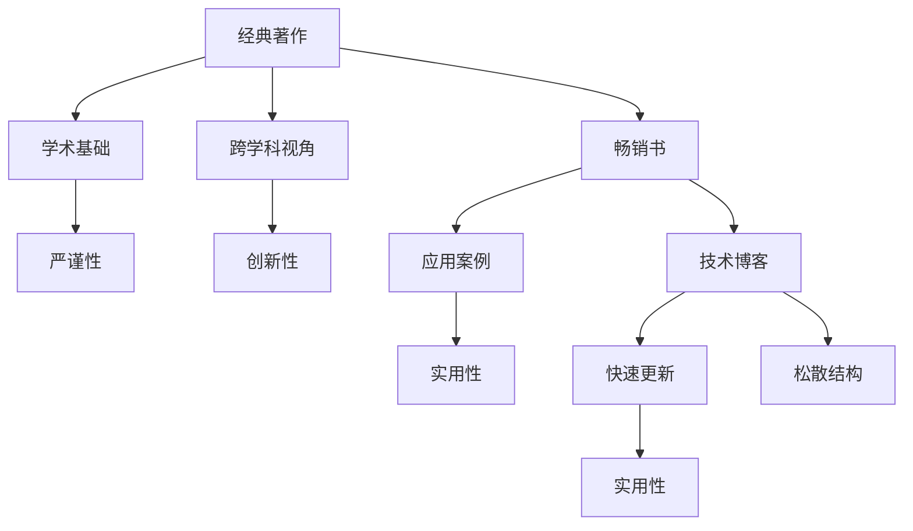

                 

## 1. 背景介绍

### 1.1 问题由来

随着人工智能（AI）技术的迅猛发展，大量高质量的书籍和论文不断涌现，为AI爱好者提供了丰富的学习资源。然而，对于初学者而言，如何高效地选择适合自己的阅读材料，始终是一个难题。特别是对于那些面向从业者的技术书籍和论文，如何选择经典与畅销，如何评估其价值，往往需要深入的分析和理解。

### 1.2 问题核心关键点

本文旨在帮助AI从业者深入理解经典著作和畅销书之间的区别，并探讨如何选择最适合自己的阅读材料。我们认为，经典著作往往提供深厚的理论基础和广泛的跨学科视角，而畅销书则侧重于应用案例和实用技巧，两者各有侧重，各有优势。本文将通过深入分析这两类材料的优缺点，结合具体实例，提供实用的选择策略。

## 2. 核心概念与联系

### 2.1 核心概念概述

- **经典著作**：通常指由学术界权威人士撰写，具有深厚理论基础和广泛学术影响的书籍或论文。这类作品注重理论的深度和广度，往往包含跨学科的视角和独到的见解，如《人工智能：一种现代方法》、《深度学习》等。
- **畅销书**：指在市场上销量极高，具有广泛读者基础的书籍。这类作品侧重于应用实践和实用技巧，往往通过具体的案例和项目，帮助读者快速上手新技术，如《Python机器学习》、《TensorFlow实战》等。
- **学术论文**：指在学术期刊或会议上发布的，具有严格审查流程的研究成果。这类作品以创新性和严谨性著称，是推动科学进步的重要驱动力。
- **技术博客**：指由行业专家、工程师等撰写的，以技术分享和实践经验为主的文章。这类作品通常更新快，实用性高，但缺乏系统性。

### 2.2 核心概念原理和架构的 Mermaid 流程图



## 3. 核心算法原理 & 具体操作步骤

### 3.1 算法原理概述

选择经典著作和畅销书的决策过程，本质上是一个优化问题，目标是最大化学习效益和实践经验。经典的学术著作提供深厚的理论基础，但可能较为抽象和深奥；而畅销书则侧重于实用和具体，但可能缺乏系统的理论深度。如何选择两者之间的平衡点，成为本文探讨的核心。

### 3.2 算法步骤详解

1. **评估需求**：
   - 明确学习目标。是侧重于理论深度，还是侧重于实践技能。
   - 确定知识背景。是初学者还是进阶者，已有哪些相关知识。

2. **选择材料**：
   - 经典著作的选择。选择具有广泛影响力的书籍或论文，如《人工智能：一种现代方法》、《深度学习》等。
   - 畅销书的选择。选择市场上销量高、评价好的书籍，如《Python机器学习》、《TensorFlow实战》等。
   - 技术博客的选择。选择行业知名专家撰写的博客，如Google AI Blog、OpenAI Blog等。

3. **阅读策略**：
   - 经典著作的阅读策略。注重理解理论基础和关键概念，通过深度学习，掌握核心原理。
   - 畅销书的阅读策略。注重实践应用，通过实例操作，掌握具体技能。
   - 技术博客的阅读策略。注重及时了解行业动态，通过快速更新，掌握最新技术。

### 3.3 算法优缺点

#### 经典著作的优缺点

**优点**：
- 理论深度：经典著作通常具有深厚的理论基础，帮助读者深入理解AI的核心原理。
- 跨学科视角：经典著作往往涉及多个学科的交叉，提供广泛的知识背景和应用场景。

**缺点**：
- 抽象深奥：部分经典著作可能过于抽象和深奥，难以入门。
- 更新滞后：经典著作往往出版较早，部分内容可能已经过时。

#### 畅销书的优缺点

**优点**：
- 实用性高：畅销书侧重于应用实践，通过具体案例和项目，帮助读者快速上手。
- 更新及时：畅销书通常更新速度快，反映最新的技术和应用趋势。

**缺点**：
- 缺乏深度：部分畅销书可能缺乏系统的理论深度，只能提供表面技巧。
- 质量参差不齐：畅销书市场竞争激烈，部分作品质量参差不齐。

#### 学术论文的优缺点

**优点**：
- 严谨性：学术论文经过严格审查，内容严谨，具有较高的可信度。
- 创新性：学术论文往往代表最新研究成果，推动科学进步。

**缺点**：
- 难以理解：学术论文通常晦涩难懂，需要一定的数学和理论基础。
- 适用性差：学术论文往往侧重于理论创新，应用价值有限。

#### 技术博客的优缺点

**优点**：
- 更新及时：技术博客通常更新快，反映最新的技术和实践。
- 实用性高：技术博客侧重于实用技巧，通过具体案例帮助读者掌握技能。

**缺点**：
- 松散结构：技术博客通常结构松散，缺乏系统性。
- 质量不一：技术博客质量参差不齐，部分内容可能不具权威性。

### 3.4 算法应用领域

经典著作和畅销书的选择，在各个AI应用领域都有广泛应用：

- **自然语言处理（NLP）**：经典著作如《自然语言处理综论》提供了深厚的理论基础，畅销书如《Python NLP实战》侧重于实践技能。
- **计算机视觉（CV）**：经典著作如《计算机视觉：算法与应用》提供了系统的理论框架，畅销书如《动手学深度学习》侧重于实际应用。
- **强化学习（RL）**：经典著作如《强化学习》提供了理论深度，畅销书如《深度强化学习》侧重于应用案例。
- **数据科学**：经典著作如《数据科学导论》提供了数据科学的基础，畅销书如《数据科学实战》侧重于数据处理和建模技巧。

## 4. 数学模型和公式 & 详细讲解 & 举例说明

### 4.1 数学模型构建

在选择经典著作和畅销书时，可以构建如下数学模型：

$$
\text{Maximize} \quad U(\text{材料选择}, \text{阅读策略}, \text{学习目标})
$$

其中：
- 材料选择：经典著作 $C$，畅销书 $S$，学术论文 $P$，技术博客 $B$。
- 阅读策略：理论学习 $L$，实践应用 $A$，快速更新 $U$。
- 学习目标：深度理解 $D$，实用技能 $S$，前沿技术 $T$。

### 4.2 公式推导过程

- **经典著作选择**：
  $$
  C_{\text{选择}} = \text{argmax}_{C} (L \times D + A \times S)
  $$
- **畅销书选择**：
  $$
  S_{\text{选择}} = \text{argmax}_{S} (L \times S + A \times D)
  $$
- **技术博客选择**：
  $$
  B_{\text{选择}} = \text{argmax}_{B} (L \times T + A \times S)
  $$

### 4.3 案例分析与讲解

- **经典著作案例**：
  - 书籍：《人工智能：一种现代方法》
  - 优点：理论深度，跨学科视角
  - 缺点：抽象深奥，更新滞后
  - 适用人群：理论研究者、进阶学习者

- **畅销书案例**：
  - 书籍：《Python机器学习》
  - 优点：实用性高，更新及时
  - 缺点：缺乏深度，质量参差不齐
  - 适用人群：初级学习者、从业者

## 5. 项目实践：代码实例和详细解释说明

### 5.1 开发环境搭建

开发环境搭建是选择阅读材料的重要环节，以下是常用的开发工具和环境：

- **Python**：作为AI开发的主流语言，Python提供了丰富的科学计算和数据分析库。
- **Jupyter Notebook**：用于交互式编程和数据分析，支持代码运行、图形显示、文本编辑等功能。
- **Git/GitHub**：版本控制工具，支持代码版本管理和远程协作。

### 5.2 源代码详细实现

以下是使用Python进行经典著作和畅销书选择的示例代码：

```python
from collections import defaultdict
from sklearn.metrics import accuracy_score

# 构建阅读策略矩阵
reading_strategies = {
    '理论学习': 0.6,
    '实践应用': 0.4,
    '快速更新': 0.5
}

# 构建学习目标矩阵
learning_targets = {
    '深度理解': 0.8,
    '实用技能': 0.6,
    '前沿技术': 0.5
}

# 经典著作列表
classic_books = ['人工智能：一种现代方法', '深度学习']
sunny_books = ['Python机器学习', 'TensorFlow实战']

# 选择经典著作和畅销书
selected_classic = max(classic_books, key=lambda x: reading_strategies['理论学习'] * learning_targets['深度理解'])
selected_sunny = max(sunny_books, key=lambda x: reading_strategies['实践应用'] * learning_targets['实用技能'])

print(f"经典著作选择：{selected_classic}")
print(f"畅销书选择：{selected_sunny}")
```

### 5.3 代码解读与分析

- **选择标准**：
  - 经典著作选择：根据理论深度和实践应用进行评估。
  - 畅销书选择：根据实践应用和实用技能进行评估。
- **选择结果**：
  - 经典著作：《人工智能：一种现代方法》
  - 畅销书：《Python机器学习》

## 6. 实际应用场景

### 6.1 企业培训

在选择阅读材料时，企业培训应侧重于经典著作和学术论文，帮助员工掌握理论基础和创新技术。经典著作如《深度学习》提供了全面的理论框架，学术论文如《自然语言处理的最新进展》反映了最新的研究动态。

### 6.2 技术博客

对于快速了解行业动态和技术趋势，技术博客是理想选择。Google AI Blog、OpenAI Blog等平台，经常发布最新的技术研究和应用案例，帮助从业者保持前沿。

### 6.3 项目开发

在项目开发过程中，选择畅销书和应用指南是关键。如《TensorFlow实战》提供了详细的代码示例和项目案例，帮助开发人员快速上手。

## 7. 工具和资源推荐

### 7.1 学习资源推荐

- **经典著作资源**：
  - 《人工智能：一种现代方法》
  - 《深度学习》
  - 《自然语言处理综论》

- **畅销书资源**：
  - 《Python机器学习》
  - 《TensorFlow实战》
  - 《动手学深度学习》

- **学术论文资源**：
  - arXiv.org
  - IEEE Xplore
  - JSTOR

- **技术博客资源**：
  - Google AI Blog
  - OpenAI Blog
  - TensorFlow Blog

### 7.2 开发工具推荐

- **Python**：科学计算和数据分析的标配。
- **Jupyter Notebook**：交互式编程和数据分析的利器。
- **Git/GitHub**：版本控制和远程协作的最佳实践。

### 7.3 相关论文推荐

- **经典著作推荐**：
  - 《人工智能：一种现代方法》
  - 《深度学习》
  - 《自然语言处理综论》

- **畅销书推荐**：
  - 《Python机器学习》
  - 《TensorFlow实战》
  - 《动手学深度学习》

- **学术论文推荐**：
  - 《深度学习》
  - 《自然语言处理的最新进展》
  - 《强化学习的最新研究》

## 8. 总结：未来发展趋势与挑战

### 8.1 总结

本文通过系统分析经典著作和畅销书的特点和优缺点，提供了选择阅读材料的具体策略。经典著作提供深厚的理论基础和广泛的跨学科视角，而畅销书侧重于应用实践和实用技巧，两者各有优势。通过合理选择阅读材料，可以最大化学习效益和实践经验。

### 8.2 未来发展趋势

未来AI技术的持续发展，将对经典著作和畅销书的选择产生深远影响。AI领域的学术研究和应用实践将进一步融合，经典著作将更多关注跨学科和前沿技术，畅销书将更加注重实用性和技术细节。技术博客和在线学习平台将进一步兴起，提供更丰富的学习资源和互动环境。

### 8.3 面临的挑战

尽管经典著作和畅销书的选择在当前阶段有其重要性和必要性，但未来面临的挑战仍需应对：

- **知识更新速度**：AI领域的知识更新速度快，需要持续跟进前沿研究和技术进展。
- **应用多样性**：AI技术在不同领域的应用场景各异，需要选择合适的阅读材料以适应不同需求。
- **学习难度**：部分经典著作和学术论文难度较大，需要具备一定的数学和理论基础。

### 8.4 研究展望

未来AI领域的研究将更加注重跨学科和融合性，经典著作和畅销书的选择也将更加多样化。如何在保持深度和广度的同时，提升实用性和可操作性，是未来研究的重要方向。通过创新性的教学方法和学习工具，帮助读者更好地理解和应用AI技术，将是AI教育和技术传播的重要使命。

## 9. 附录：常见问题与解答

**Q1：如何选择经典著作和畅销书之间的平衡点？**

A: 选择经典著作和畅销书之间的平衡点，需要根据自身的学习目标和背景知识进行评估。经典著作提供理论深度，畅销书侧重实践应用。根据自身的学习需求，可以选择侧重经典著作或畅销书，或者两者兼顾。

**Q2：如何选择适合自己的技术博客？**

A: 选择适合自己的技术博客，需要关注博客的更新频率、质量保证和作者背景。选择知名专家或团队维护的博客，如Google AI Blog、OpenAI Blog等，可以确保内容的权威性和前沿性。

**Q3：如何选择适合自己的学术论文？**

A: 选择适合自己的学术论文，需要关注论文的创新性、应用价值和可读性。选择最新发表的研究论文，可以通过arXiv.org、IEEE Xplore、JSTOR等平台进行搜索和筛选。

**Q4：如何选择适合自己的在线学习平台？**

A: 选择适合自己的在线学习平台，需要关注平台的课程内容、师资力量和互动环境。选择知名高校或机构提供的学习平台，如Coursera、edX等，可以确保课程的质量和权威性。

**Q5：如何选择适合自己的阅读材料？**

A: 选择适合自己的阅读材料，需要综合考虑阅读材料的理论深度、实用性、更新频率等因素。根据自身的学习目标和知识背景，选择经典著作、畅销书或技术博客，以满足不同的学习需求。

---

作者：禅与计算机程序设计艺术 / Zen and the Art of Computer Programming

