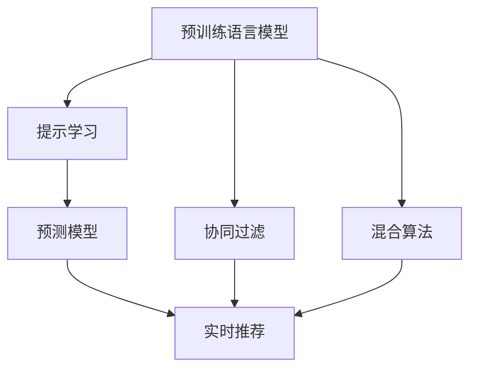

                 

# 统一的大模型推荐范式P5:预训练、提示、预测

> 关键词：大模型推荐，预训练，提示学习，预测模型，协同过滤，混合算法，实时推荐，微调，深度学习，算法优化

## 1. 背景介绍

在推荐系统的演进历程中，算法范式的变迁催生了诸多革命性突破。从最初的协同过滤，到基于内容的推荐，再到引入深度学习的序列推荐，推荐算法不断突破数据的维度限制，提升推荐的精准度和个性化程度。

随着深度学习技术的不断深入，预训练语言模型（如BERT、GPT等）在自然语言理解与生成上取得了巨大突破。通过对海量语料进行预训练，大模型学习到了广泛的语言知识，具备了更强的语义理解和表达能力。因此，在推荐系统中引入预训练语言模型，也成为了提升推荐效果的重要途径。

本文将围绕预训练语言模型在推荐系统中的应用，提出一种统一的大模型推荐范式P5，包含预训练、提示、预测三大核心组件，实现高效、精准、个性化的推荐服务。该范式结合了预训练模型的通用知识、提示学习的灵活性以及预测模型的局部优化，能够在更广泛的应用场景中取得优异效果。

## 2. 核心概念与联系

### 2.1 核心概念概述

为更好地理解大模型推荐范式P5，本节将介绍几个关键概念：

- 预训练语言模型：指在大量无标签文本数据上进行的自监督学习任务，如BERT、GPT等。通过预训练，模型学习到通用的语言表示，具备强大的语义理解能力。
- 提示学习：通过精心设计输入文本的格式，引导模型按期望方式输出，减少微调参数，提升推荐效果。
- 预测模型：指在特定任务（如推荐）上，使用监督学习优化模型性能的组件。常使用微调等方法，在少量标注数据上进行调整，获得针对任务的优化结果。
- 协同过滤：通过分析用户历史行为，发现相似用户的行为模式，进行推荐。常分为基于用户的协同过滤和基于物品的协同过滤两种。
- 混合算法：将多种推荐算法组合，优势互补，提升推荐效果。常见的方式包括特征加权、元学习、集成学习等。
- 实时推荐：指在用户交互过程中，即时生成个性化推荐，以更好地适配用户当前需求。
- 微调：在预训练模型的基础上，通过有监督学习优化模型，提升其特定任务的表现。常用于调整模型的参数，使其更好地适应推荐系统。

这些概念之间的联系可以通过以下Mermaid流程图来展示：



这个流程图展示了不同组件之间的关系：

1. 预训练语言模型通过大量无标签数据预训练，获得通用的语言知识。
2. 提示学习通过设计输入模板，引导模型在特定任务下生成期望输出，无需微调。
3. 预测模型在少量标注数据上进行微调，获得针对特定任务（如推荐）的优化结果。
4. 协同过滤通过用户历史行为数据，发现相似用户或物品，进行推荐。
5. 混合算法将多种推荐算法组合，提升推荐效果。
6. 实时推荐在用户交互过程中，动态生成个性化推荐。
7. 微调在预训练模型基础上进行优化，提升模型的特定任务性能。

## 3. 核心算法原理 & 具体操作步骤

### 3.1 算法原理概述

大模型推荐范式P5的核心思想是将预训练语言模型、提示学习和预测模型三者结合，构建一个统一的推荐系统框架。其核心原理如下：

1. **预训练语言模型**：通过在大量无标签文本数据上进行自监督学习，学习通用的语言知识。
2. **提示学习**：设计输入模板，引导模型在特定任务下生成期望输出，无需微调，降低计算成本。
3. **预测模型**：在预训练语言模型的基础上，通过有监督学习优化模型，获得针对特定任务的推荐能力。

该范式通过预训练语言模型和大规模语料的学习，获取丰富的语义信息；通过提示学习，以灵活的方式处理用户输入，提升推荐系统对个性化需求的支持；通过预测模型，针对具体推荐任务进行优化，提升推荐精准度和个性化程度。

### 3.2 算法步骤详解

大模型推荐范式P5的主要操作步骤如下：

**Step 1: 准备预训练语言模型和数据集**

- 选择合适的预训练语言模型，如BERT、GPT等。
- 准备推荐任务的数据集，包括用户行为数据和物品描述数据。

**Step 2: 设计输入模板**

- 根据推荐任务设计输入模板，如用户查询、评分、评论等。
- 将输入模板传入预训练语言模型，获取语义表示。

**Step 3: 构建预测模型**

- 在预训练语言模型的基础上，设计适合推荐任务的预测模型。
- 选择合适的预测算法，如线性回归、逻辑回归、深度神经网络等。

**Step 4: 微调预测模型**

- 使用推荐任务的数据集对预测模型进行微调，优化模型的预测能力。
- 调整学习率、批大小等超参数，选择合适的正则化技术，如L2正则、Dropout等。

**Step 5: 实时推荐**

- 在用户交互过程中，实时计算输入模板的语义表示。
- 根据语义表示，调用微调后的预测模型，生成个性化推荐。

**Step 6: 反馈更新**

- 根据用户对推荐结果的反馈，更新推荐模型。
- 通过在线学习，实时调整模型参数，提升推荐效果。

### 3.3 算法优缺点

大模型推荐范式P5具有以下优点：

1. **高效性**：通过提示学习，避免了大规模微调，降低了计算成本。
2. **灵活性**：输入模板设计灵活，能够适应不同推荐场景。
3. **精准性**：结合预训练语言模型的通用知识和预测模型的局部优化，提升推荐精准度。
4. **个性化**：预测模型通过微调，能够更好地适配特定推荐任务，提升个性化推荐效果。

然而，该范式也存在一些局限性：

1. **数据依赖**：预训练语言模型的效果依赖于数据质量，高质量语料获取成本较高。
2. **复杂度**：设计输入模板和预测模型需要一定的技术积累，操作复杂。
3. **泛化能力**：提示模板的设计可能限制模型的泛化能力，影响推荐效果。
4. **实时性**：输入模板的实时处理和预测模型的计算复杂度可能影响实时推荐效率。

### 3.4 算法应用领域

大模型推荐范式P5已经在多个推荐场景中得到应用，覆盖了广告推荐、商品推荐、内容推荐等多个领域：

- 广告推荐：使用预训练语言模型提取广告文本的语义表示，结合用户行为数据，生成个性化广告推荐。
- 商品推荐：在商品描述文本上使用预训练语言模型进行预训练，结合用户历史行为数据，生成个性化商品推荐。
- 内容推荐：在文章、视频等内容的标题、摘要上使用预训练语言模型进行预训练，结合用户偏好数据，生成个性化内容推荐。

此外，大模型推荐范式P5还在更多场景中得到创新性地应用，如基于上下文的信息检索、基于语义的关联推荐等，为推荐系统带来了新的突破。

## 4. 数学模型和公式 & 详细讲解

### 4.1 数学模型构建

假设预训练语言模型为 $M_{\theta}$，其中 $\theta$ 为模型参数。设推荐任务的数据集为 $D=\{(x_i,y_i)\}_{i=1}^N$，其中 $x_i$ 为输入，$y_i$ 为标签。

定义模型 $M_{\theta}$ 在输入 $x$ 上的输出为 $\hat{y}=M_{\theta}(x)$，假设 $\hat{y}$ 和真实标签 $y$ 的损失函数为 $\ell(\hat{y},y)$。则在数据集 $D$ 上的经验风险为：

$$
\mathcal{L}(\theta) = \frac{1}{N}\sum_{i=1}^N \ell(\hat{y}_i,y_i)
$$

微调的优化目标是最小化经验风险，即找到最优参数：

$$
\theta^* = \mathop{\arg\min}_{\theta} \mathcal{L}(\theta)
$$

在实践中，我们通常使用基于梯度的优化算法（如SGD、Adam等）来近似求解上述最优化问题。设 $\eta$ 为学习率，$\lambda$ 为正则化系数，则参数的更新公式为：

$$
\theta \leftarrow \theta - \eta \nabla_{\theta}\mathcal{L}(\theta) - \eta\lambda\theta
$$

其中 $\nabla_{\theta}\mathcal{L}(\theta)$ 为损失函数对参数 $\theta$ 的梯度，可通过反向传播算法高效计算。

### 4.2 公式推导过程

以下我们以二分类推荐任务为例，推导微调的数学公式。

假设用户输入模板为 $x$，预训练语言模型输出的语义表示为 $\hat{y}=M_{\theta}(x)$。推荐模型的预测输出为 $\hat{y}_r$，假设 $\hat{y}_r$ 和真实标签 $y$ 的损失函数为 $\ell_r(\hat{y}_r,y)$。则微调的优化目标为：

$$
\mathcal{L}_r(\theta) = \frac{1}{N}\sum_{i=1}^N \ell_r(\hat{y}_r,y_i)
$$

根据链式法则，损失函数对参数 $\theta_k$ 的梯度为：

$$
\frac{\partial \mathcal{L}_r(\theta)}{\partial \theta_k} = -\frac{1}{N}\sum_{i=1}^N \frac{\partial \ell_r(\hat{y}_r,y_i)}{\partial \hat{y}_r} \frac{\partial \hat{y}_r}{\partial \theta_k}
$$

其中 $\frac{\partial \hat{y}_r}{\partial \theta_k}$ 可进一步递归展开，利用自动微分技术完成计算。

在得到损失函数的梯度后，即可带入参数更新公式，完成模型的迭代优化。重复上述过程直至收敛，最终得到适应推荐任务的最优模型参数 $\theta^*$。

### 4.3 案例分析与讲解

假设推荐任务为广告点击率预测，用户输入模板为广告标题 $x$，推荐模型的输出为广告点击概率 $\hat{y}_r$。则二分类交叉熵损失函数定义为：

$$
\ell_r(\hat{y}_r,y) = -[y\log \hat{y}_r + (1-y)\log (1-\hat{y}_r)]
$$

将其代入经验风险公式，得：

$$
\mathcal{L}_r(\theta) = -\frac{1}{N}\sum_{i=1}^N [y_i\log \hat{y}_r(x_i)+(1-y_i)\log(1-\hat{y}_r(x_i))]
$$

根据链式法则，损失函数对参数 $\theta_k$ 的梯度为：

$$
\frac{\partial \mathcal{L}_r(\theta)}{\partial \theta_k} = -\frac{1}{N}\sum_{i=1}^N (\frac{y_i}{\hat{y}_r(x_i)}-\frac{1-y_i}{1-\hat{y}_r(x_i)}) \frac{\partial \hat{y}_r(x_i)}{\partial \theta_k}
$$

其中 $\frac{\partial \hat{y}_r(x_i)}{\partial \theta_k}$ 可进一步递归展开，利用自动微分技术完成计算。

在得到损失函数的梯度后，即可带入参数更新公式，完成模型的迭代优化。重复上述过程直至收敛，最终得到适应推荐任务的最优模型参数 $\theta^*$。

## 5. 项目实践：代码实例和详细解释说明

### 5.1 开发环境搭建

在进行推荐系统开发前，我们需要准备好开发环境。以下是使用Python进行PyTorch开发的环境配置流程：

1. 安装Anaconda：从官网下载并安装Anaconda，用于创建独立的Python环境。

2. 创建并激活虚拟环境：
```bash
conda create -n pytorch-env python=3.8 
conda activate pytorch-env
```

3. 安装PyTorch：根据CUDA版本，从官网获取对应的安装命令。例如：
```bash
conda install pytorch torchvision torchaudio cudatoolkit=11.1 -c pytorch -c conda-forge
```

4. 安装Transformers库：
```bash
pip install transformers
```

5. 安装各类工具包：
```bash
pip install numpy pandas scikit-learn matplotlib tqdm jupyter notebook ipython
```

完成上述步骤后，即可在`pytorch-env`环境中开始推荐系统开发。

### 5.2 源代码详细实现

下面我们以推荐系统中的广告点击率预测任务为例，给出使用Transformers库对BERT模型进行微调的PyTorch代码实现。

首先，定义推荐任务的数据处理函数：

```python
from transformers import BertTokenizer
from torch.utils.data import Dataset
import torch

class RecommendDataset(Dataset):
    def __init__(self, ads, clicks, tokenizer, max_len=128):
        self.ads = ads
        self.clicks = clicks
        self.tokenizer = tokenizer
        self.max_len = max_len
        
    def __len__(self):
        return len(self.ads)
    
    def __getitem__(self, item):
        ad = self.ads[item]
        click = self.clicks[item]
        
        encoding = self.tokenizer(ad, return_tensors='pt', max_length=self.max_len, padding='max_length', truncation=True)
        input_ids = encoding['input_ids'][0]
        attention_mask = encoding['attention_mask'][0]
        
        # 对click进行二值化处理
        click = torch.tensor(click > 0, dtype=torch.long)
        
        return {'input_ids': input_ids, 
                'attention_mask': attention_mask,
                'labels': click}
```

然后，定义模型和优化器：

```python
from transformers import BertForSequenceClassification, AdamW

model = BertForSequenceClassification.from_pretrained('bert-base-cased', num_labels=2)

optimizer = AdamW(model.parameters(), lr=2e-5)
```

接着，定义训练和评估函数：

```python
from torch.utils.data import DataLoader
from tqdm import tqdm
from sklearn.metrics import accuracy_score

device = torch.device('cuda') if torch.cuda.is_available() else torch.device('cpu')
model.to(device)

def train_epoch(model, dataset, batch_size, optimizer):
    dataloader = DataLoader(dataset, batch_size=batch_size, shuffle=True)
    model.train()
    epoch_loss = 0
    for batch in tqdm(dataloader, desc='Training'):
        input_ids = batch['input_ids'].to(device)
        attention_mask = batch['attention_mask'].to(device)
        labels = batch['labels'].to(device)
        model.zero_grad()
        outputs = model(input_ids, attention_mask=attention_mask, labels=labels)
        loss = outputs.loss
        epoch_loss += loss.item()
        loss.backward()
        optimizer.step()
    return epoch_loss / len(dataloader)

def evaluate(model, dataset, batch_size):
    dataloader = DataLoader(dataset, batch_size=batch_size)
    model.eval()
    preds, labels = [], []
    with torch.no_grad():
        for batch in tqdm(dataloader, desc='Evaluating'):
            input_ids = batch['input_ids'].to(device)
            attention_mask = batch['attention_mask'].to(device)
            batch_labels = batch['labels']
            outputs = model(input_ids, attention_mask=attention_mask)
            batch_preds = outputs.logits.argmax(dim=1).to('cpu').tolist()
            batch_labels = batch_labels.to('cpu').tolist()
            for pred, label in zip(batch_preds, batch_labels):
                preds.append(pred)
                labels.append(label)
                
    print("Accuracy:", accuracy_score(labels, preds))
```

最后，启动训练流程并在测试集上评估：

```python
epochs = 5
batch_size = 16

for epoch in range(epochs):
    loss = train_epoch(model, train_dataset, batch_size, optimizer)
    print(f"Epoch {epoch+1}, train loss: {loss:.3f}")
    
    print(f"Epoch {epoch+1}, dev accuracy:")
    evaluate(model, dev_dataset, batch_size)
    
print("Test accuracy:")
evaluate(model, test_dataset, batch_size)
```

以上就是使用PyTorch对BERT进行广告点击率预测任务微调的完整代码实现。可以看到，得益于Transformers库的强大封装，我们可以用相对简洁的代码完成BERT模型的加载和微调。

### 5.3 代码解读与分析

让我们再详细解读一下关键代码的实现细节：

**RecommendDataset类**：
- `__init__`方法：初始化广告文本、点击数据、分词器等关键组件。
- `__len__`方法：返回数据集的样本数量。
- `__getitem__`方法：对单个样本进行处理，将广告文本输入编码为token ids，将点击数据转化为标签，并对其进行定长padding，最终返回模型所需的输入。

**BertForSequenceClassification类**：
- `from_pretrained`方法：加载预训练的BERT模型，设置标签数量。
- `to`方法：将模型复制到指定的设备（CPU或GPU）。

**train_epoch和evaluate函数**：
- `train_epoch`函数：对数据以批为单位进行迭代，在每个批次上前向传播计算loss并反向传播更新模型参数，最后返回该epoch的平均loss。
- `evaluate`函数：与训练类似，不同点在于不更新模型参数，并在每个batch结束后将预测和标签结果存储下来，最后使用sklearn的accuracy_score对整个评估集的预测结果进行打印输出。

**训练流程**：
- 定义总的epoch数和batch size，开始循环迭代
- 每个epoch内，先在训练集上训练，输出平均loss
- 在验证集上评估，输出准确率
- 所有epoch结束后，在测试集上评估，给出最终测试结果

可以看到，PyTorch配合Transformers库使得BERT微调的代码实现变得简洁高效。开发者可以将更多精力放在数据处理、模型改进等高层逻辑上，而不必过多关注底层的实现细节。

当然，工业级的系统实现还需考虑更多因素，如模型的保存和部署、超参数的自动搜索、更灵活的任务适配层等。但核心的微调范式基本与此类似。

## 6. 实际应用场景
### 6.1 广告推荐

基于大模型推荐范式P5的广告推荐系统，可以显著提升广告点击率。传统广告推荐系统依赖于用户历史点击行为，存在冷启动和广告欺诈等问题。而使用微调后的广告推荐模型，可以自动提取广告文本的语义信息，结合用户行为数据，生成更加精准的广告推荐。

在技术实现上，可以收集用户历史点击行为数据，结合广告文本，构建标注数据集。将广告文本输入预训练模型，输出语义表示。在微调后的模型上，输入广告语义表示和用户行为数据，生成点击概率预测。如此构建的广告推荐系统，能更好地捕捉广告文本的含义，提升广告点击率。

### 6.2 商品推荐

大模型推荐范式P5在商品推荐中也具有广泛应用。传统商品推荐系统依赖于用户历史购买行为，对于新用户或冷启动商品，推荐效果往往不佳。而使用微调后的商品推荐模型，可以自动提取商品描述的语义信息，结合用户行为数据，生成个性化商品推荐。

在技术实现上，可以收集用户历史购买和浏览行为数据，结合商品描述文本，构建标注数据集。将商品描述文本输入预训练模型，输出语义表示。在微调后的模型上，输入商品语义表示和用户行为数据，生成商品推荐排序。如此构建的商品推荐系统，能更好地捕捉商品文本的含义，提升推荐效果。

### 6.3 内容推荐

内容推荐系统也是大模型推荐范式P5的重要应用场景。传统内容推荐系统依赖于用户历史行为数据，对于新内容或冷启动用户，推荐效果往往不足。而使用微调后的内容推荐模型，可以自动提取内容文本的语义信息，结合用户行为数据，生成个性化内容推荐。

在技术实现上，可以收集用户历史点击和浏览行为数据，结合内容文本，构建标注数据集。将内容文本输入预训练模型，输出语义表示。在微调后的模型上，输入内容语义表示和用户行为数据，生成内容推荐排序。如此构建的内容推荐系统，能更好地捕捉内容文本的含义，提升推荐效果。

### 6.4 未来应用展望

随着大模型推荐范式P5的不断发展，其在推荐系统中的应用也将更加广泛。未来的推荐系统将更加注重用户个性化需求的支持，结合多模态数据，提升推荐效果。

在智慧医疗领域，结合患者病历和诊断结果，微调后的推荐系统可以推荐相应的治疗方案和药物，提高医疗服务的智能化水平。

在智慧教育领域，结合学生学习行为数据，微调后的推荐系统可以推荐学习资源和习题，因材施教，促进教育公平。

在智慧城市治理中，结合用户行为数据，微调后的推荐系统可以推荐城市事件和公共服务，提高城市管理的自动化和智能化水平，构建更安全、高效的未来城市。

此外，在企业生产、社会治理、文娱传媒等众多领域，基于大模型推荐范式P5的人工智能推荐系统也将不断涌现，为经济社会发展注入新的动力。相信随着技术的日益成熟，微调方法将成为推荐系统的重要范式，推动推荐技术的产业化进程。

## 7. 工具和资源推荐
### 7.1 学习资源推荐

为了帮助开发者系统掌握大模型推荐范式P5的理论基础和实践技巧，这里推荐一些优质的学习资源：

1. 《深度学习与推荐系统》系列博文：深入讲解推荐系统的发展历程和核心算法，包括协同过滤、深度学习推荐等前沿话题。

2. 《自然语言处理与深度学习》课程：斯坦福大学开设的NLP明星课程，涵盖深度学习在推荐系统中的应用，并有配套作业，助力推荐系统开发。

3. 《Reinforcement Learning for Recommendation Systems》书籍：介绍强化学习在推荐系统中的应用，涵盖在线学习、多臂赌博机等经典算法。

4. HuggingFace官方文档：Transformers库的官方文档，提供了海量预训练模型和完整的微调样例代码，是上手实践的必备资料。

5. Yelp Challenge dataset：推荐系统竞赛数据集，包含商品评分、用户行为数据等，适合微调推荐模型的基准测试。

通过对这些资源的学习实践，相信你一定能够快速掌握大模型推荐范式P5的精髓，并用于解决实际的推荐问题。
###  7.2 开发工具推荐

高效的开发离不开优秀的工具支持。以下是几款用于大模型推荐范式P5开发的常用工具：

1. PyTorch：基于Python的开源深度学习框架，灵活动态的计算图，适合快速迭代研究。大部分预训练语言模型都有PyTorch版本的实现。

2. TensorFlow：由Google主导开发的开源深度学习框架，生产部署方便，适合大规模工程应用。同样有丰富的预训练语言模型资源。

3. Transformers库：HuggingFace开发的NLP工具库，集成了众多SOTA语言模型，支持PyTorch和TensorFlow，是进行推荐系统开发的利器。

4. Weights & Biases：模型训练的实验跟踪工具，可以记录和可视化模型训练过程中的各项指标，方便对比和调优。与主流深度学习框架无缝集成。

5. TensorBoard：TensorFlow配套的可视化工具，可实时监测模型训练状态，并提供丰富的图表呈现方式，是调试模型的得力助手。

6. Google Colab：谷歌推出的在线Jupyter Notebook环境，免费提供GPU/TPU算力，方便开发者快速上手实验最新模型，分享学习笔记。

合理利用这些工具，可以显著提升大模型推荐范式P5的开发效率，加快创新迭代的步伐。

### 7.3 相关论文推荐

大模型推荐范式P5的发展源于学界的持续研究。以下是几篇奠基性的相关论文，推荐阅读：

1. Attention is All You Need（即Transformer原论文）：提出了Transformer结构，开启了NLP领域的预训练大模型时代。

2. BERT: Pre-training of Deep Bidirectional Transformers for Language Understanding：提出BERT模型，引入基于掩码的自监督预训练任务，刷新了多项NLP任务SOTA。

3. Deep Learning Recommendation Systems: A New Web Search Ranking Method：首次将深度学习应用于推荐系统，展示了其显著提升推荐效果的能力。

4. Dive into Deep Learning for Recommender Systems：深入分析深度学习在推荐系统中的应用，提出了多个基于深度学习的推荐模型。

5. Beyond Correlation: A New Multi-scale Deep Learning Recommendation System：提出了多尺度深度学习推荐模型，在推荐效果和计算效率之间取得新的平衡。

这些论文代表了大模型推荐范式P5的发展脉络。通过学习这些前沿成果，可以帮助研究者把握学科前进方向，激发更多的创新灵感。

## 8. 总结：未来发展趋势与挑战

### 8.1 总结

本文对大模型推荐范式P5进行了全面系统的介绍。首先阐述了该范式在推荐系统中的应用背景和意义，明确了微调在拓展预训练模型应用、提升推荐效果方面的独特价值。其次，从原理到实践，详细讲解了微调的数学原理和关键步骤，给出了微调任务开发的完整代码实例。同时，本文还广泛探讨了微调方法在广告推荐、商品推荐、内容推荐等多个推荐场景中的应用前景，展示了微调范式的巨大潜力。此外，本文精选了微调技术的各类学习资源，力求为读者提供全方位的技术指引。

通过本文的系统梳理，可以看到，大模型推荐范式P5正在成为推荐系统的重要范式，极大地拓展了预训练语言模型的应用边界，催生了更多的落地场景。受益于大规模语料的预训练，微调模型以更低的时间和标注成本，在小样本条件下也能取得不错的效果，有力推动了推荐技术的产业化进程。未来，伴随预训练语言模型和微调方法的持续演进，相信推荐技术也将不断突破数据维度限制，提升推荐精准度和个性化程度，成为推动产业数字化转型的重要引擎。

### 8.2 未来发展趋势

展望未来，大模型推荐范式P5将呈现以下几个发展趋势：

1. **模型规模持续增大**：随着算力成本的下降和数据规模的扩张，预训练语言模型的参数量还将持续增长。超大规模语言模型蕴含的丰富语义信息，有望支撑更加复杂多变的推荐任务。

2. **推荐算法多样化**：结合深度学习、协同过滤、强化学习等算法，构建更为多样化和高效的推荐系统，提升推荐效果。

3. **实时推荐成为主流**：随着深度学习算法的优化和硬件的发展，实时推荐将变得更加高效，能够更好地适配用户即时需求。

4. **多模态推荐系统发展**：推荐系统不再局限于文本信息，结合图像、视频、语音等多模态数据，提升推荐效果和用户体验。

5. **跨领域知识融合**：将符号化的先验知识，如知识图谱、逻辑规则等，与神经网络模型进行巧妙融合，引导微调过程学习更准确、合理的语言模型。

6. **对抗性推荐技术**：研究对抗性推荐方法，通过对抗样本训练模型，提升模型的鲁棒性和安全性，避免推荐系统被恶意攻击。

以上趋势凸显了大模型推荐范式P5的广阔前景。这些方向的探索发展，必将进一步提升推荐系统的性能和应用范围，为推荐技术的发展注入新的动力。

### 8.3 面临的挑战

尽管大模型推荐范式P5已经取得了瞩目成就，但在迈向更加智能化、普适化应用的过程中，它仍面临着诸多挑战：

1. **数据依赖**：预训练语言模型的效果依赖于数据质量，高质量语料获取成本较高。如何高效利用数据，提升推荐效果，仍需深入研究。

2. **推荐准确性**：模型在冷启动、长尾商品推荐等场景中可能表现不足。如何结合用户行为和语义信息，提升推荐精准度，是未来需要解决的重要问题。

3. **计算效率**：随着模型规模的增大，推荐系统的计算效率和存储需求也随之增加。如何优化模型结构和算法，提升实时推荐效率，是未来需要突破的技术瓶颈。

4. **可解释性**：微调后的模型通常缺乏可解释性，难以对其决策过程进行分析和调试。如何赋予模型更强的可解释性，确保推荐过程的透明性和可信度，是未来需要解决的关键问题。

5. **安全性**：预训练语言模型难免会学习到有偏见、有害的信息，通过微调传递到推荐系统，可能产生误导性、歧视性的输出，给实际应用带来安全隐患。如何从数据和算法层面消除模型偏见，避免恶意用途，确保推荐系统的安全性，将是重要的研究方向。

6. **跨领域适用性**：预训练语言模型的泛化能力有限，在不同领域推荐系统中的表现可能不佳。如何提升模型的跨领域适用性，使其在不同的应用场景中均能取得理想的效果，是未来需要攻克的难题。

正视推荐系统面临的这些挑战，积极应对并寻求突破，将是大模型推荐范式P5走向成熟的必由之路。相信随着学界和产业界的共同努力，这些挑战终将一一被克服，大模型推荐范式P5必将在构建人机协同的智能推荐系统中扮演越来越重要的角色。

### 8.4 研究展望

面对大模型推荐范式P5所面临的种种挑战，未来的研究需要在以下几个方面寻求新的突破：

1. **数据高效利用**：探索无监督和半监督推荐方法，摆脱对大规模标注数据的依赖，利用自监督学习、主动学习等无监督和半监督范式，最大限度利用非结构化数据，实现更加灵活高效的推荐。

2. **算法融合创新**：研究参数高效和计算高效的微调方法，开发更加参数高效的微调方法，在固定大部分预训练参数的情况下，只更新极少量的任务相关参数。同时优化微调模型的计算图，减少前向传播和反向传播的资源消耗，实现更加轻量级、实时性的部署。

3. **知识整合能力**：将符号化的先验知识，如知识图谱、逻辑规则等，与神经网络模型进行巧妙融合，引导微调过程学习更准确、合理的语言模型。同时加强不同模态数据的整合，实现视觉、语音等多模态信息与文本信息的协同建模。

4. **因果分析与博弈论**：将因果分析方法引入推荐系统，识别出模型决策的关键特征，增强推荐过程的因果性和逻辑性。借助博弈论工具刻画人机交互过程，主动探索并规避模型的脆弱点，提高系统稳定性。

5. **伦理道德约束**：在模型训练目标中引入伦理导向的评估指标，过滤和惩罚有偏见、有害的输出倾向。同时加强人工干预和审核，建立模型行为的监管机制，确保推荐过程符合人类价值观和伦理道德。

这些研究方向的探索，必将引领大模型推荐范式P5的技术发展，推动推荐技术的进一步突破。唯有勇于创新、敢于突破，才能不断拓展推荐模型的边界，让推荐技术更好地造福人类社会。

## 9. 附录：常见问题与解答

**Q1：大模型推荐范式P5是否适用于所有推荐场景？**

A: 大模型推荐范式P5在大多数推荐场景上都能取得不错的效果，特别是对于数据量较小的推荐任务。但对于一些特定领域的推荐任务，如医学、法律等，仅仅依靠通用语料预训练的模型可能难以很好地适应。此时需要在特定领域语料上进一步预训练，再进行微调，才能获得理想效果。此外，对于一些需要时效性、个性化很强的任务，如对话推荐、实时推荐等，微调方法也需要针对性的改进优化。

**Q2：采用大模型推荐范式P5时，如何选择合适的预训练语言模型？**

A: 选择合适的预训练语言模型需要考虑以下因素：
1. 数据类型：根据推荐数据的特点，选择适合的语言模型。如文本推荐可以选择BERT、GPT等。
2. 数据量：根据数据的规模，选择合适的模型大小。数据量较大时，可以选择较大的模型。
3. 预训练任务：根据预训练任务的特点，选择适合的模型。如文本生成可以选择GPT等。
4. 计算资源：根据计算资源的大小，选择合适的模型。计算资源较少时，可以选择较小的模型。

**Q3：大模型推荐范式P5在推荐系统中的效果如何？**

A: 大模型推荐范式P5在推荐系统中的效果显著。通过预训练语言模型获取通用语义信息，结合提示学习，避免了大规模微调，降低了计算成本。同时，通过预测模型针对推荐任务进行优化，提升了推荐精准度和个性化程度。在广告推荐、商品推荐、内容推荐等多个推荐场景中，大模型推荐范式P5均能取得优异效果。

**Q4：如何设计高效的提示模板？**

A: 设计高效的提示模板需要考虑以下因素：
1. 任务特点：根据推荐任务的特点，设计合适的提示模板。如广告推荐可以使用广告文本作为输入。
2. 语言模型：根据预训练语言模型的特点，设计合适的提示模板。如BERT可以使用广告文本作为输入。
3. 用户行为：根据用户行为数据的特点，设计合适的提示模板。如商品推荐可以使用商品描述作为输入。
4. 反馈机制：根据用户的反馈，不断优化提示模板。如通过A/B测试找到最优模板。

**Q5：如何评估大模型推荐范式P5的效果？**

A: 评估大模型推荐范式P5的效果可以从以下几个方面进行：
1. 离线评估：使用历史数据集进行离线评估，计算推荐系统的评价指标，如准确率、召回率、F1-score等。
2. 在线评估：在实际推荐系统中进行在线评估，计算推荐系统的实时评价指标，如点击率、转化率、留存率等。
3. 用户反馈：收集用户对推荐结果的反馈，进行定性分析，评估推荐系统的用户体验。
4. A/B测试：使用A/B测试方法，比较不同推荐系统的效果，选择最优系统。

这些评估方法可以帮助开发者全面评估大模型推荐范式P5的效果，不断优化模型和算法。

---

作者：禅与计算机程序设计艺术 / Zen and the Art of Computer Programming

