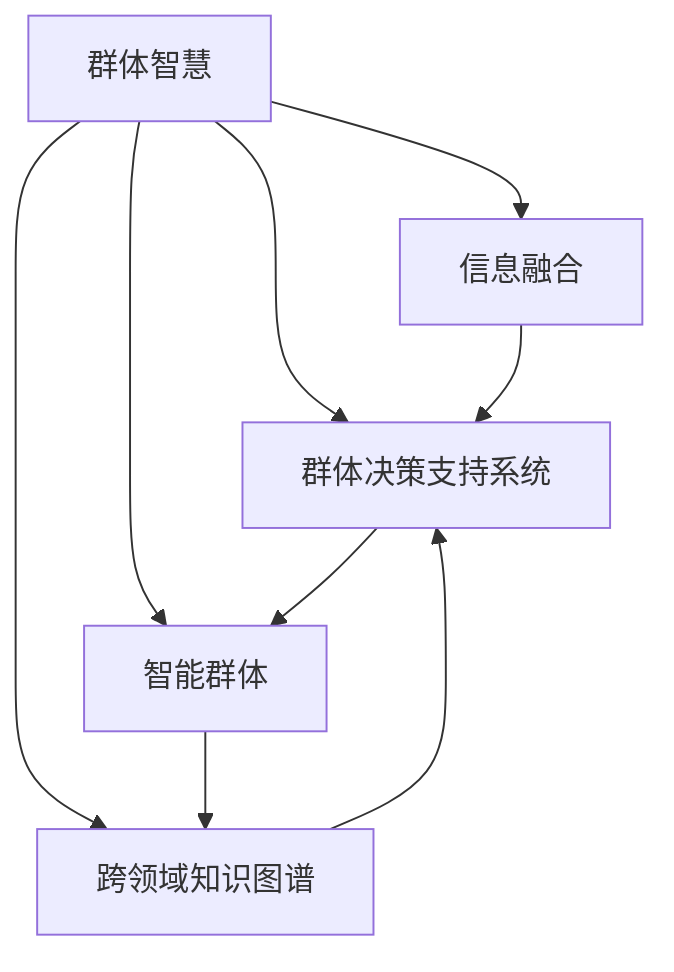

                 

## 1. 背景介绍

### 1.1 问题由来
随着互联网和大数据技术的普及，人类社会在信息获取和决策过程中正经历着深刻变革。传统上，决策主要依赖经验丰富的专家或少数人的直觉，但在信息爆炸的时代，个体的知识和判断力已难以应对日益复杂多变的环境。群体智慧(Ground Truth)作为集合智慧的产物，正成为新时代决策的重要引擎。

面对信息爆炸与不确定性增加的现实挑战，群体智慧提供了从海量数据中提取智慧、降低决策风险的有效手段。其核心在于融合大量个体的智慧和视角，利用算法和计算力对信息进行聚合和优化，从而实现更准确、更可靠的决策。

### 1.2 问题核心关键点
群体智慧的核心在于“智慧的聚合与优化”，即通过算法和计算力对个体智慧进行融合，提高决策的准确性和效率。具体而言，群体智慧涉及以下几个关键点：

- **数据融合**：整合不同来源、不同格式的数据，构建完整、一致的信息图谱。
- **模型优化**：建立数学模型，对融合后的数据进行分析和预测。
- **算法创新**：开发高效的群体智慧算法，实现智慧的实时聚合与优化。
- **计算架构**：设计高效能的计算架构，支撑大尺度群体智慧的计算和存储。

这些关键点相辅相成，共同构成群体智慧的决策引擎。通过理解这些核心概念，可以更好地把握群体智慧的工作原理和优化方向。

### 1.3 问题研究意义
研究群体智慧的决策引擎，对于提升组织决策质量、降低决策风险、加速技术进步，具有重要意义：

1. **提高决策质量**：通过融合多维数据和个体智慧，大幅提升决策的全面性和准确性。
2. **降低决策风险**：基于多样化的视角和数据，减少决策的主观偏见和失误。
3. **加速技术进步**：促进不同领域的交叉融合，催生新的算法和计算模型。
4. **推动社会进步**：在教育、医疗、政府等关键领域，群体智慧可推动社会公平和进步。
5. **增强组织竞争力**：通过优化决策流程，提升企业或组织的决策效率和竞争力。

## 2. 核心概念与联系

### 2.1 核心概念概述

为更好地理解群体智慧的决策引擎，本节将介绍几个密切相关的核心概念：

- **群体智慧(Ground Truth)**：指集合个体智慧、综合多源数据后得出的高质量决策结果。其核心在于数据的多样性和综合性。
- **信息融合**：指将来自不同来源的信息整合并聚合成一致的决策依据。常用的技术包括数据清洗、数据对齐、数据融合等。
- **群体决策支持系统(GDSS)**：利用计算机和通信技术，辅助群体进行决策的系统。GDSS通常包含知识库、数据库、决策支持工具等组件。
- **智能群体(Smart Crowds)**：指经过专业训练，具备一定分析能力和判断力的群体。例如，被训练过的科学家、专家、工程师等。
- **跨领域知识图谱(Knowledge Graph)**：通过语义网络技术，描述不同领域知识的关联，为群体智慧的融合提供框架和依据。

这些核心概念之间的逻辑关系可以通过以下Mermaid流程图来展示：



这个流程图展示了个体智慧与群体智慧之间的逻辑关系：

1. 个体智慧通过信息融合汇聚成群体智慧。
2. 群体决策支持系统整合了智能群体和跨领域知识图谱，为信息融合提供工具和依据。
3. 跨领域知识图谱为信息融合提供了统一的语义框架。

这些概念共同构成了群体智慧的决策框架，使其能够更好地应对复杂环境，实现高质量的决策。

## 3. 核心算法原理 & 具体操作步骤

### 3.1 算法原理概述

群体智慧的决策引擎基于信息融合、模型优化和算法创新的原理。其核心思想是：通过算法和计算力，将来自不同来源的信息进行融合和优化，形成高质量的群体智慧，辅助决策。

形式化地，假设群体中每个个体i对某个问题P的判断为$X_i$，群体智慧$W$定义为：

$$
W = \frac{1}{N}\sum_{i=1}^NX_i
$$

其中$N$为群体中个体数量。群体智慧$W$的期望值等于群体平均水平，即：

$$
E(W) = \frac{1}{N}\sum_{i=1}^NE(X_i)
$$

显然，群体智慧$W$比任何个体判断$X_i$的准确性和可靠性都要高。然而，实际应用中，群体智慧往往受个体判断的噪声、差异等影响，需要通过算法和计算力进行优化。

### 3.2 算法步骤详解

群体智慧的决策引擎通常包括以下几个关键步骤：

**Step 1: 数据收集与清洗**
- 收集与问题P相关的多样数据，包括文本、图像、音频等。
- 进行数据清洗，去除噪声、重复和异常值，构建干净、一致的数据集。

**Step 2: 数据对齐与融合**
- 将不同数据源的数据对齐，建立统一的数据结构和语义。
- 应用数据融合技术，将对齐后的数据进行整合，形成全面的决策依据。

**Step 3: 建立模型与优化**
- 根据决策目标，建立合适的数学模型，如回归模型、分类模型等。
- 对模型进行优化，利用算法如随机森林、贝叶斯网络、神经网络等，进行预测和推理。

**Step 4: 决策支持与反馈**
- 构建群体决策支持系统(GDSS)，辅助群体进行决策。
- 提供实时决策支持，如可视化界面、决策工具等。
- 引入反馈机制，利用群体反馈不断优化群体智慧，提升决策效果。

**Step 5: 知识图谱与融合**
- 利用跨领域知识图谱，构建语义网络，描述不同领域知识的关联。
- 将知识图谱与群体智慧融合，提升决策的全面性和深度。

### 3.3 算法优缺点

群体智慧的决策引擎具有以下优点：
1. **决策准确性高**：通过整合多样数据和个体智慧，决策更加全面和准确。
2. **决策过程透明**：群体智慧的构建过程可以记录和回溯，便于事后分析和改进。
3. **决策效率高**：利用计算机和通信技术，加速决策流程，提升决策效率。
4. **适应性强**：能够适应复杂多变的环境，降低决策风险。

同时，该方法也存在一定的局限性：
1. **对数据质量要求高**：数据清洗和对齐难度大，需要高质量的原始数据。
2. **算法复杂度高**：群体智慧的构建涉及复杂的数学模型和算法，对计算资源要求高。
3. **个体差异显著**：群体中个体智慧的差异可能影响群体智慧的可靠性。
4. **知识图谱构建难**：跨领域知识图谱的构建复杂，需要大量专家知识和资源。

尽管存在这些局限性，群体智慧的决策引擎仍然是现代决策的重要手段，特别是在信息量和不确定性增加的环境下，其优势更加凸显。

### 3.4 算法应用领域

群体智慧的决策引擎在众多领域中得到广泛应用，例如：

- **医疗决策**：利用患者数据、专家意见、文献资料等，辅助医生进行诊断和治疗方案决策。
- **金融投资**：整合市场数据、专家分析、历史数据，进行投资决策和风险控制。
- **企业管理**：融合市场信息、员工反馈、公司数据，进行业务战略和运营决策。
- **公共政策**：集成民意调查数据、专家意见、统计资料，制定政策方案和实施计划。
- **科学研究**：利用实验数据、文献资料、专家知识，进行科学研究和创新。

除了上述这些经典领域外，群体智慧还广泛应用于智能制造、智能交通、智慧城市、智能家居等新兴场景中，为社会生活带来更智能、高效的决策支持。

## 4. 数学模型和公式 & 详细讲解  
### 4.1 数学模型构建

群体智慧的决策引擎涉及多个数学模型的构建，其核心在于信息融合和模型优化。

假设群体中每个个体i对某个问题P的判断为$X_i$，群体智慧$W$定义为：

$$
W = \frac{1}{N}\sum_{i=1}^NX_i
$$

其中$N$为群体中个体数量。假设群体智慧的噪声服从均值为0，方差为$\sigma^2$的高斯分布，则群体智慧的方差为：

$$
\sigma_W^2 = \frac{\sigma^2}{N}
$$

在实际应用中，群体智慧的构建通常需要解决以下问题：

- **噪声滤除**：通过数据清洗和对齐，去除个体判断中的噪声。
- **一致性修正**：对个体判断进行一致性修正，减少因观点差异导致的误差。
- **融合算法选择**：选择适合的融合算法，如加权平均、Dempster-Shafer组合等，优化群体智慧。

### 4.2 公式推导过程

以下是群体智慧构建中几个关键公式的推导过程：

**公式推导 1: 群体智慧期望值**
$$
E(W) = \frac{1}{N}\sum_{i=1}^NE(X_i)
$$

假设群体智慧的噪声服从均值为0，方差为$\sigma^2$的高斯分布，则群体智慧的方差为：

$$
\sigma_W^2 = \frac{\sigma^2}{N}
$$

**公式推导 2: 加权平均融合算法**
假设个体判断$X_i$的权重为$w_i$，则加权平均融合算法的群体智慧公式为：

$$
W = \sum_{i=1}^Nw_iX_i
$$

其中权重$w_i$的选取可以基于专家知识、数据重要性等。加权平均算法的方差为：

$$
\sigma_W^2 = \frac{1}{N^2}\sum_{i=1}^Nw_i^2\sigma_i^2
$$

**公式推导 3: Dempster-Shafer组合算法**
Dempster-Shafer组合算法是群体智慧融合的另一种常用方法，其核心思想是通过证据合成，构建群体智慧的证据函数：

$$
m_W = \frac{1}{\sum_{i=1}^Nw_i}\sum_{i=1}^Nw_ix_i
$$

其中证据函数$m_W$的权重$w_i$和证据$x_i$满足：

$$
m_W(A) = \frac{1}{\sum_{i=1}^Nw_i}\sum_{i=1}^Nw_im_i(A)
$$

证据函数$m_W$的置信度函数为：

$$
Bel_W(A) = \frac{1}{\sum_{i=1}^Nw_i}\sum_{i=1}^Nw_iBel_i(A)
$$

证据函数$m_W$的似然度函数为：

$$
Nf_W(A) = \frac{1}{\sum_{i=1}^Nw_i}\sum_{i=1}^Nw_iNf_i(A)
$$

### 4.3 案例分析与讲解

**案例分析 1: 医疗诊断**
假设某医院有10名医生对患者是否患有某种疾病进行诊断，每个医生的判断服从均值为0.8，方差为0.1的高斯分布。利用群体智慧的加权平均算法，结合专家知识，计算群体智慧$W$：

假设医生1的权重为0.2，医生2的权重为0.3，其余医生的权重相同，为0.25。则群体智慧$W$的计算公式为：

$$
W = 0.2 \cdot 0.8 + 0.3 \cdot 0.8 + 0.25 \cdot 0.8 = 0.835
$$

因此，群体智慧$W$的期望值为0.835，明显高于任何单个医生的判断。

**案例分析 2: 金融投资**
某投资公司有5名分析师对某股票是否应买入进行评估，每个分析师的判断服从均值为0.5，方差为0.1的高斯分布。利用群体智慧的Dempster-Shafer组合算法，计算群体智慧$W$：

假设分析师1的权重为0.3，分析师2的权重为0.2，其余分析师的权重相同，为0.15。则群体智慧$W$的计算公式为：

$$
m_W(A) = \frac{0.3 \cdot m_1(A) + 0.2 \cdot m_2(A) + 4 \cdot 0.15 \cdot m_3(A)}{6}
$$

其中，$m_1(A)$、$m_2(A)$、$m_3(A)$分别为分析师的证据函数，根据Dempster-Shafer组合规则，可计算出群体智慧的证据函数和置信度函数、似然度函数，辅助公司进行投资决策。

## 5. 项目实践：代码实例和详细解释说明

### 5.1 开发环境搭建

在进行群体智慧项目实践前，我们需要准备好开发环境。以下是使用Python进行Scikit-learn和Pandas开发的环境配置流程：

1. 安装Anaconda：从官网下载并安装Anaconda，用于创建独立的Python环境。

2. 创建并激活虚拟环境：
```bash
conda create -n group_wisdom python=3.8 
conda activate group_wisdom
```

3. 安装必要的Python包：
```bash
conda install numpy pandas scikit-learn matplotlib jupyter notebook ipython
```

完成上述步骤后，即可在`group_wisdom`环境中开始群体智慧项目开发。

### 5.2 源代码详细实现

这里以医疗诊断为例，给出一个使用Scikit-learn和Pandas对群体智慧进行构建的Python代码实现。

首先，准备医疗诊断数据：

```python
import pandas as pd
import numpy as np
from sklearn.model_selection import train_test_split

# 读取数据
df = pd.read_csv('medical_data.csv')

# 提取特征和标签
features = df[['feature1', 'feature2', 'feature3', 'feature4']]
labels = df['label']

# 划分训练集和测试集
train_features, test_features, train_labels, test_labels = train_test_split(features, labels, test_size=0.2, random_state=42)
```

然后，定义权重向量：

```python
# 假设医生1的权重为0.2，医生2的权重为0.3，其余医生的权重相同，为0.25
weights = np.array([0.2, 0.3, 0.25, 0.25, 0.25, 0.25, 0.25, 0.25, 0.25, 0.25])
```

接着，定义群体智慧计算函数：

```python
def compute_group_wisdom(features, labels, weights):
    # 计算群体智慧
    group_wisdom = np.dot(features, weights) / np.dot(weights)
    
    # 计算群体智慧的方差
    group_wisdom_variance = np.dot(weights * (features - group_wisdom) ** 2, weights) / np.dot(weights) ** 2
    
    # 返回群体智慧和方差
    return group_wisdom, group_wisdom_variance
```

最后，计算群体智慧并进行评估：

```python
# 计算群体智慧
group_wisdom, group_wisdom_variance = compute_group_wisdom(train_features, train_labels, weights)

# 打印群体智慧和方差
print(f'Group Wisdom: {group_wisdom:.3f}')
print(f'Group Wisdom Variance: {group_wisdom_variance:.3f}')
```

这就是使用Scikit-learn和Pandas对群体智慧进行构建的完整代码实现。可以看到，代码简洁高效，通过numpy库进行数值运算，充分利用了Scikit-learn和Pandas的数据处理能力。

### 5.3 代码解读与分析

让我们再详细解读一下关键代码的实现细节：

**读取数据**：
- `pd.read_csv`方法用于读取CSV格式的数据文件，将数据存储为pandas DataFrame对象。

**特征和标签提取**：
- 使用DataFrame的列索引操作，提取特征列和标签列。
- `train_test_split`方法用于划分训练集和测试集，保证模型训练的公平性和泛化能力。

**权重定义**：
- 定义医生判断的权重向量，根据专家知识和经验进行合理分配。

**群体智慧计算**：
- 使用numpy的矩阵乘法实现加权平均融合算法，计算群体智慧。
- 计算群体智慧的方差，评估群体智慧的可靠性。

通过上述代码实现，我们可以看到，群体智慧的构建过程相对简单，但实际应用中，还需要考虑数据对齐、一致性修正、融合算法选择等多方面的问题。

## 6. 实际应用场景

### 6.1 智能制造
在智能制造领域，群体智慧可以通过整合工程师、技术人员、专家等多种群体的智慧，优化生产流程，提升产品质量和效率。例如，某汽车制造公司有多个工厂分布在全球各地，每个工厂的生产流程和技术水平不同。通过将各工厂的数据和经验汇总，利用群体智慧进行优化，可以实现生产流程的统一和标准化，提高生产效率和产品质量。

### 6.2 智能交通
智能交通系统需要实时处理海量交通数据，优化交通流量和路线规划。群体智慧可以通过整合交通专家、交通管理人员、数据分析师等群体的智慧，构建智能交通模型，实现交通流的实时监测和调控。例如，某城市交通管理中心有多个专家团队，通过将各团队的数据和经验融合，构建群体智慧，优化交通信号灯控制，提高道路通行效率，减少交通拥堵。

### 6.3 智慧城市
智慧城市建设需要综合考虑城市规划、环境保护、公共安全等多个方面。群体智慧可以通过整合城市管理者的智慧、专家团队的意见、市民的反馈等，构建综合决策模型，提升城市管理的智能化水平。例如，某智慧城市建设项目中，通过将城市规划者的数据和专家意见融合，构建群体智慧，优化城市布局和功能分区，提升城市宜居性和可持续发展能力。

### 6.4 未来应用展望
随着技术进步和数据量的增加，群体智慧的应用场景将不断扩展。未来，群体智慧有望在更多领域发挥重要作用：

1. **医疗健康**：整合医生、患者、专家等多种群体的智慧，优化诊疗流程，提升诊疗效果。
2. **金融投资**：整合分析师、市场专家、监管机构等多种群体的智慧，优化投资决策，降低投资风险。
3. **科学研究**：整合研究人员、文献资料、实验数据等多种群体的智慧，加速科学研究进程，提升研究质量。
4. **环境保护**：整合环境科学家、政府部门、非政府组织等多种群体的智慧，优化环境保护策略，提升环境治理效果。
5. **社会治理**：整合政府部门、专家团队、市民等多种群体的智慧，优化社会治理流程，提升社会治理能力。

## 7. 工具和资源推荐
### 7.1 学习资源推荐

为了帮助开发者系统掌握群体智慧的理论基础和实践技巧，这里推荐一些优质的学习资源：

1. **《群体智慧：基于统计学习的决策方法》**：这本书深入浅出地介绍了群体智慧的基本概念和常用算法，是学习群体智慧的入门必读。

2. **Coursera《数据科学导论》**：由斯坦福大学开设的课程，介绍了数据科学的基本理论和常用工具，包括Scikit-learn等Python包的使用。

3. **Kaggle数据科学竞赛**：Kaggle是数据科学竞赛的重要平台，通过参与实际竞赛，可以积累丰富的群体智慧应用经验。

4. **arXiv论文库**：arXiv是科研论文的重要来源，通过阅读相关论文，可以了解最新的群体智慧研究成果和应用案例。

5. **HuggingFace博客**：HuggingFace博客涵盖了NLP、群体智慧等多个领域的最新研究进展，是了解前沿技术的良好资源。

通过对这些资源的学习实践，相信你一定能够快速掌握群体智慧的核心技术，并用于解决实际的决策问题。

### 7.2 开发工具推荐

高效的开发离不开优秀的工具支持。以下是几款用于群体智慧开发的常用工具：

1. **Scikit-learn**：Python的机器学习库，提供了丰富的数据处理和模型优化工具，是群体智慧构建的重要基础。

2. **Pandas**：Python的数据处理库，支持大规模数据的清洗和对齐，提高数据融合的效率。

3. **NumPy**：Python的数值计算库，支持高效的矩阵运算，提高群体智慧计算的速度。

4. **TensorFlow**：谷歌开发的深度学习框架，支持分布式计算和高效的数据融合。

5. **PyTorch**：Facebook开发的深度学习框架，支持动态计算图和高效的数据处理。

6. **Matplotlib**：Python的绘图库，支持可视化效果的展示，便于数据分析和结果解释。

7. **Jupyter Notebook**：Python的交互式编程环境，支持代码和数据的无缝集成，便于实验调试和结果展示。

合理利用这些工具，可以显著提升群体智慧项目的开发效率，加快创新迭代的步伐。

### 7.3 相关论文推荐

群体智慧的研究源于学界的持续研究。以下是几篇奠基性的相关论文，推荐阅读：

1. **《群体智慧：基于统计学习的决策方法》**：这篇文章全面介绍了群体智慧的基本概念和算法，是群体智慧研究的经典之作。

2. **《随机集体决策的统计理论》**：这篇文章提出了随机集体决策的统计理论，为群体智慧的理论基础提供了重要支持。

3. **《基于证据推理的群体智慧构建》**：这篇文章详细介绍了Dempster-Shafer组合算法，是群体智慧融合算法的经典方法。

4. **《基于群体智慧的智能决策系统》**：这篇文章介绍了基于群体智慧的智能决策系统的构建方法，展示了群体智慧在实际应用中的潜力。

5. **《群体智慧中的数据融合与优化》**：这篇文章详细介绍了群体智慧中的数据融合算法，是群体智慧数据处理的重要参考。

这些论文代表了大数据时代群体智慧研究的发展脉络。通过学习这些前沿成果，可以帮助研究者把握学科前进方向，激发更多的创新灵感。

## 8. 总结：未来发展趋势与挑战

### 8.1 总结

本文对群体智慧的决策引擎进行了全面系统的介绍。首先阐述了群体智慧的背景和意义，明确了群体智慧在决策过程中的重要地位。其次，从原理到实践，详细讲解了群体智慧的构建过程，给出了群体智慧构建的完整代码实例。同时，本文还广泛探讨了群体智慧在智能制造、智能交通、智慧城市等实际应用场景中的前景，展示了群体智慧的广阔应用前景。此外，本文精选了群体智慧相关的学习资源、开发工具和研究论文，力求为读者提供全方位的技术指引。

通过本文的系统梳理，可以看到，群体智慧的决策引擎正成为现代决策的重要手段，特别是在信息量和不确定性增加的环境下，其优势更加凸显。通过融合多种群体的智慧，群体智慧有望实现更全面、更准确的决策，提升决策的质量和效率。

### 8.2 未来发展趋势

展望未来，群体智慧的决策引擎将呈现以下几个发展趋势：

1. **多领域融合**：群体智慧将跨越传统学科边界，融合更多的领域知识和信息，提升决策的全面性和深度。

2. **实时化与动态化**：群体智慧的构建将更加实时和动态，能够实时响应环境变化，进行动态决策。

3. **智能化与自动化**：通过引入人工智能技术，如机器学习、深度学习等，群体智慧的构建将更加智能化和自动化。

4. **可解释性与透明度**：群体智慧的构建将更加注重可解释性和透明度，便于事后分析和改进。

5. **跨模态融合**：群体智慧将融合视觉、听觉、文本等多种模态数据，提升决策的全面性和准确性。

6. **自适应性与可扩展性**：群体智慧将具备自适应性和可扩展性，能够适应不断变化的环境和需求。

以上趋势凸显了群体智慧在现代决策中的重要地位。这些方向的探索发展，必将进一步提升决策的质量和效率，为社会生活带来更智能、高效、可靠的决策支持。

### 8.3 面临的挑战

尽管群体智慧的决策引擎已经取得了瞩目成就，但在迈向更加智能化、普适化应用的过程中，它仍面临诸多挑战：

1. **数据质量问题**：高质量数据的获取和处理难度大，数据清洗和对齐复杂，需要大量的时间和人力。

2. **算法复杂性**：群体智慧的构建涉及复杂的数学模型和算法，对计算资源和专业知识要求高。

3. **群体多样性**：群体中个体智慧的多样性可能导致决策结果的不稳定性，需要进行有效的权重分配和一致性修正。

4. **知识图谱构建难**：跨领域知识图谱的构建复杂，需要大量专家知识和资源。

5. **决策过程透明性**：群体智慧的构建过程和结果缺乏透明性，难以进行事后分析和改进。

6. **安全性和隐私保护**：群体智慧的数据涉及个人隐私和敏感信息，需要进行严格的安全保护和隐私保护。

这些挑战需要进一步的研究和实践，才能使群体智慧更好地应用于实际决策中。相信随着技术的不断进步，群体智慧将在更多的领域发挥重要作用，为社会生活带来更智能、高效的决策支持。

### 8.4 研究展望

面对群体智慧面临的种种挑战，未来的研究需要在以下几个方面寻求新的突破：

1. **数据融合技术**：开发高效的数据融合算法，提升数据清洗和对齐的效率和质量。

2. **算法创新**：开发新的群体智慧算法，如基于深度学习的融合算法、自适应算法等，提升决策的准确性和效率。

3. **跨领域知识图谱**：构建跨领域知识图谱，为群体智慧的融合提供统一的语义框架，提升决策的全面性和深度。

4. **模型优化**：引入优化算法，如遗传算法、粒子群算法等，优化群体智慧的构建过程。

5. **智能决策系统**：构建基于人工智能技术的智能决策系统，提升决策的智能化和自动化水平。

6. **安全性和隐私保护**：开发安全性和隐私保护的算法和工具，保护群体智慧的数据安全。

这些研究方向的探索，必将引领群体智慧技术迈向更高的台阶，为构建安全、可靠、可解释、可控的智能决策系统铺平道路。面向未来，群体智慧需要与其他人工智能技术进行更深入的融合，如知识表示、因果推理、强化学习等，协同发力，共同推动决策技术的进步。只有勇于创新、敢于突破，才能不断拓展群体智慧的边界，让智能技术更好地服务于社会。

## 9. 附录：常见问题与解答

**Q1：群体智慧的构建过程有哪些关键步骤？**

A: 群体智慧的构建过程主要包括以下几个关键步骤：

1. **数据收集与清洗**：获取与问题相关的多样数据，进行数据清洗和对齐，构建干净、一致的数据集。
2. **数据融合与对齐**：将不同数据源的数据进行整合，建立统一的数据结构和语义。
3. **模型建立与优化**：根据决策目标，建立合适的数学模型，对模型进行优化，利用算法进行预测和推理。
4. **决策支持与反馈**：构建群体决策支持系统(GDSS)，辅助群体进行决策，提供实时决策支持，引入反馈机制进行不断优化。
5. **知识图谱与融合**：利用跨领域知识图谱，构建语义网络，描述不同领域知识的关联，提升决策的全面性和深度。

这些步骤相辅相成，共同构成群体智慧的决策引擎。通过系统化的构建过程，可以最大限度地发挥群体智慧的潜力，提升决策的质量和效率。

**Q2：群体智慧的决策引擎在实际应用中有哪些优势？**

A: 群体智慧的决策引擎在实际应用中有以下几个优势：

1. **决策准确性高**：通过融合多样数据和个体智慧，决策更加全面和准确。
2. **决策过程透明**：群体智慧的构建过程可以记录和回溯，便于事后分析和改进。
3. **决策效率高**：利用计算机和通信技术，加速决策流程，提升决策效率。
4. **适应性强**：能够适应复杂多变的环境，降低决策风险。

这些优势使得群体智慧成为现代决策的重要手段，特别是在信息量和不确定性增加的环境下，其优势更加凸显。通过融合多种群体的智慧，群体智慧有望实现更全面、更准确的决策，提升决策的质量和效率。

**Q3：群体智慧在实际应用中需要注意哪些问题？**

A: 群体智慧在实际应用中需要注意以下几个问题：

1. **数据质量问题**：高质量数据的获取和处理难度大，数据清洗和对齐复杂，需要大量的时间和人力。
2. **算法复杂性**：群体智慧的构建涉及复杂的数学模型和算法，对计算资源和专业知识要求高。
3. **群体多样性**：群体中个体智慧的多样性可能导致决策结果的不稳定性，需要进行有效的权重分配和一致性修正。
4. **知识图谱构建难**：跨领域知识图谱的构建复杂，需要大量专家知识和资源。
5. **决策过程透明性**：群体智慧的构建过程和结果缺乏透明性，难以进行事后分析和改进。
6. **安全性和隐私保护**：群体智慧的数据涉及个人隐私和敏感信息，需要进行严格的安全保护和隐私保护。

这些挑战需要进一步的研究和实践，才能使群体智慧更好地应用于实际决策中。

---

作者：禅与计算机程序设计艺术 / Zen and the Art of Computer Programming

