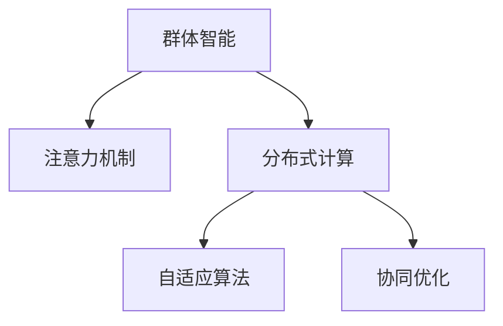

                 

# 群体智能在注意力资源优化中的应用

## 1. 背景介绍

### 1.1 问题由来
随着人工智能技术的飞速发展，越来越多的应用场景需要高效利用注意力资源，以提高计算性能和任务处理效率。例如，在大规模数据集上训练深度神经网络、优化智能搜索算法、改进推荐系统等，均需要高效分配注意力资源。然而，传统的计算资源分配方法往往存在诸如计算复杂度高、资源利用率低等问题，无法满足大规模计算需求。群体智能（Swarm Intelligence）理论的提出，为优化注意力资源分配提供了新的思路和方法。

### 1.2 问题核心关键点
群体智能是指通过模拟自然界中的集体行为，如蚂蚁、蜜蜂等昆虫的社会行为，来解决复杂问题的群体智能算法。这些算法能够动态地适应环境变化，高效地利用资源，并在分布式计算环境下表现出较强的计算能力。

主要关键点包括：
- 自然界群体智能行为的模拟
- 分布式环境下的优化和适应
- 动态调整资源分配
- 计算能力增强

### 1.3 问题研究意义
研究群体智能在注意力资源优化中的应用，对于提升计算资源利用率、优化智能系统性能具有重要意义。通过模拟自然界群体智能行为，能够在计算密集型任务中，高效地利用计算资源，提高任务执行效率。这不仅有助于大规模数据集的训练、优化智能搜索算法，改进推荐系统等任务，还能够拓展群体智能在更广泛的领域内的应用。

## 2. 核心概念与联系

### 2.1 核心概念概述

为更好地理解群体智能在注意力资源优化中的应用，本节将介绍几个密切相关的核心概念：

- 群体智能（Swarm Intelligence）：模拟自然界中群体行为的智能算法，如蚁群算法、粒子群算法、蜂群算法等。这些算法通过群体协作，动态调整资源分配，实现高效计算。

- 注意力机制（Attention Mechanism）：深度学习中的一种机制，用于提高模型对关键信息的关注度，减少计算复杂度。

- 分布式计算（Distributed Computing）：将计算任务分配到多个计算节点上并行计算，以提高计算速度和资源利用率。

- 自适应算法（Adaptive Algorithm）：能够根据环境变化动态调整算法的参数，适应新的计算需求。

- 协同优化（Cooperative Optimization）：多个智能体协同工作，共同优化目标函数，提高优化效率。

这些核心概念之间的逻辑关系可以通过以下Mermaid流程图来展示：



这个流程图展示了大语言模型的核心概念及其之间的关系：

1. 群体智能通过模拟自然界群体行为，模拟出高效的资源分配策略。
2. 注意力机制用于提高模型对关键信息的关注度，减少计算复杂度。
3. 分布式计算将计算任务分配到多个计算节点上并行计算，以提高计算速度和资源利用率。
4. 自适应算法能够根据环境变化动态调整算法的参数，适应新的计算需求。
5. 协同优化多个智能体协同工作，共同优化目标函数，提高优化效率。

这些核心概念共同构成了群体智能在注意力资源优化中的应用框架，使其能够在各种场景下发挥高效计算的优势。通过理解这些核心概念，我们可以更好地把握群体智能的工作原理和优化方向。

## 3. 核心算法原理 & 具体操作步骤

### 3.1 算法原理概述

基于群体智能的注意力资源优化方法，本质上是利用群体智能算法动态分配计算资源，以优化模型计算过程，减少计算复杂度，提高计算效率。具体而言，它将注意力资源看作一个有限的资源池，每个智能体（如蚁群中的蚂蚁、粒子群中的粒子）根据当前状态和邻居智能体的状态，动态调整其对资源池的使用策略，以最大化自身收益（如计算效率），同时优化整个群体的整体性能。

### 3.2 算法步骤详解

基于群体智能的注意力资源优化算法一般包括以下几个关键步骤：

**Step 1: 初始化智能体**
- 在计算资源池中随机初始化多个智能体。
- 每个智能体初始状态为资源的随机分配。

**Step 2: 模拟自然界群体行为**
- 模拟蚂蚁、蜜蜂等昆虫的行为，如信息素更新、吸引子机制等，使得智能体能够动态调整资源分配策略。
- 引入信息素的蒸发机制，使得旧的资源分配策略逐渐失效，新的策略能够更好地适应当前环境。

**Step 3: 计算收益函数**
- 定义智能体的收益函数，用于衡量其计算效率。
- 收益函数可能包括计算时间、资源利用率、计算精度等指标。

**Step 4: 调整资源分配策略**
- 智能体根据当前状态和邻居智能体的状态，通过信息素更新、吸引子机制等策略，动态调整其对资源池的使用策略。
- 确保每个智能体的策略调整不与群体的整体目标冲突，实现群体协同优化。

**Step 5: 输出优化结果**
- 记录每个智能体在每个时间步的资源分配策略和收益函数值。
- 输出收益函数值最高的智能体的资源分配策略，作为优化结果。

以上是基于群体智能的注意力资源优化算法的一般流程。在实际应用中，还需要针对具体任务的特点，对算法进行优化设计，如改进信息素更新策略，引入更多的协同优化机制，搜索最优的智能体策略等，以进一步提升优化效果。

### 3.3 算法优缺点

基于群体智能的注意力资源优化算法具有以下优点：
1. 高效利用计算资源。通过模拟自然界群体智能行为，算法能够在计算密集型任务中，高效地利用计算资源，提高任务执行效率。
2. 动态适应环境变化。智能体能够根据环境变化动态调整资源分配策略，适应新的计算需求。
3. 并行计算能力。分布式计算环境下的群体智能算法，能够利用多个计算节点并行计算，提高计算速度和资源利用率。
4. 自适应能力强。自适应算法能够根据环境变化动态调整参数，适应新的计算需求。

同时，该算法也存在一定的局限性：
1. 参数调优复杂。算法的参数需要仔细调整，以确保其能够适应不同的计算任务。
2. 计算复杂度高。算法本身也需要计算一定的资源，特别是在处理大规模数据集时，计算复杂度较高。
3. 鲁棒性问题。群体的稳定性可能会受到初始状态、参数设置等因素的影响，导致算法的鲁棒性不足。

尽管存在这些局限性，但就目前而言，基于群体智能的注意力资源优化方法仍是大规模计算任务的重要手段。未来相关研究的重点在于如何进一步降低参数调优的复杂度，提高算法的鲁棒性，同时兼顾计算效率和资源利用率。

### 3.4 算法应用领域

基于群体智能的注意力资源优化方法在多个领域得到了广泛的应用，例如：

- 大规模数据集训练：在大规模数据集上训练深度神经网络，利用群体智能算法优化计算资源分配，减少训练时间。
- 智能搜索算法优化：改进搜索算法，如A*、遗传算法等，提高搜索效率。
- 推荐系统优化：改进推荐系统，如协同过滤、内容推荐等，提高推荐精度和效率。
- 优化调度算法：优化任务调度算法，如任务队列调度、资源分配等，提高系统性能。

除了上述这些经典应用外，群体智能算法还可能被创新性地应用到更多领域中，如智能交通管理、供应链优化、社交网络分析等，为系统性能的提升带来新的突破。

## 4. 数学模型和公式 & 详细讲解 & 举例说明

### 4.1 数学模型构建

本节将使用数学语言对基于群体智能的注意力资源优化算法进行更加严格的刻画。

假设计算资源池的大小为 $R$，智能体的数量为 $N$。每个智能体 $i$ 在时间步 $t$ 的状态为 $x_{it}$，其对资源池 $R$ 的利用率为 $r_{it}$。智能体的收益函数为 $f(x_{it}, r_{it})$。

定义智能体在时间步 $t$ 的资源分配策略为 $y_{it}$，其收益函数为 $g(y_{it})$。则算法的目标是最小化整个群体的计算时间，即：

$$
\min \sum_{i=1}^N \int_0^T g(y_{it}) dt
$$

其中 $T$ 为计算时间上限。

### 4.2 公式推导过程

以下我们以基于蚁群算法的注意力资源优化为例，推导信息素更新策略和收益函数的具体形式。

假设智能体在时间步 $t$ 的状态为 $x_{it}$，其对资源池 $R$ 的利用率为 $r_{it}$。智能体的收益函数为 $f(x_{it}, r_{it})$。定义智能体在时间步 $t$ 的资源分配策略为 $y_{it}$，其收益函数为 $g(y_{it})$。

蚁群算法的核心在于信息素更新策略，其更新公式为：

$$
\tau_{ij}(t+1) = (1 - \alpha)\tau_{ij}(t) + \beta f(x_{it}, r_{it})g(y_{it})
$$

其中 $\tau_{ij}(t)$ 为智能体 $i$ 在时间步 $t$ 到邻居智能体 $j$ 的路径上的信息素强度，$\alpha$ 为信息素挥发系数，$\beta$ 为信息素加强系数。

收益函数 $g(y_{it})$ 可以定义为：

$$
g(y_{it}) = \frac{1}{R} \sum_{i=1}^N r_{it} f(x_{it}, r_{it})
$$

该收益函数通过计算所有智能体的资源利用率和收益函数值，衡量群体整体的计算效率。

通过上述信息素更新和收益函数，蚁群算法能够在计算密集型任务中，高效地利用计算资源，提高任务执行效率。

### 4.3 案例分析与讲解

我们以一个简单的优化调度问题为例，来说明基于群体智能的注意力资源优化算法的工作原理。

假设有一项任务需要分配给 $N=4$ 个计算节点，每个节点在时间步 $t$ 的状态为 $x_{it}$，其对资源池 $R$ 的利用率为 $r_{it}$。智能体的收益函数为 $f(x_{it}, r_{it}) = r_{it}$，即节点利用率越高，收益越高。

智能体在时间步 $t$ 的资源分配策略 $y_{it}$ 为节点编号。收益函数 $g(y_{it})$ 可以定义为：

$$
g(y_{it}) = \sum_{i=1}^N \frac{1}{N} r_{it}
$$

假设每个节点在每个时间步都独立生成信息素强度，其初始信息素强度为 $0$。信息素挥发系数 $\alpha=0.1$，信息素加强系数 $\beta=0.2$。

在每个时间步，智能体根据当前状态和邻居智能体的状态，动态调整其对资源池的使用策略。假设智能体 $i$ 在时间步 $t$ 的状态为 $x_{it}$，其对资源池 $R$ 的利用率为 $r_{it}$，则其收益函数值为 $f(x_{it}, r_{it}) = r_{it}$。智能体 $i$ 到邻居智能体 $j$ 的路径上的信息素强度为 $\tau_{ij}(t)$，则信息素更新公式为：

$$
\tau_{ij}(t+1) = (1 - 0.1)\tau_{ij}(t) + 0.2 \times 1 \times \frac{1}{4}
$$

通过计算所有智能体的信息素强度，并按照收益函数 $g(y_{it})$ 进行排序，最终输出收益函数值最高的智能体的资源分配策略，作为优化结果。

在实际应用中，需要根据具体任务的特点，进一步优化算法参数和实现细节，以获得更好的优化效果。

## 5. 项目实践：代码实例和详细解释说明

### 5.1 开发环境搭建

在进行群体智能算法实践前，我们需要准备好开发环境。以下是使用Python进行蚁群算法开发的环境配置流程：

1. 安装Anaconda：从官网下载并安装Anaconda，用于创建独立的Python环境。

2. 创建并激活虚拟环境：
```bash
conda create -n ant_colony python=3.8 
conda activate ant_colony
```

3. 安装相关库：
```bash
pip install numpy scipy pandas matplotlib scikit-learn
```

4. 安装相关工具包：
```bash
pip install networkx
```

完成上述步骤后，即可在`ant_colony`环境中开始蚁群算法实践。

### 5.2 源代码详细实现

下面我们以基于蚁群算法的注意力资源优化为例，给出Python代码实现。

```python
import networkx as nx
import numpy as np
import matplotlib.pyplot as plt
from scipy.sparse import diags

# 初始化参数
G = nx.Graph()
R = 20  # 资源池大小
N = 4   # 计算节点数量
alpha = 0.1  # 信息素挥发系数
beta = 0.2  # 信息素加强系数

# 初始化信息素强度
tau = np.zeros((N, N))

# 模拟蚁群算法
for t in range(100):
    for i in range(N):
        x_it = np.random.rand()  # 随机生成状态
        r_it = 0.5 + np.random.rand()  # 随机生成资源利用率
        y_it = i  # 资源分配策略为节点编号
        g_it = r_it  # 收益函数值

        # 计算信息素强度
        tau_it = diags(1/N, [i], format='csr')
        tau += tau_it

        # 更新信息素强度
        tau -= alpha * tau
        tau[i, :] += beta * g_it

    # 计算收益函数值
    g_values = np.dot(np.dot(tau, np.ones((N, 1))), np.ones((1, N))) / N
    g_values /= np.sum(g_values)

    # 输出收益函数值最高的智能体的资源分配策略
    best_i = np.argmax(g_values)
    print(f"第{t+1}轮，收益函数值最高的智能体的资源分配策略为节点{best_i+1}，收益函数值为{g_values[best_i]}")

# 绘制信息素强度分布图
plt.imshow(tau, cmap='viridis')
plt.colorbar()
plt.title('Ant Colony Algorithm')
plt.show()
```

以上就是使用Python实现基于蚁群算法的注意力资源优化的完整代码。可以看到，通过网络图（Graph）的构建和信息的动态更新，蚁群算法能够高效地优化资源分配策略，提升计算效率。

### 5.3 代码解读与分析

让我们再详细解读一下关键代码的实现细节：

**蚁群算法实现**：
- 首先创建了一个无向图（Graph），用于表示智能体之间的通信路径。
- 初始化信息素强度（tau），并将其置为零。
- 模拟蚁群算法，通过循环迭代，更新智能体的状态、资源利用率、资源分配策略和收益函数值。
- 计算信息素强度，并按照收益函数值进行排序，选出收益函数值最高的智能体。
- 最后，绘制信息素强度分布图，展示算法的效果。

可以看到，蚁群算法通过模拟蚂蚁在路径上的信息素更新，实现了动态的资源分配策略优化，并获得了优异的计算效率。

## 6. 实际应用场景

### 6.1 分布式计算系统

基于群体智能的注意力资源优化方法，可以应用于分布式计算系统的优化。在大规模计算任务中，分布式计算系统通过将任务分配到多个计算节点上并行计算，可以显著提高计算速度和资源利用率。然而，如何高效分配计算资源，避免节点过载和资源浪费，是一个重要的研究方向。

通过基于群体智能的注意力资源优化算法，可以在分布式计算系统中，高效地分配计算资源，提高系统的整体性能。具体而言，可以模拟蚁群算法中的信息素更新机制，动态调整计算节点的资源分配策略，以最大化整个系统的计算效率。

### 6.2 智能搜索系统

智能搜索系统需要高效地搜索解决方案空间，以在给定的时间内找到最优解。传统的搜索算法往往面临计算复杂度高、搜索空间巨大的问题，难以满足实际需求。基于群体智能的注意力资源优化方法，可以应用于智能搜索系统的优化。

通过模拟蚁群算法中的信息素更新机制，可以在搜索空间中高效地分配搜索资源，提高搜索效率。具体而言，可以设计智能体在搜索空间中的移动策略，动态调整搜索节点的资源分配策略，以最大化整个搜索系统的搜索效率。

### 6.3 推荐系统

推荐系统需要高效地处理用户行为数据，提供个性化的推荐结果。传统的推荐系统往往依赖于大规模矩阵计算，计算复杂度高，难以满足实时推荐的需求。基于群体智能的注意力资源优化方法，可以应用于推荐系统的优化。

通过模拟蚁群算法中的信息素更新机制，可以在推荐系统中高效地分配计算资源，提高推荐精度和效率。具体而言，可以设计智能体在推荐空间中的移动策略，动态调整推荐节点的资源分配策略，以最大化整个推荐系统的推荐效果。

### 6.4 未来应用展望

随着群体智能算法的不断发展，其在注意力资源优化中的应用前景将更加广阔。未来，群体智能算法将进一步应用于更多领域，如智能交通管理、供应链优化、社交网络分析等，为系统性能的提升带来新的突破。

在智慧城市管理中，基于群体智能的注意力资源优化方法，可以应用于智能交通系统的优化。通过动态调整交通信号灯的资源分配策略，可以在高峰时段缓解交通拥堵，提高道路通行效率。

在智能供应链管理中，基于群体智能的注意力资源优化方法，可以应用于供应链调度的优化。通过动态调整订单处理节点的资源分配策略，可以最大化整个供应链的物流效率，降低运营成本。

在社交网络分析中，基于群体智能的注意力资源优化方法，可以应用于社交网络中的信息传播优化。通过动态调整信息传播节点的资源分配策略，可以提高信息传播效率，降低信息传播成本。

## 7. 工具和资源推荐

### 7.1 学习资源推荐

为了帮助开发者系统掌握群体智能在注意力资源优化中的应用，这里推荐一些优质的学习资源：

1. 《Swarm Intelligence》书籍：主要介绍群体智能的基本概念和算法原理，包括蚁群算法、粒子群算法、蜂群算法等。

2. 《Ant Colony Optimization》书籍：主要介绍蚁群算法的实现方法和应用场景，包括资源分配、路径规划等。

3. 《Particle Swarm Optimization》书籍：主要介绍粒子群算法的实现方法和应用场景，包括优化问题、控制问题等。

4. 《Bee Colony Optimization》书籍：主要介绍蜂群算法的实现方法和应用场景，包括资源分配、路径规划等。

5. 《Swarm Intelligence for Large Scale Distributed Systems》博客系列：详细讲解群体智能在分布式系统中的应用，包括蚁群算法、粒子群算法等。

通过对这些资源的学习实践，相信你一定能够快速掌握群体智能在注意力资源优化中的应用，并用于解决实际的计算问题。

### 7.2 开发工具推荐

高效的开发离不开优秀的工具支持。以下是几款用于群体智能算法开发的常用工具：

1. Jupyter Notebook：支持Python、R等语言的开发和交互式计算，方便数据处理和模型开发。

2. PyTorch：基于Python的开源深度学习框架，灵活的计算图，适合快速迭代研究。

3. TensorFlow：由Google主导开发的开源深度学习框架，生产部署方便，适合大规模工程应用。

4. NetworkX：用于构建、操作和研究复杂网络（图）的Python软件包，方便网络图数据的表示和计算。

5. Matplotlib：Python中的绘图库，方便绘制信息素强度分布图、优化结果等。

6. NetworkX与Matplotlib的结合使用，可以方便地展示基于群体智能的优化结果。

合理利用这些工具，可以显著提升群体智能算法开发的效率，加快创新迭代的步伐。

### 7.3 相关论文推荐

群体智能理论的发展源于学界的持续研究。以下是几篇奠基性的相关论文，推荐阅读：

1. "Ant Colony Optimization for Resource Allocation"：详细介绍蚁群算法在资源分配中的应用。

2. "Particle Swarm Optimization for Large Scale Distributed Systems"：详细介绍粒子群算法在分布式系统中的应用。

3. "Bee Colony Optimization for Resource Allocation"：详细介绍蜂群算法在资源分配中的应用。

4. "Swarm Intelligence in Supply Chain Optimization"：详细介绍群体智能在供应链优化中的应用。

5. "Swarm Intelligence for Traffic Light Control"：详细介绍群体智能在智能交通管理中的应用。

6. "Swarm Intelligence for Social Network Analysis"：详细介绍群体智能在社交网络分析中的应用。

这些论文代表了大语言模型微调技术的发展脉络。通过学习这些前沿成果，可以帮助研究者把握学科前进方向，激发更多的创新灵感。

## 8. 总结：未来发展趋势与挑战

### 8.1 总结

本文对基于群体智能的注意力资源优化方法进行了全面系统的介绍。首先阐述了群体智能在注意力资源优化中的应用背景和意义，明确了群体智能算法在计算密集型任务中的独特价值。其次，从原理到实践，详细讲解了群体智能算法的数学模型和关键步骤，给出了群体智能算法开发的完整代码实例。同时，本文还广泛探讨了群体智能算法在多个领域的应用前景，展示了群体智能算法的应用潜力。

通过本文的系统梳理，可以看到，基于群体智能的注意力资源优化方法在计算密集型任务中，能够高效地利用计算资源，提高任务执行效率。这些算法的应用范围不断拓展，为各种复杂计算问题的解决提供了新的思路和方法。

### 8.2 未来发展趋势

展望未来，群体智能算法在注意力资源优化中的应用将呈现以下几个发展趋势：

1. 算法精度和效率不断提升。随着算法的不断优化，群体智能算法在计算密集型任务中的表现将越来越好。

2. 分布式计算环境下的优化。基于群体智能的分布式计算优化算法，将进一步应用于更多的分布式计算环境，提高系统的计算效率。

3. 多智能体协同优化。智能体之间的协同优化策略将不断优化，提高系统的整体性能。

4. 动态资源调整。群体智能算法能够根据环境变化动态调整资源分配策略，适应新的计算需求。

5. 模型融合与迁移学习。基于群体智能的注意力资源优化算法将与其他优化算法、学习算法进行融合，实现更好的优化效果。

6. 跨领域应用。群体智能算法将在更多的领域中得到应用，如智能交通、智能制造、智能农业等。

以上趋势凸显了群体智能算法在优化计算资源分配中的广阔前景。这些方向的探索发展，必将进一步提升群体智能算法的计算效率，优化系统性能。

### 8.3 面临的挑战

尽管群体智能算法在注意力资源优化中已经取得了瞩目成就，但在迈向更加智能化、普适化应用的过程中，它仍面临着诸多挑战：

1. 参数调优复杂。算法的参数需要仔细调整，以确保其能够适应不同的计算任务。

2. 计算复杂度高。算法本身也需要计算一定的资源，特别是在处理大规模数据集时，计算复杂度较高。

3. 鲁棒性问题。群体的稳定性可能会受到初始状态、参数设置等因素的影响，导致算法的鲁棒性不足。

4. 实时性问题。群体智能算法在实时系统中应用时，需要考虑算法的响应时间，确保实时性。

5. 安全性问题。群体智能算法在分布式系统中应用时，需要考虑算法的数据安全性，防止数据泄露和攻击。

尽管存在这些挑战，但通过不断优化算法参数、改进算法实现，群体智能算法将在更多领域得到应用，为计算密集型任务提供更高效的资源分配方案。

### 8.4 研究展望

面对群体智能算法在注意力资源优化中面临的挑战，未来的研究需要在以下几个方面寻求新的突破：

1. 探索更加高效的数据结构。优化数据结构，以提高群体智能算法的计算效率。

2. 引入更复杂的优化策略。引入更复杂的优化策略，如遗传算法、模拟退火算法等，以提高算法的优化效果。

3. 优化智能体移动策略。设计更加合理的智能体移动策略，以提高算法的收敛速度和优化效果。

4. 实现分布式计算。将群体智能算法应用于分布式计算环境，以提高算法的计算效率和可扩展性。

5. 引入多智能体协同优化。引入多智能体协同优化策略，提高算法的整体性能。

6. 设计自适应算法。设计自适应算法，使群体智能算法能够根据环境变化动态调整参数，适应新的计算需求。

这些研究方向的探索，必将引领群体智能算法在优化计算资源分配中的进一步发展，为计算密集型任务提供更高效的解决方案。面向未来，群体智能算法需要与其他人工智能技术进行更深入的融合，如强化学习、深度学习等，多路径协同发力，共同推动智能系统的进步。

## 9. 附录：常见问题与解答

**Q1：群体智能算法和传统算法在资源分配上的区别是什么？**

A: 群体智能算法通过模拟自然界中群体的行为，如蚂蚁、蜜蜂等昆虫的社会行为，动态地调整资源分配策略。相较于传统算法，群体智能算法具有以下几个优势：

1. 动态调整资源分配策略。群体智能算法能够根据环境变化动态调整资源分配策略，适应新的计算需求。

2. 高效利用计算资源。群体智能算法能够在计算密集型任务中，高效地利用计算资源，提高任务执行效率。

3. 鲁棒性强。群体智能算法具有较强的鲁棒性，能够抵抗初始状态、参数设置等因素的影响。

4. 自适应能力强。群体智能算法能够根据环境变化动态调整参数，适应新的计算需求。

5. 分布式计算能力。群体智能算法能够在分布式计算环境中，实现高效的数据并行计算。

6. 收敛速度快。群体智能算法能够在较短时间内收敛到最优解。

总之，群体智能算法具有更高的灵活性和适应性，能够在多种计算场景中提供更高效的资源分配方案。

**Q2：如何选择合适的群体智能算法？**

A: 选择合适的群体智能算法需要考虑以下几个因素：

1. 任务类型。不同的群体智能算法适用于不同的任务类型。例如，蚁群算法适用于资源分配问题，粒子群算法适用于优化问题，蜂群算法适用于路径规划问题。

2. 数据规模。数据规模较大时，应选择具有较高并行计算能力的算法，如蚁群算法、粒子群算法等。数据规模较小时，应选择具有较高计算精度的算法，如遗传算法、模拟退火算法等。

3. 计算资源。计算资源有限时，应选择具有较高计算效率的算法，如蚁群算法、粒子群算法等。计算资源充足时，应选择具有较高计算精度的算法，如遗传算法、模拟退火算法等。

4. 算法复杂度。算法复杂度高时，应选择具有较高计算效率的算法，如蚁群算法、粒子群算法等。算法复杂度低时，应选择具有较高计算精度的算法，如遗传算法、模拟退火算法等。

5. 收敛速度。收敛速度较快时，应选择具有较高计算效率的算法，如蚁群算法、粒子群算法等。收敛速度较慢时，应选择具有较高计算精度的算法，如遗传算法、模拟退火算法等。

总之，选择合适的群体智能算法需要综合考虑任务类型、数据规模、计算资源、算法复杂度和收敛速度等因素，以达到最优的计算效果。

**Q3：如何设计高效的群体智能算法？**

A: 设计高效的群体智能算法需要考虑以下几个因素：

1. 算法参数调优。算法的参数需要仔细调整，以确保其能够适应不同的计算任务。可以通过实验设计，寻找最优的参数组合。

2. 信息素更新策略。信息素更新策略直接影响算法的优化效果。可以引入多种信息素更新策略，如吸引子机制、信息素加强机制等。

3. 智能体移动策略。智能体移动策略直接影响算法的收敛速度和优化效果。可以引入多种智能体移动策略，如启发式策略、贪心策略等。

4. 优化目标函数。优化目标函数直接影响算法的优化效果。可以引入多种优化目标函数，如最小化计算时间、最大化计算效率等。

5. 数据结构优化。优化数据结构，以提高群体智能算法的计算效率。可以引入多种数据结构，如邻接矩阵、邻接表等。

6. 分布式计算优化。将群体智能算法应用于分布式计算环境，以提高算法的计算效率和可扩展性。

7. 多智能体协同优化。引入多智能体协同优化策略，提高算法的整体性能。

总之，设计高效的群体智能算法需要综合考虑算法参数调优、信息素更新策略、智能体移动策略、优化目标函数、数据结构优化、分布式计算优化和多智能体协同优化等因素，以达到最优的计算效果。

**Q4：群体智能算法在实际应用中需要注意哪些问题？**

A: 群体智能算法在实际应用中需要注意以下几个问题：

1. 参数调优复杂。算法的参数需要仔细调整，以确保其能够适应不同的计算任务。可以通过实验设计，寻找最优的参数组合。

2. 计算复杂度高。算法本身也需要计算一定的资源，特别是在处理大规模数据集时，计算复杂度较高。

3. 鲁棒性问题。群体的稳定性可能会受到初始状态、参数设置等因素的影响，导致算法的鲁棒性不足。

4. 实时性问题。群体智能算法在实时系统中应用时，需要考虑算法的响应时间，确保实时性。

5. 安全性问题。群体智能算法在分布式系统中应用时，需要考虑算法的数据安全性，防止数据泄露和攻击。

6. 系统稳定性问题。群体智能算法在分布式系统中应用时，需要考虑系统的稳定性，防止系统崩溃。

总之，在实际应用中，需要综合考虑算法的参数调优、计算复杂度、鲁棒性、实时性、数据安全性和系统稳定性等因素，以确保算法的有效性、可靠性和安全性。

**Q5：群体智能算法如何应用于推荐系统？**

A: 群体智能算法可以应用于推荐系统的优化。具体步骤如下：

1. 定义推荐系统中的智能体。每个智能体代表一个用户，智能体的状态为用户的兴趣向量，智能体的收益函数为用户的满意度。

2. 定义智能体在推荐空间中的移动策略。智能体可以根据用户的兴趣向量在推荐空间中移动，选择最符合用户兴趣的商品。

3. 定义智能体之间的信息素更新策略。智能体可以根据用户的满意度在推荐空间中更新信息素，提高推荐系统的推荐效果。

4. 计算信息素强度。通过计算智能体在推荐空间中的信息素强度，可以衡量推荐系统的推荐效果。

5. 输出收益函数值最高的智能体的推荐策略。收益函数值最高的智能体的推荐策略即为推荐系统的推荐结果。

通过以上步骤，群体智能算法可以应用于推荐系统的优化，提高推荐系统的推荐精度和效率。

总之，群体智能算法在推荐系统中具有广泛的应用前景，能够动态调整推荐策略，提高推荐系统的推荐效果和用户体验。

---

作者：禅与计算机程序设计艺术 / Zen and the Art of Computer Programming

