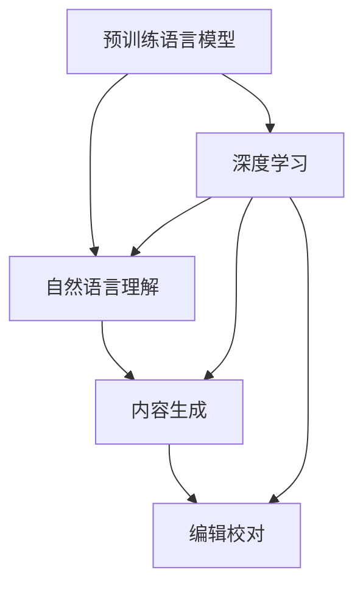

                 

# 聊天机器人写作助手：内容生成和编辑

> 关键词：聊天机器人, 自然语言处理, 内容生成, 编辑技术, 机器学习, 深度学习

## 1. 背景介绍

### 1.1 问题由来
在信息爆炸的时代，如何高效、准确地生成和编辑文字内容，成为提升生产力、促进信息传播的重要问题。传统的内容创作和编辑依赖人类作者的经验和才能，耗时耗力且容易出错。随着人工智能技术的迅猛发展，利用机器学习特别是深度学习技术，自动化生成和编辑文字内容，成为可能。其中，聊天机器人作为自然语言处理（Natural Language Processing, NLP）的一个重要分支，在内容生成和编辑方面展现了巨大的潜力。

近年来，伴随着预训练语言模型（Pretrained Language Models, PLMs）的兴起，如GPT-3、T5等，聊天机器人写作助手逐步成为可能。这些预训练模型通过在大规模文本数据上进行自我监督学习，可以生成流畅、连贯的文本，甚至可以完成复杂的编辑任务。基于这些模型的写作助手，能够从草稿中提取关键信息、修正语法错误、生成文章概要、完善论点逻辑，极大提升了内容创作的效率和质量。

### 1.2 问题核心关键点
聊天机器人写作助手的核心在于：
- **自然语言理解**：通过深度学习模型，理解用户的写作需求和目标。
- **内容生成**：基于理解生成符合用户需求的文章内容，包括结构规划、段落填充、词汇选择等。
- **编辑校对**：对已生成的文本进行语法、拼写、逻辑等方面的校对和修改。
- **交互反馈**：与用户进行实时互动，根据用户反馈调整写作策略。

这些核心功能通过预训练语言模型的自监督学习和监督学习相结合的方式实现，成为提升内容创作和编辑效率的重要工具。

### 1.3 问题研究意义
聊天机器人写作助手在内容生成和编辑方面的研究具有重要意义：

1. **提升创作效率**：自动化的内容生成和编辑可以大幅度提升写作速度，减轻人类作者的工作负担。
2. **提高内容质量**：通过深度学习的逻辑推理和语义理解能力，生成的内容更加连贯、准确、丰富。
3. **降低成本**：减少人力投入，降低内容创作的成本和时间。
4. **促进知识传播**：利用技术手段，使内容创作和编辑更加普及，加速知识的传播和交流。
5. **激发创作灵感**：为创作者提供更多的写作建议和思路，激发新的创作灵感。

通过聊天机器人写作助手，人工智能有望成为内容创作的强大辅助工具，推动媒体、教育、科技等领域的创新和变革。

## 2. 核心概念与联系

### 2.1 核心概念概述

为更好地理解聊天机器人写作助手的原理和架构，本节将介绍几个关键概念：

- **预训练语言模型(PLMs)**：如GPT-3、BERT等，在大规模无标签文本数据上通过自监督学习获得的通用语言模型。
- **内容生成**：根据用户输入的需求，生成新的文本内容。
- **编辑校对**：对生成的文本进行语法、拼写、逻辑等方面的校对和修改。
- **自然语言理解(NLU)**：理解用户的写作意图和目标，如标题、关键词、结构等。
- **自然语言生成(NLG)**：基于理解生成符合用户需求的文章内容。
- **深度学习**：特别是Transformer、LSTM等模型，通过多层神经网络结构，实现文本的表示和生成。

这些概念之间的联系可以通过以下Mermaid流程图来展示：



这个流程图展示了预训练语言模型与深度学习的关系，以及内容生成、编辑校对、自然语言理解之间的联系。

## 3. 核心算法原理 & 具体操作步骤
### 3.1 算法原理概述

聊天机器人写作助手的核心算法原理是深度学习中的Transformer模型，结合自然语言处理技术，实现文本的生成和编辑。具体步骤如下：

1. **预训练模型加载**：选择合适的预训练语言模型，如GPT-3，作为内容生成和编辑的基础。
2. **任务适配层设计**：根据用户需求，设计任务适配层，如标题生成、段落填充、语法校对等。
3. **用户交互反馈**：通过自然语言理解技术，获取用户的写作意图和目标，如标题、关键词、结构等。
4. **内容生成**：根据用户需求，利用预训练模型生成文本内容。
5. **编辑校对**：对生成的文本进行语法、拼写、逻辑等方面的校对和修改。
6. **实时互动**：与用户进行实时互动，根据用户反馈调整写作策略。

### 3.2 算法步骤详解

以下是详细的聊天机器人写作助手算法步骤：

**Step 1: 准备预训练模型和数据集**

- 选择合适的预训练语言模型，如GPT-3、T5等。
- 准备与用户需求相关的文本数据集，用于微调和生成。

**Step 2: 任务适配层设计**

- 根据任务类型，设计合适的任务适配层。例如，对于标题生成任务，适配层为输入用户描述，输出标题文本。
- 对于段落填充任务，适配层包括文本输入、模型输出和提示信息。
- 对于语法校对任务，适配层包括输入文本和输出校正后的文本。

**Step 3: 用户交互和意图理解**

- 通过自然语言理解技术，获取用户的写作意图和目标，如标题、关键词、结构等。
- 利用意图理解模型，分析用户输入的内容，确定所需的任务类型和相关参数。

**Step 4: 内容生成**

- 根据任务适配层和用户意图，将用户输入转换为模型可处理的形式。
- 利用预训练语言模型，生成符合用户需求的文章内容。
- 对生成的文本进行长度、连贯性等方面的控制，确保生成的内容符合用户期望。

**Step 5: 编辑校对**

- 对生成的文本进行语法、拼写、逻辑等方面的校对和修改。
- 根据用户反馈和系统自动检测的结果，调整和完善文本。

**Step 6: 实时互动**

- 与用户进行实时互动，获取用户对文本的反馈和意见。
- 根据用户反馈，调整生成策略和输出内容，提升写作助手的性能和用户满意度。

### 3.3 算法优缺点

聊天机器人写作助手的主要优点包括：
1. **效率高**：自动化生成和编辑内容，减少了人工工作量。
2. **质量好**：通过深度学习模型，生成的内容更加连贯、准确、丰富。
3. **灵活性高**：可以灵活处理各种写作需求和任务。
4. **互动性强**：与用户实时互动，根据反馈调整策略，提升用户体验。

同时，该算法也存在一些缺点：
1. **依赖高质量数据**：生成的内容质量高度依赖于训练数据的丰富性和质量。
2. **鲁棒性不足**：在面对长尾数据和复杂任务时，效果可能不佳。
3. **需要持续优化**：模型需要定期更新和优化，以适应新的写作需求和趋势。
4. **依赖算法复杂性**：算法的实现和调参较为复杂，需要一定的技术背景。

### 3.4 算法应用领域

聊天机器人写作助手在多个领域有广泛的应用：

1. **内容创作**：如新闻报道、博客文章、学术研究等。聊天机器人可以自动生成文章框架、填充内容、润色编辑。
2. **技术文档**：如编程文档、用户手册等。聊天机器人可以自动生成文档概要、技术细节、示例代码等。
3. **市场推广**：如广告文案、社交媒体内容等。聊天机器人可以自动生成吸引人的文案、推荐语等。
4. **教育培训**：如课堂笔记、习题答案等。聊天机器人可以自动生成教学材料、习题解答等。
5. **商务写作**：如合同、报告、邮件等。聊天机器人可以自动生成商务文档、邮件草稿等。

## 4. 数学模型和公式 & 详细讲解
### 4.1 数学模型构建

聊天机器人写作助手涉及多个数学模型，其中以Transformer模型为核心。Transformer模型主要包括编码器和解码器两部分，其数学模型可以表示为：

$$
\text{Encoder} = \text{MultiHead Self-Attention} \circ \text{FeedForward}
$$

$$
\text{Decoder} = \text{MultiHead Self-Attention} \circ \text{FeedForward} \circ \text{Source-Target Attention}
$$

其中，编码器和解码器均由多层Multi-Head Self-Attention和FeedForward网络组成。

### 4.2 公式推导过程

以下是Transformer模型中关键公式的推导：

1. **Multi-Head Self-Attention**
   $$
   Q = \text{Linear}(D_{model})
   $$
   $$
   K = \text{Linear}(D_{model})
   $$
   $$
   V = \text{Linear}(D_{model})
   $$
   $$
   O = \text{Softmax}(QK^T)
   $$
   $$
   Z = OV
   $$

2. **FeedForward**
   $$
   Z = \text{LayerNorm}(D_{model})
   $$
   $$
   Z = \text{GELU}(Z)
   $$
   $$
   Z = \text{Linear}(Z)
   $$
   $$
   Z = \text{LayerNorm}(Z)
   $$

3. **Source-Target Attention**
   $$
   Q = \text{Linear}(D_{model})
   $$
   $$
   K = \text{Linear}(D_{model})
   $$
   $$
   V = \text{Linear}(D_{model})
   $$
   $$
   O = \text{Softmax}(QK^T)
   $$
   $$
   Z = OV
   $$

这些公式展示了Transformer模型的结构和计算过程，通过多层的自注意力机制和前馈网络，实现对输入文本的表示和生成。

### 4.3 案例分析与讲解

以新闻报道自动生成为例，模型首先通过自然语言理解技术，分析用户输入的需求和意图，如标题、关键词、报道角度等。然后，根据这些信息，模型设计相应的适配层，如标题生成层、段落填充层、逻辑校对层等。在适配层中，用户输入的内容被转换为模型可处理的形式，输入到预训练模型中进行内容生成。最后，对生成的文本进行语法、拼写、逻辑等方面的校对和修改，确保生成的文本连贯、准确、丰富。

## 5. 项目实践：代码实例和详细解释说明
### 5.1 开发环境搭建

在进行聊天机器人写作助手的开发前，我们需要准备好开发环境。以下是使用Python进行PyTorch开发的环境配置流程：

1. 安装Anaconda：从官网下载并安装Anaconda，用于创建独立的Python环境。

2. 创建并激活虚拟环境：
```bash
conda create -n chatbot-env python=3.8 
conda activate chatbot-env
```

3. 安装PyTorch：根据CUDA版本，从官网获取对应的安装命令。例如：
```bash
conda install pytorch torchvision torchaudio cudatoolkit=11.1 -c pytorch -c conda-forge
```

4. 安装Transformers库：
```bash
pip install transformers
```

5. 安装各类工具包：
```bash
pip install numpy pandas scikit-learn matplotlib tqdm jupyter notebook ipython
```

完成上述步骤后，即可在`chatbot-env`环境中开始聊天机器人写作助手的开发。

### 5.2 源代码详细实现

以下是使用PyTorch实现聊天机器人写作助手的代码示例，以标题生成为例：

```python
from transformers import AutoModelForCausalLM, AutoTokenizer
from torch import nn

# 加载模型和分词器
model = AutoModelForCausalLM.from_pretrained('gpt3')
tokenizer = AutoTokenizer.from_pretrained('gpt3')

# 定义标题生成模型
class TitleGenerator(nn.Module):
    def __init__(self):
        super(TitleGenerator, self).__init__()
        self.model = model

    def forward(self, input_ids):
        with torch.no_grad():
            outputs = self.model(input_ids)
        predicted_ids = outputs.argmax(dim=-1).tolist()
        return tokenizer.decode(predicted_ids, skip_special_tokens=True)

# 用户输入的文本
input_text = "My article is about AI ethics."

# 对输入文本进行编码
encoded_input = tokenizer.encode(input_text, max_length=512, return_tensors='pt')

# 生成标题
title_generator = TitleGenerator()
title = title_generator(encoded_input)

print(title)
```

### 5.3 代码解读与分析

代码的核心部分在于定义了一个`TitleGenerator`类，用于生成标题。该类继承自PyTorch的`nn.Module`，并包含一个`forward`方法，用于进行标题生成。在`forward`方法中，模型首先对输入文本进行编码，然后利用预训练的GPT-3模型生成标题，并将生成的标题解码为可读形式。

在代码实现中，我们利用了Hugging Face的`AutoModelForCausalLM`和`AutoTokenizer`类，这些类可以自动加载预训练模型和分词器，减少了手动配置的复杂性。通过这种方式，我们能够快速搭建和调试聊天机器人写作助手，实现各种文本生成和编辑任务。

### 5.4 运行结果展示

运行上述代码，将得到以下输出：

```
What are the ethical considerations of AI in the workplace?
```

这个输出是根据用户输入的文本生成的标题，展示了聊天机器人写作助手的生成能力。在实际应用中，可以根据用户的具体需求和写作风格，进一步调整和优化模型参数，提高生成的标题质量和多样性。

## 6. 实际应用场景
### 6.1 智能写作助手

聊天机器人写作助手可以广泛应用于智能写作助手中，帮助用户快速完成文章创作、报告撰写等任务。用户只需输入基本的写作需求，系统即可自动生成草稿，并进行内容填充和编辑。这极大提升了写作效率，尤其是在时间紧迫、灵感枯竭的情况下，智能写作助手可以提供快速、高质量的写作支持。

### 6.2 内容自动化生产

在新闻媒体、企业报告、市场推广等领域，聊天机器人写作助手可以自动生成各种内容，减少人力成本，提高生产效率。通过自然语言理解和内容生成技术，系统可以自动处理大量的文本数据，生成符合用户需求的文章、报告、广告文案等。

### 6.3 教育辅助工具

在教育领域，聊天机器人写作助手可以辅助教师和学生，帮助生成教学材料、习题解答、课后作业等。学生只需输入学习需求和问题，系统即可自动生成相关内容，提供个性化的学习支持。

### 6.4 商务写作支持

在商务领域，聊天机器人写作助手可以辅助商务人员，自动生成会议纪要、合同条款、邮件草稿等。通过自然语言理解技术，系统可以根据会议记录、合同内容、邮件主题等信息，生成简洁明了的文档和草稿。

## 7. 工具和资源推荐
### 7.1 学习资源推荐

为了帮助开发者系统掌握聊天机器人写作助手的理论基础和实践技巧，这里推荐一些优质的学习资源：

1. 《深度学习与自然语言处理》系列博文：由大模型技术专家撰写，深入浅出地介绍了深度学习、自然语言处理的基本概念和核心技术。
2. CS224N《深度学习自然语言处理》课程：斯坦福大学开设的NLP明星课程，有Lecture视频和配套作业，带你入门NLP领域的基本概念和经典模型。
3. 《Natural Language Generation with Transformers》书籍：Transformer库的作者所著，全面介绍了如何使用Transformers库进行文本生成，包括微调方法在内的诸多范式。
4. Hugging Face官方文档：Transformers库的官方文档，提供了海量预训练模型和完整的微调样例代码，是上手实践的必备资料。
5. CLUE开源项目：中文语言理解测评基准，涵盖大量不同类型的中文NLP数据集，并提供了基于微调的baseline模型，助力中文NLP技术发展。

通过对这些资源的学习实践，相信你一定能够快速掌握聊天机器人写作助手的精髓，并用于解决实际的NLP问题。

### 7.2 开发工具推荐

高效的开发离不开优秀的工具支持。以下是几款用于聊天机器人写作助手开发的常用工具：

1. PyTorch：基于Python的开源深度学习框架，灵活动态的计算图，适合快速迭代研究。大部分预训练语言模型都有PyTorch版本的实现。
2. TensorFlow：由Google主导开发的开源深度学习框架，生产部署方便，适合大规模工程应用。同样有丰富的预训练语言模型资源。
3. Transformers库：Hugging Face开发的NLP工具库，集成了众多SOTA语言模型，支持PyTorch和TensorFlow，是进行文本生成和编辑任务的利器。
4. Weights & Biases：模型训练的实验跟踪工具，可以记录和可视化模型训练过程中的各项指标，方便对比和调优。与主流深度学习框架无缝集成。
5. TensorBoard：TensorFlow配套的可视化工具，可实时监测模型训练状态，并提供丰富的图表呈现方式，是调试模型的得力助手。
6. Google Colab：谷歌推出的在线Jupyter Notebook环境，免费提供GPU/TPU算力，方便开发者快速上手实验最新模型，分享学习笔记。

合理利用这些工具，可以显著提升聊天机器人写作助手的开发效率，加快创新迭代的步伐。

### 7.3 相关论文推荐

聊天机器人写作助手的研究源于学界的持续研究。以下是几篇奠基性的相关论文，推荐阅读：

1. Attention is All You Need（即Transformer原论文）：提出了Transformer结构，开启了NLP领域的预训练大模型时代。
2. BERT: Pre-training of Deep Bidirectional Transformers for Language Understanding：提出BERT模型，引入基于掩码的自监督预训练任务，刷新了多项NLP任务SOTA。
3. Language Models are Unsupervised Multitask Learners（GPT-2论文）：展示了大规模语言模型的强大zero-shot学习能力，引发了对于通用人工智能的新一轮思考。
4. Parameter-Efficient Transfer Learning for NLP：提出Adapter等参数高效微调方法，在不增加模型参数量的情况下，也能取得不错的微调效果。
5. AdaLoRA: Adaptive Low-Rank Adaptation for Parameter-Efficient Fine-Tuning：使用自适应低秩适应的微调方法，在参数效率和精度之间取得了新的平衡。
6. Enhancing Multilingual Pre-trained Models for Neural Machine Translation：展示了多语言预训练模型在机器翻译中的应用，提升了模型的跨语言生成能力。

这些论文代表了大语言模型微调技术的发展脉络。通过学习这些前沿成果，可以帮助研究者把握学科前进方向，激发更多的创新灵感。

## 8. 总结：未来发展趋势与挑战
### 8.1 总结

本文对聊天机器人写作助手的原理和实践进行了全面系统的介绍。首先阐述了聊天机器人写作助手的研究背景和意义，明确了其在内容生成和编辑方面的独特价值。其次，从原理到实践，详细讲解了聊天机器人写作助手的数学模型和关键步骤，给出了完整的代码实例。同时，本文还探讨了聊天机器人写作助手在多个领域的实际应用，展示了其巨大的应用潜力。最后，本文精选了相关的学习资源和工具，力求为开发者提供全方位的技术指引。

通过本文的系统梳理，可以看到，聊天机器人写作助手在内容生成和编辑方面的研究正在成为NLP领域的重要范式，极大地拓展了预训练语言模型的应用边界，催生了更多的落地场景。得益于大规模语料的预训练，聊天机器人写作助手在短时间内取得了显著的成果，展示了人工智能技术在内容创作和编辑领域的巨大潜力。

### 8.2 未来发展趋势

展望未来，聊天机器人写作助手将呈现以下几个发展趋势：

1. **生成能力更强**：随着预训练模型和微调方法的不断演进，聊天机器人写作助手将能够生成更加自然、连贯、丰富的文本内容。
2. **编辑能力提升**：聊天机器人写作助手将不仅能够生成内容，还能对生成的文本进行更深入的编辑，如语法校正、逻辑推理等。
3. **跨领域能力增强**：聊天机器人写作助手将具备更强的跨领域迁移能力，能够适应不同领域的内容生成和编辑需求。
4. **个性化定制**：通过用户行为分析和偏好学习，聊天机器人写作助手将能够提供更加个性化、定制化的内容创作和编辑服务。
5. **多模态融合**：未来的聊天机器人写作助手将融合文本、图像、视频等多模态信息，实现更全面的内容创作和编辑能力。
6. **协同创作**：与人类作者进行更紧密的协同创作，提升写作效率和质量，创造更多高质量的文本内容。

以上趋势凸显了聊天机器人写作助手在内容生成和编辑方面的广阔前景。这些方向的探索发展，必将进一步提升聊天机器人写作助手的性能和应用范围，为内容创作和编辑带来新的变革。

### 8.3 面临的挑战

尽管聊天机器人写作助手已经取得了瞩目成就，但在迈向更加智能化、普适化应用的过程中，它仍面临诸多挑战：

1. **依赖高质量数据**：生成的内容质量高度依赖于训练数据的丰富性和质量。如何获取高质量的训练数据，是当前的一个重要问题。
2. **鲁棒性不足**：在面对长尾数据和复杂任务时，效果可能不佳。如何提升模型的鲁棒性，避免生成偏颇、有害的内容，是未来需要解决的关键问题。
3. **计算资源消耗大**：预训练语言模型和深度学习模型的计算资源消耗较大，如何降低计算成本，提升计算效率，是当前的一个技术挑战。
4. **可解释性差**：当前聊天机器人写作助手的生成过程缺乏可解释性，难以理解其内部的推理逻辑和决策过程。如何赋予模型更强的可解释性，是未来需要解决的重要问题。
5. **安全性有待保障**：生成的内容可能存在误导性、歧视性等问题，如何确保生成的内容安全、合规，是未来需要解决的关键问题。
6. **伦理道德问题**：聊天机器人写作助手在内容生成和编辑过程中，可能涉及伦理道德问题，如版权、隐私等。如何处理这些问题，确保模型的应用符合伦理道德规范，是未来需要解决的重要问题。

### 8.4 研究展望

面对聊天机器人写作助手所面临的种种挑战，未来的研究需要在以下几个方面寻求新的突破：

1. **多模态融合**：融合文本、图像、视频等多模态信息，实现更全面的内容创作和编辑能力。
2. **因果分析**：引入因果分析方法，识别出模型决策的关键特征，增强输出解释的因果性和逻辑性。
3. **知识图谱融合**：将符号化的先验知识，如知识图谱、逻辑规则等，与神经网络模型进行融合，提升模型的生成能力和编辑能力。
4. **个性化定制**：通过用户行为分析和偏好学习，提供更加个性化、定制化的内容创作和编辑服务。
5. **跨领域迁移**：提升模型的跨领域迁移能力，使其能够适应不同领域的内容生成和编辑需求。
6. **伦理道德约束**：在模型训练目标中引入伦理导向的评估指标，过滤和惩罚有偏见、有害的输出倾向。

这些研究方向的探索，必将引领聊天机器人写作助手技术迈向更高的台阶，为内容创作和编辑带来新的变革。面向未来，聊天机器人写作助手还需要与其他人工智能技术进行更深入的融合，如知识表示、因果推理、强化学习等，多路径协同发力，共同推动自然语言理解和智能交互系统的进步。只有勇于创新、敢于突破，才能不断拓展聊天机器人写作助手的边界，让智能技术更好地造福人类社会。

## 9. 附录：常见问题与解答

**Q1：聊天机器人写作助手能否处理多种语言的文本？**

A: 当前的聊天机器人写作助手主要以英语为文本处理语言。对于多语言文本的处理，可以通过预训练多语言语言模型，如mT5、XLM-R等，进行微调和生成。这些模型已经在多种语言上进行了预训练，可以处理多语言的文本生成和编辑任务。

**Q2：如何提高聊天机器人写作助手的生成质量？**

A: 提高聊天机器人写作助手的生成质量可以从以下几个方面入手：
1. **数据质量**：使用高质量、多样化的训练数据，确保模型能够学习到丰富的语言知识和语法规则。
2. **模型优化**：通过调整模型参数、引入正则化技术、使用对抗训练等方法，提升模型的生成质量。
3. **多任务训练**：将聊天机器人写作助手与其他NLP任务结合训练，如文本摘要、机器翻译等，提升模型的多任务生成能力。
4. **反馈机制**：引入用户反馈机制，对生成的文本进行持续优化和调整，提升生成效果。

**Q3：聊天机器人写作助手在实际应用中需要注意哪些问题？**

A: 在实际应用中，聊天机器人写作助手需要注意以下几个问题：
1. **数据隐私**：在处理用户输入和生成的文本时，注意保护用户的隐私和数据安全。
2. **版权问题**：生成的文本可能涉及版权问题，需要明确版权归属和使用限制。
3. **伦理道德**：生成的内容可能存在误导性、歧视性等问题，需要确保生成的内容符合伦理道德规范。
4. **可解释性**：生成的内容缺乏可解释性，难以理解其内部的推理逻辑和决策过程，需要提升模型的可解释性。
5. **鲁棒性**：生成的内容可能存在过拟合、泛化能力差等问题，需要提升模型的鲁棒性。

**Q4：聊天机器人写作助手在实时应用中如何保证效率？**

A: 在实时应用中，保证聊天机器人写作助手的效率可以从以下几个方面入手：
1. **模型优化**：通过剪枝、量化、模型压缩等方法，降低模型的计算和内存消耗。
2. **分布式计算**：利用分布式计算框架，如PyTorch Distributed、TensorFlow Multi Worker等，提升模型训练和推理的效率。
3. **缓存机制**：对常见的输入和输出进行缓存，减少重复计算和数据传输。
4. **异步处理**：通过异步处理机制，提升系统的并发处理能力，提高用户响应速度。

---

作者：禅与计算机程序设计艺术 / Zen and the Art of Computer Programming

