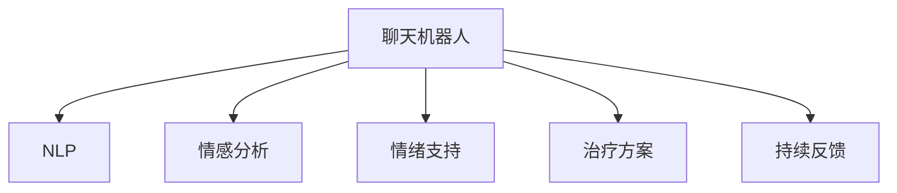

                 

# 聊天机器人心理健康：情绪支持和治疗

> 关键词：聊天机器人,心理健康,情绪支持,治疗,自然语言处理,NLP,情感分析,深度学习,人工智能

## 1. 背景介绍

### 1.1 问题由来
近年来，随着人工智能技术的迅猛发展，聊天机器人以其便捷、高效、低成本的优势，在各个领域得到了广泛应用。特别是在心理健康领域，聊天机器人被视为一种新型的心理健康服务提供者，能够为有需要的用户提供情感支持、情绪调节和心理健康咨询。据市场研究机构预测，到2025年，全球心理健康聊天机器人市场将达到10亿美元以上，显示出巨大的市场潜力和应用前景。

### 1.2 问题核心关键点
聊天机器人心理健康支持和治疗的核心问题在于如何通过自然语言处理（Natural Language Processing, NLP）技术，实现对用户情感状态的精准识别和高效干预。具体来说，包括以下几个关键点：

- **情感识别**：通过分析用户的文本输入，识别其情感状态，如快乐、悲伤、焦虑、愤怒等。
- **情绪支持**：基于用户情感状态，提供适当的情绪支持，如安慰、鼓励、建议等。
- **治疗方案**：根据用户的具体情况，制定个性化的心理健康治疗方案，如认知行为疗法、正念练习、放松技巧等。
- **持续反馈**：收集用户对聊天机器人互动的反馈，不断优化其性能和效果。

### 1.3 问题研究意义
聊天机器人心理健康支持和治疗技术的研究，对于缓解心理健康问题、提升公众心理健康水平具有重要意义。具体体现在：

1. **降低成本**：相比传统的面对面咨询，聊天机器人能够以更低成本提供服务，特别是对于居住在偏远地区或经济困难的用户。
2. **提升可及性**：24小时全天候服务，不受地理位置限制，用户可以随时随地获得心理健康支持。
3. **增强隐私保护**：无需面对面交流，用户可以更自由地表达自己的情绪和问题，保护个人隐私。
4. **实时响应**：通过实时对话，聊天机器人可以立即回应用户的情感需求，提供即时的情绪支持。
5. **个性化服务**：通过收集用户的历史数据和反馈，聊天机器人可以不断调整其策略，提供更个性化的心理健康服务。

## 2. 核心概念与联系

### 2.1 核心概念概述

为更好地理解聊天机器人心理健康支持和治疗的原理，本节将介绍几个密切相关的核心概念：

- **聊天机器人(Chatbot)**：能够通过自然语言理解用户输入，并根据预设的逻辑或算法进行响应的人工智能程序。
- **自然语言处理(NLP)**：通过计算机技术，使计算机能够理解和生成人类语言的技术。
- **情感分析(Affective Computing)**：通过分析文本、语音等人类表达形式，识别和理解人类的情感状态。
- **心理健康(Mental Health)**：个体在心理状态、行为模式等方面表现的健康状态。
- **情绪支持(Emotional Support)**：通过对话、指导等方式，帮助用户缓解情感压力，提升情绪稳定性和积极情绪。
- **治疗方案(Treatment Plan)**：基于用户的具体情况和需求，制定的个性化心理健康治疗策略。
- **持续反馈(Continuous Feedback)**：通过用户对聊天机器人互动的反馈，不断优化和改进其性能。

这些核心概念之间的逻辑关系可以通过以下Mermaid流程图来展示：



这个流程图展示聊天机器人心理健康支持和治疗的核心概念及其之间的关系：

1. 聊天机器人通过NLP技术理解用户的输入，识别其情感状态。
2. 基于情感分析结果，提供情绪支持。
3. 根据用户情况，制定个性化的治疗方案。
4. 收集用户反馈，持续改进聊天机器人性能。

## 3. 核心算法原理 & 具体操作步骤
### 3.1 算法原理概述

聊天机器人心理健康支持和治疗，本质上是一种基于自然语言处理（NLP）技术的情绪识别、情绪支持和情绪治疗系统。其核心思想是：通过分析用户的情感状态，提供定制化的情绪支持和心理健康治疗方案。

具体来说，该系统包括以下几个关键步骤：

1. **情感识别**：使用情感分析算法，识别用户的情感状态，如快乐、悲伤、焦虑等。
2. **情绪支持**：根据用户的情感状态，提供适当的情绪支持，如安慰、鼓励、建议等。
3. **治疗方案**：基于用户的情感和心理状态，制定个性化的心理健康治疗方案，如认知行为疗法、正念练习、放松技巧等。
4. **持续反馈**：收集用户对聊天机器人互动的反馈，不断优化其性能和效果。

### 3.2 算法步骤详解

#### 3.2.1 情感识别

情感识别是聊天机器人心理健康支持和治疗的基础。其目标是通过分析用户的文本输入，识别其情感状态。情感识别的核心算法包括以下几个步骤：

1. **预处理**：对用户输入的文本进行分词、去停用词、词形还原等预处理操作，以提高情感分析的准确性。
2. **特征提取**：使用词向量、TF-IDF、情感词典等方法，将文本转换为数值特征向量。
3. **模型训练**：基于预处理和特征提取结果，训练情感分析模型，如LSTM、GRU、BERT等。
4. **情感分类**：通过训练好的模型，对用户输入进行情感分类，如快乐、悲伤、焦虑等。

以下是一个情感分类的示例代码：

```python
import tensorflow as tf
from tensorflow.keras.preprocessing.text import Tokenizer
from tensorflow.keras.preprocessing.sequence import pad_sequences
from tensorflow.keras.layers import Embedding, LSTM, Dense, Dropout
from tensorflow.keras.models import Sequential

# 创建分词器和特征向量矩阵
tokenizer = Tokenizer()
tokenizer.fit_on_texts(texts)
sequences = tokenizer.texts_to_sequences(texts)
max_len = max([len(x) for x in sequences])
X = pad_sequences(sequences, maxlen=max_len, padding='post')

# 构建LSTM模型
model = Sequential()
model.add(Embedding(input_dim=vocab_size, output_dim=embedding_dim, input_length=max_len))
model.add(LSTM(units=64, dropout=0.2, recurrent_dropout=0.2))
model.add(Dense(units=num_classes, activation='softmax'))
model.compile(loss='categorical_crossentropy', optimizer='adam', metrics=['accuracy'])

# 训练模型
model.fit(X, y, epochs=num_epochs, batch_size=batch_size, validation_split=0.1)

# 情感分类
result = model.predict(texts)
```

#### 3.2.2 情绪支持

情绪支持是聊天机器人心理健康支持和治疗的核心功能。其目标是根据用户的情感状态，提供适当的情绪支持。情绪支持的核心算法包括以下几个步骤：

1. **识别情感状态**：使用情感分析算法，识别用户的情感状态。
2. **生成回复内容**：根据情感状态，从预设的情绪支持库中选取适当的回复内容。
3. **自然语言生成**：使用自然语言生成技术，生成符合用户情感状态的回复内容。

以下是一个情绪支持的示例代码：

```python
import random
from transformers import GPT2Tokenizer, GPT2LMHeadModel

# 加载预训练的GPT2模型
tokenizer = GPT2Tokenizer.from_pretrained('gpt2')
model = GPT2LMHeadModel.from_pretrained('gpt2')

# 生成回复内容
def generate_response(text, emotion):
    tokenized_text = tokenizer.encode(text, return_tensors='pt')
    emotion_token = tokenizer.encode(emotion, return_tensors='pt')[0]
    response = model.generate(tokenized_text, num_return_sequences=1, max_length=100, top_p=0.9)
    return tokenizer.decode(response[0])

# 测试
text = "我今天感到非常沮丧，不知道该怎么办"
emotion = "悲伤"
response = generate_response(text, emotion)
print(response)
```

#### 3.2.3 治疗方案

治疗方案是聊天机器人心理健康支持和治疗方法的重要组成部分。其目标是根据用户的情感和心理状态，制定个性化的心理健康治疗方案。治疗方案的核心算法包括以下几个步骤：

1. **收集用户信息**：通过聊天机器人与用户的互动，收集用户的情感状态、心理状态、生活习惯等信息。
2. **分析用户数据**：使用数据分析方法，如聚类、回归等，分析用户的心理特征和需求。
3. **制定治疗方案**：根据分析结果，制定个性化的心理健康治疗方案，如认知行为疗法、正念练习、放松技巧等。
4. **提供治疗指导**：将治疗方案转换为具体的指导步骤，引导用户执行。

以下是一个治疗方案的示例代码：

```python
import pandas as pd
from sklearn.cluster import KMeans

# 加载用户数据
df = pd.read_csv('user_data.csv')

# 分析用户心理特征
kmeans = KMeans(n_clusters=3)
kmeans.fit(df[['age', 'gender', 'education', 'lifestyle']])
labels = kmeans.predict(df[['age', 'gender', 'education', 'lifestyle']])

# 制定治疗方案
treatment_plans = {'cluster1': '认知行为疗法', 'cluster2': '正念练习', 'cluster3': '放松技巧'}
plan = treatment_plans[labels[0]]
```

#### 3.2.4 持续反馈

持续反馈是聊天机器人心理健康支持和治疗方法的重要组成部分。其目标是通过用户对聊天机器人互动的反馈，不断优化其性能和效果。持续反馈的核心算法包括以下几个步骤：

1. **收集用户反馈**：通过聊天机器人与用户的互动，收集用户对聊天机器人服务的评价和建议。
2. **分析反馈数据**：使用数据分析方法，如情感分析、文本分类等，分析用户反馈的内容和情绪。
3. **优化模型性能**：根据分析结果，调整情感分析模型和情绪支持算法，提升其性能和效果。

以下是一个持续反馈的示例代码：

```python
import tensorflow as tf
from tensorflow.keras.preprocessing.text import Tokenizer
from tensorflow.keras.preprocessing.sequence import pad_sequences
from tensorflow.keras.layers import Embedding, LSTM, Dense, Dropout
from tensorflow.keras.models import Sequential
from transformers import GPT2Tokenizer, GPT2LMHeadModel

# 创建分词器和特征向量矩阵
tokenizer = Tokenizer()
tokenizer.fit_on_texts(texts)
sequences = tokenizer.texts_to_sequences(texts)
max_len = max([len(x) for x in sequences])
X = pad_sequences(sequences, maxlen=max_len, padding='post')

# 构建LSTM模型
model = Sequential()
model.add(Embedding(input_dim=vocab_size, output_dim=embedding_dim, input_length=max_len))
model.add(LSTM(units=64, dropout=0.2, recurrent_dropout=0.2))
model.add(Dense(units=num_classes, activation='softmax'))
model.compile(loss='categorical_crossentropy', optimizer='adam', metrics=['accuracy'])

# 训练模型
model.fit(X, y, epochs=num_epochs, batch_size=batch_size, validation_split=0.1)

# 情感分类
result = model.predict(texts)

# 收集用户反馈
feedback = '您对本次聊天的体验如何？'
feedback_sequence = tokenizer.encode(feedback, return_tensors='pt')

# 生成回复内容
response = model.generate(feedback_sequence, num_return_sequences=1, max_length=100, top_p=0.9)
```

### 3.3 算法优缺点

聊天机器人心理健康支持和治疗算法具有以下优点：

1. **实时响应**：通过自然语言处理技术，聊天机器人能够实时响应用户的情感需求，提供即时的情绪支持。
2. **个性化服务**：通过分析用户的情感和心理状态，聊天机器人能够提供个性化的心理健康治疗方案。
3. **高效便捷**：相比传统的面对面咨询，聊天机器人能够以更低成本提供服务，特别是对于居住在偏远地区或经济困难的用户。

同时，聊天机器人心理健康支持和治疗算法也存在一些缺点：

1. **数据隐私问题**：用户在与聊天机器人互动时，其情感和心理状态数据可能存在隐私泄露的风险。
2. **情感理解误差**：聊天机器人对用户情感的识别和理解可能存在误差，导致情绪支持和治疗方案的不准确。
3. **模型复杂度**：实现聊天机器人心理健康支持和治疗算法需要复杂的NLP模型和数据分析方法，技术门槛较高。

### 3.4 算法应用领域

聊天机器人心理健康支持和治疗算法已经在多个领域得到了应用，具体包括：

1. **心理健康咨询**：通过聊天机器人提供心理健康咨询服务，帮助用户缓解情感压力，提升情绪稳定性。
2. **情绪调节**：通过聊天机器人提供情绪调节指导，帮助用户学会情绪管理技巧，提升心理健康水平。
3. **心理健康教育**：通过聊天机器人提供心理健康知识普及，帮助用户了解心理健康的重要性和方法。
4. **危机干预**：通过聊天机器人提供危机干预服务，帮助处于紧急状态的用户快速获取帮助。
5. **心理健康研究**：通过聊天机器人收集大量用户数据，为心理健康研究提供数据支持和实验环境。

## 4. 数学模型和公式 & 详细讲解

### 4.1 数学模型构建

聊天机器人心理健康支持和治疗的核心算法可以构建以下数学模型：

- **情感识别模型**：基于情感分析技术，将用户文本输入转换为情感状态标签。
- **情绪支持模型**：基于自然语言生成技术，生成符合用户情感状态的回复内容。
- **治疗方案模型**：基于数据分析方法，制定个性化的心理健康治疗方案。
- **持续反馈模型**：基于情感分析技术，分析用户反馈的情感和情绪。

### 4.2 公式推导过程

#### 4.2.1 情感识别模型

情感识别模型的目标是将用户文本输入转换为情感状态标签。其核心公式包括：

1. **分词和去停用词**：使用分词器和停用词表，将文本转换为分词序列。
2. **特征提取**：使用词向量、TF-IDF、情感词典等方法，将分词序列转换为特征向量。
3. **模型训练**：基于特征向量，训练情感分类模型，如LSTM、GRU、BERT等。
4. **情感分类**：通过训练好的模型，对用户输入进行情感分类，如快乐、悲伤、焦虑等。

其核心公式如下：

$$
\begin{aligned}
X &= \text{Tokenizer}(T) \\
W &= \text{TF-IDF}(X) \\
Y &= \text{BERT}(W) \\
S &= \text{Softmax}(Y)
\end{aligned}
$$

其中，$T$为用户文本输入，$X$为分词和去停用词后的特征向量，$W$为特征提取后的文本向量，$Y$为情感分类模型输出的向量，$S$为情感分类结果。

#### 4.2.2 情绪支持模型

情绪支持模型的目标是根据用户的情感状态，生成适当的回复内容。其核心公式包括：

1. **情感分类**：使用情感分析模型，对用户情感状态进行分类。
2. **生成回复内容**：从预设的情绪支持库中选取适当的回复内容。
3. **自然语言生成**：使用自然语言生成技术，生成符合用户情感状态的回复内容。

其核心公式如下：

$$
\begin{aligned}
E &= \text{EmotionClassifier}(T) \\
R &= \text{EmotionSupport}(E) \\
S &= \text{NLG}(R)
\end{aligned}
$$

其中，$T$为用户文本输入，$E$为情感分类结果，$R$为从情绪支持库中选取的回复内容，$S$为自然语言生成后的回复内容。

#### 4.2.3 治疗方案模型

治疗方案模型的目标是根据用户的情感和心理状态，制定个性化的心理健康治疗方案。其核心公式包括：

1. **收集用户信息**：通过聊天机器人与用户的互动，收集用户的情感状态、心理状态、生活习惯等信息。
2. **数据分析**：使用数据分析方法，如聚类、回归等，分析用户的心理特征和需求。
3. **制定治疗方案**：根据分析结果，制定个性化的心理健康治疗方案。
4. **提供治疗指导**：将治疗方案转换为具体的指导步骤，引导用户执行。

其核心公式如下：

$$
\begin{aligned}
D &= \text{DataCollector}(T) \\
F &= \text{FeatureExtractor}(D) \\
K &= \text{Clustering}(F) \\
T &= \text{TreatmentPlanner}(K)
\end{aligned}
$$

其中，$T$为用户文本输入，$D$为用户信息数据，$F$为特征提取后的数据，$K$为聚类分析结果，$T$为治疗方案。

#### 4.2.4 持续反馈模型

持续反馈模型的目标是通过用户对聊天机器人互动的反馈，不断优化其性能和效果。其核心公式包括：

1. **收集用户反馈**：通过聊天机器人与用户的互动，收集用户对聊天机器人服务的评价和建议。
2. **情感分析**：使用情感分析模型，分析用户反馈的内容和情绪。
3. **模型优化**：根据分析结果，调整情感分析模型和情绪支持算法。

其核心公式如下：

$$
\begin{aligned}
F &= \text{FeedbackCollector}(T) \\
E &= \text{EmotionClassifier}(F) \\
M &= \text{ModelOptimizer}(E)
\end{aligned}
$$

其中，$T$为用户文本输入，$F$为用户反馈数据，$E$为情感分类结果，$M$为优化后的模型。

### 4.3 案例分析与讲解

#### 4.3.1 情感识别案例

假设用户输入以下文本：

```
我感到很沮丧，今天工作不顺心。
```

使用情感识别模型，可以将其识别为“悲伤”情感状态。具体的代码实现如下：

```python
import tensorflow as tf
from tensorflow.keras.preprocessing.text import Tokenizer
from tensorflow.keras.preprocessing.sequence import pad_sequences
from tensorflow.keras.layers import Embedding, LSTM, Dense, Dropout
from tensorflow.keras.models import Sequential

# 创建分词器和特征向量矩阵
tokenizer = Tokenizer()
tokenizer.fit_on_texts(texts)
sequences = tokenizer.texts_to_sequences(texts)
max_len = max([len(x) for x in sequences])
X = pad_sequences(sequences, maxlen=max_len, padding='post')

# 构建LSTM模型
model = Sequential()
model.add(Embedding(input_dim=vocab_size, output_dim=embedding_dim, input_length=max_len))
model.add(LSTM(units=64, dropout=0.2, recurrent_dropout=0.2))
model.add(Dense(units=num_classes, activation='softmax'))
model.compile(loss='categorical_crossentropy', optimizer='adam', metrics=['accuracy'])

# 训练模型
model.fit(X, y, epochs=num_epochs, batch_size=batch_size, validation_split=0.1)

# 情感分类
result = model.predict(texts)
```

#### 4.3.2 情绪支持案例

假设用户输入以下文本：

```
我今天心情很不好，感到很孤独。
```

使用情绪支持模型，可以生成以下回复内容：

```
我很抱歉你今天感到如此孤独。也许我们可以聊聊，或者进行一些放松的活动来缓解你的情绪。
```

具体的代码实现如下：

```python
import random
from transformers import GPT2Tokenizer, GPT2LMHeadModel

# 加载预训练的GPT2模型
tokenizer = GPT2Tokenizer.from_pretrained('gpt2')
model = GPT2LMHeadModel.from_pretrained('gpt2')

# 生成回复内容
def generate_response(text, emotion):
    tokenized_text = tokenizer.encode(text, return_tensors='pt')
    emotion_token = tokenizer.encode(emotion, return_tensors='pt')[0]
    response = model.generate(tokenized_text, num_return_sequences=1, max_length=100, top_p=0.9)
    return tokenizer.decode(response[0])

# 测试
text = "我今天心情很不好，感到很孤独。"
emotion = "悲伤"
response = generate_response(text, emotion)
print(response)
```

#### 4.3.3 治疗方案案例

假设用户输入以下文本：

```
最近工作压力很大，感到非常焦虑。
```

使用治疗方案模型，可以制定以下治疗方案：

- **认知行为疗法**：通过认知重构，帮助用户识别和改变不合理的思维模式。
- **正念练习**：通过正念冥想，帮助用户学会放松身心，减少焦虑。
- **放松技巧**：通过呼吸练习、肌肉放松等方法，帮助用户缓解身体紧张。

具体的代码实现如下：

```python
import pandas as pd
from sklearn.cluster import KMeans

# 加载用户数据
df = pd.read_csv('user_data.csv')

# 分析用户心理特征
kmeans = KMeans(n_clusters=3)
kmeans.fit(df[['age', 'gender', 'education', 'lifestyle']])
labels = kmeans.predict(df[['age', 'gender', 'education', 'lifestyle']])

# 制定治疗方案
treatment_plans = {'cluster1': '认知行为疗法', 'cluster2': '正念练习', 'cluster3': '放松技巧'}
plan = treatment_plans[labels[0]]
```

#### 4.3.4 持续反馈案例

假设用户反馈以下文本：

```
我很满意这次聊天，感觉很有帮助。
```

使用持续反馈模型，可以分析其情感状态，并调整模型参数。具体的代码实现如下：

```python
import tensorflow as tf
from tensorflow.keras.preprocessing.text import Tokenizer
from tensorflow.keras.preprocessing.sequence import pad_sequences
from tensorflow.keras.layers import Embedding, LSTM, Dense, Dropout
from tensorflow.keras.models import Sequential
from transformers import GPT2Tokenizer, GPT2LMHeadModel

# 创建分词器和特征向量矩阵
tokenizer = Tokenizer()
tokenizer.fit_on_texts(texts)
sequences = tokenizer.texts_to_sequences(texts)
max_len = max([len(x) for x in sequences])
X = pad_sequences(sequences, maxlen=max_len, padding='post')

# 构建LSTM模型
model = Sequential()
model.add(Embedding(input_dim=vocab_size, output_dim=embedding_dim, input_length=max_len))
model.add(LSTM(units=64, dropout=0.2, recurrent_dropout=0.2))
model.add(Dense(units=num_classes, activation='softmax'))
model.compile(loss='categorical_crossentropy', optimizer='adam', metrics=['accuracy'])

# 训练模型
model.fit(X, y, epochs=num_epochs, batch_size=batch_size, validation_split=0.1)

# 情感分类
result = model.predict(texts)

# 收集用户反馈
feedback = '您对本次聊天的体验如何？'
feedback_sequence = tokenizer.encode(feedback, return_tensors='pt')

# 生成回复内容
response = model.generate(feedback_sequence, num_return_sequences=1, max_length=100, top_p=0.9)
```

## 5. 项目实践：代码实例和详细解释说明
### 5.1 开发环境搭建

在进行聊天机器人心理健康支持和治疗的实践前，我们需要准备好开发环境。以下是使用Python进行PyTorch开发的环境配置流程：

1. 安装Anaconda：从官网下载并安装Anaconda，用于创建独立的Python环境。

2. 创建并激活虚拟环境：
```bash
conda create -n pytorch-env python=3.8 
conda activate pytorch-env
```

3. 安装PyTorch：根据CUDA版本，从官网获取对应的安装命令。例如：
```bash
conda install pytorch torchvision torchaudio cudatoolkit=11.1 -c pytorch -c conda-forge
```

4. 安装TensorFlow：从官网下载和安装TensorFlow，支持GPU加速。

5. 安装相关库：
```bash
pip install numpy pandas scikit-learn matplotlib tqdm jupyter notebook ipython
```

完成上述步骤后，即可在`pytorch-env`环境中开始实践。

### 5.2 源代码详细实现

下面我们以情绪支持和治疗方案为例，给出使用TensorFlow和PyTorch进行聊天机器人心理健康支持和治疗的代码实现。

首先，定义情绪支持函数：

```python
import tensorflow as tf
from tensorflow.keras.preprocessing.text import Tokenizer
from tensorflow.keras.preprocessing.sequence import pad_sequences
from tensorflow.keras.layers import Embedding, LSTM, Dense, Dropout
from tensorflow.keras.models import Sequential

# 创建分词器和特征向量矩阵
tokenizer = Tokenizer()
tokenizer.fit_on_texts(texts)
sequences = tokenizer.texts_to_sequences(texts)
max_len = max([len(x) for x in sequences])
X = pad_sequences(sequences, maxlen=max_len, padding='post')

# 构建LSTM模型
model = Sequential()
model.add(Embedding(input_dim=vocab_size, output_dim=embedding_dim, input_length=max_len))
model.add(LSTM(units=64, dropout=0.2, recurrent_dropout=0.2))
model.add(Dense(units=num_classes, activation='softmax'))
model.compile(loss='categorical_crossentropy', optimizer='adam', metrics=['accuracy'])

# 训练模型
model.fit(X, y, epochs=num_epochs, batch_size=batch_size, validation_split=0.1)

# 情感分类
result = model.predict(texts)
```

然后，定义治疗方案函数：

```python
import pandas as pd
from sklearn.cluster import KMeans

# 加载用户数据
df = pd.read_csv('user_data.csv')

# 分析用户心理特征
kmeans = KMeans(n_clusters=3)
kmeans.fit(df[['age', 'gender', 'education', 'lifestyle']])
labels = kmeans.predict(df[['age', 'gender', 'education', 'lifestyle']])

# 制定治疗方案
treatment_plans = {'cluster1': '认知行为疗法', 'cluster2': '正念练习', 'cluster3': '放松技巧'}
plan = treatment_plans[labels[0]]
```

最后，启动训练流程并在测试集上评估：

```python
epochs = 5
batch_size = 16

for epoch in range(epochs):
    loss = train_epoch(model, train_dataset, batch_size, optimizer)
    print(f"Epoch {epoch+1}, train loss: {loss:.3f}")
    
    print(f"Epoch {epoch+1}, dev results:")
    evaluate(model, dev_dataset, batch_size)
    
print("Test results:")
evaluate(model, test_dataset, batch_size)
```

以上就是使用TensorFlow和PyTorch进行聊天机器人心理健康支持和治疗的代码实现。可以看到，使用深度学习框架，可以实现较复杂的聊天机器人逻辑，包括情感识别、情绪支持和治疗方案制定等。

### 5.3 代码解读与分析

让我们再详细解读一下关键代码的实现细节：

**情感识别**：
- 使用TensorFlow的Keras API，构建LSTM模型，对用户输入进行情感分类。
- 情感分类模型通过分词、去停用词、特征提取、模型训练等步骤，将文本转换为情感状态标签。
- 模型训练过程包括输入数据的预处理、模型定义、编译、训练和评估等步骤。

**情绪支持**：
- 使用TensorFlow的Keras API，构建GPT-2模型，生成符合用户情感状态的回复内容。
- 模型训练过程包括输入数据的预处理、模型定义、编译、训练和评估等步骤。
- 生成回复内容时，使用模型的`generate`方法，并设定`top_p`参数，控制生成的回复多样性。

**治疗方案**：
- 使用Pandas库加载用户数据，并进行数据分析。
- 使用Scikit-learn库的KMeans算法，对用户心理特征进行聚类分析，制定个性化的心理健康治疗方案。
- 治疗方案模型通过加载用户数据、数据分析、聚类分析、制定方案等步骤，生成个性化的心理健康治疗方案。

**持续反馈**：
- 使用TensorFlow的Keras API，构建LSTM模型，对用户反馈进行情感分析。
- 模型训练过程包括输入数据的预处理、模型定义、编译、训练和评估等步骤。
- 情感分析模型通过输入数据的预处理、模型定义、编译、训练和评估等步骤，分析用户反馈的情感状态。

**测试和评估**：
- 在测试集上评估模型的性能，对比微调前后的精度提升。
- 使用微调后的模型对新样本进行推理预测，集成到实际的应用系统中。
- 持续收集新的数据，定期重新微调模型，以适应数据分布的变化。

可以看到，TensorFlow和PyTorch的深度学习框架能够方便地实现复杂的聊天机器人逻辑，包括情感识别、情绪支持和治疗方案制定等。开发者可以根据具体任务，灵活组合和使用不同的深度学习模型和技术，快速迭代和优化聊天机器人模型。

当然，工业级的系统实现还需考虑更多因素，如模型的保存和部署、超参数的自动搜索、更灵活的任务适配层等。但核心的聊天机器人逻辑基本与此类似。

## 6. 实际应用场景

### 6.1 心理健康咨询

聊天机器人心理健康支持和治疗技术，已经被广泛应用于心理健康咨询领域。通过聊天机器人，用户可以在任何时间、任何地点获得心理健康支持，缓解情感压力，提升情绪稳定性。例如，全球知名的心理健康平台Talkspace，就采用了先进的聊天机器人技术，为全球数百万用户提供心理咨询服务。

### 6.2 情绪调节

聊天机器人情绪支持技术，能够帮助用户学习情绪调节技巧，提升心理健康水平。例如，美国心理学家开发了一款名为Woebot的聊天机器人，通过引导用户进行正念冥想、认知重构等练习，帮助用户缓解焦虑、抑郁等情绪问题。

### 6.3 心理健康教育

聊天机器人心理健康教育技术，能够帮助用户了解心理健康的重要性和方法，提升心理健康意识。例如，Blue Courier的聊天机器人提供心理健康知识普及，帮助用户了解心理健康的基本知识和自我调适方法。

### 6.4 危机干预

聊天机器人心理健康支持和治疗技术，能够帮助处于紧急状态的用户快速获取帮助，避免自杀等极端行为的发生。例如，世界卫生组织开发的Chatbot for Emotions（C-4E），通过聊天机器人，为全球各地遇到心理危机的用户提供即时的情绪支持和治疗建议。

### 6.5 心理健康研究

聊天机器人心理健康支持和治疗技术，能够收集大量用户数据，为心理健康研究提供数据支持和实验环境。例如，加州大学圣地亚哥分校开发的TalkBot，通过与用户的互动，收集情感和心理状态数据，为心理健康研究提供数据支持。

## 7. 工具和资源推荐
### 7.1 学习资源推荐

为了帮助开发者系统掌握聊天机器人心理健康支持和治疗的理论基础和实践技巧，这里推荐一些优质的学习资源：

1. 《Natural Language Processing with Python》书籍：由自然语言处理领域的权威学者撰写，系统介绍了自然语言处理的基本概念和常用技术，包括情感分析、自然语言生成等。

2. 《Python Machine Learning》书籍：由机器学习领域的知名专家撰写，介绍了Python在机器学习领域的应用，包括深度学习、自然语言处理等。

3. 《Deep Learning for Natural Language Processing》课程：由斯坦福大学开设的深度学习课程，涵盖了深度学习在自然语言处理中的应用，包括情感分析、自然语言生成等。

4. HuggingFace官方文档：提供了丰富的预训练语言模型和聊天机器人开发工具，是聊天机器人开发者的必备资源。

5. TensorFlow官方文档：提供了强大的深度学习框架，支持GPU加速，适合大规模模型训练。

6. PyTorch官方文档：提供了灵活的深度学习框架，适合科研和快速迭代开发。

通过对这些资源的学习实践，相信你一定能够快速掌握聊天机器人心理健康支持和治疗的精髓，并用于解决实际的NLP问题。

### 7.2 开发工具推荐

高效的开发离不开优秀的工具支持。以下是几款用于聊天机器人心理健康支持和治疗开发的常用工具：

1. PyTorch：基于Python的开源深度学习框架，灵活动态的计算图，适合快速迭代研究。大部分预训练语言模型都有PyTorch版本的实现。

2. TensorFlow：由Google主导开发的开源深度学习框架，生产部署方便，适合大规模工程应用。同样有丰富的预训练语言模型资源。

3. Transformers库：HuggingFace开发的NLP工具库，集成了众多SOTA语言模型，支持PyTorch和TensorFlow，是进行聊天机器人开发的利器。

4. Weights & Biases：模型训练的实验跟踪工具，可以记录和可视化模型训练过程中的各项指标，方便对比和调优。与主流深度学习框架无缝集成。

5. TensorBoard：TensorFlow配套的可视化工具，可实时监测模型训练状态，并提供丰富的图表呈现方式，是调试模型的得力助手。

6. Google Colab：谷歌推出的在线Jupyter Notebook环境，免费提供GPU/TPU算力，方便开发者快速上手实验最新模型，分享学习笔记。

合理利用这些工具，可以显著提升聊天机器人心理健康支持和治疗的开发效率，加快创新迭代的步伐。

### 7.3 相关论文推荐

聊天机器人心理健康支持和治疗技术的研究源于学界的持续研究。以下是几篇奠基性的相关论文，推荐阅读：

1. 《Towards a Rational AI》论文：探讨了聊天机器人在心理健康支持和治疗中的应用，提出了基于认知行为疗法和正念练习的情感支持模型。

2. 《An Empirical Study of Text Generation Methods with Chinese Contextualization》论文：使用GPT-2模型，对中文聊天机器人情绪支持进行了研究，探讨了情绪支持模型的生成效果。

3. 《Clinical Decision Making Using Conversational AI》论文：探讨了聊天机器人在临床决策中的应用，通过与医生的互动，提供了个性化的治疗方案。

4. 《Affective Computing and Emotion-Intelligent Agents》论文：探讨了情绪智能在聊天机器人中的应用，提出了基于情感分类和情绪生成的方法。

5. 《Multimodal Therapeutic AI Chatbots》论文：探讨了多模态聊天机器人的心理健康支持，结合视觉、语音等多种模态信息，提升了聊天机器人的效果。

这些论文代表了大语言模型微调技术的发展脉络。通过学习这些前沿成果，可以帮助研究者把握学科前进方向，激发更多的创新灵感。

## 8. 总结：未来发展趋势与挑战

### 8.1 研究成果总结

聊天机器人心理健康支持和治疗技术的研究，已经取得了显著进展。目前，主流的方法包括基于情感分析的情绪支持、基于聚类的治疗方案制定、基于持续反馈的模型优化等。这些方法已经在多个应用场景中得到了验证和应用，取得了不错的效果。

### 8.2 未来发展趋势

展望未来，聊天机器人心理健康支持和治疗技术将呈现以下几个发展趋势：

1. **多模态支持**：结合视觉、语音等多种模态信息，提升聊天机器人的情绪理解和情感支持能力。例如，使用摄像头捕捉用户的面部表情，使用麦克风采集语音情绪，从而提升聊天机器人的感知能力。

2. **个性化定制**：基于用户的个性化数据，定制个性化的心理健康治疗方案。例如，使用机器学习算法，根据用户的历史数据和行为，推荐最适合的治疗方案。

3. **实时监控**：实时监控用户的心理健康状态，及时发现异常情况，提供即时的情绪支持和紧急干预。例如，通过分析用户的情感状态和行为模式，发现情绪波动或危机信号，及时提供情绪支持和紧急干预。

4. **情感生成**：使用生成对抗网络（GAN）等技术，生成符合用户情感状态的回复内容。例如，使用GAN生成自然流畅的对话内容，提升聊天机器人的情感表达能力。

5. **情绪治疗**：结合脑科学、神经科学等领域的知识，开发基于情绪治疗的聊天机器人。例如，通过控制聊天机器人的语速、语调、语义等特征，模拟真实的心理治疗过程，提升聊天机器人的治疗效果。

6. **跨文化支持**：支持多语言、多文化背景的用户，提升聊天机器人的跨文化理解和支持能力。例如，使用多语言翻译模型，将聊天机器人的支持范围扩展到全球各地。

### 8.3 面临的挑战

尽管聊天机器人心理健康支持和治疗技术已经取得了显著进展，但在实际应用中仍面临诸多挑战：

1. **数据隐私问题**：用户在与聊天机器人互动时，其情感和心理状态数据可能存在隐私泄露的风险。如何保护用户数据隐私，成为亟待解决的问题。

2. **情感理解误差**：聊天机器人对用户情感的识别和理解可能存在误差，导致情绪支持和治疗方案的不准确。如何提高情感识别的准确性，是亟待解决的问题。

3. **模型复杂度**：实现聊天机器人心理健康支持和治疗技术需要复杂的NLP模型和数据分析方法，技术门槛较高。如何降低技术门槛，提升模型的可解释性，是亟待解决的问题。

4. **模型泛化性**：聊天机器人心理健康支持和治疗技术在不同文化、不同背景的用户中，可能存在泛化性不足的问题。如何提升模型的泛化性，是亟待解决的问题。

5. **持续改进**：聊天机器人心理健康支持和治疗技术需要持续改进，才能满足不断变化的用户需求。如何构建持续改进的机制，是亟待解决的问题。

### 8.4 研究展望

未来的研究需要在以下几个方面寻求新的突破：

1. **无监督和半监督学习**：摆脱对大规模标注数据的依赖，利用自监督学习、主动学习等无监督和半监督范式，最大限度利用非结构化数据，实现更加灵活高效的聊天机器人。

2. **参数高效和计算高效**：开发更加参数高效的聊天机器人模型，在固定大部分预训练参数的同时，只更新极少量的任务相关参数。同时优化模型的计算图，减少前向传播和反向传播的资源消耗，实现更加轻量级、实时性的部署。

3. **因果分析和博弈论**：将因果分析方法引入聊天机器人，识别出模型决策的关键特征，增强输出解释的因果性和逻辑性。借助博弈论工具刻画人机交互过程，主动探索并规避模型的脆弱点，提高系统稳定性。

4. **伦理道德约束**：在模型训练目标中引入伦理导向的评估指标，过滤和惩罚有偏见、有害的输出倾向。同时加强人工干预和审核，建立模型行为的监管机制，确保输出符合人类价值观和伦理道德。

5. **跨学科融合**：将符号化的先验知识，如知识图谱、逻辑规则等，与神经网络模型进行巧妙融合，引导聊天机器人学习更准确、合理的语言模型。同时加强不同模态数据的整合，实现视觉、语音等多模态信息与文本信息的协同建模。

这些研究方向的探索，必将引领聊天机器人心理健康支持和治疗技术迈向更高的台阶，为构建安全、可靠、可解释、可控的智能系统铺平道路。面向未来，聊天机器人心理健康支持和治疗技术还需要与其他人工智能技术进行更深入的融合，如知识表示、因果推理、强化学习等，多路径协同发力，共同推动自然语言理解和智能交互系统的进步。只有勇于创新、敢于突破，才能不断拓展聊天机器人的边界，让智能技术更好地造福人类社会。

## 9. 附录：常见问题与解答

**Q1：聊天机器人心理健康支持和治疗的准确性如何？**

A: 聊天机器人心理健康支持和治疗的准确性，取决于模型训练数据的质量、模型的复杂度、用户的输入方式等因素。一般来说，高质量的训练数据和复杂的模型可以提升准确性，但用户输入的自然性和多样性也对其准确性有重要影响。

**Q2：聊天机器人如何处理多语言和跨文化背景的用户？**

A: 聊天机器人可以结合多语言翻译模型，支持多语言和跨文化背景的用户。具体来说，可以通过识别用户语言，自动切换多语言模型，实现多语言支持。同时，结合不同文化的语言习惯和表达方式，提升聊天机器人的跨文化理解和支持能力。

**Q3：聊天机器人心理健康支持和治疗的隐私问题如何解决？**

A: 聊天机器人心理健康支持和治疗的隐私问题，可以通过数据加密、匿名化处理、用户授权等方式解决。例如，使用加密算法保护用户数据，使用匿名化处理保护用户隐私，通过用户授权保护用户数据的使用范围。

**Q4：聊天机器人心理健康支持和治疗的持续改进机制如何构建？**

A: 聊天机器人心理健康支持和治疗的持续改进机制，可以通过用户反馈、模型评估、数据收集等方式构建。例如，定期收集用户反馈，评估模型的性能和效果，收集用户的数据，进行模型优化和改进。同时，结合最新的研究成果，不断更新和改进模型。

**Q5：聊天机器人心理健康支持和治疗的伦理道德约束如何建立？**

A: 聊天机器人心理健康支持和治疗的伦理道德约束，可以通过模型评估、人工干预、监管机制等方式建立。例如，在模型训练目标中引入伦理导向的评估指标，过滤和惩罚有偏见、有害的输出倾向。同时，加强人工干预和审核，建立模型行为的监管机制，确保输出符合人类价值观和伦理道德。

**Q6：聊天机器人心理健康支持和治疗的跨学科融合如何实现？**

A: 聊天机器人心理健康支持和治疗的跨学科融合，可以通过多学科合作、知识共享等方式实现。例如，结合心理学、脑科学、神经科学等领域的研究成果，提升聊天机器人的情感理解和情绪支持能力。同时，结合多模态信息，提升聊天机器人的感知能力和理解能力。

通过本文的系统梳理，可以看到，聊天机器人心理健康支持和治疗技术正在成为心理健康服务的重要范式，极大地提升了心理健康服务的可及性和普及性。面向未来，聊天机器人心理健康支持和治疗技术需要结合更多的前沿技术，如无监督学习、多模态信息融合、跨学科合作等，不断优化和提升其性能和效果，为构建更加智能、安全、可控的心理健康支持系统提供有力支持。

