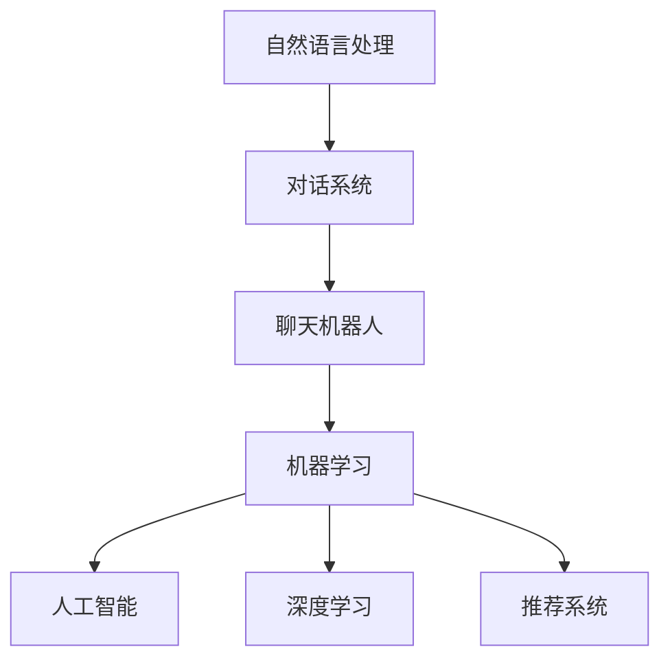

                 

# 聊天机器人科学和探索：数据分析和理论

> 关键词：聊天机器人,数据分析,理论,对话系统,自然语言处理(NLP),机器学习

## 1. 背景介绍

### 1.1 问题由来
随着人工智能技术的不断进步，聊天机器人已逐渐成为企业与用户之间交流的重要工具。从最初的规则式脚本对话系统，到基于规则与人工智能技术结合的混合对话系统，再到当前主流的基于深度学习的大模型驱动的智能对话系统，聊天机器人的发展历程也反映了人工智能技术从弱到强的演变过程。

然而，尽管聊天机器人在技术上取得了显著的进步，但在实际应用中，它们仍然面临诸多挑战，如对话的自然度、多样性、上下文记忆、语义理解等。这些问题需要数据分析和理论指导来进一步提升聊天机器人的性能。

### 1.2 问题核心关键点
聊天机器人的设计涉及到多个学科，包括自然语言处理(NLP)、人工智能(AI)、机器学习、心理学等。核心关键点包括：

1. **语义理解**：如何使聊天机器人理解用户的意图和上下文。
2. **生成响应**：如何使聊天机器人生成自然流畅、上下文相关的回应。
3. **上下文记忆**：如何在对话过程中保持和利用上下文信息。
4. **多模态融合**：如何将不同模态的数据(如文本、语音、图像等)结合，提升系统的智能水平。
5. **模型优化**：如何通过数据分析和理论指导，不断优化聊天机器人的性能。

本文将从数据分析和理论的角度，详细探讨聊天机器人的核心技术和应用。

## 2. 核心概念与联系

### 2.1 核心概念概述

为更好地理解聊天机器人，本节将介绍几个密切相关的核心概念：

- **自然语言处理(NLP)**：使用计算机处理、理解、生成自然语言的技术。聊天机器人是NLP技术的重要应用场景之一。
- **对话系统**：一种人机交互方式，通过自然语言与计算机进行交流。聊天机器人是对话系统的一种重要实现形式。
- **机器学习**：通过数据驱动的方法，使计算机系统能够从数据中学习并自动改进性能的技术。聊天机器人中的核心部分通常采用机器学习算法。
- **人工智能**：使计算机系统能够模拟人类智能的行为和思维过程，包括感知、学习、推理、规划等。聊天机器人是AI技术的重要应用之一。
- **深度学习**：一种特殊的机器学习技术，使用多层神经网络进行数据处理和特征提取。聊天机器人通常使用深度学习模型进行语义理解和生成回应。
- **推荐系统**：通过分析用户行为数据，推荐用户可能感兴趣的内容或服务。聊天机器人可以结合推荐系统为用户推荐信息。

这些核心概念之间的逻辑关系可以通过以下Mermaid流程图来展示：



这个流程图展示了一些核心概念及其之间的关系：

1. 自然语言处理是对话系统的基础。
2. 对话系统是聊天机器人实现的形式。
3. 机器学习和深度学习是聊天机器人核心技术的核心。
4. 人工智能是更高层级的目标，聊天机器人是其中的一部分。
5. 推荐系统可以与聊天机器人结合，提升用户体验。

这些概念共同构成了聊天机器人的基础框架，使其能够在各种场景下发挥作用。

## 3. 核心算法原理 & 具体操作步骤
### 3.1 算法原理概述

聊天机器人的核心算法包括语义理解、上下文记忆、生成响应等。本文将重点探讨这些核心算法的原理和操作步骤。

### 3.2 算法步骤详解

#### 3.2.1 语义理解
语义理解是聊天机器人处理用户输入的核心步骤，其目标是从用户输入的自然语言中提取意图和上下文信息。

1. **文本预处理**：对用户输入进行分词、去停用词、词性标注等预处理操作。
2. **向量化表示**：将处理后的文本转换为计算机可理解的向量形式。
3. **语义表示学习**：使用深度学习模型(如BERT、GPT等)进行语义表示学习，学习出文本中的语义特征。
4. **意图识别**：通过语义表示学习得到的特征，识别出用户的意图。

#### 3.2.2 上下文记忆
上下文记忆是聊天机器人保持对话连续性的关键步骤，其目标是在对话过程中保存和利用上下文信息。

1. **上下文编码**：使用LSTM、GRU等循环神经网络对上下文信息进行编码，得到上下文向量。
2. **向量加权**：根据当前对话的上下文向量，对用户输入的向量进行加权处理。
3. **上下文向量更新**：使用最新的上下文向量更新对话状态。

#### 3.2.3 生成响应
生成响应是聊天机器人最重要的步骤，其目标是根据用户的意图和上下文信息生成自然流畅的回应。

1. **生成序列**：使用语言模型(如GPT、Transformer等)生成一系列可能的回应。
2. **序列筛选**：根据上下文向量，筛选出与上下文最相关的回应。
3. **回应生成**：生成最终回应，返回给用户。

### 3.3 算法优缺点

聊天机器人的核心算法在实际应用中具有以下优点：

1. **自动化处理**：自动处理用户输入，无需人工干预。
2. **自然流畅**：生成的回应自然流畅，用户体验良好。
3. **上下文记忆**：保持对话的连续性，提升用户体验。

同时，这些算法也存在一定的局限性：

1. **语义理解不足**：当前聊天机器人的语义理解能力仍存在不足，难以处理复杂的语义结构。
2. **生成响应不自然**：生成的回应有时显得生硬或不自然。
3. **上下文信息处理难度大**：在多轮对话中，保持上下文信息的准确性和相关性是一个挑战。
4. **可扩展性不足**：现有算法在处理大规模数据和复杂任务时，可扩展性不足。

尽管存在这些局限性，但聊天机器人的核心算法在实际应用中已取得了显著的进展，并在多个场景下得到了广泛应用。

### 3.4 算法应用领域

聊天机器人的核心算法已在多个领域得到了应用，包括但不限于：

1. **客户服务**：如自动客服、在线咨询等。
2. **娱乐互动**：如智能音箱、虚拟助手等。
3. **医疗健康**：如智能医生助理、在线健康咨询等。
4. **教育培训**：如智能家教、在线教育等。
5. **金融服务**：如智能理财顾问、在线客服等。

这些应用场景展示了聊天机器人在提升用户体验和效率方面的巨大潜力。

## 4. 数学模型和公式 & 详细讲解  
### 4.1 数学模型构建

聊天机器人的核心算法涉及多个数学模型，包括文本表示模型、语言模型、上下文记忆模型等。本文将详细介绍这些模型的构建方法。

#### 4.1.1 文本表示模型
文本表示模型用于将文本转换为向量形式，方便计算机处理和理解。常用的模型包括Word2Vec、GloVe、BERT等。

**BERT模型的构建**：

1. **编码层**：BERT模型使用Transformer编码器对输入文本进行编码，得到文本向量表示。
2. **多层次特征**：BERT模型使用多层次特征表示，包括中间层的语义表示和顶部层的表示。
3. **预训练任务**：BERT模型使用掩码语言模型和下一句预测等预训练任务进行训练。

**公式推导**：

$$
\text{Embedding}(x_i) = \mathcal{L}(x_i; \theta)
$$

其中，$x_i$表示输入文本，$\theta$表示模型参数。

#### 4.1.2 语言模型
语言模型用于预测文本序列中下一个词的概率分布，常用的模型包括RNN、LSTM、Transformer等。

**Transformer语言模型的构建**：

1. **编码器**：Transformer使用多层自注意力机制对输入文本进行编码，得到文本向量表示。
2. **解码器**：使用多层自注意力机制和全连接层进行生成，得到下一个词的概率分布。
3. **softmax层**：对解码器输出进行softmax处理，得到下一个词的概率分布。

**公式推导**：

$$
\text{Prob}(y_{i+1} | y_i, \cdots, y_{i-1}) = \text{softmax}(\text{Decoder}(\text{Encoder}(x_i); \theta))
$$

其中，$y_i$表示文本序列中的第$i$个词，$\theta$表示模型参数。

#### 4.1.3 上下文记忆模型
上下文记忆模型用于保存和利用上下文信息，常用的模型包括LSTM、GRU等。

**LSTM模型的构建**：

1. **记忆单元**：LSTM使用记忆单元保存上下文信息。
2. **门控机制**：LSTM使用门控机制控制信息的流动。
3. **上下文向量**：根据上下文向量更新对话状态。

**公式推导**：

$$
\text{C_t} = \text{LSTM}(\text{Embedding}(x_i); \theta)
$$

其中，$C_t$表示第$t$轮对话的上下文向量，$\theta$表示模型参数。

## 5. 项目实践：代码实例和详细解释说明
### 5.1 开发环境搭建

在进行聊天机器人开发前，我们需要准备好开发环境。以下是使用Python进行PyTorch开发的环境配置流程：

1. 安装Anaconda：从官网下载并安装Anaconda，用于创建独立的Python环境。

2. 创建并激活虚拟环境：
```bash
conda create -n chatbot-env python=3.8 
conda activate chatbot-env
```

3. 安装PyTorch：根据CUDA版本，从官网获取对应的安装命令。例如：
```bash
conda install pytorch torchvision torchaudio cudatoolkit=11.1 -c pytorch -c conda-forge
```

4. 安装Transformers库：
```bash
pip install transformers
```

5. 安装各类工具包：
```bash
pip install numpy pandas scikit-learn matplotlib tqdm jupyter notebook ipython
```

完成上述步骤后，即可在`chatbot-env`环境中开始聊天机器人开发。

### 5.2 源代码详细实现

下面我们以基于BERT的聊天机器人为例，给出使用Transformers库进行开发的PyTorch代码实现。

```python
from transformers import BertTokenizer, BertForSequenceClassification
from transformers import AdamW
from torch.utils.data import DataLoader, Dataset
from tqdm import tqdm
import torch

# 加载BERT模型和tokenizer
tokenizer = BertTokenizer.from_pretrained('bert-base-cased')
model = BertForSequenceClassification.from_pretrained('bert-base-cased', num_labels=2)

# 定义数据集
class ChatBotDataset(Dataset):
    def __init__(self, texts, labels):
        self.texts = texts
        self.labels = labels
        self.tokenizer = tokenizer

    def __len__(self):
        return len(self.texts)

    def __getitem__(self, item):
        text = self.texts[item]
        label = self.labels[item]

        encoding = self.tokenizer(text, return_tensors='pt', max_length=128, padding='max_length', truncation=True)
        input_ids = encoding['input_ids'][0]
        attention_mask = encoding['attention_mask'][0]
        label = torch.tensor(label, dtype=torch.long)

        return {'input_ids': input_ids, 
                'attention_mask': attention_mask,
                'labels': label}

# 加载数据集
train_dataset = ChatBotDataset(train_texts, train_labels)
dev_dataset = ChatBotDataset(dev_texts, dev_labels)
test_dataset = ChatBotDataset(test_texts, test_labels)

# 定义模型和优化器
optimizer = AdamW(model.parameters(), lr=2e-5)

# 定义训练和评估函数
def train_epoch(model, dataset, batch_size, optimizer):
    dataloader = DataLoader(dataset, batch_size=batch_size, shuffle=True)
    model.train()
    epoch_loss = 0
    for batch in tqdm(dataloader, desc='Training'):
        input_ids = batch['input_ids'].to(device)
        attention_mask = batch['attention_mask'].to(device)
        labels = batch['labels'].to(device)
        model.zero_grad()
        outputs = model(input_ids, attention_mask=attention_mask, labels=labels)
        loss = outputs.loss
        epoch_loss += loss.item()
        loss.backward()
        optimizer.step()
    return epoch_loss / len(dataloader)

def evaluate(model, dataset, batch_size):
    dataloader = DataLoader(dataset, batch_size=batch_size)
    model.eval()
    preds, labels = [], []
    with torch.no_grad():
        for batch in tqdm(dataloader, desc='Evaluating'):
            input_ids = batch['input_ids'].to(device)
            attention_mask = batch['attention_mask'].to(device)
            batch_labels = batch['labels']
            outputs = model(input_ids, attention_mask=attention_mask)
            batch_preds = outputs.logits.argmax(dim=1).to('cpu').tolist()
            batch_labels = batch_labels.to('cpu').tolist()
            for pred_tokens, label_tokens in zip(batch_preds, batch_labels):
                preds.append(pred_tokens)
                labels.append(label_tokens)

    return preds, labels

# 训练模型
epochs = 5
batch_size = 16

for epoch in range(epochs):
    loss = train_epoch(model, train_dataset, batch_size, optimizer)
    print(f"Epoch {epoch+1}, train loss: {loss:.3f}")
    
    print(f"Epoch {epoch+1}, dev results:")
    preds, labels = evaluate(model, dev_dataset, batch_size)
    print(classification_report(labels, preds))

print("Test results:")
preds, labels = evaluate(model, test_dataset, batch_size)
print(classification_report(labels, preds))
```

以上就是使用PyTorch和Transformers库进行聊天机器人开发的完整代码实现。可以看到，利用Transformers库，开发聊天机器人变得相对简洁高效。

### 5.3 代码解读与分析

让我们再详细解读一下关键代码的实现细节：

**ChatBotDataset类**：
- `__init__`方法：初始化文本和标签数据，并加载tokenizer。
- `__len__`方法：返回数据集的样本数量。
- `__getitem__`方法：对单个样本进行处理，将文本输入编码为token ids，并将标签转换为数字，进行定长padding，最终返回模型所需的输入。

**训练和评估函数**：
- 使用PyTorch的DataLoader对数据集进行批次化加载，供模型训练和推理使用。
- 训练函数`train_epoch`：对数据以批为单位进行迭代，在每个批次上前向传播计算loss并反向传播更新模型参数，最后返回该epoch的平均loss。
- 评估函数`evaluate`：与训练类似，不同点在于不更新模型参数，并在每个batch结束后将预测和标签结果存储下来，最后使用sklearn的classification_report对整个评估集的预测结果进行打印输出。

**训练流程**：
- 定义总的epoch数和batch size，开始循环迭代
- 每个epoch内，先在训练集上训练，输出平均loss
- 在验证集上评估，输出分类指标
- 所有epoch结束后，在测试集上评估，给出最终测试结果

可以看到，PyTorch配合Transformers库使得聊天机器人的开发变得简洁高效。开发者可以将更多精力放在数据处理、模型改进等高层逻辑上，而不必过多关注底层的实现细节。

## 6. 实际应用场景

### 6.1 智能客服系统

聊天机器人已被广泛应用于智能客服系统，能够7x24小时不间断服务，快速响应客户咨询，用自然流畅的语言解答各类常见问题。

在技术实现上，可以收集企业内部的历史客服对话记录，将问题和最佳答复构建成监督数据，在此基础上对预训练语言模型进行微调。微调后的对话模型能够自动理解用户意图，匹配最合适的答案模板进行回复。对于客户提出的新问题，还可以接入检索系统实时搜索相关内容，动态组织生成回答。如此构建的智能客服系统，能大幅提升客户咨询体验和问题解决效率。

### 6.2 金融舆情监测

金融机构需要实时监测市场舆论动向，以便及时应对负面信息传播，规避金融风险。传统的人工监测方式成本高、效率低，难以应对网络时代海量信息爆发的挑战。基于聊天机器人的文本分类和情感分析技术，为金融舆情监测提供了新的解决方案。

具体而言，可以收集金融领域相关的新闻、报道、评论等文本数据，并对其进行主题标注和情感标注。在此基础上对预训练语言模型进行微调，使其能够自动判断文本属于何种主题，情感倾向是正面、中性还是负面。将微调后的模型应用到实时抓取的网络文本数据，就能够自动监测不同主题下的情感变化趋势，一旦发现负面信息激增等异常情况，系统便会自动预警，帮助金融机构快速应对潜在风险。

### 6.3 个性化推荐系统

当前的推荐系统往往只依赖用户的历史行为数据进行物品推荐，无法深入理解用户的真实兴趣偏好。基于聊天机器人的个性化推荐系统可以更好地挖掘用户行为背后的语义信息，从而提供更精准、多样的推荐内容。

在实践中，可以收集用户浏览、点击、评论、分享等行为数据，提取和用户交互的物品标题、描述、标签等文本内容。将文本内容作为模型输入，用户的后续行为（如是否点击、购买等）作为监督信号，在此基础上微调预训练语言模型。微调后的模型能够从文本内容中准确把握用户的兴趣点。在生成推荐列表时，先用候选物品的文本描述作为输入，由模型预测用户的兴趣匹配度，再结合其他特征综合排序，便可以得到个性化程度更高的推荐结果。

### 6.4 未来应用展望

随着聊天机器人的不断发展，其在更多领域的应用前景将更加广阔。

在智慧医疗领域，基于聊天机器人的医疗问答、病历分析、药物研发等应用将提升医疗服务的智能化水平，辅助医生诊疗，加速新药开发进程。

在智能教育领域，聊天机器人可应用于作业批改、学情分析、知识推荐等方面，因材施教，促进教育公平，提高教学质量。

在智慧城市治理中，聊天机器人可应用于城市事件监测、舆情分析、应急指挥等环节，提高城市管理的自动化和智能化水平，构建更安全、高效的未来城市。

此外，在企业生产、社会治理、文娱传媒等众多领域，聊天机器人将不断涌现，为NLP技术带来新的应用方向。

## 7. 工具和资源推荐

### 7.1 学习资源推荐

为了帮助开发者系统掌握聊天机器人的理论基础和实践技巧，这里推荐一些优质的学习资源：

1. 《Deep Learning for Natural Language Processing》（斯坦福大学）：涵盖NLP和深度学习的基础知识，并讲解了聊天机器人等NLP应用。
2. 《Sequence to Sequence Learning with Neural Networks》（CS231n）：讲解了序列到序列学习的原理和应用，包括聊天机器人在内。
3. 《Attention is All You Need》（谷歌）：介绍Transformer架构，为聊天机器人的语义理解和生成提供了基础。
4. 《Language Modeling with Transformers》（Hugging Face）：介绍了BERT等Transformer模型的应用，并讲解了语言模型的基本原理。
5. 《Practical Natural Language Processing》（Practical NLP）：讲解了NLP技术的实际应用，包括聊天机器人等。

通过对这些资源的学习实践，相信你一定能够快速掌握聊天机器人的精髓，并用于解决实际的NLP问题。

### 7.2 开发工具推荐

高效的开发离不开优秀的工具支持。以下是几款用于聊天机器人开发的常用工具：

1. PyTorch：基于Python的开源深度学习框架，灵活动态的计算图，适合快速迭代研究。
2. TensorFlow：由Google主导开发的开源深度学习框架，生产部署方便，适合大规模工程应用。
3. Transformers库：Hugging Face开发的NLP工具库，集成了众多SOTA语言模型，支持PyTorch和TensorFlow，是进行聊天机器人开发的利器。
4. Weights & Biases：模型训练的实验跟踪工具，可以记录和可视化模型训练过程中的各项指标，方便对比和调优。
5. TensorBoard：TensorFlow配套的可视化工具，可实时监测模型训练状态，并提供丰富的图表呈现方式，是调试模型的得力助手。
6. Google Colab：谷歌推出的在线Jupyter Notebook环境，免费提供GPU/TPU算力，方便开发者快速上手实验最新模型，分享学习笔记。

合理利用这些工具，可以显著提升聊天机器人的开发效率，加快创新迭代的步伐。

### 7.3 相关论文推荐

聊天机器人相关的发展源于学界的持续研究。以下是几篇奠基性的相关论文，推荐阅读：

1. Attention is All You Need：谷歌提出的Transformer架构，为聊天机器人的语义理解和生成提供了基础。
2. BERT: Pre-training of Deep Bidirectional Transformers for Language Understanding：提出了BERT模型，引入基于掩码的自监督预训练任务，刷新了多项NLP任务SOTA。
3. Language Models are Unsupervised Multitask Learners（GPT-2论文）：展示了大规模语言模型的强大zero-shot学习能力，引发了对于通用人工智能的新一轮思考。
4. Prompt Engineering for Conversational Agents：探讨了如何通过设计提示模板，引导聊天机器人生成自然流畅的回应。
5. Parameter-Efficient Sequence to Sequence Models：提出了 Adapter等参数高效微调方法，在固定大部分预训练参数的情况下，只更新极少量的任务相关参数。

这些论文代表了大语言模型微调技术的发展脉络。通过学习这些前沿成果，可以帮助研究者把握学科前进方向，激发更多的创新灵感。

## 8. 总结：未来发展趋势与挑战

### 8.1 总结

本文对聊天机器人技术进行了全面系统的介绍。首先阐述了聊天机器人的背景和核心技术，明确了语义理解、上下文记忆、生成回应等核心技术在聊天机器人中的重要作用。其次，从数据分析和理论的角度，详细讲解了这些核心算法的原理和操作步骤，给出了聊天机器人开发的完整代码实例。最后，探讨了聊天机器人在智能客服、金融舆情监测、个性化推荐等实际应用场景中的广泛应用前景，展示了聊天机器人技术的巨大潜力。

通过本文的系统梳理，可以看到，聊天机器人技术已经在多个领域取得了显著的进展，未来将在更多行业得到应用。随着技术的不断进步，聊天机器人必将在提升用户体验和效率方面发挥更大的作用。

### 8.2 未来发展趋势

展望未来，聊天机器人技术将呈现以下几个发展趋势：

1. **多模态融合**：结合文本、语音、图像等多种模态数据，提升聊天机器人的智能水平。
2. **知识图谱与自然语言结合**：将知识图谱、逻辑规则等专家知识与自然语言处理技术结合，提升聊天机器人的语义理解和推理能力。
3. **个性化推荐**：通过分析用户行为数据，为聊天机器人提供个性化的推荐服务。
4. **持续学习**：通过不断学习新数据，聊天机器人能够不断提升自身的语义理解和生成能力。
5. **跨领域应用**：聊天机器人在金融、医疗、教育等多个领域的应用将不断扩展，带来新的应用场景。
6. **用户界面优化**：通过更自然、更智能的用户界面设计，提升用户体验。

以上趋势凸显了聊天机器人技术的广阔前景，这些方向的探索发展，必将进一步提升聊天机器人的性能和应用范围，为构建人机协同的智能时代中扮演越来越重要的角色。

### 8.3 面临的挑战

尽管聊天机器人技术已经取得了显著的进展，但在迈向更加智能化、普适化应用的过程中，它仍面临诸多挑战：

1. **语义理解不足**：当前的聊天机器人仍难以处理复杂的语义结构，有时无法准确理解用户意图。
2. **生成回应不自然**：生成的回应有时显得生硬或不自然，用户体验不佳。
3. **上下文信息处理难度大**：在多轮对话中，保持上下文信息的准确性和相关性是一个挑战。
4. **可扩展性不足**：现有算法在处理大规模数据和复杂任务时，可扩展性不足。
5. **知识图谱整合难度大**：知识图谱与自然语言处理技术的结合仍存在技术挑战。
6. **持续学习效果差**：聊天机器人难以高效地持续学习新数据，模型性能提升缓慢。

尽管存在这些挑战，但通过不断的技术创新和实践积累，聊天机器人技术将在未来不断突破，实现更加智能和普适的应用。

### 8.4 研究展望

面向未来，聊天机器人技术需要在以下几个方面进行深入研究：

1. **多模态融合**：结合文本、语音、图像等多种模态数据，提升聊天机器人的智能水平。
2. **知识图谱与自然语言结合**：将知识图谱、逻辑规则等专家知识与自然语言处理技术结合，提升聊天机器人的语义理解和推理能力。
3. **个性化推荐**：通过分析用户行为数据，为聊天机器人提供个性化的推荐服务。
4. **持续学习**：通过不断学习新数据，聊天机器人能够不断提升自身的语义理解和生成能力。
5. **跨领域应用**：聊天机器人在金融、医疗、教育等多个领域的应用将不断扩展，带来新的应用场景。
6. **用户界面优化**：通过更自然、更智能的用户界面设计，提升用户体验。

这些研究方向的研究进展，将为聊天机器人的未来发展提供重要的技术支撑，推动聊天机器人技术的不断进步。

## 9. 附录：常见问题与解答

**Q1：聊天机器人如何理解用户输入的自然语言？**

A: 聊天机器人通常采用自然语言处理(NLP)技术来理解用户输入的自然语言。其核心步骤包括文本预处理、向量化表示、语义表示学习和意图识别等。在实际应用中，通常使用BERT、GPT等预训练模型进行语义表示学习，再结合自定义的意图识别模型，完成语义理解和意图识别。

**Q2：聊天机器人如何生成自然流畅的回应？**

A: 聊天机器人通常使用语言模型(如GPT、Transformer等)进行回应生成。在生成回应时，首先通过上下文向量对用户输入进行加权处理，然后通过语言模型生成一系列可能的回应。最终，根据上下文向量筛选出与上下文最相关的回应，作为最终的回应。

**Q3：聊天机器人如何处理上下文信息？**

A: 聊天机器人通常使用循环神经网络(LSTM、GRU等)进行上下文记忆。在对话过程中，每次生成回应时，将上下文向量与当前输入的向量进行加权处理，更新上下文向量。这样，聊天机器人能够在对话中保持对上下文信息的记忆和利用，提升对话的连续性和相关性。

**Q4：聊天机器人如何避免灾难性遗忘？**

A: 聊天机器人可以通过持续学习来避免灾难性遗忘。在训练过程中，通过不断学习新数据，更新模型的权重参数，使其能够持续提升自身的语义理解和生成能力。同时，结合知识图谱等外部知识源，使聊天机器人能够更好地应对新问题和任务。

**Q5：聊天机器人如何处理多样性问题？**

A: 聊天机器人可以通过多模态融合和知识图谱结合等方式来处理多样性问题。在多轮对话中，结合文本、语音、图像等多种模态数据，提升聊天机器人的智能水平。同时，通过将知识图谱、逻辑规则等专家知识与自然语言处理技术结合，使聊天机器人能够更好地理解和生成多样化的回应。

这些问题的解答，展示了聊天机器人技术在实际应用中面临的挑战和解决方法，为开发者提供有益的参考和指导。

