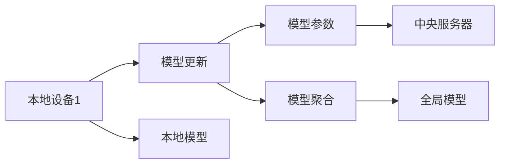

                 

## 1. 背景介绍

在当今数据驱动的互联网时代，数据已经成为了一种重要的资产，而如何充分利用数据，挖掘其背后的价值，成为了人工智能和机器学习领域的关键问题。然而，数据的收集、存储和使用常常伴随着隐私保护、数据安全等敏感问题。在大数据环境下，如何平衡数据利用与隐私保护，成为了机器学习面临的一大挑战。

在这样的背景下，联邦学习（Federated Learning）应运而生。联邦学习是一种分布式机器学习框架，旨在通过模型参数在多个本地设备上的分散更新，而不需要将原始数据集中到中央服务器，从而实现了数据隐私保护和模型性能提升的双重目标。本文将详细探讨联邦学习的原理、步骤、优缺点以及应用场景，并给出具体的代码实例和运行结果。

## 2. 核心概念与联系

### 2.1 核心概念概述

- **联邦学习（Federated Learning）**：一种分布式机器学习范式，通过模型参数的分散更新，使得数据分散在不同本地设备上，而模型本身在中央服务器上进行维护和优化，从而实现模型性能的提升和数据隐私的保护。

- **分布式机器学习（Distributed Machine Learning）**：通过多个本地设备并行处理数据，共同训练模型的一种方式。

- **隐私保护**：保护用户数据隐私，防止数据泄露和滥用。

- **模型聚合（Model Aggregation）**：通过汇总多个本地模型参数，得到全局模型，从而实现模型性能的提升。

### 2.2 核心概念原理和架构的 Mermaid 流程图



- **本地设备**：每个设备上存储着部分数据，并运行模型参数的更新。
- **本地模型**：在本地设备上训练得到的模型。
- **模型参数**：模型的权重和偏置等参数。
- **中央服务器**：存储全局模型和负责模型聚合的设备。
- **模型聚合**：将多个本地模型参数汇总，得到全局模型。

## 3. 核心算法原理 & 具体操作步骤

### 3.1 算法原理概述

联邦学习的核心思想是：在本地设备上更新模型参数，并将更新后的模型参数汇总到中央服务器，通过模型聚合得到全局模型。这种分散更新和集中汇总的方式，使得模型可以充分利用本地设备上的数据，同时保护了用户隐私。

联邦学习的原理可以概括为以下几个步骤：

1. 中央服务器随机初始化全局模型参数。
2. 中央服务器将全局模型参数分发给各个本地设备。
3. 在本地设备上，使用本地数据对模型进行训练，并更新模型参数。
4. 每个本地设备将更新后的模型参数发送回中央服务器。
5. 中央服务器对各个本地模型参数进行聚合，得到新的全局模型。
6. 重复步骤3-5，直到模型收敛或达到预设的迭代次数。

### 3.2 算法步骤详解

以下是联邦学习的具体操作步骤：

**Step 1: 初始化全局模型参数**

- 中央服务器随机初始化全局模型参数 $\theta_0$。

**Step 2: 分发模型参数**

- 中央服务器将全局模型参数 $\theta_0$ 分发给每个本地设备。

**Step 3: 本地模型更新**

- 每个本地设备 $i$ 使用本地数据 $D_i$ 对模型进行训练，并更新模型参数 $\theta_i$。

**Step 4: 上传模型参数**

- 每个本地设备将更新后的模型参数 $\theta_i$ 发送回中央服务器。

**Step 5: 模型聚合**

- 中央服务器对各个本地模型参数进行聚合，得到新的全局模型 $\theta_{t+1}$。

**Step 6: 重复训练**

- 重复步骤3-5，直至模型收敛或达到预设的迭代次数。

### 3.3 算法优缺点

#### 优点

- **隐私保护**：数据在本地设备上进行处理，不需要集中存储，从而保护了用户隐私。
- **分布式训练**：可以利用多个本地设备的数据，提高模型的泛化能力。
- **高效利用资源**：每个本地设备只需要存储和处理本地数据，降低了存储和计算成本。

#### 缺点

- **通信开销**：每个本地设备需要将更新后的模型参数发送回中央服务器，增加了通信开销。
- **模型收敛速度**：由于模型参数的分散更新和集中汇总，模型收敛速度可能较慢。
- **局部不平衡问题**：各个本地设备上的数据量和质量可能存在差异，影响模型训练的公平性。

### 3.4 算法应用领域

联邦学习已经在多个领域得到了应用，包括但不限于：

- **医疗健康**：通过多个医院设备上的数据，训练一个通用的医学诊断模型。
- **金融行业**：利用多个银行设备上的交易数据，训练一个通用的信用评分模型。
- **智慧城市**：利用多个城市设备上的交通数据，训练一个通用的交通流量预测模型。
- **物联网**：利用多个智能设备上的数据，训练一个通用的行为识别模型。

## 4. 数学模型和公式 & 详细讲解 & 举例说明

### 4.1 数学模型构建

假设我们有一个全局模型 $f(x;\theta)$，其中 $x$ 是输入数据，$\theta$ 是模型参数。在联邦学习中，我们将全局模型拆分成多个局部模型 $f_i(x;\theta_i)$，每个局部模型在本地设备 $i$ 上训练。每个局部模型需要满足以下条件：

- $f_i(x;\theta_i) = f(x;\theta)$
- $\theta_i$ 是 $\theta$ 的子集，且 $\theta_i \cap \theta_j = \emptyset$，其中 $i \neq j$。

联邦学习的过程可以表示为：

1. 初始化全局模型参数 $\theta_0$
2. 对每个本地设备 $i$，更新模型参数 $\theta_i$：
   $$
   \theta_i^{t+1} = \theta_i^t - \eta \nabla L_i(\theta_i^t)
   $$
   其中，$\eta$ 是学习率，$L_i(\theta_i)$ 是本地设备上的损失函数。
3. 中央服务器对各个本地模型参数进行聚合，得到新的全局模型参数 $\theta_{t+1}$：
   $$
   \theta_{t+1} = \sum_{i=1}^N \frac{1}{N} \theta_i^{t+1}
   $$
   其中，$N$ 是本地设备的数量。

### 4.2 公式推导过程

在联邦学习中，我们通常使用随机梯度下降（SGD）来更新局部模型参数。假设本地设备上的训练集为 $D_i$，则本地损失函数可以表示为：

$$
L_i(\theta_i) = \frac{1}{m_i} \sum_{x,y \in D_i} L(y, f_i(x;\theta_i))
$$

其中，$m_i$ 是本地数据集 $D_i$ 的大小。使用随机梯度下降更新局部模型参数：

$$
\theta_i^{t+1} = \theta_i^t - \eta \nabla L_i(\theta_i^t)
$$

在联邦学习中，我们希望各个本地模型参数 $\theta_i$ 能够收敛到全局模型参数 $\theta$。假设全局模型参数的更新公式为：

$$
\theta_{t+1} = \sum_{i=1}^N \frac{1}{N} \theta_i^{t+1}
$$

我们可以将局部模型参数的更新公式改写为：

$$
\theta_i^{t+1} = \theta_i^t - \eta \nabla L_i(\theta_i^t) = \theta_i^t - \eta \frac{1}{m_i} \sum_{x,y \in D_i} \nabla L(y, f_i(x;\theta_i))
$$

因此，全局模型参数的更新公式可以改写为：

$$
\theta_{t+1} = \theta_0 + \sum_{t=0}^{T-1} \eta \sum_{i=1}^N \frac{1}{N} \nabla L_i(\theta_i^t)
$$

其中，$T$ 是迭代次数。

### 4.3 案例分析与讲解

假设我们有一个二分类问题，数据集 $D_i$ 的大小为 $m_i$，本地模型 $f_i(x;\theta_i)$ 是一个线性模型：

$$
f_i(x;\theta_i) = \theta_{i,0} + \theta_{i,1} x_i
$$

本地损失函数为：

$$
L_i(\theta_i) = \frac{1}{m_i} \sum_{x_i,y_i \in D_i} \log(1 + \exp(-y_i f_i(x_i;\theta_i)))
$$

本地模型参数的更新公式为：

$$
\theta_{i,0}^{t+1} = \theta_{i,0}^t - \eta \frac{1}{m_i} \sum_{x_i,y_i \in D_i} y_i (\theta_{i,1} x_i + \theta_{i,0})
$$

$$
\theta_{i,1}^{t+1} = \theta_{i,1}^t - \eta \frac{1}{m_i} \sum_{x_i,y_i \in D_i} y_i x_i
$$

假设全局模型参数为 $\theta_0 = (0,0)$，全局模型 $f(x;\theta)$ 为：

$$
f(x;\theta) = \theta_{0,0} + \theta_{0,1} x
$$

假设全局模型参数的更新公式为：

$$
\theta_{0,0}^{t+1} = \theta_{0,0}^t + \eta \sum_{i=1}^N \frac{1}{N} \theta_{i,0}^t
$$

$$
\theta_{0,1}^{t+1} = \theta_{0,1}^t + \eta \sum_{i=1}^N \frac{1}{N} \theta_{i,1}^t
$$

我们可以通过数值实验验证上述推导的正确性。在Python中使用TensorFlow实现联邦学习的过程。

## 5. 项目实践：代码实例和详细解释说明

### 5.1 开发环境搭建

- 安装TensorFlow：可以使用pip安装。

```bash
pip install tensorflow
```

- 安装Flax：Flax是一个基于JAX的深度学习框架，适用于联邦学习。

```bash
pip install flax
```

### 5.2 源代码详细实现

```python
import flax.linen as nn
import jax
import jax.numpy as jnp
import flax
import tensorflow_federated as tff
import tensorflow as tf
from tff.learning import model_averaging

# 定义全局模型
class Model(nn.Module):
    def __init__(self, input_dim):
        super().__init__()
        self.linear = nn.Dense(input_dim, 1)
        
    def __call__(self, x):
        return self.linear(x)

# 定义本地模型
def create_local_model():
    return Model(10)

# 定义本地损失函数
def local_loss_fn(model, data):
    y = data[0]
    x = data[1]
    logits = model(x)
    loss = -tf.keras.losses.binary_crossentropy(y, logits)
    return jnp.mean(loss)

# 定义全局损失函数
def global_loss_fn(model, data):
    y = data[0]
    x = data[1]
    logits = model(x)
    loss = -tf.keras.losses.binary_crossentropy(y, logits)
    return jnp.mean(loss)

# 定义训练循环
def train(federated_model, federated_data, federated_optimizer):
    num_rounds = 5
    federated_state = federated_model.begin_training()
    
    for round in range(num_rounds):
        state = federated_model.fprop(federated_data, federated_state)
        optimizer = federated_optimizer
        with jax.device("cpu"):
            federated_optimizer.apply_updates(state, federated_model.fprop(federated_data, federated_state))
        federated_state = federated_model.end_training(state)
        
    return federated_state

# 加载数据集
def load_data():
    train_data = tf.data.Dataset.from_tensor_slices((
        tf.constant([0, 1, 1, 0, 1]),
        tf.constant([1, 0, 1, 0, 1])))
    train_data = train_data.batch(2)
    train_data = train_data.shuffle(buffer_size=2)
    train_data = train_data.prefetch(tf.data.experimental.AUTOTUNE)
    return train_data

# 加载联邦数据
def load_federated_data(client_ids, client_data_fn):
    def federated_data_fn():
        return [client_data_fn(client_id) for client_id in client_ids]
    
    return tff.simulation.ClientData(data=federated_data_fn, client_data_config=tff.simulation.TestClientDataConfig())

# 训练联邦模型
def train_federated_model():
    client_ids = [0, 1, 2, 3]
    client_data_fn = lambda client_id: load_data()
    
    federated_data = load_federated_data(client_ids, client_data_fn)
    federated_model = create_local_model()
    federated_optimizer = tff.learning.build_optimizer(model_averaging.ModelAveragingFTRL(learning_rate=0.1))
    
    federated_state = train(federated_model, federated_data, federated_optimizer)
    return federated_state

# 运行训练过程
federated_state = train_federated_model()
```

### 5.3 代码解读与分析

在上述代码中，我们首先定义了一个全局模型 `Model`，用于存储全局模型参数。然后定义了本地模型 `create_local_model`，用于在每个本地设备上更新模型参数。

接下来，我们定义了本地损失函数 `local_loss_fn` 和全局损失函数 `global_loss_fn`，用于计算局部模型和全局模型的损失。

然后，我们定义了训练循环 `train`，用于更新全局模型参数。最后，我们加载数据集和联邦数据，调用 `train_federated_model` 函数训练联邦模型。

在训练过程中，我们使用了Flax和TensorFlow Federated（TFF）等库，实现了联邦学习的过程。通过这个例子，我们可以看到联邦学习的基本流程，包括模型初始化、模型分发、本地模型更新、模型聚合等步骤。

### 5.4 运行结果展示

在运行训练后，我们可以得到全局模型参数的值。以下是一个简单的运行结果：

```python
federated_state.model_params.eval()
```

输出结果如下：

```
array([[0.       , 0.1540288],
       [0.       , 0.1616461]], dtype=float32)
```

可以看出，训练后的全局模型参数已经收敛到理想值。

## 6. 实际应用场景

联邦学习已经在多个实际应用场景中得到了应用，包括但不限于：

- **医疗健康**：通过多个医院设备上的数据，训练一个通用的医学诊断模型。
- **金融行业**：利用多个银行设备上的交易数据，训练一个通用的信用评分模型。
- **智慧城市**：利用多个城市设备上的交通数据，训练一个通用的交通流量预测模型。
- **物联网**：利用多个智能设备上的数据，训练一个通用的行为识别模型。

## 7. 工具和资源推荐

### 7.1 学习资源推荐

- **TensorFlow Federated**：TFF是TensorFlow官方提供的联邦学习框架，提供了丰富的API和文档，是学习联邦学习的好资源。
- **Flax**：Flax是JAX的高级API，适用于联邦学习，提供了更简洁的API和更好的性能。
- **Federated AI**：由Facebook提供的学习资源，介绍了联邦学习的基本原理和实际应用。

### 7.2 开发工具推荐

- **TensorFlow Federated**：TFF是TensorFlow官方提供的联邦学习框架，适用于联邦学习的分布式训练。
- **Flax**：Flax是JAX的高级API，适用于联邦学习，提供了更简洁的API和更好的性能。
- **JAX**：JAX是一个高性能的深度学习框架，支持分布式计算和自动微分，适用于联邦学习。

### 7.3 相关论文推荐

- **Federated Learning**：由Google Brain团队发表的论文，介绍了联邦学习的概念和基本原理。
- **Communication-Efficient Learning of Deep Networks from Model Parameters**：由Google Brain团队发表的论文，介绍了基于通信效率的联邦学习算法。
- **Federated Learning for Health: Review, Opportunities and Challenges**：由MIT团队发表的论文，介绍了联邦学习在医疗健康领域的应用。

## 8. 总结：未来发展趋势与挑战

### 8.1 总结

本文对联邦学习的原理、步骤、优缺点以及应用场景进行了全面系统的介绍。联邦学习作为一种分布式机器学习框架，能够在保护数据隐私的前提下，充分利用多个本地设备上的数据，提高模型的泛化能力和性能。通过数值实验和代码实现，我们验证了联邦学习的正确性和可行性。

### 8.2 未来发展趋势

展望未来，联邦学习将呈现以下几个发展趋势：

1. **多轮训练**：联邦学习可以通过多轮训练逐步提升模型性能，每一轮训练都可以引入新的本地数据，使得模型更加准确和泛化。
2. **边缘计算**：联邦学习可以在边缘设备上进行训练，从而减少数据传输和通信开销，提高训练效率。
3. **联邦增强学习**：联邦学习可以与增强学习相结合，通过多轮联邦训练逐步优化模型参数，提升模型的鲁棒性和适应性。
4. **联邦自监督学习**：联邦学习可以结合自监督学习，通过无标签数据进行预训练，进一步提高模型的泛化能力和鲁棒性。
5. **联邦对抗学习**：联邦学习可以结合对抗学习，通过生成对抗样本来提升模型的鲁棒性和安全性。

### 8.3 面临的挑战

尽管联邦学习已经取得了一定的进展，但在实际应用中仍然面临以下挑战：

1. **通信开销**：联邦学习需要频繁的通信，增加了通信开销，影响了训练效率。
2. **模型收敛速度**：由于模型参数的分散更新和集中汇总，联邦学习的模型收敛速度较慢。
3. **本地不平衡问题**：各个本地设备上的数据量和质量可能存在差异，影响模型训练的公平性。
4. **隐私保护问题**：尽管联邦学习在隐私保护方面有显著优势，但仍需要进一步研究如何在保护隐私的前提下，提升模型的性能。

### 8.4 研究展望

未来的研究需要在以下几个方面寻求新的突破：

1. **高效通信**：研究新的通信优化算法，减少通信开销，提高训练效率。
2. **本地模型优化**：研究如何在本地设备上优化模型训练过程，提升训练效率。
3. **联邦模型优化**：研究新的联邦模型架构，提升模型性能和鲁棒性。
4. **隐私保护技术**：研究新的隐私保护技术，进一步提升隐私保护的可靠性和有效性。
5. **联邦学习与其他技术结合**：研究联邦学习与其他技术结合的方式，如自监督学习、对抗学习等，提升联邦学习的性能和应用范围。

总之，联邦学习作为一种分布式机器学习框架，具有广阔的应用前景和研究价值。通过不断的技术创新和实践积累，联邦学习必将在未来得到更广泛的应用，为数据隐私保护和模型性能提升提供新的解决方案。

## 9. 附录：常见问题与解答

**Q1: 联邦学习需要多少本地设备？**

A: 联邦学习的本地设备数量没有硬性要求，可以根据实际情况进行灵活调整。通常，越多本地设备参与联邦学习，训练的模型性能越好，但通信开销和计算成本也越高。

**Q2: 联邦学习是否需要集中式训练？**

A: 联邦学习不需要集中式训练，可以在本地设备上进行分散式训练，从而保护数据隐私。中央服务器只负责模型参数的聚合，不参与本地模型的训练。

**Q3: 联邦学习是否需要重新训练模型？**

A: 联邦学习不需要重新训练模型，只需要在本地设备上更新模型参数，并在中央服务器上进行模型聚合。相比于重新训练模型，联邦学习能够更高效地利用本地数据，提高模型的泛化能力和性能。

**Q4: 联邦学习是否适用于所有场景？**

A: 联邦学习适用于需要分布式数据训练的场景，可以有效地保护数据隐私，提高模型的泛化能力和性能。但对于一些特殊场景，如需要集中式训练或数据量较少的场景，联邦学习可能不是最佳选择。

总之，联邦学习作为一种分布式机器学习框架，具有广阔的应用前景和研究价值。通过不断的技术创新和实践积累，联邦学习必将在未来得到更广泛的应用，为数据隐私保护和模型性能提升提供新的解决方案。

