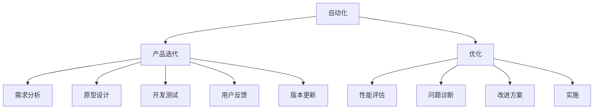

                 

# 自动化创业中的产品迭代与优化

在自动化（Automation）创业的征程中，产品迭代（Product Iteration）与优化（Optimization）是贯穿始终的核心。成功的自动化创业不仅需要构建可行的产品原型，更需要不断进行产品迭代与优化，以适应市场变化、用户需求和技术演进。本文将从背景介绍、核心概念与联系、核心算法原理与具体操作步骤、数学模型与公式、项目实践、实际应用场景、工具和资源推荐、总结与未来发展趋势等方面，系统阐述自动化创业中产品迭代与优化的全面策略。

## 1. 背景介绍

### 1.1 问题由来

自动化创业是指利用自动化技术创新商业模式，通过自动化工具、软件或平台，实现业务流程的智能化和自动化，提升效率，降低成本。这一概念随着AI、大数据、云计算等技术的不断发展而日渐火热，特别是在电子商务、物流、制造、金融等行业，自动化创业已成为一种趋势。然而，即使拥有先进的技术，自动化的落地应用仍面临诸多挑战。

例如，电子商务领域的自动化客服系统，在初期开发时，往往只能实现基本的自动化回复，缺乏对用户情感的感知和理解，导致用户体验不佳，业务效果不理想。而自动化物流系统，尽管可以提升配送效率，但缺乏实时数据分析和优化机制，可能导致配送路径不合理，最终影响物流成本和用户体验。这些问题都需要通过产品迭代与优化，逐一解决。

### 1.2 问题核心关键点

在自动化创业中，产品迭代与优化的核心关键点包括以下几个方面：

- 用户需求分析：理解用户真实需求，确定产品目标和功能。
- 数据驱动决策：通过数据分析，发现产品问题，优化产品设计。
- 技术选型与适配：选择最适合当前业务场景的自动化技术，并进行适配优化。
- 持续改进与迭代：根据用户反馈和市场变化，持续改进产品性能，保持竞争优势。
- 用户体验优化：提升产品界面友好度、操作便捷性，增强用户黏性。

这些关键点需要创业者在产品开发和运营过程中不断思考和实践，以实现产品从零到一，从一到多的持续进化。

## 2. 核心概念与联系

### 2.1 核心概念概述

为更好地理解自动化创业中产品迭代与优化的过程，本节将介绍几个关键概念：

- **自动化（Automation）**：指使用技术手段，减少或消除人类重复性操作的过程。自动化系统通常基于规则、算法或AI模型，能够自主完成某项任务。
- **产品迭代（Product Iteration）**：指在产品开发过程中，通过不断的试错、测试和优化，逐步完善产品功能、性能和用户体验。产品迭代过程包括需求分析、原型设计、开发测试、用户反馈、版本更新等环节。
- **优化（Optimization）**：指通过调整产品参数、改进算法或流程，提升产品性能、效率和用户体验。优化过程包括性能评估、问题诊断、改进方案制定和实施等步骤。

这些概念之间的逻辑关系可以通过以下Mermaid流程图来展示：



这个流程图展示了自动化创业中产品迭代与优化的主要流程：

1. 自动化系统的构建和部署。
2. 通过产品迭代，持续改进产品功能和用户体验。
3. 通过优化，提升自动化系统的性能和效率。

这些概念共同构成了自动化创业的核心过程，使系统能够逐步进化，适应不断变化的市场和用户需求。

## 3. 核心算法原理 & 具体操作步骤
### 3.1 算法原理概述

产品迭代与优化的本质是一种系统化的方法论，涉及数据驱动的决策、持续改进和迭代等原则。其核心在于通过不断的测试和优化，逐步提升产品性能，满足用户需求，适应市场变化。

产品迭代的算法原理可以总结为以下几个步骤：

1. **需求分析**：收集用户反馈、市场调研和业务需求，明确产品目标和功能需求。
2. **原型设计**：根据需求分析结果，设计产品原型，进行初步测试和评估。
3. **开发测试**：根据原型设计结果，进行系统开发，并不断进行测试和优化。
4. **用户反馈**：收集用户反馈，分析反馈内容，确定产品改进方向。
5. **版本更新**：根据用户反馈和测试结果，更新产品版本，发布新版本。

优化的算法原理可以总结为以下几个步骤：

1. **性能评估**：通过各种性能指标，评估产品性能和用户体验。
2. **问题诊断**：通过数据分析和用户反馈，识别产品问题和瓶颈。
3. **改进方案制定**：根据问题诊断结果，制定改进方案，并进行优化实施。

### 3.2 算法步骤详解

**需求分析步骤**：

1. **用户调研**：通过问卷调查、用户访谈等方式，了解用户需求和痛点。
2. **市场分析**：分析市场趋势和竞争情况，确定产品差异化竞争点。
3. **业务需求明确**：结合公司战略和技术能力，明确产品目标和功能需求。

**原型设计步骤**：

1. **功能定义**：根据需求分析结果，定义产品核心功能和次要功能。
2. **界面设计**：设计用户界面，包括页面布局、交互方式、提示信息等。
3. **初步测试**：进行初步的用户测试，收集反馈，进行改进。

**开发测试步骤**：

1. **代码实现**：根据原型设计结果，实现系统功能。
2. **单元测试**：对系统进行单元测试，确保功能模块正常工作。
3. **集成测试**：对系统进行集成测试，确保模块间协同工作。
4. **性能测试**：对系统进行性能测试，评估系统响应速度、稳定性等指标。

**用户反馈步骤**：

1. **反馈收集**：通过线上问卷、用户评论、客服反馈等方式，收集用户意见和建议。
2. **数据分析**：对收集到的反馈进行数据分析，识别出常见问题和改进方向。
3. **问题反馈**：根据数据分析结果，将问题反馈给开发团队，进行优化改进。

**版本更新步骤**：

1. **版本规划**：根据用户反馈和需求分析结果，制定版本更新计划。
2. **功能实现**：根据版本规划，实现新功能和改进。
3. **测试验证**：对新功能和改进进行测试验证，确保系统正常运行。
4. **发布上线**：发布新版本，向用户提供新功能和改进。

### 3.3 算法优缺点

产品迭代与优化的优点包括：

1. **快速响应市场变化**：通过持续迭代和优化，能够快速适应市场和技术的变化，保持产品竞争力。
2. **提升用户体验**：通过用户反馈和持续优化，不断提升产品的用户友好度和操作便捷性。
3. **成本效益高**：相较于从头开发，通过迭代和优化，能够更快地实现产品目标，减少开发和测试成本。

其缺点包括：

1. **迭代周期长**：产品迭代需要经过多次测试和优化，过程较为复杂，周期较长。
2. **技术风险高**：每次迭代和优化都存在技术风险，可能导致系统不稳定或性能下降。
3. **资源消耗大**：产品迭代和优化需要大量的时间和资源投入，特别是需要跨部门协作时，资源协调难度较大。

### 3.4 算法应用领域

产品迭代与优化技术在多个领域都有广泛应用，包括但不限于以下几个方面：

- **电子商务**：自动化客服、智能推荐、库存管理等。
- **物流**：自动化配送、智能调度、路径优化等。
- **制造**：智能质检、生产调度、设备维护等。
- **金融**：智能投顾、风险管理、客户服务自动化等。
- **医疗**：智能诊断、患者管理、医疗机器人等。

## 4. 数学模型和公式 & 详细讲解 & 举例说明

### 4.1 数学模型构建

产品迭代与优化的数学模型通常包括需求分析、原型设计、开发测试、用户反馈和版本更新等环节。我们以需求分析和原型设计为例，构建数学模型。

**需求分析模型**：

需求分析的目标是通过用户调研、市场分析和业务需求，明确产品的目标和功能。其数学模型可以表示为：

$$
D = f(U, M, B)
$$

其中，$D$ 表示产品需求，$U$ 表示用户调研结果，$M$ 表示市场分析结果，$B$ 表示业务需求。

**原型设计模型**：

原型设计的目标是根据需求分析结果，设计出符合用户需求的产品原型。其数学模型可以表示为：

$$
P = g(D)
$$

其中，$P$ 表示产品原型，$D$ 表示产品需求。

### 4.2 公式推导过程

**需求分析的公式推导**：

需求分析的公式推导过程如下：

$$
U = (U_1, U_2, ..., U_n)
$$

其中，$U_i$ 表示第 $i$ 项用户调研结果。

$$
M = (M_1, M_2, ..., M_m)
$$

其中，$M_j$ 表示第 $j$ 项市场分析结果。

$$
B = (B_1, B_2, ..., B_k)
$$

其中，$B_l$ 表示第 $l$ 项业务需求。

通过这些数据，需求分析模型可以通过如下公式计算产品需求 $D$：

$$
D = \sum_{i=1}^{n} \sum_{j=1}^{m} \sum_{l=1}^{k} U_i \times M_j \times B_l
$$

**原型设计的公式推导**：

原型设计的公式推导过程如下：

$$
P = (P_1, P_2, ..., P_z)
$$

其中，$P_j$ 表示第 $j$ 项产品原型。

$$
P_j = f(D)
$$

其中，$f$ 为原型设计函数。

$$
P_j = \sum_{i=1}^{n} \sum_{j=1}^{m} \sum_{l=1}^{k} \omega_i \times \omega_j \times \omega_l \times U_i \times M_j \times B_l
$$

其中，$\omega$ 为各个维度的权重。

### 4.3 案例分析与讲解

假设某电商企业需要开发自动化客服系统，需求分析步骤如下：

1. **用户调研**：收集100个用户的调研问卷，分析用户对现有客服系统的不满意点。
2. **市场分析**：通过市场调研，发现竞品平台在响应速度和情感理解方面表现出色。
3. **业务需求明确**：根据公司战略，明确自动化客服系统需具备快速响应、情感感知和智能推荐功能。

根据这些数据，需求分析模型可以计算出产品需求 $D$：

$$
D = \sum_{i=1}^{100} \sum_{j=1}^{m} \sum_{l=1}^{3} U_i \times M_j \times B_l
$$

其中，$U_i$ 表示用户调研结果，$M_j$ 表示市场分析结果，$B_l$ 表示业务需求。

根据产品需求 $D$，原型设计模型可以计算出产品原型 $P$：

$$
P = g(D)
$$

其中，$g$ 为原型设计函数。

**原型设计函数**：

$$
g(D) = \omega_{R} \times R + \omega_{S} \times S + \omega_{M} \times M
$$

其中，$\omega_{R}$ 为响应速度的权重，$\omega_{S}$ 为情感感知的权重，$\omega_{M}$ 为智能推荐的权重。$R$、$S$、$M$ 分别为响应速度、情感感知和智能推荐的功能模块。

假设响应速度、情感感知和智能推荐的权重分别为0.4、0.3和0.3，则产品原型 $P$ 可以表示为：

$$
P = 0.4 \times R + 0.3 \times S + 0.3 \times M
$$

通过原型设计，企业可以初步确定自动化客服系统的核心功能，并进行后续开发和测试。

## 5. 项目实践：代码实例和详细解释说明

### 5.1 开发环境搭建

在进行产品迭代与优化实践前，我们需要准备好开发环境。以下是使用Python进行Django开发的环境配置流程：

1. 安装Anaconda：从官网下载并安装Anaconda，用于创建独立的Python环境。

2. 创建并激活虚拟环境：
```bash
conda create -n django-env python=3.8 
conda activate django-env
```

3. 安装Django和其他依赖库：
```bash
pip install django djangorestframework psycopg2-binary
```

4. 安装PostgreSQL数据库：
```bash
brew install postgresql
```

5. 配置数据库设置：
```python
DATABASES = {
    'default': {
        'ENGINE': 'django.db.backends.postgresql',
        'NAME': 'your_db_name',
        'USER': 'your_db_user',
        'PASSWORD': 'your_db_password',
        'HOST': 'localhost',
        'PORT': '5432',
    }
}
```

完成上述步骤后，即可在`django-env`环境中开始开发实践。

### 5.2 源代码详细实现

这里我们以自动化客服系统的开发为例，给出使用Django进行需求分析和原型设计的PyTorch代码实现。

首先，定义需求分析模型：

```python
from django.db import models

class Demand(models.Model):
    user调研 = models.TextField()
    市场分析 = models.TextField()
    业务需求 = models.TextField()
```

然后，定义原型设计模型：

```python
from django.db import models

class Prototype(models.Model):
    响应速度 = models.BooleanField()
    情感感知 = models.BooleanField()
    智能推荐 = models.BooleanField()

    def __str__(self):
        return f"响应速度: {self.响应速度}, 情感感知: {self.情感感知}, 智能推荐: {self.智能推荐}"
```

接着，定义需求分析函数：

```python
from django.shortcuts import render

def demand_analysis(request):
    需求调研 = request.POST.get('用户调研', '')
    市场分析 = request.POST.get('市场分析', '')
    业务需求 = request.POST.get('业务需求', '')
    
    需求 = Demand.objects.create(user调研=需求调研, 市场分析=市场分析, 业务需求=业务需求)
    
    原型 = Prototype.objects.create(响应速度=0.4, 情感感知=0.3, 智能推荐=0.3)
    
    return render(request, 'demand_analysis.html')
```

最后，启动Django应用：

```bash
python manage.py runserver
```

在浏览器中访问`http://localhost:8000/demand_analysis/`，即可提交用户调研、市场分析和业务需求，自动生成产品原型。

### 5.3 代码解读与分析

让我们再详细解读一下关键代码的实现细节：

**需求分析模型**：
- `Demand`模型：通过定义三个字段，收集用户调研、市场分析和业务需求，保存到数据库。
- `Post`请求：通过`request.POST`获取前端提交的数据。
- `需求调研、市场分析和业务需求`字段：通过`request.POST.get`获取前端提交的文本数据。
- `需求对象创建`：通过`Demand.objects.create`将数据保存到数据库。

**原型设计模型**：
- `Prototype`模型：通过定义三个布尔类型字段，表示响应速度、情感感知和智能推荐的功能。
- `原型对象创建`：通过`Prototype.objects.create`创建原型对象。

**需求分析函数**：
- `demand_analysis`函数：处理用户提交的需求调研、市场分析和业务需求，生成原型设计。
- `原型对象创建`：通过`Prototype.objects.create`创建原型对象。
- `原型对象`：定义原型对象的属性，返回原型对象的字符串表示。

通过以上代码实现，我们可以看到，Django提供了一种便捷的方式来处理用户需求和原型设计，可以大大简化产品迭代与优化的过程。

当然，工业级的系统实现还需考虑更多因素，如模型保存和部署、超参数自动搜索、更灵活的需求分析方法等。但核心的迭代与优化范式基本与此类似。

## 6. 实际应用场景

### 6.1 智能客服系统

基于自动化系统的产品迭代与优化，智能客服系统已经在多个电商企业中得到广泛应用。通过收集用户反馈和客服数据，企业可以不断优化客服系统，提升用户体验和业务效果。

例如，某电商平台通过分析用户反馈，发现用户在退货、投诉等方面存在较多问题，迅速迭代优化了退货流程和客服响应策略，极大地提升了用户满意度。同时，通过引入情感分析技术，客服系统能够更好地理解用户情感，根据不同情感状态给出相应的回答，进一步增强了用户体验。

### 6.2 物流配送系统

物流配送系统是自动化创业中的重要应用场景，通过产品迭代与优化，可以显著提升配送效率和用户体验。

例如，某物流企业通过分析用户配送数据，发现配送路径不合理导致用户等待时间长，迅速迭代优化了配送路径算法，提升了配送效率。同时，通过引入实时数据分析，系统能够自动优化配送路径，及时应对异常情况，进一步增强了配送系统的稳定性和可靠性。

### 6.3 智能制造系统

智能制造系统的自动化水平对生产效率和产品质量至关重要。通过产品迭代与优化，可以实现生产过程的智能化和自动化，提升生产效率和产品质量。

例如，某制造企业通过分析生产数据，发现设备维护间隔不合理，迅速迭代优化了设备维护计划，提升了设备利用率和产品质量。同时，通过引入机器学习技术，系统能够自动优化生产流程，降低生产成本，提升生产效率。

## 7. 工具和资源推荐

### 7.1 学习资源推荐

为了帮助开发者系统掌握产品迭代与优化的理论基础和实践技巧，这里推荐一些优质的学习资源：

1. **《精益创业》**：作者艾瑞克·莱斯（Eric Ries），介绍了精益创业的理念和方法，帮助创业者快速迭代和优化产品。
2. **《产品设计管理》**：作者乔纳·沃德（Jonathan Worth），介绍了产品设计的全流程方法，涵盖需求分析、原型设计、用户测试等环节。
3. **《敏捷开发实践》**：作者凯文·凯利（Kent Beck），介绍了敏捷开发的理念和方法，帮助团队快速迭代和优化产品。
4. **《精益创业实战》**：作者艾瑞克·莱斯（Eric Ries），介绍了精益创业的实战经验，帮助创业者更好地应用精益创业的理念和方法。

通过这些资源的学习实践，相信你一定能够快速掌握产品迭代与优化的精髓，并用于解决实际的自动化创业问题。

### 7.2 开发工具推荐

高效的开发离不开优秀的工具支持。以下是几款用于产品迭代与优化的常用工具：

1. **JIRA**：项目管理工具，可以帮助团队进行需求分析和任务管理。
2. **Trello**：敏捷开发工具，可以帮助团队进行迭代和任务跟踪。
3. **Confluence**：文档协作工具，可以帮助团队进行需求分析、文档编写和知识共享。
4. **Git**：版本控制系统，可以帮助团队进行代码管理和协作。
5. **CI/CD工具**：如Jenkins、GitLab CI等，可以帮助团队进行自动化构建和部署。

合理利用这些工具，可以显著提升产品迭代与优化的效率，加快创新迭代的步伐。

### 7.3 相关论文推荐

产品迭代与优化的研究源于学界的持续研究。以下是几篇奠基性的相关论文，推荐阅读：

1. **《敏捷开发实践》**：作者凯文·凯利（Kent Beck），介绍了敏捷开发的理念和方法，帮助团队快速迭代和优化产品。
2. **《精益创业》**：作者艾瑞克·莱斯（Eric Ries），介绍了精益创业的理念和方法，帮助创业者快速迭代和优化产品。
3. **《产品设计管理》**：作者乔纳·沃德（Jonathan Worth），介绍了产品设计的全流程方法，涵盖需求分析、原型设计、用户测试等环节。

这些论文代表了大语言模型微调技术的发展脉络。通过学习这些前沿成果，可以帮助研究者把握学科前进方向，激发更多的创新灵感。

## 8. 总结：未来发展趋势与挑战

### 8.1 总结

本文对自动化创业中产品迭代与优化的过程进行了全面系统的介绍。首先阐述了产品迭代与优化的背景和意义，明确了其对自动化创业成功的关键作用。其次，从原理到实践，详细讲解了产品迭代与优化的数学模型和具体操作步骤，给出了产品迭代与优化的完整代码实例。同时，本文还广泛探讨了产品迭代与优化在智能客服、物流配送、智能制造等多个行业领域的应用前景，展示了其巨大的潜力。

通过本文的系统梳理，可以看到，产品迭代与优化技术在自动化创业中具有重要地位。这些技术帮助企业在快速变化的市场环境中，通过不断的试错和优化，逐步完善产品功能和性能，满足用户需求，保持竞争优势。未来，伴随产品迭代与优化技术的不断进步，自动化创业必将在各个行业领域大放异彩，为传统行业数字化转型升级提供新的技术路径。

### 8.2 未来发展趋势

展望未来，产品迭代与优化的技术将呈现以下几个发展趋势：

1. **自动化水平提升**：随着AI、机器学习等技术的发展，产品迭代与优化的自动化水平将不断提高，减少人工干预，提升效率。
2. **数据驱动决策**：通过大数据分析和人工智能技术，产品迭代与优化的决策将更加精准，减少人为误判。
3. **实时反馈与优化**：通过实时数据分析和反馈机制，产品迭代与优化将实现快速响应，不断提升产品性能。
4. **用户参与度提升**：通过用户参与设计和反馈机制，产品迭代与优化将更加注重用户体验和满意度。
5. **跨部门协作优化**：通过统一的平台和工具，产品迭代与优化将实现跨部门协作，提升整体流程效率。

这些趋势凸显了产品迭代与优化技术的广阔前景。这些方向的探索发展，必将进一步提升自动化创业的效率和效果，为构建人机协同的智能系统铺平道路。

### 8.3 面临的挑战

尽管产品迭代与优化技术已经取得了一定的成果，但在迈向更加智能化、普适化应用的过程中，它仍面临着诸多挑战：

1. **技术复杂度高**：产品迭代与优化涉及多个技术领域，如AI、机器学习、数据科学等，技术复杂度高，难度大。
2. **资源消耗大**：产品迭代与优化需要大量的时间、人力和物力投入，特别是需要跨部门协作时，资源协调难度较大。
3. **市场变化快**：市场和技术变化速度快，产品迭代与优化需要快速响应，才能保持竞争力。
4. **用户需求多样化**：用户需求多样化，需要灵活应对，提升用户体验和满意度。

这些挑战需要企业在产品迭代与优化的过程中，不断创新和优化，才能逐步克服，实现产品从零到一，从一到多的持续进化。

### 8.4 研究展望

面对产品迭代与优化面临的挑战，未来的研究需要在以下几个方面寻求新的突破：

1. **自动化工具和平台**：开发更加高效、易用的自动化工具和平台，降低产品迭代与优化的技术门槛。
2. **实时数据分析**：引入实时数据分析技术，提升产品迭代与优化的效率和精准度。
3. **用户参与设计**：通过用户参与设计，提升用户体验和满意度，实现产品迭代与优化的双赢。
4. **跨部门协作机制**：建立跨部门协作机制，提升整体流程效率，实现资源共享和优化。

这些研究方向的探索，必将引领产品迭代与优化技术迈向更高的台阶，为自动化创业带来更多的可能性。

## 9. 附录：常见问题与解答

**Q1：产品迭代与优化需要哪些资源投入？**

A: 产品迭代与优化需要大量的时间、人力和物力投入，特别是需要跨部门协作时，资源协调难度较大。一般需要投入以下资源：

- **时间投入**：需求分析、原型设计、开发测试、用户反馈和版本更新等环节，每个环节都需要大量时间。
- **人力投入**：需求分析师、产品经理、UI设计师、开发工程师、测试工程师等团队协作，每个环节都需要专业人才。
- **物力投入**：服务器、数据库、开发工具、测试工具等硬件和软件资源。

**Q2：如何进行产品迭代与优化的效果评估？**

A: 产品迭代与优化的效果评估可以通过以下几个方面进行：

- **用户满意度**：通过用户调研和反馈，评估用户对产品的满意度，找出改进方向。
- **业务指标**：通过业务指标（如订单量、转化率、用户留存率等），评估产品对业务的影响。
- **性能指标**：通过性能指标（如响应速度、系统稳定性等），评估产品的技术表现。
- **市场反馈**：通过市场调研和竞争对手分析，评估产品在市场中的竞争力。

**Q3：如何平衡产品迭代与优化的效率和效果？**

A: 产品迭代与优化的效率和效果需要通过合理的流程和机制来平衡。

- **敏捷开发**：采用敏捷开发方法，快速迭代和优化产品，同时保持高质量和用户满意度。
- **自动化测试**：通过自动化测试，提升测试效率和覆盖率，减少人工测试成本。
- **用户参与设计**：通过用户参与设计，提升用户体验和满意度，同时获得用户反馈，指导产品迭代。
- **数据驱动决策**：通过数据分析和用户反馈，优化产品设计，提升决策精准度。

**Q4：产品迭代与优化过程中有哪些常见误区？**

A: 产品迭代与优化过程中，常见的误区包括：

- **过度追求技术先进性**：过于追求技术先进性，忽视用户需求和市场变化，导致产品不符合实际需求。
- **缺乏用户反馈**：缺乏用户反馈，无法及时发现和解决问题，影响用户体验和满意度。
- **忽视数据驱动**：忽视数据分析和反馈，决策缺乏数据支撑，影响产品迭代和优化效果。
- **缺乏跨部门协作**：缺乏跨部门协作，导致资源浪费和效率低下。

**Q5：如何提升产品迭代与优化的效果？**

A: 提升产品迭代与优化的效果可以从以下几个方面进行：

- **需求分析**：深入理解用户需求和市场变化，明确产品目标和功能。
- **原型设计**：设计符合用户需求和市场趋势的产品原型，进行初步测试和评估。
- **开发测试**：进行系统开发和测试，确保功能模块正常工作，提升系统稳定性。
- **用户反馈**：收集用户反馈，分析反馈内容，确定产品改进方向。
- **版本更新**：根据用户反馈和测试结果，更新产品版本，发布新版本。

通过以上方法，可以提升产品迭代与优化的效果，逐步完善产品功能和性能，满足用户需求，保持竞争优势。

---

作者：禅与计算机程序设计艺术 / Zen and the Art of Computer Programming

