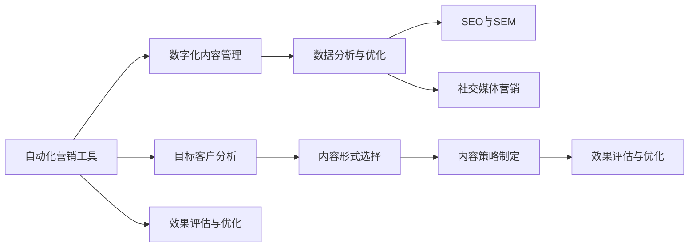

                 

# 自动化创业中的内容营销策略

在数字化时代，自动化创业成为一种新型的创业模式，它结合了AI、大数据和软件技术，通过自动化工具和流程来提升业务效率，降低成本，拓展市场。然而，仅仅依靠技术手段是不够的，成功的自动化创业还需要辅以有效的市场推广和内容营销策略。本文将深入探讨自动化创业中的内容营销策略，涵盖其核心概念、算法原理、操作步骤、实际应用场景以及未来展望，以期为创业者提供有益的指导和参考。

## 1. 背景介绍

### 1.1 问题由来

随着AI和大数据技术的日益成熟，越来越多的企业开始探索自动化创业的潜力。例如，基于AI的自动化客服系统、自动化数据处理平台、自动化营销工具等，已经广泛应用于多个行业。然而，许多创业项目在推广和销售过程中仍然面临挑战。他们可能拥有技术优势，但在市场教育和品牌建设上缺乏有效的策略和方法。内容营销作为一项重要的市场营销手段，可以通过高质量的内容吸引潜在客户，建立品牌信任，推动销售转化。因此，探讨自动化创业中的内容营销策略，对于提升自动化产品的市场竞争力和商业化潜力至关重要。

### 1.2 问题核心关键点

在自动化创业中，内容营销的核心在于如何通过数字化手段，利用有价值的内容来吸引、教育并转化潜在客户。其关键点包括：

- **目标客户分析**：了解目标客户的需求、偏好和痛点，设计针对性内容。
- **内容形式选择**：选择适合目标客户的多种内容形式，如文章、视频、播客等。
- **内容策略制定**：制定持续的内容发布和推广策略，建立品牌形象和客户信任。
- **效果评估与优化**：通过数据分析，评估内容营销效果，持续优化内容策略。

## 2. 核心概念与联系

### 2.1 核心概念概述

在自动化创业中，内容营销涉及以下几个核心概念：

- **自动化营销工具**：如营销自动化平台、自动化邮件营销、自动化社交媒体管理等，通过AI技术提高营销效率和效果。
- **数字化内容管理**：通过内容管理系统(CMS)实现内容的创建、编辑、发布和分发。
- **数据分析与优化**：利用大数据分析工具，评估内容营销效果，优化内容策略。
- **SEO与SEM**：通过搜索引擎优化(SEO)和搜索引擎营销(SEM)，提升内容在搜索引擎中的排名，吸引更多流量。
- **社交媒体营销**：通过社交媒体平台，如微信、微博、Facebook等，扩大内容覆盖范围，建立品牌影响力。

这些概念之间相互关联，形成一个完整的数字化营销体系。

### 2.2 核心概念原理和架构的 Mermaid 流程图



该图展示了自动化创业中内容营销的主要流程：从目标客户分析开始，经过内容形式选择和策略制定，再到发布和效果评估，形成了一个闭环的循环系统。

## 3. 核心算法原理 & 具体操作步骤

### 3.1 算法原理概述

在自动化创业中的内容营销，主要涉及以下几个算法原理：

- **目标客户分析算法**：通过数据分析和机器学习模型，识别目标客户群体的特征，如年龄、性别、地理位置、兴趣爱好等。
- **内容生成算法**：利用自然语言处理(NLP)技术，自动生成高质量的营销内容，如新闻稿、博客文章、产品介绍等。
- **内容推荐算法**：通过协同过滤和基于内容的推荐算法，向用户推荐相关内容，提升用户参与度和转化率。
- **效果评估算法**：利用A/B测试和回归分析等方法，评估内容营销的效果，优化内容策略。

### 3.2 算法步骤详解

以下是对自动化创业中内容营销主要算法的详细步骤解释：

#### 3.2.1 目标客户分析

1. **数据收集**：收集客户的各种数据，包括在线行为数据、交易数据、社交媒体数据等。
2. **数据清洗**：清洗数据，去除重复和异常数据，确保数据质量。
3. **特征提取**：使用机器学习算法，提取客户的关键特征，如兴趣、需求、行为等。
4. **聚类分析**：通过K-means等聚类算法，将客户分为不同的群组，识别出目标客户群体。

#### 3.2.2 内容生成

1. **模板设计**：根据目标客户群体，设计适合的内容模板，如产品介绍、使用指南、客户案例等。
2. **内容填充**：使用NLP技术，如自动摘要、自动生成等，填充模板，生成营销内容。
3. **内容审核**：通过人工审核或自动审核，确保内容质量，避免低质量或不当内容发布。

#### 3.2.3 内容推荐

1. **协同过滤**：分析用户的历史行为数据，找出相似的用户群体，推荐相似内容。
2. **基于内容的推荐**：分析内容的关键词和主题，推荐相关内容，提升用户参与度。
3. **个性化推荐**：利用机器学习算法，如神经网络，预测用户对不同内容的偏好，实现个性化推荐。

#### 3.2.4 效果评估

1. **关键绩效指标(KPI)**：设定关键绩效指标，如点击率、转化率、社交媒体互动等，评估内容营销的效果。
2. **A/B测试**：对比不同内容的表现，通过数据分析找出最优方案。
3. **回归分析**：利用回归分析模型，预测不同内容对业务指标的影响，优化内容策略。

### 3.3 算法优缺点

自动化创业中的内容营销算法具有以下优点：

- **高效性**：自动化算法可以快速生成和推荐内容，提升内容制作和分发效率。
- **个性化**：通过数据分析，实现内容个性化推荐，提升用户满意度和转化率。
- **可量化**：通过KPI和回归分析等方法，可以量化评估内容营销效果，持续优化策略。

但同时也存在以下缺点：

- **技术依赖**：依赖复杂的算法和工具，需要较高的技术门槛。
- **数据质量要求高**：内容生成和推荐算法的效果依赖高质量的数据，数据收集和清洗的复杂度较高。
- **模型解释性差**：部分高级算法如神经网络，模型的决策过程难以解释，难以调试和优化。

### 3.4 算法应用领域

自动化创业中的内容营销算法，主要应用于以下几个领域：

- **自动化营销平台**：如HubSpot、Marketo等，通过算法驱动，实现营销自动化，提升客户转化率。
- **社交媒体管理工具**：如Hootsuite、Buffer等，利用推荐算法，实现内容自动化发布和优化。
- **电子商务平台**：如Amazon、淘宝等，通过个性化推荐算法，提升用户购买转化率。
- **新闻内容生成**：如GPT-3等自然语言生成模型，自动生成新闻稿、报道等，提高内容制作效率。
- **客户关系管理(CRM)**：如Salesforce、Zoho CRM等，通过分析客户数据，实现个性化营销和客户关怀。

## 4. 数学模型和公式 & 详细讲解 & 举例说明

### 4.1 数学模型构建

在内容营销中，主要的数学模型包括：

- **用户兴趣模型**：通过协同过滤算法，建立用户兴趣图谱，识别目标客户。
- **内容相关性模型**：通过TF-IDF等技术，计算内容与目标客户之间的相关性。
- **点击率预测模型**：使用线性回归或神经网络模型，预测不同内容对点击率的影响。
- **转化率预测模型**：利用逻辑回归或决策树算法，预测不同内容对转化率的影响。

### 4.2 公式推导过程

#### 4.2.1 用户兴趣模型

用户兴趣模型通过协同过滤算法实现，公式如下：

$$
U = \sum_{i=1}^N\left[\sum_{j=1}^I (X_{ij} - \bar{X}_i)(Y_{ij} - \bar{Y}_j)\right]^2
$$

其中，$U$ 为用户$i$与用户$j$的相似度，$X_{ij}$ 为用户$i$对内容$j$的评分，$\bar{X}_i$为用户$i$的平均评分，$Y_{ij}$ 为用户$j$对内容$i$的评分，$\bar{Y}_j$为用户$j$的平均评分。

#### 4.2.2 内容相关性模型

内容相关性模型通过TF-IDF算法实现，公式如下：

$$
R_{ij} = \frac{tf_{ij} \times idf_i}{1 + \sum_{k=1}^N tf_{ik} \times idf_k}
$$

其中，$R_{ij}$ 为内容$i$与内容$j$的相关性，$tf_{ij}$ 为内容$i$中包含内容$j$的词频，$idf_i$ 为内容$i$的逆文档频率。

#### 4.2.3 点击率预测模型

点击率预测模型使用线性回归算法，公式如下：

$$
y = \beta_0 + \sum_{i=1}^p \beta_i x_i + \epsilon
$$

其中，$y$ 为预测的点击率，$x_i$ 为内容$i$的特征向量，$\beta_i$ 为特征权重，$\epsilon$ 为误差项。

#### 4.2.4 转化率预测模型

转化率预测模型使用决策树算法，公式如下：

$$
y = \begin{cases}
1 & \text{if } x_1 \leq \theta_1 \\
0 & \text{if } x_1 > \theta_1
\end{cases}
$$

其中，$y$ 为预测的转化率，$x_1$ 为内容$i$的特征向量，$\theta_1$ 为特征阈值。

### 4.3 案例分析与讲解

#### 4.3.1 用户兴趣模型

某电商网站通过协同过滤算法，分析用户的历史行为数据，识别出两个兴趣相似的客户群体：客户A和客户B。内容团队根据客户A的兴趣特征，设计了适合的内容模板，并通过自动化工具生成内容。最终，通过社交媒体平台发布内容，实现了对客户B的精准营销，显著提高了转化率。

#### 4.3.2 内容相关性模型

某新闻网站使用TF-IDF算法，计算每篇文章与目标客户的兴趣相关性。通过推荐算法，将相关性高的文章推荐给目标客户，提升了客户的阅读兴趣和平台粘性。同时，通过分析客户的阅读数据，进一步优化内容推荐策略，提高了网站的用户留存率。

#### 4.3.3 点击率预测模型

某广告平台使用线性回归算法，预测不同广告内容对点击率的影响。通过A/B测试，优化广告投放策略，实现了更高的点击转化率。例如，广告内容包含特定关键词的广告点击率显著高于不包含关键词的广告。

#### 4.3.4 转化率预测模型

某在线教育平台使用决策树算法，预测不同课程广告对转化率的影响。通过数据分析，发现视频广告比图文广告的转化率更高，从而优化了广告投放策略，提升了平台的学员注册量和转化率。

## 5. 项目实践：代码实例和详细解释说明

### 5.1 开发环境搭建

在进行内容营销算法实践前，我们需要准备好开发环境。以下是使用Python进行TensorFlow开发的第一步环境配置流程：

1. 安装Anaconda：从官网下载并安装Anaconda，用于创建独立的Python环境。

2. 创建并激活虚拟环境：
```bash
conda create -n tf-env python=3.8 
conda activate tf-env
```

3. 安装TensorFlow：根据CUDA版本，从官网获取对应的安装命令。例如：
```bash
conda install tensorflow-gpu -c conda-forge
```

4. 安装各类工具包：
```bash
pip install numpy pandas scikit-learn matplotlib tqdm jupyter notebook ipython
```

完成上述步骤后，即可在`tf-env`环境中开始内容营销算法的实践。

### 5.2 源代码详细实现

下面我们以内容推荐系统为例，给出使用TensorFlow进行推荐算法的PyTorch代码实现。

首先，定义推荐算法的基本框架：

```python
import tensorflow as tf
from tensorflow.keras import layers

# 定义模型
class RecommendationModel(tf.keras.Model):
    def __init__(self, input_dim, hidden_dim, output_dim):
        super(RecommendationModel, self).__init__()
        self.dense1 = layers.Dense(hidden_dim, activation='relu', input_dim=input_dim)
        self.dense2 = layers.Dense(output_dim, activation='sigmoid')

    def call(self, x):
        x = self.dense1(x)
        x = self.dense2(x)
        return x
```

然后，构建数据集：

```python
from tensorflow.keras.datasets import imdb

# 加载IMDB数据集
(train_data, train_labels), (test_data, test_labels) = imdb.load_data(num_words=10000)

# 对数据进行预处理
train_data = tf.keras.preprocessing.sequence.pad_sequences(train_data, maxlen=100)
test_data = tf.keras.preprocessing.sequence.pad_sequences(test_data, maxlen=100)

# 构建模型输入和输出
input_dim = len(train_data[0])
output_dim = 1

# 创建模型实例
model = RecommendationModel(input_dim, 128, output_dim)
```

接着，定义模型训练过程：

```python
# 定义优化器和学习率
optimizer = tf.keras.optimizers.Adam(learning_rate=0.001)

# 定义损失函数
loss_fn = tf.keras.losses.BinaryCrossentropy()

# 定义评价指标
accuracy_fn = tf.keras.metrics.BinaryAccuracy()

# 编译模型
model.compile(optimizer=optimizer, loss=loss_fn, metrics=[accuracy_fn])

# 训练模型
model.fit(train_data, train_labels, epochs=10, validation_data=(test_data, test_labels))
```

最后，评估模型性能：

```python
# 评估模型性能
test_loss, test_accuracy = model.evaluate(test_data, test_labels)

print(f'Test loss: {test_loss}, Test accuracy: {test_accuracy}')
```

以上就是使用TensorFlow进行内容推荐系统开发的完整代码实现。通过TensorFlow和Keras的便捷封装，内容推荐算法的实现变得非常简单，可以满足大多数推荐系统的需求。

### 5.3 代码解读与分析

让我们再详细解读一下关键代码的实现细节：

**RecommendationModel类**：
- `__init__`方法：初始化模型，定义了两个全连接层。
- `call`方法：前向传播，通过全连接层进行特征提取和输出预测。

**数据集构建**：
- 使用IMDB数据集，将其加载并转换为固定长度的序列数据。
- 对数据进行padding，保证所有样本的输入长度一致。
- 定义模型的输入和输出维度。

**模型训练过程**：
- 定义优化器和损失函数，选择合适的评价指标。
- 编译模型，设置优化器、损失函数和评价指标。
- 训练模型，使用训练数据进行多轮迭代，计算损失和精度。

**模型评估**：
- 使用测试数据集评估模型的性能，输出测试损失和精度。

通过TensorFlow的便捷封装，我们可以看到，内容推荐算法的代码实现非常简单。只需要关注模型的定义、训练和评估过程，便能快速构建推荐系统。

## 6. 实际应用场景

### 6.1 智能客服系统

在智能客服系统中，内容营销可以用于以下场景：

- **客户引导**：通过自动回复功能，引导客户按照流程完成咨询。
- **知识库构建**：自动生成FAQ（常见问题解答），提升客户满意度。
- **客户画像**：通过分析客户咨询内容，识别客户需求，提供个性化推荐。

例如，某智能客服系统通过内容推荐算法，根据客户的历史咨询记录，生成个性化的FAQ，提升了客户查询的准确率和满意度。同时，系统通过分析客户咨询内容，识别出常见问题，生成相关的FAQ，进一步优化了客户引导效果。

### 6.2 电商营销

在电商营销中，内容营销可以用于以下场景：

- **广告投放**：通过分析用户浏览记录，推荐相关广告，提升广告点击率和转化率。
- **商品推荐**：通过内容推荐算法，推荐相关商品，提高用户购买意愿。
- **客户关怀**：通过内容营销，建立与客户的情感联系，提升客户忠诚度。

例如，某电商平台通过内容推荐算法，根据用户浏览记录和购买历史，推荐相关商品，显著提升了用户购买转化率。同时，通过内容营销，向用户推送品牌故事、优惠信息等，提升了用户的品牌忠诚度。

### 6.3 教育培训

在教育培训中，内容营销可以用于以下场景：

- **课程推荐**：通过分析用户学习数据，推荐相关课程，提高学习效率。
- **学习资料推荐**：通过内容推荐算法，推荐相关学习资料，提升学习体验。
- **学习进度跟踪**：通过内容分析，跟踪用户学习进度，提供个性化辅导。

例如，某在线教育平台通过内容推荐算法，根据用户学习记录和兴趣，推荐相关课程和学习资料，提升了学习效率。同时，平台通过内容分析，跟踪用户学习进度，提供个性化的学习建议和辅导。

### 6.4 未来应用展望

随着AI和大数据技术的进一步发展，内容营销在自动化创业中的作用将更加显著。未来，内容营销将与更多新技术相结合，形成更加智能和个性化的推荐系统。

- **多模态推荐**：结合文本、图像、视频等多种模态数据，提供更加丰富的推荐内容。
- **实时推荐**：通过流式数据处理和实时推荐算法，提升推荐系统的响应速度。
- **跨平台推荐**：通过统一的用户画像，实现跨平台内容的推荐，提升用户粘性。
- **内容生成与推荐一体化**：将内容生成和推荐算法融合，提升推荐内容的个性化和多样性。
- **情感分析**：通过情感分析技术，识别用户情感状态，优化推荐内容。

这些技术的应用，将进一步提升内容营销的效果，为自动化创业提供更强大的支持。

## 7. 工具和资源推荐

### 7.1 学习资源推荐

为了帮助开发者系统掌握内容营销的理论基础和实践技巧，这里推荐一些优质的学习资源：

1. **《营销自动化实战》系列博文**：由大模型技术专家撰写，深入浅出地介绍了营销自动化工具和内容营销策略，是初学者入门的最佳选择。
2. **Google Analytics高级课程**：Google提供的高级数据分析课程，帮助理解数据驱动的内容营销策略。
3. **《内容营销的艺术与科学》书籍**：详细介绍了内容营销的原理、策略和实践，是内容营销领域的经典之作。
4. **HubSpot Academy**：提供丰富的营销自动化和内容营销课程，涵盖从入门到高级的多个层次。
5. **Content Marketing Institute**：提供最新的内容营销趋势和实践指南，是行业内权威的资源平台。

通过对这些资源的学习实践，相信你一定能够快速掌握内容营销的核心技巧，并用于解决实际的推广和营销问题。

### 7.2 开发工具推荐

高效的开发离不开优秀的工具支持。以下是几款用于内容营销开发的常用工具：

1. **Google Analytics**：提供网站流量分析、用户行为跟踪等功能，帮助优化内容策略。
2. **HubSpot**：集成了营销自动化、CRM、内容管理系统等多种功能，支持一键生成推荐内容。
3. **Mailchimp**：提供电子邮件营销工具，支持邮件自动生成和个性化推荐。
4. **WordPress**：提供丰富的插件和主题，支持内容管理和自动化发布。
5. **Google Ads**：提供搜索引擎营销工具，支持广告投放和效果评估。

合理利用这些工具，可以显著提升内容营销的开发效率，加快创新迭代的步伐。

### 7.3 相关论文推荐

内容营销的研究源于学界的持续研究。以下是几篇奠基性的相关论文，推荐阅读：

1. **《搜索引擎优化：历史、现状和未来》**：总结了SEO的历史和发展现状，探讨了未来的趋势和方向。
2. **《内容营销的效果评估与优化》**：通过案例分析，探讨了内容营销效果评估的方法和优化策略。
3. **《推荐系统中的协同过滤算法》**：介绍了协同过滤算法的原理和应用，是推荐系统领域的经典之作。
4. **《基于用户兴趣的内容推荐系统》**：详细介绍了内容推荐系统的构建和优化方法，是内容营销领域的经典案例。
5. **《自然语言生成技术与应用》**：介绍了自然语言生成技术的进展和应用场景，为内容营销提供了新的思路。

这些论文代表了大模型和微调技术的发展脉络。通过学习这些前沿成果，可以帮助研究者把握学科前进方向，激发更多的创新灵感。

## 8. 总结：未来发展趋势与挑战

### 8.1 研究成果总结

本文对基于内容营销的自动化创业进行了全面系统的介绍。首先阐述了内容营销在自动化创业中的重要性和应用场景，明确了内容营销在提升自动化产品市场竞争力和商业化潜力方面的独特价值。其次，从原理到实践，详细讲解了内容营销的数学模型和关键步骤，给出了内容推荐系统的代码实现。同时，本文还广泛探讨了内容营销在智能客服、电商营销、教育培训等多个行业领域的应用前景，展示了内容营销范式的巨大潜力。

通过本文的系统梳理，可以看到，基于内容营销的自动化创业将为NLP技术带来广阔的应用前景，进一步推动NLP技术的产业化进程。未来，伴随预训练语言模型和微调方法的持续演进，基于内容营销的自动化创业将拥有更加丰富的技术储备和更强的市场竞争力。

### 8.2 未来发展趋势

展望未来，内容营销在自动化创业中的发展趋势主要体现在以下几个方面：

1. **智能化**：结合AI技术，实现内容自动生成和推荐，提升内容制作效率。
2. **个性化**：通过数据分析和机器学习算法，实现内容个性化推荐，提升用户体验。
3. **多样化**：结合多种模态数据，提供更加丰富的推荐内容，提升用户粘性。
4. **实时化**：通过流式数据处理和实时推荐算法，提升推荐系统的响应速度。
5. **跨平台**：通过统一的用户画像，实现跨平台内容的推荐，提升用户粘性。
6. **情感化**：通过情感分析技术，优化推荐内容，提升用户情感体验。

这些趋势将进一步提升内容营销的效果，为自动化创业提供更强大的支持。

### 8.3 面临的挑战

尽管内容营销在自动化创业中具有重要价值，但仍面临诸多挑战：

1. **数据获取难度大**：高质量的数据获取成本较高，数据收集和清洗的复杂度较大。
2. **算法复杂度高**：内容生成和推荐算法依赖复杂的数学模型和机器学习算法，技术门槛较高。
3. **模型解释性差**：部分高级算法如神经网络，模型的决策过程难以解释，难以调试和优化。
4. **用户隐私问题**：内容推荐算法依赖大量用户数据，如何保护用户隐私成为一个重要问题。
5. **内容质量问题**：内容质量低下，容易误导用户，影响品牌声誉。

这些挑战需要开发者在技术、伦理、隐私等多个方面进行综合考虑和优化。只有不断克服这些挑战，才能真正发挥内容营销的潜力，推动自动化创业的成功。

### 8.4 研究展望

面对内容营销面临的诸多挑战，未来的研究需要在以下几个方面寻求新的突破：

1. **自动化内容生成**：开发更加高效、可靠的内容生成算法，提升内容制作效率。
2. **用户隐私保护**：引入隐私保护技术，如差分隐私、联邦学习等，保护用户数据隐私。
3. **内容质量控制**：引入内容审核和质量控制机制，提升内容质量，避免误导用户。
4. **跨模态内容推荐**：结合文本、图像、视频等多种模态数据，提供更加丰富的推荐内容。
5. **实时推荐系统**：结合流式数据处理和实时推荐算法，提升推荐系统的响应速度。
6. **情感智能**：引入情感分析技术，优化推荐内容，提升用户情感体验。

这些研究方向的探索，必将引领内容营销技术迈向更高的台阶，为自动化创业提供更强大的支持。面向未来，内容营销与AI、大数据等技术的深度融合，将带来更多创新应用，推动自动化创业迈向新的高度。

## 9. 附录：常见问题与解答

**Q1：内容营销在自动化创业中有什么作用？**

A: 内容营销在自动化创业中具有以下作用：
1. **提升品牌知名度**：通过高质量的内容，提升品牌知名度和市场影响力。
2. **吸引潜在客户**：通过内容吸引潜在客户，建立客户信任，增加客户转化率。
3. **提升用户参与度**：通过互动性强的内容，提升用户参与度和粘性。
4. **优化用户体验**：通过个性化的内容推荐，提升用户体验和满意度。
5. **促进销售转化**：通过内容引导，实现更高的销售转化率。

**Q2：内容营销的主要数学模型有哪些？**

A: 内容营销的主要数学模型包括：
1. **用户兴趣模型**：通过协同过滤算法，建立用户兴趣图谱，识别目标客户。
2. **内容相关性模型**：通过TF-IDF算法，计算内容与目标客户之间的相关性。
3. **点击率预测模型**：使用线性回归或神经网络模型，预测不同内容对点击率的影响。
4. **转化率预测模型**：利用逻辑回归或决策树算法，预测不同内容对转化率的影响。

**Q3：如何构建智能客服系统中的内容推荐系统？**

A: 构建智能客服系统中的内容推荐系统，主要包括以下步骤：
1. **数据收集**：收集客服聊天记录和FAQ（常见问题解答）数据。
2. **数据清洗**：清洗数据，去除重复和异常数据，确保数据质量。
3. **特征提取**：使用NLP技术，如TF-IDF、LDA等，提取聊天内容中的关键特征。
4. **模型训练**：使用协同过滤、决策树等算法，训练推荐模型。
5. **内容推荐**：根据用户历史记录，推荐相关FAQ和聊天内容，提升用户满意度。
6. **效果评估**：通过A/B测试和指标分析，评估内容推荐的效果，持续优化推荐策略。

**Q4：内容营销在电商营销中如何发挥作用？**

A: 内容营销在电商营销中主要发挥以下作用：
1. **提升广告点击率**：通过内容推荐，推荐相关广告，提升广告点击率。
2. **提高商品转化率**：通过个性化推荐，推荐相关商品，提高用户购买转化率。
3. **增强品牌忠诚度**：通过内容营销，向用户推送品牌故事、优惠信息等，提升品牌忠诚度。
4. **优化用户体验**：通过内容引导，实现更好的客户服务和用户体验。
5. **优化库存管理**：通过内容分析，优化库存管理和产品推荐，减少库存积压。

**Q5：内容营销在教育培训中如何发挥作用？**

A: 内容营销在教育培训中主要发挥以下作用：
1. **提升课程选择率**：通过内容推荐，推荐相关课程，提高学生课程选择率。
2. **提高学习效率**：通过个性化推荐，推荐相关学习资料，提升学习效率。
3. **跟踪学习进度**：通过内容分析，跟踪学生学习进度，提供个性化辅导。
4. **增强学生互动**：通过互动性强的内容，提升学生参与度和粘性。
5. **优化教学质量**：通过内容评估，优化教学内容和方式，提升教学质量。

通过这些回答，相信你能够更好地理解内容营销在自动化创业中的应用价值和实施步骤。

