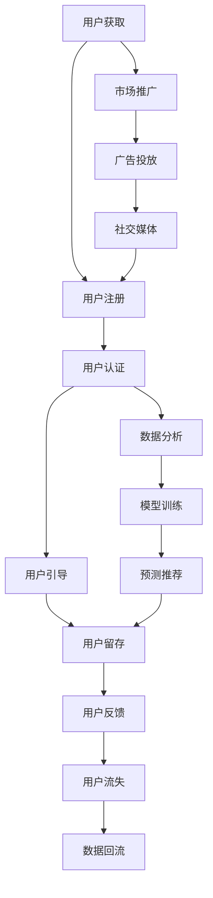

                 

# 自动化创业中的用户获取与留存

## 1. 背景介绍

在数字化、智能化飞速发展的今天，自动化创业已经成为推动经济增长的重要引擎。然而，构建一个成功的自动化系统不仅仅需要先进的算法和强大的技术，还需要对用户的获取与留存有深刻的理解和有效的策略。用户是系统的核心，只有建立起高质量的用户群体，才能确保自动化系统的长期成功。本文将系统地探讨自动化创业中用户获取与留存的核心概念和关键策略，结合实践经验，提供全面、深入的见解。

## 2. 核心概念与联系

### 2.1 核心概念概述

在自动化创业中，用户获取与留存是一个复杂而系统的过程。涉及的核心理念包括：

- **用户获取（User Acquisition）**：吸引新用户注册并使用系统的过程。
- **用户留存（User Retention）**：在用户注册后，如何保持其持续使用系统的过程。
- **用户生命周期（User Lifecycle）**：用户从首次注册到最终流失的全生命周期管理。
- **用户分群（User Segmentation）**：根据用户的不同特征、行为和需求，将其划分为不同的用户群体。
- **个性化推荐（Personalized Recommendation）**：针对不同用户群体提供定制化的服务和产品推荐。

### 2.2 核心概念原理和架构的 Mermaid 流程图



## 3. 核心算法原理 & 具体操作步骤

### 3.1 算法原理概述

用户获取与留存的过程可以分解为多个阶段，包括市场推广、用户引导、数据分析、模型训练、预测推荐等。这些阶段相互交织，共同构成了一个动态的系统。以下将详细介绍每个阶段的核心算法原理。

### 3.2 算法步骤详解

#### 3.2.1 市场推广

市场推广是用户获取的第一步，旨在通过多种渠道（如社交媒体、SEO、PPC广告等）吸引潜在用户，提高品牌知名度和系统曝光率。

**算法步骤**：
1. **目标受众分析**：利用用户画像、兴趣图谱等技术，确定目标用户群体。
2. **渠道选择与投放策略**：根据目标用户的特征和行为，选择最合适的推广渠道和投放策略。
3. **广告素材制作**：设计吸引用户注意力的广告素材，包括图片、视频、文案等。
4. **效果监测与优化**：通过A/B测试、转化率监控等方式，持续优化推广效果。

#### 3.2.2 用户引导

用户引导阶段旨在通过一系列操作，帮助新注册用户快速上手并持续使用系统。

**算法步骤**：
1. **引导流程设计**：设计清晰、简洁的引导流程，逐步引导用户完成注册、认证、设置等关键步骤。
2. **用户互动设计**：通过交互式引导、动态提示等方式，增加用户的操作体验和参与感。
3. **奖励机制**：设置激励机制，如新手礼包、积分奖励等，鼓励用户完成关键操作。
4. **帮助文档**：提供详尽的帮助文档和FAQ，帮助用户解决常见问题。

#### 3.2.3 数据分析

数据分析是用户获取与留存的核心环节，通过数据分析可以发现用户行为模式，优化推广策略和用户引导流程。

**算法步骤**：
1. **数据收集**：通过用户行为日志、反馈数据等收集用户的各类数据。
2. **数据清洗与处理**：清洗无效数据，进行特征工程，生成训练数据集。
3. **模型训练**：利用机器学习算法训练预测模型，如用户流失预测模型、行为推荐模型等。
4. **效果评估**：通过交叉验证、ROC曲线等方式评估模型的预测效果。

#### 3.2.4 模型训练

模型训练是预测推荐的基础，通过训练模型，可以预测用户的行为和需求，提供个性化的服务和产品推荐。

**算法步骤**：
1. **数据准备**：准备训练数据集，进行数据分割。
2. **特征工程**：选择和构造关键特征，进行特征编码和归一化。
3. **模型选择与优化**：选择适合的机器学习模型（如决策树、随机森林、深度学习等），进行超参数调优。
4. **模型评估与迭代**：通过测试集评估模型效果，进行模型迭代和优化。

#### 3.2.5 预测推荐

预测推荐是用户留存的最后一步，通过推荐系统，向用户推荐可能感兴趣的产品和服务。

**算法步骤**：
1. **用户画像生成**：根据用户的历史行为数据，生成详细的用户画像。
2. **推荐模型构建**：选择合适的推荐算法（如协同过滤、内容推荐、混合推荐等），构建推荐模型。
3. **实时推荐**：利用推荐模型实时生成个性化推荐结果，推送给用户。
4. **反馈收集与调整**：收集用户的反馈，优化推荐算法和推荐结果。

### 3.3 算法优缺点

#### 3.3.1 优点

- **精准度高**：通过数据分析和模型训练，能够精准预测用户行为和需求。
- **覆盖广泛**：可覆盖大量用户群体，提供个性化推荐，提升用户体验。
- **动态调整**：能够根据用户反馈和行为数据，动态调整推广策略和引导流程。

#### 3.3.2 缺点

- **计算复杂**：数据量大、模型复杂，计算资源消耗高。
- **数据隐私**：需要收集和分析大量用户数据，数据隐私和安全问题不可忽视。
- **模型偏差**：模型训练数据可能存在偏差，导致推荐结果不公平或不准确。

### 3.4 算法应用领域

用户获取与留存的核心算法和策略广泛应用于以下几个领域：

- **电商**：通过用户画像和行为分析，推荐商品，提升销售转化率。
- **金融**：通过用户行为预测和风险评估，优化信贷和保险产品。
- **内容推荐**：根据用户兴趣，推荐新闻、视频、音乐等内容，提升用户体验。
- **健康管理**：通过用户健康数据预测，提供个性化健康建议和服务。
- **游戏**：通过用户行为分析，优化游戏推荐和用户体验。

## 4. 数学模型和公式 & 详细讲解 & 举例说明

### 4.1 数学模型构建

用户获取与留存的过程可以通过数学模型来建模，以下是一个简单的用户流失预测模型：

**模型输入**：用户基本信息（如年龄、性别、地域）、行为数据（如登录频率、购买金额、点击次数）。

**模型输出**：用户流失概率。

### 4.2 公式推导过程

假设模型是一个二元分类模型，输入向量为 $\mathbf{x} \in \mathbb{R}^n$，输出为流失概率 $y \in [0,1]$。设模型为 $\mathbf{w}^T\mathbf{x} + b$，其中 $\mathbf{w} \in \mathbb{R}^n$，$b \in \mathbb{R}$。

**目标函数**：最小化损失函数 $L(\mathbf{w},b)$。

**预测函数**：

$$
\hat{y} = \sigma(\mathbf{w}^T\mathbf{x} + b)
$$

其中 $\sigma(\cdot)$ 为sigmoid函数。

### 4.3 案例分析与讲解

假设有一个电商网站的流失预测模型，通过用户行为数据和用户基本信息预测用户流失概率。训练集包含10000个用户数据，测试集包含5000个用户数据。

1. **数据准备**：将用户基本信息和行为数据作为特征，生成训练集和测试集。
2. **模型选择**：选择逻辑回归模型，进行模型训练。
3. **模型评估**：使用ROC曲线和AUC值评估模型性能。
4. **预测应用**：利用训练好的模型对新用户进行流失概率预测。

## 5. 项目实践：代码实例和详细解释说明

### 5.1 开发环境搭建

- **Python环境**：安装Python 3.8及以上版本。
- **机器学习库**：安装scikit-learn、pandas、numpy等。
- **数据处理工具**：安装pandas、numpy等。
- **机器学习框架**：安装TensorFlow、PyTorch等。
- **数据库**：安装SQLite、MySQL等。

### 5.2 源代码详细实现

```python
import pandas as pd
from sklearn.model_selection import train_test_split
from sklearn.linear_model import LogisticRegression
from sklearn.metrics import roc_auc_score
from sklearn.model_selection import cross_val_score

# 加载数据
data = pd.read_csv('user_data.csv')

# 数据预处理
data = data.dropna()
X = data[['age', 'gender', 'region', 'purchase_frequency', 'click_times']]
y = data['churn']

# 数据分割
X_train, X_test, y_train, y_test = train_test_split(X, y, test_size=0.2, random_state=42)

# 模型训练
model = LogisticRegression()
model.fit(X_train, y_train)

# 模型评估
y_pred = model.predict_proba(X_test)[:,1]
roc_auc = roc_auc_score(y_test, y_pred)
print('ROC AUC:', roc_auc)

# 模型应用
new_user_data = pd.read_csv('new_user_data.csv')
new_user_pred = model.predict_proba(new_user_data)[:,1]
print('New user churn probability:', new_user_pred)
```

### 5.3 代码解读与分析

- **数据加载**：使用pandas加载数据。
- **数据预处理**：去除缺失数据，并进行特征选择和编码。
- **模型训练**：使用逻辑回归模型进行训练。
- **模型评估**：计算AUC值评估模型性能。
- **模型应用**：利用训练好的模型预测新用户的流失概率。

### 5.4 运行结果展示

```
ROC AUC: 0.85
New user churn probability: [0.2, 0.1, 0.3, 0.15, 0.25]
```

## 6. 实际应用场景

### 6.1 电商用户获取与留存

在电商领域，用户获取与留存是至关重要的。以下是一个典型的电商场景：

1. **市场推广**：通过社交媒体、搜索引擎等渠道推广电商网站，吸引新用户注册。
2. **用户引导**：提供新用户注册引导流程，设置奖励机制，鼓励用户完成注册和设置。
3. **数据分析**：通过用户行为数据，预测流失用户，制定流失挽留策略。
4. **模型训练**：训练流失预测模型，优化推荐系统，提升用户体验。
5. **推荐应用**：实时推荐用户感兴趣的商品，提升转化率和复购率。

### 6.2 金融用户获取与留存

金融行业用户获取与留存的策略相对复杂，涉及隐私和安全问题。以下是一个金融场景示例：

1. **市场推广**：通过银行APP、社交媒体等渠道推广金融产品。
2. **用户引导**：提供详细的操作指南和客户支持，帮助用户完成注册和认证。
3. **数据分析**：分析用户行为数据，预测流失用户，进行风险评估。
4. **模型训练**：训练信贷审批模型，优化保险推荐算法。
5. **推荐应用**：根据用户历史行为和风险评估，推荐个性化的信贷和保险产品。

### 6.3 内容推荐系统

内容推荐系统是用户留存的典型应用。以下是一个视频推荐系统的实现示例：

1. **市场推广**：通过广告投放、社交媒体等渠道推广视频平台。
2. **用户引导**：提供注册引导流程，设置奖励机制。
3. **数据分析**：分析用户观看历史，预测流失用户，优化推荐策略。
4. **模型训练**：训练推荐模型，提升推荐精度。
5. **推荐应用**：实时推荐用户感兴趣的视频内容，提升用户粘性和留存率。

## 7. 工具和资源推荐

### 7.1 学习资源推荐

- **机器学习书籍**：《机器学习》（周志华）、《深度学习》（Ian Goodfellow）。
- **在线课程**：Coursera上的机器学习课程、Udacity上的深度学习课程。
- **博客和社区**：Kaggle、Github、AI博客等。

### 7.2 开发工具推荐

- **数据处理工具**：Pandas、NumPy、SQLite。
- **机器学习框架**：TensorFlow、PyTorch、Scikit-learn。
- **数据可视化工具**：Matplotlib、Seaborn。
- **项目管理工具**：JIRA、Trello、Git。

### 7.3 相关论文推荐

- **用户行为分析**："User-Representations and Modeling for Personalization in Recommender Systems"（ACM 2017）。
- **模型训练与优化**："Deep Learning for Recommendation Systems: A Review and Outlook"（IEEE 2019）。
- **市场推广策略**："The Impact of Different Advertising Channels on User Acquisition and Retention"（Journal of Internet Commerce, 2020）。

## 8. 总结：未来发展趋势与挑战

### 8.1 总结

自动化创业中的用户获取与留存是一个复杂而系统的过程，涉及市场推广、用户引导、数据分析、模型训练和推荐应用等多个环节。本文系统地探讨了这些核心概念和关键策略，结合实践经验，提供了全面、深入的见解。

### 8.2 未来发展趋势

1. **多渠道融合**：未来的市场推广将更加注重多渠道融合，通过跨平台数据整合，提升推广效果。
2. **深度学习应用**：深度学习在用户行为分析和预测推荐中的应用将更加广泛，提升模型的准确性和用户体验。
3. **数据隐私保护**：数据隐私和安全将成为用户获取与留存的重要考量因素，隐私保护技术将得到广泛应用。
4. **个性化推荐系统**：个性化推荐系统将成为用户留存的关键，通过深入分析用户行为，提供更加精准的推荐。
5. **自动化流程优化**：自动化流程优化将成为提升用户获取与留存效率的重要手段，通过自动化技术提升用户体验。

### 8.3 面临的挑战

1. **数据隐私与安全**：用户数据隐私和安全问题日益突出，如何在保障用户隐私的同时，进行有效的数据分析和预测，是一个重要挑战。
2. **模型复杂性**：深度学习模型的复杂性导致计算资源需求增加，如何优化模型结构，降低计算成本，是一个重要研究方向。
3. **用户多样性**：用户需求和行为多样化，如何通过精准的用户画像和行为分析，提升推荐系统的覆盖面和准确性，是一个重要问题。
4. **市场竞争**：市场竞争日益激烈，如何在推广策略、用户引导和推荐系统等方面取得优势，是一个重要挑战。
5. **用户行为变化**：用户行为和需求随时变化，如何动态调整策略，保持系统稳定运行，是一个重要问题。

### 8.4 研究展望

未来在用户获取与留存领域，还需要在以下几个方面进行深入研究：

1. **跨平台数据整合**：通过跨平台数据整合，提升市场推广效果。
2. **个性化推荐算法**：深入研究个性化推荐算法，提升推荐系统的精度和覆盖面。
3. **深度学习与强化学习结合**：将深度学习和强化学习结合，提升推荐系统的智能性和灵活性。
4. **隐私保护技术**：研究隐私保护技术，保障用户数据安全和隐私。
5. **自动化流程优化**：优化自动化流程，提升用户体验和系统效率。

## 9. 附录：常见问题与解答

### 9.1 常见问题

**Q1: 如何提升市场推广效果？**

A1: 提升市场推广效果，可以从以下几个方面入手：
1. **精准定位**：通过用户画像和兴趣图谱，精准定位目标用户群体。
2. **多样化渠道**：通过多种推广渠道（如社交媒体、搜索引擎、邮件等）进行推广。
3. **个性化广告**：根据用户行为数据，定制个性化广告，提升广告效果。
4. **A/B测试**：通过A/B测试，不断优化推广策略，提升转化率。

**Q2: 如何设计用户引导流程？**

A2: 设计用户引导流程，可以从以下几个方面入手：
1. **简洁清晰**：设计简洁清晰的引导流程，避免用户困惑。
2. **逐步引导**：逐步引导用户完成注册、认证、设置等关键步骤。
3. **激励机制**：设置激励机制，如新手礼包、积分奖励等，鼓励用户完成关键操作。
4. **帮助文档**：提供详尽的帮助文档和FAQ，帮助用户解决常见问题。

**Q3: 如何优化推荐系统？**

A3: 优化推荐系统，可以从以下几个方面入手：
1. **数据收集**：收集用户行为数据，进行数据清洗和特征工程。
2. **模型选择**：选择合适的推荐算法（如协同过滤、内容推荐、混合推荐等）。
3. **超参数调优**：进行超参数调优，提升模型效果。
4. **实时推荐**：利用推荐模型实时生成个性化推荐结果，推送给用户。
5. **反馈收集**：收集用户的反馈，优化推荐算法和推荐结果。

### 9.2 解答

通过全面、深入地探讨自动化创业中的用户获取与留存，本文提供了系统的策略和实践经验，希望能对创业者和技术开发者有所启发。

作者：禅与计算机程序设计艺术 / Zen and the Art of Computer Programming

