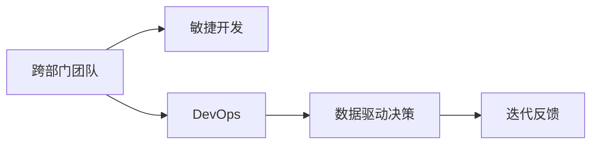

                 

# 自动化创业中的跨团队协作

在自动化创业的浪潮中，跨团队协作成为决定企业成败的关键因素。如何有效地整合不同团队的力量，协同完成复杂任务，实现创新突破？本文将从技术、管理、文化三个维度深入探讨自动化创业中的跨团队协作，为创业者提供实用的指导。

## 1. 背景介绍

在快速发展的科技领域，自动化技术被广泛应用于各个行业，推动了生产效率和服务质量的提升。然而，自动化项目往往涉及多个部门和团队，如何协调一致、高效协作，是创业公司面临的一大挑战。本文将从实际案例出发，详细剖析跨团队协作的必要性和现状。

### 1.1 自动化创业的特点

自动化创业的核心在于利用先进技术（如AI、ML、IoT等）解决实际问题，提高业务效率。其主要特点包括：

- **技术密集**：自动化项目通常需要跨学科的知识和技术。
- **周期长**：项目从需求分析到实现部署，周期较长。
- **成本高**：涉及硬件、软件、人力等多方面成本。
- **风险高**：技术失败、市场需求变化等风险因素较多。

### 1.2 跨团队协作的重要性

由于自动化项目涉及的技术复杂、资源多样，单靠一个团队难以完成。跨团队协作不仅能集思广益，还能实现资源共享和效率提升。尤其在自动化创业初期，资源有限，跨团队协作尤为重要。

## 2. 核心概念与联系

### 2.1 核心概念概述

在自动化创业中，跨团队协作的核心概念包括：

- **跨部门团队**：指不同部门（如IT、市场、运营）的员工组成的协作团队。
- **敏捷开发**：强调快速迭代、灵活调整的开发模式，提升项目响应速度。
- **DevOps**：结合软件开发（Dev）和运维（Ops），强调协作和流程优化。
- **数据驱动决策**：通过数据分析和可视化，辅助团队进行决策。
- **迭代反馈**：通过多次迭代和反馈，不断优化产品和服务。

这些概念之间的关系可以用以下Mermaid流程图来表示：

### 2.2 核心概念的原理和架构

跨部门团队的协作原理基于以下几项关键技术：

1. **敏捷开发框架**：如Scrum、Kanban等，强调小团队、短周期、高灵活性。
2. **协作工具**：如Slack、JIRA、Trello等，帮助团队进行任务管理和信息共享。
3. **版本控制系统**：如Git，确保代码变更的追踪和协同。
4. **CI/CD工具**：如Jenkins、Travis CI，实现自动化构建、测试和部署。
5. **数据分析工具**：如Tableau、PowerBI，支持数据可视化和大数据分析。

这些技术通过协同工作，实现项目的快速响应和迭代优化。

## 3. 核心算法原理 & 具体操作步骤

### 3.1 算法原理概述

在跨团队协作中，核心算法原理主要包括：

- **任务分解**：将复杂项目分解为多个子任务，明确各团队职责。
- **进度跟踪**：实时跟踪各任务进展，确保项目按时完成。
- **质量控制**：通过代码审查、测试等手段，确保产品高质量。
- **协同沟通**：使用协作工具和会议，促进团队间的信息交流。
- **反馈迭代**：根据反馈不断优化产品和服务，提升用户体验。

### 3.2 算法步骤详解

以下是跨团队协作的详细步骤：

1. **需求分析**：
   - 与各部门沟通，收集项目需求。
   - 确定项目目标、时间表和资源需求。

2. **任务分解**：
   - 根据项目需求，分解任务为多个子任务。
   - 明确各子任务的负责人、完成时间和预期成果。

3. **资源配置**：
   - 确定各子任务所需的技术、人力和物理资源。
   - 分配资源，确保各团队有足够的支持。

4. **进度跟踪**：
   - 使用项目管理工具（如JIRA、Trello），记录任务进展。
   - 定期召开进度会议，汇报任务完成情况和遇到的问题。

5. **质量控制**：
   - 采用代码审查、单元测试、集成测试等手段，确保代码质量。
   - 使用Bug追踪系统（如Bugzilla、JIRA），记录和修复代码缺陷。

6. **协同沟通**：
   - 使用协作工具（如Slack、Microsoft Teams），促进团队间的沟通。
   - 定期举行头脑风暴会议，集思广益，解决问题。

7. **反馈迭代**：
   - 收集用户反馈，评估产品效果。
   - 根据反馈不断优化产品和服务，迭代改进。

### 3.3 算法优缺点

跨团队协作的优势包括：

- **集思广益**：不同团队的经验和技术互补，提升创新能力。
- **资源共享**：共享资源和知识，降低成本。
- **效率提升**：通过协同工作，提升项目响应速度。

但其也存在以下缺点：

- **沟通复杂**：跨团队协作涉及的沟通环节较多，易产生误解。
- **协调难度大**：各部门利益不同，协调一致较难。
- **决策延迟**：需要经过多部门审批，决策速度较慢。

### 3.4 算法应用领域

跨团队协作广泛适用于自动化创业的各个阶段，包括：

- **需求分析**：收集各部门的业务需求。
- **产品设计**：跨团队协作设计产品原型和功能。
- **开发部署**：跨团队协作实现产品开发和部署。
- **运维优化**：跨团队协作优化产品性能和用户体验。
- **市场推广**：跨团队协作制定市场策略和推广计划。

## 4. 数学模型和公式 & 详细讲解 & 举例说明

### 4.1 数学模型构建

在跨团队协作中，可以使用以下数学模型来描述任务分配和进度跟踪：

设项目共有 $n$ 个任务，每个任务需要 $k$ 个人协同完成，每个人的工作效率为 $w_i$，任务完成时间为 $t_i$，则任务分配和进度跟踪的数学模型为：

$$
\min \sum_{i=1}^n t_i \\
\text{s.t.} \sum_{j=1}^k w_j = t_i \quad \forall i=1,\ldots,n
$$

其中 $w_j$ 表示第 $j$ 个人的工作效率，$t_i$ 表示第 $i$ 个任务完成时间。

### 4.2 公式推导过程

根据任务分配和进度跟踪的数学模型，可以得到任务完成时间的计算公式：

$$
t_i = \frac{1}{\sum_{j=1}^k w_j}
$$

其中 $\sum_{j=1}^k w_j$ 表示完成第 $i$ 个任务所需的总工作量，$w_j$ 表示第 $j$ 个人的工作效率。

### 4.3 案例分析与讲解

假设有一个自动驾驶项目，需要IT部门进行软件开发，机械部门进行硬件测试，市场部门进行市场推广。三个部门的工作效率分别为 $w_{IT}=1, w_{ME}=1.5, w_{Market}=2$，每个部门需要协同完成的任务数量分别为 $t_{IT}=5, t_{ME}=3, t_{Market}=2$。

根据上述数学模型，计算每个任务的完成时间：

- IT部门：$\frac{1}{1+1.5+2}=0.2$
- 机械部门：$\frac{1}{1+1.5+2}=0.2$
- 市场部门：$\frac{1}{1+1.5+2}=0.2$

因此，每个任务的完成时间分别为：

- IT部门：$5 \times 0.2 = 1$
- 机械部门：$3 \times 0.2 = 0.6$
- 市场部门：$2 \times 0.2 = 0.4$

最终，项目总完成时间为 $1+0.6+0.4=2$ 周。

## 5. 项目实践：代码实例和详细解释说明

### 5.1 开发环境搭建

跨团队协作的开发环境搭建需要以下步骤：

1. **选择合适的开发平台**：如JIRA、Trello、Slack等，结合项目需求选择合适的协作工具。
2. **配置版本控制系统**：如Git，确保代码变更的追踪和协同。
3. **搭建CI/CD环境**：如Jenkins、Travis CI，实现自动化构建、测试和部署。
4. **数据可视化工具**：如Tableau、PowerBI，支持数据可视化和大数据分析。

### 5.2 源代码详细实现

以下是一个使用JIRA和Git的代码实现示例：

1. **创建JIRA任务**：
   - 在JIRA中创建任务，记录任务描述、负责人、截止日期等信息。
   - 分配任务到各个团队，确保每个任务有明确的责任人。

2. **使用Git进行版本控制**：
   - 使用Git管理代码变更，确保每次变更都有记录。
   - 使用Git Branches进行功能分支管理，确保不同功能的代码分离。

3. **实现CI/CD流程**：
   - 使用Jenkins或Travis CI搭建CI/CD环境。
   - 设置自动化构建、测试和部署流程，确保代码质量。

4. **数据可视化分析**：
   - 使用Tableau或PowerBI进行数据可视化，生成任务进度和代码质量报告。
   - 定期查看报告，及时发现问题和改进方案。

### 5.3 代码解读与分析

在上述代码实现中，JIRA和Git的作用至关重要：

1. **JIRA任务管理**：记录任务详情，分配任务到团队，确保项目有序推进。
2. **Git版本控制**：管理代码变更，确保变更的可追溯性和协同。
3. **CI/CD流程**：确保代码质量，自动化构建、测试和部署，提高效率。
4. **数据可视化分析**：实时查看任务进展，优化项目管理和团队协作。

### 5.4 运行结果展示

运行上述代码后，可以展示出以下结果：

1. **JIRA任务进度**：
   - 查看任务列表，了解每个任务的完成情况。
   - 实时更新任务状态，确保项目按时推进。

2. **Git代码变更**：
   - 查看代码变更记录，了解每次变更的内容和责任人。
   - 使用Git Branches管理功能分支，确保不同功能代码分离。

3. **CI/CD流程输出**：
   - 自动构建、测试和部署，确保代码质量。
   - 生成报告，记录测试结果和问题。

4. **数据可视化报告**：
   - 实时生成任务进度和代码质量报告。
   - 分析报告，优化项目管理和团队协作。

## 6. 实际应用场景

### 6.1 智能制造

在智能制造中，自动化项目涉及多个部门（如IT、生产、质量）的协作。通过跨团队协作，可以实现生产线的智能监控、故障预测、质量检测等功能。

### 6.2 智慧医疗

智慧医疗中，自动化项目涉及IT、医疗、运营等多个部门。通过跨团队协作，可以实现电子病历管理、医疗影像分析、病患关怀等功能，提升医疗服务质量和效率。

### 6.3 智能交通

智能交通中，自动化项目涉及IT、交通、安全等多个部门。通过跨团队协作，可以实现交通流量分析、交通预测、智能调度等功能，提升城市交通管理水平。

### 6.4 未来应用展望

随着技术的不断进步，跨团队协作在自动化创业中的应用将更加广泛。未来，跨团队协作将融合更多前沿技术，如AI、ML、IoT等，实现更高层次的协作和创新。

1. **智能制造**：引入AI、ML进行故障预测和质量检测，提升生产效率和产品精度。
2. **智慧医疗**：融合AI、ML进行医学影像分析、患者诊断，提升医疗服务水平。
3. **智能交通**：利用AI、ML进行交通流量预测、智能调度，优化城市交通管理。
4. **工业4.0**：融合AI、ML进行数据分析、决策支持，实现智能化生产管理。

## 7. 工具和资源推荐

### 7.1 学习资源推荐

为了帮助创业者掌握跨团队协作的技巧，推荐以下学习资源：

1. **《敏捷开发实践指南》**：介绍了敏捷开发的基本原理和实践方法，帮助团队提高响应速度和效率。
2. **《DevOps实践指南》**：介绍了DevOps的概念、工具和流程，帮助团队实现开发和运维的协同。
3. **《跨部门协作艺术》**：介绍了跨部门协作的最佳实践和案例分析，帮助团队提升协作效率。
4. **《数据驱动决策》**：介绍了数据分析和可视化的方法，帮助团队基于数据进行决策。
5. **《迭代反馈优化》**：介绍了反馈迭代的方法，帮助团队不断优化产品和服务。

### 7.2 开发工具推荐

以下推荐的开发工具能帮助创业者更好地实现跨团队协作：

1. **JIRA**：项目管理和任务跟踪工具，支持跨部门协作。
2. **Git**：版本控制系统，确保代码变更的追踪和协同。
3. **Jenkins/Travis CI**：CI/CD工具，实现自动化构建、测试和部署。
4. **Slack/Microsoft Teams**：协作工具，促进团队间的沟通。
5. **Tableau/PowerBI**：数据可视化工具，支持数据分析和报告生成。

### 7.3 相关论文推荐

为了深入了解跨团队协作的理论和实践，推荐以下相关论文：

1. **《跨部门协作中的沟通和协调》**：探讨了跨部门协作中的沟通和协调问题，提出了多种解决方案。
2. **《敏捷开发在自动化项目中的应用》**：介绍了敏捷开发在自动化项目中的应用案例，提出了敏捷实践的优化建议。
3. **《DevOps实践和案例分析》**：介绍了DevOps的基本概念和实践案例，提出了DevOps的优化建议。
4. **《数据驱动决策在跨团队协作中的应用》**：探讨了数据驱动决策在跨团队协作中的应用，提出了数据分析和可视化的优化建议。
5. **《迭代反馈在跨团队协作中的应用》**：介绍了迭代反馈在跨团队协作中的应用，提出了反馈迭代的优化建议。

## 8. 总结：未来发展趋势与挑战

### 8.1 总结

本文从技术、管理和文化三个维度，全面系统地探讨了自动化创业中的跨团队协作。通过对敏捷开发、DevOps、数据驱动决策和迭代反馈等核心概念的详细讲解，以及代码实现和实际应用场景的展示，希望能为创业者提供实用的指导。

## 8.2 未来发展趋势

未来，跨团队协作将继续在自动化创业中发挥重要作用。随着技术的不断进步，跨团队协作将融合更多前沿技术，如AI、ML、IoT等，实现更高层次的协作和创新。

1. **技术融合**：融合AI、ML等技术，提升项目的智能化和自动化水平。
2. **流程优化**：通过流程优化，提高团队的协作效率和响应速度。
3. **数据驱动**：基于数据进行决策和优化，提升项目的科学性和可靠性。
4. **文化建设**：构建跨部门的协作文化，提升团队的凝聚力和创新能力。

## 8.3 面临的挑战

尽管跨团队协作在自动化创业中发挥着重要作用，但也面临着诸多挑战：

1. **沟通难度大**：跨部门之间的沟通复杂，容易出现误解和信息传递不畅。
2. **协调难度高**：各部门利益不同，协调一致较难。
3. **决策延迟**：需要经过多部门审批，决策速度较慢。
4. **资源冲突**：各部门资源紧张，容易出现资源冲突。
5. **人才缺乏**：跨团队协作需要多样化的技能和知识，人才短缺成为一大难题。

## 8.4 研究展望

为了克服跨团队协作中的挑战，未来的研究需要在以下几个方面进行突破：

1. **优化沟通工具**：开发更加高效、易用的沟通工具，促进跨部门之间的信息传递。
2. **简化协调流程**：设计更加简化的协调流程，减少决策时间和环节。
3. **融合多种技术**：融合AI、ML、IoT等技术，提升项目的智能化和自动化水平。
4. **建设协作文化**：通过文化建设，提升团队的凝聚力和创新能力。
5. **培养多技能人才**：培养具有多样化技能和知识的多技能人才，满足跨团队协作的需求。

## 9. 附录：常见问题与解答

**Q1：如何提高跨团队协作的效率？**

A: 提高跨团队协作效率的关键在于优化沟通工具和流程。以下是几种有效方法：

1. **选择合适的沟通工具**：如Slack、Microsoft Teams等，确保信息传递顺畅。
2. **简化协调流程**：设计简化的流程，减少决策时间和环节。
3. **明确责任分工**：明确每个任务的负责人和截止日期，确保任务按时完成。
4. **定期汇报进展**：定期召开进展会议，汇报任务完成情况和遇到的问题。
5. **使用协作工具**：如JIRA、Trello等，记录任务进度和状态，确保项目有序推进。

**Q2：跨团队协作中如何避免资源冲突？**

A: 避免资源冲突需要做好资源规划和分配。以下是几种有效方法：

1. **资源评估**：评估各部门和任务的资源需求，确保资源充足。
2. **优先级排序**：根据任务的重要性和紧急程度，确定资源的优先级。
3. **时间管理**：合理分配时间，确保每个任务有足够的时间完成。
4. **跨部门协调**：通过跨部门协调，确保资源分配合理。
5. **定期调整**：定期检查资源分配情况，及时进行调整。

**Q3：如何提高跨团队协作中的数据共享？**

A: 提高数据共享效率需要建立统一的数据管理和共享机制。以下是几种有效方法：

1. **数据标准化**：制定统一的数据标准，确保数据一致性。
2. **数据集中管理**：建立集中数据管理平台，方便数据共享和访问。
3. **数据权限控制**：根据部门和任务设置数据权限，确保数据安全。
4. **数据可视化**：使用数据可视化工具，帮助团队更好地理解数据。
5. **数据反馈机制**：建立数据反馈机制，及时发现和解决数据问题。

作者：禅与计算机程序设计艺术 / Zen and the Art of Computer Programming

