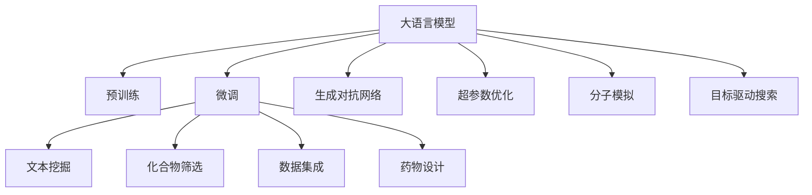

                 

# 药物发现加速器：LLM 助力研发

> 关键词：
> 药物发现, 大语言模型(LLM), 预训练, 自然语言处理(NLP), 深度学习, 生物信息学, 生成对抗网络(GAN), 超参数优化, 分子模拟, 目标驱动搜索

## 1. 背景介绍

### 1.1 问题由来
药物发现是生物医药研发的重要组成部分，其核心目标是通过筛选大量化合物，找到潜在的药物分子，进而开发出有效的药物。传统药物发现流程通常包括多个阶段，如靶点确定、化合物库构建、化合物筛选、先导化合物优化等，周期长、成本高，且易受个人经验影响。近年来，随着人工智能和大数据技术的迅猛发展，通过计算化学和机器学习的方法，能够从海量化合物数据中挖掘出潜在药物分子，极大地缩短研发周期，降低成本。

药物发现中，自然语言处理(NLP)技术的应用尤为关键。药物分子由一系列化学元素组成，其描述和理解通常以文本形式呈现，因此对文本数据的处理和分析成为药物发现中的重要环节。传统方法依赖专家经验对文本进行特征提取和分析，过程繁琐且精度受限。而大语言模型(LLM)的出现，为药物发现提供了新的解决思路，可以通过自然语言理解能力，自动化处理和分析文本数据，推动药物发现向智能化、自动化方向发展。

### 1.2 问题核心关键点
大语言模型通过预训练学习通用语言知识，能够理解和生成复杂的文本，包括药物描述、研究论文、临床报告等。通过微调，LLM可以针对特定的药物发现任务，提升其文本处理和分析能力。具体来说，药物发现中，LLM可以用于以下几个方面：

- **文本挖掘与信息提取**：从药物文献、化合物描述等文本中提取关键信息，如化学结构、生物活性、药物靶点等。
- **化合物筛选与优化**：通过分析文本数据，筛选出有潜力的药物分子，并进行结构优化。
- **数据集成与知识图谱构建**：整合散落在不同文本中的药物信息，构建统一的药物知识图谱。
- **药物设计**：根据已有数据，生成新的化合物结构，进行分子模拟和药物设计。

以下将详细探讨LLM在药物发现中的具体应用，包括文本挖掘、化合物筛选、数据集成和药物设计等。

## 2. 核心概念与联系

### 2.1 核心概念概述

在进行药物发现中，需要理解以下核心概念及其相互联系：

- **大语言模型(LLM)**：以自回归模型为代表的大型预训练语言模型，通过在大规模无标签文本语料上进行预训练，学习语言的通用表示。
- **预训练**：在无标签文本数据上，通过自监督学习任务训练通用语言模型的过程。常见的预训练任务包括自编码、掩码语言模型等。
- **微调(Fine-tuning)**：在预训练模型的基础上，使用下游任务的少量标注数据，通过有监督学习优化模型在该任务上的性能。
- **自然语言处理(NLP)**：计算机科学、人工智能和语言学的交叉学科，研究如何让计算机能够理解和处理人类语言。
- **生成对抗网络(GAN)**：一种生成模型，由生成器和判别器两部分组成，用于生成逼真的数据。
- **超参数优化**：通过算法调整模型超参数，寻找最佳模型配置，提升模型性能。
- **分子模拟**：通过计算方法模拟分子在化学反应和生理环境中的行为，预测药物分子活性。
- **目标驱动搜索**：利用算法在搜索空间中寻找最优解，应用于药物设计。

这些核心概念之间的逻辑关系可以通过以下Mermaid流程图来展示：



这个流程图展示了大语言模型在药物发现中的核心概念及其应用关系：

1. 大语言模型通过预训练获得基础能力。
2. 微调提升模型在特定药物发现任务上的性能。
3. 文本挖掘、化合物筛选、数据集成、药物设计等技术，在大模型的辅助下，提升药物发现效率。
4. GAN、超参数优化、分子模拟、目标驱动搜索等技术，进一步优化模型，提高药物发现效果。

## 3. 核心算法原理 & 具体操作步骤
### 3.1 算法原理概述

基于大语言模型的药物发现加速器，其核心原理是将LLM作为药物发现任务的强大工具，通过微调，使其在特定的药物发现任务上具备更好的处理能力。其关键步骤如下：

1. **准备预训练模型和数据集**：选择合适的预训练语言模型作为初始化参数，收集相关的药物文本数据。
2. **定义任务适配层**：根据药物发现任务，设计合适的输出层和损失函数。
3. **设置微调超参数**：选择合适的优化算法及其参数，如AdamW、SGD等，设置学习率、批大小、迭代轮数等。
4. **执行梯度训练**：将训练集数据分批次输入模型，前向传播计算损失函数。反向传播计算参数梯度，根据设定的优化算法和学习率更新模型参数。
5. **测试和部署**：在测试集上评估微调后模型，对比微调前后的性能提升。使用微调后的模型对新化合物进行分析和筛选。

### 3.2 算法步骤详解

**Step 1: 准备预训练模型和数据集**

- **选择预训练模型**：根据任务的复杂度和数据规模，选择合适的预训练语言模型，如BERT、GPT系列等。
- **数据准备**：收集药物发现相关的文本数据，包括化合物描述、临床研究、药物靶点等。处理数据，将其转换为模型输入格式。

**Step 2: 定义任务适配层**

- **输出层设计**：对于文本挖掘、化合物筛选等任务，输出层一般使用线性分类器，如sigmoid、softmax等。对于药物设计，可能需要使用生成对抗网络(GAN)来生成新的化合物结构。
- **损失函数设计**：根据输出层的类型，选择合适的损失函数。例如，对于分类任务，可以使用交叉熵损失；对于生成任务，可以使用均方误差损失等。

**Step 3: 设置微调超参数**

- **优化器选择**：选择合适的优化器，如AdamW、SGD等，设置学习率、批大小、迭代轮数等超参数。
- **正则化技术**：应用L2正则、Dropout、Early Stopping等技术，防止模型过度适应小规模训练集。

**Step 4: 执行梯度训练**

- **数据分批次处理**：将训练集数据分批次输入模型，前向传播计算损失函数。
- **反向传播和参数更新**：反向传播计算参数梯度，根据设定的优化算法和学习率更新模型参数。
- **验证集评估**：周期性在验证集上评估模型性能，根据性能指标决定是否触发Early Stopping。
- **重复迭代**：重复上述步骤直至满足预设的迭代轮数或Early Stopping条件。

**Step 5: 测试和部署**

- **测试集评估**：在测试集上评估微调后模型的性能，对比微调前后的精度提升。
- **新化合物分析**：使用微调后的模型对新化合物进行分析和筛选，提供潜在的药物分子。
- **持续优化**：根据测试结果和反馈，调整模型参数，继续优化模型性能。

### 3.3 算法优缺点

基于大语言模型的药物发现方法具有以下优点：

- **高效处理文本数据**：LLM能够处理大规模文本数据，从中挖掘出有用的信息，提高药物发现的效率。
- **适应性广**：适用于多种药物发现任务，如化合物筛选、药物设计、数据集成等。
- **预测能力强**：通过微调，LLM可以提升在特定任务上的预测能力，提高药物发现的效果。

同时，该方法也存在一些局限性：

- **对数据质量要求高**：微调效果依赖于高质量的标注数据，获取高品质的药物数据成本较高。
- **模型复杂度高**：预训练模型和微调模型需要较大的计算资源和存储空间。
- **解释性不足**：模型的决策过程难以解释，缺乏透明度。

尽管存在这些局限性，但就目前而言，基于大语言模型的药物发现方法仍是一种高效、有效的药物研发手段，在实际应用中得到了广泛应用。

### 3.4 算法应用领域

大语言模型在药物发现中的应用领域广泛，具体包括：

- **化合物筛选**：从大量化合物中筛选出具有潜在活性的药物分子，提高药物研发的成功率。
- **药物设计**：基于已有数据，生成新的化合物结构，进行分子模拟和药物设计。
- **文本挖掘与信息提取**：从药物文献、化合物描述等文本中提取关键信息，如化学结构、生物活性、药物靶点等。
- **数据集成与知识图谱构建**：整合散落在不同文本中的药物信息，构建统一的药物知识图谱，辅助药物研究。

除了上述这些应用外，大语言模型还应用于药物代谢预测、副作用分析、临床试验设计等药物发现流程的各个环节，极大地推动了药物研发的智能化进程。

## 4. 数学模型和公式 & 详细讲解 & 举例说明

### 4.1 数学模型构建

假设预训练语言模型为 $M_{\theta}:\mathcal{X} \rightarrow \mathcal{Y}$，其中 $\mathcal{X}$ 为输入空间，$\mathcal{Y}$ 为输出空间，$\theta \in \mathbb{R}^d$ 为模型参数。假设微调任务的训练集为 $D=\{(x_i,y_i)\}_{i=1}^N, x_i \in \mathcal{X}, y_i \in \mathcal{Y}$。

定义模型 $M_{\theta}$ 在数据样本 $(x,y)$ 上的损失函数为 $\ell(M_{\theta}(x),y)$，则在数据集 $D$ 上的经验风险为：

$$
\mathcal{L}(\theta) = \frac{1}{N} \sum_{i=1}^N \ell(M_{\theta}(x_i),y_i)
$$

微调的优化目标是最小化经验风险，即找到最优参数：

$$
\theta^* = \mathop{\arg\min}_{\theta} \mathcal{L}(\theta)
$$

在实践中，我们通常使用基于梯度的优化算法（如SGD、Adam等）来近似求解上述最优化问题。设 $\eta$ 为学习率，$\lambda$ 为正则化系数，则参数的更新公式为：

$$
\theta \leftarrow \theta - \eta \nabla_{\theta}\mathcal{L}(\theta) - \eta\lambda\theta
$$

其中 $\nabla_{\theta}\mathcal{L}(\theta)$ 为损失函数对参数 $\theta$ 的梯度，可通过反向传播算法高效计算。

### 4.2 公式推导过程

以下我们以化合物筛选任务为例，推导交叉熵损失函数及其梯度的计算公式。

假设模型 $M_{\theta}$ 在输入 $x$ 上的输出为 $\hat{y}=M_{\theta}(x) \in [0,1]$，表示样本属于正类的概率。真实标签 $y \in \{0,1\}$。则二分类交叉熵损失函数定义为：

$$
\ell(M_{\theta}(x),y) = -[y\log \hat{y} + (1-y)\log (1-\hat{y})]
$$

将其代入经验风险公式，得：

$$
\mathcal{L}(\theta) = -\frac{1}{N}\sum_{i=1}^N [y_i\log M_{\theta}(x_i)+(1-y_i)\log(1-M_{\theta}(x_i))]
$$

根据链式法则，损失函数对参数 $\theta_k$ 的梯度为：

$$
\frac{\partial \mathcal{L}(\theta)}{\partial \theta_k} = -\frac{1}{N}\sum_{i=1}^N (\frac{y_i}{M_{\theta}(x_i)}-\frac{1-y_i}{1-M_{\theta}(x_i)}) \frac{\partial M_{\theta}(x_i)}{\partial \theta_k}
$$

其中 $\frac{\partial M_{\theta}(x_i)}{\partial \theta_k}$ 可进一步递归展开，利用自动微分技术完成计算。

在得到损失函数的梯度后，即可带入参数更新公式，完成模型的迭代优化。重复上述过程直至收敛，最终得到适应药物发现任务的最优模型参数 $\theta^*$。

## 5. 项目实践：代码实例和详细解释说明

### 5.1 开发环境搭建

在进行药物发现中，我们需要准备好开发环境。以下是使用Python进行PyTorch开发的环境配置流程：

1. 安装Anaconda：从官网下载并安装Anaconda，用于创建独立的Python环境。

2. 创建并激活虚拟环境：
```bash
conda create -n pytorch-env python=3.8 
conda activate pytorch-env
```

3. 安装PyTorch：根据CUDA版本，从官网获取对应的安装命令。例如：
```bash
conda install pytorch torchvision torchaudio cudatoolkit=11.1 -c pytorch -c conda-forge
```

4. 安装Transformers库：
```bash
pip install transformers
```

5. 安装各类工具包：
```bash
pip install numpy pandas scikit-learn matplotlib tqdm jupyter notebook ipython
```

完成上述步骤后，即可在`pytorch-env`环境中开始药物发现实践。

### 5.2 源代码详细实现

下面我们以化合物筛选任务为例，给出使用Transformers库对BERT模型进行微调的PyTorch代码实现。

首先，定义化合物筛选任务的数学模型：

```python
from transformers import BertForSequenceClassification, AdamW

class DrugClassificationDataset(Dataset):
    def __init__(self, compounds, labels, tokenizer, max_len=128):
        self.compounds = compounds
        self.labels = labels
        self.tokenizer = tokenizer
        self.max_len = max_len
        
    def __len__(self):
        return len(self.compounds)
    
    def __getitem__(self, item):
        compound = self.compounds[item]
        label = self.labels[item]
        
        encoding = self.tokenizer(compound, return_tensors='pt', max_length=self.max_len, padding='max_length', truncation=True)
        input_ids = encoding['input_ids'][0]
        attention_mask = encoding['attention_mask'][0]
        
        # 对标签进行编码
        encoded_label = label2id[label] if label in label2id else 0
        labels = torch.tensor(encoded_label, dtype=torch.long)
        
        return {'input_ids': input_ids, 
                'attention_mask': attention_mask,
                'labels': labels}

# 标签与id的映射
label2id = {'active': 1, 'inactive': 0}
id2label = {v: k for k, v in label2id.items()}

# 创建dataset
tokenizer = BertTokenizer.from_pretrained('bert-base-cased')

train_dataset = DrugClassificationDataset(train_compounds, train_labels, tokenizer)
dev_dataset = DrugClassificationDataset(dev_compounds, dev_labels, tokenizer)
test_dataset = DrugClassificationDataset(test_compounds, test_labels, tokenizer)
```

然后，定义模型和优化器：

```python
model = BertForSequenceClassification.from_pretrained('bert-base-cased', num_labels=len(label2id))

optimizer = AdamW(model.parameters(), lr=2e-5)
```

接着，定义训练和评估函数：

```python
from torch.utils.data import DataLoader
from tqdm import tqdm
from sklearn.metrics import classification_report

device = torch.device('cuda') if torch.cuda.is_available() else torch.device('cpu')
model.to(device)

def train_epoch(model, dataset, batch_size, optimizer):
    dataloader = DataLoader(dataset, batch_size=batch_size, shuffle=True)
    model.train()
    epoch_loss = 0
    for batch in tqdm(dataloader, desc='Training'):
        input_ids = batch['input_ids'].to(device)
        attention_mask = batch['attention_mask'].to(device)
        labels = batch['labels'].to(device)
        model.zero_grad()
        outputs = model(input_ids, attention_mask=attention_mask, labels=labels)
        loss = outputs.loss
        epoch_loss += loss.item()
        loss.backward()
        optimizer.step()
    return epoch_loss / len(dataloader)

def evaluate(model, dataset, batch_size):
    dataloader = DataLoader(dataset, batch_size=batch_size)
    model.eval()
    preds, labels = [], []
    with torch.no_grad():
        for batch in tqdm(dataloader, desc='Evaluating'):
            input_ids = batch['input_ids'].to(device)
            attention_mask = batch['attention_mask'].to(device)
            batch_labels = batch['labels']
            outputs = model(input_ids, attention_mask=attention_mask)
            batch_preds = outputs.logits.argmax(dim=2).to('cpu').tolist()
            batch_labels = batch_labels.to('cpu').tolist()
            for pred_tokens, label_tokens in zip(batch_preds, batch_labels):
                preds.append(pred_tokens[:len(label_tokens)])
                labels.append(label_tokens)
                
    print(classification_report(labels, preds))
```

最后，启动训练流程并在测试集上评估：

```python
epochs = 5
batch_size = 16

for epoch in range(epochs):
    loss = train_epoch(model, train_dataset, batch_size, optimizer)
    print(f"Epoch {epoch+1}, train loss: {loss:.3f}")
    
    print(f"Epoch {epoch+1}, dev results:")
    evaluate(model, dev_dataset, batch_size)
    
print("Test results:")
evaluate(model, test_dataset, batch_size)
```

以上就是使用PyTorch对BERT进行化合物筛选任务微调的完整代码实现。可以看到，得益于Transformers库的强大封装，我们可以用相对简洁的代码完成BERT模型的加载和微调。

### 5.3 代码解读与分析

让我们再详细解读一下关键代码的实现细节：

**DrugClassificationDataset类**：
- `__init__`方法：初始化化合物、标签、分词器等关键组件。
- `__len__`方法：返回数据集的样本数量。
- `__getitem__`方法：对单个样本进行处理，将化合物输入编码为token ids，将标签编码为数字，并对其进行定长padding，最终返回模型所需的输入。

**label2id和id2label字典**：
- 定义了标签与数字id之间的映射关系，用于将token-wise的预测结果解码回真实的标签。

**训练和评估函数**：
- 使用PyTorch的DataLoader对数据集进行批次化加载，供模型训练和推理使用。
- 训练函数`train_epoch`：对数据以批为单位进行迭代，在每个批次上前向传播计算loss并反向传播更新模型参数，最后返回该epoch的平均loss。
- 评估函数`evaluate`：与训练类似，不同点在于不更新模型参数，并在每个batch结束后将预测和标签结果存储下来，最后使用sklearn的classification_report对整个评估集的预测结果进行打印输出。

**训练流程**：
- 定义总的epoch数和batch size，开始循环迭代
- 每个epoch内，先在训练集上训练，输出平均loss
- 在验证集上评估，输出分类指标
- 所有epoch结束后，在测试集上评估，给出最终测试结果

可以看到，PyTorch配合Transformers库使得BERT微调的代码实现变得简洁高效。开发者可以将更多精力放在数据处理、模型改进等高层逻辑上，而不必过多关注底层的实现细节。

当然，工业级的系统实现还需考虑更多因素，如模型的保存和部署、超参数的自动搜索、更灵活的任务适配层等。但核心的微调范式基本与此类似。

## 6. 实际应用场景
### 6.1 智能药物设计

基于大语言模型的药物设计技术，能够从已有数据中生成新的化合物结构，预测其活性和效果。智能药物设计将传统的经验驱动设计，转变为数据驱动和智能化的设计流程，大幅提升了药物研发的效率和成功率。

在技术实现上，可以收集已知的药物化合物数据和研究论文，通过自然语言处理技术提取关键信息，如化合物结构、活性、副作用等。在此基础上对预训练语言模型进行微调，使其具备自动生成新化合物结构的能力。微调后的模型能够根据已有数据，自动推断并生成新的化合物结构，并进行分子模拟和药物设计，进一步优化筛选，快速发现潜在的药物分子。

### 6.2 药物代谢预测

药物在体内的代谢过程，对药效和副作用有重要影响。传统药物代谢预测依赖复杂的生化模型和实验数据，过程繁琐且成本高。而基于大语言模型的药物代谢预测技术，能够通过分析药物描述和临床数据，预测药物在体内的代谢行为。

在实践中，可以收集药物研究论文、临床试验报告等文本数据，通过自然语言处理技术提取药物代谢相关的信息。在此基础上对预训练语言模型进行微调，使其具备预测药物代谢能力。微调后的模型能够根据药物描述，自动推断并预测药物在体内的代谢途径和速率，为药物设计和临床试验提供重要参考。

### 6.3 副作用分析

药物的副作用往往是导致药物失效甚至伤害的重要原因。传统副作用分析依赖专家经验和大量实验数据，过程繁琐且结果受限。而基于大语言模型的副作用分析技术，能够通过分析药物描述和临床数据，自动识别药物的副作用。

在实践中，可以收集药物研究论文、临床试验报告等文本数据，通过自然语言处理技术提取药物副作用相关的信息。在此基础上对预训练语言模型进行微调，使其具备识别药物副作用的能力。微调后的模型能够根据药物描述，自动推断并识别药物的副作用，为药物研发和临床应用提供重要参考。

### 6.4 未来应用展望

随着大语言模型和微调方法的不断发展，基于微调范式将在更多领域得到应用，为药物研发带来变革性影响。

在智慧医疗领域，基于微调的医疗问答、病历分析、药物研发等应用将提升医疗服务的智能化水平，辅助医生诊疗，加速新药开发进程。

在智能教育领域，微调技术可应用于作业批改、学情分析、知识推荐等方面，因材施教，促进教育公平，提高教学质量。

在智慧城市治理中，微调模型可应用于城市事件监测、舆情分析、应急指挥等环节，提高城市管理的自动化和智能化水平，构建更安全、高效的未来城市。

此外，在企业生产、社会治理、文娱传媒等众多领域，基于大模型微调的人工智能应用也将不断涌现，为经济社会发展注入新的动力。相信随着技术的日益成熟，微调方法将成为药物研发的重要范式，推动药物研发向更加智能化、自动化方向发展。

## 7. 工具和资源推荐
### 7.1 学习资源推荐

为了帮助开发者系统掌握大语言模型微调的理论基础和实践技巧，这里推荐一些优质的学习资源：

1. 《Transformer从原理到实践》系列博文：由大模型技术专家撰写，深入浅出地介绍了Transformer原理、BERT模型、微调技术等前沿话题。

2. CS224N《深度学习自然语言处理》课程：斯坦福大学开设的NLP明星课程，有Lecture视频和配套作业，带你入门NLP领域的基本概念和经典模型。

3. 《Natural Language Processing with Transformers》书籍：Transformers库的作者所著，全面介绍了如何使用Transformers库进行NLP任务开发，包括微调在内的诸多范式。

4. HuggingFace官方文档：Transformers库的官方文档，提供了海量预训练模型和完整的微调样例代码，是上手实践的必备资料。

5. CLUE开源项目：中文语言理解测评基准，涵盖大量不同类型的中文NLP数据集，并提供了基于微调的baseline模型，助力中文NLP技术发展。

通过对这些资源的学习实践，相信你一定能够快速掌握大语言模型微调的精髓，并用于解决实际的药物发现问题。
### 7.2 开发工具推荐

高效的开发离不开优秀的工具支持。以下是几款用于大语言模型微调开发的常用工具：

1. PyTorch：基于Python的开源深度学习框架，灵活动态的计算图，适合快速迭代研究。大部分预训练语言模型都有PyTorch版本的实现。

2. TensorFlow：由Google主导开发的开源深度学习框架，生产部署方便，适合大规模工程应用。同样有丰富的预训练语言模型资源。

3. Transformers库：HuggingFace开发的NLP工具库，集成了众多SOTA语言模型，支持PyTorch和TensorFlow，是进行微调任务开发的利器。

4. Weights & Biases：模型训练的实验跟踪工具，可以记录和可视化模型训练过程中的各项指标，方便对比和调优。与主流深度学习框架无缝集成。

5. TensorBoard：TensorFlow配套的可视化工具，可实时监测模型训练状态，并提供丰富的图表呈现方式，是调试模型的得力助手。

6. Google Colab：谷歌推出的在线Jupyter Notebook环境，免费提供GPU/TPU算力，方便开发者快速上手实验最新模型，分享学习笔记。

合理利用这些工具，可以显著提升大语言模型微调任务的开发效率，加快创新迭代的步伐。

### 7.3 相关论文推荐

大语言模型和微调技术的发展源于学界的持续研究。以下是几篇奠基性的相关论文，推荐阅读：

1. Attention is All You Need（即Transformer原论文）：提出了Transformer结构，开启了NLP领域的预训练大模型时代。

2. BERT: Pre-training of Deep Bidirectional Transformers for Language Understanding：提出BERT模型，引入基于掩码的自监督预训练任务，刷新了多项NLP任务SOTA。

3. Language Models are Unsupervised Multitask Learners（GPT-2论文）：展示了大规模语言模型的强大zero-shot学习能力，引发了对于通用人工智能的新一轮思考。

4. Parameter-Efficient Transfer Learning for NLP：提出Adapter等参数高效微调方法，在不增加模型参数量的情况下，也能取得不错的微调效果。

5. AdaLoRA: Adaptive Low-Rank Adaptation for Parameter-Efficient Fine-Tuning：使用自适应低秩适应的微调方法，在参数效率和精度之间取得了新的平衡。

6. PEGASUS: Pre-training with Extractive and Generative Summarization for Abstractive Summarization：通过预训练和微调，实现了高效的摘要生成任务。

这些论文代表了大语言模型微调技术的发展脉络。通过学习这些前沿成果，可以帮助研究者把握学科前进方向，激发更多的创新灵感。

## 8. 总结：未来发展趋势与挑战

### 8.1 总结

本文对基于大语言模型的药物发现加速器方法进行了全面系统的介绍。首先阐述了大语言模型和微调技术的研究背景和意义，明确了微调在药物发现任务中的重要价值。其次，从原理到实践，详细讲解了微调的数学原理和关键步骤，给出了药物发现任务开发的完整代码实例。同时，本文还广泛探讨了微调方法在智能药物设计、药物代谢预测、副作用分析等多个药物发现流程的各个环节中的应用前景，展示了微调范式的巨大潜力。此外，本文精选了微调技术的各类学习资源，力求为读者提供全方位的技术指引。

通过本文的系统梳理，可以看到，基于大语言模型的药物发现加速器方法正在成为药物发现任务的重要范式，极大地推动了药物研发向智能化、自动化方向发展。未来，伴随大语言模型和微调方法的持续演进，相信药物发现技术将迎来更多的突破，为人类健康事业带来更大的福祉。

### 8.2 未来发展趋势

展望未来，大语言模型微调技术将呈现以下几个发展趋势：

1. 模型规模持续增大。随着算力成本的下降和数据规模的扩张，预训练语言模型的参数量还将持续增长。超大规模语言模型蕴含的丰富语言知识，有望支撑更加复杂多变的药物发现任务。

2. 微调方法日趋多样。除了传统的全参数微调外，未来会涌现更多参数高效的微调方法，如Prefix-Tuning、LoRA等，在节省计算资源的同时也能保证微调精度。

3. 持续学习成为常态。随着数据分布的不断变化，微调模型也需要持续学习新知识以保持性能。如何在不遗忘原有知识的同时，高效吸收新样本信息，将成为重要的研究课题。

4. 标注样本需求降低。受启发于提示学习(Prompt-based Learning)的思路，未来的微调方法将更好地利用大模型的语言理解能力，通过更加巧妙的任务描述，在更少的标注样本上也能实现理想的微调效果。

5. 模型通用性增强。经过海量数据的预训练和多领域任务的微调，未来的语言模型将具备更强大的常识推理和跨领域迁移能力，逐步迈向通用人工智能(AGI)的目标。

以上趋势凸显了大语言模型微调技术的广阔前景。这些方向的探索发展，必将进一步提升药物发现的效率和成功率，为人类健康事业带来更大的福祉。

### 8.3 面临的挑战

尽管大语言模型微调技术已经取得了瞩目成就，但在迈向更加智能化、普适化应用的过程中，它仍面临着诸多挑战：

1. 标注成本瓶颈。虽然微调大大降低了标注数据的需求，但对于长尾应用场景，难以获得充足的高质量标注数据，成为制约微调性能的瓶颈。如何进一步降低微调对标注样本的依赖，将是一大难题。

2. 模型鲁棒性不足。当前微调模型面对域外数据时，泛化性能往往大打折扣。对于测试样本的微小扰动，微调模型的预测也容易发生波动。如何提高微调模型的鲁棒性，避免灾难性遗忘，还需要更多理论和实践的积累。

3. 推理效率有待提高。大规模语言模型虽然精度高，但在实际部署时往往面临推理速度慢、内存占用大等效率问题。如何在保证性能的同时，简化模型结构，提升推理速度，优化资源占用，将是重要的优化方向。

4. 可解释性亟需加强。当前微调模型更像是"黑盒"系统，难以解释其内部工作机制和决策逻辑。对于医疗、金融等高风险应用，算法的可解释性和可审计性尤为重要。如何赋予微调模型更强的可解释性，将是亟待攻克的难题。

5. 安全性有待保障。预训练语言模型难免会学习到有偏见、有害的信息，通过微调传递到下游任务，产生误导性、歧视性的输出，给实际应用带来安全隐患。如何从数据和算法层面消除模型偏见，避免恶意用途，确保输出的安全性，也将是重要的研究课题。

6. 知识整合能力不足。现有的微调模型往往局限于任务内数据，难以灵活吸收和运用更广泛的先验知识。如何让微调过程更好地与外部知识库、规则库等专家知识结合，形成更加全面、准确的信息整合能力，还有很大的想象空间。

正视微调面临的这些挑战，积极应对并寻求突破，将是大语言模型微调走向成熟的必由之路。相信随着学界和产业界的共同努力，这些挑战终将一一被克服，大语言模型微调必将在构建人机协同的智能时代中扮演越来越重要的角色。

### 8.4 研究展望

面对大语言模型微调所面临的种种挑战，未来的研究需要在以下几个方面寻求新的突破：

1. 探索无监督和半监督微调方法。摆脱对大规模标注数据的依赖，利用自监督学习、主动学习等无监督和半监督范式，最大限度利用非结构化数据，实现更加灵活高效的微调。

2. 研究参数高效和计算高效的微调范式。开发更加参数高效的微调方法，在固定大部分预训练参数的同时，只更新极少量的任务相关参数。同时优化微调模型的计算图，减少前向传播和反向传播的资源消耗，实现更加轻量级、实时性的部署。

3. 融合因果和对比学习范式。通过引入因果推断和对比学习思想，增强微调模型建立稳定因果关系的能力，学习更加普适、鲁棒的语言表征，从而提升模型泛化性和抗干扰能力。

4. 引入更多先验知识。将符号化的先验知识，如知识图谱、逻辑规则等，与神经网络模型进行巧妙融合，引导微调过程学习更准确、合理的语言模型。同时加强不同模态数据的整合，实现视觉、语音等多模态信息与文本信息的协同建模。

5. 结合因果分析和博弈论工具。将因果分析方法引入微调模型，识别出模型决策的关键特征，增强输出解释的因果性和逻辑性。借助博弈论工具刻画人机交互过程，主动探索并规避模型的脆弱点，提高系统稳定性。

6. 纳入伦理道德约束。在模型训练目标中引入伦理导向的评估指标，过滤和惩罚有偏见、有害的输出倾向。同时加强人工干预和审核，建立模型行为的监管机制，确保输出符合人类价值观和伦理道德。

这些研究方向的探索，必将引领大语言模型微调技术迈向更高的台阶，为构建安全、可靠、可解释、可控的智能系统铺平道路。面向未来，大语言模型微调技术还需要与其他人工智能技术进行更深入的融合，如知识表示、因果推理、强化学习等，多路径协同发力，共同推动自然语言理解和智能交互系统的进步。只有勇于创新、敢于突破，才能不断拓展语言模型的边界，让智能技术更好地造福人类社会。

## 9. 附录：常见问题与解答

**Q1：大语言模型微调是否适用于所有药物发现任务？**

A: 大语言模型微调在大多数药物发现任务上都能取得不错的效果，特别是对于数据量较小的任务。但对于一些特定领域的任务，如医学、法律等，仅仅依靠通用语料预训练的模型可能难以很好地适应。此时需要在特定领域语料上进一步预训练，再进行微调，才能获得理想效果。此外，对于一些需要时效性、个性化很强的任务，如对话、推荐等，微调方法也需要针对性的改进优化。

**Q2：微调过程中如何选择合适的学习率？**

A: 微调的学习率一般要比预训练时小1-2个数量级，如果使用过大的学习率，容易破坏预训练权重，导致过拟合。一般建议从1e-5开始调参，逐步减小学习率，直至收敛。也可以使用warmup策略，在开始阶段使用较小的学习率，再逐渐过渡到预设值。需要注意的是，不同的优化器(如AdamW、Adafactor等)以及不同的学习率调度策略，可能需要设置不同的学习率阈值。

**Q3：采用大模型微调时会面临哪些资源瓶颈？**

A: 目前主流的预训练大模型动辄以亿计的参数规模，对算力、内存、存储都提出了很高的要求。GPU/TPU等高性能设备是必不可少的，但即便如此，超大批次的训练和推理也可能遇到显存不足的问题。因此需要采用一些资源优化技术，如梯度积累、混合精度训练、模型并行等，来突破硬件瓶颈。同时，模型的存储和读取也可能占用大量时间和空间，需要采用模型压缩、稀疏化存储等方法进行优化。

**Q4：如何缓解微调过程中的过拟合问题？**

A: 过拟合是微调面临的主要挑战，尤其是在标注数据不足的情况下。常见的缓解策略包括：
1. 数据增强：通过回译、近义替换等方式扩充训练集
2. 正则化技术：使用L2正则、Dropout、Early Stopping等防止模型过度适应小规模训练集
3. 对抗训练：引入对抗样本，提高模型鲁棒性
4. 参数高效微调：只调整少量参数(如Adapter、Prefix等)，减小过拟合风险
5. 多模型集成：训练多个微调模型，取平均输出，抑制过拟合

这些策略往往需要根据具体任务和数据特点进行灵活组合。只有在数据、模型、训练、推理等各环节进行全面优化，才能最大限度地发挥大模型微调的威力。

**Q5：微调模型在落地部署时需要注意哪些问题？**

A: 将微调模型转化为实际应用，还需要考虑以下因素：
1. 模型裁剪：去除不必要的层和参数，减小模型尺寸，加快推理速度
2. 量化加速：将浮点模型转为定点模型，压缩存储空间，提高计算效率
3. 服务化封装：将模型封装为标准化服务接口，便于集成调用
4. 弹性伸缩：根据请求流量动态调整资源配置，平衡服务质量和成本
5. 监控告警：实时采集系统指标，设置异常告警阈值，确保服务稳定性
6. 安全防护：采用访问鉴权、数据脱敏等措施，保障数据和模型安全

大语言模型微调为药物发现提供了强大的技术支持，但如何将强大的性能转化为稳定、高效、安全的业务价值，还需要工程实践的不断打磨。唯有从数据、算法、工程、业务等多个维度协同发力，才能真正实现人工智能技术在垂直行业的规模化落地。总之，微调需要开发者根据具体任务，不断迭代和优化模型、数据和算法，方能得到理想的效果。

---

作者：禅与计算机程序设计艺术 / Zen and the Art of Computer Programming

