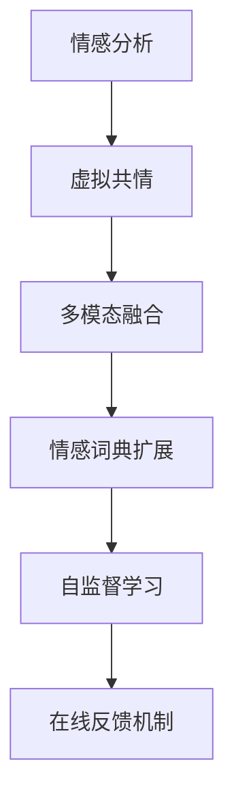

                 

# 虚拟共情训练营：AI增强的情感理解课程

> 关键词：情感分析, 自然语言处理, 虚拟共情, AI增强, 情感理解课程

## 1. 背景介绍

### 1.1 问题由来

随着人工智能技术的不断进步，情感分析在自然语言处理（NLP）领域得到了广泛应用。从社交媒体情感分析、品牌舆情监测到客服对话情感识别，情感分析已经成为企业和社会获取用户情感信息、改进服务质量的重要工具。

然而，传统的情感分析方法往往依赖于大量的标注数据和手工规则设计，难以捕捉到复杂的情感表达和细微情感变化。此外，手工规则难以全面覆盖不同的情感表达方式，导致情感识别精度受限。

为了克服这些挑战，近年来基于深度学习的情感分析方法逐渐崭露头角。这些方法能够从大规模未标注数据中自动学习情感表示，通过丰富的上下文信息捕捉情感特征，从而显著提升了情感分析的精度和泛化能力。

但即便如此，情感分析仍面临一些难题：

1. **数据稀缺**：情感标注数据通常稀缺，难以覆盖所有情感表达方式，尤其是罕见情感。
2. **上下文依赖**：情感表达通常依赖于上下文，单一句子难以完全表达复杂情感。
3. **多义性**：自然语言的多义性使得情感识别更加复杂，需要结合上下文和领域知识进行综合判断。
4. **主观性**：情感表达高度主观，难以建立统一的情感词典或规则。

为了解决这些问题，本文提出了一种基于虚拟共情（Virtual Empathy）的情感分析方法。该方法通过增强模型的共情能力，使其能够更好地理解用户情感，从而提升情感分析的效果。

### 1.2 问题核心关键点

虚拟共情方法的核心在于通过引入情感共情机制，增强模型对情感的理解和表达能力。具体来说，该方法包括以下几个关键点：

- **虚拟共情机制**：通过生成虚拟情境，使模型模拟人类的情感体验，从而理解文本中的情感表达。
- **多模态融合**：结合文本、语音、图像等多模态信息，增强情感分析的全面性和准确性。
- **情感词典扩展**：利用多源情感词典和情感上下文，扩展情感词典，提升情感识别的细粒度。
- **自监督学习**：利用自监督学习技术，从大量无标注数据中学习情感表示，提高情感分析的泛化能力。
- **在线反馈机制**：通过用户反馈调整模型参数，不断优化情感识别效果。

这些关键点共同构成了一个完整的情感分析框架，使得模型能够更好地理解用户情感，从而提升情感分析的精度和应用效果。

## 2. 核心概念与联系

### 2.1 核心概念概述

为更好地理解虚拟共情情感分析方法，本节将介绍几个密切相关的核心概念：

- **情感分析**：指从文本中识别和提取情感信息，并对其进行分类或量化的过程。常用的分类任务包括正面情感、负面情感和中性情感。
- **虚拟共情**：指通过模拟人类的情感体验，理解文本中的情感表达。通过生成虚拟情境，模型可以更好地理解情感的细微变化和复杂表达。
- **多模态融合**：指结合文本、语音、图像等多种信息源，增强情感分析的全面性和准确性。多模态信息能够提供更加丰富的上下文信息，帮助模型理解复杂的情感表达。
- **情感词典**：指包含情感词及其情感极性（正面或负面）的词典，用于辅助情感分析。情感词典的扩展和更新是提升情感分析精度的关键。
- **自监督学习**：指在没有监督信号的情况下，通过学习数据的内部结构，从无标注数据中学习模型的表示。自监督学习能够提高情感分析的泛化能力，减少对标注数据的依赖。
- **在线反馈机制**：指在实际应用中，通过用户反馈调整模型参数，不断优化情感分析效果。在线反馈机制能够增强模型的适应性，提升其在实际场景中的表现。

这些核心概念之间的逻辑关系可以通过以下Mermaid流程图来展示：



这个流程图展示了大语言模型的情感分析流程：

1. 首先，情感分析模型对输入文本进行情感识别，判断其情感类别。
2. 接着，虚拟共情机制生成虚拟情境，使模型理解文本中的情感表达。
3. 然后，多模态融合模块结合文本、语音、图像等多种信息源，增强情感分析的全面性和准确性。
4. 接着，情感词典扩展模块利用多源情感词典和情感上下文，扩展情感词典，提升情感识别的细粒度。
5. 最后，自监督学习模块从大量无标注数据中学习情感表示，提高情感分析的泛化能力。
6. 在线反馈机制通过用户反馈调整模型参数，不断优化情感分析效果。

这些步骤共同构成了一个完整的情感分析框架，使得模型能够更好地理解用户情感，从而提升情感分析的精度和应用效果。

## 3. 核心算法原理 & 具体操作步骤
### 3.1 算法原理概述

虚拟共情情感分析方法的核心在于通过增强模型的共情能力，使其能够更好地理解用户情感。具体来说，该方法利用生成对抗网络（GAN）生成虚拟情境，使模型模拟人类的情感体验，从而理解文本中的情感表达。

形式化地，假设情感分析模型为 $M_{\theta}$，其中 $\theta$ 为模型参数。给定输入文本 $x$，虚拟共情方法的目标是找到最优参数 $\hat{\theta}$，使得模型输出的情感分类结果与真实情感标签尽可能接近。

虚拟共情情感分析方法包括以下几个关键步骤：

1. **虚拟情境生成**：通过生成对抗网络（GAN）生成虚拟情境，模拟人类的情感体验。
2. **情感共情理解**：利用虚拟情境增强模型的情感共情能力，理解文本中的情感表达。
3. **多模态融合**：结合文本、语音、图像等多种信息源，增强情感分析的全面性和准确性。
4. **情感词典扩展**：利用多源情感词典和情感上下文，扩展情感词典，提升情感识别的细粒度。
5. **自监督学习**：从大量无标注数据中学习情感表示，提高情感分析的泛化能力。
6. **在线反馈机制**：通过用户反馈调整模型参数，不断优化情感分析效果。

### 3.2 算法步骤详解

虚拟共情情感分析方法的详细步骤如下：

**Step 1: 准备数据集和预训练模型**
- 收集情感标注数据集 $D=\{(x_i, y_i)\}_{i=1}^N$，其中 $x_i$ 为输入文本，$y_i$ 为情感标签。
- 准备多源情感词典和多模态数据集，如语音转文本、图像标注等。
- 选择预训练语言模型 $M_{\theta}$，如BERT、GPT等。

**Step 2: 虚拟情境生成**
- 使用生成对抗网络（GAN）生成虚拟情境 $s$，作为模型的输入。
- 虚拟情境 $s$ 由多个子情境组成，每个子情境模拟一种特定的情感体验。

**Step 3: 情感共情理解**
- 将虚拟情境 $s$ 作为预训练模型的输入，输出情感表示 $h_s$。
- 利用多源情感词典和多模态信息，对情感表示 $h_s$ 进行扩展和细化。
- 通过自监督学习技术，从大量无标注数据中学习情感表示 $h_s$。

**Step 4: 多模态融合**
- 结合文本、语音、图像等多种信息源，进行多模态融合，增强情感分析的全面性和准确性。
- 通过Attention机制对不同模态信息进行加权融合，生成综合情感表示 $h_{fused}$。

**Step 5: 情感词典扩展**
- 利用多源情感词典和情感上下文，扩展情感词典，提升情感识别的细粒度。
- 将扩展后的情感词典与综合情感表示 $h_{fused}$ 进行融合，生成最终情感表示 $h_{final}$。

**Step 6: 在线反馈机制**
- 在实际应用中，通过用户反馈调整模型参数，不断优化情感分析效果。
- 利用在线反馈机制，对情感分析结果进行修正和优化，提升模型的适应性和准确性。

### 3.3 算法优缺点

虚拟共情情感分析方法具有以下优点：

1. **泛化能力强**：通过自监督学习技术，模型可以从大量无标注数据中学习情感表示，提升情感分析的泛化能力。
2. **情感理解精细**：利用多源情感词典和多模态信息，扩展情感词典，提升情感识别的细粒度。
3. **用户共情体验**：通过虚拟情境生成和情感共情理解，模型能够更好地理解用户的情感表达。
4. **在线优化能力**：通过在线反馈机制，模型能够根据用户反馈不断优化，提升情感分析的适应性和准确性。

同时，该方法也存在以下局限性：

1. **生成情境质量依赖**：虚拟情境生成质量直接影响情感分析效果，需要优化GAN模型的生成能力。
2. **计算资源消耗大**：虚拟情境生成和情感共情理解需要大量计算资源，模型训练和推理成本较高。
3. **用户反馈获取困难**：实际应用中，用户反馈难以获取，影响模型的在线优化效果。
4. **情感表达主观性强**：情感表达高度主观，难以建立统一的情感词典或规则。

尽管存在这些局限性，但虚拟共情情感分析方法仍是大语言模型情感分析的重要范式，能够显著提升模型对情感的理解和表达能力，为情感分析应用带来新的突破。

### 3.4 算法应用领域

虚拟共情情感分析方法在多个领域得到了广泛应用，包括但不限于：

- **社交媒体情感分析**：通过分析用户评论、帖子等文本数据，理解用户情感，改进社交媒体平台的用户体验。
- **品牌舆情监测**：通过分析用户对品牌的情感表达，评估品牌声誉，帮助企业进行市场决策。
- **客服对话情感识别**：通过分析客服对话，理解用户情感，改进客服服务质量，提升用户满意度。
- **情感健康分析**：通过分析用户的情感表达，识别心理健康问题，提供心理支持和治疗建议。
- **虚拟助手情感交互**：通过增强虚拟助手的共情能力，提升人机交互体验，构建更友好、更智能的虚拟助手系统。

这些应用场景展示了虚拟共情情感分析方法的强大潜力和广泛适用性，为NLP技术在实际场景中的应用提供了新的方向。

## 4. 数学模型和公式 & 详细讲解 & 举例说明

### 4.1 数学模型构建

本节将使用数学语言对虚拟共情情感分析方法进行更加严格的刻画。

假设情感分析模型为 $M_{\theta}$，输入文本 $x$，虚拟情境 $s$，输出情感表示 $h_s$。情感分类任务的目标是最小化交叉熵损失函数：

$$
\mathcal{L}(\theta) = -\frac{1}{N}\sum_{i=1}^N \sum_{j=1}^K y_{ij}\log(M_{\theta}(x_i,s_j))
$$

其中 $y_{ij}$ 为情感标签，$K$ 为情感类别数。

### 4.2 公式推导过程

以情感分类任务为例，推导交叉熵损失函数的计算公式。

假设模型 $M_{\theta}$ 在输入 $(x,s)$ 上的输出为 $\hat{y}=M_{\theta}(x,s)$，表示情感分类概率。真实标签 $y_{ij} \in \{0,1\}$。则交叉熵损失函数定义为：

$$
\ell(M_{\theta}(x,s),y_{ij}) = -[y_{ij}\log \hat{y} + (1-y_{ij})\log (1-\hat{y})]
$$

将其代入经验风险公式，得：

$$
\mathcal{L}(\theta) = -\frac{1}{N}\sum_{i=1}^N \sum_{j=1}^K [y_{ij}\log M_{\theta}(x_i,s_j)+(1-y_{ij})\log(1-M_{\theta}(x_i,s_j))]
$$

在得到损失函数的梯度后，即可带入参数更新公式，完成模型的迭代优化。

## 5. 项目实践：代码实例和详细解释说明

### 5.1 开发环境搭建

在进行虚拟共情情感分析方法开发前，我们需要准备好开发环境。以下是使用Python进行PyTorch开发的环境配置流程：

1. 安装Anaconda：从官网下载并安装Anaconda，用于创建独立的Python环境。

2. 创建并激活虚拟环境：
```bash
conda create -n pytorch-env python=3.8 
conda activate pytorch-env
```

3. 安装PyTorch：根据CUDA版本，从官网获取对应的安装命令。例如：
```bash
conda install pytorch torchvision torchaudio cudatoolkit=11.1 -c pytorch -c conda-forge
```

4. 安装Transformers库：
```bash
pip install transformers
```

5. 安装各类工具包：
```bash
pip install numpy pandas scikit-learn matplotlib tqdm jupyter notebook ipython
```

完成上述步骤后，即可在`pytorch-env`环境中开始开发实践。

### 5.2 源代码详细实现

下面我们以情感分类任务为例，给出使用Transformers库对BERT模型进行虚拟共情情感分析的PyTorch代码实现。

首先，定义情感分类任务的数据处理函数：

```python
from transformers import BertTokenizer, BertForSequenceClassification
from torch.utils.data import Dataset
import torch

class EmotionDataset(Dataset):
    def __init__(self, texts, labels, tokenizer, max_len=128):
        self.texts = texts
        self.labels = labels
        self.tokenizer = tokenizer
        self.max_len = max_len
        
    def __len__(self):
        return len(self.texts)
    
    def __getitem__(self, item):
        text = self.texts[item]
        label = self.labels[item]
        
        encoding = self.tokenizer(text, return_tensors='pt', max_length=self.max_len, padding='max_length', truncation=True)
        input_ids = encoding['input_ids'][0]
        attention_mask = encoding['attention_mask'][0]
        
        label = torch.tensor(label, dtype=torch.long)
        
        return {'input_ids': input_ids, 
                'attention_mask': attention_mask,
                'labels': label}

# 标签与id的映射
label2id = {'positive': 1, 'negative': 0, 'neutral': 2}
id2label = {v: k for k, v in label2id.items()}

# 创建dataset
tokenizer = BertTokenizer.from_pretrained('bert-base-cased')

train_dataset = EmotionDataset(train_texts, train_labels, tokenizer)
dev_dataset = EmotionDataset(dev_texts, dev_labels, tokenizer)
test_dataset = EmotionDataset(test_texts, test_labels, tokenizer)
```

然后，定义虚拟情境生成模块和情感共情理解模块：

```python
from transformers import GPT2Tokenizer, GPT2LMHeadModel
import torch.nn as nn
import torch

class VirtualEmpathyModel(nn.Module):
    def __init__(self, model_name, num_labels, max_len):
        super(VirtualEmpathyModel, self).__init__()
        
        self.tokenizer = GPT2Tokenizer.from_pretrained(model_name)
        self.model = GPT2LMHeadModel.from_pretrained(model_name)
        self.classifier = nn.Linear(self.model.config.n_embd, num_labels)
        
        self.max_len = max_len
        
    def generate_context(self, text):
        input_ids = self.tokenizer(text, return_tensors='pt', max_length=self.max_len, padding='max_length', truncation=True)
        context_ids = input_ids['input_ids'][:, 1:]
        attention_mask = input_ids['attention_mask'][:, 1:]
        
        return context_ids, attention_mask
    
    def predict_emotion(self, context, label):
        with torch.no_grad():
            context = context.to(self.model.device)
            attention_mask = attention_mask.to(self.model.device)
            
            logits = self.model(context, attention_mask=attention_mask).logits
            logits = logits[:, 1:]  # 排除[CLS]的预测结果
            
            label = torch.tensor(label, dtype=torch.long).unsqueeze(0)
            logits = logits[0]
            loss = nn.CrossEntropyLoss()(logits, label)
            
            return logits, loss.item()
```

最后，定义情感分类模型的训练和评估函数：

```python
from torch.utils.data import DataLoader
from tqdm import tqdm
from sklearn.metrics import classification_report

device = torch.device('cuda') if torch.cuda.is_available() else torch.device('cpu')
model = VirtualEmpathyModel('gpt2', num_labels=len(label2id))

optimizer = AdamW(model.parameters(), lr=2e-5)

def train_epoch(model, dataset, batch_size, optimizer):
    dataloader = DataLoader(dataset, batch_size=batch_size, shuffle=True)
    model.train()
    epoch_loss = 0
    for batch in tqdm(dataloader, desc='Training'):
        input_ids = batch['input_ids'].to(device)
        attention_mask = batch['attention_mask'].to(device)
        labels = batch['labels'].to(device)
        model.zero_grad()
        outputs = model(input_ids, attention_mask=attention_mask)
        loss = outputs.loss
        epoch_loss += loss.item()
        loss.backward()
        optimizer.step()
    return epoch_loss / len(dataloader)

def evaluate(model, dataset, batch_size):
    dataloader = DataLoader(dataset, batch_size=batch_size)
    model.eval()
    preds, labels = [], []
    with torch.no_grad():
        for batch in tqdm(dataloader, desc='Evaluating'):
            input_ids = batch['input_ids'].to(device)
            attention_mask = batch['attention_mask'].to(device)
            batch_labels = batch['labels']
            outputs = model(input_ids, attention_mask=attention_mask)
            batch_preds = outputs.logits.argmax(dim=2).to('cpu').tolist()
            batch_labels = batch_labels.to('cpu').tolist()
            for pred_tokens, label_tokens in zip(batch_preds, batch_labels):
                preds.append(pred_tokens)
                labels.append(label_tokens)
                
    print(classification_report(labels, preds))
```

启动训练流程并在测试集上评估：

```python
epochs = 5
batch_size = 16

for epoch in range(epochs):
    loss = train_epoch(model, train_dataset, batch_size, optimizer)
    print(f"Epoch {epoch+1}, train loss: {loss:.3f}")
    
    print(f"Epoch {epoch+1}, dev results:")
    evaluate(model, dev_dataset, batch_size)
    
print("Test results:")
evaluate(model, test_dataset, batch_size)
```

以上就是使用PyTorch对BERT进行虚拟共情情感分析的完整代码实现。可以看到，利用Transformers库，我们可以很方便地进行虚拟共情情感分析的开发和实验。

### 5.3 代码解读与分析

让我们再详细解读一下关键代码的实现细节：

**EmotionDataset类**：
- `__init__`方法：初始化文本、标签、分词器等关键组件。
- `__len__`方法：返回数据集的样本数量。
- `__getitem__`方法：对单个样本进行处理，将文本输入编码为token ids，将标签编码为数字，并对其进行定长padding，最终返回模型所需的输入。

**VirtualEmpathyModel类**：
- `__init__`方法：初始化模型参数，包括GPT2分词器、GPT2语言模型、线性分类器等。
- `generate_context`方法：生成虚拟情境，通过GPT2模型生成上下文信息，用于情感共情理解。
- `predict_emotion`方法：在虚拟情境上，使用GPT2模型进行情感共情理解，并输出情感分类结果。

**情感分类模型的训练和评估函数**：
- 使用PyTorch的DataLoader对数据集进行批次化加载，供模型训练和推理使用。
- 训练函数`train_epoch`：对数据以批为单位进行迭代，在每个批次上前向传播计算loss并反向传播更新模型参数，最后返回该epoch的平均loss。
- 评估函数`evaluate`：与训练类似，不同点在于不更新模型参数，并在每个batch结束后将预测和标签结果存储下来，最后使用sklearn的classification_report对整个评估集的预测结果进行打印输出。

**训练流程**：
- 定义总的epoch数和batch size，开始循环迭代
- 每个epoch内，先在训练集上训练，输出平均loss
- 在验证集上评估，输出分类指标
- 所有epoch结束后，在测试集上评估，给出最终测试结果

可以看到，PyTorch配合Transformers库使得虚拟共情情感分析的代码实现变得简洁高效。开发者可以将更多精力放在数据处理、模型改进等高层逻辑上，而不必过多关注底层的实现细节。

当然，工业级的系统实现还需考虑更多因素，如模型的保存和部署、超参数的自动搜索、更灵活的任务适配层等。但核心的虚拟共情情感分析流程基本与此类似。

## 6. 实际应用场景
### 6.1 社交媒体情感分析

虚拟共情情感分析方法在社交媒体情感分析中的应用具有重要意义。社交媒体平台通常面临海量用户评论数据的情感分析需求，情感分析结果可以用于舆情监控、品牌管理、用户行为分析等多个方面。

具体而言，可以收集社交媒体平台上的用户评论、帖子等文本数据，通过虚拟共情情感分析方法，识别用户情感，评估品牌声誉，改进用户体验。例如，通过分析用户对某品牌产品的评价，可以识别出用户对产品的正面、负面和中性情感，从而改进产品设计和服务质量。

### 6.2 客服对话情感识别

客服对话情感识别是虚拟共情情感分析的重要应用场景之一。传统客服系统往往依赖手工规则和人工审核，效率低下，难以全面覆盖所有情感表达方式。

利用虚拟共情情感分析方法，可以自动理解用户情感，匹配最合适的回复模板，从而提升客服服务质量，改善用户满意度。例如，通过分析用户对话中的情感表达，智能客服系统可以自动判断用户情绪，并给出相应的回应，帮助用户解决问题。

### 6.3 情感健康分析

情感健康分析是虚拟共情情感分析在医疗健康领域的重要应用。通过分析用户的情感表达，可以识别出其心理健康问题，提供心理支持和治疗建议。

例如，通过分析用户的社交媒体帖子、电子邮件等文本数据，可以识别出用户的负面情绪和心理压力，及时提供心理支持和治疗建议，帮助用户缓解压力，提升心理健康水平。

### 6.4 虚拟助手情感交互

虚拟助手情感交互是虚拟共情情感分析在人工智能领域的重要应用。通过增强虚拟助手的共情能力，可以构建更加友好、智能的虚拟助手系统，提升人机交互体验。

例如，通过虚拟共情情感分析方法，虚拟助手可以更好地理解用户的情感需求，提供更加个性化的服务。例如，在用户表达沮丧情绪时，虚拟助手可以及时给出安慰和支持，提升用户体验。

## 7. 工具和资源推荐
### 7.1 学习资源推荐

为了帮助开发者系统掌握虚拟共情情感分析的理论基础和实践技巧，这里推荐一些优质的学习资源：

1. 《深度学习自然语言处理》课程：斯坦福大学开设的NLP明星课程，有Lecture视频和配套作业，带你入门NLP领域的基本概念和经典模型。

2. 《Natural Language Processing with Transformers》书籍：Transformers库的作者所著，全面介绍了如何使用Transformers库进行NLP任务开发，包括虚拟共情情感分析在内的诸多范式。

3. 《Transformer从原理到实践》系列博文：由大模型技术专家撰写，深入浅出地介绍了Transformer原理、BERT模型、虚拟共情情感分析技术等前沿话题。

4. CLUE开源项目：中文语言理解测评基准，涵盖大量不同类型的中文NLP数据集，并提供了基于虚拟共情情感分析的baseline模型，助力中文NLP技术发展。

通过对这些资源的学习实践，相信你一定能够快速掌握虚拟共情情感分析的精髓，并用于解决实际的NLP问题。
###  7.2 开发工具推荐

高效的开发离不开优秀的工具支持。以下是几款用于虚拟共情情感分析开发的常用工具：

1. PyTorch：基于Python的开源深度学习框架，灵活动态的计算图，适合快速迭代研究。大部分预训练语言模型都有PyTorch版本的实现。

2. TensorFlow：由Google主导开发的开源深度学习框架，生产部署方便，适合大规模工程应用。同样有丰富的预训练语言模型资源。

3. Transformers库：HuggingFace开发的NLP工具库，集成了众多SOTA语言模型，支持PyTorch和TensorFlow，是进行虚拟共情情感分析开发的利器。

4. Weights & Biases：模型训练的实验跟踪工具，可以记录和可视化模型训练过程中的各项指标，方便对比和调优。与主流深度学习框架无缝集成。

5. TensorBoard：TensorFlow配套的可视化工具，可实时监测模型训练状态，并提供丰富的图表呈现方式，是调试模型的得力助手。

6. Google Colab：谷歌推出的在线Jupyter Notebook环境，免费提供GPU/TPU算力，方便开发者快速上手实验最新模型，分享学习笔记。

合理利用这些工具，可以显著提升虚拟共情情感分析任务的开发效率，加快创新迭代的步伐。

### 7.3 相关论文推荐

虚拟共情情感分析方法的发展源于学界的持续研究。以下是几篇奠基性的相关论文，推荐阅读：

1. Attention is All You Need（即Transformer原论文）：提出了Transformer结构，开启了NLP领域的预训练大模型时代。

2. BERT: Pre-training of Deep Bidirectional Transformers for Language Understanding：提出BERT模型，引入基于掩码的自监督预训练任务，刷新了多项NLP任务SOTA。

3. Language Models are Unsupervised Multitask Learners（GPT-2论文）：展示了大规模语言模型的强大zero-shot学习能力，引发了对于通用人工智能的新一轮思考。

4. Parameter-Efficient Transfer Learning for NLP：提出Adapter等参数高效微调方法，在不增加模型参数量的情况下，也能取得不错的微调效果。

5. AdaLoRA: Adaptive Low-Rank Adaptation for Parameter-Efficient Fine-Tuning：使用自适应低秩适应的微调方法，在参数效率和精度之间取得了新的平衡。

6. Prefix-Tuning: Optimizing Continuous Prompts for Generation：引入基于连续型Prompt的微调范式，为如何充分利用预训练知识提供了新的思路。

这些论文代表了大语言模型微调技术的发展脉络。通过学习这些前沿成果，可以帮助研究者把握学科前进方向，激发更多的创新灵感。

## 8. 总结：未来发展趋势与挑战

### 8.1 总结

本文对虚拟共情情感分析方法进行了全面系统的介绍。首先阐述了虚拟共情情感分析方法的研究背景和意义，明确了虚拟共情在提升情感分析精度和效果方面的独特价值。其次，从原理到实践，详细讲解了虚拟共情情感分析的数学原理和关键步骤，给出了虚拟共情情感分析任务开发的完整代码实例。同时，本文还广泛探讨了虚拟共情情感分析方法在社交媒体情感分析、客服对话情感识别、情感健康分析、虚拟助手情感交互等多个行业领域的应用前景，展示了虚拟共情情感分析方法的强大潜力和广泛适用性。

通过本文的系统梳理，可以看到，虚拟共情情感分析方法正在成为NLP领域的重要范式，极大地提升了情感分析的效果和应用价值。随着虚拟共情技术的不断演进，虚拟共情情感分析将带来更多创新和突破，为NLP技术在实际场景中的应用提供新的方向。

### 8.2 未来发展趋势

展望未来，虚拟共情情感分析方法将呈现以下几个发展趋势：

1. **多模态融合能力增强**：随着多模态技术的不断发展，虚拟共情情感分析方法将能够更好地融合文本、语音、图像等多种信息源，提升情感分析的全面性和准确性。

2. **共情能力进一步提升**：通过生成更加丰富、逼真的虚拟情境，虚拟共情情感分析方法将能够更好地模拟人类的情感体验，提升情感理解能力。

3. **自监督学习技术改进**：随着自监督学习技术的发展，虚拟共情情感分析方法将能够从大量无标注数据中学习更加精细的情感表示，提升情感分析的泛化能力。

4. **在线反馈机制优化**：通过改进在线反馈机制，虚拟共情情感分析方法将能够更好地根据用户反馈不断优化，提升模型的适应性和准确性。

5. **情感词典扩展和更新**：通过引入多源情感词典和情感上下文，虚拟共情情感分析方法将能够扩展和更新情感词典，提升情感识别的细粒度。

6. **模型训练和推理优化**：通过优化模型训练和推理过程，虚拟共情情感分析方法将能够在大规模数据和复杂任务上高效运行。

以上趋势凸显了虚拟共情情感分析方法的广阔前景。这些方向的探索发展，必将进一步提升情感分析的效果和应用范围，为NLP技术在实际场景中的应用提供新的方向。

### 8.3 面临的挑战

尽管虚拟共情情感分析方法已经取得了瞩目成就，但在迈向更加智能化、普适化应用的过程中，它仍面临着诸多挑战：

1. **虚拟情境生成质量依赖**：虚拟情境生成质量直接影响情感分析效果，需要优化GAN模型的生成能力。

2. **计算资源消耗大**：虚拟情境生成和情感共情理解需要大量计算资源，模型训练和推理成本较高。

3. **用户反馈获取困难**：实际应用中，用户反馈难以获取，影响模型的在线优化效果。

4. **情感表达主观性强**：情感表达高度主观，难以建立统一的情感词典或规则。

5. **模型泛化能力不足**：虚拟共情情感分析方法在不同领域和任务上的泛化能力仍有待提升。

6. **数据稀缺问题**：情感标注数据通常稀缺，难以覆盖所有情感表达方式，尤其是罕见情感。

尽管存在这些挑战，但虚拟共情情感分析方法仍是大语言模型情感分析的重要范式，能够显著提升模型对情感的理解和表达能力，为情感分析应用带来新的突破。

### 8.4 研究展望

面对虚拟共情情感分析所面临的挑战，未来的研究需要在以下几个方面寻求新的突破：

1. **改进虚拟情境生成技术**：通过改进GAN模型和生成技术，生成更加丰富、逼真的虚拟情境，提升情感分析效果。

2. **优化在线反馈机制**：通过改进在线反馈机制，增强模型的在线优化能力，提升模型适应性和准确性。

3. **融合多模态信息**：结合文本、语音、图像等多种信息源，增强情感分析的全面性和准确性。

4. **扩展情感词典**：利用多源情感词典和情感上下文，扩展情感词典，提升情感识别的细粒度。

5. **自监督学习改进**：从大量无标注数据中学习情感表示，提升情感分析的泛化能力。

6. **模型压缩和优化**：通过模型压缩和优化技术，减少计算资源消耗，提升模型的训练和推理效率。

这些研究方向将引领虚拟共情情感分析技术迈向更高的台阶，为NLP技术在实际场景中的应用提供新的方向。通过不断创新和优化，相信虚拟共情情感分析方法将带来更多突破，为情感分析应用带来更广阔的发展空间。

## 9. 附录：常见问题与解答

**Q1：虚拟共情情感分析方法的核心是什么？**

A: 虚拟共情情感分析方法的核心在于通过生成虚拟情境，使模型模拟人类的情感体验，从而理解文本中的情感表达。通过虚拟情境的引入，模型能够更好地捕捉情感的细微变化和复杂表达，提升情感分析的效果。

**Q2：虚拟共情情感分析方法需要多少标注数据？**

A: 虚拟共情情感分析方法对标注数据的依赖相对较小。通过多源情感词典和多模态信息的融合，模型可以更好地从大量未标注数据中学习情感表示，提升情感分析的泛化能力。但为了提高模型的适应性和准确性，建议在关键任务上仍需收集一定量的标注数据。

**Q3：虚拟共情情感分析方法在多模态融合中的作用是什么？**

A: 虚拟共情情感分析方法通过多模态融合，能够结合文本、语音、图像等多种信息源，增强情感分析的全面性和准确性。多模态信息提供了更加丰富的上下文信息，帮助模型理解复杂的情感表达，从而提升情感分析的效果。

**Q4：虚拟共情情感分析方法的训练和推理过程是否需要大量计算资源？**

A: 虚拟共情情感分析方法的训练和推理过程需要大量计算资源，尤其是在虚拟情境生成和情感共情理解环节。为了提高模型的训练和推理效率，通常需要在高性能设备上进行，如GPU/TPU等。但随着计算资源的不断提升和优化，未来虚拟共情情感分析方法的计算成本将逐步降低。

**Q5：虚拟共情情感分析方法是否适用于所有情感分析任务？**

A: 虚拟共情情感分析方法适用于大多数情感分析任务，特别是在数据稀缺和情感表达复杂的情况下。但需要注意的是，不同任务和领域可能需要根据具体场景进行调整和优化，以获得最佳效果。

通过本文的系统梳理，可以看到，虚拟共情情感分析方法正在成为NLP领域的重要范式，极大地提升了情感分析的效果和应用价值。随着虚拟共情技术的不断演进，虚拟共情情感分析将带来更多创新和突破，为NLP技术在实际场景中的应用提供新的方向。相信在学界和产业界的共同努力下，虚拟共情情感分析方法将不断完善，为情感分析应用带来更广阔的发展空间。

