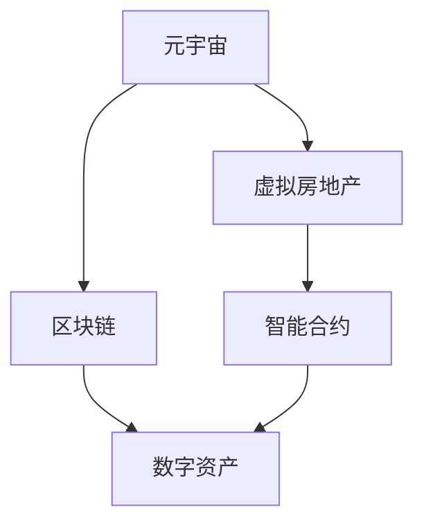

                 

# 虚拟房地产创业：元宇宙中的地产投资

> 关键词：元宇宙,虚拟地产,房地产投资,VR,区块链,智能合约,数字资产

## 1. 背景介绍

### 1.1 问题由来

随着数字技术的不断进步，尤其是虚拟现实(VR)、增强现实(AR)、区块链等技术的飞速发展，全球正处于向数字经济转型的关键阶段。元宇宙（Metaverse）作为一个虚拟的、由多个数字空间交互构成的互联空间，正在迅速崛起，成为新一轮技术革新的焦点。

元宇宙的构建需要强大的数字资产系统支撑。虚拟房地产作为元宇宙重要的组成部分，不仅能够提供虚拟地产的交易、租赁、管理等功能，还可以为元宇宙经济系统提供重要的流通手段和价值支撑。因此，元宇宙中的虚拟地产投资成为了一个令人瞩目的新兴领域。

### 1.2 问题核心关键点

元宇宙中的虚拟地产投资，涉及多种关键技术的应用，包括VR/AR技术、区块链、智能合约、数字资产等。这些技术的相互融合和协作，使得虚拟地产投资具有高度的技术复杂性和商业潜力。

核心关键点包括：
1. VR/AR技术：提供沉浸式的虚拟地产体验。
2. 区块链技术：实现虚拟地产交易的去中心化和安全性。
3. 智能合约：自动化管理虚拟地产的租赁、交易等操作。
4. 数字资产：提供虚拟地产价值的数字化表现形式。

本文将围绕这些关键点，对元宇宙中的虚拟地产投资进行深入探讨。

## 2. 核心概念与联系

### 2.1 核心概念概述

为更好地理解元宇宙中虚拟地产投资，本节将介绍几个密切相关的核心概念：

- 元宇宙（Metaverse）：一个由多个虚拟空间组成，基于虚拟现实(VR)和增强现实(AR)技术的互联空间。
- 虚拟房地产（Virtual Real Estate）：利用VR/AR技术构建的虚拟地产，包括土地、房产等实体空间在虚拟世界中的数字化表现。
- 区块链（Blockchain）：一种去中心化的分布式账本技术，用于记录和管理虚拟地产的交易信息。
- 智能合约（Smart Contract）：基于区块链技术的自动化合约，用于自动化管理虚拟地产的租赁、交易等操作。
- 数字资产（Digital Asset）：虚拟地产价值的数字化表现形式，可以在区块链上自由交易。

这些核心概念之间的逻辑关系可以通过以下Mermaid流程图来展示：



这个流程图展示了几类核心概念及其之间的关系：

1. 元宇宙通过VR/AR技术提供虚拟地产的体验空间。
2. 虚拟房地产在元宇宙中存在并得以交易。
3. 区块链技术实现虚拟地产的交易记录和管理。
4. 智能合约用于自动化虚拟地产的操作流程。
5. 数字资产作为虚拟地产的价值载体，可以在区块链上进行自由交易。

这些概念共同构成了元宇宙中虚拟地产投资的基础框架，使得虚拟地产投资成为可能。

## 3. 核心算法原理 & 具体操作步骤
### 3.1 算法原理概述

元宇宙中虚拟地产投资的本质是一种数字资产的投资行为，其核心算法原理包括：

1. 利用VR/AR技术构建虚拟地产的可视化环境。
2. 基于区块链技术，实现虚拟地产的交易记录和管理。
3. 使用智能合约自动化虚拟地产的操作流程。
4. 通过数字资产为虚拟地产提供价值数字化表达。

这些算法原理相互交织，共同支撑了虚拟地产投资的技术基础。

### 3.2 算法步骤详解

元宇宙中虚拟地产投资的一般步骤包括：

1. 构建虚拟地产平台。使用VR/AR技术，为虚拟地产创建一个可视化环境。
2. 设计虚拟地产交易规则。定义虚拟地产的交易机制，包括买卖双方的权利义务、交易费用、时间限制等。
3. 部署智能合约。在区块链上部署智能合约，自动执行虚拟地产的交易、租赁、管理等操作。
4. 发行数字资产。基于区块链技术，发行虚拟地产的数字资产，用于交易和价值表示。
5. 市场运营。通过虚拟地产平台，吸引投资者参与交易，维护市场的健康运作。

### 3.3 算法优缺点

元宇宙中虚拟地产投资的算法原理和步骤具有以下优缺点：

**优点**：
1. 去中心化。基于区块链技术，虚拟地产交易记录透明、安全、不可篡改。
2. 自动化。智能合约可以自动执行虚拟地产操作，减少人为干预。
3. 全球流通。数字资产可以自由流通，不受地理位置限制。

**缺点**：
1. 技术门槛高。需要较高的技术实现能力，如VR/AR、区块链等技术。
2. 监管挑战。虚拟地产投资尚缺乏明确的监管政策，法律风险较高。
3. 市场波动。数字资产价格波动较大，投资风险较高。

### 3.4 算法应用领域

基于VR/AR、区块链、智能合约等技术的元宇宙中虚拟地产投资，已在游戏、房地产、文化旅游等多个领域得到初步应用。具体应用领域包括：

- 游戏行业：利用虚拟地产构建游戏场景，提供游戏内虚拟地产的买卖和租赁服务。
- 房地产行业：在元宇宙中构建虚拟地产市场，提供房地产的数字化投资平台。
- 文化旅游行业：在元宇宙中建立虚拟景区，提供旅游体验和数字化收藏服务。
- 教育行业：利用虚拟地产进行在线教育和虚拟教室的建设。
- 商业地产：构建虚拟商业地产，提供虚拟购物中心、办公空间等商业服务。

## 4. 数学模型和公式 & 详细讲解 & 举例说明

### 4.1 数学模型构建

元宇宙中虚拟地产投资的数学模型构建，主要涉及以下几个方面：

1. 虚拟地产的交易价格模型。定义虚拟地产的价格计算公式，考虑土地面积、位置、设施等因素。
2. 交易费用模型。计算虚拟地产交易的手续费、佣金等费用。
3. 租赁收益模型。计算虚拟地产的租金收入和租赁期限。
4. 市场供需模型。描述虚拟地产市场的供需关系和价格波动。

### 4.2 公式推导过程

以虚拟地产的交易价格模型为例，假设一个虚拟地块的面积为A，地理位置为L，设施等级为F，市场价格为P。设其基准价格为B，则交易价格P的计算公式为：

$$ P = B \times (A + L + F) $$

其中，A、L、F分别代表土地的面积、地理位置和设施等级，基准价格B可以通过市场调研获得。

### 4.3 案例分析与讲解

假设某虚拟房地产平台上有A、B两个地块，A地块面积为500平方米，地理位置为城市中心，设施等级为5星，B地块面积为800平方米，地理位置为郊区，设施等级为3星。根据上述公式，计算两个地块的基准价格分别为10万和8万。

1. A地块的价格：$ P_A = 10 \times (500 + 3 + 5) = 60 $万
2. B地块的价格：$ P_B = 8 \times (800 + 2 + 3) = 70 $万

从计算结果可以看出，A地块由于位于城市中心且设施等级较高，其交易价格高于B地块。这反映了虚拟地产价格的区位优势和设施价值。

## 5. 项目实践：代码实例和详细解释说明

### 5.1 开发环境搭建

在进行虚拟地产投资平台开发前，我们需要准备好开发环境。以下是使用Python进行开发的环境配置流程：

1. 安装Anaconda：从官网下载并安装Anaconda，用于创建独立的Python环境。

2. 创建并激活虚拟环境：
```bash
conda create -n vre land virtual environment python=3.8 
conda activate vre land
```

3. 安装PyTorch：根据CUDA版本，从官网获取对应的安装命令。例如：
```bash
conda install pytorch torchvision torchaudio cudatoolkit=11.1 -c pytorch -c conda-forge
```

4. 安装React：使用npm或yarn安装React和相关的库。
```bash
npm install react react-dom
```

5. 安装MongoDB：从官网下载并安装MongoDB，并配置好数据库。

6. 安装Node.js：从官网下载并安装Node.js。

7. 安装虚拟现实开发工具：如Unity、Unreal Engine等，用于构建虚拟地产的可视化环境。

完成上述步骤后，即可在`vre land`环境中开始虚拟地产投资平台开发。

### 5.2 源代码详细实现

接下来，我们以一个虚拟房地产交易平台为例，给出使用React和MongoDB进行开发的PyTorch代码实现。

首先，定义虚拟地产的交易数据模型：

```python
from pymongo import MongoClient

class LandModel:
    def __init__(self, id, area, location, facilities, price, transaction_fee, lease_price, lease_period):
        self.id = id
        self.area = area
        self.location = location
        self.facilities = facilities
        self.price = price
        self.transaction_fee = transaction_fee
        self.lease_price = lease_price
        self.lease_period = lease_period

    def __str__(self):
        return f"Land id: {self.id}, area: {self.area} m^2, location: {self.location}, facilities: {self.facilities}, price: {self.price}, transaction_fee: {self.transaction_fee}, lease_price: {self.lease_price}, lease_period: {self.lease_period}"
```

然后，定义虚拟地产的交易服务类：

```python
class LandService:
    def __init__(self):
        self.client = MongoClient('localhost', 27017)
        self.db = self.client['land_db']
        self.collection = self.db['land']

    def add_land(self, land):
        land_dict = land.__dict__
        self.collection.insert_one(land_dict)

    def get_land(self, id):
        land_dict = self.collection.find_one({'id': id})
        land = LandModel(**land_dict)
        return land
```

接着，定义虚拟地产的交易UI界面：

```jsx
import React, { useState } from 'react';
import LandModel from './LandModel';

function LandUI() {
    const [land, setLand] = useState(null);

    const addLand = () => {
        const land = new LandModel('123', 500, 'city center', 5, 60, 0.5, 5, 6);
        const service = new LandService();
        service.add_land(land);
        console.log(land);
    }

    return (
        <div>
            <button onClick={addLand}>Add Land</button>
            {land && <p>{land}</p>}
        </div>
    );
}

export default LandUI;
```

最后，启动虚拟地产交易平台：

```jsx
import React from 'react';
import ReactDOM from 'react-dom';
import LandUI from './LandUI';

ReactDOM.render(<LandUI />, document.getElementById('root'));
```

以上就是使用React和MongoDB进行虚拟地产交易平台开发的完整代码实现。可以看到，React提供了强大的组件化开发能力，可以灵活构建虚拟地产交易平台的用户界面。MongoDB则提供了高效的数据存储和查询服务，能够快速处理虚拟地产的各类数据。

### 5.3 代码解读与分析

让我们再详细解读一下关键代码的实现细节：

**LandModel类**：
- `__init__`方法：初始化虚拟地产的属性。
- `__str__`方法：重载字符串表示方法，方便打印输出。

**LandService类**：
- `__init__`方法：初始化MongoDB客户端和数据库。
- `add_land`方法：将虚拟地产保存到数据库。
- `get_land`方法：从数据库中获取虚拟地产信息。

**LandUI类**：
- `useState`钩子：用于管理虚拟地产的状态。
- `addLand`方法：添加虚拟地产，并通过MongoDB保存到数据库。
- `return`部分：定义UI界面，包含一个按钮用于添加虚拟地产，以及一个展示区用于展示添加的虚拟地产。

以上代码实现了基本的虚拟地产添加和管理功能。开发者可以根据实际需求，进一步扩展界面交互、数据验证、交易逻辑等功能。

当然，工业级的系统实现还需考虑更多因素，如安全性、并发性、系统扩展性等。但核心的交易逻辑基本与此类似。

## 6. 实际应用场景

### 6.1 游戏行业

在游戏行业，虚拟地产作为重要的游戏资产，可以提供丰富的游戏场景和互动体验。例如，某沙盒游戏可以在元宇宙中创建虚拟城市，玩家可以在其中购买、租赁和建造虚拟房产，与其他玩家进行互动和交易。此外，游戏内虚拟地产还可以作为玩家的代币，用于游戏内消费和交易。

### 6.2 房地产行业

在房地产行业，虚拟地产可以作为传统的物理地产的数字化补充。例如，某房地产企业可以在元宇宙中构建虚拟地产市场，提供房地产的虚拟展示和交易服务。用户可以通过虚拟房产浏览、比较和购买，开发商则可以在虚拟地产中展示自己的项目。

### 6.3 文化旅游行业

在文化旅游行业，虚拟地产可以作为文化遗产的数字化载体。例如，某博物馆可以在元宇宙中创建虚拟展览馆，展示珍贵的文物和艺术品。游客可以在虚拟展览馆中自由参观，甚至可以购买数字化的收藏品。

### 6.4 未来应用展望

随着元宇宙技术的发展，虚拟地产投资将迎来更广阔的应用前景。未来可能的趋势包括：

1. 虚拟地产金融：利用区块链和智能合约技术，构建虚拟地产的金融产品，如虚拟地产的证券化、衍生品等。
2. 虚拟地产社交：通过虚拟地产构建虚拟社交平台，提供丰富的社交场景和互动体验。
3. 虚拟地产游戏：将虚拟地产作为游戏的重要组成部分，提供游戏内虚拟经济和虚拟市场。
4. 虚拟地产商业：利用虚拟地产构建虚拟商业平台，提供线上交易、服务等功能。
5. 虚拟地产教育：通过虚拟地产提供教育场景，如虚拟校园、虚拟教室等。

## 7. 工具和资源推荐

### 7.1 学习资源推荐

为了帮助开发者系统掌握元宇宙中虚拟地产投资的理论基础和实践技巧，这里推荐一些优质的学习资源：

1. 《元宇宙技术基础》系列博文：由元宇宙技术专家撰写，全面介绍元宇宙的原理、技术栈和应用场景。

2. 《Web3.0开发实战》课程：由区块链技术专家讲授，涵盖区块链、智能合约、DApp等Web3.0核心技术，并结合实际项目进行讲解。

3. 《虚拟现实编程基础》书籍：介绍虚拟现实技术的核心原理和开发实践，适合初学者学习。

4. 《区块链应用开发》书籍：介绍区块链技术的核心原理和应用场景，适合进阶学习。

5. 《数字资产投资》课程：介绍数字资产的投资原理和策略，帮助投资者理解虚拟地产的价值和风险。

6. 元宇宙开源项目：如Decentraland、The Sandbox等，提供丰富的学习资源和代码示例，是深入理解元宇宙虚拟地产投资的重要资料。

通过对这些资源的学习实践，相信你一定能够快速掌握元宇宙中虚拟地产投资的技术和理论。

### 7.2 开发工具推荐

高效的开发离不开优秀的工具支持。以下是几款用于虚拟地产投资开发的常用工具：

1. Unity：适用于游戏行业，提供强大的虚拟现实开发能力，可以构建丰富的虚拟场景。

2. Unreal Engine：适用于游戏和影视行业，提供高质量的虚拟现实和增强现实开发环境。

3. MongoDB：适用于数据存储和查询，提供高效的数据管理能力。

4. React：适用于前端开发，提供强大的组件化开发能力，构建灵活的UI界面。

5. Node.js：适用于后端开发，提供高性能的服务器端开发环境。

6. Visual Studio Code：适用于代码开发，提供丰富的插件和工具支持。

合理利用这些工具，可以显著提升虚拟地产投资任务的开发效率，加快创新迭代的步伐。

### 7.3 相关论文推荐

元宇宙中虚拟地产投资的研究尚处于起步阶段，但已有学者开始关注这一领域。以下是几篇奠基性的相关论文，推荐阅读：

1. Metaverse: The New Age of Interaction and Ownership：一篇关于元宇宙未来发展趋势的论文，探讨了虚拟地产在元宇宙中的重要地位。

2. Virtual Land Parcelling in Virtual World Systems：探讨了虚拟世界系统中虚拟地块的划分和管理技术。

3. Smart Contracts in Real Estate：研究了智能合约在房地产交易中的应用。

4. Digital Real Estate: The Future of Land Ownership：探讨了数字房地产的未来发展趋势和应用场景。

这些论文代表了大语言模型微调技术的发展脉络。通过学习这些前沿成果，可以帮助研究者把握学科前进方向，激发更多的创新灵感。

## 8. 总结：未来发展趋势与挑战

### 8.1 总结

本文对元宇宙中虚拟地产投资进行了全面系统的介绍。首先阐述了元宇宙中虚拟地产投资的研究背景和意义，明确了虚拟地产投资在元宇宙中的重要地位。其次，从原理到实践，详细讲解了虚拟地产投资的核心算法原理和具体操作步骤，给出了虚拟地产投资平台开发的完整代码实例。同时，本文还广泛探讨了虚拟地产投资在多个行业领域的应用前景，展示了虚拟地产投资范式的巨大潜力。此外，本文精选了虚拟地产投资的各类学习资源，力求为读者提供全方位的技术指引。

通过本文的系统梳理，可以看到，元宇宙中虚拟地产投资正处于蓬勃发展的初期阶段，具备广阔的应用前景。随着技术的不断进步和市场的逐步成熟，虚拟地产投资必将迎来更加广阔的发展空间。

### 8.2 未来发展趋势

展望未来，元宇宙中虚拟地产投资将呈现以下几个发展趋势：

1. 技术创新不断涌现。随着VR/AR、区块链、智能合约等技术的进一步发展，虚拟地产投资的技术基础将更加坚实。

2. 应用场景不断扩展。虚拟地产投资将在游戏、房地产、文化旅游等多个领域得到更广泛的应用，形成更丰富多样的应用场景。

3. 用户交互日益深入。虚拟地产投资平台将提供更丰富的用户交互体验，如虚拟旅游、虚拟租赁、虚拟交易等。

4. 标准化和规范体系逐步建立。元宇宙中虚拟地产投资的标准化规范将逐步建立，促进市场的健康发展。

5. 跨领域合作日益增多。虚拟地产投资将与其他领域的技术和应用进行更深入的融合，如虚拟现实、增强现实、云计算等，形成更强大、更完善的生态体系。

这些趋势将使得元宇宙中虚拟地产投资成为一个充满活力和创新潜力的领域。

### 8.3 面临的挑战

尽管元宇宙中虚拟地产投资具备广阔的应用前景，但在迈向更加智能化、普适化应用的过程中，它仍面临着诸多挑战：

1. 技术复杂度高。虚拟地产投资需要融合多种先进技术，技术门槛较高。

2. 市场规范不完善。元宇宙中虚拟地产投资尚缺乏明确的监管政策和法律框架，面临较高的法律风险。

3. 投资风险高。虚拟地产市场尚未完全成熟，市场波动较大，投资风险较高。

4. 用户体验问题。虚拟地产投资平台的用户体验尚未完全优化，需要进一步提升交互性和沉浸感。

5. 数据隐私问题。虚拟地产投资涉及大量用户的个人信息，数据隐私和安全问题需要得到重视。

6. 跨平台互通问题。元宇宙中虚拟地产投资需要跨平台互通，技术实现较为复杂。

这些挑战需要各方共同努力，通过技术创新和政策引导，才能逐步克服。

### 8.4 研究展望

面对元宇宙中虚拟地产投资所面临的挑战，未来的研究需要在以下几个方面寻求新的突破：

1. 探索新的技术融合方式。如将VR/AR与区块链、智能合约结合，提升虚拟地产交易的稳定性和安全性。

2. 研究市场规范和监管机制。制定元宇宙中虚拟地产投资的标准化规范，提供市场监管和法律保障。

3. 优化用户体验。提升虚拟地产投资平台的用户体验，增强互动性和沉浸感。

4. 加强数据隐私保护。通过数据加密、匿名化等手段，保护用户隐私和数据安全。

5. 实现跨平台互通。构建跨平台的虚拟地产投资系统，实现平台间的数据互通和用户交互。

这些研究方向的探索，将推动元宇宙中虚拟地产投资技术的发展，为构建更加安全、可靠、高效、普适的虚拟地产投资平台铺平道路。

## 9. 附录：常见问题与解答

**Q1：虚拟地产投资是否适用于所有行业？**

A: 虚拟地产投资在技术实现上具有一定的复杂度，不同行业的应用场景和需求各不相同。虚拟地产投资主要适用于游戏、房地产、文化旅游、商业、教育等行业，这些行业中的虚拟场景和虚拟资产能够与虚拟地产结合，形成具有实际价值的虚拟经济。

**Q2：虚拟地产投资的收益如何计算？**

A: 虚拟地产投资的收益主要来源于虚拟地产的增值和交易。虚拟地产的价格由多个因素决定，包括土地面积、地理位置、设施等级等。虚拟地产的租赁收益和交易费用也在收益计算中占有重要地位。具体的收益计算模型需要根据虚拟地产投资平台的具体设计而定。

**Q3：虚拟地产投资的安全性如何保障？**

A: 虚拟地产投资的安全性主要通过区块链和智能合约技术保障。区块链技术的去中心化和透明性可以保证交易记录的安全和不可篡改。智能合约的自动化执行可以减少人为干预，提高交易的稳定性和可靠性。此外，平台应该加强数据隐私保护，确保用户信息的安全。

**Q4：虚拟地产投资的技术实现有哪些挑战？**

A: 虚拟地产投资的技术实现面临多重挑战：
1. 技术复杂度高，需要融合多种先进技术，如VR/AR、区块链、智能合约等。
2. 数据隐私问题，涉及大量用户个人信息，需要采取数据加密、匿名化等手段保护隐私。
3. 用户体验问题，需要提升虚拟地产投资平台的交互性和沉浸感。
4. 市场规范不完善，需要建立标准化的监管机制。

这些挑战需要开发者在技术、市场、法律等多个层面进行全面考虑和优化。

**Q5：未来虚拟地产投资的发展趋势是什么？**

A: 未来虚拟地产投资的发展趋势包括：
1. 技术创新不断涌现，新的技术融合方式将提升虚拟地产交易的稳定性和安全性。
2. 应用场景不断扩展，虚拟地产投资将在游戏、房地产、文化旅游等多个领域得到更广泛的应用。
3. 市场规范逐步建立，提供市场监管和法律保障。
4. 用户体验优化，提升虚拟地产投资平台的用户体验。

这些趋势将使得虚拟地产投资成为一个充满活力和创新潜力的领域，为元宇宙的经济发展注入新的动力。

---

作者：禅与计算机程序设计艺术 / Zen and the Art of Computer Programming

