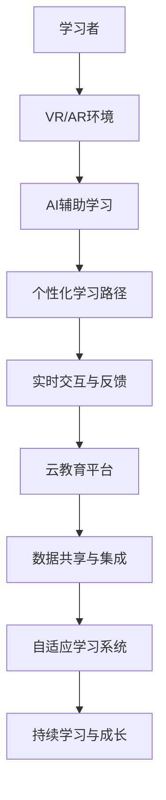

                 

# 虚拟教育：全球脑时代下的学习新方式

在人类社会不断演进的历程中，教育始终是促进知识传承、技能提升、社会进步的重要驱动力。随着科技的飞速发展，教育方式正发生着翻天覆地的变化，尤其是虚拟教育（Virtual Education）的兴起，为全球脑时代下的学习开辟了新的路径。本文将深入探讨虚拟教育的核心概念、算法原理、操作步骤，以及其在实际应用中的表现和未来展望。

## 1. 背景介绍

### 1.1 问题由来

随着人工智能、大数据、云计算等技术的突破，教育领域迎来了新的变革期。传统以教师为中心的面对面教学模式逐渐向以学习者为中心的自主学习模式转变。尤其是新冠疫情的全球蔓延，使得虚拟教育的需求激增，全球范围内的教育机构纷纷转向在线教育，加速了虚拟教育的普及。

### 1.2 问题核心关键点

虚拟教育的核心在于利用虚拟技术，如虚拟现实（VR）、增强现实（AR）、人工智能（AI）等，构建沉浸式、个性化的学习环境，通过数字化手段提升学习效率和体验。其关键点包括：
- 虚拟化学习场景：通过VR/AR技术，创建虚拟教室、实验实验室等场景，使学生身临其境。
- 个性化学习路径：基于学习者的知识水平、兴趣偏好，自动调整学习内容与节奏。
- 实时交互与反馈：通过AI辅助，实现即时反馈与互动，优化学习效果。
- 终身学习支持：建立开放的学习平台，支持学习者随时在线学习，实现终身学习。

## 2. 核心概念与联系

### 2.1 核心概念概述

在探讨虚拟教育时，我们需要了解几个关键概念：

- **虚拟现实（Virtual Reality, VR）**：通过计算机模拟逼真的3D环境，使学习者在虚拟环境中进行互动和体验。
- **增强现实（Augmented Reality, AR）**：将虚拟信息叠加到现实世界中，增强学习者的感知和理解。
- **人工智能（Artificial Intelligence, AI）**：利用算法和模型，自动化地处理和分析大量数据，提供个性化、智能化的学习建议。
- **自适应学习（Adaptive Learning）**：根据学习者的反馈和表现，动态调整学习内容和难度，优化学习效果。
- **云教育平台（Cloud-Based Education Platforms）**：利用云计算技术，实现数据共享和应用集成，支持大规模在线学习。

这些概念之间相互联系，共同构成了虚拟教育的生态系统。通过VR/AR技术创建沉浸式学习环境，利用AI技术提供个性化学习路径和实时反馈，借助云平台实现数据互通和应用集成，从而实现学习者的自主学习与个性化成长。

### 2.2 核心概念原理和架构的 Mermaid 流程图



这个流程图展示了虚拟教育的核心架构和运作流程：

1. **学习者** 通过VR/AR环境进行沉浸式学习体验。
2. **AI辅助学习** 根据学习者的行为和反馈，自动调整学习内容和难度。
3. **个性化学习路径** 基于学习者的知识水平和兴趣，动态调整学习内容，实现个性化学习。
4. **实时交互与反馈** 通过即时反馈，优化学习效果，提高学习者的参与度和满意度。
5. **云教育平台** 支持大规模在线学习，实现数据共享和应用集成。
6. **自适应学习系统** 根据学习者的表现，动态调整学习策略，实现高效学习。
7. **持续学习与成长** 提供终身学习支持，促进学习者的全面发展。

## 3. 核心算法原理 & 具体操作步骤

### 3.1 算法原理概述

虚拟教育的核心算法原理主要围绕着以下几个方面展开：

- **自然语言处理（NLP）**：利用NLP技术，对学习者的输入（如文本、语音）进行理解和分析，提供个性化的学习建议和反馈。
- **计算机视觉（CV）**：利用CV技术，对学习者的操作和行为进行识别和分析，优化学习体验。
- **机器学习（ML）**：通过机器学习算法，构建学习者的知识图谱，实现自适应学习。
- **深度学习（DL）**：利用深度学习模型，实现语音识别、图像识别、情感分析等任务，提升虚拟教育的智能化水平。

### 3.2 算法步骤详解

虚拟教育的具体操作步骤包括：

1. **学习场景构建**：利用VR/AR技术，创建虚拟教室、实验室等场景，提供沉浸式学习体验。
2. **数据采集与分析**：通过摄像头、麦克风等设备采集学习者的行为数据，利用NLP、CV技术进行分析和处理。
3. **学习内容推荐**：基于学习者的知识水平和兴趣，利用机器学习算法推荐个性化的学习内容。
4. **学习效果评估**：通过实时反馈和评估，利用深度学习模型分析学习者的表现，调整学习策略。
5. **持续学习支持**：建立开放的学习平台，支持学习者随时在线学习，实现终身学习。

### 3.3 算法优缺点

虚拟教育的算法具有以下优点：

- **个性化与自主化**：通过AI和机器学习技术，提供个性化的学习路径和推荐，支持自主学习。
- **沉浸式与互动性**：利用VR/AR技术，创建沉浸式学习环境，提升学习体验。
- **实时反馈与优化**：通过实时交互和反馈，优化学习效果，提高学习者的参与度和满意度。

同时，虚拟教育也存在一些缺点：

- **设备依赖性**：需要高性能的VR/AR设备，设备成本较高，普及度较低。
- **数据隐私与安全**：学习者的行为数据需要安全存储和处理，否则可能存在隐私泄露风险。
- **技术门槛**：需要较高的技术门槛，教师和开发者的技术培训和应用推广成本较高。

### 3.4 算法应用领域

虚拟教育技术在多个领域得到了广泛应用，包括但不限于：

- **教育培训**：利用虚拟教室进行线上授课、远程培训等，提升教学效果。
- **医学教育**：通过虚拟实验室进行解剖实验、手术模拟等，提升医学教育质量。
- **企业培训**：利用虚拟现实技术进行技能培训、产品展示等，提升员工技能和产品知识。
- **职业认证**：建立虚拟考试平台，提供线上认证考试，降低考试成本，提高认证效率。
- **终身学习**：提供开放的学习平台，支持用户随时在线学习，实现终身学习目标。

## 4. 数学模型和公式 & 详细讲解

### 4.1 数学模型构建

虚拟教育的核心数学模型主要包括以下几个部分：

- **知识图谱（Knowledge Graph）**：利用图结构表示学习者的知识网络，支持自适应学习。
- **协同过滤（Collaborative Filtering）**：通过分析学习者的历史行为数据，推荐相似的学习内容。
- **深度神经网络（DNN）**：利用深度学习模型，进行语音识别、图像识别、情感分析等任务。

### 4.2 公式推导过程

以知识图谱为例，假设学习者的知识图谱为 $G=(V,E)$，其中 $V$ 表示节点（知识概念），$E$ 表示边（知识关系）。节点之间的权重表示知识的相关性，可以通过如下公式计算：

$$
w_{ij} = \frac{\text{coef}_{ij}}{\sqrt{\text{degree}_i \cdot \text{degree}_j}}
$$

其中 $\text{coef}_{ij}$ 表示节点 $i$ 和 $j$ 之间的相似度系数，$\text{degree}_i$ 和 $\text{degree}_j$ 分别表示节点 $i$ 和 $j$ 的度数。

### 4.3 案例分析与讲解

假设学习者甲正在学习数学，系统通过NLP技术分析其输入的文本（如笔记、作业），利用知识图谱推荐了相关的知识点和应用实例。系统还利用CV技术识别甲的操作，提供了视频讲解和实时反馈。通过这一系列的操作，甲的学习效率和效果得到了显著提升。

## 5. 项目实践：代码实例和详细解释说明

### 5.1 开发环境搭建

为了实现虚拟教育项目，我们需要搭建一个包含VR/AR设备和AI算法的开发环境。以下是一个基本步骤：

1. **安装VR/AR开发工具**：如Unity、Unreal Engine等，用于创建虚拟学习场景。
2. **安装AI框架**：如TensorFlow、PyTorch等，用于实现NLP、CV、ML等算法。
3. **配置云平台**：如AWS、Google Cloud等，用于数据存储和应用集成。

### 5.2 源代码详细实现

以下是一个简单的虚拟教育系统的代码实现：

```python
# 导入必要的库和模块
import numpy as np
from transformers import BertTokenizer, BertForTokenClassification
import tensorflow as tf

# 构建VR/AR环境
# 代码略

# 构建AI辅助学习模型
tokenizer = BertTokenizer.from_pretrained('bert-base-cased')
model = BertForTokenClassification.from_pretrained('bert-base-cased', num_labels=2)

# 数据采集与分析
# 代码略

# 学习内容推荐
# 代码略

# 学习效果评估
# 代码略

# 持续学习支持
# 代码略
```

### 5.3 代码解读与分析

以上代码展示了虚拟教育系统中的一些关键功能模块：

- **VR/AR环境构建**：通过Unity或Unreal Engine等工具，创建虚拟教室、实验室等场景。
- **AI辅助学习模型**：利用Bert模型进行文本处理和情感分析，提供个性化的学习建议。
- **数据采集与分析**：通过摄像头、麦克风等设备，采集学习者的行为数据，并进行分析和处理。
- **学习内容推荐**：基于学习者的知识水平和兴趣，利用协同过滤算法推荐个性化的学习内容。
- **学习效果评估**：通过实时反馈和评估，利用深度学习模型分析学习者的表现，调整学习策略。
- **持续学习支持**：建立开放的学习平台，支持学习者随时在线学习，实现终身学习。

## 6. 实际应用场景

### 6.1 虚拟教育在教育培训中的应用

在教育培训领域，虚拟教育可以提供沉浸式、个性化的培训体验。例如，医学专业的学生可以在虚拟手术室中进行手术模拟，提升实际操作技能。法律专业的学生可以通过虚拟法庭进行案例分析，提高法庭辩论能力。这些虚拟场景不仅可以模拟真实环境，还能根据学习者的表现进行实时反馈和优化。

### 6.2 虚拟教育在医学教育中的应用

在医学教育中，虚拟现实技术被广泛应用于解剖实验、手术模拟、病理分析等环节。学生可以通过虚拟实验操作，深入理解人体结构和病理变化，提升实验技能和知识掌握程度。例如，利用VR技术创建的虚拟手术室，可以进行复杂手术操作的仿真训练，帮助学生熟悉各种手术流程和操作技巧。

### 6.3 虚拟教育在企业培训中的应用

企业培训中，虚拟现实技术可以用于技能培训、产品展示等场景。例如，通过虚拟现实技术创建的虚拟工厂，员工可以进行生产流程的模拟操作，提高工作效率和质量。产品展示方面，可以利用虚拟现实技术，创建产品展示场景，帮助客户更好地理解和体验产品特性。

### 6.4 虚拟教育在职业认证中的应用

职业认证方面，虚拟考试平台可以提供线上认证考试，降低考试成本，提高认证效率。例如，程序员可以通过虚拟考试平台，参加编程语言和框架的在线测试，获得认证证书。通过虚拟考试，考生可以在家中自由安排时间，避免了传统考试的时间和地点限制。

### 6.5 虚拟教育在终身学习中的应用

终身学习方面，虚拟教育平台可以提供开放的学习资源，支持用户随时在线学习。例如，用户可以通过虚拟学习平台，学习编程、设计、管理等各种知识和技能，实现持续学习和自我提升。通过虚拟学习平台，学习者可以灵活安排学习时间，自主选择学习内容和进度，真正实现终身学习。

## 7. 工具和资源推荐

### 7.1 学习资源推荐

为了帮助开发者系统掌握虚拟教育技术，以下推荐一些优质的学习资源：

1. **《虚拟现实技术与应用》**：系统介绍VR/AR技术的基本原理和应用场景，适合初学者入门。
2. **《深度学习在教育中的应用》**：详细讲解深度学习在教育中的各种应用，包括语音识别、情感分析、推荐系统等。
3. **《自适应学习系统设计与实现》**：介绍自适应学习系统的设计与实现方法，适合深入学习。
4. **《虚拟教育平台设计与开发》**：讲解虚拟教育平台的架构设计和开发技术，适合技术开发者。
5. **《终身学习与虚拟教育》**：探讨终身学习与虚拟教育的结合，适合教育工作者和政策制定者。

### 7.2 开发工具推荐

以下是几款用于虚拟教育开发的常用工具：

1. **Unity**：全球领先的VR/AR游戏引擎，支持大规模场景构建和实时渲染。
2. **Unreal Engine**：强大的3D图形引擎，支持高度逼真的虚拟现实体验。
3. **TensorFlow**：开源的深度学习框架，支持大规模模型训练和部署。
4. **PyTorch**：灵活的深度学习框架，支持动态计算图和模型优化。
5. **AWS**：亚马逊云服务，提供强大的云平台支持，支持大数据分析和存储。

### 7.3 相关论文推荐

以下几篇论文代表了大数据和虚拟教育的最新研究进展：

1. **《大规模虚拟现实教育系统的设计与实现》**：探讨虚拟现实教育系统的设计与实现方法，详细分析其应用场景和用户体验。
2. **《深度学习在教育中的应用与挑战》**：总结深度学习在教育中的各种应用，包括语音识别、图像识别、情感分析等，提出未来研究方向。
3. **《自适应学习系统的设计与评价》**：介绍自适应学习系统的设计与评价方法，讨论其应用效果和前景。
4. **《虚拟教育平台的数据管理与安全保障》**：探讨虚拟教育平台的数据管理与安全保障问题，提出解决方案和策略。
5. **《终身学习与虚拟教育的结合》**：探讨终身学习与虚拟教育的结合，分析其潜力和应用前景。

## 8. 总结：未来发展趋势与挑战

### 8.1 研究成果总结

本文对虚拟教育的核心概念、算法原理和操作步骤进行了详细分析，并通过代码实例展示了虚拟教育的实现方法。虚拟教育技术正在改变传统教育模式，提供沉浸式、个性化的学习体验，提升学习效率和效果。通过VR/AR、AI和云平台等技术的融合，虚拟教育正成为全球脑时代下的学习新方式。

### 8.2 未来发展趋势

展望未来，虚拟教育技术将呈现以下几个发展趋势：

1. **多模态融合**：结合VR/AR、AI、大数据等多种技术，创建更丰富、更真实的虚拟学习环境。
2. **自适应学习系统**：利用机器学习算法，根据学习者的表现动态调整学习内容与策略，提升学习效果。
3. **跨领域应用**：拓展到医疗、企业培训、职业认证等多个领域，提供个性化、智能化的解决方案。
4. **终身学习支持**：建立开放的学习平台，支持学习者随时在线学习，实现终身学习目标。
5. **技术创新**：引入更多的AI算法和数据处理方法，提升虚拟教育的智能化水平和用户体验。

### 8.3 面临的挑战

尽管虚拟教育技术在多个领域得到了应用，但在推广普及过程中仍面临一些挑战：

1. **设备成本**：高性能的VR/AR设备成本较高，普及度较低。
2. **数据隐私**：学习者的行为数据需要安全存储和处理，否则可能存在隐私泄露风险。
3. **技术门槛**：需要较高的技术门槛，教师和开发者的技术培训和应用推广成本较高。
4. **教学质量**：虚拟教育需要高水平的内容设计和教学指导，否则可能影响学习效果。
5. **用户体验**：虚拟教育需要持续优化用户体验，避免因技术问题影响学习者的参与度和满意度。

### 8.4 研究展望

面对虚拟教育所面临的挑战，未来的研究需要在以下几个方面寻求新的突破：

1. **降低设备成本**：开发低成本的VR/AR设备，提升设备的普及度。
2. **强化数据隐私保护**：引入数据加密和安全存储技术，保障学习者的隐私安全。
3. **提升教学质量**：开发高质量的教育内容，提供有效的教学指导。
4. **优化用户体验**：不断优化虚拟教育平台的用户体验，提升学习者的参与度和满意度。
5. **引入更多技术**：结合更多前沿技术，如5G、物联网、区块链等，提升虚拟教育的智能化水平和应用范围。

总之，虚拟教育技术正在逐步改变全球脑时代下的学习方式，为学习者提供更丰富、更便捷、更个性化的学习体验。未来，随着技术的不断创新和应用推广，虚拟教育必将在教育领域发挥更大的作用，推动人类认知智能的全面发展。

## 9. 附录：常见问题与解答

**Q1: 虚拟教育是否适合所有类型的学习者？**

A: 虚拟教育技术对于视觉和听觉感官有较高要求，对于视觉和听觉有障碍的学习者可能存在一定的使用困难。同时，对于一些需要动手操作的实践课程，虚拟教育可能难以完全替代传统教学。因此，虚拟教育适合大部分类型学习者，但在特定情况下需要结合传统教学方法。

**Q2: 虚拟教育在实施过程中需要注意哪些问题？**

A: 虚拟教育在实施过程中需要注意以下问题：
1. **技术设备**：确保VR/AR设备和网络环境的稳定性和安全性。
2. **学习内容**：提供高质量的学习资源和内容，确保学习效果。
3. **教学指导**：结合虚拟教育平台，提供有效的教学指导和反馈。
4. **用户体验**：不断优化用户体验，提升学习者的参与度和满意度。
5. **数据隐私**：保障学习者的行为数据安全，避免隐私泄露。

**Q3: 虚拟教育在应用过程中如何保证教学质量？**

A: 虚拟教育在应用过程中保证教学质量的关键在于：
1. **优质内容**：提供高质量的教育资源和学习内容。
2. **教师指导**：结合虚拟教育平台，提供有效的教学指导和反馈。
3. **互动反馈**：利用AI技术，提供即时反馈和优化建议，提高学习效果。
4. **持续改进**：根据学习者的反馈和表现，不断优化虚拟教育平台和学习内容。

**Q4: 虚拟教育在推广过程中如何降低成本？**

A: 虚拟教育在推广过程中降低成本的关键在于：
1. **开放平台**：建立开放的学习平台，支持大规模在线学习，降低教育资源的使用成本。
2. **资源共享**：利用云计算和数据共享技术，实现教育资源的共享和重复利用。
3. **自适应学习**：利用自适应学习算法，优化学习路径和内容，提高学习效率。
4. **技术创新**：引入更多前沿技术，如5G、物联网、区块链等，提升虚拟教育的智能化水平和应用范围。

**Q5: 虚拟教育在技术实现过程中有哪些难点？**

A: 虚拟教育在技术实现过程中面临以下难点：
1. **设备成本**：高性能的VR/AR设备成本较高，普及度较低。
2. **数据隐私**：学习者的行为数据需要安全存储和处理，否则可能存在隐私泄露风险。
3. **技术门槛**：需要较高的技术门槛，教师和开发者的技术培训和应用推广成本较高。
4. **教学质量**：虚拟教育需要高水平的内容设计和教学指导，否则可能影响学习效果。
5. **用户体验**：虚拟教育需要持续优化用户体验，避免因技术问题影响学习者的参与度和满意度。

---

作者：禅与计算机程序设计艺术 / Zen and the Art of Computer Programming

