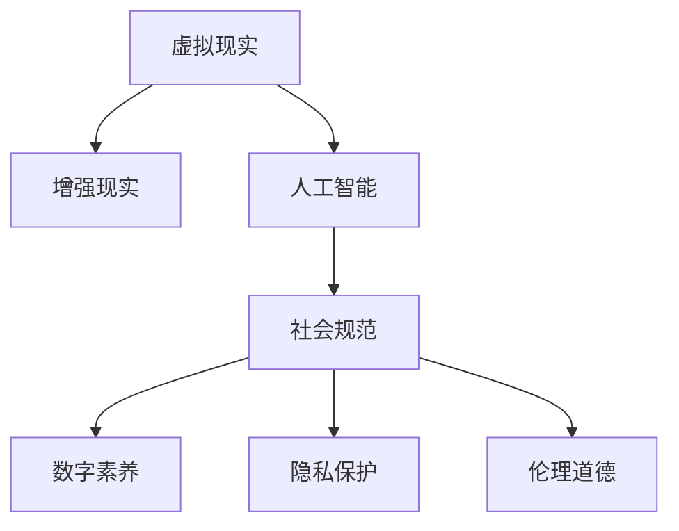

                 

# 虚拟文化：AI塑造的新型社会规范

> 关键词：虚拟现实, 人工智能, 社会规范, 数字素养, 隐私保护, 伦理道德

## 1. 背景介绍

### 1.1 问题由来
随着人工智能（AI）技术的迅猛发展，尤其是虚拟现实（VR）、增强现实（AR）、以及基于深度学习技术的自然语言处理（NLP）和计算机视觉（CV）的进步，虚拟文化作为一种新兴的社会现象正逐步改变我们的生活方式。虚拟文化不仅体现在数字世界的构建和体验，更体现在AI驱动的社交、教育、娱乐、商业等各个方面。虚拟文化的多样性和复杂性，使得传统社会规范面临重塑的挑战。

### 1.2 问题核心关键点
虚拟文化的核心关键点在于AI技术在其中的广泛应用，以及对人类行为和社会结构的深远影响。其涉及的领域包括：

- **虚拟环境的构建**：如虚拟城市、虚拟职场、虚拟课堂等。
- **AI驱动的交互**：如基于NLP的智能客服、基于CV的虚拟导览等。
- **社会行为的塑造**：如虚拟社交网络、虚拟游戏角色等。
- **伦理道德的探索**：如隐私保护、AI偏见等。

这些关键点构成了虚拟文化的基本框架，揭示了AI技术如何塑造新型社会规范。

### 1.3 问题研究意义
研究虚拟文化及其对社会规范的影响，对于理解AI技术的广泛应用，把握虚拟文化的发展趋势，探索未来的伦理道德边界，具有重要的理论和实践意义：

1. **技术应用的理解**：帮助开发者和用户深入理解AI技术在不同场景中的应用，提升AI系统的实际效用。
2. **社会规范的适应**：指导社会各界在虚拟环境中建立新的行为准则，确保技术应用的合规性和良性发展。
3. **伦理道德的探讨**：探讨AI技术在虚拟文化中的伦理问题，如隐私保护、公平性、安全性等，促进技术责任意识的提升。
4. **未来发展的预测**：预测虚拟文化的发展趋势，为政策制定和行业标准提供科学依据。
5. **技术创新的驱动**：为AI技术的未来发展方向提供参考，推动技术创新和社会进步。

## 2. 核心概念与联系

### 2.1 核心概念概述

为更好地理解虚拟文化及其对社会规范的影响，本节将介绍几个密切相关的核心概念：

- **虚拟现实(VR)**：一种通过计算机生成模拟环境，使用户能够在虚拟环境中进行交互的技术。
- **增强现实(AR)**：将数字信息叠加到现实世界，使用户能够看到虚拟元素与现实世界融合的场景。
- **人工智能(AI)**：包括机器学习、深度学习、自然语言处理、计算机视觉等多种技术，使计算机具备类似人类的智能。
- **社会规范**：指在特定社会环境下，对个人行为和社会互动的共同期望和规则。
- **数字素养**：指个体在数字世界中的基本技能和素养，包括信息获取、处理、评估和创造能力。
- **隐私保护**：指保护个人数据不被未经授权访问、使用、存储和传播的措施。
- **伦理道德**：涉及正确与错误、对与错、善良与恶等概念的哲学探讨，对AI技术的开发和应用具有重要指导意义。

这些概念之间的逻辑关系可以通过以下Mermaid流程图来展示：



这个流程图展示出虚拟文化中的关键概念及其之间的关系：

1. 虚拟现实和增强现实技术依赖于AI，使虚拟环境成为可能。
2. AI技术的广泛应用推动了虚拟文化的繁荣。
3. 虚拟文化通过数字素养和社会规范塑造虚拟行为。
4. 隐私保护和伦理道德是虚拟文化健康发展的重要保障。

## 3. 核心算法原理 & 具体操作步骤

### 3.1 算法原理概述

虚拟文化中的AI驱动行为主要依赖于以下算法原理：

1. **深度学习模型训练**：利用大数据集训练深度神经网络模型，使其具备智能推断和决策能力。
2. **自然语言处理(NLP)**：通过文本分析、语义理解、情感识别等技术，使AI能够理解并生成自然语言。
3. **计算机视觉(CV)**：通过图像识别、对象检测、场景理解等技术，使AI能够感知和理解视觉信息。
4. **机器学习**：通过监督学习、无监督学习、半监督学习等技术，使AI能够从数据中学习规律和模式。

这些算法原理共同构成了虚拟文化中的AI基础，使虚拟环境中的交互和行为成为可能。

### 3.2 算法步骤详解

以下是虚拟文化中AI驱动行为的基本算法步骤：

**Step 1: 数据收集与预处理**
- 收集相关的文本、图像、音频等数据，用于训练深度学习模型。
- 进行数据清洗、标注、分割等预处理，确保数据质量和一致性。

**Step 2: 模型训练与优化**
- 使用监督学习或无监督学习方法训练深度学习模型，优化模型参数。
- 应用正则化、Dropout、早停等技术，防止过拟合。

**Step 3: 模型部署与应用**
- 将训练好的模型部署到虚拟环境中，如VR应用程序、AR互动系统等。
- 使用API或直接加载模型，进行实时交互和决策。

**Step 4: 用户反馈与迭代优化**
- 收集用户反馈，评估模型性能和用户体验。
- 根据反馈进行模型迭代和优化，提升AI系统的效用和适应性。

### 3.3 算法优缺点

虚拟文化中的AI驱动行为具有以下优点：

1. **高效性**：通过自动化算法，AI能够在短时间内处理大量数据，提高工作效率。
2. **普适性**：AI技术可以应用于不同场景，如智能客服、虚拟导览、虚拟社交等，具有广泛的应用前景。
3. **自适应性**：通过不断学习和优化，AI能够适应不同环境和用户需求，提高系统的灵活性和智能性。

同时，也存在以下缺点：

1. **数据依赖**：AI系统依赖大量标注数据进行训练，数据质量和多样性直接影响系统性能。
2. **偏见与歧视**：AI模型可能继承训练数据中的偏见，产生歧视性决策。
3. **隐私风险**：AI系统在处理用户数据时，可能泄露隐私信息，带来安全风险。
4. **可解释性不足**：复杂AI模型难以解释其决策过程，影响用户信任和接受度。
5. **技术门槛高**：开发高质量AI系统需要跨领域专业知识，对开发者和用户都有较高的要求。

### 3.4 算法应用领域

AI驱动的虚拟文化在各个领域都有广泛应用，具体包括：

- **智能客服**：利用NLP技术，AI能够自动回答用户问题，提供24小时不间断服务。
- **虚拟导览**：基于CV技术，AI可以生成虚拟导览员，为用户提供实景信息和服务。
- **虚拟社交**：通过自然语言处理和情感识别，AI可以实现虚拟社交网络，改善用户互动体验。
- **虚拟教育**：AI能够自动批改作业、评估学情、推荐课程，提升教育质量。
- **虚拟购物**：利用推荐系统和增强现实技术，AI可以提供个性化购物体验，提升用户满意度。

此外，AI在虚拟文化中的应用还包括虚拟会议、虚拟旅游、虚拟娱乐等，为各行各业带来了新的发展机遇。

## 4. 数学模型和公式 & 详细讲解

### 4.1 数学模型构建

虚拟文化中的AI行为，通常采用深度学习模型进行建模和预测。这里以自然语言处理（NLP）为例，展示一个基本的数学模型构建过程。

假设有一个文本分类任务，模型的输入为文本 $x$，输出为类别 $y$，模型参数为 $\theta$。模型的目标是最大化似然函数：

$$
P(y|x;\theta) = \frac{e^{W(x;\theta)^T y + b(x;\theta)}}{Z(x;\theta)}
$$

其中 $W(x;\theta)$ 和 $b(x;\theta)$ 是模型的参数，$Z(x;\theta)$ 是归一化因子。

在训练过程中，我们需要最小化交叉熵损失函数：

$$
\mathcal{L}(\theta) = -\frac{1}{N} \sum_{i=1}^N y_i \log P(y_i|x_i;\theta)
$$

通过反向传播算法，计算损失函数对模型参数的梯度，更新参数 $\theta$。

### 4.2 公式推导过程

以文本分类为例，推导交叉熵损失函数的梯度公式。

假设模型在输入 $x_i$ 上的预测概率为 $\hat{y}_i$，真实标签为 $y_i$，则交叉熵损失函数为：

$$
\ell(x_i, y_i; \theta) = -[y_i \log \hat{y}_i + (1 - y_i) \log (1 - \hat{y}_i)]
$$

将损失函数对模型参数 $\theta$ 求偏导，得：

$$
\frac{\partial \mathcal{L}(\theta)}{\partial \theta} = -\frac{1}{N} \sum_{i=1}^N \left( \frac{y_i}{\hat{y}_i} \frac{\partial \hat{y}_i}{\partial \theta} - \frac{1 - y_i}{1 - \hat{y}_i} \frac{\partial \hat{y}_i}{\partial \theta} \right)
$$

其中 $\frac{\partial \hat{y}_i}{\partial \theta}$ 可以进一步展开，利用自动微分技术完成计算。

### 4.3 案例分析与讲解

以虚拟客服为例，分析AI驱动行为在实际应用中的数学模型。

假设虚拟客服系统需要处理客户询问，模型将问题映射到预设的分类标签，如产品查询、退货申请等。模型采用一个多层的神经网络，输入为问题文本，输出为类别概率分布。

在训练阶段，系统使用监督学习，通过大量标注数据进行模型训练。模型参数 $\theta$ 经过优化，使得模型在测试数据上的准确率达到预设阈值。在部署阶段，模型通过API接收输入文本，输出预测类别，与真实标签对比计算损失，更新模型参数。

## 5. 项目实践：代码实例和详细解释说明

### 5.1 开发环境搭建

在进行虚拟文化中的AI驱动行为开发前，我们需要准备好开发环境。以下是使用Python进行TensorFlow开发的环境配置流程：

1. 安装Anaconda：从官网下载并安装Anaconda，用于创建独立的Python环境。

2. 创建并激活虚拟环境：
```bash
conda create -n virtual-env python=3.8 
conda activate virtual-env
```

3. 安装TensorFlow：根据CUDA版本，从官网获取对应的安装命令。例如：
```bash
conda install tensorflow -c tf -c conda-forge
```

4. 安装相关库：
```bash
pip install numpy pandas scikit-learn matplotlib tensorflow-datasets
```

完成上述步骤后，即可在`virtual-env`环境中开始AI驱动行为的开发。

### 5.2 源代码详细实现

下面以虚拟客服系统为例，给出使用TensorFlow对文本分类模型进行训练和部署的PyTorch代码实现。

首先，定义模型和损失函数：

```python
import tensorflow as tf
from tensorflow.keras import layers, models

model = models.Sequential([
    layers.Embedding(input_dim=10000, output_dim=128, mask_zero=True),
    layers.Bidirectional(layers.LSTM(128)),
    layers.Dense(10, activation='softmax')
])

loss = tf.keras.losses.CategoricalCrossentropy()

model.compile(optimizer='adam', loss=loss, metrics=['accuracy'])
```

然后，定义数据处理函数：

```python
def preprocess_text(text):
    text = text.lower()
    text = text.split()
    text = [word for word in text if word.isalnum()]
    text = ' '.join(text)
    return text
```

接下来，加载数据集并进行预处理：

```python
from tensorflow.keras.datasets import imdb
from tensorflow.keras.preprocessing.sequence import pad_sequences

(train_data, train_labels), (test_data, test_labels) = imdb.load_data(num_words=10000)
train_data = pad_sequences(train_data, maxlen=200)
test_data = pad_sequences(test_data, maxlen=200)

train_labels = tf.keras.utils.to_categorical(train_labels, 10)
test_labels = tf.keras.utils.to_categorical(test_labels, 10)
```

最后，训练模型并在测试集上评估：

```python
history = model.fit(train_data, train_labels, epochs=10, validation_data=(test_data, test_labels))
model.evaluate(test_data, test_labels)
```

以上就是使用TensorFlow对虚拟客服系统进行文本分类模型训练和部署的完整代码实现。可以看到，TensorFlow提供了便捷的API和工具链，帮助开发者高效实现AI驱动行为。

### 5.3 代码解读与分析

让我们再详细解读一下关键代码的实现细节：

**model.compile()方法**：
- 使用`Sequential`模型构建序列化神经网络结构。
- 添加`Embedding`层，将文本转换为向量表示。
- 添加`Bidirectional LSTM`层，捕捉文本中的双向依赖。
- 添加`Dense`层，进行分类预测。
- 使用`CategoricalCrossentropy`损失函数，适合多分类任务。
- 使用`Adam`优化器，适合深度学习模型的训练。
- 指定评估指标为`accuracy`。

**preprocess_text()函数**：
- 将文本转换为小写。
- 去除标点符号和特殊字符。
- 统计单词频次，保留前10000个常见单词。
- 拼接单词，形成新的文本序列。

**imdb.load_data()方法**：
- 加载IMDB电影评论数据集，获取训练和测试集。
- 设定词汇表大小为10000，将单词转换为整数值。

**pad_sequences()方法**：
- 对文本序列进行填充，确保所有序列长度一致。
- 使用`maxlen`参数设定填充长度为200。

**model.fit()方法**：
- 使用训练数据和标签，训练模型。
- 设定训练轮数为10。
- 使用测试数据和标签进行验证。
- 返回训练过程中的性能指标历史记录。

**model.evaluate()方法**：
- 使用测试数据和标签评估模型性能。
- 返回模型的损失和准确率。

通过以上代码，我们可以清晰地看到TensorFlow在虚拟文化中的AI驱动行为开发中的应用，从模型构建、数据预处理到模型训练和评估，实现了一个完整的文本分类系统。

## 6. 实际应用场景

### 6.1 智能客服系统

AI驱动的虚拟客服系统，可以在多种虚拟环境中部署，提供7x24小时不间断服务。通过NLP技术，系统能够自动理解客户问题，并提供相应的解决方案。例如，在虚拟银行客服中，AI可以回答关于账户查询、转账、贷款等常见问题，提升客户满意度。

### 6.2 虚拟导览系统

虚拟导览系统通过计算机视觉（CV）技术，生成虚拟导览员，提供实景信息和服务。例如，在虚拟旅游场景中，用户可以通过VR头盔和手柄，自由探索虚拟城市，与虚拟导览员互动获取旅游信息。这种沉浸式体验，可以提升用户旅游的兴趣和满意度。

### 6.3 虚拟教育平台

虚拟教育平台利用AI技术，为学生提供个性化学习体验。例如，在虚拟课堂中，AI可以根据学生的学习行为和兴趣，推荐适合的课程和学习材料。虚拟教师可以通过语音识别和自然语言处理，进行实时互动和辅导，帮助学生解决学习问题。

### 6.4 未来应用展望

随着AI技术的不断进步，虚拟文化在各个领域的应用前景将更加广阔：

1. **智能家居**：AI驱动的虚拟助手，可以智能控制家电设备，提升生活便利性。
2. **医疗健康**：虚拟医生可以通过NLP技术，提供远程咨询和健康监测，提高医疗服务的可及性。
3. **金融服务**：AI驱动的虚拟理财顾问，可以根据用户需求，提供个性化的投资建议和服务。
4. **娱乐休闲**：虚拟角色可以通过AI技术，模拟人类情感和行为，提供更加逼真的游戏体验。
5. **虚拟会议**：AI驱动的虚拟会议系统，可以提供多语言翻译、实时字幕、虚拟背景等多种功能，提升会议效率和用户体验。

未来，虚拟文化将成为人们日常生活的重要组成部分，AI技术的深度应用将进一步改变社会结构和行为模式，带来新的机遇和挑战。

## 7. 工具和资源推荐

### 7.1 学习资源推荐

为了帮助开发者和用户掌握虚拟文化及其在AI驱动行为中的应用，这里推荐一些优质的学习资源：

1. **《Deep Learning》书籍**：Ian Goodfellow等著，全面介绍了深度学习的基本概念和技术，适合初学者和进阶学习者。
2. **《Python深度学习》书籍**：Francois Chollet著，介绍了TensorFlow等深度学习框架的使用，适合动手实践。
3. **CS231n《深度学习计算机视觉》课程**：斯坦福大学开设的视觉识别课程，涵盖图像分类、目标检测、图像生成等任务，适合深度学习在计算机视觉中的应用。
4. **Coursera《自然语言处理专项课程》**：由斯坦福大学等机构提供的NLP专项课程，涵盖文本分类、语言生成、情感分析等任务。
5. **Kaggle竞赛平台**：提供了众多NLP、CV等领域的竞赛，可以通过实际项目积累经验和提升技能。

通过对这些资源的学习实践，相信你一定能够快速掌握AI在虚拟文化中的应用，并用于解决实际的NLP问题。

### 7.2 开发工具推荐

高效的开发离不开优秀的工具支持。以下是几款用于虚拟文化中的AI驱动行为开发的常用工具：

1. **PyTorch**：基于Python的开源深度学习框架，灵活动态的计算图，适合快速迭代研究。
2. **TensorFlow**：由Google主导开发的开源深度学习框架，生产部署方便，适合大规模工程应用。
3. **HuggingFace Transformers库**：提供了大量预训练模型和工具，支持各种NLP任务开发，包括微调、序列生成等。
4. **Weights & Biases**：模型训练的实验跟踪工具，可以记录和可视化模型训练过程中的各项指标，方便对比和调优。
5. **Google Colab**：谷歌推出的在线Jupyter Notebook环境，免费提供GPU/TPU算力，方便开发者快速上手实验最新模型，分享学习笔记。

合理利用这些工具，可以显著提升虚拟文化中的AI驱动行为开发效率，加快创新迭代的步伐。

### 7.3 相关论文推荐

虚拟文化及其在AI驱动行为中的应用，涉及多个前沿研究方向，以下是几篇奠基性的相关论文，推荐阅读：

1. **Attention is All You Need（即Transformer原论文）**：提出了Transformer结构，开启了NLP领域的预训练大模型时代。
2. **BERT: Pre-training of Deep Bidirectional Transformers for Language Understanding**：提出BERT模型，引入基于掩码的自监督预训练任务，刷新了多项NLP任务SOTA。
3. **Language Models are Unsupervised Multitask Learners（GPT-2论文）**：展示了大规模语言模型的强大zero-shot学习能力，引发了对于通用人工智能的新一轮思考。
4. **Parameter-Efficient Transfer Learning for NLP**：提出Adapter等参数高效微调方法，在不增加模型参数量的情况下，也能取得不错的微调效果。
5. **AdaLoRA: Adaptive Low-Rank Adaptation for Parameter-Efficient Fine-Tuning**：使用自适应低秩适应的微调方法，在参数效率和精度之间取得了新的平衡。

这些论文代表了大语言模型微调技术的发展脉络。通过学习这些前沿成果，可以帮助研究者把握学科前进方向，激发更多的创新灵感。

## 8. 总结：未来发展趋势与挑战

### 8.1 总结

本文对虚拟文化及其在AI驱动行为中的应用进行了全面系统的介绍。首先阐述了虚拟文化的发展背景和意义，明确了AI技术在其中的广泛应用。其次，从原理到实践，详细讲解了虚拟文化中的AI驱动行为，给出了开发和应用的关键步骤。同时，本文还探讨了虚拟文化在各个领域的应用前景，展示了AI技术的巨大潜力。最后，推荐了相关的学习资源、开发工具和论文，为读者提供了全方位的技术指引。

通过本文的系统梳理，可以看到，虚拟文化中的AI驱动行为正在成为AI技术的重要应用场景，极大地拓展了AI技术的应用范围，为各个行业带来了新的发展机遇。未来，伴随AI技术的不断进步，虚拟文化将进一步改变人类的生产生活方式，带来更多的创新和变革。

### 8.2 未来发展趋势

展望未来，虚拟文化中的AI驱动行为将呈现以下几个发展趋势：

1. **多模态融合**：将文本、图像、语音等多种模态数据进行融合，提升虚拟环境的感知能力和交互性。
2. **情感计算**：利用AI技术，实现对人类情感的精确识别和理解，提升虚拟交互的自然性和情感性。
3. **边缘计算**：将AI系统部署到边缘设备，如智能家居、智能车载等，实现实时处理和响应。
4. **人机协作**：通过AI技术，提升人机协作效率和质量，推动产业升级和经济增长。
5. **社会影响**：虚拟文化中的AI行为将对社会结构、伦理道德、就业环境等产生深远影响，需要更多的社会各界关注和探讨。

以上趋势凸显了AI驱动行为的广泛应用和深远影响，预示着未来AI技术将进一步深入人类社会的各个领域。这些方向的探索发展，必将进一步推动AI技术的进步，为社会带来更多的创新和变革。

### 8.3 面临的挑战

尽管AI驱动行为在虚拟文化中的应用取得了一定的进展，但在迈向更加智能化、普适化应用的过程中，仍然面临诸多挑战：

1. **数据隐私和安全**：虚拟环境中的AI行为，涉及大量用户数据，如何保障数据隐私和安全，是一个重要问题。
2. **伦理和道德**：AI在虚拟文化中的应用，可能引发隐私泄露、歧视性决策等问题，需要建立明确的伦理规范和监管机制。
3. **技术标准和规范**：缺乏统一的技术标准和规范，可能导致不同系统之间的互操作性和兼容性问题。
4. **用户接受度**：如何提高用户对AI驱动行为的接受度和信任度，需要不断提升系统的可解释性和可控性。
5. **技术门槛和资源限制**：虚拟文化中的AI行为，需要跨领域的知识和技能，对开发者和用户都有较高的要求。

正视这些挑战，积极应对并寻求突破，是AI驱动行为在虚拟文化中健康发展的关键。相信通过多方协作和共同努力，这些挑战终将逐一克服，AI驱动行为将在构建人机协同的智能时代中发挥更大的作用。

### 8.4 研究展望

面对虚拟文化中的AI驱动行为所面临的挑战，未来的研究需要在以下几个方面寻求新的突破：

1. **隐私保护技术**：开发更加高效和安全的隐私保护技术，确保用户数据的安全性和匿名性。
2. **伦理道德框架**：构建AI技术的伦理道德框架，制定明确的伦理规范和监管机制，保障AI系统的公正性和透明度。
3. **跨领域融合**：推动AI技术与其他技术领域的融合，如知识图谱、增强现实等，提升虚拟环境的智能性和实用性。
4. **人机协作模型**：研究人机协作模型，提高AI系统的可解释性和可控性，增强用户对系统的信任和接受度。
5. **泛化能力提升**：提升AI系统的泛化能力和鲁棒性，使其在不同环境和数据条件下都能稳定运行。

这些研究方向的探索，必将引领AI驱动行为在虚拟文化中的应用进入新的阶段，推动AI技术的发展和社会的进步。总之，虚拟文化中的AI驱动行为需要跨领域的协同创新，才能真正实现技术应用的广泛和深入。面向未来，我们需要更多的跨学科合作和联合研究，共同推动虚拟文化的发展和AI技术的成熟。

## 9. 附录：常见问题与解答

**Q1：虚拟文化中的AI驱动行为是否需要大量标注数据？**

A: 虚拟文化中的AI驱动行为通常依赖于大量的标注数据进行训练，以确保模型的准确性和泛化能力。但随着技术的发展，无需标注的半监督学习、无监督学习等方法也在逐步应用，减少了对标注数据的依赖。

**Q2：AI驱动行为在虚拟文化中的应用是否存在歧视性？**

A: AI驱动行为在虚拟文化中的应用，如果训练数据存在偏见，模型可能会学习到这些偏见，导致歧视性决策。因此，在训练过程中需要特别关注数据的多样性和公平性，确保模型的公正性。

**Q3：如何保障虚拟文化中的隐私保护？**

A: 虚拟文化中的隐私保护可以通过数据加密、匿名化、访问控制等多种技术手段实现。同时，建立透明的隐私政策，确保用户对数据的使用和处理有知情权和选择权。

**Q4：AI驱动行为在虚拟文化中的可解释性问题如何解决？**

A: 通过增加模型的可解释性，如使用简化模型、增加中间层可视化、提供行为解释等手段，可以提高用户对AI驱动行为的信任和接受度。同时，建立可解释性框架和标准，指导AI系统的设计和开发。

**Q5：虚拟文化中的AI驱动行为面临的技术门槛和资源限制如何解决？**

A: 通过开源社区的协作和资源共享，提供便捷的API和工具库，降低开发门槛。同时，利用云平台和边缘计算等技术手段，提升资源的可扩展性和灵活性。

---

作者：禅与计算机程序设计艺术 / Zen and the Art of Computer Programming

