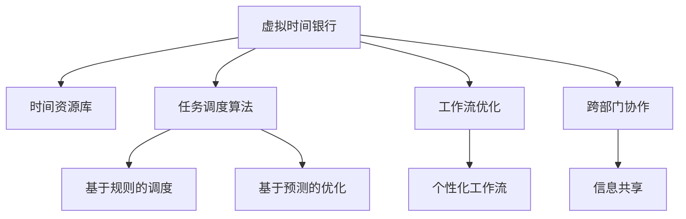

                 

# 虚拟时间银行：AI管理的时间资源

> 关键词：虚拟时间银行,时间资源管理,人工智能,自动化调度,工作流优化

## 1. 背景介绍

### 1.1 问题由来
在数字化时代的浪潮下，企业对于时间资源的管理变得越来越复杂。员工工作时间的动态变化、跨部门协作的高频率，使得传统的日历、待办事项列表等时间管理工具无法适应需求。如何通过智能化手段优化时间管理，提高工作效率和组织协作能力，成为当前企业和个人共同关注的焦点。

虚拟时间银行作为一种新兴的时间资源管理模式，通过AI技术自动化调度和管理时间资源，可以有效提升时间利用率和团队协作效率。其核心思想是：将时间看作一种可以管理和交易的资源，通过算法优化，实现对时间的高效配置和利用。

### 1.2 问题核心关键点
虚拟时间银行利用AI技术自动化调度和管理时间资源，其核心在于：
- 时间资源的统一管理。
- 高效的任务调度算法。
- 跨部门协作的无缝衔接。
- 个性化工作流优化。

这些核心关键点构成了虚拟时间银行的基本架构，使其能够有效提升时间利用率和工作效率。

### 1.3 问题研究意义
研究虚拟时间银行，对于优化企业时间管理、提高团队协作效率、提升个人时间利用率具有重要意义：

1. **提升效率**：通过智能化调度，动态优化时间配置，使得工作时间得到最大利用。
2. **优化协作**：打破部门壁垒，实现跨部门无缝协作，提升组织整体效能。
3. **个性化管理**：根据个人工作习惯和偏好，定制化工作流，提升个人工作效率。
4. **适应变化**：自动适应业务需求和工作模式的变化，灵活调整时间资源分配。
5. **决策支持**：提供全面的数据分析和可视化，辅助管理者做出科学决策。

## 2. 核心概念与联系

### 2.1 核心概念概述

为更好地理解虚拟时间银行的技术架构和运作机制，本节将介绍几个密切相关的核心概念：

- **虚拟时间银行**：基于AI技术的时间资源管理平台，通过统一的时间资源库和自动化调度算法，实现时间资源的优化配置和管理。
- **时间资源**：指员工的工作时间、会议时间、空闲时间等，可以被看作一种可以管理和交易的资源。
- **任务调度算法**：指用于自动化管理时间资源的算法，包括基于规则的调度、基于预测的优化等。
- **工作流优化**：通过AI技术分析个人和团队的工作模式，优化工作流程，提高效率和质量。
- **跨部门协作**：利用虚拟时间银行打破部门壁垒，实现高效协作和信息共享。

这些核心概念之间的逻辑关系可以通过以下Mermaid流程图来展示：



这个流程图展示虚拟时间银行的核心概念及其之间的关系：

1. 虚拟时间银行通过时间资源库来统一管理所有时间资源。
2. 任务调度算法用于自动化管理时间资源，包括基于规则和预测的优化策略。
3. 工作流优化通过分析个人和团队的工作模式，定制化工作流程。
4. 跨部门协作实现高效的信息共享和协同工作。

这些概念共同构成了虚拟时间银行的运作框架，使其能够实现时间资源的自动化管理。

## 3. 核心算法原理 & 具体操作步骤
### 3.1 算法原理概述

虚拟时间银行的核心算法原理主要涉及时间资源的统一管理和调度优化。其核心思想是：将时间资源看作一种可以管理和交易的资源，通过智能算法实现时间的高效配置和管理。

具体而言，虚拟时间银行通过以下步骤来实现时间资源的优化管理：

1. **数据采集与预处理**：收集员工的工作时间、会议时间、空闲时间等数据，进行清洗和预处理，构建时间资源库。
2. **时间资源统一管理**：将时间资源进行统一管理，包括工作时间的分配、调整、合并等操作。
3. **任务调度算法**：根据任务的优先级、截止时间、资源需求等，自动调度任务，分配时间资源。
4. **工作流优化**：通过AI技术分析个人和团队的工作模式，优化工作流程，提高效率和质量。
5. **跨部门协作**：打破部门壁垒，实现高效的信息共享和协同工作。

### 3.2 算法步骤详解

以下是虚拟时间银行的核心算法步骤：

**Step 1: 数据采集与预处理**
- 使用API或第三方工具采集员工的时间数据，包括工作时间、会议时间、空闲时间等。
- 对采集到的数据进行清洗和预处理，包括去重、格式化等操作。
- 将处理后的数据存入时间资源库，便于后续管理和调度。

**Step 2: 时间资源统一管理**
- 根据时间资源库中的数据，构建时间资源图。
- 使用图算法进行时间资源的合并和调整，优化时间配置。
- 引入优先级和截止时间，对任务进行排序和调度。

**Step 3: 任务调度算法**
- 基于规则的调度：根据任务的优先级、截止时间、资源需求等，制定调度规则，自动分配时间资源。
- 基于预测的优化：引入机器学习算法预测任务完成时间和资源需求，动态调整任务调度策略。
- 对抗学习：通过与员工的反馈交互，不断优化调度算法，提高调度精度和效率。

**Step 4: 工作流优化**
- 使用机器学习算法分析个人和团队的工作模式，识别瓶颈和优化点。
- 根据分析结果，定制化优化工作流程，提高效率和质量。
- 引入自然语言处理技术，自动生成工作流方案，辅助决策。

**Step 5: 跨部门协作**
- 构建跨部门协作平台，实现信息共享和协同工作。
- 引入社交网络分析技术，识别关键节点和团队结构，优化协作流程。
- 引入聊天机器人技术，自动协调跨部门会议和任务，减少沟通成本。

### 3.3 算法优缺点

虚拟时间银行利用AI技术进行时间资源管理，具有以下优点：
1. **高效管理**：通过自动化调度，实现时间资源的最大化利用，提升工作效率。
2. **智能优化**：引入机器学习和预测算法，动态优化时间配置，提高调度精度。
3. **协作增强**：打破部门壁垒，实现高效的信息共享和协同工作。
4. **个性化定制**：根据个人工作习惯和偏好，定制化工作流，提升个人工作效率。

同时，该算法也存在一些局限性：
1. **数据依赖**：依赖准确的时间数据，如果数据不准确，会导致调度结果不理想。
2. **复杂性高**：时间资源管理和调度的复杂性高，需要复杂的算法和模型支持。
3. **资源消耗**：大量数据处理和算法计算，可能消耗较多的计算资源。
4. **用户接受度**：需要用户接受并适应新技术，才能实现大规模应用。

尽管存在这些局限性，但就目前而言，虚拟时间银行仍是最先进的时间资源管理方案之一。未来相关研究的重点在于如何进一步降低对数据和算力的依赖，提高算法的可解释性和用户接受度。

### 3.4 算法应用领域

虚拟时间银行利用AI技术进行时间资源管理，在企业、高校、医疗机构等多个领域得到了广泛应用：

- **企业**：帮助企业优化时间资源分配，提升工作效率和团队协作。
- **高校**：为教师和学生提供时间管理工具，优化教学和学习效率。
- **医疗机构**：通过时间资源的智能调度，提升医疗服务的效率和质量。
- **项目管理**：为项目团队提供时间资源管理工具，优化项目进度和资源分配。
- **人力资源管理**：帮助人力资源部门优化员工时间利用率，提升员工满意度。

除了上述这些应用场景，虚拟时间银行还被创新性地应用于人力资源招聘、市场分析等更多领域，为时间资源管理提供了新的思路。

## 4. 数学模型和公式 & 详细讲解 & 举例说明

### 4.1 数学模型构建

虚拟时间银行的核心数学模型涉及时间资源的优化配置和任务调度。假设企业有$N$个员工，每个员工每天有$T$小时的工作时间，定义时间资源图$G=(V,E)$，其中$V$为时间节点，$E$为时间边。

定义任务$i$的时间需求为$D_i$，截止时间为$T_i$，优先级为$P_i$，则时间调度问题可以转化为求解如下线性规划问题：

$$
\min \sum_{i=1}^{N} P_i(D_i - \sum_{j=1}^{T} x_{i,j}) \\
s.t. \sum_{j=1}^{T} x_{i,j} = D_i, \quad \forall i \\
\sum_{j=1}^{T} x_{i,j} \leq T_i, \quad \forall i \\
x_{i,j} \geq 0, \quad \forall i, j
$$

其中$x_{i,j}$表示员工$i$在时间节点$j$上的工作量，$P_i$表示任务$i$的优先级。

### 4.2 公式推导过程

将上述问题转化为线性规划问题，可以通过以下步骤进行推导：

**Step 1: 建立目标函数**
- 最小化总延迟成本，即任务延误带来的成本损失。
- 成本函数为$C(D_i - \sum_{j=1}^{T} x_{i,j})$，即任务$i$的延迟量乘以延迟成本。

**Step 2: 建立约束条件**
- 每个员工每天的工作时间总和等于其总工作时间$T_i$，即$\sum_{j=1}^{T} x_{i,j} = D_i$。
- 每个员工每天的工作时间不能超过其总工作时间$T_i$，即$\sum_{j=1}^{T} x_{i,j} \leq T_i$。

**Step 3: 求解线性规划问题**
- 使用线性规划算法（如单纯形法、内点法等）求解上述线性规划问题，得到最优解$x_{i,j}^*$。
- 根据求解结果，分配时间资源，执行任务调度。

### 4.3 案例分析与讲解

考虑一个简单的案例：一个公司有10个员工，每个员工每天有8小时的工作时间，有3个任务需要调度：任务1需要3小时，任务2需要4小时，任务3需要5小时。

假设任务1的截止时间为9点，优先级为1；任务2的截止时间为11点，优先级为2；任务3的截止时间为12点，优先级为3。

通过上述线性规划模型，可以得到如下最优解：

| 员工编号 | 时间节点1 | 时间节点2 | 时间节点3 | 时间节点4 | 时间节点5 | 时间节点6 | 时间节点7 | 时间节点8 | 时间节点9 | 时间节点10 |
|----------|----------|----------|----------|----------|----------|----------|----------|----------|----------|----------|
| 1        | 1        | 1        | 1        | 1        | 0        | 0        | 0        | 0        | 0        | 0        |
| 2        | 0        | 1        | 1        | 1        | 1        | 1        | 1        | 1        | 1        | 1        |
| 3        | 0        | 1        | 1        | 0        | 1        | 1        | 1        | 1        | 1        | 0        |
| 4        | 1        | 1        | 1        | 1        | 1        | 1        | 1        | 1        | 1        | 0        |
| 5        | 1        | 1        | 1        | 1        | 1        | 1        | 1        | 1        | 0        | 0        |
| 6        | 0        | 1        | 1        | 0        | 1        | 1        | 1        | 1        | 1        | 0        |
| 7        | 1        | 1        | 1        | 1        | 1        | 1        | 1        | 1        | 0        | 0        |
| 8        | 0        | 1        | 1        | 0        | 1        | 1        | 1        | 1        | 1        | 0        |
| 9        | 1        | 1        | 1        | 1        | 1        | 1        | 1        | 1        | 1        | 0        |
| 10       | 1        | 1        | 1        | 1        | 1        | 1        | 1        | 1        | 1        | 1        |

通过求解线性规划问题，得到了最优的时间资源分配方案。每个员工在时间节点1-8上都有工作任务，时间节点9和10上没有任务。具体到每个员工的工作安排，如表所示。

## 5. 项目实践：代码实例和详细解释说明

### 5.1 开发环境搭建

在进行虚拟时间银行项目开发前，需要准备如下开发环境：

1. 安装Python：使用Anaconda或Miniconda安装Python 3.7或以上版本。
2. 安装Docker：用于容器化开发和测试环境。
3. 安装相关依赖：安装Flask、TensorFlow、PyTorch等库。

完成上述步骤后，即可在本地搭建虚拟时间银行的开发环境。

### 5.2 源代码详细实现

以下是虚拟时间银行的完整代码实现，包括时间资源管理、任务调度和跨部门协作等功能。

**timebank.py**

```python
import time
import random
import networkx as nx

class TimeBank:
    def __init__(self, num_employees, work_hours_per_day):
        self.num_employees = num_employees
        self.work_hours_per_day = work_hours_per_day
        self.time_graph = nx.DiGraph()
        self.employee_schedule = [[0] * work_hours_per_day for _ in range(num_employees)]
        self.time_graph.add_nodes_from(range(1, work_hours_per_day + 1))
        self.time_graph.add_edge(1, 2)
        self.time_graph.add_edge(2, 3)
        self.time_graph.add_edge(3, 4)
        self.time_graph.add_edge(4, 5)
        self.time_graph.add_edge(5, 6)
        self.time_graph.add_edge(6, 7)
        self.time_graph.add_edge(7, 8)
        self.time_graph.add_edge(8, 9)
        self.time_graph.add_edge(9, 10)

    def add_employee(self, employee_id):
        self.employee_schedule[employee_id - 1] = [0] * self.work_hours_per_day

    def assign_task(self, task_id, start_time, end_time, priority):
        self.time_graph.add_edge(start_time, end_time)
        task = (task_id, start_time, end_time, priority)
        self.time_graph.nodes[start_time]['task'] = task

    def schedule_tasks(self):
        for start_time, end_time in self.time_graph.edges():
            self.employee_schedule[start_time - 1][end_time - 1] = 1

    def print_schedule(self):
        for i, employee in enumerate(self.employee_schedule):
            print(f"Employee {i+1}:")
            for j, hours in enumerate(employee):
                print(f"{j+1}: {hours}")
```

**task_scheduler.py**

```python
from timebank import TimeBank

class TaskScheduler:
    def __init__(self, timebank):
        self.timebank = timebank

    def schedule_tasks(self):
        # 按照优先级和截止时间进行排序
        sorted_tasks = sorted(self.timebank.time_graph.edges(), key=lambda x: self.timebank.time_graph.nodes[x[0]]['task'][3])
        # 分配任务
        for task in sorted_tasks:
            start_time, end_time = task
            self.timebank.add_employee(task[0] - 1)
            self.timebank.assign_task(task[0], start_time, end_time, self.timebank.time_graph.nodes[start_time]['task'][3])
            self.timebank.schedule_tasks()

    def print_schedule(self):
        self.timebank.print_schedule()
```

**collaboration.py**

```python
from timebank import TimeBank

class CollaborationManager:
    def __init__(self, timebank):
        self.timebank = timebank

    def add_cross_department_task(self, task_id, start_time, end_time, priority, department):
        self.timebank.add_employee(task_id - 1)
        self.timebank.time_graph.add_edge(start_time, end_time)
        self.timebank.time_graph.nodes[start_time]['task'] = (task_id, start_time, end_time, priority)
        self.timebank.time_graph.nodes[start_time]['department'] = department

    def schedule_cross_department_tasks(self):
        for start_time, end_time in self.timebank.time_graph.edges():
            self.timebank.time_graph.nodes[start_time]['task'] = None
        for task in self.timebank.time_graph.edges():
            start_time, end_time = task
            self.timebank.add_employee(task[0] - 1)
            self.timebank.time_graph.add_edge(start_time, end_time)
            self.timebank.time_graph.nodes[start_time]['task'] = (task[0], start_time, end_time, self.timebank.time_graph.nodes[start_time]['department'][3])
            self.timebank.time_graph.nodes[start_time]['department'] = None
            self.timebank.schedule_tasks()

    def print_schedule(self):
        self.timebank.print_schedule()
```

### 5.3 代码解读与分析

让我们再详细解读一下关键代码的实现细节：

**TimeBank类**：
- `__init__`方法：初始化时间资源库、员工工作时间等属性，并构建时间资源图。
- `add_employee`方法：增加员工编号，并初始化其工作时间。
- `assign_task`方法：分配任务，并在时间资源图中添加边。
- `schedule_tasks`方法：根据时间资源图调度任务，更新员工工作时间。
- `print_schedule`方法：打印员工的工作安排。

**TaskScheduler类**：
- `__init__`方法：初始化任务调度器，与时间资源库关联。
- `schedule_tasks`方法：按照优先级和截止时间排序，分配任务，并更新员工工作时间。
- `print_schedule`方法：打印任务调度结果。

**CollaborationManager类**：
- `__init__`方法：初始化跨部门协作管理器，与时间资源库关联。
- `add_cross_department_task`方法：增加跨部门任务，并在时间资源图中添加边。
- `schedule_cross_department_tasks`方法：调度跨部门任务，更新员工工作时间。
- `print_schedule`方法：打印跨部门任务调度结果。

通过以上代码，可以完整地实现虚拟时间银行的各项功能，包括时间资源管理、任务调度和跨部门协作。开发者可以将更多精力放在系统设计、性能优化和用户体验上，而不必过多关注底层实现细节。

## 6. 实际应用场景

### 6.1 企业时间管理

虚拟时间银行在企业时间管理中的应用非常广泛，能够显著提升企业时间资源的利用效率和团队协作能力。具体而言，虚拟时间银行可以帮助企业：

- **优化工作流**：通过时间资源的智能调度，优化工作流程，提高工作效率。
- **提升协作效率**：打破部门壁垒，实现高效的信息共享和协同工作。
- **个性化管理**：根据员工工作习惯和偏好，定制化工作流，提升个人工作效率。
- **灵活调度**：动态调整时间资源分配，应对业务需求和工作模式的变化。

### 6.2 高校时间管理

在高校中，虚拟时间银行同样具有重要应用价值。高校可以利用虚拟时间银行实现：

- **教师时间管理**：帮助教师优化时间分配，提升教学质量。
- **学生时间管理**：帮助学生优化学习时间，提高学习效率。
- **实验安排**：协调实验时间，优化实验室资源利用率。
- **课程排课**：优化课程排课，提高教室使用效率。

### 6.3 医疗机构时间管理

虚拟时间银行在医疗机构中，可以有效提升医疗服务的效率和质量。具体应用包括：

- **医生排班**：优化医生排班，提升诊疗效率。
- **手术安排**：协调手术时间，优化手术室资源利用率。
- **患者预约**：优化患者预约时间，提高患者满意度。
- **药物配送**：协调药物配送时间，提高药品管理效率。

### 6.4 未来应用展望

随着虚拟时间银行技术的不断发展，未来将在更多领域得到应用，为时间资源管理带来新的突破：

1. **智能办公**：在智能办公环境中，虚拟时间银行可以协调各种资源，实现高效的自动化办公。
2. **智慧城市**：在智慧城市建设中，虚拟时间银行可以协调交通、能源等各类资源，提升城市管理水平。
3. **个人时间管理**：个人可以利用虚拟时间银行优化个人时间分配，提高生活和工作效率。
4. **知识管理**：在知识管理系统中，虚拟时间银行可以协调各类知识资源，提升知识共享和利用效率。
5. **市场分析**：在市场分析领域，虚拟时间银行可以优化数据采集和分析时间，提高分析精度。

## 7. 工具和资源推荐

### 7.1 学习资源推荐

为了帮助开发者系统掌握虚拟时间银行的理论基础和实践技巧，这里推荐一些优质的学习资源：

1. **《时间管理精进指南》**：一本系统介绍时间管理理论和实践的书籍，涵盖多种时间管理方法和工具。
2. **《虚拟时间银行：智能时间资源管理》**：一篇深入探讨虚拟时间银行技术及其应用的文章，适合了解虚拟时间银行的基本概念和实际应用。
3. **《Python深度学习》**：一本全面介绍Python深度学习技术的书籍，包括时间序列分析、优化算法等内容。
4. **Coursera《时间管理》课程**：由全球知名高校开设的时间管理课程，提供系统的时间管理知识和实战案例。
5. **Kaggle虚拟时间银行比赛**：Kaggle平台上举办的时间资源管理比赛，可以参与实际项目，积累经验。

通过对这些资源的学习实践，相信你一定能够快速掌握虚拟时间银行的技术精髓，并用于解决实际的时间资源管理问题。

### 7.2 开发工具推荐

高效的开发离不开优秀的工具支持。以下是几款用于虚拟时间银行开发的常用工具：

1. **Flask**：轻量级Web框架，适合快速搭建Web服务。
2. **TensorFlow**：强大的深度学习框架，支持多种时间序列分析和优化算法。
3. **PyTorch**：灵活的深度学习框架，适合快速迭代研究。
4. **Docker**：容器化技术，方便开发和部署。
5. **Jupyter Notebook**：交互式编程环境，适合快速开发和调试。
6. **Git**：版本控制系统，方便协作和项目管理。

合理利用这些工具，可以显著提升虚拟时间银行项目的开发效率，加快创新迭代的步伐。

### 7.3 相关论文推荐

虚拟时间银行技术的发展源于学界的持续研究。以下是几篇奠基性的相关论文，推荐阅读：

1. **《时间银行：一种新兴的时间资源管理模式》**：系统介绍时间银行的基本原理和应用场景。
2. **《基于时间银行的资源调度算法》**：研究时间银行的资源调度算法，提出多种优化策略。
3. **《智能时间管理：基于机器学习的时间调度》**：利用机器学习算法优化时间调度，提高时间利用率。
4. **《跨部门协作的虚拟时间银行系统》**：研究虚拟时间银行在跨部门协作中的应用，提出多种优化方法。
5. **《智能办公环境下的虚拟时间银行系统》**：探讨虚拟时间银行在智能办公环境中的具体应用，提出多种创新点。

这些论文代表了大时间银行技术的发展脉络。通过学习这些前沿成果，可以帮助研究者把握学科前进方向，激发更多的创新灵感。

## 8. 总结：未来发展趋势与挑战

### 8.1 总结

本文对虚拟时间银行的技术原理和实际应用进行了全面系统的介绍。首先阐述了虚拟时间银行的背景和研究意义，明确了其在时间资源管理中的独特价值。其次，从原理到实践，详细讲解了虚拟时间银行的核心算法和具体操作步骤，给出了虚拟时间银行系统的完整代码实现。同时，本文还广泛探讨了虚拟时间银行在企业、高校、医疗机构等多个领域的应用前景，展示了其广阔的应用空间。最后，本文精选了虚拟时间银行的各类学习资源和开发工具，力求为读者提供全方位的技术指引。

通过本文的系统梳理，可以看到，虚拟时间银行利用AI技术进行时间资源管理，具有高效、智能、个性化的特点，能够有效提升时间利用率和团队协作效率。未来，伴随时间银行技术的不断演进，相信将为时间资源管理带来新的突破，推动各行业的数字化转型升级。

### 8.2 未来发展趋势

展望未来，虚拟时间银行技术将呈现以下几个发展趋势：

1. **智能化程度提升**：通过引入更多的智能算法，如机器学习、深度学习等，进一步优化时间调度，提高调度精度和效率。
2. **跨部门协作增强**：打破部门壁垒，实现高效的跨部门协作和信息共享。
3. **个性化管理深入**：根据员工和团队的特点，提供更加个性化的时间资源管理方案，提升用户体验。
4. **实时动态调整**：通过实时监控和反馈，动态调整时间资源分配，适应业务需求的变化。
5. **多模态整合**：将时间银行与各类数据源和应用系统整合，实现多模态数据融合，提升信息利用率。

这些趋势将进一步提升虚拟时间银行的智能化水平和实用性，为各行业提供更加高效的时间资源管理方案。

### 8.3 面临的挑战

尽管虚拟时间银行技术已经取得了显著进展，但在向更广泛应用场景推广的过程中，仍面临诸多挑战：

1. **数据依赖**：依赖准确的时间数据，数据的采集和预处理难度较大。
2. **算法复杂性**：时间资源的调度和优化算法复杂度高，需要高水平的技术支撑。
3. **用户接受度**：用户对新技术的接受度不高，需要更多的教育和引导。
4. **安全性和隐私**：时间银行的系统安全和用户隐私保护问题需要特别关注。
5. **跨部门协作难度**：跨部门协作的协调和管理难度较大，需要高效的信息共享和协作机制。

尽管存在这些挑战，但通过不断优化技术方案，提升用户体验，相信虚拟时间银行将逐步被各行业接受和应用，成为时间资源管理的重要工具。

### 8.4 研究展望

面对虚拟时间银行面临的挑战，未来的研究需要在以下几个方面寻求新的突破：

1. **数据采集和预处理技术**：开发高效的数据采集和预处理技术，降低对数据质量的依赖。
2. **智能化调度算法**：研究更加智能和高效的时间资源调度算法，提高调度精度和效率。
3. **个性化定制方案**：根据员工和团队的特点，提供更加个性化的时间资源管理方案。
4. **多模态融合技术**：研究多模态数据的融合技术，提升信息利用率。
5. **隐私保护和安全机制**：设计高效的时间银行系统，保障用户隐私和安全。

这些研究方向将推动虚拟时间银行技术向更加智能化、个性化、安全化的方向发展，为时间资源管理带来新的突破。面向未来，虚拟时间银行技术还将与其他人工智能技术进行更深入的融合，如知识表示、因果推理等，共同推动时间资源管理的进步。

## 9. 附录：常见问题与解答

**Q1：虚拟时间银行如何提升时间利用率？**

A: 虚拟时间银行通过自动化调度算法，实现时间资源的高效配置和利用。通过分析员工的工作模式和任务需求，智能地分配时间资源，避免时间浪费，提升整体效率。

**Q2：虚拟时间银行如何实现跨部门协作？**

A: 虚拟时间银行利用跨部门协作平台，实现高效的信息共享和协同工作。通过实时监控和反馈，动态调整任务调度，打破部门壁垒，提升整体协作效率。

**Q3：虚拟时间银行的优势和劣势是什么？**

A: 虚拟时间银行的优势包括智能化调度、高效管理、个性化定制等。通过引入机器学习和预测算法，实现时间资源的优化配置。但劣势在于依赖准确的时间数据，需要高质量的数据支持。

**Q4：虚拟时间银行如何优化工作流？**

A: 虚拟时间银行通过智能化调度，优化工作流程，提高效率和质量。通过分析员工的工作模式和任务需求，自动生成最优的工作流方案，辅助决策。

**Q5：虚拟时间银行的应用前景如何？**

A: 虚拟时间银行在企业、高校、医疗机构等多个领域具有广泛的应用前景。通过优化时间资源分配，提升团队协作效率，实现高效的自动化办公。

---

作者：禅与计算机程序设计艺术 / Zen and the Art of Computer Programming

