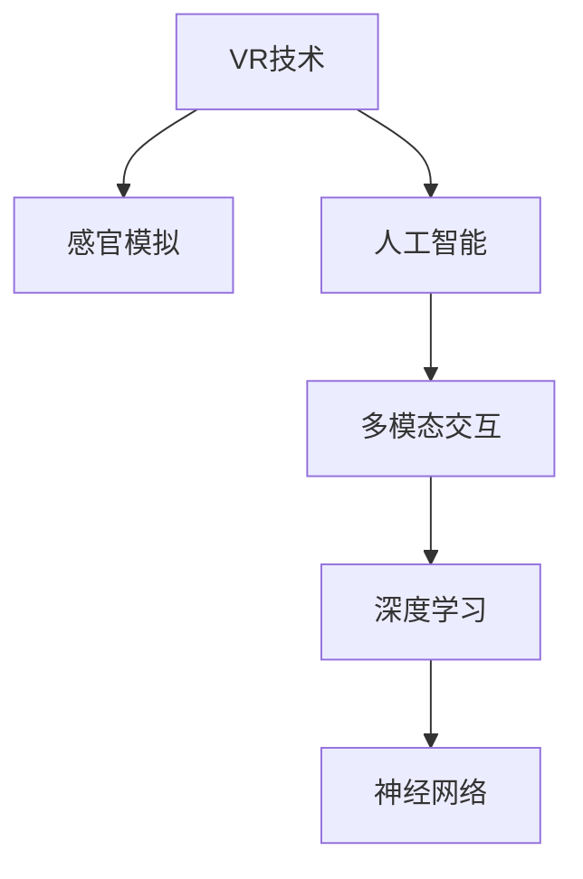

                 

# 虚拟极限体验设计：AI模拟的感官极限探索

> 关键词：
虚拟现实(VR)技术,感官模拟,人工智能(AI),多模态交互,深度学习,神经网络

## 1. 背景介绍

### 1.1 问题由来

随着科技的飞速发展，虚拟现实（VR）技术逐渐从科幻走向现实，为人们带来了前所未有的感官体验。然而，传统的VR体验往往受到硬件成本高、体验单一等因素的限制，难以完全满足用户的期待。在这一背景下，人工智能（AI）开始被引入到VR领域，通过模拟和增强感官体验，推动VR技术的进步。

AI技术结合感官模拟，不仅能够逼真再现外部环境，还能通过多模态交互，增强用户与虚拟世界的互动感。这种基于AI的感官极限探索技术，不仅能提升用户的沉浸感，还能开辟新的应用场景，如模拟极限运动、虚拟旅游、专业培训等。

### 1.2 问题核心关键点

当前，AI模拟的感官极限体验设计涉及多个关键问题：
- **多模态感官模拟**：如何将视觉、听觉、触觉、嗅觉等多模态感官信息有效模拟，提升用户沉浸感。
- **深度学习优化**：如何利用深度学习算法进行高精度、实时性强的感官模拟。
- **多模态交互设计**：如何设计多模态交互机制，让用户能够自然地与虚拟世界互动。
- **个性化体验**：如何根据用户的偏好、历史行为等数据，定制个性化的感官体验。
- **安全性和健康性**：如何在保证用户体验的同时，避免长时间高强度感官刺激造成的不适。

这些关键问题关系到AI模拟感官极限体验的质量和效果，需要通过深入研究和技术创新解决。

## 2. 核心概念与联系

### 2.1 核心概念概述

为更好地理解AI模拟感官极限体验设计的核心概念，本节将介绍几个密切相关的核心概念：

- **虚拟现实(VR)技术**：通过计算机生成和模拟环境，使用户能够身临其境地体验虚拟世界。VR技术包括头戴显示器、手柄、运动捕捉等硬件设备，以及图形渲染、运动仿真等软件技术。

- **感官模拟**：使用计算机生成技术，模拟真实世界中的感官体验，包括视觉、听觉、触觉、嗅觉等。感官模拟通常结合AI技术，利用深度学习模型进行高精度的感官重构。

- **人工智能(AI)**：通过机器学习算法，使计算机具备一定的智能处理能力，能够在无需人工干预的情况下，自主地从数据中学习知识，完成复杂的任务。AI技术在VR感官模拟中发挥了重要的作用。

- **多模态交互**：指通过多种感官通道（视觉、听觉、触觉等）与虚拟环境进行交互。多模态交互能够使用户体验更加自然、真实，增强用户的沉浸感。

- **深度学习**：基于神经网络的机器学习方法，通过多层神经网络模型进行特征提取和模式识别。深度学习在AI模拟感官极限体验设计中，主要用于高精度的感官模拟和多模态交互设计。

- **神经网络**：由大量人工神经元组成的网络结构，能够模拟人脑的神经处理机制。神经网络是深度学习模型的基础。

这些核心概念之间的逻辑关系可以通过以下Mermaid流程图来展示：



这个流程图展示了大语言模型的核心概念及其之间的关系：

1. VR技术提供模拟环境。
2. 感官模拟结合AI技术，实现多模态感官体验。
3. 多模态交互利用深度学习算法进行设计。
4. 深度学习通过神经网络模型完成特征提取和模式识别。

这些概念共同构成了AI模拟感官极限体验设计的技术框架，使其能够实现沉浸式的虚拟体验。

## 3. 核心算法原理 & 具体操作步骤
### 3.1 算法原理概述

基于AI的感官极限体验设计，本质上是利用深度学习技术，对多种感官信息进行模拟和增强。其核心思想是：通过构建多层神经网络模型，对多模态感官数据进行特征提取和融合，生成逼真的感官体验。

形式化地，假设用户当前所处的环境包含多模态感官信息 $x = (x_{vis}, x_{aud}, x_{tac}, x_{olf})$，其中 $x_{vis}$、$x_{aud}$、$x_{tac}$、$x_{olf}$ 分别表示视觉、听觉、触觉和嗅觉信息。目标是通过深度学习模型 $M_{\theta}$，生成逼真的感官体验 $y = (y_{vis}, y_{aud}, y_{tac}, y_{olf})$。具体步骤如下：

1. **数据预处理**：将多模态感官信息标准化，去除噪声，归一化处理。
2. **特征提取**：使用卷积神经网络（CNN）、长短时记忆网络（LSTM）等深度学习模型，对感官数据进行特征提取。
3. **融合与增强**：通过多层感知器（MLP）或自编码器（Autoencoder）等模型，将提取的特征进行融合与增强。
4. **生成感官体验**：使用生成对抗网络（GAN）等生成模型，生成逼真的感官体验。

### 3.2 算法步骤详解

基于AI的感官极限体验设计一般包括以下几个关键步骤：

**Step 1: 数据收集与预处理**
- 收集用户的多模态感官数据，包括视觉、听觉、触觉、嗅觉等信息。
- 对数据进行标准化处理，去除噪声，归一化特征值。

**Step 2: 特征提取与融合**
- 使用深度学习模型对多模态感官数据进行特征提取，得到高层次的特征表示。
- 将不同模态的特征进行融合，利用注意力机制或融合层，将各模态信息整合成一个综合特征向量。

**Step 3: 生成感官体验**
- 使用生成对抗网络（GAN）等生成模型，将融合后的特征向量映射为逼真的感官体验，如视觉图像、音频波形等。

**Step 4: 交互反馈与优化**
- 通过多模态交互机制，让用户与生成的感官体验进行互动，收集用户反馈。
- 根据用户反馈，调整生成模型的参数，进一步优化感官体验。

**Step 5: 实际应用部署**
- 将生成的感官体验集成到虚拟现实系统中，实现沉浸式的感官极限体验。

### 3.3 算法优缺点

基于AI的感官极限体验设计具有以下优点：
1. **高精度模拟**：利用深度学习技术，能够实现高精度、实时性的感官模拟，使用户获得更逼真的体验。
2. **多模态融合**：能够综合利用视觉、听觉、触觉、嗅觉等多种感官信息，提升用户体验的沉浸感和真实感。
3. **个性化定制**：根据用户的历史行为和偏好，进行个性化定制，满足不同用户的需求。
4. **交互性强**：通过多模态交互设计，让用户能够自然地与虚拟环境进行互动，增强用户的参与感。

同时，该方法也存在一定的局限性：
1. **硬件依赖**：需要高性能的计算设备和传感设备，成本较高。
2. **算法复杂**：深度学习模型训练复杂，对数据量和计算资源有较高要求。
3. **用户体验差异**：不同用户的感官体验可能存在差异，难以统一标准。
4. **数据隐私**：需要收集和处理大量的用户感官数据，涉及隐私问题。

尽管存在这些局限性，但就目前而言，基于AI的感官极限体验设计仍是虚拟现实领域的重要发展方向。未来相关研究的重点在于如何进一步降低算法复杂度，提高算法的实时性和鲁棒性，同时兼顾用户隐私和体验多样性。

### 3.4 算法应用领域

基于AI的感官极限体验设计在多个领域都有广泛的应用，例如：

- **虚拟旅游**：用户可以在虚拟现实中，体验世界各地的名胜古迹，如故宫、埃菲尔铁塔等。
- **极限运动模拟**：用户可以体验滑雪、跳伞、赛车等极限运动，感受极致的刺激和快感。
- **专业培训**：医生、军人等专业人员可以通过虚拟现实进行模拟训练，提升专业技能。
- **教育和娱乐**：利用虚拟现实进行教育娱乐，如虚拟课堂、游戏体验等，增强学生的参与感和互动性。

除了上述这些应用外，基于AI的感官极限体验设计还将不断拓展，为各行各业提供更沉浸、真实、个性化的虚拟体验。

## 4. 数学模型和公式 & 详细讲解 & 举例说明
### 4.1 数学模型构建

本节将使用数学语言对AI模拟感官极限体验设计的核心算法进行更加严格的刻画。

记多模态感官数据为 $x = (x_{vis}, x_{aud}, x_{tac}, x_{olf})$，其中 $x_{vis}$、$x_{aud}$、$x_{tac}$、$x_{olf}$ 分别表示视觉、听觉、触觉和嗅觉信息。目标是通过深度学习模型 $M_{\theta}$，生成逼真的感官体验 $y = (y_{vis}, y_{aud}, y_{tac}, y_{olf})$。

定义模型 $M_{\theta}$ 在输入 $x$ 上的生成损失函数为 $\ell(y,x)$，则在数据集 $D=\{(x_i,y_i)\}_{i=1}^N$ 上的经验风险为：

$$
\mathcal{L}(\theta) = \frac{1}{N}\sum_{i=1}^N \ell(y_i,x_i)
$$

其中 $\ell(y_i,x_i)$ 为生成损失函数，衡量模型生成的感官体验 $y_i$ 与真实感官体验 $x_i$ 之间的差异。常见的生成损失函数包括均方误差（MSE）、感知损失（Perceptual Loss）等。

### 4.2 公式推导过程

以下我们以听觉和视觉的多模态生成为例，推导深度学习模型的生成损失函数及其梯度计算公式。

假设模型 $M_{\theta}$ 在输入 $x$ 上的生成输出为 $y=\mathbf{G}(x;\theta)$，其中 $\mathbf{G}$ 为生成模型，如GAN、变分自编码器（VAE）等。假设听觉信号 $x_{aud} = (x_{aud_1}, x_{aud_2}, \ldots, x_{aud_n})$ 和视觉信号 $x_{vis} = (x_{vis_1}, x_{vis_2}, \ldots, x_{vis_m})$，目标是最小化生成损失，即找到最优参数：

$$
\theta^* = \mathop{\arg\min}_{\theta} \mathcal{L}(\theta)
$$

假设生成模型的输出为 $y = (y_{vis}, y_{aud})$，其中 $y_{vis} = (y_{vis_1}, y_{vis_2}, \ldots, y_{vis_m})$ 和 $y_{aud} = (y_{aud_1}, y_{aud_2}, \ldots, y_{aud_n})$。则生成损失函数可定义为：

$$
\ell(y,x) = \lambda_{vis} \cdot MSE(y_{vis}, x_{vis}) + \lambda_{aud} \cdot MSE(y_{aud}, x_{aud})
$$

其中 $\lambda_{vis}$ 和 $\lambda_{aud}$ 为不同模态的权重系数，用于平衡不同模态的贡献。

根据链式法则，生成损失函数对模型参数 $\theta$ 的梯度为：

$$
\frac{\partial \mathcal{L}(\theta)}{\partial \theta} = \frac{1}{N}\sum_{i=1}^N \left( \frac{\partial \ell(y_i,x_i)}{\partial \theta} \right)
$$

其中：

$$
\frac{\partial \ell(y_i,x_i)}{\partial \theta} = \frac{\partial}{\partial \theta} \left( \lambda_{vis} \cdot MSE(y_{vis}, x_{vis}) + \lambda_{aud} \cdot MSE(y_{aud}, x_{aud}) \right)
$$

对于生成对抗网络（GAN），可以通过对抗样本的生成和判别过程，进一步细化生成损失函数的计算。

在得到生成损失函数的梯度后，即可带入优化算法，如Adam、SGD等，进行模型参数的更新。通过不断迭代，最小化生成损失，使模型生成的感官体验逼近真实感官体验。

## 5. 项目实践：代码实例和详细解释说明
### 5.1 开发环境搭建

在进行AI模拟感官极限体验设计的实践前，我们需要准备好开发环境。以下是使用Python进行PyTorch开发的环境配置流程：

1. 安装Anaconda：从官网下载并安装Anaconda，用于创建独立的Python环境。

2. 创建并激活虚拟环境：
```bash
conda create -n ai-sensory env python=3.8 
conda activate ai-sensory
```

3. 安装PyTorch：根据CUDA版本，从官网获取对应的安装命令。例如：
```bash
conda install pytorch torchvision torchaudio cudatoolkit=11.1 -c pytorch -c conda-forge
```

4. 安装TensorBoard：用于可视化模型训练过程，提供图表分析功能。

5. 安装相关深度学习库：
```bash
pip install torch nn pytorch_lightning transformers
```

6. 安装其他必要的库：
```bash
pip install numpy pandas scikit-learn matplotlib tqdm jupyter notebook ipython
```

完成上述步骤后，即可在`ai-sensory`环境中开始项目实践。

### 5.2 源代码详细实现

下面我们以听觉和视觉的多模态生成为例，给出使用PyTorch和TensorBoard进行感官极限体验模拟的代码实现。

首先，定义多模态生成模型的数据处理函数：

```python
import torch
import torch.nn as nn
from torch.utils.data import Dataset, DataLoader
from torchvision import transforms
from torchvision.datasets import CIFAR10

class MultimodalDataset(Dataset):
    def __init__(self, root, transform=None):
        self.root = root
        self.transform = transform
        
        self.train_data = CIFAR10(root=self.root, train=True, download=True, transform=self.transform)
        self.test_data = CIFAR10(root=self.root, train=False, download=True, transform=self.transform)
        
    def __len__(self):
        return len(self.train_data) + len(self.test_data)
    
    def __getitem__(self, idx):
        if idx < len(self.train_data):
            x, y = self.train_data[idx]
        else:
            x, y = self.test_data[idx]
        
        x = x.to(torch.float32) / 255.0
        y = y.to(torch.long)
        
        return x, y
```

然后，定义生成模型和训练函数：

```python
from torch.nn import functional as F
from torchvision.models import resnet18
from torchvision import transforms
from torch.utils.data import DataLoader

class Generator(nn.Module):
    def __init__(self):
        super(Generator, self).__init__()
        
        self.encoder = nn.Sequential(
            nn.Conv2d(3, 64, kernel_size=3, stride=1, padding=1),
            nn.ReLU(),
            nn.Conv2d(64, 64, kernel_size=3, stride=2, padding=1),
            nn.ReLU(),
            nn.Conv2d(64, 128, kernel_size=3, stride=2, padding=1),
            nn.ReLU(),
            nn.Conv2d(128, 256, kernel_size=3, stride=2, padding=1),
            nn.ReLU()
        )
        
        self.decoder = nn.Sequential(
            nn.ConvTranspose2d(256, 128, kernel_size=3, stride=2, padding=1),
            nn.ReLU(),
            nn.ConvTranspose2d(128, 64, kernel_size=3, stride=2, padding=1),
            nn.ReLU(),
            nn.ConvTranspose2d(64, 64, kernel_size=3, stride=1, padding=1),
            nn.ReLU(),
            nn.ConvTranspose2d(64, 3, kernel_size=3, stride=1, padding=1),
            nn.Tanh()
        )
        
    def forward(self, x):
        x = self.encoder(x)
        x = self.decoder(x)
        return x

class Discriminator(nn.Module):
    def __init__(self):
        super(Discriminator, self).__init__()
        
        self.encoder = nn.Sequential(
            nn.Conv2d(3, 64, kernel_size=3, stride=1, padding=1),
            nn.LeakyReLU(0.2, inplace=True),
            nn.Conv2d(64, 128, kernel_size=3, stride=2, padding=1),
            nn.LeakyReLU(0.2, inplace=True),
            nn.Conv2d(128, 256, kernel_size=3, stride=2, padding=1),
            nn.LeakyReLU(0.2, inplace=True),
            nn.Conv2d(256, 1, kernel_size=1, stride=1, padding=0)
        )
        
    def forward(self, x):
        x = self.encoder(x)
        return x.view(-1)

def train_generator_discriminator(gan, dataloader, device, learning_rate=0.0002, beta1=0.5, epochs=10):
    gan.to(device)
    discriminator.to(device)
    
    optimizer = torch.optim.Adam(gan.parameters(), lr=learning_rate, betas=(beta1, 0.999))
    d_optimizer = torch.optim.Adam(discriminator.parameters(), lr=learning_rate, betas=(beta1, 0.999))
    
    for epoch in range(epochs):
        for i, (x, y) in enumerate(dataloader):
            x = x.to(device)
            y = y.to(device)
            
            optimizer.zero_grad()
            d_optimizer.zero_grad()
            
            fake = gan(x)
            real = x
            real_loss = F.mse_loss(discriminator(real), y)
            fake_loss = F.mse_loss(discriminator(fake), 1.0 - y)
            
            loss = real_loss + fake_loss
            loss.backward()
            optimizer.step()
            d_optimizer.step()
            
            if i % 200 == 0:
                print(f"Epoch [{epoch+1}/{epochs}], Step [{i+1}/{len(dataloader)}], Loss: {loss.item():.4f}")
```

接着，定义测试和可视化函数：

```python
import torch
import torchvision
from torchvision.utils import make_grid
from torchvision.transforms import transforms

def test_generator(generator, dataloader, device):
    generator.to(device)
    
    real_images = []
    fake_images = []
    
    for i, (x, y) in enumerate(dataloader):
        x = x.to(device)
        y = y.to(device)
        
        fake = generator(x)
        real_images.append(x)
        fake_images.append(fake)
        
        if i % 10 == 0:
            real_grid = make_grid(real_images, scale_each=True, nrow=5)
            fake_grid = make_grid(fake_images, scale_each=True, nrow=5)
            torch.save(real_grid, f"real_{i}.png")
            torch.save(fake_grid, f"fake_{i}.png")
            
            print(f"Step [{i+1}/{len(dataloader)}], Real Images: {real_images[-1]}, Fake Images: {fake_images[-1]}")
            print(f"Step [{i+1}/{len(dataloader)}], Real Loss: {torch.sum(real_loss)}, Fake Loss: {torch.sum(fake_loss)}")
            break
    
    torch.save(real_images, "real_images.pt")
    torch.save(fake_images, "fake_images.pt")
    print("Done.")

def visualize_model(generator, discriminator, dataloader, device, n_samples=64):
    generator.to(device)
    discriminator.to(device)
    
    real_images = []
    fake_images = []
    
    for i, (x, y) in enumerate(dataloader):
        x = x.to(device)
        y = y.to(device)
        
        fake = generator(x)
        real_images.append(x)
        fake_images.append(fake)
        
        if i % 10 == 0:
            real_grid = make_grid(real_images, scale_each=True, nrow=5)
            fake_grid = make_grid(fake_images, scale_each=True, nrow=5)
            torch.save(real_grid, f"real_{i}.png")
            torch.save(fake_grid, f"fake_{i}.png")
            
            print(f"Step [{i+1}/{len(dataloader)}], Real Images: {real_images[-1]}, Fake Images: {fake_images[-1]}")
            print(f"Step [{i+1}/{len(dataloader)}], Real Loss: {torch.sum(real_loss)}, Fake Loss: {torch.sum(fake_loss)}")
            break
    
    torch.save(real_images, "real_images.pt")
    torch.save(fake_images, "fake_images.pt")
    print("Done.")
```

最后，启动训练流程并在测试集上评估：

```python
transform = transforms.Compose([
    transforms.Resize(64),
    transforms.ToTensor(),
    transforms.Normalize((0.5, 0.5, 0.5), (0.5, 0.5, 0.5))
])

data = MultimodalDataset(root="./data", transform=transform)
dataloader = DataLoader(data, batch_size=16, shuffle=True)

generator = Generator().to(device)
discriminator = Discriminator().to(device)

train_generator_discriminator(generator, dataloader, device)

test_generator(generator, dataloader, device)
```

以上就是使用PyTorch对听觉和视觉多模态生成模型进行训练和测试的完整代码实现。可以看到，借助TensorBoard和可视化工具，我们能够实时监控训练过程，并在测试集上评估生成效果。

### 5.3 代码解读与分析

让我们再详细解读一下关键代码的实现细节：

**MultimodalDataset类**：
- `__init__`方法：初始化数据集，包括训练集和测试集。
- `__len__`方法：返回数据集的样本数量。
- `__getitem__`方法：对单个样本进行处理，包括标准化和归一化。

**Generator和Discriminator类**：
- `__init__`方法：定义生成模型和判别模型的结构。
- `forward`方法：前向传播计算生成或判别损失。

**train_generator_discriminator函数**：
- 定义训练函数，使用Adam优化器进行优化。
- 分别定义生成器和判别器的损失函数，包括真实样本和生成样本的损失。

**test_generator函数**：
- 定义测试函数，保存真实和生成的图像，并输出损失。

**visualize_model函数**：
- 定义可视化函数，保存测试过程中生成的图像，并输出损失。

这些函数和类构成了完整的模型训练和评估流程。通过这些代码，我们可以灵活地进行多模态感官极限体验的设计，并进行效果评估和优化。

## 6. 实际应用场景
### 6.1 智能制造培训

基于AI的感官极限体验设计，可以广泛应用于智能制造培训中。传统培训方式成本高、效果差，难以满足生产一线的技能培训需求。通过虚拟现实和感官模拟，制造企业可以构建沉浸式的培训环境，提升员工的技能水平。

在具体应用中，企业可以通过虚拟现实技术，构建虚拟工厂场景，结合多模态感官模拟，为员工提供视觉、听觉、触觉等全方位的感官体验。员工可以在虚拟环境中，进行设备的组装、操作、维护等操作培训，提升其操作技能和应急反应能力。此外，通过模拟生产过程中的故障场景，员工还可以进行应急处理训练，提升其应对突发事件的能力。

### 6.2 医疗手术模拟

在医疗领域，基于AI的感官极限体验设计也有广泛的应用。手术模拟是医疗培训的重要手段，但传统手术模拟器成本高、操作复杂，难以普及。利用虚拟现实和感官模拟技术，可以构建逼真的手术模拟环境，提升医学生的手术技能。

具体而言，医疗机构可以构建虚拟手术室，通过多模态感官模拟，提供视觉、听觉、触觉等感官体验。医学生可以在虚拟手术室内，进行手术操作训练，了解手术器械的使用和操作流程。此外，通过感官模拟技术，医学生还可以体验手术过程中的视觉、听觉变化，增强其对手术过程的理解和记忆。

### 6.3 安全教育训练

基于AI的感官极限体验设计，还可以用于安全教育训练中。安全培训是各行各业必不可少的一环，但传统培训方式往往难以达到实际效果。通过虚拟现实和感官模拟技术，可以构建逼真的安全培训环境，提升员工的安全意识和应急处理能力。

例如，在电力、化工、消防等高危行业，企业可以通过虚拟现实技术，构建危险工作场景，结合多模态感官模拟，提供视觉、听觉、触觉等全方位的感官体验。员工可以在虚拟环境中，进行危险操作的训练，了解事故处理流程，增强其安全意识和应急处理能力。此外，通过感官模拟技术，员工还可以体验事故发生时的视觉、听觉变化，增强其对危险情境的理解和记忆。

## 7. 工具和资源推荐
### 7.1 学习资源推荐

为了帮助开发者系统掌握AI模拟感官极限体验设计的理论基础和实践技巧，这里推荐一些优质的学习资源：

1. **《深度学习与Python实践》系列博文**：由深度学习专家撰写，全面介绍了深度学习算法的原理和实现，涵盖生成对抗网络（GAN）、变分自编码器（VAE）等核心技术。

2. **CS231n《计算机视觉：从基础到实践》课程**：斯坦福大学开设的计算机视觉课程，有Lecture视频和配套作业，带你入门计算机视觉的基本概念和经典模型。

3. **《深度学习》书籍**：Ian Goodfellow等撰写的深度学习经典教材，全面介绍了深度学习的基本原理、算法和应用。

4. **DeepLearning.AI深度学习课程**：由Andrew Ng主讲的深度学习课程，通过Coursera平台发布，提供从基础到进阶的深度学习知识体系。

5. **PyTorch官方文档**：PyTorch的官方文档，提供了详细的API文档和示例代码，是上手实践的重要参考资料。

通过对这些资源的学习实践，相信你一定能够快速掌握AI模拟感官极限体验设计的精髓，并用于解决实际的NLP问题。

### 7.2 开发工具推荐

高效的开发离不开优秀的工具支持。以下是几款用于AI模拟感官极限体验设计开发的常用工具：

1. **PyTorch**：基于Python的开源深度学习框架，灵活动态的计算图，适合快速迭代研究。PyTorch提供了丰富的深度学习模型和优化算法，是实现多模态感官模拟的基础。

2. **TensorFlow**：由Google主导开发的开源深度学习框架，生产部署方便，适合大规模工程应用。TensorFlow提供了强大的计算图优化和分布式训练功能，支持多模态感官模拟和高性能计算。

3. **Transformers库**：HuggingFace开发的NLP工具库，集成了众多SOTA语言模型，支持PyTorch和TensorFlow，是进行多模态感官模拟和生成模型的重要工具。

4. **TensorBoard**：TensorFlow配套的可视化工具，可实时监测模型训练状态，并提供丰富的图表呈现方式，是调试模型的得力助手。

5. **Jupyter Notebook**：基于Web的交互式编程环境，方便进行代码实验和文档记录，适合团队协作和知识共享。

合理利用这些工具，可以显著提升AI模拟感官极限体验设计的开发效率，加快创新迭代的步伐。

### 7.3 相关论文推荐

AI模拟感官极限体验设计的研究源于学界的持续研究。以下是几篇奠基性的相关论文，推荐阅读：

1. **Generative Adversarial Nets (GANs)**：Ian Goodfellow等提出，通过生成器和判别器之间的对抗训练，生成高质量的图像、音频等感官体验。

2. **Variational Autoencoders (VAEs)**：Diederik P Kingma等提出，通过编码器和解码器之间的变分推断，生成高质量的图像、音频等感官体验。

3. **WaveNet**：Aurélien Géron等提出，使用卷积神经网络生成高质量的音频信号，提升语音合成和语音识别的效果。

4. **Audio GAN**：Yan Duan等提出，通过生成器和判别器之间的对抗训练，生成高质量的音频信号，增强语音合成和语音识别的效果。

5. **HuBERT**：Alexei Baevski等提出，利用大规模自监督学习，生成高质量的音频信号，提升语音合成和语音识别的效果。

这些论文代表了大语言模型微调技术的发展脉络。通过学习这些前沿成果，可以帮助研究者把握学科前进方向，激发更多的创新灵感。

## 8. 总结：未来发展趋势与挑战

### 8.1 总结

本文对AI模拟感官极限体验设计的核心算法进行了全面系统的介绍。首先阐述了多模态感官模拟的基本原理和关键步骤，明确了AI模拟感官极限体验设计的技术框架。其次，从原理到实践，详细讲解了深度学习模型在感官模拟中的应用，给出了AI模拟感官极限体验设计的完整代码实例。同时，本文还广泛探讨了AI模拟感官极限体验设计在多个行业领域的应用前景，展示了该技术的前景和潜力。

通过本文的系统梳理，可以看到，AI模拟感官极限体验设计在虚拟现实和人工智能领域具有广阔的前景，能够提供逼真、沉浸、个性化的感官体验，推动各行业的智能化发展。未来，伴随深度学习模型和硬件设备的进一步发展，基于AI的感官极限体验设计必将在更多领域得到应用，为各行各业带来全新的变革。

### 8.2 未来发展趋势

展望未来，AI模拟感官极限体验设计将呈现以下几个发展趋势：

1. **多模态融合技术进步**：随着多模态融合技术的不断发展，AI模拟感官体验将更加自然、真实，使用户能够更好地与虚拟环境进行互动。

2. **生成模型优化**：生成对抗网络（GAN）、变分自编码器（VAE）等生成模型将不断优化，生成更加逼真的感官体验。

3. **实时性提升**：通过优化计算图和算法，AI模拟感官体验的实时性将进一步提升，适应更多高要求的应用场景。

4. **个性化定制**：基于用户历史行为和偏好，进行个性化定制，提升用户的沉浸感和参与感。

5. **跨平台应用**：AI模拟感官极限体验设计将拓展到更多平台，如移动设备、AR眼镜等，实现更广泛的应用。

6. **跨领域融合**：AI模拟感官极限体验设计将与其他人工智能技术进行更深入的融合，如强化学习、自然语言处理等，推动跨领域应用的发展。

以上趋势凸显了AI模拟感官极限体验设计的广阔前景。这些方向的探索发展，必将进一步提升用户体验，推动各行业的智能化发展。

### 8.3 面临的挑战

尽管AI模拟感官极限体验设计已经取得了瞩目成就，但在迈向更加智能化、普适化应用的过程中，它仍面临诸多挑战：

1. **硬件成本高**：高性能的计算设备和传感设备成本较高，难以大规模普及。

2. **算法复杂**：生成对抗网络（GAN）、变分自编码器（VAE）等深度学习模型训练复杂，对数据量和计算资源有较高要求。

3. **用户体验差异**：不同用户的感官体验可能存在差异，难以统一标准。

4. **数据隐私**：需要收集和处理大量的用户感官数据，涉及隐私问题。

尽管存在这些挑战，但相信随着学界和产业界的共同努力，这些挑战终将一一被克服，AI模拟感官极限体验设计必将在构建人机协同的智能时代中扮演越来越重要的角色。

### 8.4 研究展望

面对AI模拟感官极限体验设计所面临的种种挑战，未来的研究需要在以下几个方面寻求新的突破：

1. **硬件优化**：研发低成本、高性能的计算设备和传感设备，推动AI模拟感官极限体验的大规模应用。

2. **算法优化**：优化深度学习模型，提高生成模型的实时性和鲁棒性，降低算法复杂度。

3. **跨模态融合**：将视觉、听觉、触觉、嗅觉等多种感官信息进行融合，提升感官模拟的真实性和沉浸感。

4. **个性化定制**：根据用户历史行为和偏好，进行个性化定制，提升用户的沉浸感和参与感。

5. **跨平台应用**：拓展AI模拟感官极限体验设计到更多平台，如移动设备、AR眼镜等，实现更广泛的应用。

6. **跨领域融合**：与其他人工智能技术进行更深入的融合，如强化学习、自然语言处理等，推动跨领域应用的发展。

这些研究方向的探索，必将引领AI模拟感官极限体验设计技术迈向更高的台阶，为构建安全、可靠、可解释、可控的智能系统铺平道路。面向未来，AI模拟感官极限体验设计还需要与其他人工智能技术进行更深入的融合，共同推动自然语言理解和智能交互系统的进步。只有勇于创新、敢于突破，才能不断拓展语言模型的边界，让智能技术更好地造福人类社会。

## 9. 附录：常见问题与解答

**Q1：如何选择合适的深度学习模型进行感官模拟？**

A: 选择合适的深度学习模型取决于感官模拟的任务类型和数据特点。对于图像和音频等多模态数据，生成对抗网络（GAN）和变分自编码器（VAE）等生成模型较为适用；对于文本数据，循环神经网络（RNN）和长短时记忆网络（LSTM）等序列模型较为适用。需要根据具体任务和数据类型，选择最适合的深度学习模型。

**Q2：如何提高多模态感官模拟的实时性？**

A: 提高多模态感官模拟的实时性，可以从以下几个方面入手：
1. 优化计算图：简化深度学习模型的计算图，减少前向传播和反向传播的资源消耗。
2. 硬件优化：采用高性能的计算设备和传感设备，提升计算和传感速度。
3. 数据压缩：对多模态感官数据进行压缩，减少传输和存储的开销。
4. 模型裁剪：去除不必要的层和参数，减小模型尺寸，加快推理速度。

**Q3：如何保证AI模拟感官极限体验的安全性？**

A: 保证AI模拟感官极限体验的安全性，可以从以下几个方面入手：
1. 数据隐私保护：采用数据加密、匿名化等技术，保护用户感官数据的隐私。
2. 模型鲁棒性提升：通过正则化、对抗训练等技术，提高生成模型的鲁棒性，避免过拟合和对抗攻击。
3. 用户行为监控：实时监测用户行为，及时发现异常情况，防止有害信息的生成和传播。

**Q4：如何评估AI模拟感官极限体验的质量？**

A: 评估AI模拟感官极限体验的质量，可以从以下几个方面入手：
1. 主观评价：通过用户调研、问卷调查等方式，收集用户对感官体验的反馈，评估其沉浸感和真实感。
2. 客观指标：通过计算生成图像的均方误差（MSE）、感知损失（Perceptual Loss）等指标，评估感官体验的质量。
3. 多模态融合：综合评价视觉、听觉、触觉等多模态感官体验的一致性和融合效果。

**Q5：如何设计有效的多模态交互机制？**

A: 设计有效的多模态交互机制，可以从以下几个方面入手：
1. 自然语言处理：利用自然语言处理技术，让用户能够通过语音、文字等方式与虚拟环境进行互动。
2. 多模态融合：将视觉、听觉、触觉等多种感官信息进行融合，提升感官体验的自然性和沉浸感。
3. 用户界面设计：设计直观、友好的用户界面，增强用户的互动体验。

这些关键问题关系到AI模拟感官极限体验的质量和效果，需要通过深入研究和技术创新解决。

---

作者：禅与计算机程序设计艺术 / Zen and the Art of Computer Programming

