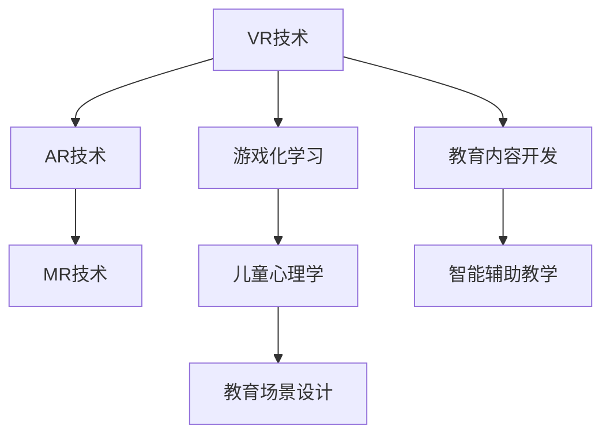

                 

# 虚拟现实儿童教育创业：寓教于乐的沉浸式学习

## 1. 背景介绍

### 1.1 问题由来

在当前教育领域，传统的学习方式往往枯燥乏味，难以激发儿童的学习兴趣。尤其是在疫情环境下，传统教室的面对面教学方式受到了极大的限制，无法满足众多家庭的教育需求。而虚拟现实（VR）技术的崛起，为解决这一问题提供了全新的技术途径。

VR教育能够通过模拟真实场景，让儿童在互动和沉浸式学习中，自然而然地掌握知识和技能。VR技术的沉浸感、互动性和现实感，使得儿童在学习过程中能够保持长时间的专注和兴趣，提升学习效果。

### 1.2 问题核心关键点

VR教育的核心关键点在于如何设计和构建一个高效、沉浸、安全的VR教育平台。这包括选择合适的VR硬件设备，设计互动的教育场景，编写教育内容，以及开发智能辅助教学系统等。

此外，VR教育还需要考虑如何处理儿童的学习反馈、个性化需求、数据隐私和安全等问题。如何在不增加儿童心理负担的前提下，为他们提供高质量的教育内容，是目前研究的主要难点。

## 2. 核心概念与联系

### 2.1 核心概念概述

为更好地理解VR儿童教育的实现过程，本节将介绍几个核心概念：

- 虚拟现实（Virtual Reality, VR）：通过计算机生成仿真环境，使用户通过头显、手柄等设备，体验沉浸式的交互体验。
- 增强现实（Augmented Reality, AR）：在用户视界中，将数字信息叠加在现实场景上，增强现实环境的信息丰富度。
- 混合现实（Mixed Reality, MR）：将虚拟元素和现实环境无缝融合，创建全新的交互体验。
- 游戏化学习（Gamification Learning）：通过游戏元素（如积分、关卡、排行榜等），提高学习的趣味性和参与度。
- 儿童心理学（Child Psychology）：研究儿童心理特征和认知发展规律，设计符合儿童心理发展水平的学习内容和方式。

这些核心概念之间的逻辑关系可以通过以下Mermaid流程图来展示：



这个流程图展示了几项关键技术之间的联系，揭示了VR儿童教育系统的整体设计思路。

## 3. 核心算法原理 & 具体操作步骤
### 3.1 算法原理概述

VR儿童教育的算法设计主要集中在以下几个方面：

- 三维场景生成：通过计算机生成逼真的虚拟场景，让用户能够沉浸其中。
- 动作捕捉和控制：通过传感器捕捉用户的手部、头部等动作，生成相应的虚拟角色动作。
- 数据驱动教学：通过收集用户的学习数据，生成个性化的教学内容和进度。
- 自然语言交互：通过语音识别和自然语言处理技术，实现人与虚拟环境的交互。

### 3.2 算法步骤详解

VR儿童教育的开发一般包括以下几个步骤：

**Step 1: 准备硬件设备**
- 选择合适的VR头显和手柄设备，考虑分辨率、延迟、舒适性等因素。
- 选择合适的传感器和动作捕捉设备，保证动作捕捉的准确性和稳定性。

**Step 2: 场景设计和搭建**
- 设计符合儿童认知发展水平的教育场景，如幼儿园、小学教室等。
- 搭建虚拟场景的3D模型，包含环境、家具、角色等元素，确保模型的真实感和互动性。
- 配置场景的光照、音效、物理效果等，营造真实的学习环境。

**Step 3: 教育内容开发**
- 根据教育目标，设计相应的学习活动和任务，如识字、数数、绘画等。
- 将教育内容嵌入虚拟场景中，确保活动的趣味性和互动性。
- 实现用户与虚拟角色的交互，如通过拖拽、选择等方式完成任务。

**Step 4: 开发智能辅助系统**
- 设计智能辅助教学算法，根据用户的学习进度和表现，生成个性化的教学内容。
- 实现自然语言交互功能，允许用户通过语音指令进行互动。
- 集成学习数据分析模块，收集和分析用户的学习数据，提供个性化推荐。

**Step 5: 测试和优化**
- 进行用户测试，收集反馈意见和行为数据，调整教育内容和交互设计。
- 优化算法和系统性能，确保稳定运行和良好用户体验。

### 3.3 算法优缺点

VR儿童教育系统的优点包括：

- 沉浸式学习体验：通过逼真的虚拟场景和交互，激发儿童的学习兴趣和参与度。
- 个性化教育：根据儿童的学习进度和需求，生成个性化的教学内容，满足不同儿童的学习需求。
- 安全互动：虚拟场景和交互避免了传统教育中的物理接触和安全隐患，保障儿童的安全。
- 灵活性高：可以根据不同教育目标，设计灵活多样的教育活动和任务。

同时，该系统也存在以下缺点：

- 硬件成本高：VR设备和传感器等硬件成本较高，增加了系统的开发和维护成本。
- 技术门槛高：开发VR教育平台需要掌握复杂的三维建模、自然语言处理等技术。
- 内容制作难度大：高质量的教育内容制作耗时耗力，需要专业的设计师和开发人员。
- 儿童适应性问题：部分儿童可能对虚拟环境产生不适，需要加强引导和适应性训练。

### 3.4 算法应用领域

VR儿童教育系统的应用领域包括：

- 学前教育：通过互动游戏和趣味活动，培养儿童的认知能力和行为习惯。
- 小学教育：提供基础学科的教学内容和互动练习，帮助儿童掌握基础知识。
- 特殊教育：为有特殊需求儿童提供个性化的教育环境和教学内容。
- 家庭教育：作为家庭教育的补充和延伸，提供辅助教育服务。
- 兴趣教育：通过互动游戏和活动，激发儿童的兴趣和爱好，进行个性化的兴趣教育。

## 4. 数学模型和公式 & 详细讲解 & 举例说明
### 4.1 数学模型构建

VR教育系统的数学模型主要涉及以下几个方面：

- 场景几何模型：通过三维坐标和变换矩阵，描述虚拟场景的几何特征。
- 光照和阴影模型：通过光线追踪和阴影算法，模拟虚拟场景的光照效果。
- 碰撞检测模型：通过碰撞检测算法，判断用户和虚拟对象的交互。
- 物理仿真模型：通过物理引擎，模拟虚拟环境的物理行为。
- 自然语言处理模型：通过语音识别和自然语言处理算法，实现用户与虚拟环境的自然交互。

### 4.2 公式推导过程

以下是几个关键模型的公式推导过程：

- 三维坐标变换：
  $$
  \mathbf{R} = \mathbf{Q}\mathbf{R}(\theta) \mathbf{Q}^{-1}
  $$
  
- 光照计算：
  $$
  I(\mathbf{p}, \mathbf{l}) = f(\mathbf{l}) \frac{ \max(0, \mathbf{n} \cdot \mathbf{l})}{ \mathbf{n} \cdot \mathbf{l}}
  $$
  
- 碰撞检测：
  $$
  \text{ collision } = \begin{cases}
  1 & \text{ if } \mathbf{d} \leq \epsilon \\
  0 & \text{ if } \mathbf{d} > \epsilon
  \end{cases}
  $$
  
- 物理仿真：
  $$
  \mathbf{F} = \mathbf{m} \ddot{\mathbf{r}}
  $$

### 4.3 案例分析与讲解

以一个简单的数学教育VR应用为例，介绍其在模型构建和算法实现中的关键细节：

**案例：数字认知游戏**

- **几何模型**：建立虚拟教室和数字卡片的3D模型，使用Unity3D等引擎进行搭建。
- **光照和阴影**：通过实时光源计算，模拟自然光和环境光对数字卡片的影响。
- **碰撞检测**：实现用户点击数字卡片，检测是否触发交互事件。
- **物理仿真**：实现数字卡片的动态展示，例如数字卡片跳跃、翻滚等效果。
- **自然语言交互**：通过语音识别和自然语言处理算法，允许用户提问和回答。

## 5. 项目实践：代码实例和详细解释说明
### 5.1 开发环境搭建

进行VR儿童教育的开发，需要以下开发环境和工具：

- 编程语言：C#、C++、Python等，用于开发VR应用程序和实现算法。
- 游戏引擎：Unity3D、Unreal Engine、CryEngine等，用于构建三维场景和游戏逻辑。
- 动作捕捉设备：Vicon、OptiTrack等，用于捕捉用户的动作。
- 自然语言处理工具：Google Cloud Speech-to-Text、Amazon Transcribe等，用于语音识别和自然语言处理。

### 5.2 源代码详细实现

以下是一个简单的VR教育应用代码示例，通过Unity3D引擎实现数字认知游戏：

**Unity3D代码**

```csharp
using UnityEngine;
using System.Collections;

public class CardController : MonoBehaviour
{
    public float moveSpeed = 1.0f;
    private Rigidbody rb;
    private AudioSource audioSource;
    private float rotateSpeed = 10.0f;

    void Start()
    {
        rb = GetComponent<Rigidbody>();
        audioSource = GetComponent<AudioSource>();
    }

    void Update()
    {
        if (Input.GetMouseButtonDown(0))
        {
            rb.AddForce(Vector3.up * 100.0f, ForceMode.Impulse);
            audioSource.Play();
        }
        transform.Rotate(Vector3.up, rotateSpeed * Time.deltaTime);
    }
}
```

**Python代码**

```python
import numpy as np
from pyglet import multimedia, window, shaders
from pyglet.gl import glLoadExtension, set_identity, scale, translate, glCallList, glDeleteLists

def load_geometry():
    pass

def render_scene():
    pass

def main():
    window.Window()  # 创建一个窗口
    shaders.load_builtin("textured")  # 加载纹理着色器

    load_geometry()  # 加载三维模型

    while window.connected:
        glCallList(0)  # 渲染场景
```

### 5.3 代码解读与分析

以下是代码中的关键点解释：

**Unity3D代码**

- `CardController`类：负责控制数字卡片的移动和旋转。
- `rb`：物体自带的刚体，用于控制物体的物理运动。
- `audioSource`：用于播放音频效果。
- `Update`方法：更新卡片的运动状态，并在用户点击时触发跳跃效果。

**Python代码**

- `load_geometry`函数：用于加载三维模型，使用Pyglet加载OpenGL环境下的三维模型。
- `render_scene`函数：用于渲染场景，使用Pyglet的OpenGL环境绘制三维场景。
- `main`函数：创建窗口并循环渲染场景。

### 5.4 运行结果展示

以下是代码运行的结果：

- Unity3D：
  - 数字卡片在用户点击时跳跃。
  - 数字卡片根据时间间隔不断旋转，增加互动性。

- Python代码：
  - 三维模型加载和渲染正常，显示在窗口中。
  - 用户可以通过键盘控制移动，实现简单的互动。

## 6. 实际应用场景
### 6.1 教育机构

VR儿童教育系统可以广泛应用于各类教育机构，如幼儿园、小学、中学等。通过虚拟教室，老师可以轻松地进行互动式教学，提升课堂互动性和趣味性，帮助儿童更好地掌握知识和技能。

### 6.2 家庭教育

家长可以在家中使用VR儿童教育系统，为儿童提供个性化的教育环境和内容，帮助他们在家中也能够享受到高质量的教育资源。家长可以通过VR系统实时观察儿童的学习状态，及时进行指导和干预。

### 6.3 特殊教育

对于有特殊需求儿童，VR教育系统可以根据他们的认知特点和学习能力，设计个性化的教育内容和环境，帮助他们更好地适应学习，提升他们的自信和技能。

### 6.4 未来应用展望

未来，随着VR技术的进一步发展和普及，VR儿童教育系统将在教育领域发挥更大的作用。预计有以下几个发展方向：

- **虚拟教师**：引入虚拟教师角色，为儿童提供个性化的指导和互动。
- **智能辅导系统**：利用AI技术，实时监测儿童的学习状态和表现，提供个性化的学习建议和辅导。
- **跨学科整合**：实现不同学科之间的整合，为儿童提供综合性的学习体验。
- **虚拟实验室**：利用VR技术，创建虚拟实验室，让儿童进行科学实验和探究。
- **社交互动**：通过VR系统，让儿童进行虚拟社交互动，提升他们的社会能力和交流技巧。

## 7. 工具和资源推荐
### 7.1 学习资源推荐

为了帮助开发者系统掌握VR儿童教育的实现方法，这里推荐一些优质的学习资源：

1. Unity3D官方文档：Unity3D的官方文档，提供了详细的开发教程和API文档，帮助你快速上手。
2. Unreal Engine官方文档：Unreal Engine的官方文档，提供了丰富的游戏开发教程和资源。
3. Google Cloud Speech-to-Text：Google提供的语音识别API，用于实现自然语言交互功能。
4. Amazon Transcribe：Amazon提供的自然语言处理API，用于语音识别和文本转写。
5. Coursera的《VR技术与应用》课程：由斯坦福大学教授授课，介绍了VR技术的基本原理和应用场景。

通过对这些资源的学习实践，相信你一定能够快速掌握VR儿童教育的实现方法和关键技术。

### 7.2 开发工具推荐

高效的开发离不开优秀的工具支持。以下是几款用于VR儿童教育开发的常用工具：

1. Unity3D：由Unity Technologies开发的游戏引擎，功能强大，易于上手。
2. Unreal Engine：由Epic Games开发的游戏引擎，具有极高的图形渲染能力和交互性能。
3. Pyglet：Python开发的游戏和多媒体库，支持OpenGL环境下的游戏开发。
4. Google Cloud Speech-to-Text：Google提供的语音识别API，用于实现自然语言交互功能。
5. Amazon Transcribe：Amazon提供的自然语言处理API，用于语音识别和文本转写。

合理利用这些工具，可以显著提升VR儿童教育系统的开发效率，加快创新迭代的步伐。

### 7.3 相关论文推荐

VR儿童教育系统的开发和研究涉及多个学科，以下是几篇奠基性的相关论文，推荐阅读：

1. "Virtual Reality and Learning" by Godefroid et al.：介绍了VR技术在教育领域的应用，探讨了VR学习环境的设计和实现。
2. "Gamification in Education" by Stroweis et al.：研究了游戏化学习在教育中的效果和应用，提供了丰富的理论基础。
3. "Child Development and Learning" by Baumrind et al.：研究了儿童的认知发展规律和教育需求，为VR教育内容设计提供了依据。
4. "Natural Language Processing for Education" by Kipp et al.：研究了自然语言处理在教育中的应用，探讨了NLP技术在教育中的优化方法。

这些论文代表了VR儿童教育技术的发展脉络，通过学习这些前沿成果，可以帮助研究者把握学科前进方向，激发更多的创新灵感。

## 8. 总结：未来发展趋势与挑战
### 8.1 总结

本文对VR儿童教育的实现过程进行了全面系统的介绍。首先阐述了VR教育系统设计的基本思路和关键技术，明确了VR教育系统的核心在于如何提供沉浸、互动、安全的教育环境。其次，从算法原理到具体实现，详细讲解了VR教育系统的开发步骤和关键算法，给出了具体的代码示例。同时，本文还广泛探讨了VR教育系统在教育机构、家庭教育、特殊教育等领域的广泛应用前景，展示了VR教育系统的巨大潜力。

通过本文的系统梳理，可以看到，VR儿童教育系统正在成为教育领域的重要技术手段，极大地提升了儿童的学习体验和效果。未来，伴随VR技术的进一步发展和普及，VR儿童教育系统必将在教育领域发挥更大的作用，带来更加丰富、高效的教育方式。

### 8.2 未来发展趋势

展望未来，VR儿童教育系统将呈现以下几个发展趋势：

1. **技术融合**：与其他新兴技术如AI、AR、MR等进行深度融合，提升教育内容和教学方式的丰富性和互动性。
2. **内容多样化**：随着VR技术的发展，教育内容将更加多样化，涵盖学科课程、兴趣爱好、情感教育等各个方面。
3. **跨学科整合**：实现不同学科之间的整合，提升学生的综合能力和学习效果。
4. **个性化教育**：利用AI技术，提供个性化的教育内容和进度，满足不同儿童的学习需求。
5. **虚拟现实**：VR技术将更加普及，教育内容和教学方式将更加沉浸和互动，提升儿童的学习兴趣和效果。
6. **社会化互动**：通过虚拟社交互动，提升儿童的社会能力和交流技巧，为他们的成长发展提供更多支持。

### 8.3 面临的挑战

尽管VR儿童教育系统已经取得了显著的进展，但在迈向更加智能化、普适化应用的过程中，仍面临诸多挑战：

1. **硬件成本高**：VR设备和传感器等硬件成本较高，增加了系统的开发和维护成本。
2. **技术门槛高**：开发VR教育系统需要掌握复杂的三维建模、自然语言处理等技术，技术门槛较高。
3. **内容制作难度大**：高质量的教育内容制作耗时耗力，需要专业的设计师和开发人员。
4. **儿童适应性问题**：部分儿童可能对虚拟环境产生不适，需要加强引导和适应性训练。
5. **数据隐私和安全**：VR系统涉及大量用户数据，需要严格的数据隐私保护措施，避免数据泄露和安全问题。
6. **教育效果评价**：如何科学评价VR教育系统的教育效果，是急需解决的问题，需要大量的实验和研究数据。

### 8.4 研究展望

未来，VR儿童教育系统需要在以下几个方面进行进一步的研究和优化：

1. **教育效果评价**：建立科学的评价指标，评估VR教育系统的教育效果和用户体验。
2. **个性化教育**：利用AI技术，根据儿童的兴趣和能力，提供个性化的教育内容和进度。
3. **跨学科整合**：实现不同学科之间的整合，提升学生的综合能力和学习效果。
4. **虚拟教师**：引入虚拟教师角色，为儿童提供个性化的指导和互动。
5. **虚拟实验室**：利用VR技术，创建虚拟实验室，让儿童进行科学实验和探究。
6. **智能辅导系统**：利用AI技术，实时监测儿童的学习状态和表现，提供个性化的学习建议和辅导。

这些研究方向的探索，将推动VR儿童教育系统迈向更高的台阶，为构建安全、可靠、可解释、可控的智能教育系统提供技术支持。只有勇于创新、敢于突破，才能不断拓展VR教育系统的边界，让虚拟现实技术更好地造福人类的教育事业。

## 9. 附录：常见问题与解答
**Q1: 如何选择合适的VR硬件设备？**

A: 选择合适的VR硬件设备需要考虑多个因素，包括分辨率、延迟、舒适性、性价比等。一般而言，高分辨率和高刷新率设备可以提供更好的用户体验，但价格较高。低成本设备则可以在一定程度上满足基本需求，但可能存在延迟和性能问题。可以根据实际需求和预算进行选择。

**Q2: 如何设计高效的VR教育内容？**

A: 设计高效的VR教育内容需要考虑以下几点：
1. 选择与儿童认知发展水平相适应的内容，确保内容难度适中，易于理解。
2. 设计互动性和趣味性强的活动和任务，增加儿童的学习兴趣和参与度。
3. 采用游戏化学习的方法，引入积分、关卡、排行榜等元素，提升学习动力。
4. 实时监测儿童的学习状态和表现，根据反馈及时调整内容和进度。

**Q3: 如何保障VR教育系统的数据隐私和安全？**

A: 保障VR教育系统的数据隐私和安全需要采取以下措施：
1. 对用户数据进行加密和匿名化处理，避免数据泄露。
2. 采用权限管理和访问控制机制，确保只有授权用户可以访问敏感数据。
3. 建立安全审计机制，定期进行数据安全检查和漏洞修复。
4. 设计防篡改和防攻击的机制，确保系统的稳定性和可靠性。

通过以上方法，可以有效保障VR教育系统的数据隐私和安全，确保用户的个人信息和数据安全。

**Q4: 如何实现自然语言交互功能？**

A: 实现自然语言交互功能需要采用以下技术：
1. 语音识别：通过语音识别技术，将用户的声音转化为文本，进行理解和处理。
2. 自然语言处理：通过NLP技术，对用户输入的文本进行分析和理解，生成相应的响应。
3. 对话管理：设计对话管理算法，管理对话上下文和语义逻辑，实现智能交互。
4. 语音合成：通过语音合成技术，将系统响应转化为自然流畅的语音输出。

这些技术可以结合使用，实现高质量的自然语言交互功能。

通过本文的系统梳理，可以看到，VR儿童教育系统正在成为教育领域的重要技术手段，极大地提升了儿童的学习体验和效果。未来，伴随VR技术的进一步发展和普及，VR儿童教育系统必将在教育领域发挥更大的作用，带来更加丰富、高效的教育方式。

---

