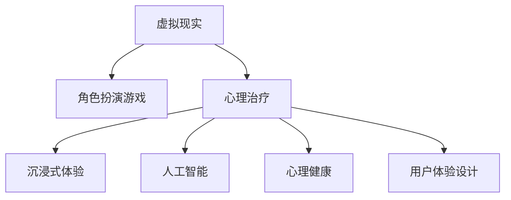

                 

# 虚拟现实角色扮演治疗创业：沉浸式心理调适

> 关键词：虚拟现实, 角色扮演, 心理治疗, 沉浸式体验, 人工智能, 心理健康, 用户行为, 交互设计

## 1. 背景介绍

### 1.1 问题由来
随着人工智能（AI）和虚拟现实（VR）技术的飞速发展，心理健康领域开始探索结合这些先进技术，提供更加沉浸式和个性化的心理治疗方案。传统的心理治疗主要依赖于面对面交流，受到时间和地点限制。而结合虚拟现实的角色扮演治疗（Virtual Reality Role-Playing Therapy, VR-RPT），通过沉浸式环境，让用户在虚拟世界中进行心理调适和治疗，极大地提升了治疗的互动性和趣味性。

### 1.2 问题核心关键点
VR-RPT的核心在于创造一个沉浸式的虚拟环境，通过角色扮演，让用户在游戏中体验和解决现实中的心理问题。这种方式通过以下几个关键点实现：
- **沉浸式体验**：通过VR技术，将用户完全沉浸在虚拟环境中，提升心理调适的深度和广度。
- **角色扮演**：用户扮演不同的角色，面对各种心理情境，学习和理解不同行为对心理状态的影响。
- **实时反馈**：利用AI技术，根据用户的行为和反馈，动态调整游戏情境和角色行为，实现个性化治疗。
- **高交互性**：通过高级交互技术，如手势识别、语音指令、眼球追踪等，增强用户的沉浸感和参与感。

### 1.3 问题研究意义
VR-RPT作为一种新型的心理治疗方式，具有以下研究意义：
- **突破时空限制**：无需面对面的交流方式，使得治疗可以随时随地进行，扩大心理治疗的可及性。
- **提高参与度**：通过沉浸式体验和高互动性，用户更容易投入到治疗中，提高治疗效果。
- **个性化治疗**：根据用户的行为和反馈，实时调整治疗内容，满足不同个体的需求。
- **推广心理健康**：通过游戏化的形式，降低用户的心理负担，促进心理健康意识的普及。
- **科研价值**：为心理治疗学和虚拟现实技术提供新的研究方向和实验平台。

## 2. 核心概念与联系

### 2.1 核心概念概述

为更好地理解VR-RPT的原理和实现，本节将介绍几个密切相关的核心概念：

- **虚拟现实（Virtual Reality, VR）**：通过计算机技术模拟一个可交互的虚拟环境，使用户仿佛置身其中，与虚拟世界进行互动。

- **角色扮演游戏（Role-Playing Game, RPG）**：玩家在游戏世界中选择角色，通过扮演不同角色，经历各种情境和挑战，达到目标的过程。

- **心理治疗**：通过专业的心理辅导，帮助个体解决心理问题，提升心理健康水平。

- **沉浸式体验（Immersive Experience）**：通过多感官刺激，使用户完全沉浸在虚拟环境中，提升感官和心理的沉浸感。

- **人工智能（Artificial Intelligence, AI）**：利用计算机技术模拟人类智能，实现自动化和个性化处理。

- **心理健康（Mental Health）**：指个体的心理状态处于良好和平衡的状态，不受心理疾病困扰。

- **用户体验设计（User Experience Design, UX）**：通过对产品设计的优化，提升用户的使用体验和满意度。

这些核心概念之间的逻辑关系可以通过以下Mermaid流程图来展示：



这个流程图展示了几者之间的联系和作用：

1. **虚拟现实**提供了沉浸式体验的媒介。
2. **角色扮演游戏**作为沉浸式体验的载体，通过模拟心理情境进行心理调适。
3. **心理治疗**作为核心目标，通过游戏方式实现心理健康提升。
4. **人工智能**支持游戏的实时交互和个性化调整。
5. **心理健康**是最终目标，通过心理治疗的渐进实现。
6. **用户体验设计**优化整体交互流程，提升用户的参与感和满意度。

这些概念共同构成了VR-RPT的工作原理和实现框架，为其提供了理论基础和技术支持。

## 3. 核心算法原理 & 具体操作步骤
### 3.1 算法原理概述

VR-RPT的核心算法原理基于虚拟现实技术、角色扮演游戏和心理治疗的结合。其核心思想是：通过虚拟环境模拟心理情境，让用户在游戏中扮演不同角色，通过互动和反馈，实现心理状态的调适和健康提升。

形式化地，假设游戏世界为 $W$，用户为 $U$，心理情境为 $S$，用户行为为 $A$，则VR-RPT的目标是找到最优行为策略 $A^*$，使得用户通过行为 $A^*$ 在心理情境 $S$ 中达到心理健康提升，即：

$$
A^* = \mathop{\arg\max}_{A} \mathcal{U}(A,W,S)
$$

其中 $\mathcal{U}$ 为效用函数，衡量用户在心理情境中的心理健康状态。

### 3.2 算法步骤详解

VR-RPT的具体操作步骤包括：

**Step 1: 创建虚拟世界**
- 使用VR技术创建一个沉浸式的虚拟世界，包括自然环境、社会情境、心理任务等。
- 根据用户的心理状态和偏好，动态调整虚拟世界的元素，如天气、人物、任务等。

**Step 2: 设计角色和任务**
- 设计多个角色，每个角色具有不同的性格、技能和心理状态。
- 设计多种心理任务，每个任务对应一种心理情境，如压力应对、焦虑缓解、情绪调节等。
- 通过角色扮演和任务完成，让用户体验不同心理情境，学习应对策略。

**Step 3: 实现实时交互**
- 利用AI技术，根据用户的行为和反馈，动态调整角色和任务的反应。
- 采用先进的交互技术，如手势识别、语音指令、眼球追踪等，提升沉浸感和互动性。
- 通过机器学习算法，分析用户的行为模式，优化游戏体验和心理调适策略。

**Step 4: 评估和反馈**
- 在游戏结束后，对用户的心理状态进行评估，收集反馈。
- 根据评估结果和反馈，调整虚拟世界和角色的设定，优化心理调适效果。
- 将游戏过程和结果记录下来，供后续分析和改进使用。

**Step 5: 迭代优化**
- 基于收集到的反馈和数据，持续迭代和优化游戏设计，提升用户体验和心理健康效果。
- 引入新的角色、任务和交互方式，保持游戏的新鲜感和挑战性。

### 3.3 算法优缺点

VR-RPT作为一种新型的心理治疗方式，具有以下优点：
1. **沉浸式体验**：通过虚拟现实技术，创建沉浸式环境，提高用户的参与度和体验感。
2. **个性化调整**：利用AI技术，根据用户的行为和反馈，实现个性化治疗，提升治疗效果。
3. **灵活性和可扩展性**：游戏设计和心理任务可以根据用户需求和反馈进行灵活调整和扩展。
4. **降低心理负担**：通过游戏化的形式，降低用户的心理负担，促进心理健康意识的普及。
5. **多感官刺激**：结合视觉、听觉、触觉等多种感官刺激，提高心理调适的深度和广度。

同时，该方法也存在一些局限性：
1. **技术门槛高**：需要高水平的VR和AI技术支持，开发和部署成本较高。
2. **适应性问题**：不同用户对虚拟环境和游戏体验的适应性不同，可能导致一些用户无法适应。
3. **数据隐私和安全**：虚拟世界中的数据收集和处理，可能涉及用户隐私，需要严格的隐私保护措施。
4. **交互复杂性**：高级交互技术如手势识别、语音指令等，可能对用户的操作要求较高。
5. **实效性评估**：长期效果的评估需要大量数据支持，可能面临数据收集和分析的困难。

尽管存在这些局限性，但就目前而言，VR-RPT仍是大语言模型微调的重要发展方向之一。未来相关研究的方向包括：降低技术门槛、提升用户体验、加强隐私保护等，以进一步推广和应用这一技术。

### 3.4 算法应用领域

VR-RPT在多个领域展现了广阔的应用前景：

- **心理健康应用**：适用于抑郁症、焦虑症、PTSD等心理障碍的治疗，通过沉浸式体验进行心理调适。
- **教育培训**：利用游戏化的方式，帮助学生理解和掌握复杂的心理知识和技能，如压力管理、情绪调节等。
- **企业员工福利**：通过虚拟环境进行心理调适和团队建设，提升员工的心理健康和工作满意度。
- **军事训练**：利用虚拟战场模拟，进行心理训练和应激反应的测试，提升士兵的心理韧性和作战能力。
- **社会公益**：通过公益性VR-RPT项目，帮助社会边缘群体获得心理支持和治疗。

除了上述这些领域外，VR-RPT还将在更多场景中得到应用，如社交互动、健康管理等，为心理健康技术的发展提供新的可能性。

## 4. 数学模型和公式 & 详细讲解 & 举例说明

### 4.1 数学模型构建

本节将使用数学语言对VR-RPT的算法原理进行更加严格的刻画。

记虚拟世界为 $W$，用户为 $U$，心理情境为 $S$，用户行为为 $A$。假设用户在心理情境 $S_i$ 下的心理健康状态为 $H_i$，则效用函数 $\mathcal{U}$ 可以表示为：

$$
\mathcal{U}(A,W,S) = \sum_{i=1}^{n} w_i H_i(A,W,S_i)
$$

其中 $w_i$ 为权重，$H_i(A,W,S_i)$ 为在情境 $S_i$ 下，用户行为 $A$ 对心理健康 $H_i$ 的影响。

### 4.2 公式推导过程

以下我们以焦虑缓解为例，推导心理调适的数学模型及其求解过程。

假设用户在虚拟世界中面临不同情境，通过行为 $A$ 进行心理调适。心理情境 $S$ 和用户行为 $A$ 对焦虑水平的调整效果分别为 $H_i(A,W,S_i)$。则用户在虚拟世界中的焦虑水平 $H$ 可以表示为：

$$
H = \sum_{i=1}^{n} w_i H_i(A,W,S_i)
$$

其中 $w_i$ 为情境 $S_i$ 的权重，可以通过用户选择的频率等进行估计。

为了最小化用户的焦虑水平 $H$，需要求解 $A^*$，使得 $H$ 最小。具体而言，可以通过优化算法（如梯度下降）求解：

$$
A^* = \mathop{\arg\min}_{A} H = \mathop{\arg\min}_{A} \sum_{i=1}^{n} w_i H_i(A,W,S_i)
$$

使用梯度下降算法求解上述最优化问题，需要计算 $H_i(A,W,S_i)$ 对 $A$ 的梯度，可以通过反向传播算法高效计算。

### 4.3 案例分析与讲解

以一个典型的焦虑缓解情境为例，分析用户行为对心理健康的影响。

**情境描述**：用户进入一个高压工作环境，需要在短时间内完成一项复杂任务。

**行为设计**：用户可以选择以下行为进行心理调适：
- **深呼吸**：缓慢深呼吸，放松身体。
- **活动放松**：进行简单的身体活动，如散步、伸展。
- **社交互动**：与同事进行简短的对话，获得情感支持。
- **认知重构**：改变对任务的认知，降低期望。

**计算过程**：
1. **情境权重**：根据用户的选择频率，设定情境权重 $w_1 = 0.3, w_2 = 0.2, w_3 = 0.25, w_4 = 0.25$。
2. **影响函数**：设定不同行为对焦虑水平的调整效果，如 $H_1(A,W,S_1) = 0.8A + 0.2$（深呼吸）、$H_2(A,W,S_2) = 0.7A + 0.1$（活动放松）、$H_3(A,W,S_3) = 0.9A + 0.05$（社交互动）、$H_4(A,W,S_4) = 0.6A + 0.3$（认知重构）。
3. **效用函数**：将情境权重和影响函数代入，得到 $H = w_1 H_1(A,W,S_1) + w_2 H_2(A,W,S_2) + w_3 H_3(A,W,S_3) + w_4 H_4(A,W,S_4)$。
4. **优化求解**：使用梯度下降算法，求解 $A^*$ 使得 $H$ 最小。

通过上述计算过程，可以动态调整用户的行为，使其在虚拟环境中实现最佳的心理调适效果。

## 5. 项目实践：代码实例和详细解释说明

### 5.1 开发环境搭建

在进行VR-RPT项目实践前，我们需要准备好开发环境。以下是使用Unity3D进行开发的环境配置流程：

1. **安装Unity3D**：从官网下载并安装Unity3D，支持VR开发和跨平台部署。
2. **配置VR设备**：连接VR头显和手柄，确保设备正常工作。
3. **安装插件和工具**：安装Unity3D商店中的VR开发插件，如XRTK、Magic Leap等。
4. **配置VR设置**：在Unity3D中设置VR场景，调整渲染分辨率、帧率等参数。
5. **环境优化**：优化VR场景的图形和计算性能，确保流畅的体验。

完成上述步骤后，即可在Unity3D环境中开始VR-RPT项目开发。

### 5.2 源代码详细实现

下面我们以焦虑缓解情境为例，给出使用Unity3D和C#进行VR-RPT开发的代码实现。

首先，定义焦虑缓解的虚拟场景和行为设计：

```csharp
using UnityEngine;
using UnityEngine.XR;
using UnityEngine.XR.Interaction.Toolkit;

public class AnxietyRelief : MonoBehaviour
{
    public GameObject deepBreathingPrefab;
    public GameObject walkingPrefab;
    public GameObject socialPrefab;
    public GameObject cognitivePrefab;

    private GameObject currentAction;

    private void Start()
    {
        currentAction = deepBreathingPrefab;
        PlayAction(deepBreathingPrefab);
    }

    private void Update()
    {
        if (currentAction != null && Input.GetButtonDown("SelectNextAction"))
        {
            currentAction.SetActive(false);
            currentAction = (currentAction == deepBreathingPrefab) ? socialPrefab : (currentAction == socialPrefab) ? walkingPrefab : cognitivePrefab;
            PlayAction(currentAction);
        }
    }

    private void PlayAction(GameObject actionPrefab)
    {
        currentAction = actionPrefab;
        if (currentAction != null)
        {
            currentAction.SetActive(true);
        }
    }
}
```

然后，定义VR交互和行为效果：

```csharp
public class ActionInteractor : MonoBehaviour
{
    public string actionName;

    private void OnTriggerEnter(Collider other)
    {
        if (other.CompareTag("Player"))
        {
            if (actionName == "DeepBreathing")
            {
                DeepBreathing();
            }
            else if (actionName == "Walking")
            {
                Walking();
            }
            else if (actionName == "Social")
            {
                Social();
            }
            else if (actionName == "Cognitive")
            {
                Cognitive();
            }
        }
    }

    private void DeepBreathing()
    {
        Debug.Log("Performing deep breathing");
        // 深呼吸行为的实现逻辑
    }

    private void Walking()
    {
        Debug.Log("Walking for relaxation");
        // 行走放松行为的实现逻辑
    }

    private void Social()
    {
        Debug.Log("Socializing with colleagues");
        // 社交互动行为的实现逻辑
    }

    private void Cognitive()
    {
        Debug.Log("Cognitive restructuring");
        // 认知重构行为的实现逻辑
    }
}
```

最后，启动交互和效果渲染：

```csharp
public class AnxietyReliefUI : MonoBehaviour
{
    public GameObject actionButtons;

    private void Update()
    {
        foreach (var button in actionButtons.GetComponentsInChildren<Button>())
        {
            button.interactable = button.GetButtonName() == "SelectNextAction";
        }
    }
}
```

以上是使用Unity3D和C#进行VR-RPT开发的完整代码实现。可以看到，利用Unity3D强大的VR开发能力，可以轻松实现角色的行为设计和交互效果。

### 5.3 代码解读与分析

让我们再详细解读一下关键代码的实现细节：

**AnxietyRelief类**：
- `Start`方法：在开始时，选择深呼吸行为作为初始行为。
- `Update`方法：在每帧更新时，判断用户是否选择切换到下一个行为，并根据当前行为的状态切换。
- `PlayAction`方法：根据行为选择，激活或停用行为对象。

**ActionInteractor类**：
- `OnTriggerEnter`方法：当用户与行为对象交互时，触发相应行为。
- `DeepBreathing`、`Walking`、`Social`、`Cognitive`方法：定义每种行为的实现逻辑，可以通过添加行为的具体细节来优化体验。

**AnxietyReliefUI类**：
- `Update`方法：根据用户选择的行为，控制交互按钮的可用性。
- `actionButtons`属性：定义交互按钮的引用，用于控制切换行为的选择。

通过上述代码，我们实现了用户在不同情境下的行为选择和交互效果。开发者可以根据实际需求，进一步定制和优化行为逻辑，实现更加个性化的心理调适。

## 6. 实际应用场景
### 6.1 虚拟心理诊所

VR-RPT可以用于构建虚拟心理诊所，提供全天候的心理咨询服务。用户在家中或办公室通过VR设备，进入虚拟诊所，选择不同的心理情境和行为，进行自我心理调适。虚拟诊所可以包括：

- **焦虑缓解室**：模拟高压工作环境，让用户通过深呼吸、行走放松等行为进行焦虑缓解。
- **情绪调节室**：模拟情感创伤情境，让用户通过社交互动、认知重构等方式进行情绪调节。
- **压力管理室**：模拟考试或演讲情境，让用户通过积极思考、自我肯定等行为进行压力管理。
- **心理健康咨询室**：提供专业的心理医生进行实时咨询，结合虚拟环境和行为指导，提供个性化的心理治疗。

通过VR-RPT技术，虚拟心理诊所可以提供便捷、隐私、个性化的心理服务，填补传统心理服务的空缺。

### 6.2 企业员工培训

企业可以利用VR-RPT进行员工心理培训，提升员工的心理健康和团队协作能力。企业可以设计多种心理情境和行为，帮助员工在虚拟环境中进行心理调适和团队建设。心理培训可以包括：

- **压力管理培训**：模拟工作压力情境，通过深呼吸、休息放松等行为，帮助员工管理压力。
- **情绪调节培训**：模拟冲突和沟通情境，通过社交互动、积极沟通等行为，提升员工的情绪调节能力。
- **团队合作培训**：模拟团队合作任务，通过协作游戏和角色扮演，增强团队协作和信任。
- **心理韧性培训**：模拟挑战和挫折情境，通过心理调适和自我激励，提升员工的心理韧性。

通过VR-RPT技术，企业可以提供灵活、互动、高效的员工心理培训方案，提升员工的心理健康和工作满意度。

### 6.3 军事心理训练

军事单位可以利用VR-RPT进行心理训练和应激反应测试，提升士兵的心理韧性和战斗能力。心理训练可以包括：

- **战场模拟训练**：模拟真实战场环境，通过心理调适和团队协作，提升士兵的心理韧性和战斗能力。
- **应急反应训练**：模拟紧急情况和危险情境，通过深呼吸、自我激励等行为，提升士兵的应急反应能力。
- **心理复原训练**：模拟战后心理创伤情境，通过心理疏导和行为调节，帮助士兵恢复心理平衡。
- **团队合作训练**：模拟战术合作任务，通过协作游戏和角色扮演，提升团队的协作和信任。

通过VR-RPT技术，军事单位可以提供沉浸式、实战化的心理训练方案，提升士兵的心理韧性和战斗能力，保障士兵的心理健康。

### 6.4 未来应用展望

随着VR-RPT技术的不断发展，其应用场景将更加广泛，前景广阔：

1. **普及教育培训**：将心理调适和情感教育纳入学校和企业的培训体系，提升全社会心理健康意识和能力。
2. **家庭心理健康**：将心理调适和情感支持纳入家庭生活，帮助家庭成员处理日常生活中的心理问题。
3. **社交互动**：将虚拟角色扮演和互动体验融入社交平台，提升用户的社交体验和心理满足感。
4. **虚拟心理治疗**：利用VR-RPT技术，开发虚拟心理治疗师，提供远程和分布式的心理服务。
5. **虚拟现实娱乐**：将心理调适和情感体验融入虚拟现实娱乐，创造沉浸式、情感丰富的娱乐体验。

这些应用场景将推动VR-RPT技术在更多领域的落地应用，为心理健康和情感支持提供新的可能性。

## 7. 工具和资源推荐
### 7.1 学习资源推荐

为了帮助开发者系统掌握VR-RPT的理论基础和实践技巧，这里推荐一些优质的学习资源：

1. **Unity3D官方文档**：提供Unity3D的详细文档和教程，涵盖VR开发和交互设计的基础知识。
2. **XRTK官方文档**：提供XR Toolkit的详细文档和教程，涵盖VR、AR和MR开发的关键技术。
3. **VR开发者社区**：提供丰富的VR开发案例和交流平台，促进开发者之间的技术分享和合作。
4. **心理健康在线课程**：提供系统的心理健康知识和技能培训，提升开发者对心理调适的理解和应用能力。
5. **虚拟现实书籍**：提供虚拟现实技术和应用的全面介绍，帮助开发者深入理解VR-RPT的原理和实现。

通过对这些资源的学习实践，相信你一定能够快速掌握VR-RPT的精髓，并用于解决实际的心理学问题。

### 7.2 开发工具推荐

高效的开发离不开优秀的工具支持。以下是几款用于VR-RPT开发的常用工具：

1. **Unity3D**：强大的跨平台VR开发引擎，提供丰富的VR和AR开发工具和资源。
2. **XRTK**：开源的XR开发工具包，提供全面的VR和AR开发支持。
3. **Tilt Brush**：Unity3D的VR绘画工具，提供丰富的创意交互和艺术体验。
4. **Unity VR开发插件**：提供多种VR开发插件，如Magic Leap、Google ARCore等，支持跨平台部署。
5. **VR交互设计工具**：如VrChat、Beat Saber等，提供丰富的交互体验和创意设计。

合理利用这些工具，可以显著提升VR-RPT项目的开发效率，加快创新迭代的步伐。

### 7.3 相关论文推荐

VR-RPT技术的发展源于学界的持续研究。以下是几篇奠基性的相关论文，推荐阅读：

1. **Virtual Reality and Immersive Interaction**：提供虚拟现实技术的全面介绍，涵盖VR交互设计、心理学基础和应用实例。
2. **Psychological Effects of Virtual Reality Therapy**：探讨虚拟现实在心理治疗中的效果和应用，提供心理学实验和临床案例支持。
3. **Virtual Reality for Emotional Regulation**：研究虚拟现实在情绪调节中的应用，提供心理实验和用户体验的详细分析。
4. **AI and Machine Learning in Virtual Reality**：探讨AI技术在虚拟现实中的应用，涵盖自然语言处理、机器学习等前沿技术。
5. **Mental Health Applications of Virtual Reality**：综述虚拟现实在心理健康中的应用，提供心理调适和情绪支持的多样化方案。

这些论文代表了大语言模型微调技术的发展脉络。通过学习这些前沿成果，可以帮助研究者把握学科前进方向，激发更多的创新灵感。

## 8. 总结：未来发展趋势与挑战

### 8.1 总结

本文对VR-RPT的算法原理和实现方法进行了全面系统的介绍。首先阐述了VR-RPT的背景和意义，明确了其在心理调适和治疗中的独特价值。其次，从原理到实践，详细讲解了VR-RPT的数学模型和核心步骤，给出了具体的应用代码实例。同时，本文还广泛探讨了VR-RPT在多个领域的应用前景，展示了其巨大的发展潜力。

通过本文的系统梳理，可以看到，VR-RPT作为新型的心理治疗方式，通过虚拟现实技术、角色扮演游戏和心理调适的结合，具有沉浸式体验、个性化调整、灵活性和可扩展性等优点，能够显著提升用户的心理健康效果。未来，随着VR-RPT技术的不断发展和完善，必将为心理健康和情感支持提供新的解决方案，推动社会的全面进步。

### 8.2 未来发展趋势

展望未来，VR-RPT技术将呈现以下几个发展趋势：

1. **技术成熟度提升**：随着VR和AI技术的不断进步，VR-RPT的性能和用户体验将不断提升。
2. **应用场景多样化**：VR-RPT将拓展到更多领域，如家庭心理健康、社会互动、虚拟现实娱乐等，提升其应用广度。
3. **个性化定制**：通过机器学习和大数据分析，实现更加个性化的心理调适和情感支持。
4. **跨平台部署**：实现跨平台和跨设备的无缝切换，提升用户的便捷性和体验。
5. **伦理和隐私保护**：加强隐私保护和伦理审查，确保用户数据的安全和隐私。
6. **标准化和规范**：制定VR-RPT的标准和规范，提升其应用的标准化和可靠性。

这些趋势将推动VR-RPT技术的持续发展和应用，为心理健康和情感支持提供更加全面和多样化的解决方案。

### 8.3 面临的挑战

尽管VR-RPT技术已经取得了一定的进展，但在推广应用的过程中，仍面临以下挑战：

1. **技术门槛高**：需要高水平的VR和AI技术支持，开发和部署成本较高。
2. **适应性问题**：不同用户对虚拟环境和游戏体验的适应性不同，可能导致一些用户无法适应。
3. **数据隐私和安全**：虚拟世界中的数据收集和处理，可能涉及用户隐私，需要严格的隐私保护措施。
4. **交互复杂性**：高级交互技术如手势识别、语音指令等，可能对用户的操作要求较高。
5. **实效性评估**：长期效果的评估需要大量数据支持，可能面临数据收集和分析的困难。
6. **用户参与度**：需要提升用户的参与度和沉浸感，以充分发挥VR-RPT的效果。

这些挑战需要学界和产业界的共同努力，通过技术创新和用户体验优化，才能进一步推动VR-RPT技术的普及和应用。

### 8.4 研究展望

未来研究需要在以下几个方面寻求新的突破：

1. **降低技术门槛**：通过标准化和开源工具，降低VR-RPT技术的开发和部署成本。
2. **提升用户体验**：通过优化交互设计，提升用户的沉浸感和参与度。
3. **加强隐私保护**：制定隐私保护标准和法规，保障用户数据的安全和隐私。
4. **优化交互技术**：提升手势识别、语音指令等交互技术的精度和便捷性。
5. **实效性评估**：建立科学的评估指标和方法，评估长期效果和心理调适效果。
6. **拓展应用场景**：探索更多应用领域，如家庭心理健康、社交互动等，提升VR-RPT的应用广度。

这些研究方向的探索，必将引领VR-RPT技术迈向更高的台阶，为心理健康和情感支持提供新的解决方案。面向未来，VR-RPT技术还需要与其他人工智能技术进行更深入的融合，如知识表示、因果推理、强化学习等，多路径协同发力，共同推动自然语言理解和智能交互系统的进步。只有勇于创新、敢于突破，才能不断拓展心理调适的边界，让智能技术更好地造福人类社会。

## 9. 附录：常见问题与解答

**Q1：VR-RPT是否适用于所有心理问题？**

A: VR-RPT主要适用于轻中度的心理问题，如焦虑、压力、情绪调节等。对于严重心理障碍（如精神病、重度抑郁症），需要结合传统心理治疗和药物治疗，进行综合治疗。

**Q2：如何确保VR-RPT的安全性和有效性？**

A: 确保VR-RPT的安全性和有效性需要从多个方面入手：
1. **专业设计**：由心理学专家和VR开发团队共同设计，确保情境和行为的真实性和科学性。
2. **用户体验测试**：通过用户反馈和测试，不断优化情境和行为，提升用户体验。
3. **实效性评估**：通过科学评估和实验，验证VR-RPT的效果，确保其有效性和可靠性。
4. **隐私保护**：严格遵守数据隐私和伦理规范，保障用户数据的安全和隐私。
5. **持续更新**：根据用户反馈和最新研究成果，持续更新和优化VR-RPT应用。

**Q3：VR-RPT是否有风险和副作用？**

A: 如同任何一种心理治疗方法，VR-RPT也可能存在一些风险和副作用，如：
1. **适应性问题**：部分用户可能对虚拟环境或游戏体验不适应，导致疗效不佳。
2. **技术依赖**：过度依赖VR设备，可能影响现实生活中的社会互动和人际关系。
3. **心理负担**：长期使用VR-RPT，可能导致用户对虚拟环境过度依赖，影响现实生活的心理状态。
4. **技术问题**：技术故障或设备问题，可能导致用户体验下降，甚至出现安全问题。

开发者和用户需要充分了解这些风险，谨慎使用VR-RPT，并在专业指导下进行心理调适和治疗。

**Q4：VR-RPT是否可以替代传统心理治疗？**

A: VR-RPT可以作为传统心理治疗的一种补充和辅助手段，但无法完全替代传统心理治疗。具体应用需要根据用户的具体情况和需求来决定：
1. **轻度心理问题**：适用于轻度心理问题的自我调适和治疗，如焦虑、压力、情绪调节等。
2. **中度心理问题**：可以结合传统心理治疗，进行综合调适和治疗，提升疗效。
3. **重度心理问题**：需要结合专业心理治疗和药物治疗，进行综合治疗，确保疗效和安全。

开发者和用户需要根据实际情况，结合多种心理治疗手段，提供更加全面和个性化的心理调适方案。

---

作者：禅与计算机程序设计艺术 / Zen and the Art of Computer Programming

