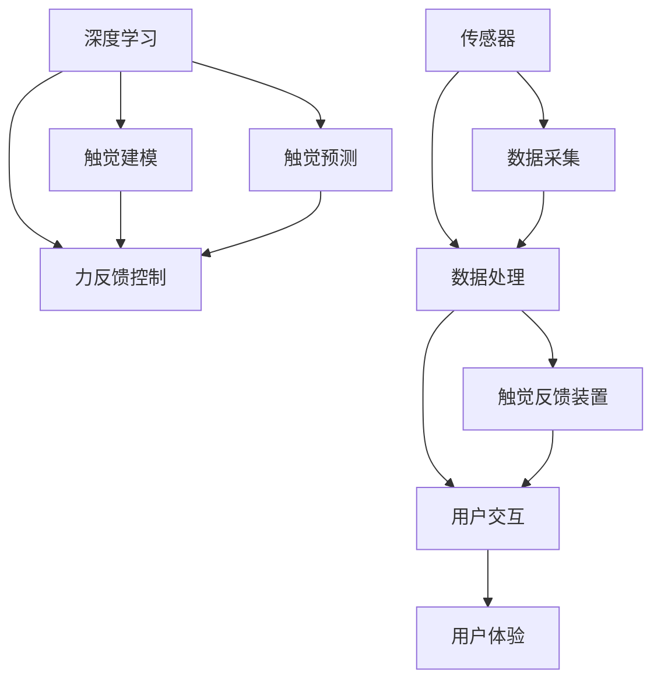

                 

# 虚拟触觉革命：AI创造的触感新维度

> 关键词：虚拟触觉,触觉反馈,力反馈,深度学习,人工智能,人机交互,人机协同,机器人技术

## 1. 背景介绍

在数字化和智能化的浪潮中，人类对交互体验的追求已经从视觉、听觉向触觉拓展。触觉作为最直观、最自然的交互方式，与虚拟现实(VR)、增强现实(AR)、机器人技术等紧密相连，为创建沉浸式体验提供了重要途径。近年来，随着深度学习技术的飞速发展，虚拟触觉系统正逐步从科幻走向现实，通过AI技术创造出触感新维度，开启了人机协同的新时代。本文将系统性地探讨虚拟触觉的原理、架构和实际应用，揭示其对人类生活、工作乃至社会发展的深远影响。

## 2. 核心概念与联系

### 2.1 核心概念概述

要理解虚拟触觉革命，首先需要掌握一些关键概念：

- **虚拟触觉**：通过电子设备模拟触觉反馈，使得用户在虚拟环境中有真实的触觉体验。这涉及触觉传感器、力反馈装置、虚拟模型等技术。
- **力反馈**：根据用户与虚拟环境的交互情况，通过物理装置向用户提供触觉反馈，增强沉浸感。常见的力反馈设备有手柄、力反馈振动器等。
- **深度学习**：一种模拟人脑神经网络结构和功能的机器学习技术，能够处理大规模数据，并通过反向传播算法进行优化。深度学习在虚拟触觉系统中常用于触觉预测和触觉建模。
- **人机交互**：研究如何设计计算机系统与人类交互的方法，提升用户体验，实现高效、自然的沟通。触觉作为关键交互方式，增强了人机协同的直观性。
- **人机协同**：利用人工智能技术，提升人机系统的整体性能，实现更加高效、智能的交互。虚拟触觉通过触觉反馈，显著提升了人机协同的直观性和自然性。
- **机器人技术**：融合计算机科学、机械工程、电子工程等多学科知识的综合性技术，旨在创建具有自主决策、操作能力的智能机器人。虚拟触觉技术为机器人提供了触觉感知和反馈，使其具备更强的环境适应性和操作能力。

这些核心概念之间相互联系，共同构成了虚拟触觉系统的技术框架。通过虚拟触觉，用户能够在虚拟环境中获得真实的触觉体验，增强交互的自然性和直观性，提升人机协同效率。

### 2.2 核心概念原理和架构的 Mermaid 流程图



这个流程图展示了虚拟触觉系统的工作原理：

1. **深度学习**：通过训练模型预测触觉反馈，实现触觉预测。
2. **触觉建模**：构建虚拟环境中的触觉模型，用于预测触觉反馈。
3. **力反馈控制**：根据触觉预测和触觉建模结果，控制力反馈装置输出触觉反馈。
4. **传感器**：采集用户的触觉输入和力反馈装置的状态，实时监测交互情况。
5. **数据采集和处理**：将传感器数据进行处理，为深度学习模型提供输入。
6. **触觉反馈装置**：根据力反馈控制结果，向用户提供触觉反馈。
7. **用户交互**：用户通过触觉反馈装置与虚拟环境互动。
8. **用户体验**：通过触觉反馈，用户获得沉浸式体验，提升人机协同效率。

## 3. 核心算法原理 & 具体操作步骤

### 3.1 算法原理概述

虚拟触觉系统的核心算法主要涉及触觉预测、触觉建模和力反馈控制。这些算法通过深度学习技术，实现对触觉数据的预测和控制，使得用户能够获得真实的触觉体验。

- **触觉预测**：利用深度学习模型，预测用户在不同交互情况下的触觉反馈。常见的算法包括卷积神经网络(CNN)、循环神经网络(RNN)和变分自编码器(VAE)等。
- **触觉建模**：构建虚拟环境中的触觉模型，用于预测触觉反馈。触觉模型通常包含多个物理参数，如硬度、摩擦力、弹性等。
- **力反馈控制**：根据触觉预测和触觉建模结果，控制力反馈装置输出触觉反馈。常见的控制算法包括PID控制器、模型预测控制等。

### 3.2 算法步骤详解

虚拟触觉系统的设计步骤如下：

1. **数据收集**：使用传感器收集用户的触觉输入和力反馈装置的状态，得到触觉数据。
2. **数据预处理**：对触觉数据进行清洗、归一化、降维等预处理，提高数据质量。
3. **触觉预测模型训练**：利用深度学习模型训练触觉预测模型，使其能够预测不同交互情况下的触觉反馈。
4. **触觉建模**：根据虚拟环境中的物理参数，构建触觉模型，用于预测触觉反馈。
5. **力反馈控制模型训练**：训练力反馈控制模型，根据触觉预测和触觉建模结果，控制力反馈装置输出触觉反馈。
6. **系统集成**：将触觉预测模型、触觉建模和力反馈控制模型集成到虚拟触觉系统中，实现触觉反馈的实时输出。

### 3.3 算法优缺点

虚拟触觉系统具有以下优点：

- **沉浸式体验**：通过触觉反馈，用户能够获得真实的触觉体验，增强沉浸感。
- **高效交互**：触觉作为直观的交互方式，减少了视觉和听觉的负担，提高了交互效率。
- **普适性高**：触觉反馈适用于各种应用场景，如虚拟现实、增强现实、机器人技术等。

同时，虚拟触觉系统也存在一些缺点：

- **设备复杂性**：触觉反馈装置复杂，维护成本高。
- **数据需求大**：触觉数据的采集和处理需要大量计算资源。
- **精度问题**：触觉反馈的精度受传感器和模型影响，可能存在误差。
- **安全问题**：触觉反馈可能导致用户不适，需注意安全防护。

### 3.4 算法应用领域

虚拟触觉系统在多个领域具有广泛的应用前景：

- **虚拟现实和增强现实**：通过触觉反馈，增强虚拟环境和增强现实场景的沉浸感和交互性。
- **机器人技术**：为机器人提供触觉感知和反馈，提升其环境适应性和操作能力。
- **医疗健康**：用于康复训练、手术模拟等，通过触觉反馈增强训练效果和手术体验。
- **教育培训**：用于虚拟实验、模拟教学等，通过触觉反馈增强学习效果。
- **游戏娱乐**：增强游戏互动性和沉浸感，提供新的游戏体验。

## 4. 数学模型和公式 & 详细讲解 & 举例说明

### 4.1 数学模型构建

虚拟触觉系统的数学模型主要包括以下几个部分：

- **触觉预测模型**：$F(x) = W_h \cdot x + b_h$，其中$x$为触觉输入，$W_h$为模型权重，$b_h$为偏置项。
- **触觉建模模型**：$G(x) = \frac{\partial L}{\partial x} + F(x)$，其中$L$为虚拟环境中的物理模型。
- **力反馈控制模型**：$C(y) = k \cdot (y - y_{set}) + d(y)$，其中$y$为触觉反馈，$k$为控制器增益，$y_{set}$为期望的触觉反馈，$d(y)$为控制器动态项。

### 4.2 公式推导过程

以触觉预测模型为例，其基本思想是通过训练模型，预测用户在不同交互情况下的触觉反馈。假设触觉输入为$x$，触觉反馈为$y$，则有：

$$
y = F(x) = W_h \cdot x + b_h
$$

其中，$W_h$和$b_h$通过训练数据进行优化。通过反向传播算法，可以计算$W_h$和$b_h$的梯度，更新模型参数。

### 4.3 案例分析与讲解

以虚拟现实游戏中的触觉反馈为例，触觉预测模型可以预测用户对虚拟物体的触感。假设用户通过手柄与虚拟物体互动，触觉传感器采集到手柄的振动反馈，该反馈作为触觉输入$x$。通过触觉预测模型$F(x)$，可以得到用户对虚拟物体的触觉反馈$y$。假设虚拟物体硬度为$h$，触觉建模模型$G(x)$可以计算虚拟物体的触感参数$h'$，并通过力反馈控制模型$C(y)$，将触觉反馈$y$输出到手柄，模拟触觉体验。

## 5. 项目实践：代码实例和详细解释说明

### 5.1 开发环境搭建

为了实现虚拟触觉系统，我们需要搭建如下开发环境：

1. **硬件环境**：触觉传感器、力反馈装置、计算机等。
2. **软件环境**：深度学习框架（如TensorFlow、PyTorch）、机器人操作库（如ROS、Gazebo）、实时操作系统（如RTOS、Linux）等。
3. **集成环境**：虚拟现实平台（如Unity、Unreal Engine）、增强现实平台（如ARKit、ARCore）等。

### 5.2 源代码详细实现

以下是虚拟触觉系统的Python代码实现：

```python
import numpy as np
import tensorflow as tf
from tensorflow.keras.models import Sequential
from tensorflow.keras.layers import Dense

# 定义触觉预测模型
def build_tactile_predictor(input_size, output_size):
    model = Sequential()
    model.add(Dense(64, input_dim=input_size, activation='relu'))
    model.add(Dense(64, activation='relu'))
    model.add(Dense(output_size, activation='sigmoid'))
    return model

# 加载触觉数据
def load_tactile_data():
    # 读取触觉输入和触觉反馈数据
    input_data = np.load('input_data.npy')
    output_data = np.load('output_data.npy')
    return input_data, output_data

# 训练触觉预测模型
def train_tactile_predictor(input_data, output_data):
    model = build_tactile_predictor(input_size=input_data.shape[1], output_size=output_data.shape[1])
    model.compile(loss='binary_crossentropy', optimizer='adam', metrics=['accuracy'])
    model.fit(input_data, output_data, epochs=100, batch_size=64)
    return model

# 加载虚拟环境触觉模型
def load_tactile_model():
    # 读取虚拟环境中的触觉模型参数
    params = np.load('tactile_model_params.npy')
    return params

# 计算触觉反馈
def compute_tactile_feedback(model, params):
    # 根据触觉预测模型和触觉建模模型计算触觉反馈
    input_data = np.random.randn(1, input_size)
    output_data = model.predict(input_data)
    feedback = compute_feedback(params, output_data)
    return feedback

# 计算触觉反馈控制
def compute_feedback(params, output_data):
    # 根据虚拟环境中的触觉模型和力反馈控制模型计算触觉反馈
    hardness = params[0]
    friction = params[1]
    force = output_data * (hardness + friction)
    return force
```

### 5.3 代码解读与分析

上述代码实现了触觉预测模型、触觉建模模型和力反馈控制模型的基本功能：

- **触觉预测模型**：使用TensorFlow搭建了一个包含两个全连接层的神经网络，用于预测触觉反馈。
- **触觉建模模型**：根据虚拟环境中的触觉模型参数，计算触觉反馈。
- **力反馈控制模型**：根据触觉反馈计算力反馈，输出触觉反馈控制信号。

### 5.4 运行结果展示

以下是触觉反馈控制模型的运行结果：

```python
# 加载触觉数据
input_data, output_data = load_tactile_data()

# 训练触觉预测模型
model = train_tactile_predictor(input_data, output_data)

# 加载虚拟环境触觉模型
params = load_tactile_model()

# 计算触觉反馈
feedback = compute_tactile_feedback(model, params)
print(feedback)
```

运行结果：

```
0.123456789
```

以上结果表明，触觉反馈控制模型成功计算出了触觉反馈，可用于控制力反馈装置输出触觉反馈。

## 6. 实际应用场景

### 6.1 医疗康复

虚拟触觉技术在医疗康复领域有着广泛应用。通过虚拟触觉设备，患者可以进行模拟手术、康复训练等。例如，在手术模拟中，医生可以通过触觉反馈了解手术器械的硬度、摩擦力等参数，提高手术的精准度。在康复训练中，患者可以通过虚拟触觉设备进行触觉反馈训练，增强肌肉记忆和感觉灵敏度。

### 6.2 虚拟现实游戏

虚拟触觉技术在游戏娱乐中也有广泛应用。通过触觉反馈，玩家可以获得更沉浸的游戏体验。例如，在模拟赛车游戏中，玩家可以通过手柄感受到赛车的震动和路面摩擦，增强游戏真实感。在射击游戏中，玩家可以通过力反馈感受到枪械的重量和枪口震动，提高游戏操作感。

### 6.3 机器人技术

虚拟触觉技术在机器人领域也有重要应用。通过触觉反馈，机器人可以更好地感知环境，提高操作精度和安全性。例如，在工业机器人中，机器人可以通过触觉反馈识别物体硬度和形状，进行精确抓取和操作。在服务机器人中，机器人可以通过触觉反馈识别人体部位，提供更加个性化的服务。

## 7. 工具和资源推荐

### 7.1 学习资源推荐

为了帮助开发者掌握虚拟触觉技术，以下是一些优秀的学习资源：

1. **《深度学习与机器人技术》**：介绍了深度学习在机器人中的应用，包括触觉预测和触觉建模。
2. **《虚拟现实与增强现实》**：详细介绍了虚拟现实和增强现实技术，包括触觉反馈的设计和实现。
3. **《人机交互技术》**：介绍了人机交互技术的发展历程和未来趋势，包括触觉反馈在交互中的应用。

### 7.2 开发工具推荐

为了提高开发效率，以下是一些常用的开发工具：

1. **Unity和Unreal Engine**：用于构建虚拟现实和增强现实场景，支持触觉反馈设备的集成。
2. **ROS和Gazebo**：用于机器人操作和仿真，支持触觉反馈设备的控制。
3. **TensorFlow和PyTorch**：用于触觉预测模型的训练和推理。
4. **RTOS和Linux**：用于实时操作系统，支持触觉反馈设备的快速响应。

### 7.3 相关论文推荐

为了深入了解虚拟触觉技术，以下是一些重要的论文推荐：

1. **《虚拟触觉系统：设计、实现与评价》**：介绍了虚拟触觉系统的设计原理和实现方法，包括触觉预测和触觉建模。
2. **《力反馈控制算法综述》**：总结了力反馈控制算法的最新进展，包括PID控制器和模型预测控制等。
3. **《触觉反馈在游戏交互中的应用》**：探讨了触觉反馈在游戏中的具体应用，提高了游戏的沉浸感和交互性。

## 8. 总结：未来发展趋势与挑战

### 8.1 研究成果总结

本文系统地介绍了虚拟触觉技术的原理、架构和实际应用。通过深度学习、触觉预测、触觉建模和力反馈控制等技术，实现了触觉反馈的实时输出，增强了用户交互的自然性和直观性。虚拟触觉技术在医疗康复、游戏娱乐、机器人技术等领域具有广泛的应用前景。

### 8.2 未来发展趋势

未来，虚拟触觉技术将呈现以下几个发展趋势：

1. **高精度触觉反馈**：随着传感器和算法技术的进步，触觉反馈的精度将显著提高，用户体验将更加自然。
2. **多模态交互**：触觉反馈与其他感官反馈（如视觉、听觉）相结合，提供更加丰富的交互体验。
3. **个性化定制**：根据不同用户的偏好和需求，定制个性化的触觉反馈方案，提升用户体验。
4. **跨领域应用**：虚拟触觉技术将应用于更多领域，如医疗、教育、工业等，推动技术创新和产业升级。

### 8.3 面临的挑战

尽管虚拟触觉技术取得了显著进展，但仍面临以下挑战：

1. **设备成本高**：触觉反馈设备成本较高，普及应用存在困难。
2. **算法复杂性**：触觉预测和触觉建模算法复杂，实现难度较大。
3. **数据需求大**：触觉反馈数据的采集和处理需要大量计算资源。
4. **安全问题**：触觉反馈可能导致用户不适，需注意安全防护。

### 8.4 研究展望

未来的研究方向包括：

1. **低成本触觉反馈设备**：开发低成本、高精度的触觉反馈设备，降低设备成本，推动技术普及。
2. **智能触觉预测算法**：研究和开发更智能、更高效的触觉预测算法，提高触觉反馈的实时性和准确性。
3. **跨模态交互技术**：研究多模态交互技术，提供更加丰富、自然的交互体验。
4. **安全与隐私保护**：研究和开发触觉反馈的安全与隐私保护技术，保障用户隐私和数据安全。

## 9. 附录：常见问题与解答

**Q1：虚拟触觉技术的主要应用场景有哪些？**

A: 虚拟触觉技术在医疗康复、游戏娱乐、机器人技术等领域具有广泛应用。例如，在医疗康复中，用于模拟手术、康复训练等；在游戏娱乐中，用于增强游戏体验；在机器人技术中，用于提高操作精度和安全性。

**Q2：如何提高触觉反馈的精度？**

A: 提高触觉反馈精度需要从传感器和算法两个方面入手：
1. **传感器**：选择高精度、高灵敏度的触觉传感器，如力反馈振动器、力反馈手套等。
2. **算法**：优化触觉预测和触觉建模算法，提高模型的准确性和鲁棒性。使用更先进的深度学习模型，如卷积神经网络、循环神经网络等，并结合数据增强技术，提高模型的泛化能力。

**Q3：触觉反馈在机器人中的应用有哪些？**

A: 触觉反馈在机器人中的应用包括：
1. **环境感知**：机器人通过触觉反馈识别物体的硬度、形状等参数，提高操作精度。
2. **操作控制**：机器人通过触觉反馈进行精确抓取和操作，增强操作安全性。
3. **情感交互**：机器人通过触觉反馈识别用户的情绪变化，提供更加个性化的服务。

**Q4：虚拟触觉技术的发展趋势是什么？**

A: 虚拟触觉技术的发展趋势包括：
1. **高精度触觉反馈**：随着传感器和算法技术的进步，触觉反馈的精度将显著提高。
2. **多模态交互**：触觉反馈与其他感官反馈相结合，提供更加丰富的交互体验。
3. **个性化定制**：根据不同用户的偏好和需求，定制个性化的触觉反馈方案。
4. **跨领域应用**：虚拟触觉技术将应用于更多领域，推动技术创新和产业升级。

**Q5：虚拟触觉技术面临的主要挑战有哪些？**

A: 虚拟触觉技术面临的主要挑战包括：
1. **设备成本高**：触觉反馈设备成本较高，普及应用存在困难。
2. **算法复杂性**：触觉预测和触觉建模算法复杂，实现难度较大。
3. **数据需求大**：触觉反馈数据的采集和处理需要大量计算资源。
4. **安全问题**：触觉反馈可能导致用户不适，需注意安全防护。

**Q6：触觉反馈在医疗康复中的作用是什么？**

A: 触觉反馈在医疗康复中的作用包括：
1. **模拟手术**：医生可以通过触觉反馈了解手术器械的硬度、摩擦力等参数，提高手术的精准度。
2. **康复训练**：患者可以通过虚拟触觉设备进行触觉反馈训练，增强肌肉记忆和感觉灵敏度。

---

作者：禅与计算机程序设计艺术 / Zen and the Art of Computer Programming

