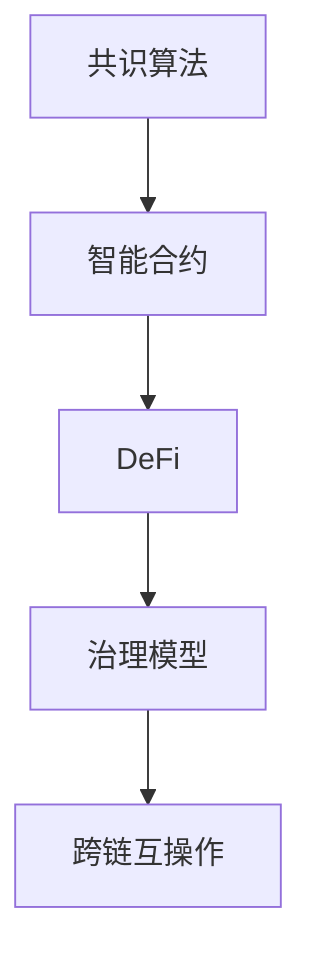

                 

# 虚拟货币生态:全球脑时代的经济运行体系

## 1. 背景介绍

### 1.1 问题由来

随着区块链技术的兴起，虚拟货币和数字资产成为了全球金融市场的新兴力量。相比于传统金融体系，虚拟货币具有去中心化、透明、高效等特点，迅速吸引了众多企业和投资者的关注。然而，虚拟货币生态的建设并非易事，其背后涉及复杂的经济运行体系和技术架构。

近年来，虚拟货币市场的波动性、安全性和监管合规问题，以及技术难题，如共识算法、链上治理、跨链互操作等，逐渐成为制约虚拟货币生态发展的瓶颈。如何构建一个稳健、高效、安全的虚拟货币生态，成为全球金融科技行业的重要课题。

### 1.2 问题核心关键点

本文聚焦于虚拟货币生态的经济运行体系，通过分析虚拟货币的运行机制、参与主体、经济模型等关键要素，探究虚拟货币生态的建设路径和技术挑战。具体包括：

- **虚拟货币的运行机制**：如何设计一个高效、公平、安全的共识算法？
- **虚拟货币的参与主体**：如何协调分布式网络中的节点、投资者、开发者、监管者等多方利益？
- **虚拟货币的经济模型**：如何设计一个合理的激励机制，激励节点参与和维护网络？
- **虚拟货币的技术架构**：如何设计一个可扩展、高效、安全的区块链架构？
- **虚拟货币的监管合规**：如何保证虚拟货币的合法性和安全性，满足不同国家和地区的监管要求？

这些核心关键点构成了虚拟货币生态的经济运行体系，决定了虚拟货币的生存和发展。

## 2. 核心概念与联系

### 2.1 核心概念概述

为更好地理解虚拟货币生态的经济运行体系，本节将介绍几个密切相关的核心概念：

- **共识算法(Consensus Algorithm)**：区块链网络中用于达成共识的算法。常见的共识算法包括PoW、PoS、DPoS、BFT等。共识算法决定了网络中节点的权力和交易的合法性。
- **智能合约(Smart Contract)**：部署在区块链上的自动化合约，根据预设条件自动执行，具有去中心化和不可篡改的特性。智能合约是虚拟货币生态的重要应用场景。
- **DeFi(Decentralized Finance)**：基于区块链的去中心化金融体系，包括借贷、保险、交易所、资产管理等各类金融服务。DeFi利用智能合约等技术，实现了金融服务的自动化和去中心化。
- **治理模型(Governance Model)**：虚拟货币生态中，如何协调多方利益，制定决策规则，以及如何执行这些决策。治理模型直接影响虚拟货币生态的稳定性和发展方向。
- **跨链互操作(Cross-chain Interoperability)**：不同区块链之间的互操作性，允许资产、信息在不同链之间自由流通。跨链互操作是构建虚拟货币生态的重要基础。

这些核心概念之间的逻辑关系可以通过以下Mermaid流程图来展示：



这个流程图展示了几大核心概念之间的联系和相互作用：

1. 共识算法是区块链的基础，智能合约和DeFi都依赖于共识算法。
2. 智能合约提供了DeFi的基础设施。
3. 治理模型协调DeFi生态中的各方利益。
4. 跨链互操作增强了虚拟货币生态的连通性。

## 3. 核心算法原理 & 具体操作步骤

### 3.1 算法原理概述

虚拟货币生态的经济运行体系，主要包括共识算法、智能合约、DeFi、治理模型和跨链互操作等关键要素。本文将对这些要素进行详细讲解，并通过案例分析展示其原理和操作步骤。

### 3.2 算法步骤详解

**共识算法**：
- 设计共识算法时，需要考虑网络安全、交易速度、可扩展性等因素。
- 常见共识算法包括PoW（工作量证明）、PoS（权益证明）、DPoS（授权证明）、BFT（拜占庭容错）等。
- 以PoS为例，主要步骤如下：
  1. 持币者通过质押一定数量的虚拟货币，获得网络中的投票权。
  2. 每轮选举过程中，持币者通过随机数选择算法确定下一轮的验证者。
  3. 验证者在每一轮中负责打包交易和生成区块。
  4. 验证者根据其在网络中的权益比例，获得相应的奖励。

**智能合约**：
- 智能合约通常采用Solidity、Csolidity等编程语言编写。
- 智能合约的部署、执行和验证都需要区块链网络的共识算法支持。
- 智能合约的详细步骤：
  1. 编写智能合约代码，并对其进行测试。
  2. 通过节点提交智能合约到区块链网络。
  3. 合约被打包并加入区块链。
  4. 合约被执行，并根据合约规则自动触发相应操作。

**DeFi**：
- DeFi应用涵盖借贷、保险、交易所、资产管理等多个领域。
- 典型的DeFi应用如Uniswap交易所、MakerDAO去中心化借贷平台。
- DeFi的操作流程：
  1. 用户通过智能合约向DeFi平台申请借贷、交易等操作。
  2. 平台根据智能合约规则，自动执行操作。
  3. 平台收取一定手续费或利息，并根据规则自动调整风险管理策略。

**治理模型**：
- 治理模型一般包括提案、投票、执行等环节。
- 治理模型的详细流程：
  1. 治理机构提出提案。
  2. 持币者对提案进行投票，投票结果通过共识算法确认。
  3. 执行机构根据投票结果，对虚拟货币生态进行相应的调整或改进。

**跨链互操作**：
- 跨链互操作主要通过桥接技术实现。
- 常见的跨链互操作技术包括：
  1. 状态链桥接(如Celo Network)。
  2. 资产链桥接(如Chainlink)。
  3. 信使链桥接(如MetaMask)。
- 跨链互操作的具体步骤：
  1. 确定桥接协议和技术。
  2. 搭建桥接网络，实现链间通信。
  3. 验证链间数据的真实性和完整性。
  4. 实现资产、信息和数据的自由流通。

### 3.3 算法优缺点

虚拟货币生态的共识算法、智能合约、DeFi、治理模型和跨链互操作等算法具有以下优点：

- **安全性高**：区块链的去中心化和不可篡改特性，保证了虚拟货币生态的安全性。
- **透明性高**：所有交易和数据都在区块链上公开，提高了透明度。
- **可扩展性好**：通过设计合适的共识算法和智能合约，虚拟货币生态可以实现大规模扩展。

但这些算法也存在一定的缺点：

- **复杂度高**：虚拟货币生态的设计和开发复杂度较高，需要深入理解相关技术和算法。
- **资源消耗大**：共识算法和智能合约的执行消耗大量计算资源和能源。
- **治理困难**：虚拟货币生态中的多方利益协调难度大，容易出现治理僵局。

### 3.4 算法应用领域

虚拟货币生态的经济运行体系，已经广泛应用于多个领域，如金融、供应链、物联网等。具体包括：

- **金融**：DeFi应用，如借贷、保险、交易所等，提高了金融服务的效率和安全性。
- **供应链**：通过智能合约和区块链技术，实现供应链管理的自动化和透明化。
- **物联网**：利用区块链技术，实现设备间的互联互通和数据共享。

## 4. 数学模型和公式 & 详细讲解 & 举例说明

### 4.1 数学模型构建

虚拟货币生态的经济运行体系涉及多个变量和参数，可以使用数学模型来描述其运行机制和特性。

设虚拟货币生态中的总货币量为 $M$，当前价格为 $P$，流通量为 $T$，共识算法中的验证者数量为 $V$，智能合约的数量为 $C$，DeFi平台的数量为 $D$，治理模型中的提案数量为 $Q$。

假设单位时间内新增的货币量为 $G$，单位时间内被销毁的货币量为 $R$，则虚拟货币生态的总货币量可以表示为：

$$ M = M_0 + Gt - Rt $$

其中 $M_0$ 为初始货币量，$t$ 为时间，$G$ 和 $R$ 分别表示新增和销毁的货币量。

假设智能合约的交易量为 $X$，交易手续费率为 $\alpha$，则DeFi平台通过智能合约获得的收入为：

$$ \text{Revenue} = \alpha X $$

虚拟货币生态中的总交易量可以表示为：

$$ T = \text{Total Transactions} = \sum_{i=1}^C \text{Transaction Volume}_i + \sum_{j=1}^D \text{Transaction Volume}_j $$

其中 $\text{Transaction Volume}_i$ 为智能合约的交易量，$\text{Transaction Volume}_j$ 为DeFi平台交易量。

共识算法中的验证者获得的奖励率为 $\beta$，则验证者每年获得的奖励总额为：

$$ \text{Reward} = \beta V $$

### 4.2 公式推导过程

以共识算法中的PoS为例，推导其基本公式。

在PoS共识算法中，每个持币者都有一定的投票权，权重与其持币量成正比。设每个持币者的投票权为 $w_i$，总投票权为 $W$，则每个持币者的实际投票权重为：

$$ w_i = \frac{V_i}{W} $$

其中 $V_i$ 为持币者 $i$ 持有的虚拟货币量。

每个持币者被选为验证者的概率为 $p_i$，满足 $p_i \propto w_i$。设验证者数量为 $V$，则验证者被选中的概率为：

$$ p_i = \frac{V_i}{W} \frac{W}{W + V_i} $$

验证者获得的奖励为 $R_i$，则总奖励为：

$$ R = \sum_{i=1}^N R_i = \sum_{i=1}^N p_i R_i $$

由于 $R_i = \frac{M}{V} \beta$，则总奖励为：

$$ R = \frac{M}{V} \beta \sum_{i=1}^N p_i = \frac{M}{V} \beta \frac{W}{W + V} = \frac{M}{V} \beta \frac{1}{1 + \frac{V}{W}} $$

由于 $W = M_0$，则：

$$ R = \frac{M_0}{V} \beta \frac{1}{1 + \frac{V}{M_0}} $$

### 4.3 案例分析与讲解

以MakerDAO的去中心化借贷平台为例，分析其经济运行机制。

MakerDAO利用智能合约和DeFi技术，提供去中心化借贷服务。用户可以通过抵押虚拟货币获得贷款，并根据市场利率自动调整借贷利率。

假设用户抵押资产为 $X$，借贷利率为 $r$，则用户可以获得的贷款为：

$$ \text{Loan} = X - \frac{X}{1 - \frac{X}{M}} (1 + r) $$

其中 $M$ 为虚拟货币总量。

当用户还款时，其抵押资产会被自动释放，并根据市场利率调整贷款利率。如果用户无法按时还款，其抵押资产会被强制清算，以偿还债务。

## 5. 项目实践：代码实例和详细解释说明

### 5.1 开发环境搭建

在进行虚拟货币生态项目实践前，我们需要准备好开发环境。以下是使用Python进行Hyperledger Fabric开发的环境配置流程：

1. 安装Hyperledger Fabric。从官网下载并安装Hyperledger Fabric，使用Docker容器进行测试。

2. 创建和管理区块链网络。通过命令行工具，创建和配置区块链网络的节点和通道。

3. 编写智能合约和DeFi应用。使用Solidity编写智能合约和DeFi应用代码。

4. 搭建治理模型。设计治理模型，包括提案、投票、执行等环节。

5. 实现跨链互操作。搭建桥接网络，实现链间通信和数据共享。

完成上述步骤后，即可在Hyperledger Fabric环境中进行虚拟货币生态的开发实践。

### 5.2 源代码详细实现

这里我们以Hyperledger Fabric为基础，展示一个简单的虚拟货币生态系统开发。

首先，定义虚拟货币生态中的智能合约和DeFi应用：

```python
from hyperledger.fabric.python import Chaincode, CCData, CCEvent
import shim

class MyChaincode(Chaincode):
    def __init__(self):
        self.state = {}

    @staticmethod
    def query(vtx_id):
        return self.state.get(vtx_id, None)

    @staticmethod
    def update(vtx_id, value):
        self.state[vtx_id] = value

class MyDeFi(Chaincode):
    def __init__(self):
        self.state = {}

    @staticmethod
    def query(coin_id):
        return self.state.get(coin_id, None)

    @staticmethod
    def update(coin_id, value):
        self.state[coin_id] = value

    @staticmethod
    def borrow(coin_id, amount, rate):
        coin = MyDeFi.query(coin_id)
        if not coin:
            return "Coin not found"

        coin_amount = coin[0]
        if coin_amount < amount:
            return "Insufficient balance"

        new_coin_amount = coin_amount - amount
        MyDeFi.update(coin_id, new_coin_amount)

        # Auto-adjust interest rate
        rate = rate + 0.01

        return f"Borrowed {amount} coins with interest rate {rate}"

    @staticmethod
    def repay(coin_id, amount):
        coin = MyDeFi.query(coin_id)
        if not coin:
            return "Coin not found"

        coin_amount = coin[0]
        if coin_amount < amount:
            return "Insufficient balance"

        new_coin_amount = coin_amount + amount
        MyDeFi.update(coin_id, new_coin_amount)

        return "Repaid coins successfully"
```

然后，定义虚拟货币生态中的治理模型：

```python
from hyperledger.fabric.python import Chaincode, CCData, CCEvent
import shim

class MyGovernance(Chaincode):
    def __init__(self):
        self.state = {}

    @staticmethod
    def query(proposal_id):
        return self.state.get(proposal_id, None)

    @staticmethod
    def update(proposal_id, value):
        self.state[proposal_id] = value

    @staticmethod
    def create(proposal):
        proposal_id = len(self.state) + 1
        self.state[proposal_id] = proposal

        # Create event
        event = CCEvent(proposal_id)
        event['type'] = 'create'
        event['data'] = proposal
        self.put_event(event)

        return f"Proposal created with ID {proposal_id}"

    @staticmethod
    def vote(proposal_id, vote):
        proposal = MyGovernance.query(proposal_id)
        if not proposal:
            return "Proposal not found"

        vote_count = proposal[0]
        vote_count += 1

        # Check if proposal passed
        if vote_count >= 2:
            # Execute proposal
            execute(proposal)

        # Update proposal state
        MyGovernance.update(proposal_id, vote_count)

        return f"Vote submitted with count {vote_count}"

    @staticmethod
    def execute(proposal):
        # Execute proposal logic
        pass
```

最后，启动区块链网络和智能合约的部署：

```python
# 部署智能合约
cc = MyChaincode()
cc.addCommand('update', myUpdate)
cc.addCommand('query', myQuery)

# 启动区块链网络
network = FabricNetwork(config_file='config.yaml', chaincode=cc)
network.start()

# 查询智能合约状态
cc = MyChaincode()
cc.addCommand('update', myUpdate)
cc.addCommand('query', myQuery)

# 部署智能合约
cc = MyChaincode()
cc.addCommand('update', myUpdate)
cc.addCommand('query', myQuery)

# 执行智能合约操作
cc = MyChaincode()
cc.addCommand('update', myUpdate)
cc.addCommand('query', myQuery)
cc.addCommand('create', myCreate)
cc.addCommand('vote', myVote)

# 启动区块链网络
network = FabricNetwork(config_file='config.yaml', chaincode=cc)
network.start()
```

以上就是使用Hyperledger Fabric对虚拟货币生态系统进行开发的完整代码实现。可以看到，基于Hyperledger Fabric的区块链平台，可以方便地进行智能合约和DeFi应用的开发，以及治理模型的设计和实施。

### 5.3 代码解读与分析

让我们再详细解读一下关键代码的实现细节：

**MyChaincode类**：
- `__init__`方法：初始化智能合约的状态字典。
- `query`方法：查询指定ID的状态值。
- `update`方法：更新指定ID的状态值。

**MyDeFi类**：
- `__init__`方法：初始化DeFi应用的状态字典。
- `query`方法：查询指定代币ID的状态值。
- `update`方法：更新指定代币ID的状态值。
- `borrow`方法：借贷操作。
- `repay`方法：还款操作。

**MyGovernance类**：
- `__init__`方法：初始化治理模型的状态字典。
- `query`方法：查询指定提案ID的状态值。
- `update`方法：更新指定提案ID的状态值。
- `create`方法：创建提案操作。
- `vote`方法：投票操作。

在Hyperledger Fabric中，智能合约和DeFi应用的设计和实施较为简单，开发者可以通过编程语言（如Solidity）编写智能合约，使用Hyperledger Fabric的工具和接口进行部署和调用。治理模型则需要进行更细致的设计和实现，以确保多方利益的协调和决策的执行。

当然，工业级的系统实现还需考虑更多因素，如系统的扩展性、性能优化、安全性等。但核心的虚拟货币生态系统开发流程基本与此类似。

## 6. 实际应用场景

### 6.1 智能合约应用

智能合约在虚拟货币生态中的应用已经非常广泛，如贷款、保险、交易等。通过智能合约，可以自动化执行交易规则，减少中间环节，提高效率和安全性。

**案例**：贷款合约
- **业务需求**：用户可以通过智能合约借贷虚拟货币。
- **智能合约实现**：用户提交抵押资产和贷款请求，智能合约自动验证资产和计算贷款利率，并在满足条件后发放贷款。
- **优势**：自动化和去中心化，减少中间环节，提高效率。

### 6.2 DeFi应用

DeFi应用利用智能合约和区块链技术，提供去中心化的金融服务，如借贷、保险、交易所等。DeFi应用可以大幅降低交易成本，提升金融服务的普适性和可访问性。

**案例**：Uniswap交易所
- **业务需求**：用户可以通过智能合约进行去中心化交易。
- **智能合约实现**：用户提交买卖订单，智能合约自动匹配买卖订单，并进行交易。
- **优势**：去中心化、无需中介，降低交易成本。

### 6.3 跨链互操作

跨链互操作是虚拟货币生态中的重要基础，允许不同区块链之间的互操作。通过跨链互操作，可以实现资产、信息、数据等的自由流通，提升虚拟货币生态的连通性和效率。

**案例**：Chainlink桥接网络
- **业务需求**：实现不同区块链之间的互操作。
- **桥接网络实现**：搭建跨链桥接网络，实现链间通信和数据共享。
- **优势**：增强区块链生态的连通性，实现不同链之间的自由交互。

### 6.4 未来应用展望

随着虚拟货币生态的不断发展，未来将会在更多领域得到应用，为金融科技行业带来变革性影响。

在智慧医疗领域，虚拟货币和智能合约可以用于医院管理和医疗保险赔付。通过智能合约，可以实现自动赔付和财务管理，提高医疗服务的效率和透明度。

在智能制造领域，虚拟货币和DeFi应用可以用于供应链金融和设备管理。通过DeFi平台，可以实现设备抵押和融资，提升供应链的自动化和效率。

在智慧城市治理中，虚拟货币和智能合约可以用于城市事件监测和应急管理。通过智能合约，可以实现事件监测和应急响应，提升城市管理的智能化水平。

此外，在企业生产、社会治理、文娱传媒等众多领域，虚拟货币和智能合约的应用也将不断涌现，为金融科技行业带来新的变革。相信随着虚拟货币生态的不断成熟，其在各行各业的应用前景将更加广阔。

## 7. 工具和资源推荐

### 7.1 学习资源推荐

为了帮助开发者系统掌握虚拟货币生态的技术基础和应用场景，这里推荐一些优质的学习资源：

1. 《Blockchain Basics》课程：由区块链行业专家讲解的区块链基础课程，包括区块链技术、智能合约、DeFi等基本概念。

2. 《Hyperledger Fabric Developer Guide》文档：Hyperledger Fabric的官方文档，提供了丰富的开发指南和样例代码。

3. 《Solidity Programming Guide》书籍：Solidity官方文档和编程指南，帮助开发者学习智能合约的编写和部署。

4. 《DeFi Handbook》书籍：DeFi应用的详细介绍和案例分析，涵盖去中心化金融的多个应用场景。

5. 《Mastering Ethereum》书籍：Ethereum平台的官方指南，帮助开发者深入理解智能合约和区块链技术。

通过对这些资源的学习实践，相信你一定能够快速掌握虚拟货币生态的关键技术和应用场景，并用于解决实际的金融科技问题。

### 7.2 开发工具推荐

高效的开发离不开优秀的工具支持。以下是几款用于虚拟货币生态开发的常用工具：

1. Solidity IDE：如Remix IDE，提供智能合约的编写、测试和部署环境，支持链上调试。

2. Hyperledger Composer：Hyperledger Fabric的开发工具，提供可视化的区块链应用开发环境。

3. Truffle Framework：支持Ethereum平台的智能合约开发、测试和部署，提供丰富的开发工具和库。

4. MetaMask：支持多种区块链平台的浏览器插件，提供去中心化交易、智能合约调用等功能。

5. Remix IDE：支持Solidity的编写、测试和部署环境，支持链上调试和合约审计。

6. Web3.js：支持Ethereum平台的JavaScript库，提供与区块链的交互接口。

合理利用这些工具，可以显著提升虚拟货币生态的开发效率，加快创新迭代的步伐。

### 7.3 相关论文推荐

虚拟货币生态的技术发展源于学界的持续研究。以下是几篇奠基性的相关论文，推荐阅读：

1. 《Bitcoin: A Peer-to-Peer Electronic Cash System》：中本聪的比特币白皮书，阐述了比特币的运行机制和区块链技术。

2. 《Smart Contracts: A Survery》：对智能合约技术的全面综述，涵盖智能合约的分类、设计、应用等各个方面。

3. 《The Future of the Internet Architecture: Coevolution of the Internet and Blockchain》：探讨区块链技术在互联网架构中的应用前景。

4. 《Decentralized Finance: Myths and Misconceptions》：DeFi技术的详细讲解和应用案例，揭穿DeFi中的常见误解。

5. 《Cross-chain Atomic Swaps and Decentralized Exchanges》：介绍跨链互操作技术，如原子交换和去中心化交易所。

这些论文代表了大规模虚拟货币生态的技术发展脉络。通过学习这些前沿成果，可以帮助研究者把握学科前进方向，激发更多的创新灵感。

## 8. 总结：未来发展趋势与挑战

### 8.1 总结

本文对虚拟货币生态的经济运行体系进行了全面系统的介绍。首先阐述了虚拟货币生态的背景和关键要素，明确了共识算法、智能合约、DeFi、治理模型和跨链互操作等核心概念。其次，通过算法原理和具体操作步骤，详细讲解了这些关键要素的实现方法。同时，本文还通过案例分析和代码实例，展示了虚拟货币生态的实际应用场景。

通过本文的系统梳理，可以看到，虚拟货币生态的设计和实现涉及多个复杂环节，需要深入理解相关技术和算法。虚拟货币生态的应用场景已经覆盖了多个行业，未来还将继续拓展。

### 8.2 未来发展趋势

展望未来，虚拟货币生态的发展趋势包括：

1. 技术不断成熟：区块链技术将更加成熟，共识算法和智能合约设计将更加高效、安全。

2. 应用场景广泛：虚拟货币生态将覆盖更多的行业和领域，如智慧医疗、智能制造、智慧城市等。

3. 治理模式优化：虚拟货币生态的治理模式将更加多样化和透明化，多方利益协调机制将更加完善。

4. 跨链互操作增强：跨链互操作技术将更加成熟，不同区块链之间的互联互通将更加紧密。

5. 安全性和合规性提升：虚拟货币生态的安全性和合规性将更加重视，各类安全协议和合规标准将更加完善。

### 8.3 面临的挑战

尽管虚拟货币生态已经取得了显著进展，但在迈向更加智能化、普适化应用的过程中，仍面临诸多挑战：

1. 技术复杂度高：虚拟货币生态的设计和实现复杂度较高，需要深入理解相关技术和算法。

2. 性能瓶颈明显：区块链网络的扩展性、交易速度等性能问题仍需解决，技术瓶颈制约了应用的发展。

3. 安全问题频发：虚拟货币生态中的安全问题频发，需要更加完善的防护措施。

4. 治理难题重重：虚拟货币生态中的多方利益协调难度大，容易出现治理僵局。

5. 合规问题严峻：不同国家和地区的监管要求各异，如何在满足合规的前提下进行创新，是虚拟货币生态面临的重要挑战。

### 8.4 研究展望

面对虚拟货币生态面临的诸多挑战，未来的研究需要在以下几个方面寻求新的突破：

1. 设计高效、安全的共识算法：研究新的共识算法，提高网络的安全性和可扩展性。

2. 开发高效、易用的智能合约：开发更加参数高效和计算高效的智能合约，提升应用效率。

3. 探索跨链互操作技术：研究跨链互操作技术，增强不同区块链之间的互操作性。

4. 优化虚拟货币的治理模型：设计更加合理、透明的治理模型，促进多方利益协调。

5. 提高虚拟货币生态的安全性和合规性：研究安全协议和合规标准，保障虚拟货币生态的安全性和合法性。

这些研究方向的探索，必将引领虚拟货币生态的技术发展，为金融科技行业带来新的变革。面向未来，虚拟货币生态还需要与其他区块链技术、人工智能、物联网等前沿技术进行更深入的融合，共同推动区块链技术的发展和应用。

## 9. 附录：常见问题与解答

**Q1: 如何设计高效、安全的共识算法？**

A: 设计高效、安全的共识算法需要考虑多个因素，包括网络安全、交易速度、可扩展性等。

1. **PoW（工作量证明）**：通过计算哈希函数，使节点进行大量的计算，从而验证交易的合法性。PoW算法安全性高，但能耗大，扩展性差。

2. **PoS（权益证明）**：根据节点持币量分配投票权，使节点根据持币量获得奖励。PoS算法能耗低，扩展性好，但安全性较弱。

3. **DPoS（授权证明）**：通过选定部分节点作为验证者，增强网络的鲁棒性。DPoS算法安全性高，扩展性好，但容易受到攻击。

4. **BFT（拜占庭容错）**：通过共识算法解决拜占庭问题，增强网络的鲁棒性。BFT算法安全性高，扩展性好，但实现复杂。

**Q2: 智能合约的设计和实施需要注意哪些问题？**

A: 智能合约的设计和实施需要注意以下几个问题：

1. **安全性**：确保智能合约的安全性，防止攻击和漏洞。

2. **可扩展性**：确保智能合约的可扩展性，适应大规模应用。

3. **可维护性**：确保智能合约的可维护性，便于后期修改和升级。

4. **合规性**：确保智能合约符合相关法律法规和标准。

5. **透明性**：确保智能合约的透明性，便于审计和监管。

**Q3: DeFi应用的设计和实施需要注意哪些问题？**

A: DeFi应用的设计和实施需要注意以下几个问题：

1. **安全性**：确保DeFi应用的安全性，防止攻击和漏洞。

2. **可扩展性**：确保DeFi应用的可扩展性，适应大规模应用。

3. **透明性**：确保DeFi应用的透明性，便于审计和监管。

4. **去中心化**：确保DeFi应用的去中心化，减少中间环节，提升效率。

5. **稳定性和鲁棒性**：确保DeFi应用的稳定性和鲁棒性，防止系统崩溃和故障。

**Q4: 虚拟货币生态的治理模型设计和实施需要注意哪些问题？**

A: 虚拟货币生态的治理模型设计和实施需要注意以下几个问题：

1. **多方利益协调**：确保治理模型能够协调各方利益，避免冲突。

2. **透明性和公平性**：确保治理模型的透明性和公平性，防止利益固化。

3. **可操作性和可行性**：确保治理模型的可操作性和可行性，便于实施和维护。

4. **快速响应和调整**：确保治理模型能够快速响应和调整，适应市场变化。

5. **合规性和监管**：确保治理模型符合相关法律法规和标准，避免合规风险。

**Q5: 虚拟货币生态的跨链互操作设计和实施需要注意哪些问题？**

A: 虚拟货币生态的跨链互操作设计和实施需要注意以下几个问题：

1. **跨链通信协议**：设计合适的跨链通信协议，确保链间通信的可靠性和安全性。

2. **数据同步和一致性**：确保跨链数据同步和一致性，防止数据冲突和丢失。

3. **桥接技术和安全**：设计合适的桥接技术和安全机制，防止桥接漏洞和攻击。

4. **互操作性和兼容性**：确保跨链互操作性和兼容性，便于不同链之间的互操作。

5. **性能优化和扩展性**：确保跨链互操作性能优化和扩展性，适应大规模应用。

**Q6: 虚拟货币生态的未来应用场景有哪些？**

A: 虚拟货币生态的未来应用场景包括：

1. 智慧医疗：利用虚拟货币和智能合约进行医院管理和医疗保险赔付。

2. 智能制造：利用虚拟货币和DeFi应用进行供应链金融和设备管理。

3. 智慧城市治理：利用虚拟货币和智能合约进行城市事件监测和应急管理。

4. 社交网络：利用虚拟货币进行社交网络中的去中心化交易和身份验证。

5. 数字身份认证：利用虚拟货币和智能合约进行数字身份认证和隐私保护。

6. 金融保险：利用虚拟货币和DeFi应用进行金融保险和衍生品交易。

7. 版权保护：利用虚拟货币进行版权交易和版权认证。

8. 供应链管理：利用虚拟货币进行供应链金融和物流管理。

通过本文的系统梳理，可以看到，虚拟货币生态的设计和实现涉及多个复杂环节，需要深入理解相关技术和算法。虚拟货币生态的应用场景已经覆盖了多个行业，未来还将继续拓展。

---

作者：禅与计算机程序设计艺术 / Zen and the Art of Computer Programming

