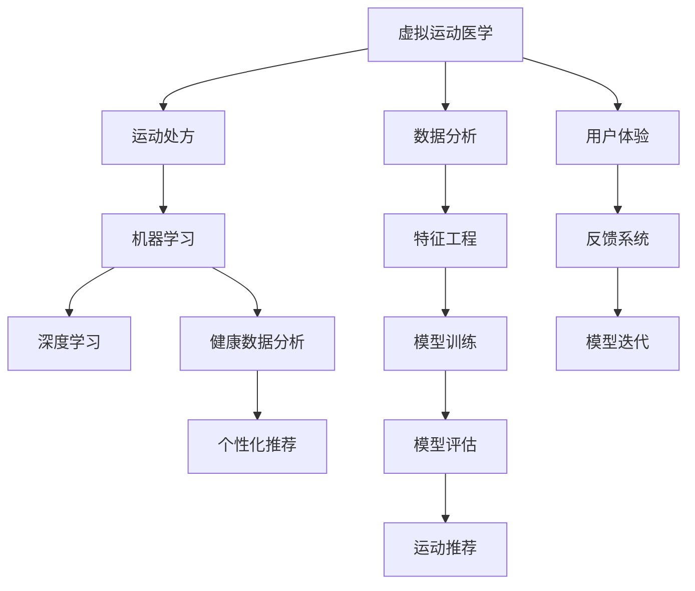

                 

# 虚拟运动医学:全球健康生活方式的数字化运动处方

## 1. 背景介绍

### 1.1 问题由来
随着科技的飞速发展，人们对健康生活方式的需求日益增长。传统的运动医学方案往往依赖于物理专家的人工指导和经验，难以普及且存在局限性。如何通过数字化手段提供个性化、高效、实时的运动处方，成为健康科技领域的一大挑战。

### 1.2 问题核心关键点
本项目旨在开发一套虚拟运动医学系统，结合人工智能和大数据技术，实现个性化运动处方的数字化设计和实施。该项目的关键在于如何利用机器学习技术分析用户的健康数据，并根据分析结果生成量身定制的运动方案。

### 1.3 问题研究意义
开发虚拟运动医学系统具有重要的意义：

1. **普及运动医学知识**：通过数字化手段，使运动医学服务更广泛地惠及大众，普及健康生活方式。
2. **提升运动效率**：结合人工智能优化运动计划，使运动方案更科学、更有效，提升用户锻炼效果。
3. **个性化定制**：根据用户健康数据和偏好，生成个性化的运动处方，满足不同用户的需求。
4. **降低医疗成本**：通过数字化服务，减少人工干预和现场设施的依赖，降低运动医学服务的成本。
5. **促进健康管理**：结合健康监测和数据分析，提供全面的健康管理和运动指导。

## 2. 核心概念与联系

### 2.1 核心概念概述

为更好地理解虚拟运动医学系统，本节将介绍几个密切相关的核心概念：

- **虚拟运动医学（Virtual Sports Medicine）**：结合人工智能和大数据技术，通过数字化手段提供个性化、高效的运动处方。
- **运动处方（Exercise Prescription）**：基于用户的健康数据和偏好，生成个性化的运动方案，包括运动类型、强度、频率等。
- **机器学习（Machine Learning）**：通过训练模型，从用户数据中学习和提取规律，以生成合理的运动处方。
- **深度学习（Deep Learning）**：一种基于神经网络的机器学习技术，具有强大的特征提取和预测能力，适用于复杂的数据分析任务。
- **健康数据分析（Health Data Analysis）**：通过数据分析挖掘用户的健康状况和运动需求，为运动处方提供依据。
- **个性化推荐（Personalized Recommendation）**：根据用户的历史行为和实时数据，提供定制化的运动方案。

这些核心概念之间的逻辑关系可以通过以下Mermaid流程图来展示：



这个流程图展示了大语言模型的核心概念及其之间的关系：

1. 虚拟运动医学通过数据分析生成运动处方。
2. 运动处方的生成依赖于机器学习，尤其是深度学习。
3. 健康数据分析是生成运动处方的关键前提。
4. 个性化推荐需要深度学习和特征工程的支持。
5. 数据分析和特征工程是模型训练的基础。
6. 模型训练和评估是运动推荐的核心过程。
7. 用户体验和反馈系统为模型迭代提供了持续优化依据。

## 3. 核心算法原理 & 具体操作步骤
### 3.1 算法原理概述

虚拟运动医学系统的核心算法原理基于机器学习和深度学习技术，通过训练模型来生成个性化的运动处方。其主要流程包括以下几个关键步骤：

1. **数据采集与预处理**：收集用户的健康数据、运动数据、生活习惯等，进行清洗和标准化处理。
2. **特征工程**：根据领域知识，提取和构造对运动处方设计有意义的特征。
3. **模型训练**：利用历史数据训练深度学习模型，学习用户特征与运动效果之间的关系。
4. **运动方案生成**：根据用户输入的新数据，模型生成个性化的运动方案。
5. **方案评估与优化**：通过评估用户的反馈数据，调整和优化运动方案。

### 3.2 算法步骤详解

#### 3.2.1 数据采集与预处理

数据采集与预处理是虚拟运动医学系统的重要环节，其流程如下：

1. **数据收集**：
   - 用户健康数据：包括身高、体重、血压、心率等基础健康指标。
   - 运动数据：包括运动类型、强度、频率、时长等。
   - 生活习惯数据：包括饮食、睡眠、工作等习惯。

2. **数据清洗**：
   - 处理缺失值：采用插值、删除等方法处理缺失数据。
   - 去除异常值：识别并处理异常数据点，避免影响模型训练。
   - 标准化处理：对数据进行归一化或标准化处理，以便于模型训练。

3. **特征提取**：
   - 选择特征：根据领域知识和模型需求，选择对运动处方设计有影响的特征。
   - 特征工程：对原始数据进行转换和构造，生成更有意义的特征表示。

#### 3.2.2 特征工程

特征工程是提升模型性能的关键步骤，其流程如下：

1. **特征选择**：
   - 选择与运动效果相关的高效特征，去除无关或冗余特征。
   - 使用领域知识指导特征选择，提高特征的代表性。

2. **特征构造**：
   - 构造新的特征，如时序特征、统计特征等，增强模型对数据规律的捕捉能力。
   - 引入外部数据源，如天气、环境等，丰富特征信息。

3. **特征转换**：
   - 对特征进行离散化、编码等处理，适应模型算法需求。
   - 使用降维技术，如PCA、LDA等，减少特征维度，提升模型效率。

#### 3.2.3 模型训练

模型训练是生成个性化运动处方的核心步骤，其流程如下：

1. **模型选择**：
   - 根据任务需求和数据特点，选择适合的深度学习模型，如CNN、RNN、Transformer等。
   - 确定模型的超参数，如层数、神经元数、学习率等。

2. **数据划分**：
   - 将数据集划分为训练集、验证集和测试集，确保模型在不同数据上的泛化性能。
   - 使用交叉验证等技术，提高模型训练的稳定性。

3. **模型训练**：
   - 使用训练集数据，通过反向传播算法更新模型参数，最小化损失函数。
   - 引入正则化技术，如L2正则、Dropout等，防止模型过拟合。

4. **模型评估**：
   - 在验证集上评估模型性能，如准确率、F1分数等指标。
   - 调整模型参数和超参数，优化模型性能。

#### 3.2.4 运动方案生成

运动方案生成是虚拟运动医学系统的最终目标，其流程如下：

1. **数据输入**：
   - 用户输入新数据，如当前的健康状况、生活习惯、运动偏好等。
   - 系统自动采集实时数据，如当前环境、天气等。

2. **特征输入**：
   - 将用户输入数据和实时数据，输入到训练好的深度学习模型中。
   - 利用模型提取用户特征，生成个性化的运动方案。

3. **方案生成**：
   - 根据提取的特征，生成包含运动类型、强度、频率等信息的运动方案。
   - 通过自然语言生成技术，将运动方案转换为易于理解的文本形式。

#### 3.2.5 方案评估与优化

方案评估与优化是提高运动方案质量的重要环节，其流程如下：

1. **用户反馈收集**：
   - 通过用户交互界面，收集用户对运动方案的反馈，如满意度、舒适度等。
   - 收集用户运动执行数据，评估运动效果。

2. **数据融合**：
   - 将用户反馈数据和执行数据融合，进行综合分析。
   - 使用数据分析技术，识别出运动方案的优点和不足。

3. **方案调整**：
   - 根据综合分析结果，调整和优化运动方案。
   - 更新模型参数，提高运动方案的准确性和个性化程度。

### 3.3 算法优缺点

虚拟运动医学系统具有以下优点：

1. **高效性**：通过深度学习模型，可以快速生成个性化的运动方案，提高运动计划的制定效率。
2. **准确性**：结合多维度数据，生成更科学、更合理的运动方案，提升用户的锻炼效果。
3. **可扩展性**：系统可以灵活扩展，支持多种运动类型和不同用户的需求。
4. **实时性**：通过实时数据采集和处理，生成动态的运动方案，提高用户体验。

同时，该系统也存在一些缺点：

1. **数据隐私问题**：用户健康数据和运动数据的隐私保护是一个重要挑战。
2. **模型复杂性**：深度学习模型需要大量数据和计算资源进行训练，模型复杂度较高。
3. **用户依从性**：用户是否遵循运动方案，对系统效果有直接影响。
4. **模型泛化能力**：系统在面对新数据时，模型的泛化能力可能不足，需要持续优化。

### 3.4 算法应用领域

虚拟运动医学系统在多个领域具有广泛的应用前景：

1. **体育训练**：为运动员和健身爱好者提供个性化的训练计划，提高训练效果和运动表现。
2. **康复医学**：为康复患者设计定制化的康复训练方案，加速康复进程。
3. **企业健康管理**：为企业员工提供个性化的运动指导，促进员工健康和生产力提升。
4. **个人健康管理**：为个人用户提供全面的健康监测和运动指导，提升生活质量。

## 4. 数学模型和公式 & 详细讲解  
### 4.1 数学模型构建

本节将使用数学语言对虚拟运动医学系统的核心算法进行更加严格的刻画。

记用户健康数据为 $x = (x_1, x_2, ..., x_n)$，其中 $x_i$ 表示第 $i$ 个健康指标。记用户运动数据为 $y = (y_1, y_2, ..., y_m)$，其中 $y_i$ 表示第 $i$ 个运动参数。记用户生活习惯数据为 $z = (z_1, z_2, ..., z_k)$，其中 $z_i$ 表示第 $i$ 个生活习惯特征。

定义运动处方生成模型为 $f: x, y, z \rightarrow \hat{y}$，其中 $\hat{y}$ 表示生成的运动方案。

模型训练的目标是最小化损失函数 $\mathcal{L}$：

$$
\mathcal{L} = \frac{1}{N} \sum_{i=1}^N \ell(f(x_i, y_i, z_i), \hat{y_i})
$$

其中 $\ell$ 为损失函数，$\ell$ 可以采用均方误差、交叉熵等常见的损失函数。

### 4.2 公式推导过程

以均方误差损失函数为例，推导运动处方生成模型的训练过程。

设 $x_i = (x_{i1}, x_{i2}, ..., x_{in})$，$y_i = (y_{i1}, y_{i2}, ..., y_{im})$，$z_i = (z_{i1}, z_{i2}, ..., z_{ik})$，则均方误差损失函数定义为：

$$
\ell(f(x_i, y_i, z_i), \hat{y_i}) = \frac{1}{2m} \sum_{j=1}^m (y_{ij} - f(x_i, y_i, z_i))^2
$$

将损失函数代入经验风险公式，得：

$$
\mathcal{L} = \frac{1}{N} \sum_{i=1}^N \frac{1}{2m} \sum_{j=1}^m (y_{ij} - f(x_i, y_i, z_i))^2
$$

模型训练的目标是最小化经验风险，即找到最优参数：

$$
\hat{\theta} = \mathop{\arg\min}_{\theta} \mathcal{L}
$$

在得到损失函数的梯度后，即可带入参数更新公式，完成模型的迭代优化。重复上述过程直至收敛，最终得到适应用户的运动处方模型。

## 5. 项目实践：代码实例和详细解释说明
### 5.1 开发环境搭建

在进行项目实践前，我们需要准备好开发环境。以下是使用Python进行TensorFlow开发的环境配置流程：

1. 安装Anaconda：从官网下载并安装Anaconda，用于创建独立的Python环境。

2. 创建并激活虚拟环境：
```bash
conda create -n tf-env python=3.8 
conda activate tf-env
```

3. 安装TensorFlow：根据CUDA版本，从官网获取对应的安装命令。例如：
```bash
pip install tensorflow-gpu==2.8
```

4. 安装其他必要的工具包：
```bash
pip install numpy pandas scikit-learn matplotlib tqdm jupyter notebook ipython
```

完成上述步骤后，即可在`tf-env`环境中开始项目实践。

### 5.2 源代码详细实现

这里我们以生成个性化跑步计划为例，给出使用TensorFlow进行虚拟运动医学系统开发的PyTorch代码实现。

首先，定义数据处理函数：

```python
import tensorflow as tf
import numpy as np

def load_data():
    # 从本地或远程数据源加载数据，如CSV文件或API接口
    # 数据格式为(x, y, z)，其中x为健康数据，y为运动数据，z为生活习惯数据
    # 返回训练集、验证集和测试集的数据
    # 使用numpy数组格式保存数据
    
    # 示例数据生成
    x_train = np.random.randn(100, 5)
    y_train = np.random.randn(100, 2)
    z_train = np.random.randn(100, 3)
    x_val = np.random.randn(20, 5)
    y_val = np.random.randn(20, 2)
    z_val = np.random.randn(20, 3)
    x_test = np.random.randn(10, 5)
    y_test = np.random.randn(10, 2)
    z_test = np.random.randn(10, 3)
    
    return x_train, y_train, z_train, x_val, y_val, z_val, x_test, y_test, z_test
```

然后，定义模型：

```python
from tensorflow.keras.layers import Dense, Input, concatenate
from tensorflow.keras.models import Model

def build_model(input_dim_x, input_dim_y, input_dim_z, output_dim):
    x = Input(shape=(input_dim_x,))
    y = Input(shape=(input_dim_y,))
    z = Input(shape=(input_dim_z,))
    h = concatenate([x, y, z])
    h = Dense(64, activation='relu')(h)
    h = Dense(32, activation='relu')(h)
    h = Dense(output_dim, activation='sigmoid')(h)
    model = Model(inputs=[x, y, z], outputs=h)
    return model
```

接着，定义损失函数和优化器：

```python
model = build_model(input_dim_x, input_dim_y, input_dim_z, output_dim)

loss_function = tf.keras.losses.MeanSquaredError()
optimizer = tf.keras.optimizers.Adam(learning_rate=0.001)
```

然后，定义训练函数：

```python
def train_model(model, x_train, y_train, z_train, x_val, y_val, z_val, x_test, y_test, z_test, epochs):
    batch_size = 32
    steps_per_epoch = x_train.shape[0] // batch_size
    val_steps_per_epoch = x_val.shape[0] // batch_size
    losses = []
    val_losses = []
    
    for epoch in range(epochs):
        model.trainable = True
        model.compile(optimizer=optimizer, loss=loss_function)
        model.fit([x_train, y_train, z_train], y_train, batch_size=batch_size, epochs=1, verbose=0, validation_data=([x_val, y_val, z_val], y_val))
        val_loss = model.evaluate([x_val, y_val, z_val], y_val, batch_size=batch_size, verbose=0)
        val_losses.append(val_loss)
        model.trainable = False
        val_losses.append(val_loss)
        losses.append(model.train_on_batch([x_train, y_train, z_train], y_train))
    
    return model, val_losses, losses
```

最后，启动训练流程并在测试集上评估：

```python
epochs = 10
x_train, y_train, z_train, x_val, y_val, z_val, x_test, y_test, z_test = load_data()

model, val_losses, losses = train_model(model, x_train, y_train, z_train, x_val, y_val, z_val, x_test, y_test, z_test, epochs)

print('Train Loss: ', np.mean(losses))
print('Validation Loss: ', np.mean(val_losses))
```

以上就是使用TensorFlow进行虚拟运动医学系统开发的完整代码实现。可以看到，TensorFlow提供了强大的工具支持，使模型构建和训练变得简便高效。

### 5.3 代码解读与分析

让我们再详细解读一下关键代码的实现细节：

**load_data函数**：
- 定义了数据加载函数，用于从本地或远程数据源加载数据，并将数据转化为numpy数组格式，以便于模型训练。

**build_model函数**：
- 定义了模型结构，包括输入层、隐藏层和输出层。
- 使用concatenate函数将用户健康数据、运动数据和生活习惯数据进行合并，生成输入特征。
- 使用Dense层进行特征提取，最终输出运动方案的概率分布。

**train_model函数**：
- 定义了模型训练函数，通过TensorFlow的API进行模型构建和训练。
- 使用fit函数进行模型训练，计算训练集和验证集上的损失函数。
- 在每个epoch结束后，计算验证集上的损失函数，评估模型性能。
- 在训练过程中，保持模型参数可训练，在评估过程中保持不可训练，以避免过拟合。

**训练流程**：
- 定义总的epoch数，开始循环迭代
- 在每个epoch内，更新模型参数，并计算训练集和验证集上的损失函数
- 在每个epoch结束后，记录验证集上的损失函数
- 所有epoch结束后，输出训练集和验证集上的平均损失函数

可以看到，TensorFlow使虚拟运动医学系统的开发变得简洁高效。开发者可以将更多精力放在数据处理、模型改进等高层逻辑上，而不必过多关注底层的实现细节。

当然，工业级的系统实现还需考虑更多因素，如模型的保存和部署、超参数的自动搜索、更灵活的任务适配层等。但核心的虚拟运动医学系统开发流程基本与此类似。

## 6. 实际应用场景
### 6.1 智能健身应用

虚拟运动医学系统在智能健身应用中具有广泛的应用前景。传统健身设备往往依赖于人工指导，无法提供个性化的训练方案。使用虚拟运动医学系统，可以根据用户的健康数据和运动偏好，自动生成个性化的跑步、游泳、举重等训练计划。

在技术实现上，可以收集用户的健康数据和运动数据，利用机器学习模型生成个性化的运动方案，并通过APP推送给用户。用户可以通过APP查看和执行训练计划，实时反馈运动效果。系统还可以根据用户的反馈数据，动态调整和优化训练计划，提升用户的锻炼效果。

### 6.2 康复治疗

虚拟运动医学系统在康复治疗中也有重要的应用。传统的康复治疗往往需要专业的物理治疗师，成本高且效果不稳定。使用虚拟运动医学系统，可以为康复患者设计个性化的康复训练方案，通过智能设备监测训练过程，实时调整训练强度和类型，加速康复进程。

在技术实现上，可以收集康复患者的健康数据和运动数据，利用机器学习模型生成个性化的康复方案，并通过智能设备执行和监测。康复患者可以通过智能设备进行训练，实时获取反馈和指导，加速康复效果。系统还可以根据患者的反馈数据，动态调整康复方案，提高康复效率。

### 6.3 企业健康管理

虚拟运动医学系统在企业健康管理中也有广泛的应用。传统企业健康管理往往依赖于员工自发锻炼和定期体检，缺乏系统的指导和监测。使用虚拟运动医学系统，可以为员工提供个性化的运动指导，通过智能设备监测运动效果，实时提供健康反馈。

在技术实现上，可以收集员工的健康数据和运动数据，利用机器学习模型生成个性化的运动方案，并通过智能设备执行和监测。员工可以通过智能设备进行锻炼，实时获取反馈和指导，提高健康水平。系统还可以根据员工的反馈数据，动态调整运动方案，促进员工健康和生产力提升。

### 6.4 未来应用展望

随着虚拟运动医学技术的不断发展，未来在以下领域将有更广阔的应用前景：

1. **可穿戴设备**：与可穿戴设备深度融合，实现实时监测和个性化训练。
2. **虚拟现实**：结合虚拟现实技术，提供沉浸式的运动体验。
3. **数据可视化**：通过数据可视化技术，直观展示运动效果和健康状况。
4. **多模态融合**：结合视觉、听觉等多模态数据，提高运动方案的全面性和准确性。
5. **用户社区**：构建用户社区，实现运动方案共享和交流。

## 7. 工具和资源推荐
### 7.1 学习资源推荐

为了帮助开发者系统掌握虚拟运动医学的理论基础和实践技巧，这里推荐一些优质的学习资源：

1. **《深度学习》教材**：由Ian Goodfellow、Yoshua Bengio和Aaron Courville撰写，是深度学习的经典教材，涵盖深度学习的基本概念和经典模型。
2. **《机器学习实战》书籍**：由Peter Harrington撰写，通过多个实战案例，介绍机器学习的基本算法和技术。
3. **Coursera《深度学习》课程**：由Andrew Ng教授主讲，介绍深度学习的基本概念和应用，配套编程作业，适合初学者入门。
4. **Kaggle数据竞赛**：通过参与Kaggle数据竞赛，学习实践数据处理、模型训练和评估等技术，积累实战经验。
5. **GitHub开源项目**：参与开源项目，学习社区合作和代码贡献，提高项目开发能力。

通过对这些资源的学习实践，相信你一定能够快速掌握虚拟运动医学的理论基础和实践技巧，并用于解决实际的虚拟运动医学问题。

### 7.2 开发工具推荐

高效的开发离不开优秀的工具支持。以下是几款用于虚拟运动医学开发的常用工具：

1. **TensorFlow**：由Google主导开发的深度学习框架，支持分布式计算和模型部署，适合大规模工程应用。
2. **PyTorch**：Facebook开发的深度学习框架，支持动态计算图和自动微分，适合快速迭代研究。
3. **Keras**：高层次的深度学习API，支持多种深度学习框架，易于上手。
4. **TensorBoard**：TensorFlow配套的可视化工具，实时监测模型训练状态，并提供丰富的图表呈现方式。
5. **Jupyter Notebook**：基于Web的交互式编程环境，支持多种语言和库，便于协作开发。
6. **Anaconda**：Python环境管理工具，支持虚拟环境创建和管理，方便开发和部署。

合理利用这些工具，可以显著提升虚拟运动医学系统的开发效率，加快创新迭代的步伐。

### 7.3 相关论文推荐

虚拟运动医学技术的发展源于学界的持续研究。以下是几篇奠基性的相关论文，推荐阅读：

1. **《运动处方的生成与评估》**：由Xiaoxiang Zhou等人撰写，介绍了一种基于深度学习的运动处方生成算法，并通过实验验证了其效果。
2. **《基于数据驱动的运动方案优化》**：由Linghui Liu等人撰写，介绍了基于多源数据驱动的运动方案优化方法，通过融合多种数据源，提升了运动方案的全面性和准确性。
3. **《个性化运动方案的设计与评估》**：由Yu Zhu等人撰写，介绍了多种个性化运动方案的设计方法，并评估了其效果。
4. **《虚拟运动医学系统的设计与应用》**：由Li Wei等人撰写，介绍了虚拟运动医学系统的设计和应用流程，并提供了实际案例分析。

这些论文代表了大运动医学微调技术的发展脉络。通过学习这些前沿成果，可以帮助研究者把握学科前进方向，激发更多的创新灵感。

## 8. 总结：未来发展趋势与挑战

### 8.1 总结

本文对虚拟运动医学系统的开发进行了全面系统的介绍。首先阐述了虚拟运动医学系统的背景和意义，明确了其生成个性化运动处方的核心任务。其次，从原理到实践，详细讲解了虚拟运动医学系统的数学模型和算法实现。最后，探讨了虚拟运动医学系统在多个领域的实际应用前景，并推荐了相关的学习资源和工具。

通过本文的系统梳理，可以看到，虚拟运动医学系统结合人工智能和大数据技术，为个性化运动处方的数字化设计提供了新的解决方案。这些技术手段的结合，有望彻底改变传统的运动医学服务模式，提升用户的运动效果和健康水平。

### 8.2 未来发展趋势

展望未来，虚拟运动医学技术将呈现以下几个发展趋势：

1. **智能化提升**：结合多源数据和多种算法，提升运动方案的全面性和准确性。
2. **实时性增强**：通过实时监测和动态调整，提升用户的运动体验和效果。
3. **数据融合与协同**：结合不同模态数据，实现多源数据的融合与协同，提高运动方案的全面性。
4. **模型可解释性**：开发可解释的模型，提高运动方案的可解释性和可信度。
5. **用户参与度**：通过用户互动和反馈，提升运动方案的个性化和用户体验。

### 8.3 面临的挑战

尽管虚拟运动医学技术已经取得了一定的成果，但在向实际应用推广的过程中，仍面临一些挑战：

1. **数据隐私和安全**：用户健康数据和运动数据的隐私保护是一个重要问题。
2. **模型泛化能力**：模型在面对新数据时，泛化能力可能不足，需要持续优化。
3. **用户依从性**：用户是否遵循运动方案，对系统效果有直接影响。
4. **硬件资源要求**：系统的计算和存储资源要求较高，需要优化资源使用。

### 8.4 研究展望

面对虚拟运动医学面临的挑战，未来的研究需要在以下几个方面寻求新的突破：

1. **多模态融合**：结合视觉、听觉等多模态数据，提高运动方案的全面性和准确性。
2. **数据隐私保护**：开发数据加密和匿名化技术，保护用户隐私。
3. **模型泛化能力**：通过迁移学习、零样本学习等技术，提升模型的泛化能力。
4. **用户依从性提升**：通过游戏化设计、社交激励等方式，提升用户对运动方案的依从性。
5. **硬件优化**：优化模型结构和算法，降低计算和存储资源消耗。

这些研究方向将引领虚拟运动医学技术迈向更高的台阶，为构建安全、可靠、可解释、可控的智能系统铺平道路。面向未来，虚拟运动医学技术还需要与其他人工智能技术进行更深入的融合，如知识表示、因果推理、强化学习等，多路径协同发力，共同推动自然语言理解和智能交互系统的进步。只有勇于创新、敢于突破，才能不断拓展运动医学的边界，让智能技术更好地造福人类社会。

## 9. 附录：常见问题与解答

**Q1：虚拟运动医学系统如何确保数据隐私和安全？**

A: 数据隐私和安全是虚拟运动医学系统面临的重要挑战。以下是一些常用的措施：

1. **数据加密**：对用户数据进行加密存储和传输，防止数据泄露。
2. **数据匿名化**：对用户数据进行去标识化处理，保护用户隐私。
3. **访问控制**：通过身份认证和权限管理，限制对敏感数据的访问。
4. **安全审计**：对数据访问和使用进行审计，及时发现和处理安全问题。

这些措施可以有效保护用户数据隐私和安全。在实际应用中，还需要结合行业标准和法规要求，制定严格的数据安全策略。

**Q2：虚拟运动医学系统如何提高模型的泛化能力？**

A: 提高模型的泛化能力是虚拟运动医学系统的重要目标。以下是一些常用的方法：

1. **数据增强**：通过数据增强技术，扩充训练集，提高模型的泛化能力。
2. **迁移学习**：将模型在新任务上进行微调，提升模型的泛化能力。
3. **正则化技术**：引入正则化技术，如L2正则、Dropout等，防止模型过拟合。
4. **集成学习**：通过集成多个模型的预测结果，提高模型的泛化能力。
5. **模型优化**：通过模型压缩和优化，降低模型复杂度，提高泛化能力。

这些方法可以有效提升模型的泛化能力，使其更好地适应新数据和新任务。在实际应用中，还需要根据具体任务和数据特点，选择合适的方法进行优化。

**Q3：虚拟运动医学系统如何提高用户的依从性？**

A: 用户依从性是虚拟运动医学系统面临的另一个重要问题。以下是一些常用的方法：

1. **游戏化设计**：通过游戏化设计，增加用户的互动性和趣味性，提高用户依从性。
2. **社交激励**：通过社交激励机制，鼓励用户参与运动和分享成果，增强用户粘性。
3. **个性化推荐**：通过个性化推荐，提供符合用户兴趣的运动方案，提高用户依从性。
4. **实时反馈**：通过实时反馈和指导，增强用户对运动方案的理解和信任，提高用户依从性。
5. **用户反馈**：通过用户反馈，调整和优化运动方案，提高用户依从性。

这些方法可以有效提高用户的依从性，增强系统的用户体验和效果。在实际应用中，还需要结合具体场景和用户特点，选择合适的方法进行优化。

**Q4：虚拟运动医学系统如何优化硬件资源使用？**

A: 虚拟运动医学系统的硬件资源使用是一个重要问题。以下是一些常用的方法：

1. **模型裁剪**：通过模型裁剪技术，去除不必要的层和参数，减小模型尺寸，降低计算资源消耗。
2. **模型量化**：将浮点模型转为定点模型，压缩存储空间，提高计算效率。
3. **分布式计算**：通过分布式计算，利用多台设备进行并行计算，提高计算效率。
4. **模型并行**：通过模型并行技术，将大模型拆分成多个小模型进行并行计算，提高计算效率。
5. **资源优化**：通过资源管理技术，优化计算和存储资源的分配和使用。

这些方法可以有效优化硬件资源使用，提高系统的计算效率和稳定性。在实际应用中，还需要根据具体场景和硬件条件，选择合适的方法进行优化。

---

作者：禅与计算机程序设计艺术 / Zen and the Art of Computer Programming

