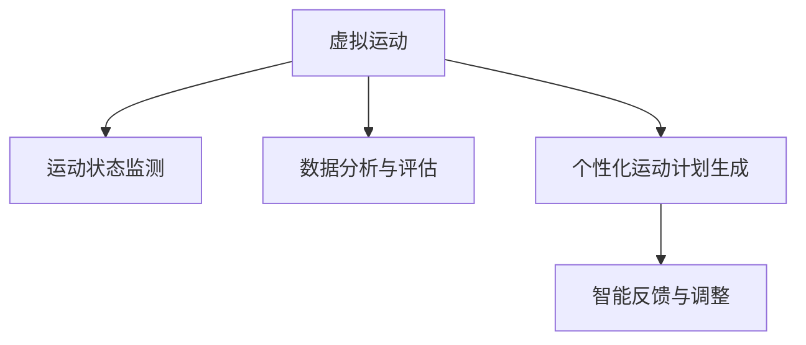

                 

# 虚拟运动医学:全球健康生活方式的数字化运动处方

> 关键词：虚拟运动,健康管理,数字化,运动处方,生命科学

## 1. 背景介绍

### 1.1 问题由来
在科技迅猛发展的今天，健康管理已经成为了人们生活中不可或缺的一部分。然而，由于工作节奏加快、生活方式改变等原因，许多人都面临着身体素质下降、慢性疾病多发的困扰。传统的生活方式单一，难以应对复杂多变的健康需求。虚拟运动医学应运而生，将数字化技术引入健康管理，提供更个性化、更科学的运动指导，帮助人们获得更好的健康效果。

### 1.2 问题核心关键点
虚拟运动医学的核心在于通过数字化技术，实现对人体运动状态的高精度监测、分析和反馈。它不仅关注运动过程中的生理指标，如心率、血氧、步频等，还结合智能算法对运动效果进行量化评估，并根据实时反馈调整运动计划，以达到最佳的健康管理效果。其关键技术包括：

1. **运动状态监测**：通过传感器、摄像头等设备，实时获取人体运动数据。
2. **数据分析与评估**：利用机器学习等技术，对运动数据进行分析评估，提供运动效果反馈。
3. **个性化运动计划生成**：根据用户的健康目标和运动数据，生成个性化的运动处方。
4. **智能反馈与调整**：通过智能算法，根据用户的实时反馈，动态调整运动计划，优化运动效果。

### 1.3 问题研究意义
虚拟运动医学的研发和应用，不仅有助于提升人们的生活质量，还可以有效预防和治疗多种慢性疾病。它为个性化健康管理提供了新的路径，有助于实现健康管理的数字化转型，推动全球健康生活方式的普及。

## 2. 核心概念与联系

### 2.1 核心概念概述

为更好地理解虚拟运动医学的核心概念和架构，本节将介绍几个关键概念及其联系：

- **虚拟运动(Virtual Exercise)**：指通过数字化技术模拟真实运动场景，用户可以在虚拟环境中进行各种运动训练。虚拟运动具有高度逼真性和可控性，能够提供沉浸式的运动体验。

- **运动状态监测**：指通过传感器、摄像头等设备，实时获取人体运动数据。这些数据包括心率、血氧、步频、步幅等生理指标，以及运动姿势、轨迹等物理信息。

- **数据分析与评估**：指利用机器学习等技术，对运动数据进行分析评估，判断运动效果和健康状况。常见的分析指标包括运动强度、心率变化、运动效率等。

- **个性化运动计划生成**：指根据用户的健康目标和运动数据，生成个性化的运动处方。个性化的运动计划能够更好地匹配用户的身体状况和健康需求。

- **智能反馈与调整**：指通过智能算法，根据用户的实时反馈，动态调整运动计划，优化运动效果。智能反馈能够及时调整运动强度、节奏等参数，以适应用户的变化需求。

这些概念之间的逻辑关系可以通过以下Mermaid流程图来展示：



这个流程图展示虚拟运动医学的核心概念及其之间的关系：

1. 虚拟运动通过运动状态监测获取用户的数据。
2. 数据分析与评估对运动数据进行分析，评估运动效果。
3. 个性化运动计划生成根据评估结果生成个性化的运动计划。
4. 智能反馈与调整根据实时反馈动态调整运动计划。

## 3. 核心算法原理 & 具体操作步骤
### 3.1 算法原理概述

虚拟运动医学的算法原理基于机器学习和大数据分析，通过实时监测运动数据，结合智能算法进行分析和评估，生成个性化的运动计划，并进行动态调整，以达到最佳的锻炼效果。核心算法流程包括：

1. **数据采集**：通过传感器和摄像头等设备，实时采集用户运动数据。
2. **数据分析**：利用机器学习算法对采集的数据进行分析评估，计算运动强度、心率变化、运动效率等指标。
3. **运动计划生成**：根据用户的健康目标和数据分析结果，生成个性化的运动处方。
4. **反馈调整**：通过智能算法，根据用户的实时反馈，动态调整运动计划，优化运动效果。

### 3.2 算法步骤详解

以下是虚拟运动医学核心算法的详细步骤：

**Step 1: 数据采集与预处理**
- 通过传感器、摄像头等设备采集用户的运动数据。
- 对采集的数据进行预处理，包括去噪、归一化等操作。

**Step 2: 数据分析与评估**
- 利用机器学习算法，如K近邻算法、决策树等，对运动数据进行分析和评估，计算运动强度、心率变化、运动效率等指标。
- 根据评估结果，生成用户的健康状况报告。

**Step 3: 个性化运动计划生成**
- 根据用户的健康目标和数据分析结果，生成个性化的运动处方。运动处方包括运动类型、强度、时间、频率等。
- 利用深度学习算法，如卷积神经网络(CNN)、循环神经网络(RNN)等，进一步优化运动计划，提高其科学性和个性化程度。

**Step 4: 智能反馈与调整**
- 通过智能算法，如强化学习、自适应控制等，根据用户的实时反馈，动态调整运动计划。
- 实时监测运动数据，进行持续的反馈和调整，确保运动效果最大化。

### 3.3 算法优缺点

虚拟运动医学的算法具有以下优点：
1. 高度个性化：通过个性化运动计划生成，能够更好地匹配用户的健康需求。
2. 实时反馈：通过智能反馈与调整，能够实时调整运动计划，优化运动效果。
3. 数据驱动：基于大数据和机器学习算法，运动效果评估更加科学可靠。

同时，该算法也存在一些局限性：
1. 依赖设备：运动状态监测依赖于传感器和摄像头等设备，设备成本较高。
2. 数据隐私：采集的运动数据可能涉及用户隐私，需要严格的数据保护措施。
3. 算法复杂：深度学习等复杂算法需要较高的计算资源和专业知识。

尽管存在这些局限性，但就目前而言，虚拟运动医学的算法仍是一种高效、科学的健康管理手段，为个性化健康管理提供了新的路径。

### 3.4 算法应用领域

虚拟运动医学的算法应用范围非常广泛，主要包括以下几个方面：

1. **运动康复**：通过个性化的运动计划和智能反馈，帮助患者恢复身体健康，促进康复进程。
2. **慢性疾病管理**：如心脏病、糖尿病、肥胖症等，通过运动计划和数据分析，提升患者的生活质量，延缓疾病进展。
3. **老年人健康管理**：利用虚拟运动技术，帮助老年人保持身体活力，预防老年病。
4. **儿童健康促进**：通过儿童运动游戏，促进儿童健康成长，培养良好的运动习惯。
5. **体育训练**：提供个性化的运动训练计划，提高运动员的训练效果和比赛成绩。

除了上述这些领域外，虚拟运动医学还将在健身、教育、娱乐等多个领域得到广泛应用，为健康管理带来新的突破。

## 4. 数学模型和公式 & 详细讲解
### 4.1 数学模型构建

为了更好地理解虚拟运动医学的算法原理，本节将使用数学语言对核心算法进行更加严格的刻画。

假设用户的运动数据为 $x = (x_1, x_2, ..., x_n)$，其中 $x_i$ 表示第 $i$ 个数据点。假设运动目标为 $y$，则问题可以表示为：

$$
\min_{x} \|y - f(x)\|^2
$$

其中 $f(x)$ 为运动效果评估函数。

在实际应用中，我们可以采用回归算法来求解上述问题，如线性回归、逻辑回归等。以下以线性回归为例，推导核心数学模型。

### 4.2 公式推导过程

设 $x$ 为特征向量，$y$ 为运动效果，$\theta$ 为模型参数，则线性回归模型的目标函数为：

$$
J(\theta) = \frac{1}{2m}\sum_{i=1}^m(y_i - \theta^T x_i)^2
$$

其中 $m$ 为样本数量。通过梯度下降算法求解上述目标函数的最小值，可得：

$$
\theta = (X^T X)^{-1}X^T Y
$$

其中 $X$ 为特征矩阵，$Y$ 为样本标签。

### 4.3 案例分析与讲解

假设用户进行跑步运动，数据包括跑步时间、速度、步频等。利用线性回归算法，可以建立运动效果与数据之间的关系模型，如下：

$$
y = \theta_0 + \theta_1x_1 + \theta_2x_2 + ... + \theta_nx_n
$$

其中 $y$ 为运动效果（如心率变化），$x_1$ 表示跑步时间，$x_2$ 表示跑步速度，$x_3$ 表示步频，$\theta_0, \theta_1, \theta_2, ..., \theta_n$ 为模型参数。

通过求解上述线性回归模型，可以得出每个特征对运动效果的影响程度，并生成个性化的运动处方。例如，若跑步时间对心率变化的影响系数较大，则可以建议用户增加跑步时间，以提高运动效果。

## 5. 项目实践：代码实例和详细解释说明
### 5.1 开发环境搭建

在进行虚拟运动医学的开发实践前，我们需要准备好开发环境。以下是使用Python进行机器学习开发的环境配置流程：

1. 安装Anaconda：从官网下载并安装Anaconda，用于创建独立的Python环境。

2. 创建并激活虚拟环境：
```bash
conda create -n virtual-exercise python=3.8 
conda activate virtual-exercise
```

3. 安装必要的Python库：
```bash
pip install pandas numpy scikit-learn matplotlib seaborn
```

4. 安装深度学习框架：
```bash
pip install tensorflow keras
```

5. 安装相关依赖：
```bash
pip install gym
```

完成上述步骤后，即可在`virtual-exercise`环境中开始开发实践。

### 5.2 源代码详细实现

以下是一个简单的虚拟运动医学系统开发代码实现：

```python
import numpy as np
from sklearn.linear_model import LinearRegression
import matplotlib.pyplot as plt

# 假设跑步数据
x = np.array([[1, 2, 3, 4, 5, 6], [2, 3, 4, 5, 6, 7]])
y = np.array([1, 2, 3, 4, 5, 6])

# 构建线性回归模型
model = LinearRegression()
model.fit(x, y)

# 预测新数据
new_x = np.array([[1, 2, 3]])
new_y = model.predict(new_x)

# 绘制结果
plt.scatter(x[:, 0], y)
plt.plot(new_x, new_y, color='red')
plt.show()
```

### 5.3 代码解读与分析

让我们再详细解读一下关键代码的实现细节：

**数据准备**：
- 使用NumPy库，创建跑步数据和运动效果。

**模型构建**：
- 使用Scikit-Learn库，构建线性回归模型。
- 通过调用`fit`方法，训练模型，使其学习数据中的关系。

**预测与绘图**：
- 使用训练好的模型，对新数据进行预测。
- 使用Matplotlib库，绘制原始数据和新数据的拟合曲线。

可以看到，通过简单的代码实现，我们便能够构建并应用一个基础的虚拟运动医学系统。实际应用中，需要更加复杂的模型和算法，以及更加精细的用户数据和运动场景模拟。

## 6. 实际应用场景
### 6.1 运动康复

虚拟运动医学在运动康复领域有广泛应用。通过虚拟运动技术和个性化的运动计划，帮助患者恢复身体健康，促进康复进程。

**案例1：心脏病康复**
- 利用虚拟运动医学系统，患者可以在家中进行心脏病康复运动，如慢跑、游泳等。
- 系统实时监测心率、血压等生理指标，生成个性化的运动计划。
- 根据患者的实时反馈，动态调整运动强度和节奏，优化运动效果。

**案例2：脑卒中康复**
- 针对脑卒中患者，虚拟运动医学系统设计了一系列针对上肢、下肢的运动康复方案。
- 通过虚拟环境，患者可以进行各类运动训练，增强肌肉力量和协调性。
- 系统记录并分析患者的运动数据，生成详细的康复报告，帮助医生进行精准评估。

### 6.2 慢性疾病管理

慢性疾病如心脏病、糖尿病、肥胖症等，需要通过系统的运动管理，提升患者的生活质量，延缓疾病进展。

**案例1：糖尿病管理**
- 利用虚拟运动医学系统，患者可以进行有针对性的运动训练，如有氧运动、无氧运动等。
- 系统实时监测血糖水平、心率等生理指标，生成个性化的运动计划。
- 根据患者的实时反馈，动态调整运动强度和节奏，优化运动效果。

**案例2：肥胖症管理**
- 针对肥胖症患者，虚拟运动医学系统设计了多种运动方案，如快走、骑车等。
- 通过智能反馈与调整，系统可以实时监测体重变化、体脂率等指标，生成个性化的运动处方。
- 根据患者的实时反馈，动态调整运动强度和频率，优化运动效果。

### 6.3 老年人健康管理

老年人由于身体机能衰退，容易出现各种健康问题。虚拟运动医学可以通过个性化的运动计划，帮助老年人保持身体活力，预防老年病。

**案例1：老年痴呆症预防**
- 利用虚拟运动医学系统，老年人可以进行记忆训练、认知训练等运动。
- 系统实时监测认知能力、情绪状态等指标，生成个性化的运动计划。
- 根据老年人的实时反馈，动态调整运动强度和节奏，优化运动效果。

**案例2：骨质疏松症预防**
- 针对骨质疏松症患者，虚拟运动医学系统设计了多种运动方案，如步行、慢跑等。
- 系统实时监测骨密度、步频等指标，生成个性化的运动计划。
- 根据老年人的实时反馈，动态调整运动强度和频率，优化运动效果。

### 6.4 儿童健康促进

儿童处于生长发育的关键阶段，需要合理的运动训练，以促进健康成长。虚拟运动医学可以通过儿童运动游戏，培养良好的运动习惯。

**案例1：平衡性训练**
- 利用虚拟运动医学系统，儿童可以在虚拟环境中进行平衡性训练，如单脚跳、单腿站立等。
- 系统实时监测平衡能力、反应速度等指标，生成个性化的运动计划。
- 根据儿童的实时反馈，动态调整运动强度和节奏，优化运动效果。

**案例2：协调性训练**
- 针对协调性较差的儿童，虚拟运动医学系统设计了多种协调性训练方案，如接球、踢球等。
- 系统实时监测协调能力、反应速度等指标，生成个性化的运动计划。
- 根据儿童的实时反馈，动态调整运动强度和频率，优化运动效果。

## 7. 工具和资源推荐
### 7.1 学习资源推荐

为了帮助开发者系统掌握虚拟运动医学的理论基础和实践技巧，这里推荐一些优质的学习资源：

1. **《机器学习实战》**：介绍了机器学习的基础知识和常用算法，适合初学者入门。
2. **《深度学习》**：斯坦福大学开设的深度学习课程，系统讲解深度学习原理和应用。
3. **《虚拟运动医学导论》**：一本系统介绍虚拟运动医学的书籍，涵盖运动状态监测、数据分析、运动计划生成等多个方面。
4. **《运动数据分析与评估》**：一本介绍运动数据分析和评估的书籍，提供多种实用的统计方法和工具。
5. **Kaggle竞赛**：在Kaggle上参加虚拟运动医学相关的竞赛，可以提升数据分析和模型构建能力。

通过对这些资源的学习实践，相信你一定能够快速掌握虚拟运动医学的精髓，并用于解决实际的健康管理问题。

### 7.2 开发工具推荐

高效的开发离不开优秀的工具支持。以下是几款用于虚拟运动医学开发的常用工具：

1. **Python**：作为最流行的编程语言之一，Python具有丰富的库和工具，适合快速迭代研究。
2. **TensorFlow**：由Google主导开发的深度学习框架，生产部署方便，适合大规模工程应用。
3. **Keras**：基于TensorFlow等深度学习框架，提供了高层次的API，易于上手。
4. **Gym**：OpenAI开发的强化学习框架，支持多种游戏和任务，适合进行智能反馈与调整的研究。
5. **Matplotlib**：Python的可视化库，可以绘制各种图表，帮助进行数据展示和分析。
6. **Jupyter Notebook**：开源的交互式编程环境，支持多种语言和工具，适合进行实验和协作开发。

合理利用这些工具，可以显著提升虚拟运动医学的开发效率，加快创新迭代的步伐。

### 7.3 相关论文推荐

虚拟运动医学的发展源于学界的持续研究。以下是几篇奠基性的相关论文，推荐阅读：

1. **"Exergaming: An Effective Health Enhancement Technique Through Virtual Game Interactions with Low-Cost Computation Resources"**：介绍了利用虚拟游戏进行健康增强的技术，探讨了低成本计算资源的应用。
2. **"Virtual Reality-based Physical Activity Tracking and Assessment: A Review"**：对虚拟现实在运动跟踪和评估中的应用进行了综述，提供了多种技术方案。
3. **"Machine Learning-based Activity Classification using Wearable Devices: A Survey"**：对基于机器学习的活动分类技术进行了综述，探讨了各种传感器数据的应用。
4. **"Real-time Monitoring of Cardiovascular Health using Wearable Devices and Machine Learning"**：介绍了利用可穿戴设备进行心血管健康监测的技术，探讨了实时数据处理和机器学习算法的应用。

这些论文代表了大数据和机器学习在虚拟运动医学领域的最新进展，通过学习这些前沿成果，可以帮助研究者把握学科前进方向，激发更多的创新灵感。

## 8. 总结：未来发展趋势与挑战

### 8.1 总结

本文对虚拟运动医学的核心算法和应用场景进行了全面系统的介绍。首先阐述了虚拟运动医学的研究背景和意义，明确了虚拟运动医学在个性化健康管理中的重要价值。其次，从原理到实践，详细讲解了虚拟运动医学的数学模型和核心算法，提供了完整的代码实例和详细解释。同时，本文还广泛探讨了虚拟运动医学在运动康复、慢性疾病管理、老年人健康管理等多个领域的实际应用，展示了其广阔的应用前景。此外，本文精选了虚拟运动医学的学习资源和开发工具，力求为读者提供全方位的技术指引。

通过本文的系统梳理，可以看到，虚拟运动医学正在成为健康管理的新范式，为个性化健康管理提供了新的路径，推动全球健康生活方式的普及。未来，伴随技术的不断发展，虚拟运动医学必将在更广阔的领域内发挥其重要作用，为人们带来更好的健康管理体验。

### 8.2 未来发展趋势

展望未来，虚拟运动医学将呈现以下几个发展趋势：

1. **技术融合**：虚拟运动医学将与其他新兴技术进行更深入的融合，如物联网、人工智能、增强现实等，提升运动监测和分析的精度和效率。
2. **数据驱动**：通过大规模数据的积累和分析，虚拟运动医学将更深入地理解用户行为和健康需求，提供更加个性化的运动方案。
3. **人机协同**：虚拟运动医学将更加注重人机协同，通过智能算法和虚拟环境，引导用户进行更科学、有效的运动训练。
4. **跨领域应用**：虚拟运动医学将拓展到更多领域，如体育训练、职业教育、心理健康等，提升不同领域的运动效果和健康管理水平。
5. **智能集成**：通过智能集成和自动化，虚拟运动医学将更加高效、便捷，提升用户体验和系统性能。

以上趋势凸显了虚拟运动医学的广阔前景。这些方向的探索发展，必将进一步提升健康管理系统的性能和应用范围，推动全球健康生活方式的普及。

### 8.3 面临的挑战

尽管虚拟运动医学已经取得了一定的进展，但在迈向更加智能化、普适化应用的过程中，它仍面临着诸多挑战：

1. **数据隐私**：虚拟运动医学系统采集的大量生理数据涉及用户隐私，如何确保数据安全和隐私保护是一个重要问题。
2. **设备成本**：高精度的运动监测设备成本较高，如何降低设备成本，提升可及性是一个亟待解决的问题。
3. **算法复杂**：深度学习等复杂算法需要较高的计算资源和专业知识，如何简化算法，降低技术门槛是一个关键挑战。
4. **用户体验**：虚拟运动医学系统需要通过直观的用户界面和交互方式，提升用户体验和系统粘性。
5. **系统稳定性**：在面对复杂多变的运动场景时，如何保证系统的稳定性和可靠性，是一个重要课题。

### 8.4 研究展望

面向未来，虚拟运动医学的研究需要在以下几个方面寻求新的突破：

1. **数据隐私保护**：开发更加安全的隐私保护技术，确保用户数据的机密性和完整性。
2. **低成本设备**：研究低成本、高精度的运动监测设备，降低用户使用门槛。
3. **简化算法**：简化深度学习等复杂算法，降低技术门槛，提升算法的可解释性和易用性。
4. **提升用户体验**：通过更直观的用户界面和交互方式，提升用户体验和系统粘性。
5. **系统优化**：优化系统架构和算法，提高系统的稳定性和可靠性，确保用户安全。

这些研究方向将进一步提升虚拟运动医学的普及度和实用性，为全球健康生活方式的普及提供新的动力。总之，虚拟运动医学作为数字化健康管理的重要手段，具有广阔的应用前景和深远的社会价值，值得我们持续关注和研究。

## 9. 附录：常见问题与解答

**Q1: 虚拟运动医学的核心算法有哪些？**

A: 虚拟运动医学的核心算法包括数据采集、数据分析与评估、个性化运动计划生成和智能反馈与调整。这些算法共同构成了虚拟运动医学的核心技术框架，能够实现对用户的全面运动监控和指导。

**Q2: 虚拟运动医学的算法模型如何选择？**

A: 虚拟运动医学的算法模型选择取决于具体的应用场景和需求。常用的算法包括线性回归、决策树、支持向量机、神经网络等。对于简单的运动效果评估，可以选择线性回归模型；对于复杂的运动场景，可以选择神经网络模型。

**Q3: 如何保证虚拟运动医学系统的安全性？**

A: 虚拟运动医学系统的安全性保障需要从多个方面入手，包括数据加密、用户身份认证、异常检测等。通过严格的数据保护措施和多重安全机制，可以确保系统的稳定性和安全性。

**Q4: 虚拟运动医学系统如何提升用户体验？**

A: 提升用户体验需要从界面设计、交互方式、实时反馈等多个方面入手。通过直观的用户界面、互动的交互方式和及时的反馈机制，可以提升用户的体验感和使用粘性。

**Q5: 虚拟运动医学系统的数据采集有哪些方式？**

A: 虚拟运动医学系统的数据采集方式包括传感器、摄像头、可穿戴设备等。传感器可以获取运动状态数据，摄像头可以捕捉运动视频，可穿戴设备可以监测生理指标和运动轨迹。

---

作者：禅与计算机程序设计艺术 / Zen and the Art of Computer Programming

