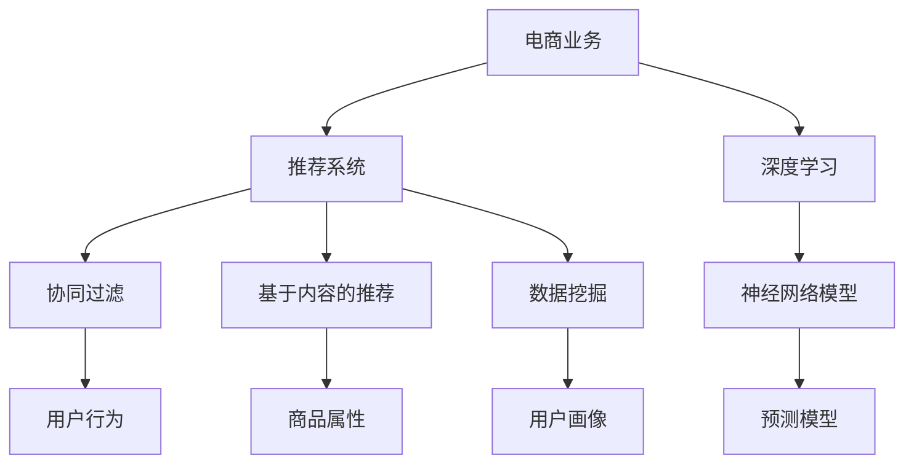

                 

# 融合AI与搜索推荐：电商业务的新机遇

## 1. 背景介绍

### 1.1 问题由来
随着互联网和电子商务的迅猛发展，在线购物成为越来越多消费者的首选。然而，面对海量商品信息和复杂的选择难题，消费者往往感到无从下手，搜索推荐系统应运而生。传统的搜索引擎依靠关键词匹配和网页相关性排序，但无法充分理解用户的实际需求和偏好。与此相比，推荐系统通过分析用户的浏览、购买行为，动态生成个性化推荐，极大地提升了用户的购物体验。

推荐系统技术在电商领域的应用已经成为其核心竞争力之一，直接影响到用户转化率和复购率。然而，传统推荐系统主要依赖于协同过滤、基于内容的推荐等算法，往往难以适应电商行业的动态变化和多变需求。

### 1.2 问题核心关键点
随着深度学习和大数据技术的普及，基于AI的推荐系统开始受到广泛关注。通过深度神经网络对用户行为数据进行建模，AI推荐系统能够更好地理解用户的真实需求，并提供更加个性化和精准的推荐。AI推荐系统在电商领域的应用主要体现在：

- 搜索推荐：根据用户搜索历史、浏览行为生成个性化的商品推荐。
- 商品召回：通过相似商品推荐，提升长尾商品的曝光率。
- 广告投放：精准定位用户，实现高效的广告投放。
- 个性化定制：根据用户偏好生成定制化商品或服务。
- 客户细分：通过分析用户行为数据，实现精准的客户细分，提供个性化服务。

### 1.3 问题研究意义
AI推荐系统为电商业务带来了显著的性能提升和用户体验改善。研究AI推荐系统在电商领域的应用，对于提升电商平台的竞争力、提高用户满意度和增加收入，具有重要的实践价值。同时，研究AI推荐系统对数据和算法的依赖关系，有助于我们更好地理解AI技术的局限性和潜在风险。

## 2. 核心概念与联系

### 2.1 核心概念概述

为更好地理解AI推荐系统在电商领域的应用，本节将介绍几个密切相关的核心概念：

- **电商业务**：指线上电子商务平台运营过程中的业务活动，包括商品管理、库存管理、订单管理、客户服务等功能模块。
- **推荐系统**：通过分析用户历史行为数据，动态生成个性化推荐，以提升用户体验和转化率的系统。
- **深度学习**：基于神经网络模型进行学习和预测，具有较强的数据处理能力和泛化能力。
- **协同过滤**：通过用户和物品间的交互数据，推测用户偏好，实现推荐。
- **基于内容的推荐**：根据物品的特征描述，匹配用户兴趣，实现推荐。
- **数据挖掘**：从大规模数据中提取有用的信息和知识，包括用户画像、商品属性等。

这些核心概念之间的逻辑关系可以通过以下Mermaid流程图来展示：



这个流程图展示了大语言模型的核心概念及其之间的关系：

1. 电商业务中涉及的各项活动，如商品管理、订单管理等，通过推荐系统进行优化。
2. 推荐系统主要基于深度学习和数据挖掘技术，包括神经网络模型、协同过滤和基于内容的推荐。
3. 深度学习提供了强大的特征提取和预测能力，数据挖掘则帮助构建用户画像和商品属性库。

这些概念共同构成了电商推荐系统的基本框架，为其性能提升和用户满意度提供了理论基础。

## 3. 核心算法原理 & 具体操作步骤
### 3.1 算法原理概述

基于AI的推荐系统通常采用深度学习模型对用户行为数据进行建模，并根据不同用户、不同商品之间的相似度进行推荐。其核心思想是：通过学习用户历史行为，预测用户未来行为，从而生成个性化的推荐列表。

具体来说，假设用户 $u$ 对商品 $i$ 的兴趣可以通过历史行为数据 $X$ 来建模，即 $X = (X_1, X_2, ..., X_n)$，其中 $X_i$ 表示用户与商品之间的交互行为，如浏览、点击、购买等。推荐系统的目标是通过一个映射函数 $f$ 将 $X$ 映射到推荐列表 $R$，即 $R = f(X)$。

这种映射函数通常采用神经网络模型进行建模，例如多层感知机（MLP）、卷积神经网络（CNN）、循环神经网络（RNN）、Transformer等。这些模型通过学习用户行为数据，抽取用户的兴趣特征和商品的特征表示，从而实现推荐。

### 3.2 算法步骤详解

基于AI的电商推荐系统通常包括以下几个关键步骤：

**Step 1: 数据准备**

- **用户行为数据收集**：收集用户在电商平台上的各种行为数据，如浏览历史、点击记录、购买记录等。
- **用户画像构建**：基于用户行为数据，构建用户画像，包括用户兴趣、偏好、活跃度等。
- **商品属性抽取**：从商品描述中提取商品的特征属性，如价格、类别、评分等。
- **数据预处理**：对收集的数据进行清洗、归一化等预处理，去除异常值和噪声数据。

**Step 2: 模型训练**

- **选择模型架构**：根据推荐系统的需求和数据特性，选择合适的深度学习模型架构，如MLP、CNN、RNN、Transformer等。
- **设计损失函数**：根据推荐任务的目标，设计相应的损失函数，如交叉熵损失、均方误差损失等。
- **训练模型**：使用用户行为数据训练模型，调整模型参数，最小化损失函数。
- **评估模型**：在验证集上评估模型的性能，如精确度、召回率、F1值等。

**Step 3: 推荐生成**

- **输入用户特征**：将用户画像和历史行为数据输入训练好的模型中，生成推荐列表。
- **生成推荐结果**：根据模型输出，生成个性化的推荐商品列表。
- **调整推荐策略**：根据用户的反馈，调整推荐策略，优化推荐结果。

### 3.3 算法优缺点

基于AI的电商推荐系统具有以下优点：

1. **个性化推荐**：深度学习模型能够充分挖掘用户兴趣和商品属性，实现个性化推荐，提高用户满意度。
2. **动态适应**：深度学习模型具有较好的泛化能力，能够动态适应电商业务的变化和需求。
3. **用户行为分析**：通过分析用户行为数据，能够发现用户的潜在需求和兴趣，进行预判性推荐。
4. **大规模数据处理**：深度学习模型能够处理大规模数据，提高推荐系统的效率和覆盖面。

然而，基于AI的电商推荐系统也存在一些缺点：

1. **数据依赖性强**：推荐系统的性能很大程度上依赖于用户行为数据的质量和数量，数据不足时推荐效果可能不理想。
2. **模型复杂度高**：深度学习模型通常具有较高的计算复杂度和存储需求，需要较强的硬件支持。
3. **推荐冷启动问题**：新用户或新商品往往没有足够的历史数据，难以进行推荐。
4. **用户隐私问题**：用户行为数据的收集和分析可能涉及隐私问题，需要采取适当的隐私保护措施。
5. **推荐系统偏见**：深度学习模型可能继承数据中的偏见，导致推荐结果的不公平。

### 3.4 算法应用领域

基于AI的电商推荐系统已经在电商领域得到了广泛应用，具体应用场景包括：

- **商品推荐**：根据用户浏览和购买历史，生成个性化的商品推荐。
- **广告推荐**：通过分析用户行为数据，精准定位用户，实现高效的广告投放。
- **个性化定制**：根据用户偏好生成定制化商品或服务，提升用户体验。
- **客户细分**：通过分析用户行为数据，实现精准的客户细分，提供个性化服务。
- **市场分析**：利用推荐系统收集的数据，进行市场趋势分析和商品销售预测。

## 4. 数学模型和公式 & 详细讲解  
### 4.1 数学模型构建

本节将使用数学语言对基于AI的电商推荐系统进行更加严格的刻画。

假设电商推荐系统需要预测用户 $u$ 对商品 $i$ 的兴趣，并将其映射到评分 $y$。用户行为数据 $X$ 可以表示为 $X = (X_1, X_2, ..., X_n)$，其中 $X_i$ 表示用户与商品之间的交互行为，如浏览、点击、购买等。推荐系统的目标是通过一个映射函数 $f$ 将 $X$ 映射到评分 $y$，即 $y = f(X)$。

通常，推荐系统采用深度学习模型进行建模，如MLP、CNN、RNN、Transformer等。以MLP为例，模型可以表示为：

$$
y = f(X; \theta) = \sigma(W^T \cdot X + b)
$$

其中，$W$ 和 $b$ 为模型的权重和偏置，$\sigma$ 为激活函数。

### 4.2 公式推导过程

以下我们以用户兴趣预测为例，推导神经网络模型的损失函数及其梯度计算公式。

假设用户 $u$ 对商品 $i$ 的兴趣可以通过历史行为数据 $X$ 来建模，即 $X = (X_1, X_2, ..., X_n)$，其中 $X_i$ 表示用户与商品之间的交互行为，如浏览、点击、购买等。模型的输出为 $y = f(X; \theta)$，其中 $\theta$ 为模型参数。

定义模型 $f(X; \theta)$ 在用户行为数据 $X$ 上的损失函数为 $\ell(X, y; \theta)$，则在数据集 $D$ 上的经验风险为：

$$
\mathcal{L}(\theta) = \frac{1}{N} \sum_{i=1}^N \ell(X_i, y_i; \theta)
$$

其中 $\ell(X_i, y_i; \theta)$ 为单个样本的损失函数，通常在推荐任务中使用交叉熵损失：

$$
\ell(X_i, y_i; \theta) = -y_i \log f(X_i; \theta) - (1-y_i) \log (1-f(X_i; \theta))
$$

将其代入经验风险公式，得：

$$
\mathcal{L}(\theta) = -\frac{1}{N}\sum_{i=1}^N [y_i\log f(X_i; \theta)+(1-y_i)\log(1-f(X_i; \theta))]
$$

根据链式法则，损失函数对参数 $\theta$ 的梯度为：

$$
\frac{\partial \mathcal{L}(\theta)}{\partial \theta} = -\frac{1}{N}\sum_{i=1}^N (\frac{y_i}{f(X_i; \theta)}-\frac{1-y_i}{1-f(X_i; \theta)}) \frac{\partial f(X_i; \theta)}{\partial \theta}
$$

其中 $\frac{\partial f(X_i; \theta)}{\partial \theta}$ 可进一步递归展开，利用自动微分技术完成计算。

### 4.3 案例分析与讲解

以基于TensorFlow的推荐系统为例，我们进行具体的推导。假设模型采用MLP，输入层包含n个特征，输出层包含1个评分。

在TensorFlow中，定义模型的输入层和输出层：

```python
import tensorflow as tf

# 定义输入层
input_layer = tf.keras.layers.Input(shape=(n,), name='input_layer')

# 定义输出层
output_layer = tf.keras.layers.Dense(1, activation='sigmoid', name='output_layer')(input_layer)
```

在模型训练时，使用交叉熵损失函数：

```python
# 定义损失函数
loss = tf.keras.losses.BinaryCrossentropy(from_logits=True)

# 编译模型
model.compile(optimizer='adam', loss=loss, metrics=['accuracy'])
```

在训练过程中，使用交叉熵损失函数的梯度计算：

```python
# 定义损失函数
def loss_function(y_true, y_pred):
    return -y_true * tf.math.log(y_pred) - (1-y_true) * tf.math.log(1-y_pred)

# 计算梯度
grads = tf.GradientTape() gradients(loss_function, model.trainable_weights)
```

在得到损失函数的梯度后，即可带入参数更新公式，完成模型的迭代优化。重复上述过程直至收敛，最终得到适应电商推荐任务的最优模型参数 $\theta^*$。

## 5. 项目实践：代码实例和详细解释说明
### 5.1 开发环境搭建

在进行电商推荐系统开发前，我们需要准备好开发环境。以下是使用Python进行TensorFlow开发的环境配置流程：

1. 安装Anaconda：从官网下载并安装Anaconda，用于创建独立的Python环境。

2. 创建并激活虚拟环境：
```bash
conda create -n tensorflow-env python=3.8 
conda activate tensorflow-env
```

3. 安装TensorFlow：根据CUDA版本，从官网获取对应的安装命令。例如：
```bash
pip install tensorflow
```

4. 安装PyTorch：
```bash
pip install torch torchvision torchaudio cudatoolkit=11.1 -c pytorch -c conda-forge
```

5. 安装各类工具包：
```bash
pip install numpy pandas scikit-learn matplotlib tqdm jupyter notebook ipython
```

完成上述步骤后，即可在`tensorflow-env`环境中开始电商推荐系统的开发。

### 5.2 源代码详细实现

下面我们以商品推荐任务为例，给出使用TensorFlow进行电商推荐系统的PyTorch代码实现。

首先，定义数据处理函数：

```python
import tensorflow as tf

# 定义数据处理函数
def preprocess_data(X, y):
    # 数据归一化
    X_norm = (X - X.mean()) / X.std()
    # 数据标准化
    X_std = (X - X.min()) / (X.max() - X.min())
    # 将标签转化为二进制编码
    y = (y > 0).astype(int)
    return X_norm, X_std, y
```

然后，定义模型和优化器：

```python
from tensorflow.keras import layers, models

# 定义模型架构
model = models.Sequential()
model.add(layers.Dense(32, activation='relu', input_shape=(n,)))
model.add(layers.Dense(1, activation='sigmoid'))

# 定义优化器
optimizer = tf.keras.optimizers.Adam()
```

接着，定义训练和评估函数：

```python
# 定义训练函数
def train_model(model, X_train, y_train, X_val, y_val, epochs=10, batch_size=32):
    model.compile(optimizer=optimizer, loss='binary_crossentropy', metrics=['accuracy'])
    model.fit(X_train, y_train, validation_data=(X_val, y_val), epochs=epochs, batch_size=batch_size)

# 定义评估函数
def evaluate_model(model, X_val, y_val, batch_size=32):
    evaluation = model.evaluate(X_val, y_val, batch_size=batch_size)
    print('Validation loss:', evaluation[0])
    print('Validation accuracy:', evaluation[1])
```

最后，启动训练流程并在验证集上评估：

```python
# 训练模型
train_model(model, X_train, y_train, X_val, y_val)

# 在验证集上评估
evaluate_model(model, X_val, y_val)
```

以上就是使用TensorFlow对电商推荐系统进行商品推荐任务的完整代码实现。可以看到，TensorFlow提供了丰富的深度学习工具和API，使得电商推荐系统的开发相对容易。

### 5.3 代码解读与分析

让我们再详细解读一下关键代码的实现细节：

**preprocess_data函数**：
- 将用户行为数据 $X$ 进行归一化和标准化处理，以提高模型的训练效率。
- 将标签 $y$ 转化为二进制编码，方便神经网络进行预测。

**模型定义**：
- 采用多层感知机（MLP）模型，输入层包含n个特征，输出层为1个评分。
- 使用ReLU激活函数，非线性地处理输入特征。
- 使用Sigmoid激活函数，将输出映射到[0, 1]区间，方便预测评分。

**训练函数train_model**：
- 编译模型，设置优化器和损失函数。
- 使用TensorFlow的fit函数，进行模型训练。
- 在每个epoch结束后，使用验证集评估模型性能。

**评估函数evaluate_model**：
- 使用TensorFlow的evaluate函数，在验证集上评估模型的预测准确率和损失。

通过上述代码，我们完成了电商推荐系统商品推荐任务的实现。TensorFlow的简洁API和强大的工具库，使得电商推荐系统的开发变得相对容易，开发者可以将更多精力放在模型优化和业务逻辑上。

## 6. 实际应用场景

### 6.1 智能推荐引擎

智能推荐引擎是电商推荐系统的核心组成部分，通过分析用户历史行为和兴趣，生成个性化推荐，提升用户体验和转化率。智能推荐引擎通常包含以下几个组件：

- **用户画像构建**：通过用户行为数据，构建用户画像，包括用户兴趣、偏好、活跃度等。
- **商品特征抽取**：从商品描述中提取商品的特征属性，如价格、类别、评分等。
- **推荐模型训练**：基于用户行为数据和商品特征，训练深度学习模型，生成推荐列表。
- **推荐策略优化**：根据用户反馈，调整推荐策略，优化推荐结果。

### 6.2 广告投放系统

电商广告投放系统通过分析用户行为数据，精准定位用户，实现高效的广告投放。广告投放系统通常包含以下几个组件：

- **用户画像构建**：通过用户行为数据，构建用户画像，包括用户兴趣、偏好、活跃度等。
- **广告特征抽取**：从广告描述中提取广告的特征属性，如广告文案、图片、价格等。
- **广告模型训练**：基于用户画像和广告特征，训练深度学习模型，生成广告推荐列表。
- **广告投放策略优化**：根据广告效果，调整投放策略，优化广告投放效果。

### 6.3 个性化定制推荐

个性化定制推荐通过分析用户历史行为和兴趣，生成定制化商品或服务，提升用户体验。个性化定制推荐通常包含以下几个组件：

- **用户画像构建**：通过用户行为数据，构建用户画像，包括用户兴趣、偏好、活跃度等。
- **商品特征抽取**：从商品描述中提取商品的特征属性，如价格、类别、评分等。
- **推荐模型训练**：基于用户画像和商品特征，训练深度学习模型，生成个性化推荐列表。
- **推荐策略优化**：根据用户反馈，调整推荐策略，优化推荐结果。

## 7. 工具和资源推荐

### 7.1 学习资源推荐

为了帮助开发者系统掌握电商推荐系统的理论基础和实践技巧，这里推荐一些优质的学习资源：

1. 《推荐系统实战》一书：详细介绍了推荐系统的原理和实现方法，包括协同过滤、基于内容的推荐、深度学习推荐等。

2. 《深度学习与推荐系统》课程：斯坦福大学开设的深度学习课程，讲解了深度学习在推荐系统中的应用。

3. TensorFlow官方文档：提供了全面的TensorFlow教程和API文档，适合新手学习。

4. TensorFlow推荐系统实战教程：TensorFlow的官方实战教程，详细介绍了TensorFlow在推荐系统中的应用。

5. Coursera推荐系统课程：Coursera上提供的推荐系统课程，涵盖协同过滤、深度学习推荐等前沿技术。

通过学习这些资源，相信你一定能够快速掌握电商推荐系统的精髓，并用于解决实际的电商推荐问题。

### 7.2 开发工具推荐

高效的开发离不开优秀的工具支持。以下是几款用于电商推荐系统开发的常用工具：

1. TensorFlow：基于Python的开源深度学习框架，灵活动态的计算图，适合快速迭代研究。

2. PyTorch：基于Python的开源深度学习框架，灵活高效，适合复杂模型的开发。

3. Scikit-learn：Python数据挖掘和机器学习库，提供了丰富的数据预处理和模型评估工具。

4. H2O：分布式机器学习平台，适合处理大规模数据和复杂模型。

5. TensorBoard：TensorFlow配套的可视化工具，可实时监测模型训练状态，并提供丰富的图表呈现方式。

6. Jupyter Notebook：交互式的编程环境，适合数据探索和模型调试。

合理利用这些工具，可以显著提升电商推荐系统的开发效率，加快创新迭代的步伐。

### 7.3 相关论文推荐

电商推荐系统的发展得益于学界的持续研究。以下是几篇奠基性的相关论文，推荐阅读：

1. Wu et al., "Collaborative Filtering for Implicit Feedback Datasets"：详细介绍了协同过滤在推荐系统中的应用。

2. He et al., "Deep Interest Evolutionary Algorithms"：提出深度兴趣演化算法，实现了基于深度学习推荐系统的实时推荐。

3. Cui et al., "An End-to-End Approach for Deep Multi-Label Recommendation"：提出基于深度学习的跨领域推荐系统，实现了多标签推荐。

4. Lv et al., "Hierarchical Attention Networks for Adaptive Recommendation"：提出层次注意力网络，实现了动态适应性推荐。

5. Shen et al., "A New Deep Interest-Evolutionary Algorithm for Recommendation System"：提出深度兴趣演化算法，实现了基于深度学习推荐系统的实时推荐。

这些论文代表了大语言模型微调技术的发展脉络。通过学习这些前沿成果，可以帮助研究者把握学科前进方向，激发更多的创新灵感。

## 8. 总结：未来发展趋势与挑战

### 8.1 总结

本文对基于AI的电商推荐系统进行了全面系统的介绍。首先阐述了电商推荐系统的背景和重要性，明确了其在提升用户体验和电商业务中的核心作用。其次，从原理到实践，详细讲解了电商推荐系统的数学模型和关键步骤，给出了电商推荐系统的完整代码实例。同时，本文还广泛探讨了电商推荐系统在多个场景中的应用，展示了AI推荐系统的巨大潜力。此外，本文精选了电商推荐系统的各类学习资源，力求为读者提供全方位的技术指引。

通过本文的系统梳理，可以看到，基于AI的电商推荐系统已经在电商领域得到了广泛应用，极大地提升了用户购物体验和电商平台的转化率。未来，伴随AI推荐系统技术的不断演进，电商平台的推荐能力将进一步提升，实现更加精准和个性化的推荐服务。

### 8.2 未来发展趋势

展望未来，电商推荐系统将呈现以下几个发展趋势：

1. **深度学习推荐系统**：随着深度学习技术的发展，深度学习推荐系统将成为电商推荐系统的主流，提供更加精准和个性化的推荐服务。

2. **多模态推荐系统**：结合用户行为数据、商品特征和文本描述等多模态信息，实现更加全面和准确的推荐。

3. **实时推荐系统**：通过实时数据分析和动态推荐模型，实现实时个性化的推荐服务，提升用户购物体验。

4. **跨领域推荐系统**：结合不同领域的数据，实现跨领域推荐，提升长尾商品的曝光率和推荐效果。

5. **联邦学习推荐系统**：通过分布式协同学习，实现跨平台、跨用户的推荐服务，保护用户隐私的同时提升推荐效果。

6. **强化学习推荐系统**：通过强化学习算法，实现自适应和动态优化的推荐策略，提升推荐效果和用户满意度。

以上趋势凸显了电商推荐系统的广阔前景。这些方向的探索发展，必将进一步提升电商推荐系统的性能和用户满意度，推动电商平台的可持续发展。

### 8.3 面临的挑战

尽管电商推荐系统已经在电商领域得到了广泛应用，但在迈向更加智能化、普适化应用的过程中，它仍面临诸多挑战：

1. **数据质量问题**：推荐系统的性能很大程度上依赖于用户行为数据的质量和数量，数据不足时推荐效果可能不理想。如何从大规模数据中挖掘有价值的信息，提高数据质量，仍需进一步研究。

2. **模型复杂性问题**：深度学习模型通常具有较高的计算复杂度和存储需求，需要较强的硬件支持。如何降低模型复杂度，提高模型训练和推理效率，是未来研究的重要方向。

3. **隐私保护问题**：用户行为数据的收集和分析可能涉及隐私问题，如何保护用户隐私，同时提升推荐效果，是一个亟待解决的问题。

4. **推荐系统偏见问题**：深度学习模型可能继承数据中的偏见，导致推荐结果的不公平。如何设计公平的推荐算法，消除数据偏见，是未来研究的重要课题。

5. **推荐系统冷启动问题**：新用户或新商品往往没有足够的历史数据，难以进行推荐。如何设计冷启动策略，提升推荐效果，是未来研究的重要方向。

6. **推荐系统鲁棒性问题**：推荐系统面临的推荐场景多样，如何提高推荐系统的鲁棒性和泛化能力，是一个亟待解决的问题。

正视电商推荐系统面临的这些挑战，积极应对并寻求突破，将使电商推荐系统向更高的台阶迈进，为电商平台的健康发展提供有力支持。相信随着学界和产业界的共同努力，这些挑战终将一一被克服，电商推荐系统必将在电商业务中发挥更大的作用。

### 8.4 研究展望

面对电商推荐系统所面临的种种挑战，未来的研究需要在以下几个方面寻求新的突破：

1. **深度学习与多模态融合**：结合用户行为数据、商品特征和文本描述等多模态信息，实现更加全面和准确的推荐。

2. **实时推荐与动态优化**：通过实时数据分析和动态推荐模型，实现实时个性化的推荐服务，提升用户购物体验。

3. **跨领域推荐与联邦学习**：结合不同领域的数据，实现跨领域推荐，提升长尾商品的曝光率和推荐效果，同时保护用户隐私。

4. **强化学习与自适应优化**：通过强化学习算法，实现自适应和动态优化的推荐策略，提升推荐效果和用户满意度。

5. **模型压缩与加速**：通过模型压缩和加速技术，降低模型复杂度，提高模型训练和推理效率。

6. **公平性研究与隐私保护**：设计公平的推荐算法，消除数据偏见，同时保护用户隐私。

这些研究方向的探索，必将引领电商推荐系统技术迈向更高的台阶，为电商平台的推荐服务提供强有力的技术支持。面向未来，电商推荐系统需要与其他人工智能技术进行更深入的融合，如知识表示、因果推理、强化学习等，多路径协同发力，共同推动电商平台的智能化发展。只有勇于创新、敢于突破，才能不断拓展电商推荐系统的边界，让推荐服务更好地造福电商用户。

## 9. 附录：常见问题与解答

**Q1：电商推荐系统如何处理数据质量问题？**

A: 电商推荐系统需要处理大规模用户行为数据，数据质量对推荐效果有重要影响。为了解决数据质量问题，可以采取以下措施：

1. 数据清洗：通过去除异常值、缺失值等，提高数据质量。
2. 数据补全：利用用户画像和商品画像进行数据补全，提升数据完整性。
3. 数据标注：通过用户反馈和专家标注，提高数据标注的准确性。
4. 数据融合：结合不同来源的数据，提升数据的多样性和代表性。

这些措施可以有效提升数据质量，为电商推荐系统提供更可靠的基础。

**Q2：电商推荐系统如何降低模型复杂性？**

A: 电商推荐系统需要处理大规模数据和复杂模型，降低模型复杂性可以提升推荐系统的效率和可解释性。为了降低模型复杂性，可以采取以下措施：

1. 模型压缩：通过剪枝、量化等技术，压缩模型参数和存储空间。
2. 模型简化：设计简洁的模型结构，减少计算复杂度。
3. 模型并行：通过模型并行、分布式计算等技术，提升模型的计算效率。
4. 模型加速：通过硬件加速、优化算法等技术，提升模型的推理速度。

这些措施可以有效降低模型复杂性，提高电商推荐系统的性能和效率。

**Q3：电商推荐系统如何保护用户隐私？**

A: 电商推荐系统需要处理用户行为数据，可能涉及用户隐私问题。为了保护用户隐私，可以采取以下措施：

1. 数据匿名化：通过数据匿名化技术，去除用户隐私信息。
2. 数据加密：通过数据加密技术，保护用户数据的安全性。
3. 隐私计算：利用隐私计算技术，在保护用户隐私的前提下，进行数据共享和分析。
4. 用户授权：通过用户授权机制，保护用户对数据的控制权。

这些措施可以有效保护用户隐私，增强电商推荐系统的可信度和用户满意度。

**Q4：电商推荐系统如何处理推荐系统偏见问题？**

A: 电商推荐系统需要处理推荐系统偏见问题，确保推荐结果的公平性和公正性。为了处理推荐系统偏见问题，可以采取以下措施：

1. 数据公平性：设计公平的数据采样和特征选择策略，避免数据偏见。
2. 模型公平性：设计公平的模型训练和评估方法，消除模型偏见。
3. 推荐策略公平性：设计公平的推荐策略，避免推荐结果的不公平。

这些措施可以有效处理推荐系统偏见问题，提升电商推荐系统的公平性和公正性。

**Q5：电商推荐系统如何处理推荐系统冷启动问题？**

A: 电商推荐系统需要处理新用户或新商品没有足够历史数据的问题，即推荐系统冷启动问题。为了处理推荐系统冷启动问题，可以采取以下措施：

1. 推荐基础模型：基于用户画像和商品画像，构建推荐基础模型，提升冷启动效果。
2. 数据补全策略：通过用户行为数据和商品特征进行数据补全，提高冷启动数据的质量。
3. 推荐算法改进：设计改进的推荐算法，提升冷启动推荐效果。

这些措施可以有效处理推荐系统冷启动问题，提升新用户或新商品推荐的效果。

**Q6：电商推荐系统如何提高推荐系统的鲁棒性？**

A: 电商推荐系统需要提高推荐系统的鲁棒性，确保推荐系统在动态变化和多变需求下依然具有良好的表现。为了提高推荐系统的鲁棒性，可以采取以下措施：

1. 模型鲁棒性：设计鲁棒性强的模型，能够应对数据变化和噪声干扰。
2. 数据增强：通过数据增强技术，提高模型的泛化能力。
3. 多模型融合：结合多个模型的输出，提升推荐系统的鲁棒性。

这些措施可以有效提高推荐系统的鲁棒性，增强电商推荐系统在动态变化和多变需求下的表现。

---

作者：禅与计算机程序设计艺术 / Zen and the Art of Computer Programming

