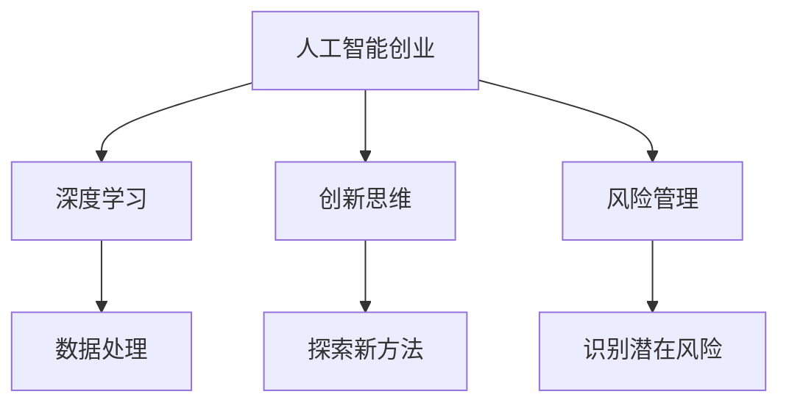

                 

# 表达的直率：贾扬清的风格，在创业中小心打破规则

> 关键词：人工智能创业,贾扬清,深度学习,创业指导,创新思维,风险管理

## 1. 背景介绍

贾扬清，这个名字在人工智能领域几乎无人不知。作为深度学习领域的著名学者，贾扬清教授不仅在科研领域取得了多项重要成果，而且在创业和教育领域也展现出了非凡的洞察力和领导力。从创办AI初创公司商汤科技到开设全球最大的深度学习课程，贾扬清的故事和理念激励了无数年轻创业者。本文将从多个维度深入剖析贾扬清的创业理念和实践，探讨在创业中如何打破规则，但又不能过于随意，从而在波涛汹涌的商业海洋中稳健前行。

### 1.1 贾扬清的学术与商业成就

贾扬清教授作为人工智能领域的知名学者，长期致力于深度学习和计算机视觉的研究。其科研成果多次发表于顶级会议和期刊，并获得过多个重要奖项，如IEEE计算机协会杰出研究奖和百度AI开放平台杰出贡献奖。

在商业领域，贾扬清创办的商汤科技，短短几年内就成长为全球领先的AI视觉技术提供商，服务于数百家全球知名企业，在自动驾驶、人脸识别、智慧城市等领域取得了显著的商业成果。此外，贾扬清还积极投身于AI教育事业，通过开设的“深度学习”课程，帮助了全球数百万学生入门人工智能。

### 1.2 创业环境与挑战

当前，全球范围内的人工智能创业热潮不断高涨，越来越多的科技创业者投身于AI领域。然而，相对于其他行业，AI领域的创业环境更加复杂，涉及的技术门槛高，市场竞争激烈。如何在这个环境中脱颖而出，是每个AI创业者必须面对的挑战。

## 2. 核心概念与联系

### 2.1 核心概念概述

在探讨贾扬清的创业理念时，需要引入几个核心概念：

- **人工智能创业**：使用人工智能技术解决实际问题，并实现商业化应用的创业过程。
- **深度学习**：基于人工神经网络，通过大量数据和复杂算法进行学习和训练，实现对数据的高效处理和分析。
- **创新思维**：在创业过程中，注重突破传统思维模式，探索新方法和新路径。
- **风险管理**：在创业过程中，通过系统化的方法识别和管理潜在风险，保障企业稳健发展。

### 2.2 核心概念原理和架构的 Mermaid 流程图



## 3. 核心算法原理 & 具体操作步骤

### 3.1 算法原理概述

人工智能创业的核心在于如何将先进的AI技术应用于实际问题，并通过商业模式实现商业价值。深度学习作为AI技术的核心部分，在这一过程中扮演着至关重要的角色。

**深度学习算法原理**：
- **神经网络结构**：深度学习通过多层神经网络对数据进行处理，每层网络都有不同的功能，如特征提取、特征映射等。
- **反向传播**：通过反向传播算法，深度学习模型可以自动调整网络参数，优化模型性能。
- **正则化技术**：如L2正则、Dropout等，用于避免过拟合，提高模型的泛化能力。

### 3.2 算法步骤详解

基于深度学习的AI创业可以分为以下几个关键步骤：

1. **问题定义与数据收集**：明确创业目标和实际问题，收集相关数据。
2. **模型选择与设计**：选择合适的深度学习模型架构，并进行相应的参数设置。
3. **模型训练与调优**：使用标注数据对模型进行训练，通过交叉验证等方法进行参数调优。
4. **模型部署与优化**：将训练好的模型部署到实际应用中，并根据反馈信息进行优化和迭代。
5. **商业化策略**：根据模型性能和市场需求，制定商业化策略，并逐步推广。

### 3.3 算法优缺点

**优点**：
- **自动化处理**：深度学习算法可以自动处理大规模复杂数据，提高效率。
- **自适应能力**：通过反向传播和参数优化，深度学习模型能够自适应数据的复杂变化。
- **效果显著**：在许多实际问题上，深度学习模型已经超越了传统方法，取得了显著的性能提升。

**缺点**：
- **高资源需求**：深度学习模型需要大量的计算资源和存储空间。
- **复杂度高**：模型构建和调优过程复杂，需要深厚的专业知识和经验。
- **可解释性不足**：深度学习模型通常被视为“黑箱”，难以解释其内部工作机制。

### 3.4 算法应用领域

深度学习已经在多个领域展现了其强大的应用潜力，包括但不限于：

- **图像识别**：应用于自动驾驶、安防监控、医学影像分析等。
- **自然语言处理**：应用于智能客服、智能翻译、文本摘要等。
- **语音识别**：应用于智能音箱、语音助手等。
- **推荐系统**：应用于电商、社交网络等。

## 4. 数学模型和公式 & 详细讲解 & 举例说明

### 4.1 数学模型构建

在深度学习模型中，常见的数学模型包括：

- **卷积神经网络(CNN)**：用于图像和视频数据的处理。
- **循环神经网络(RNN)**：用于序列数据的处理，如自然语言处理。
- **深度神经网络(DNN)**：通用的深度学习模型，可以处理各种类型的数据。

### 4.2 公式推导过程

以CNN为例，其核心公式如下：

$$
f(x) = W_1 \cdot x + b_1
$$

其中，$W_1$ 为权重矩阵，$b_1$ 为偏置向量，$x$ 为输入数据。

**推导过程**：
1. 将输入数据$x$通过权重矩阵$W_1$进行线性变换，得到新的特征表示$W_1 \cdot x$。
2. 对新的特征表示进行非线性激活，得到最终的输出结果$f(x)$。

### 4.3 案例分析与讲解

以图像分类为例，CNN模型在处理MNIST手写数字数据集上的训练过程如下：

1. **数据预处理**：将原始图像进行归一化、缩放等预处理操作。
2. **模型构建**：构建多层卷积神经网络，包括卷积层、池化层、全连接层等。
3. **模型训练**：使用标注数据集对模型进行训练，最小化损失函数。
4. **模型评估**：在测试集上评估模型性能，调整超参数进行迭代优化。
5. **模型应用**：将训练好的模型应用于实际问题，如手写数字识别。

## 5. 项目实践：代码实例和详细解释说明

### 5.1 开发环境搭建

为便于理解深度学习模型的实际应用，我们以TensorFlow和Keras为例，介绍深度学习模型的开发环境搭建。

1. **安装Python和相关库**：
   ```bash
   pip install tensorflow keras
   ```

2. **准备数据集**：
   ```python
   import tensorflow as tf
   import keras.datasets as datasets
   (x_train, y_train), (x_test, y_test) = datasets.mnist.load_data()
   x_train = x_train.reshape(-1, 28, 28, 1).astype('float32') / 255.0
   x_test = x_test.reshape(-1, 28, 28, 1).astype('float32') / 255.0
   y_train = tf.keras.utils.to_categorical(y_train, 10)
   y_test = tf.keras.utils.to_categorical(y_test, 10)
   ```

3. **构建模型**：
   ```python
   model = tf.keras.Sequential([
       tf.keras.layers.Conv2D(32, (3, 3), activation='relu', input_shape=(28, 28, 1)),
       tf.keras.layers.MaxPooling2D((2, 2)),
       tf.keras.layers.Flatten(),
       tf.keras.layers.Dense(10, activation='softmax')
   ])
   ```

4. **编译模型**：
   ```python
   model.compile(optimizer='adam', loss='categorical_crossentropy', metrics=['accuracy'])
   ```

### 5.2 源代码详细实现

以下是一个简单的图像分类模型的Keras实现代码：

```python
import tensorflow as tf
import keras.datasets as datasets
from keras.models import Sequential
from keras.layers import Conv2D, MaxPooling2D, Flatten, Dense
from keras.utils import to_categorical

# 加载数据集
(x_train, y_train), (x_test, y_test) = datasets.mnist.load_data()

# 数据预处理
x_train = x_train.reshape(-1, 28, 28, 1).astype('float32') / 255.0
x_test = x_test.reshape(-1, 28, 28, 1).astype('float32') / 255.0
y_train = to_categorical(y_train, 10)
y_test = to_categorical(y_test, 10)

# 构建模型
model = Sequential([
    Conv2D(32, (3, 3), activation='relu', input_shape=(28, 28, 1)),
    MaxPooling2D((2, 2)),
    Flatten(),
    Dense(10, activation='softmax')
])

# 编译模型
model.compile(optimizer='adam', loss='categorical_crossentropy', metrics=['accuracy'])

# 训练模型
model.fit(x_train, y_train, epochs=10, batch_size=128, validation_data=(x_test, y_test))

# 评估模型
model.evaluate(x_test, y_test, batch_size=128)
```

### 5.3 代码解读与分析

- **数据预处理**：将原始数据转换为模型所需的格式，并进行归一化处理，以提高模型训练效果。
- **模型构建**：使用Keras的Sequential模型，逐层添加卷积层、池化层和全连接层，构建CNN模型。
- **模型编译**：定义模型的优化器、损失函数和评价指标，完成模型的初始化。
- **模型训练**：使用训练集对模型进行训练，并通过验证集进行性能评估。
- **模型评估**：在测试集上评估模型性能，输出模型的准确率等指标。

## 6. 实际应用场景

### 6.1 智能客服系统

智能客服系统利用深度学习技术，通过语音识别、自然语言处理等技术，实现自动回答用户咨询。智能客服系统能够处理海量用户请求，提高服务效率，减少人力成本。

### 6.2 金融舆情监测

金融舆情监测系统利用自然语言处理技术，通过分析新闻、社交媒体等数据，实时监测市场舆情变化，预测市场趋势，帮助投资者做出更明智的决策。

### 6.3 个性化推荐系统

个性化推荐系统利用深度学习技术，通过分析用户行为数据和商品特征，为用户推荐感兴趣的商品。个性化推荐系统能够提升用户体验，增加销售额。

### 6.4 未来应用展望

随着深度学习技术的不断进步，人工智能在更多领域的应用前景广阔。未来的AI创业将更加注重用户体验和数据隐私保护，同时也需要更加灵活的商业模式和风险管理机制。

## 7. 工具和资源推荐

### 7.1 学习资源推荐

- **《深度学习》by Ian Goodfellow**：详细介绍了深度学习的基本原理和应用，是深度学习领域的经典教材。
- **Coursera的深度学习课程**：由深度学习领域的知名学者Andrew Ng教授主讲，涵盖深度学习的多个核心领域。
- **Arxiv论文库**：收录了大量深度学习领域的最新研究成果，是学习和跟踪最新进展的重要资源。

### 7.2 开发工具推荐

- **TensorFlow**：谷歌推出的开源深度学习框架，支持分布式计算，具有强大的计算能力和丰富的工具支持。
- **PyTorch**：Facebook开源的深度学习框架，具有动态计算图、灵活的模型构建和训练工具。
- **Keras**：基于TensorFlow和Theano等后端实现的高级深度学习框架，使用简单，易于上手。

### 7.3 相关论文推荐

- **ImageNet大规模视觉识别竞赛**：展示了大规模深度学习模型在图像识别领域取得的突破性进展。
- **AlphaGo围棋对战李世石**：通过深度学习技术，AlphaGo实现了在围棋领域的超人类水平表现。
- **AI Challenger智能驾驶竞赛**：利用深度学习技术，推动了智能驾驶领域的快速进步。

## 8. 总结：未来发展趋势与挑战

### 8.1 研究成果总结

深度学习技术在过去几年中取得了显著进展，广泛应用于各个领域。未来，随着算力成本的下降和数据规模的扩大，深度学习技术将进一步普及，推动更多行业实现智能化升级。

### 8.2 未来发展趋势

1. **算力提升**：算力成本的下降将使得深度学习技术更加普及，更多企业和研究机构能够利用这一技术。
2. **数据规模扩大**：随着大数据技术的发展，深度学习模型将能够处理更大规模的数据集，提升模型的准确性和泛化能力。
3. **多模态融合**：深度学习技术将更多地与多模态数据结合，提升其在图像、语音、文本等领域的综合应用能力。

### 8.3 面临的挑战

1. **数据隐私问题**：深度学习模型的训练需要大量数据，如何保护用户隐私成为一大挑战。
2. **模型可解释性**：深度学习模型通常被视为“黑箱”，难以解释其内部工作机制，这在某些应用场景下是一个重大问题。
3. **计算资源限制**：深度学习模型的训练和推理需要大量的计算资源，如何提高计算效率是一个重要课题。

### 8.4 研究展望

未来的深度学习研究将更加注重模型的可解释性、数据隐私保护和计算效率提升。同时，也将更加注重多模态数据融合和跨领域应用，推动深度学习技术在更多领域实现突破。

## 9. 附录：常见问题与解答

**Q1：深度学习算法是否适用于所有行业？**

A: 深度学习算法在图像识别、自然语言处理、语音识别等领域具有显著优势，但在一些行业如生物医学、传统制造业等，其适用性可能有限。需要根据具体问题选择合适的算法。

**Q2：如何提高深度学习模型的可解释性？**

A: 当前深度学习模型的可解释性不足，可以通过引入符号化知识、因果分析等方法，提升模型的可解释性。同时，也需要更多的研究投入到深度学习模型的解释性研究中。

**Q3：如何有效管理深度学习项目的风险？**

A: 深度学习项目风险管理需要系统化的方法，包括数据质量控制、模型性能监控、用户隐私保护等。在项目设计阶段就要充分考虑风险因素，并在项目执行过程中进行动态监控和调整。

**Q4：如何在创业中平衡创新和风险？**

A: 在创业过程中，需要在创新和风险之间找到平衡点。可以通过先进行小规模验证，逐步扩大应用范围，降低风险。同时，也可以引入风险管理机制，如定期评估项目进展，及时调整策略。

**Q5：深度学习模型如何适应多领域应用？**

A: 深度学习模型需要根据不同领域的特点进行适应性调整。可以引入领域特定的知识库、规则库等，对模型进行细粒度调优，提升其在特定领域的应用效果。

---

作者：禅与计算机程序设计艺术 / Zen and the Art of Computer Programming

