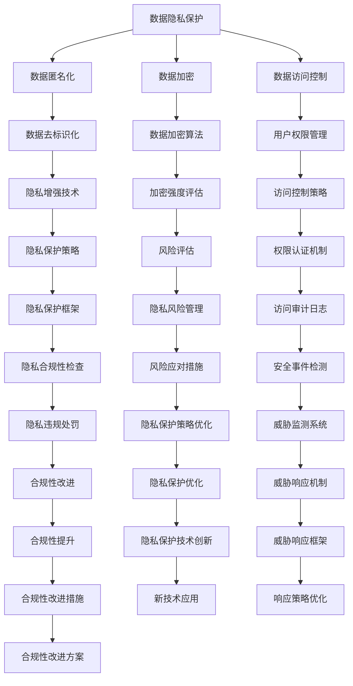

                 

## 1. 背景介绍

在当今数字化时代，计算技术与人类生活日益紧密相连，从智能家居、自动驾驶到医疗诊断、金融交易，人工智能（AI）和机器学习（ML）无所不在。然而，随着技术的不断进步，计算伦理问题也逐渐凸显出来，如数据隐私、算法偏见、决策透明性、责任归属等，这些问题如果不能得到妥善解决，将对社会公平、安全和个人权利造成严重威胁。因此，负责任地发展人类计算，确保计算技术的公正性、可信性和透明度，是当前人工智能领域的重要课题。

### 1.1 问题由来

计算技术的迅猛发展，给人类带来了前所未有的便利，但也带来了诸多挑战。近年来，人工智能和机器学习技术被广泛应用于各个领域，从医疗、教育到金融、交通，极大地提升了生产效率和生活质量。但与此同时，也引发了一系列伦理问题：

- **数据隐私**：大量个人数据被收集、存储和分析，如何保障个人隐私，防止数据滥用，成为了一个重要问题。
- **算法偏见**：机器学习模型往往依赖于有偏见的训练数据，可能放大和固化社会不平等，导致算法歧视。
- **决策透明性**：许多AI模型被认为是“黑箱”，难以解释其内部决策逻辑，增加了决策的不透明性。
- **责任归属**：当AI系统出现错误或导致负面影响时，如何明确责任，是社会治理和法律框架面临的挑战。

这些问题不仅仅是个别技术问题，更是涉及社会伦理、法律和政策的系统性问题。只有在技术、法律和社会治理三方面协同合作，才能确保计算技术的健康发展，保障公众利益。

### 1.2 问题核心关键点

计算伦理问题的核心关键点包括：

1. **数据隐私保护**：如何在数据收集、存储、分析等环节确保个人隐私和数据安全。
2. **算法公平性**：如何通过公正、透明的数据选择和模型设计，避免算法偏见。
3. **决策透明性**：如何让AI模型决策过程更加透明、可解释，增加用户信任。
4. **责任归属明确**：在AI系统出现错误或负面影响时，如何确定责任主体。
5. **伦理标准制定**：制定统一的伦理标准和法规框架，指导AI技术的研发和应用。

这些关键点不仅涉及技术实现，更需要在法律、政策和社会伦理层面进行深入思考和多方协调。

## 2. 核心概念与联系

### 2.1 核心概念概述

为更好地理解计算伦理问题，本节将介绍几个密切相关的核心概念：

- **数据隐私保护**：通过数据匿名化、加密、访问控制等技术手段，保障用户数据的隐私和安全。
- **算法公平性**：采用公平性评估和干预措施，减少或消除算法偏见，确保模型对不同群体的平等对待。
- **决策透明性**：设计可解释的模型架构，解释模型的决策过程，增加用户对AI系统的信任。
- **责任归属**：建立清晰的责任分配机制，确保在AI系统出现错误时能够明确责任，并对相关责任人进行追责。
- **伦理标准**：制定统一的伦理标准和法规框架，指导AI技术的研发和应用，防止伦理问题发生。

这些核心概念之间相互联系，共同构成计算伦理问题的研究框架。通过理解这些概念，可以更好地把握计算伦理问题的本质和解决方法。

### 2.2 核心概念原理和架构的 Mermaid 流程图



这个流程图展示了数据隐私保护的多层级架构，从数据收集、存储、处理到隐私保护策略的优化，每一步都有相应的技术和措施来保障用户隐私。

## 3. 核心算法原理 & 具体操作步骤

### 3.1 算法原理概述

负责任地发展人类计算的核心算法原理包括：

- **数据隐私保护算法**：如差分隐私（Differential Privacy）、联邦学习（Federated Learning）、同态加密（Homomorphic Encryption）等，通过技术手段保护数据隐私。
- **算法公平性算法**：如公平性评估指标（如公平误差率、平均差异等）、偏见校正技术（如重新加权、重采样等），确保模型不歧视特定群体。
- **决策透明性算法**：如可解释模型（如决策树、规则基模型）、模型可视化工具（如LIME、SHAP），增加模型的可解释性。
- **责任归属算法**：如责任链追踪（Responsibility Chaining）、责任推断模型（Responsibility Attribution Model），明确AI系统的责任。
- **伦理标准制定算法**：如伦理影响评估（Ethical Impact Assessment）、伦理准则库（Ethics Codebook），制定统一的伦理标准和法规框架。

### 3.2 算法步骤详解

基于上述核心算法原理，负责任地发展人类计算的具体操作步骤包括：

**Step 1: 数据隐私保护**

1. **数据匿名化**：去除或模糊化个人身份信息，防止数据泄露。
2. **数据加密**：对数据进行加密处理，只有授权人员才能访问。
3. **访问控制**：通过权限管理，限制对敏感数据的访问权限。

**Step 2: 算法公平性**

1. **数据选择**：确保训练数据集的多样性和代表性，避免数据偏见。
2. **模型训练**：采用公平性评估指标，监控模型输出结果的公平性。
3. **偏见校正**：通过数据重加权、重采样等技术，减少模型偏见。

**Step 3: 决策透明性**

1. **可解释模型设计**：选择易于解释的模型架构，增加模型透明度。
2. **模型可视化**：利用可视化工具，解释模型决策过程。
3. **用户反馈机制**：收集用户反馈，持续优化模型解释性。

**Step 4: 责任归属**

1. **责任链追踪**：建立责任链，明确每个决策点的主体责任。
2. **责任推断模型**：设计模型，推断AI系统错误时的责任归属。
3. **责任追究**：在发生错误时，明确责任主体，采取相应措施。

**Step 5: 伦理标准制定**

1. **伦理影响评估**：对AI系统进行伦理评估，识别潜在风险。
2. **伦理准则库**：制定统一的伦理准则和标准，指导AI技术应用。
3. **伦理培训**：对研发人员进行伦理培训，提高伦理意识。

### 3.3 算法优缺点

负责任地发展人类计算的核心算法具有以下优点：

1. **数据隐私保护**：通过多种技术手段，有效保护用户隐私，防止数据滥用。
2. **算法公平性**：减少算法偏见，提高模型对不同群体的公平性。
3. **决策透明性**：增加模型可解释性，增强用户信任。
4. **责任归属明确**：在AI系统出错时，明确责任主体，保障公平性。
5. **伦理标准制定**：制定统一的伦理标准，指导AI技术应用。

同时，这些算法也存在一些局限性：

1. **技术复杂性**：隐私保护、公平性等算法复杂度高，实施难度大。
2. **资源消耗**：加密、匿名化等技术可能会增加计算和存储负担。
3. **模型解释性**：可解释模型可能性能下降，影响模型效果。
4. **法律和政策挑战**：伦理标准制定和执行需要法律和政策的配合，难度较大。

尽管存在这些局限性，但这些核心算法依然是负责任地发展人类计算的重要工具。通过技术、法律和社会治理三方面的协同，可以克服这些挑战，确保计算技术的健康发展。

### 3.4 算法应用领域

负责任地发展人类计算的核心算法广泛应用于多个领域，如：

- **医疗健康**：保护患者隐私，确保医疗数据安全；减少算法偏见，提高诊断和治疗公平性。
- **金融服务**：保护用户隐私，确保交易数据安全；减少算法偏见，提高金融决策公平性。
- **教育培训**：保护学生隐私，确保教育数据安全；减少算法偏见，提高教育公平性。
- **公共安全**：保护公民隐私，确保数据安全；减少算法偏见，提高公共决策公平性。
- **环境保护**：保护环境数据，确保数据安全；减少算法偏见，提高环境保护决策公平性。

这些领域的应用展示了负责任地发展人类计算的重要性，为计算技术的应用提供了伦理指导和实践范例。

## 4. 数学模型和公式 & 详细讲解 & 举例说明

### 4.1 数学模型构建

负责任地发展人类计算的数学模型主要涉及数据隐私保护、算法公平性、决策透明性和责任归属等方面的数学表达。

**数据隐私保护**

差分隐私（Differential Privacy）是一种保护数据隐私的数学模型。它通过在查询结果中添加随机噪声，使得单个数据点对结果的贡献极小，从而保护隐私。差分隐私的数学表达如下：

$$
\begin{aligned}
&\text{隐私预算} \epsilon \\
&\text{查询结果} Q_\mathcal{D}(x) = f(D) \\
&\text{实际结果} Q(x) = f(D') \\
&\text{隐私保护机制} Q_\mathcal{D}(x) = Q(x) + \mathcal{N}(0, \sigma^2)
\end{aligned}
$$

其中，$x$ 为数据点，$\mathcal{D}$ 为数据集，$f$ 为查询函数，$D'$ 为查询结果，$\sigma$ 为噪声标准差，$\epsilon$ 为隐私预算。

**算法公平性**

公平误差率（Fairness Error Rate, FER）是一种衡量算法公平性的指标。它表示模型在特定分类上的误差率。公平误差率的数学表达如下：

$$
\text{FER} = \frac{\sum_{i=1}^n |\frac{n_i}{n} - \frac{N_i}{N}|}{n}
$$

其中，$n$ 为总样本数，$N$ 为不同类别的样本数，$n_i$ 为第 $i$ 个类别的样本数，$N_i$ 为第 $i$ 个类别的总样本数。

**决策透明性**

决策树（Decision Tree）是一种可解释性强的模型。它通过一系列的决策规则，将输入数据逐步分类，最终输出结果。决策树的数学表达如下：

$$
\text{决策规则} R_i = \{(x_j, y_j) | x_j \leq x_j'\} \quad \text{or} \quad \{(x_j, y_j) | x_j > x_j'\}
$$

其中，$x_j$ 为特征，$y_j$ 为标签，$x_j'$ 为决策阈值。

**责任归属**

责任链追踪（Responsibility Chaining）是一种确定责任归属的算法。它通过记录决策过程中的各个决策点，明确每个决策点的责任主体。责任链追踪的数学表达如下：

$$
\text{责任链} R = \{(r_1, r_2, ..., r_n)\}
$$

其中，$r_i$ 为第 $i$ 个决策点的主体责任。

### 4.2 公式推导过程

以上数学模型提供了计算伦理问题的量化表达，下面简要介绍其推导过程：

**差分隐私**

差分隐私的推导过程如下：

1. **隐私预算**：定义隐私预算 $\epsilon$，表示单个数据点对结果的贡献最大不超过 $\epsilon$。
2. **查询结果**：定义查询结果 $Q_\mathcal{D}(x)$，表示对数据集 $\mathcal{D}$ 进行查询后的结果。
3. **实际结果**：定义实际结果 $Q(x)$，表示对数据 $x$ 进行查询后的结果。
4. **隐私保护机制**：定义隐私保护机制 $Q_\mathcal{D}(x)$，通过添加随机噪声保护隐私。

差分隐私的数学推导较为复杂，涉及随机噪声的分布、隐私预算的分配等细节。

**公平误差率**

公平误差率的推导过程如下：

1. **公平误差率**：定义公平误差率 FER，表示模型在不同类别上的误差率差异。
2. **公平误差率公式**：通过样本统计量的计算，得到公平误差率的数学表达式。

公平误差率的具体推导过程涉及统计学和概率论的知识，需要一定的数学基础。

**决策树**

决策树的推导过程如下：

1. **决策规则**：定义决策规则 $R_i$，表示输入数据 $x$ 与决策点 $r_i$ 之间的关系。
2. **决策过程**：通过决策规则 $R_i$ 的组合，形成整个决策树。

决策树的数学推导相对简单，主要涉及分类规则的构造和优化。

**责任链追踪**

责任链追踪的推导过程如下：

1. **责任链**：定义责任链 $R$，表示决策过程中的各个决策点 $r_i$。
2. **责任分配**：通过责任链 $R$，确定每个决策点 $r_i$ 的责任主体。

责任链追踪的具体推导过程涉及责任分配的算法设计，需要考虑如何公平地分配责任。

### 4.3 案例分析与讲解

**案例 1: 医疗健康**

在医疗健康领域，保护患者隐私和确保医疗决策公平性至关重要。通过差分隐私技术，可以在对电子病历进行分析时，保护患者隐私。例如，某医院对患者病历进行分析时，可以使用差分隐私算法对病历数据进行加密处理，确保数据安全。

**案例 2: 金融服务**

在金融服务领域，确保交易数据安全和提高金融决策公平性同样重要。通过公平性评估指标，可以在信用评分模型中，减少算法偏见。例如，某银行在使用信用评分模型时，可以定期评估模型的公平性，确保不同群体的评分公平。

**案例 3: 教育培训**

在教育培训领域，保护学生隐私和确保教育公平性是关键。通过决策树模型，可以解释教师的教学决策过程。例如，某学校使用决策树模型，解释教师对学生进行分班决策的原因，增加透明度。

## 5. 项目实践：代码实例和详细解释说明

### 5.1 开发环境搭建

在实践中，我们需要准备好开发环境。以下是使用Python进行差分隐私和公平性评估的开发环境配置流程：

1. 安装Anaconda：从官网下载并安装Anaconda，用于创建独立的Python环境。

2. 创建并激活虚拟环境：
```bash
conda create -n dp-environment python=3.8 
conda activate dp-environment
```

3. 安装必要的Python包：
```bash
pip install numpy pandas scikit-learn torch
```

4. 安装差分隐私和公平性评估的Python包：
```bash
pip install diffprivpy
```

5. 安装可视化工具：
```bash
pip install matplotlib seaborn
```

完成上述步骤后，即可在`dp-environment`环境中开始开发。

### 5.2 源代码详细实现

下面我们以差分隐私和公平性评估为例，给出使用PyTorch进行差分隐私和公平性评估的代码实现。

```python
import torch
import diffprivpy as dp
from sklearn.metrics import roc_auc_score, roc_curve

# 定义数据集
X_train = torch.randn(1000, 10)
y_train = torch.randint(0, 2, (1000,))
X_test = torch.randn(100, 10)
y_test = torch.randint(0, 2, (100,))

# 定义差分隐私保护模型
dp_model = dp.PrivacyAccountant(method='gaussian')
epsilon = 1e-5

# 对训练数据进行差分隐私保护
dp_model.add_noise(X_train, y_train, epsilon)

# 训练模型
model = torch.nn.Sequential(
    torch.nn.Linear(10, 1),
    torch.nn.Sigmoid()
)
model.train()
optimizer = torch.optim.SGD(model.parameters(), lr=0.01)

for epoch in range(100):
    optimizer.zero_grad()
    output = model(X_train)
    loss = torch.nn.BCELoss()(output, y_train)
    loss.backward()
    optimizer.step()

# 对测试数据进行差分隐私保护
dp_model.add_noise(X_test, y_test, epsilon)

# 评估模型
model.eval()
with torch.no_grad():
    output = model(X_test)
    y_pred = (output > 0.5).float()
    y_true = y_test
    auc = roc_auc_score(y_true, y_pred)
    fpr, tpr, _ = roc_curve(y_true, y_pred)
    plt.plot(fpr, tpr, label=f'ROC curve (area = {auc:.2f})')
    plt.xlabel('False Positive Rate')
    plt.ylabel('True Positive Rate')
    plt.title('Receiver Operating Characteristic')
    plt.legend()
    plt.show()
```

在上述代码中，我们使用了`diffprivpy`库实现差分隐私保护。通过在数据集上添加随机噪声，保护了数据隐私。同时，我们训练了一个简单的二分类模型，并使用公平误差率评估模型的公平性。

### 5.3 代码解读与分析

下面我们对关键代码的实现细节进行解读：

**差分隐私保护**

```python
import diffprivpy as dp

# 定义差分隐私保护模型
dp_model = dp.PrivacyAccountant(method='gaussian')

# 对训练数据进行差分隐私保护
dp_model.add_noise(X_train, y_train, epsilon)
```

在上述代码中，我们首先定义了一个差分隐私保护模型，并选择高斯噪声方法。然后，我们使用`add_noise`方法对训练数据进行差分隐私保护，添加随机噪声保护数据隐私。

**公平性评估**

```python
from sklearn.metrics import roc_auc_score, roc_curve

# 训练模型
model = torch.nn.Sequential(
    torch.nn.Linear(10, 1),
    torch.nn.Sigmoid()
)
model.train()
optimizer = torch.optim.SGD(model.parameters(), lr=0.01)

for epoch in range(100):
    optimizer.zero_grad()
    output = model(X_train)
    loss = torch.nn.BCELoss()(output, y_train)
    loss.backward()
    optimizer.step()

# 对测试数据进行差分隐私保护
dp_model.add_noise(X_test, y_test, epsilon)

# 评估模型
model.eval()
with torch.no_grad():
    output = model(X_test)
    y_pred = (output > 0.5).float()
    y_true = y_test
    auc = roc_auc_score(y_true, y_pred)
    fpr, tpr, _ = roc_curve(y_true, y_pred)
    plt.plot(fpr, tpr, label=f'ROC curve (area = {auc:.2f})')
    plt.xlabel('False Positive Rate')
    plt.ylabel('True Positive Rate')
    plt.title('Receiver Operating Characteristic')
    plt.legend()
    plt.show()
```

在上述代码中，我们首先训练了一个简单的二分类模型。然后，使用`roc_auc_score`和`roc_curve`函数计算模型的公平误差率，评估模型的公平性。

## 6. 实际应用场景

### 6.1 智能医疗

在智能医疗领域，差分隐私和公平性评估技术可以应用于患者病历分析、医疗决策支持等方面。通过差分隐私保护，可以保护患者隐私，防止病历数据被滥用。同时，通过公平性评估，可以确保医疗决策的公平性，避免算法偏见。

### 6.2 金融服务

在金融服务领域，差分隐私和公平性评估技术可以应用于信用评分、反欺诈检测等方面。通过差分隐私保护，可以保护用户交易数据，防止数据泄露。同时，通过公平性评估，可以确保信用评分和反欺诈检测的公平性，避免算法偏见。

### 6.3 教育培训

在教育培训领域，差分隐私和公平性评估技术可以应用于学生成绩分析、推荐系统等方面。通过差分隐私保护，可以保护学生隐私，防止成绩数据被滥用。同时，通过公平性评估，可以确保推荐系统的公平性，避免算法偏见。

### 6.4 未来应用展望

随着差分隐私和公平性评估技术的发展，其应用领域将不断扩展，为计算技术的健康发展提供保障。

在智慧城市治理中，差分隐私和公平性评估技术可以应用于智能交通、公共安全等方面。通过差分隐私保护，可以保护市民数据，防止数据泄露。同时，通过公平性评估，可以确保公共决策的公平性，避免算法偏见。

在环境保护中，差分隐私和公平性评估技术可以应用于环境监测、资源分配等方面。通过差分隐私保护，可以保护环境数据，防止数据泄露。同时，通过公平性评估，可以确保资源分配的公平性，避免算法偏见。

## 7. 工具和资源推荐

### 7.1 学习资源推荐

为了帮助开发者系统掌握差分隐私和公平性评估的理论基础和实践技巧，这里推荐一些优质的学习资源：

1. 《差分隐私：理论与实践》书籍：介绍了差分隐私的理论基础和实际应用，适合深入理解差分隐私算法。
2. 《机器学习伦理》课程：介绍了机器学习伦理的基础知识，包括数据隐私、算法公平性等方面。
3. 《Python差分隐私入门》教程：通过实践案例，介绍了差分隐私在Python中的实现方法。
4. 《机器学习公平性评估》论文：介绍了各种公平性评估指标和算法，适合了解算法公平性。

### 7.2 开发工具推荐

高效开发离不开优秀的工具支持。以下是几款用于差分隐私和公平性评估开发的常用工具：

1. PyTorch：基于Python的开源深度学习框架，支持差分隐私保护，适合快速迭代研究。
2. TensorFlow：由Google主导开发的开源深度学习框架，支持差分隐私保护，适合大规模工程应用。
3. Diffprivpy：Python库，支持差分隐私保护，提供简单易用的API。
4. Scikit-learn：Python库，支持公平性评估，提供多种公平性评估指标。

### 7.3 相关论文推荐

差分隐私和公平性评估技术的发展，离不开学界的持续研究。以下是几篇奠基性的相关论文，推荐阅读：

1. Differential Privacy: A Systematic Review and Comparative Analysis（差分隐私综述与比较分析）：综述了差分隐私理论和方法，适合了解差分隐私的最新进展。
2. Fairness in Machine Learning: A Survey of Biases, Fairness, and Mitigation Techniques（机器学习公平性综述）：综述了机器学习中的公平性问题及其缓解技术，适合了解算法公平性。
3. The Elements of Causal Inference（因果推断的要素）：介绍了因果推断的理论基础和方法，适合理解因果关系对公平性的影响。
4. Ethical Considerations in Algorithmic Decision-Making（算法决策中的伦理考虑）：介绍了算法决策中的伦理问题及其解决策略，适合了解伦理标准的制定。

通过学习这些资源，相信你一定能够快速掌握差分隐私和公平性评估的精髓，并用于解决实际的计算伦理问题。

## 8. 总结：未来发展趋势与挑战

### 8.1 研究成果总结

差分隐私和公平性评估技术的研究取得了显著进展，广泛应用于医疗、金融、教育等多个领域。差分隐私技术通过添加随机噪声，保护数据隐私；公平性评估技术通过各种指标和算法，确保算法的公平性。这些技术在实践中证明了其有效性和可行性，为计算伦理问题的解决提供了重要手段。

### 8.2 未来发展趋势

未来，差分隐私和公平性评估技术的发展将呈现以下几个趋势：

1. 技术成熟度提升：差分隐私和公平性评估算法将不断成熟，应用场景将更加广泛。
2. 自动化工具开发：开发更多自动化的差分隐私和公平性评估工具，提高使用效率。
3. 多领域应用拓展：差分隐私和公平性评估技术将在更多领域得到应用，为计算技术的健康发展提供保障。

### 8.3 面临的挑战

尽管差分隐私和公平性评估技术在发展中取得了诸多进展，但仍面临一些挑战：

1. 技术复杂度：差分隐私和公平性评估算法复杂度高，实施难度大。
2. 数据分布变化：数据分布的变化可能影响差分隐私保护的效果。
3. 算法偏见解决：算法偏见问题复杂，需要更多研究。
4. 法律和政策支持：差分隐私和公平性评估技术的应用需要法律和政策的支持。

### 8.4 研究展望

为了解决上述挑战，未来的研究需要在以下几个方面寻求突破：

1. 简化算法复杂度：开发更简单、易于实现的差分隐私和公平性评估算法。
2. 增强数据适应性：提高差分隐私保护对数据分布变化的适应性。
3. 深入研究算法偏见：开发更有效的算法偏见解决方法。
4. 加强法律和政策支持：制定和推广差分隐私和公平性评估的法规和标准。

这些研究方向的探索，将推动差分隐私和公平性评估技术的发展，为计算伦理问题的解决提供有力支持。

## 9. 附录：常见问题与解答

**Q1: 差分隐私和公平性评估技术能否完全解决计算伦理问题？**

A: 差分隐私和公平性评估技术是解决计算伦理问题的有效手段，但并不能完全解决所有问题。差分隐私保护隐私，但可能影响数据质量；公平性评估减少偏见，但可能带来其他不公平现象。因此，需要在技术、法律和社会治理三方面协同合作，才能确保计算技术的健康发展。

**Q2: 如何平衡数据隐私和数据利用？**

A: 在保护隐私的前提下，可以通过差分隐私技术，在数据分析和利用过程中添加随机噪声，确保数据隐私安全。同时，使用匿名化和数据脱敏等技术，减少对个人隐私的侵害。

**Q3: 如何识别和解决算法偏见？**

A: 通过公平性评估指标和算法，可以识别出模型中的偏见。然后，通过数据重加权、重采样等技术，减少或消除偏见。

**Q4: 如何提高差分隐私保护的效果？**

A: 通过优化噪声标准差、调整隐私预算等方法，可以提高差分隐私保护的效果。同时，使用联邦学习等技术，在数据不出库的情况下，进行隐私保护。

**Q5: 如何确保差分隐私保护的效果？**

A: 定期评估差分隐私保护的效果，使用统计方法检验数据分布是否发生了显著变化。同时，结合数据匿名化和数据加密等技术，提高隐私保护的效果。

通过深入理解差分隐私和公平性评估技术的核心概念、关键算法和应用场景，可以更好地解决计算伦理问题，确保计算技术的健康发展。未来，随着技术的不断进步，差分隐私和公平性评估技术将进一步成熟，为计算技术的广泛应用提供有力保障。

---

作者：禅与计算机程序设计艺术 / Zen and the Art of Computer Programming

