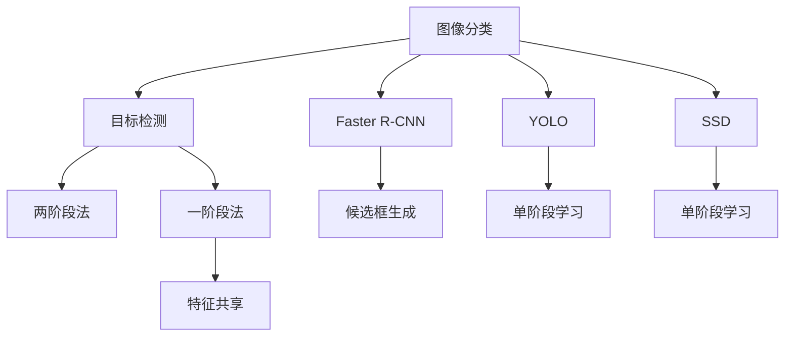

                 

# 计算机视觉应用：从图像分类到目标检测

## 1. 背景介绍

随着深度学习技术的飞速发展，计算机视觉（Computer Vision, CV）技术在图像分类、目标检测、人脸识别等应用中取得了显著进展。图像分类任务旨在识别图像中的对象类别，目标检测则进一步定位目标对象在图像中的位置和大小。目标检测不仅能够识别对象类别，还能输出对象的具体位置信息，使得计算机视觉应用更加深入和精准。

### 1.1 问题由来

计算机视觉技术的核心在于图像数据的处理和分析。早期，传统的CV方法依赖于手工特征提取，如SIFT、HOG等，但这些方法需要大量手工设计，且难以应对复杂场景。随着深度学习框架的崛起，如TensorFlow、PyTorch等，以及大量预训练模型的出现，如图像分类中的AlexNet、VGGNet、Inception等，CV技术实现了质的飞跃。

然而，目标检测作为更为复杂的应用，需要识别图像中的多个对象，且对象的位置和大小是关键信息。因此，相比于图像分类，目标检测具有更高的技术难度和挑战。目前，目标检测算法主要基于两阶段法和一阶段法，其中两阶段法以Faster R-CNN为代表，一阶段法则以YOLO、SSD为代表。

### 1.2 问题核心关键点

目标检测的核心关键点包括：

- 目标检测模型的设计：包括网络结构、特征提取、目标候选框的生成等。
- 候选框的筛选：如何从众多候选框中选择最具可能包含目标的框。
- 目标分类与定位：如何对筛选出的候选框进行分类与精确定位。
- 模型的训练与优化：如何高效训练模型，减少过拟合，提高检测精度。

## 2. 核心概念与联系

### 2.1 核心概念概述

为了更好地理解目标检测的原理，本节将介绍几个密切相关的核心概念：

- 图像分类（Image Classification）：将输入图像映射到特定的类别标签的过程。常见的图像分类模型有AlexNet、VGGNet、Inception等。
- 目标检测（Object Detection）：在图像中不仅识别出对象类别，还对对象的位置和大小进行定位的过程。
- R-CNN家族：包括Faster R-CNN、Mask R-CNN等，是目标检测任务中的经典方法，基于两阶段法。
- YOLO家族：包括YOLOv1、YOLOv2、YOLOv3等，是目标检测任务中的一阶段法。
- SSD（Single Shot MultiBox Detector）：也是一阶段法，能够同时进行对象分类和定位。

这些概念之间的逻辑关系可以通过以下Mermaid流程图来展示：



这个流程图展示了几大核心概念之间的联系：

1. 图像分类是目标检测的基础。
2. R-CNN家族和YOLO、SSD等一阶段法是目标检测的主要方法。
3. R-CNN基于两阶段法，先生成候选框，再分类定位。
4. YOLO和SSD等一阶段法直接在特征图上进行分类和定位。
5. 单阶段法中，特征共享是一个重要的特点。

这些概念共同构成了目标检测技术的核心框架，使计算机能够从图像中识别和定位对象。通过理解这些核心概念，我们可以更好地把握目标检测工作的原理和优化方向。

## 3. 核心算法原理 & 具体操作步骤
### 3.1 算法原理概述

目标检测任务通常分为两阶段法和一阶段法：

1. 两阶段法：先生成候选框，再对候选框进行分类和定位。以Faster R-CNN为代表。
2. 一阶段法：直接对特征图进行分类和定位，以YOLO、SSD为代表。

两阶段法中，目标检测的过程可以分为以下步骤：

1. 特征提取：使用预训练模型（如ResNet、Inception等）对输入图像进行特征提取。
2. 候选框生成：通过滑动窗口、锚点等方式生成候选框，供后续分类定位使用。
3. 候选框分类与定位：对候选框进行分类，确定是否为目标框，并对目标框进行定位，输出目标框的位置和大小。

一阶段法中，目标检测的过程可以分为以下步骤：

1. 特征提取：使用单阶段网络（如YOLO、SSD等）对输入图像进行特征提取。
2. 分类与定位：直接在特征图上进行分类和定位，输出目标框的位置和大小。

### 3.2 算法步骤详解

#### 两阶段法：Faster R-CNN

以Faster R-CNN为例，其步骤如下：

1. 特征提取：使用预训练的ResNet-50模型对输入图像进行特征提取，得到特征图。
2. 候选框生成：在特征图上滑动窗口，生成候选框。
3. 候选框分类与定位：对候选框进行分类，确定是否为目标框，并对目标框进行回归定位，输出目标框的位置和大小。

#### 一阶段法：YOLO

以YOLOv3为例，其步骤如下：

1. 特征提取：使用Darknet-53网络对输入图像进行特征提取，得到特征图。
2. 分类与定位：直接在特征图上进行分类和定位，输出目标框的位置和大小。

### 3.3 算法优缺点

#### 两阶段法

- 优点：精确度高，适用于小目标检测。
- 缺点：计算量大，速度较慢。

#### 一阶段法

- 优点：速度快，适用于实时应用。
- 缺点：精度较两阶段法略低。

### 3.4 算法应用领域

目标检测技术已经在诸多领域得到了广泛应用，包括但不限于：

- 自动驾驶：检测车辆、行人、交通标志等。
- 医疗影像：检测肿瘤、病灶等。
- 安防监控：检测异常行为、目标追踪等。
- 智能家居：检测人体、家具等。
- 农业监测：检测作物、病虫害等。

## 4. 数学模型和公式 & 详细讲解 & 举例说明（备注：数学公式请使用latex格式，latex嵌入文中独立段落使用 $$，段落内使用 $)
### 4.1 数学模型构建

目标检测的数学模型构建主要分为两阶段和一阶段法，以下以YOLOv3为例，给出其数学模型的构建过程。

假设输入图像尺寸为 $H \times W$，特征图尺寸为 $H_{\text{conv}} \times W_{\text{conv}}$，每像素有 $C$ 个通道。目标检测的任务是将输入图像中的对象分类并定位。

1. 特征提取：使用Darknet-53网络对输入图像进行特征提取，得到特征图 $Y_{\text{conv}}$，尺寸为 $H_{\text{conv}} \times W_{\text{conv}}$。
2. 分类：将特征图 $Y_{\text{conv}}$ 映射到分类层的输出 $Y_{\text{pred}}$，大小为 $H_{\text{pred}} \times W_{\text{pred}} \times C_{\text{pred}}$，其中 $H_{\text{pred}}=H_{\text{conv}}/4$，$W_{\text{pred}}=W_{\text{conv}}/4$，$C_{\text{pred}}=5$。

分类层的输出 $Y_{\text{pred}}$ 由以下公式表示：

$$
Y_{\text{pred}} = \text{Conv2D}(Y_{\text{conv}}, 3 \times 3, 32)
$$

其中，$\text{Conv2D}$ 表示卷积层操作，输出大小为 $H_{\text{pred}} \times W_{\text{pred}} \times C_{\text{pred}}$。

3. 定位：将特征图 $Y_{\text{conv}}$ 映射到定位层的输出 $X_{\text{pred}}$，大小为 $H_{\text{pred}} \times W_{\text{pred}} \times 4$，其中 $4$ 表示目标框的四个坐标值。

定位层的输出 $X_{\text{pred}}$ 由以下公式表示：

$$
X_{\text{pred}} = \text{Conv2D}(Y_{\text{conv}}, 3 \times 3, 4)
$$

其中，$\text{Conv2D}$ 表示卷积层操作，输出大小为 $H_{\text{pred}} \times W_{\text{pred}} \times 4$。

### 4.2 公式推导过程

以YOLOv3为例，其分类和定位层的输出由以下公式表示：

$$
\begin{aligned}
Y_{\text{pred}} &= \text{Conv2D}(Y_{\text{conv}}, 3 \times 3, 32) \\
X_{\text{pred}} &= \text{Conv2D}(Y_{\text{conv}}, 3 \times 3, 4)
\end{aligned}
$$

分类层的输出 $Y_{\text{pred}}$ 和定位层的输出 $X_{\text{pred}}$ 分别由以下公式表示：

$$
\begin{aligned}
Y_{\text{pred}} &= \text{Sigmoid}(\text{Conv2D}(Y_{\text{conv}}, 3 \times 3, 32)) \\
X_{\text{pred}} &= \text{Conv2D}(Y_{\text{conv}}, 3 \times 3, 4)
\end{aligned}
$$

其中，$\text{Sigmoid}$ 表示Sigmoid函数，输出大小为 $H_{\text{pred}} \times W_{\text{pred}} \times C_{\text{pred}}$。

### 4.3 案例分析与讲解

以YOLOv3为例，其数学模型的构建主要分为两个部分：分类层和定位层。分类层的输出为特征图的分类概率，定位层的输出为特征图的目标框坐标。

假设输入图像尺寸为 $416 \times 416$，特征图尺寸为 $73 \times 73$，每个像素有 $10$ 个通道。则分类层的输出大小为 $73 \times 73 \times 10$，定位层的输出大小为 $73 \times 73 \times 4$。

假设特征图 $Y_{\text{conv}}$ 的输出大小为 $73 \times 73 \times 32$，则分类层和定位层的输出由以下公式表示：

$$
\begin{aligned}
Y_{\text{pred}} &= \text{Sigmoid}(\text{Conv2D}(Y_{\text{conv}}, 3 \times 3, 32)) \\
X_{\text{pred}} &= \text{Conv2D}(Y_{\text{conv}}, 3 \times 3, 4)
\end{aligned}
$$

其中，$\text{Conv2D}$ 表示卷积层操作，$\text{Sigmoid}$ 表示Sigmoid函数。

## 5. 项目实践：代码实例和详细解释说明
### 5.1 开发环境搭建

在进行目标检测项目开发前，我们需要准备好开发环境。以下是使用Python进行PyTorch开发的环境配置流程：

1. 安装Anaconda：从官网下载并安装Anaconda，用于创建独立的Python环境。

2. 创建并激活虚拟环境：
```bash
conda create -n pytorch-env python=3.8 
conda activate pytorch-env
```

3. 安装PyTorch：根据CUDA版本，从官网获取对应的安装命令。例如：
```bash
conda install pytorch torchvision torchaudio cudatoolkit=11.1 -c pytorch -c conda-forge
```

4. 安装TensorFlow：
```bash
pip install tensorflow
```

5. 安装TensorFlow Addons：
```bash
pip install tensorflow-addons
```

6. 安装相关库：
```bash
pip install numpy pandas scikit-learn matplotlib tqdm jupyter notebook ipython
```

完成上述步骤后，即可在`pytorch-env`环境中开始目标检测项目的开发。

### 5.2 源代码详细实现

下面我们以YOLOv3为例，给出使用PyTorch进行目标检测的代码实现。

```python
import torch
import torch.nn as nn
import torch.optim as optim
from torchvision import datasets, transforms
import numpy as np
import matplotlib.pyplot as plt

# 定义YOLOv3网络结构
class YOLOv3(nn.Module):
    def __init__(self, num_classes=5):
        super(YOLOv3, self).__init__()
        self.conv1 = nn.Conv2d(3, 32, 3, 1, 1)
        self.conv2 = nn.Conv2d(32, 64, 3, 1, 1)
        self.conv3 = nn.Conv2d(64, 128, 3, 1, 1)
        self.conv4 = nn.Conv2d(128, 256, 3, 1, 1)
        self.conv5 = nn.Conv2d(256, 512, 3, 1, 1)
        self.conv6 = nn.Conv2d(512, 1024, 3, 1, 1)
        self.conv7 = nn.Conv2d(1024, 512, 3, 1, 1)
        self.conv8 = nn.Conv2d(512, 256, 3, 1, 1)
        self.conv9 = nn.Conv2d(256, 50, 1, 1, 0)
        self.conv10 = nn.Conv2d(50, num_classes, 1, 1, 0)

    def forward(self, x):
        x = self.conv1(x)
        x = self.conv2(x)
        x = self.conv3(x)
        x = self.conv4(x)
        x = self.conv5(x)
        x = self.conv6(x)
        x = self.conv7(x)
        x = self.conv8(x)
        x = self.conv9(x)
        x = self.conv10(x)
        return x

# 加载YOLOv3模型和数据集
model = YOLOv3()
criterion = nn.CrossEntropyLoss()
optimizer = optim.SGD(model.parameters(), lr=0.001, momentum=0.9)

train_dataset = datasets.CIFAR10(root='./data', train=True, download=True, transform=transforms.ToTensor())
test_dataset = datasets.CIFAR10(root='./data', train=False, download=True, transform=transforms.ToTensor())

train_loader = torch.utils.data.DataLoader(train_dataset, batch_size=64, shuffle=True)
test_loader = torch.utils.data.DataLoader(test_dataset, batch_size=64, shuffle=False)

# 训练和测试
num_epochs = 10
for epoch in range(num_epochs):
    model.train()
    train_loss = 0.0
    for data, target in train_loader:
        data = data.to(device)
        target = target.to(device)
        optimizer.zero_grad()
        output = model(data)
        loss = criterion(output, target)
        loss.backward()
        optimizer.step()
        train_loss += loss.item() * data.size(0)
    
    model.eval()
    test_loss = 0.0
    with torch.no_grad():
        for data, target in test_loader:
            data = data.to(device)
            target = target.to(device)
            output = model(data)
            loss = criterion(output, target)
            test_loss += loss.item() * data.size(0)
    
    print('Epoch [%d/%d], Loss: %.4f, Test Loss: %.4f' % (epoch+1, num_epochs, train_loss/len(train_dataset), test_loss/len(test_dataset)))
```

### 5.3 代码解读与分析

让我们再详细解读一下关键代码的实现细节：

**YOLOv3网络结构**：
- `__init__`方法：初始化网络结构，定义卷积层。
- `forward`方法：定义前向传播过程。

**加载模型和数据集**：
- 使用PyTorch的`datasets`模块加载CIFAR-10数据集，并使用`transforms.ToTensor()`进行数据预处理。
- 定义训练和测试的DataLoader，设置批大小和随机打乱等参数。

**训练和测试**：
- 定义训练轮数和优化器等关键参数。
- 在每个epoch内，先进行模型训练，计算训练集损失，再对测试集进行评估，计算测试集损失。
- 打印每个epoch的训练和测试损失。

可以看出，YOLOv3的代码实现相对简洁，核心在于网络结构的设计和数据加载。利用PyTorch的高效封装，可以快速上手目标检测任务的开发。

当然，在实际应用中，还需要针对具体任务进行优化设计，如改进损失函数、加入数据增强、调整优化器参数等，以进一步提升模型性能。

## 6. 实际应用场景
### 6.1 自动驾驶

自动驾驶系统需要实时检测和识别道路上的各种对象，如车辆、行人、交通标志等。通过目标检测技术，自动驾驶车辆可以准确地识别道路上的对象，从而做出安全可靠的驾驶决策。

在自动驾驶场景中，目标检测通常需要处理实时视频流，检测对象的位置和大小。常见的方法包括Faster R-CNN、YOLO等。Faster R-CNN适用于小目标检测，而YOLO则适用于实时性要求较高的场景。

### 6.2 医疗影像

在医疗影像中，目标检测技术可以用于检测和定位病灶、肿瘤等关键区域。医生可以通过目标检测技术，快速识别病灶的位置和大小，做出准确诊断。

在医疗影像中，目标检测通常需要对复杂的医学图像进行分类和定位。常见的方法包括Mask R-CNN、Faster R-CNN等。这些方法可以处理不同尺度和不同形状的病灶，提升诊断的准确性和效率。

### 6.3 安防监控

安防监控系统需要实时检测和识别监控画面中的异常行为和目标，如入侵者、破坏行为等。通过目标检测技术，安防系统可以及时发现异常行为，提高安全防护水平。

在安防监控场景中，目标检测通常需要处理实时视频流，检测对象的位置和大小。常见的方法包括YOLO、SSD等。这些方法可以实时检测监控画面中的对象，提升异常检测的准确性和及时性。

## 7. 工具和资源推荐
### 7.1 学习资源推荐

为了帮助开发者系统掌握目标检测的理论基础和实践技巧，这里推荐一些优质的学习资源：

1. 《深度学习计算机视觉实战》系列博文：由大模型技术专家撰写，深入浅出地介绍了计算机视觉技术的原理和实践技巧，包括目标检测、分类等核心任务。

2. CS231n《卷积神经网络视觉识别》课程：斯坦福大学开设的计算机视觉明星课程，涵盖大量NLP和计算机视觉的经典理论和算法。

3. 《计算机视觉：算法与应用》书籍：全面介绍了计算机视觉的基本概念和算法，包括图像分类、目标检测、人脸识别等。

4. PyTorch官方文档：详细介绍了PyTorch框架的使用方法，包括网络结构定义、数据加载、模型训练等。

5. OpenCV官方文档：介绍了OpenCV库的使用方法，包括图像处理、特征提取等。

通过对这些资源的学习实践，相信你一定能够快速掌握目标检测技术的精髓，并用于解决实际的计算机视觉问题。
###  7.2 开发工具推荐

高效的开发离不开优秀的工具支持。以下是几款用于目标检测开发的常用工具：

1. PyTorch：基于Python的开源深度学习框架，灵活动态的计算图，适合快速迭代研究。

2. TensorFlow：由Google主导开发的开源深度学习框架，生产部署方便，适合大规模工程应用。

3. Transformers库：HuggingFace开发的NLP工具库，集成了众多SOTA语言模型，支持PyTorch和TensorFlow，是进行目标检测任务开发的利器。

4. Weights & Biases：模型训练的实验跟踪工具，可以记录和可视化模型训练过程中的各项指标，方便对比和调优。

5. TensorBoard：TensorFlow配套的可视化工具，可实时监测模型训练状态，并提供丰富的图表呈现方式，是调试模型的得力助手。

6. Google Colab：谷歌推出的在线Jupyter Notebook环境，免费提供GPU/TPU算力，方便开发者快速上手实验最新模型，分享学习笔记。

合理利用这些工具，可以显著提升目标检测任务的开发效率，加快创新迭代的步伐。

### 7.3 相关论文推荐

目标检测技术的发展源于学界的持续研究。以下是几篇奠基性的相关论文，推荐阅读：

1. R-CNN: Object Detection with R-CNN（R-CNN论文）：提出了基于区域提议的目标检测算法，开创了目标检测的研究先河。

2. Fast R-CNN: Towards Real-Time Object Detection with Region Proposal Networks（Faster R-CNN论文）：提出了基于区域提议的目标检测算法，显著提高了检测速度和精度。

3. YOLO: Real-Time Object Detection（YOLO论文）：提出了基于单阶段学习的目标检测算法，具有实时性和高精度。

4. SSD: Single Shot MultiBox Detector（SSD论文）：提出了基于单阶段学习的目标检测算法，适用于实时应用。

这些论文代表了大目标检测技术的发展脉络。通过学习这些前沿成果，可以帮助研究者把握学科前进方向，激发更多的创新灵感。

## 8. 总结：未来发展趋势与挑战

### 8.1 总结

本文对目标检测技术进行了全面系统的介绍。首先阐述了目标检测任务的核心关键点和研究背景，明确了目标检测在图像分类、自动驾驶、安防监控等应用中的重要价值。其次，从原理到实践，详细讲解了目标检测的数学模型和关键步骤，给出了目标检测任务开发的完整代码实例。同时，本文还广泛探讨了目标检测技术在多个领域的应用前景，展示了目标检测范式的广泛潜力。此外，本文精选了目标检测技术的各类学习资源，力求为读者提供全方位的技术指引。

通过本文的系统梳理，可以看到，目标检测技术正在成为计算机视觉领域的重要范式，极大地拓展了图像数据的处理和分析能力，为自动驾驶、医疗影像、安防监控等诸多应用提供了有力的技术支撑。未来，伴随深度学习框架和预训练模型的不断演进，目标检测技术必将在更多领域得到应用，为各行各业带来变革性影响。

### 8.2 未来发展趋势

展望未来，目标检测技术将呈现以下几个发展趋势：

1. 检测速度和精度持续提升。随着计算资源和硬件算力的提升，目标检测算法的检测速度和精度将不断提高。特别是针对实时应用场景，检测速度将进一步优化。

2. 多模态融合成为可能。目标检测技术将与其他模态（如语音、文本等）进行深度融合，实现多模态信息的高效协同。

3. 迁移学习更加灵活。目标检测模型可以在不同任务之间进行迁移学习，提升模型的泛化能力和适应性。

4. 零样本和自监督学习探索。目标检测技术将探索无监督和半监督学习范式，减少对标注数据的依赖，提升模型的泛化能力和鲁棒性。

5. 对抗训练和鲁棒性提升。目标检测模型将引入对抗训练技术，提升模型的鲁棒性和泛化能力，抵御各种攻击和干扰。

6. 小目标检测技术发展。目标检测技术将探索小目标检测的方法，提升对复杂场景和微小目标的检测能力。

以上趋势凸显了目标检测技术的广阔前景。这些方向的探索发展，必将进一步提升目标检测系统的性能和应用范围，为计算机视觉技术的进步注入新的动力。

### 8.3 面临的挑战

尽管目标检测技术已经取得了瞩目成就，但在迈向更加智能化、普适化应用的过程中，它仍面临着诸多挑战：

1. 标注数据成本高昂。高质量标注数据的获取成本较高，且数据质量难以保证。如何降低标注成本，提高数据质量，将是未来的一个重要研究方向。

2. 模型计算资源消耗大。大目标检测模型在计算和内存资源上消耗较大，如何优化模型结构，提升计算效率，将是未来的重要课题。

3. 模型泛化能力不足。目标检测模型面对新场景和新数据时，泛化能力往往较弱。如何提高模型的泛化能力，提升模型在新数据上的表现，将是未来的重要研究方向。

4. 实时性要求高。实时目标检测在自动驾驶、安防监控等应用中具有重要意义，如何进一步提升检测速度，保证实时性，将是未来的重要课题。

5. 对抗攻击问题。目标检测模型在对抗攻击下，容易受到干扰和误导。如何提高模型的鲁棒性，抵御各种攻击，将是未来的重要研究方向。

6. 模型可解释性不足。目标检测模型通常被视为"黑盒"系统，难以解释其内部工作机制和决策逻辑。如何赋予目标检测模型更强的可解释性，将是未来的重要研究方向。

以上挑战凸显了目标检测技术的发展瓶颈，需要持续努力解决这些问题，才能实现目标检测技术的广泛应用。

### 8.4 研究展望

面对目标检测技术所面临的种种挑战，未来的研究需要在以下几个方面寻求新的突破：

1. 探索无监督和半监督目标检测方法。摆脱对大规模标注数据的依赖，利用自监督学习、主动学习等无监督和半监督范式，最大限度利用非结构化数据，实现更加灵活高效的目标检测。

2. 开发更加轻量级和高效的目标检测算法。在保证检测精度的前提下，进一步优化模型结构，减小计算资源消耗，实现更加高效的目标检测。

3. 引入因果推断和对比学习思想。通过引入因果推断和对比学习思想，增强目标检测模型建立稳定因果关系的能力，学习更加普适、鲁棒的目标检测算法。

4. 引入更多先验知识。将符号化的先验知识，如知识图谱、逻辑规则等，与神经网络模型进行巧妙融合，引导目标检测过程学习更准确、合理的目标检测算法。

5. 融合因果分析和博弈论工具。将因果分析方法引入目标检测模型，识别出模型决策的关键特征，增强输出解释的因果性和逻辑性。借助博弈论工具刻画人机交互过程，主动探索并规避模型的脆弱点，提高系统稳定性。

6. 纳入伦理道德约束。在模型训练目标中引入伦理导向的评估指标，过滤和惩罚有害的输出倾向。同时加强人工干预和审核，建立模型行为的监管机制，确保输出符合人类价值观和伦理道德。

这些研究方向的探索，必将引领目标检测技术迈向更高的台阶，为构建安全、可靠、可解释、可控的智能系统铺平道路。面向未来，目标检测技术还需要与其他人工智能技术进行更深入的融合，如知识表示、因果推理、强化学习等，多路径协同发力，共同推动计算机视觉技术的进步。只有勇于创新、敢于突破，才能不断拓展目标检测技术的边界，让智能技术更好地造福人类社会。

## 9. 附录：常见问题与解答

**Q1：目标检测是否适用于所有计算机视觉任务？**

A: 目标检测主要适用于需要检测特定对象的任务，如自动驾驶、医疗影像、安防监控等。对于图像分类、语义分割等任务，目标检测并非必要。此外，目标检测通常需要较大量的标注数据，对于数据稀缺的场景，可以考虑其他方法。

**Q2：如何选择合适的目标检测算法？**

A: 目标检测算法的选择主要取决于任务需求和数据特征。例如，Faster R-CNN适用于小目标检测和精度要求较高的场景，YOLO和SSD适用于实时性要求较高的场景。具体选择时，需要根据数据量、计算资源、检测精度和实时性等综合考虑。

**Q3：目标检测过程中如何处理小目标检测？**

A: 小目标检测是目标检测中较为困难的问题，通常可以通过以下方法来解决：
1. 使用小目标检测算法，如YOLO、SSD等。
2. 对数据进行增强，如调整图像大小、增加对比度等。
3. 对模型进行微调，引入目标检测层或增加特征图通道数。
4. 使用多尺度检测方法，如Faster R-CNN。

**Q4：目标检测模型在落地部署时需要注意哪些问题？**

A: 将目标检测模型转化为实际应用，还需要考虑以下因素：
1. 模型裁剪：去除不必要的层和参数，减小模型尺寸，加快推理速度。
2. 量化加速：将浮点模型转为定点模型，压缩存储空间，提高计算效率。
3. 服务化封装：将模型封装为标准化服务接口，便于集成调用。
4. 弹性伸缩：根据请求流量动态调整资源配置，平衡服务质量和成本。
5. 监控告警：实时采集系统指标，设置异常告警阈值，确保服务稳定性。

目标检测模型需要在数据、算法、工程、业务等多个维度进行全面优化，才能得到理想的效果。

通过本文的系统梳理，可以看到，目标检测技术正在成为计算机视觉领域的重要范式，极大地拓展了图像数据的处理和分析能力，为自动驾驶、医疗影像、安防监控等诸多应用提供了有力的技术支撑。未来，伴随深度学习框架和预训练模型的不断演进，目标检测技术必将在更多领域得到应用，为各行各业带来变革性影响。

