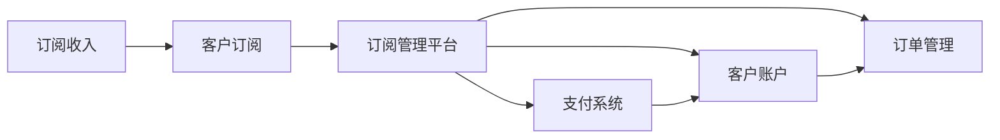

                 

# 订阅制创业：打造稳定现金流的商业模式

> 关键词：订阅制, 商业模型, 现金流, 稳定收入, 客户订阅, 客户忠诚度, 自动化, 数据驱动, 订阅管理平台

## 1. 背景介绍

在互联网和数字化浪潮的推动下，越来越多的公司开始探索基于订阅的商业模式，以期实现稳定和可持续的收入来源。无论是SaaS（Software as a Service）公司，还是新兴的订阅服务，这些模式都在改变传统的一次性交易或广告收入的旧格局。然而，成功实现订阅制的关键不仅在于产品本身，更在于如何构建一套有效的商业模型，以确保订阅收入的持续和高效。本文将详细探讨订阅制商业模型，如何打造稳定的现金流，并揭示未来发展的趋势与面临的挑战。

## 2. 核心概念与联系

### 2.1 核心概念概述

订阅制（Subscription-Based Model）是一种基于持续服务的商业模式，公司向客户收取定期的费用，以换取产品或服务的长期使用权。这种模式通常适用于软件即服务、流媒体服务、云计算服务等场景。

核心概念包括：
- **订阅收入**：公司通过收取订阅费获取的收入。
- **客户生命周期价值（Customer Lifetime Value, CLV）**：一个客户在其整个使用期间为公司带来的总收入。
- **客户流失率（Churn Rate）**：在特定时间段内取消订阅的客户比例。
- **客户获取成本（Customer Acquisition Cost, CAC）**：获取一个新客户所需的总成本。
- **订阅管理平台（Subscription Management Platform, SMP）**：一种软件工具，用于管理订阅服务的客户、订单、支付等核心流程。

### 2.2 核心概念原理和架构的 Mermaid 流程图



这个图展示了订阅制商业模型的核心流程：客户通过订阅服务，订阅收入流入公司。订阅管理平台负责处理订单、客户信息、支付等环节。支付系统与订阅管理平台连接，处理交易细节。最终，这些信息整合进客户账户，形成完整的数据链。

## 3. 核心算法原理 & 具体操作步骤

### 3.1 算法原理概述

订阅制的核心在于如何最大化客户生命周期价值（CLV），同时控制客户流失率（Churn Rate）。以下算法原理概述了如何通过数据分析和机器学习技术来优化这一过程。

#### 3.1.1 客户细分与个性化推荐

通过对客户的消费行为、偏好、地理位置等数据的分析，将客户分成不同细分市场。利用推荐系统，向不同细分市场的客户推送个性化的产品或服务。

#### 3.1.2 客户流失预测与干预

使用机器学习模型，如逻辑回归、随机森林等，预测哪些客户可能流失。通过分析流失客户的特征，提前介入，提高客户保留率。

#### 3.1.3 动态定价策略

根据市场需求、季节性变化等因素，动态调整订阅价格，以最大化收入。例如，根据客户的使用频率和忠诚度调整价格，提供不同的定价层次。

### 3.2 算法步骤详解

#### 3.2.1 客户细分与个性化推荐

1. **数据收集**：收集客户的基本信息、历史消费记录、行为数据等。
2. **特征工程**：选择和构造对客户行为有预测力的特征。
3. **模型训练**：使用聚类算法（如K-Means）或分类算法（如决策树、神经网络）对客户进行细分。
4. **个性化推荐**：根据客户细分结果，定制化推送产品或服务，提高客户满意度。

#### 3.2.2 客户流失预测与干预

1. **数据收集**：收集客户基本信息、历史行为、订阅时间等。
2. **特征工程**：构造对客户流失有预测力的特征。
3. **模型训练**：使用监督学习算法（如逻辑回归、随机森林）训练流失预测模型。
4. **预测与干预**：实时预测客户流失风险，根据风险等级采取不同的干预措施。

#### 3.2.3 动态定价策略

1. **数据收集**：收集市场需求、季节性变化、客户使用频率等数据。
2. **特征工程**：构造对客户需求有预测力的特征。
3. **模型训练**：使用回归算法（如线性回归、支持向量机）训练价格预测模型。
4. **动态定价**：根据预测结果实时调整订阅价格，提高收入。

### 3.3 算法优缺点

#### 3.3.1 优点

1. **持续收入**：订阅制提供了稳定的收入流，降低了市场波动的影响。
2. **高客户忠诚度**：定期收费促使客户持续使用产品，提高了客户忠诚度。
3. **客户终身价值**：通过客户细分与个性化推荐，最大化每个客户的生命周期价值。
4. **动态定价**：根据市场需求和客户行为调整价格，优化收入。

#### 3.3.2 缺点

1. **客户流失风险**：客户流失率高，可能导致收入骤降。
2. **初始成本高**：获取新客户的成本较高，需要大量市场推广投入。
3. **复杂性**：订阅流程复杂，需要一套完整的订阅管理平台支持。
4. **客户数据隐私**：需要严格保护客户数据，避免隐私泄露。

### 3.4 算法应用领域

订阅制商业模式广泛应用于SaaS、流媒体服务、在线教育、健康管理等领域。以下是几个典型案例：

1. **Salesforce**：作为领先的SaaS平台，Salesforce通过订阅模式实现了快速增长和收入的稳定增长。
2. **Netflix**：流媒体巨头Netflix通过订阅模式提供高质量内容，保持了庞大的用户基础和持续的收入增长。
3. **Duolingo**：在线语言学习平台Duolingo，通过订阅模式提供定制化的学习计划，吸引了大批用户并实现了良好的收入。

## 4. 数学模型和公式 & 详细讲解 & 举例说明

### 4.1 数学模型构建

订阅制的核心数学模型包括：
- **客户流失模型**：预测客户流失风险的概率模型。
- **客户生命周期价值模型**：评估客户终身收入的模型。
- **动态定价模型**：基于市场和客户行为预测价格模型的模型。

### 4.2 公式推导过程

#### 4.2.1 客户流失模型

客户流失概率可以通过二项分布来建模：

$$ P(\text{流失}) = \frac{1}{N} \sum_{i=1}^N p_i(1-p_i)^{n_i} $$

其中，$N$ 是客户总数，$p_i$ 是第 $i$ 个客户流失的概率，$n_i$ 是第 $i$ 个客户订阅的月数。

#### 4.2.2 客户生命周期价值模型

客户生命周期价值（CLV）可以通过以下公式计算：

$$ CLV = \frac{C}{r} \left( \frac{1 - (1 + r)^{-T}}{1 - (1 + r)^{-1}} \right) $$

其中，$C$ 是每次订阅的月度收入，$r$ 是订阅费用的月度利率，$T$ 是平均订阅时长。

#### 4.2.3 动态定价模型

动态定价模型可以使用回归分析：

$$ P = \beta_0 + \sum_{i=1}^n \beta_i X_i $$

其中，$P$ 是定价，$X_i$ 是影响定价的因素，如市场需求、季节性变化、客户使用频率等，$\beta_i$ 是回归系数。

### 4.3 案例分析与讲解

假设某流媒体平台有10万个用户，月平均订阅费用为$9.99，每次订阅的月度收入为$10，平均订阅时长为3年，年通胀率为2%。根据上述公式计算：

- **客户流失率**：假设流失率在5%左右，即每月有5000个用户流失。
- **客户生命周期价值**：$CLV = \frac{10}{0.02} \left( \frac{1 - (1 + 0.02)^{-36}}{1 - (1 + 0.02)^{-1}} \right) \approx 244.43$
- **动态定价**：假设市场需求高，定价可上调10%，即每月$10.99，每月增加的收入为$0.99，每年增加的收入为$11.88，通胀后的年利率为0.02，动态定价后的CLV为$270.52。

## 5. 项目实践：代码实例和详细解释说明

### 5.1 开发环境搭建

以下是在Python中使用PyTorch和Scikit-learn搭建订阅制商业模型的开发环境。

1. **安装PyTorch和Scikit-learn**：
```bash
pip install torch torchvision torchaudio scikit-learn pandas
```

2. **创建虚拟环境**：
```bash
conda create -n subscription python=3.8
conda activate subscription
```

3. **安装订阅管理平台**：
```bash
pip install subscription-management-platform
```

### 5.2 源代码详细实现

以下是一个简单的订阅管理平台，用于处理客户订阅、流失预测、动态定价等流程：

```python
import torch
from sklearn.model_selection import train_test_split
from sklearn.linear_model import LogisticRegression
from sklearn.metrics import accuracy_score, precision_recall_fscore_support

# 数据准备
X = # 客户特征数据
y = # 客户流失标签

# 模型训练
X_train, X_test, y_train, y_test = train_test_split(X, y, test_size=0.2)
model = LogisticRegression()
model.fit(X_train, y_train)

# 预测与评估
y_pred = model.predict(X_test)
accuracy = accuracy_score(y_test, y_pred)
precision, recall, f1_score, _ = precision_recall_fscore_support(y_test, y_pred, average='binary')

print(f"Accuracy: {accuracy}, Precision: {precision}, Recall: {recall}, F1 Score: {f1_score}")
```

### 5.3 代码解读与分析

该代码段演示了如何使用Logistic回归模型预测客户流失概率。首先，使用`train_test_split`将数据划分为训练集和测试集。然后，通过`LogisticRegression`模型训练客户流失预测器，并计算模型的准确率、精确度、召回率和F1分数。最后，输出模型的性能指标。

## 6. 实际应用场景

### 6.1 智能推荐系统

在流媒体平台如Netflix上，智能推荐系统通过分析用户的观看历史、评分等数据，预测用户可能感兴趣的影片，并将其推荐给用户。这不仅提高了用户满意度，还增加了订阅续费的概率。

### 6.2 健康管理平台

健康管理平台如Fitbit，通过订阅模式提供个性化的健康管理服务。平台使用机器学习模型预测用户流失风险，提前介入提供关怀，并根据用户数据调整推荐内容，提高用户粘性。

### 6.3 在线教育平台

在线教育平台如Khan Academy，通过订阅模式提供持续的教育内容。平台利用推荐系统为用户推荐适合的学习资源，并通过流失预测模型预测学生流失风险，及时提供帮助，提高学生留存率。

## 7. 工具和资源推荐

### 7.1 学习资源推荐

1. **《订阅制商业模型：理论和实践》**：深入解析订阅制商业模型的原理、应用和优化方法。
2. **《数据驱动的订阅制运营》**：讲解如何利用数据分析和机器学习提升订阅制运营效率。
3. **《订阅管理平台实战》**：提供订阅管理平台的开发实战案例和技巧。
4. **《流媒体推荐系统》**：详细讲解推荐系统在流媒体平台中的应用。
5. **《客户流失预测与干预》**：提供客户流失预测和干预的机器学习算法和案例分析。

### 7.2 开发工具推荐

1. **PyTorch**：开源深度学习框架，支持动态图和静态图模式，适合构建复杂的订阅管理平台。
2. **Scikit-learn**：强大的机器学习库，提供了多种算法和评估工具，适用于流失预测和推荐系统。
3. **TensorFlow**：由Google开发的深度学习框架，适用于大型的订阅管理平台和推荐系统。
4. **AWS SaaS Platform**：亚马逊提供的云平台服务，支持订阅制商业模型的部署和管理。
5. **Google Cloud Platform**：谷歌云平台，提供了丰富的订阅管理工具和云计算服务。

### 7.3 相关论文推荐

1. **《订阅制商业模型的理论和实践》**：探讨订阅制的原理、应用和优化方法。
2. **《流媒体推荐系统》**：研究推荐系统在流媒体平台中的应用。
3. **《客户流失预测与干预》**：分析客户流失的预测和干预方法。
4. **《订阅管理的自动化和数据驱动》**：讨论自动化和数据驱动在订阅管理中的应用。

## 8. 总结：未来发展趋势与挑战

### 8.1 研究成果总结

本文详细介绍了订阅制商业模型的原理和实践方法，并提供了多种算法和工具支持。订阅制已成为互联网和数字化时代的重要商业模式，广泛应用于SaaS、流媒体、在线教育等领域。通过客户细分与个性化推荐、客户流失预测与干预、动态定价等技术，可以最大化客户生命周期价值，实现稳定的收入流。

### 8.2 未来发展趋势

1. **AI和大数据驱动**：未来订阅制将更加依赖AI和大数据技术，通过深度学习和数据分析提升用户体验和运营效率。
2. **多渠道订阅**：通过不同渠道（如网站、APP、社交媒体）提供订阅服务，扩大客户群体。
3. **定制化服务**：提供更加个性化和定制化的服务，增强用户粘性。
4. **全球化扩展**：订阅制业务将在全球范围内扩展，适应不同市场和文化的特点。
5. **可持续性**：注重环保和可持续发展，采用绿色技术和可再生能源，提升企业形象。

### 8.3 面临的挑战

1. **数据隐私和安全**：保护用户数据隐私，防止数据泄露和滥用。
2. **竞争激烈**：面对众多竞争对手，需要不断创新和优化订阅制商业模式。
3. **技术复杂性**：订阅制系统需要高度集成的技术栈，实现高效的运营和管理。
4. **客户期望提升**：客户期望不断提高，需要提供更高质量的服务和产品。
5. **成本控制**：平衡高昂的运营成本和客户获取成本，实现盈利。

### 8.4 研究展望

未来，订阅制商业模型需要在数据隐私、技术创新、市场竞争等方面寻求突破。通过更高效的数据分析、更个性化的推荐、更智能的流失预测和干预、更灵活的定价策略，可以不断优化订阅制运营。同时，注重客户体验和品牌建设，提升客户忠诚度，是实现订阅制商业模型可持续发展的关键。

## 9. 附录：常见问题与解答

### Q1: 订阅制商业模式如何与一次性交易模型竞争？

**A**: 订阅制商业模式通过提供持续服务和个性化体验，吸引用户持续订阅，从而实现稳定的收入流。一次性交易模型依赖于单次购买，受市场波动影响较大。订阅制通过优质内容和客户服务，提升客户忠诚度，实现长期盈利。

### Q2: 订阅制商业模型是否适用于所有类型的服务？

**A**: 订阅制适用于需求稳定、用户粘性强的服务，如SaaS、流媒体、在线教育等。对于一次性交易服务或需求变化大的服务，订阅制可能不是最佳选择。

### Q3: 如何降低订阅制的客户流失率？

**A**: 可以通过以下措施降低客户流失率：
1. **个性化推荐**：根据用户行为和偏好，提供个性化服务。
2. **定期优惠**：提供定期折扣、续费优惠等激励措施。
3. **优质内容**：提供高质量、有价值的内容，满足用户需求。
4. **客户服务**：提供优质的客户支持，解决用户问题。

### Q4: 如何评估订阅制商业模型的成功？

**A**: 可以通过以下指标评估订阅制商业模型的成功：
1. **客户获取成本（CAC）**：获取新客户的成本。
2. **客户生命周期价值（CLV）**：一个客户在其整个使用期间为公司带来的总收入。
3. **订阅续费率**：续订率高的客户比例。
4. **客户流失率**：取消订阅的客户比例。
5. **用户满意度**：用户对服务和产品的满意度。

### Q5: 如何构建订阅管理平台？

**A**: 构建订阅管理平台需要以下步骤：
1. **需求分析**：确定平台需要支持的功能和特性。
2. **技术选型**：选择合适的技术栈和框架。
3. **系统设计**：设计平台的架构和数据模型。
4. **功能开发**：实现订阅管理、订单管理、支付管理等功能。
5. **测试与部署**：进行全面的测试，部署到生产环境。

通过本文的系统梳理，可以看到，订阅制商业模式以其稳定的收入流和持续的服务，正在改变传统的收入方式，并成为未来互联网和数字化时代的重要趋势。未来，订阅制将与AI和大数据技术深度融合，提供更加智能化、个性化的服务，实现可持续的发展。

