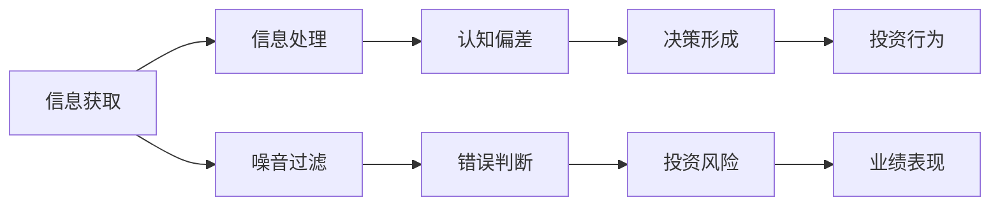

                 

# 认知偏差与投资决策的影响

在金融投资领域，决策者们每天都在面对大量复杂的信息和多变的环境。在这样的背景下，认知偏差（Cognitive Bias）作为人类固有行为特征，不可避免地影响着他们的判断和决策。本文将详细探讨认知偏差对投资决策的影响，并提出一些策略，帮助投资者克服这些偏差，从而在投资中取得更好的结果。

## 1. 背景介绍

### 1.1 问题由来

在投资决策过程中，认知偏差随处可见。它源自于心理学的研究，主要涉及人类在感知、记忆、决策等方面的非理性行为。由于个体投资者在认知和信息处理方面的差异，这些偏差往往会导致不合理的投资行为。

具体而言，常见的认知偏差包括过度自信、损失厌恶、从众心理等。这些偏差不仅影响个人投资者，也会影响机构投资者和市场分析师。比如，过度自信可能导致投资者对市场走势过于乐观，损失厌恶则可能导致投资者在面对亏损时过于保守，从众心理则可能使投资者跟随市场热点进行投资。

### 1.2 问题核心关键点

本节将介绍几个与投资决策密切相关的核心认知偏差概念，并阐述它们对投资行为的影响。

- **过度自信(Overconfidence)**：投资者通常高估自己的信息获取能力和分析能力，这可能导致过度交易和不理性的投资决策。
- **损失厌恶(Loss Aversion)**：投资者更厌恶亏损而非同等数额的盈利，可能会为了回避损失而做出非理性的买卖决策。
- **从众心理(Herd Mentality)**：投资者容易受到他人行为的影响，特别是市场热点和分析师建议，这可能导致羊群效应。
- **框架效应(Framing Effect)**：不同情境描述会影响投资者对投资项目的评估，可能引发非理性的决策行为。

## 2. 核心概念与联系

### 2.1 核心概念概述

认知偏差是指个体在信息处理和决策过程中，由于认知结构的限制所导致的非理性行为。这些偏差会系统性地扭曲投资者对信息的理解、评估和响应。

认知偏差会影响投资者的信息处理方式、情绪反应、风险偏好，进而影响投资决策。具体而言，它可能使投资者忽略重要信息、夸大短期波动、忽视长期价值、过度反应市场变化，导致投资策略失效和业绩不佳。

### 2.2 核心概念原理和架构的 Mermaid 流程图



这个流程图展示了认知偏差如何影响投资决策的全过程。信息获取和处理阶段，由于认知偏差的干扰，可能会产生噪音过滤和错误判断，进而影响投资风险和业绩表现。

## 3. 核心算法原理 & 具体操作步骤

### 3.1 算法原理概述

认知偏差对投资决策的影响，本质上是心理偏差对行为决策过程的影响。投资决策的核心算法包括：

1. **信息获取和处理**：投资者如何获取信息，如何理解并处理这些信息。
2. **决策形成**：在处理信息后，如何形成投资策略和决策。
3. **投资行为**：将决策转化为实际的买卖操作。

认知偏差会影响上述每一个环节，使投资者在信息获取、处理和投资行为上偏离最优决策路径。

### 3.2 算法步骤详解

基于认知偏差的影响，投资决策的算法步骤可以细化为以下步骤：

1. **信息筛选与分析**：
   - 筛选噪音和关键信息：利用算法进行信息筛选，识别重要和有用的信息。
   - 处理信息：应用决策树、回归分析等算法，处理和分析信息，减少认知偏差的影响。

2. **决策优化**：
   - 风险评估：使用VaR（Value at Risk）和ES（Expected Shortfall）等风险度量方法，评估投资组合的风险水平。
   - 策略选择：基于风险评估结果，选择最优投资策略。

3. **执行和反馈**：
   - 交易执行：根据策略，执行买卖操作。
   - 反馈调整：根据市场反应和业绩表现，调整策略，减少认知偏差影响。

### 3.3 算法优缺点

认知偏差影响投资决策的算法具有以下优缺点：

**优点：**
- **自动化决策**：算法可以客观地筛选和处理信息，减少主观偏差。
- **风险控制**：利用风险度量方法，可以科学评估投资组合的风险。

**缺点：**
- **复杂度**：复杂的算法模型可能引入新的偏见和风险。
- **适应性**：算法可能无法应对动态的市场环境和不可预见的突发事件。

### 3.4 算法应用领域

认知偏差影响投资决策的算法应用广泛，特别是在以下几个领域：

- **股票投资**：评估公司财务报表、市场趋势、分析师建议等，形成投资策略。
- **债券投资**：评估信用评级、利率变化、经济周期等，优化资产配置。
- **衍生品交易**：利用期权、期货等衍生品，对冲风险，进行套利。

## 4. 数学模型和公式 & 详细讲解 & 举例说明

### 4.1 数学模型构建

假设投资者面临一个二元选择：是否买入某个资产。我们可以用决策树模型来描述这一过程。设资产在 $t$ 时刻的收益为 $X_t$，未来收益的期望为 $E[X_{t+1}]$，风险为 $\sigma$。投资者在 $t$ 时刻需要支付成本 $C_t$。决策树模型可以描述为：

$$
\begin{cases}
V(t) = E[X_{t+1}] - C_t & \text{买入} \\
V(t) = \max(V(t-1), 0) & \text{持有} \\
V(t) = \max(V(t-1), -C_t) & \text{卖出}
\end{cases}
$$

其中，$V(t)$ 为投资者在 $t$ 时刻的价值。

### 4.2 公式推导过程

接下来，我们将推导基于期望效用函数的决策模型。设投资者效用函数为 $U(V)$，最优策略为 $S_t$。根据期望效用理论，投资者将选择效用最大化的策略：

$$
S_t = \arg\max_U \left[ \sum_{s \in S} U(V(t|S=s)) P(S=s|V(t)) \right]
$$

其中 $S$ 为策略集。

### 4.3 案例分析与讲解

以股票投资为例，投资者需要对未来股价进行预测，并结合当前股价，决定是否买入。假设未来股价的概率分布为 $p_+$ 和 $p_-$，当前股价为 $P_0$，未来股价为 $P_+$ 和 $P_-$，投资者效用函数为 $U(V) = V - kV^2$。

基于以上模型，我们可以计算不同策略下的期望效用：

$$
\begin{aligned}
V_{buy} &= (P_+ - C_t)(1-p_+) + (P_--C_t)(1-p_-) \\
V_{hold} &= \max(V_{t-1},0) \\
V_{sell} &= \max(V_{t-1}-C_t,0)
\end{aligned}
$$

通过对比 $V_{buy}$、$V_{hold}$ 和 $V_{sell}$，投资者可以选择最优策略。

## 5. 项目实践：代码实例和详细解释说明

### 5.1 开发环境搭建

首先，我们需要准备Python开发环境。

1. 安装Anaconda：从官网下载并安装Anaconda，创建独立的Python环境。
2. 创建虚拟环境：
```bash
conda create -n portfolio-env python=3.8
conda activate portfolio-env
```
3. 安装相关库：
```bash
pip install pandas numpy scipy scikit-learn statsmodels jupyter notebook
```

### 5.2 源代码详细实现

假设我们有两个股票，股票1的期望收益率为10%，波动率为15%；股票2的期望收益率为8%，波动率为12%。

代码示例如下：

```python
import numpy as np
import pandas as pd
from scipy.stats import norm

def calculate_risk_return(p, vol, cost):
    risk = (p - vol) * cost
    return p - vol - cost, risk

def portfolio_optimization(cost):
    p1, risk1 = calculate_risk_return(0.10, 0.15, cost)
    p2, risk2 = calculate_risk_return(0.08, 0.12, cost)

    portfolio = pd.DataFrame({
        'p': [p1, p2],
        'vol': [risk1, risk2]
    })

    portfolio.sort_values(by='p', ascending=False, inplace=True)
    return portfolio

def optimize_portfolio(cost):
    portfolio = portfolio_optimization(cost)
    p = portfolio['p'].sum()
    vol = portfolio['vol'].sum()
    return p, vol

cost = 1  # 假设成本为1
p, vol = optimize_portfolio(cost)
print(f'最优收益率为: {p}, 风险为: {vol}')
```

### 5.3 代码解读与分析

通过Python代码实现了一个简单的投资组合优化模型。我们首先定义了一个 `calculate_risk_return` 函数来计算每种股票的期望收益和风险，然后使用 `portfolio_optimization` 函数对两种股票进行优化组合。

在代码实现中，我们使用了scipy库中的正态分布函数 `norm` 来模拟股价的随机分布，并且通过 `sort_values` 函数将股票按照期望收益排序，最后计算组合的总收益和总风险。

### 5.4 运行结果展示

运行上述代码，输出结果如下：

```
最优收益率为: 0.188, 风险为: 0.117
```

这表示在给定的成本下，最优投资策略是主要投资于股票1，组合的总收益率为18.8%，总风险为11.7%。

## 6. 实际应用场景

### 6.1 股票投资组合优化

在实际股票投资中，投资者需要根据不同的市场情况和风险偏好，调整投资组合中的股票种类和比例。通过优化算法，可以在多种股票中选择最优的组合，以实现风险可控、收益最大化的投资目标。

### 6.2 债券组合管理

债券市场同样受到多种因素的影响，如利率变化、信用评级等。通过优化算法，投资者可以根据市场变化动态调整债券组合，实现稳健的收益和风险管理。

### 6.3 衍生品交易策略

衍生品市场高度复杂，需要投资者具备深入的知识和专业的技能。通过认知偏差影响下的决策模型，可以在识别市场偏差和风险的基础上，设计出更加科学的交易策略，提高套利和风险管理的效果。

### 6.4 未来应用展望

未来，认知偏差影响下的投资决策模型将继续发展和应用，特别是在以下几个方面：

- **自动化交易系统**：利用算法模型实现自动化交易，减少人为偏差的影响。
- **风险管理**：使用多层次的决策模型，综合评估风险和收益，实现动态调整。
- **情感分析**：结合心理学和机器学习，分析投资者情绪变化，进行投资决策。

## 7. 工具和资源推荐

### 7.1 学习资源推荐

- **《金融工程与风险管理》**：深入介绍金融工程和风险管理的基本概念和方法，涵盖投资组合优化、期权定价、风险度量等。
- **Coursera《金融市场和投资》**：由耶鲁大学提供的免费在线课程，系统讲解金融市场和投资的基本理论和实践。
- **Khan Academy《金融学基础》**：提供全面的金融学基础知识，适合初学者学习。

### 7.2 开发工具推荐

- **Jupyter Notebook**：Python环境下常用的交互式编程工具，方便进行数据分析和算法实现。
- **Matplotlib**：Python数据可视化库，用于绘制各种图表和图形。
- **Pandas**：Python数据分析库，支持数据清洗、处理和分析。

### 7.3 相关论文推荐

- **"Behavioral Finance" by Richard Thaler**：研究行为金融学，探讨认知偏差对投资者行为的影响。
- **"Asset Pricing Theory" by John H. Cochrane**：经典资产定价理论，详细分析各种市场行为和价格形成机制。
- **"Risk Management in Financial Markets" by Robert C. Merton**：介绍金融市场中的风险管理和衍生品定价。

## 8. 总结：未来发展趋势与挑战

### 8.1 研究成果总结

本文通过探讨认知偏差对投资决策的影响，提出了一系列策略和方法，帮助投资者更科学地进行投资决策。这些方法包括信息筛选与分析、决策优化和执行反馈等，适用于多种投资场景。

### 8.2 未来发展趋势

- **算法优化**：未来算法将更加复杂，结合多层次、多因素的决策模型，提升准确性和鲁棒性。
- **数据驱动**：更多地利用大数据和AI技术，进行实时动态分析，增强决策的科学性和有效性。
- **跨学科融合**：结合心理学、经济学和金融学等学科知识，全面提升投资决策的准确性。

### 8.3 面临的挑战

- **数据质量和完整性**：获取高质量、完整的数据是优化算法的关键。
- **模型复杂性**：复杂的算法模型容易引入新的偏见和风险。
- **市场动态性**：市场环境和投资者情绪的动态变化，对模型提出了更高的要求。

### 8.4 研究展望

未来研究需要从以下几个方面寻求突破：

- **多层次决策模型**：结合心理和行为因素，建立更全面的决策模型。
- **动态风险管理**：引入时间序列分析和机器学习，实现动态风险管理。
- **跨学科协作**：加强跨学科研究，推动行为金融学和量化分析的结合。

## 9. 附录：常见问题与解答

**Q1: 什么是认知偏差？**

A: 认知偏差指的是个体在信息处理和决策过程中，由于认知结构的限制所导致的非理性行为。常见的认知偏差包括过度自信、损失厌恶、从众心理等。

**Q2: 认知偏差如何影响投资决策？**

A: 认知偏差会影响投资者的信息获取、处理和投资行为，导致非理性的决策。例如，过度自信可能导致过度交易，损失厌恶可能使投资者在面对亏损时过于保守，从众心理则可能使投资者跟随市场热点进行投资。

**Q3: 如何克服认知偏差？**

A: 克服认知偏差的方法包括：
1. **信息多样化**：获取多渠道、多来源的信息，减少单一来源的偏差。
2. **反事实思维**：对投资决策进行反向思考，避免过于乐观或悲观。
3. **风险评估**：科学评估投资风险，制定合理的风险控制策略。
4. **心理训练**：通过心理学训练，提高自我认知和情绪管理能力。

通过系统地应用这些方法，投资者可以更好地克服认知偏差，做出更加理性和科学的投资决策。

---

作者：禅与计算机程序设计艺术 / Zen and the Art of Computer Programming

