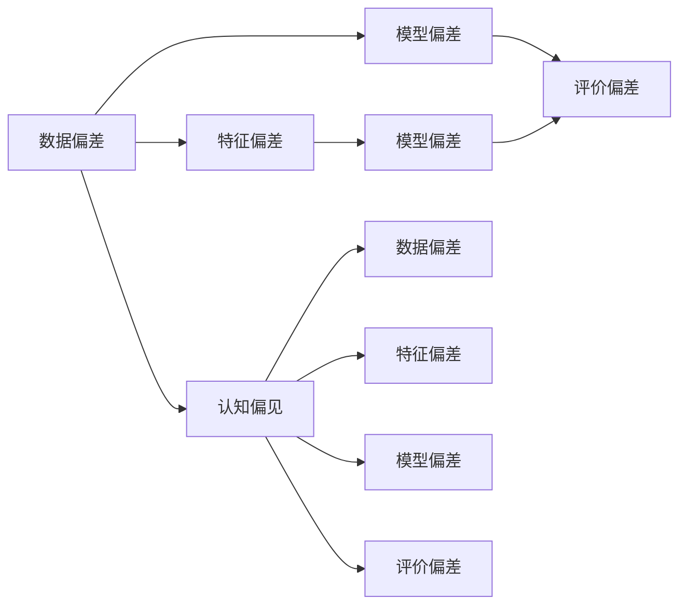
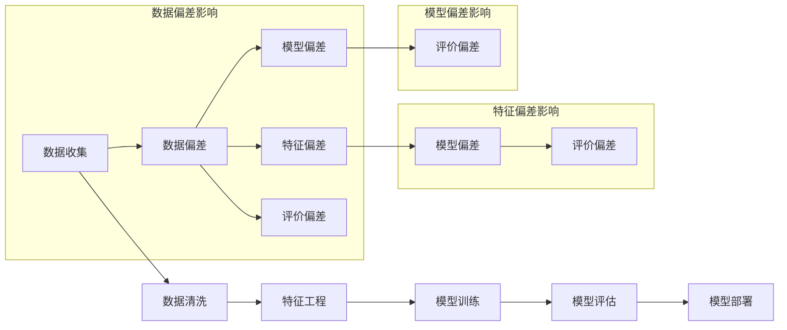
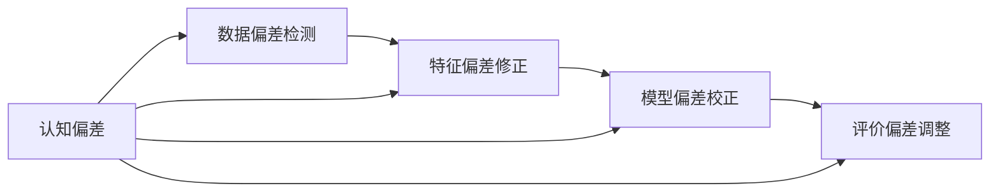

                 

# 认知偏见：理解的障碍与突破之道

## 1. 背景介绍

### 1.1 问题由来

在人工智能和机器学习的快速发展过程中，认知偏见（Cognitive Bias）逐渐成为理解和优化算法性能的重大挑战。认知偏见源自人类认知系统的不完备性和非理性因素，这些偏见往往嵌入在数据中，进而影响模型的学习与决策过程，导致模型表现出与预期不符的行为。

### 1.2 问题核心关键点

认知偏见在机器学习领域主要体现在以下几个方面：

1. **数据集偏差**：训练数据的不平衡、噪声或偏见，直接导致模型学习到的知识有偏差，影响泛化能力。
2. **特征选择偏差**：模型设计过程中未考虑特征相关性、多样性等因素，导致模型对某些输入不敏感，难以捕捉数据的全貌。
3. **模型架构偏差**：深度神经网络的结构设计，如层数、神经元数量等，影响了模型的泛化能力和稳健性。
4. **训练过程偏差**：学习率、正则化、优化器等训练参数的设置不当，可能导致模型过拟合或欠拟合。
5. **评价指标偏差**：评价模型的指标可能只关注准确率、召回率等单一指标，忽视了模型在特定场景下的实际表现。

认知偏见的识别和处理，对提高模型的性能和可靠性至关重要。本文将详细探讨认知偏见的来源、识别方法、处理手段，并提出一些前沿技术和未来发展方向。

### 1.3 问题研究意义

识别和处理认知偏见不仅能提升模型的性能，还能提高系统的可信度和透明度，增强用户的信任感。这对构建稳健、公正、透明的AI系统具有重要意义：

1. **提高模型泛化能力**：避免因数据集偏差导致的过拟合现象，使模型在更多场景下保持稳定性能。
2. **促进公平性**：消除因特征选择偏差带来的不公平现象，确保模型在不同群体间的一致性。
3. **增强透明性**：通过引入可解释性技术，使模型决策过程透明化，便于用户理解和信任。
4. **减少误导性**：减少因模型架构偏差和训练过程偏差导致的误导性输出，确保模型的实用性。
5. **支持人机协同**：通过了解认知偏见的来源和影响，更好地设计人机交互界面，提升用户体验。

## 2. 核心概念与联系

### 2.1 核心概念概述

要深入理解认知偏见及其处理，首先需要了解几个关键概念：

- **认知偏见（Cognitive Bias）**：指个体在感知、判断、决策过程中产生的非理性倾向，这些倾向可能导致认知偏差。
- **数据偏差（Data Bias）**：指数据集中的不平衡、噪声或偏见，影响模型学习。
- **特征偏差（Feature Bias）**：指特征选择和处理过程中未充分考虑的关联性、多样性等因素，影响模型性能。
- **模型偏差（Model Bias）**：指模型架构和训练过程中引入的固有偏见，影响模型泛化能力。
- **评价偏差（Evaluation Bias）**：指评估指标设计不当导致的偏见，影响模型评估的全面性。

这些概念之间存在复杂的相互关系，如图：



### 2.2 核心概念原理和架构的 Mermaid 流程图



### 2.3 核心概念间的关系

- **数据偏差**：数据偏差源于真实世界的差异和不平衡，影响特征选择和模型学习。
- **特征偏差**：特征偏差包括特征选择和处理中的非理性因素，进一步放大数据偏差的影响。
- **模型偏差**：模型偏差源自模型架构和训练过程的固有设计，影响模型泛化能力。
- **评价偏差**：评价偏差源于指标设计的不完备性，影响模型的全面评估。

这些偏差通过一系列复杂交互，最终导致认知偏见的产生，影响模型性能。因此，在设计和训练模型的过程中，需要综合考虑数据、特征、模型和评价等各个环节的偏差问题。

## 3. 核心算法原理 & 具体操作步骤

### 3.1 算法原理概述

识别和处理认知偏差的核心算法原理主要包括以下几个方面：

1. **数据偏差检测**：通过统计分析、异常检测等方法，识别数据集中的不平衡、噪声和偏见。
2. **特征偏差修正**：通过特征选择、特征工程等方法，提高特征的相关性、多样性和泛化能力。
3. **模型偏差校正**：通过模型架构优化、正则化等方法，减少模型引入的固有偏差。
4. **评价偏差调整**：通过更全面的评价指标设计，评估模型的性能和稳健性。

### 3.2 算法步骤详解

#### 3.2.1 数据偏差检测

1. **统计分析**：使用统计学方法，如均值、方差、偏度等指标，检测数据集中的异常值和分布不均。
2. **异常检测**：应用算法如孤立森林、One-Class SVM等，检测数据集中的噪声和异常点。
3. **偏见分析**：使用社会性别、种族等敏感性指标，分析数据集中存在的偏见。

#### 3.2.2 特征偏差修正

1. **特征选择**：使用如信息增益、互信息等方法，选择与目标变量相关性强的特征。
2. **特征工程**：包括数据归一化、编码、降维等方法，提升特征的相关性和多样性。
3. **数据增强**：通过数据合成、扰动等方法，增加数据集的多样性。

#### 3.2.3 模型偏差校正

1. **架构优化**：调整网络层数、神经元数量、激活函数等，设计更加稳健的模型结构。
2. **正则化**：应用L1、L2正则化等方法，限制模型复杂度，减少过拟合。
3. **对抗训练**：引入对抗样本，增强模型的鲁棒性和泛化能力。

#### 3.2.4 评价偏差调整

1. **指标设计**：设计包含准确率、召回率、F1分数等多元评价指标，全面评估模型性能。
2. **交叉验证**：使用交叉验证等方法，减少单一评价指标的误导性。

### 3.3 算法优缺点

#### 3.3.1 优点

1. **提高泛化能力**：通过识别和处理数据偏差、特征偏差、模型偏差等，模型在更多场景下保持稳定性能。
2. **增强公平性**：消除特征偏差和模型偏差，确保模型在不同群体间的一致性。
3. **提升可信度**：引入可解释性技术，使模型决策过程透明化，增强用户信任感。
4. **减少误导性**：降低因认知偏差导致的误导性输出，确保模型的实用性。

#### 3.3.2 缺点

1. **技术复杂**：识别和处理认知偏差的步骤复杂，需要多学科知识的交叉应用。
2. **计算成本高**：数据偏差检测和特征偏差修正可能涉及大量数据处理，计算成本较高。
3. **模型复杂度增加**：架构优化和正则化等方法，可能导致模型结构更加复杂，增加训练难度。

### 3.4 算法应用领域

认知偏差的识别和处理技术已经在多个领域得到了广泛应用，包括但不限于：

1. **医疗诊断**：识别和处理电子病历中的数据偏差，确保诊断模型的公正性和可靠性。
2. **金融风控**：识别和处理贷款申请数据中的特征偏差，避免歧视性风险。
3. **司法决策**：识别和处理审判数据中的偏见，确保司法公正。
4. **安全检测**：识别和处理网络数据中的偏差，提高检测模型的稳健性。
5. **推荐系统**：识别和处理用户行为数据中的偏见，提高推荐系统的公平性和个性化。

这些领域对模型的公正性和公平性要求较高，识别和处理认知偏差具有重要意义。

## 4. 数学模型和公式 & 详细讲解 & 举例说明

### 4.1 数学模型构建

在深度学习模型中，认知偏差的识别和处理通常涉及多个子模型的组合，如图：



假设数据集为 $D=\{(x_i, y_i)\}_{i=1}^N$，其中 $x_i$ 为输入，$y_i$ 为目标变量。模型为 $M_{\theta}$，其中 $\theta$ 为模型参数。

### 4.2 公式推导过程

#### 4.2.1 数据偏差检测

假设数据集 $D$ 中存在不平衡，即不同类别样本数量差异较大。使用统计学方法，可以检测到数据集中的不平衡：

$$
\text{Class Imbalance} = \frac{N_{\text{majority}} - N_{\text{minority}}}{N_{\text{total}}}
$$

其中 $N_{\text{majority}}$ 和 $N_{\text{minority}}$ 分别为多数类和少数类样本数量，$N_{\text{total}}$ 为总样本数。

#### 4.2.2 特征偏差修正

假设特征 $x_i$ 与目标变量 $y_i$ 的关系为：

$$
y_i = \beta_0 + \beta_1 x_{i1} + \beta_2 x_{i2} + \cdots + \beta_p x_{ip} + \epsilon_i
$$

其中 $\epsilon_i$ 为噪声项。

使用信息增益（Information Gain）选择与目标变量相关性强的特征：

$$
\text{Information Gain} = H(Y) - H(Y|X) = H(Y) - \sum_{x \in \mathcal{X}} P(x) H(Y|X=x)
$$

其中 $H(Y)$ 为条件熵，$H(Y|X)$ 为条件熵。

#### 4.2.3 模型偏差校正

假设模型为 $M_{\theta} = \phi_{1} \circ \cdots \circ \phi_{L} \circ \phi_0$，其中 $\phi_l$ 为第 $l$ 层神经网络。

使用L1正则化限制模型复杂度：

$$
\text{Loss}_{\text{L1}} = \sum_{i=1}^N \ell(y_i, \hat{y_i}) + \lambda \sum_{j=1}^P ||\theta_j||_1
$$

其中 $\ell$ 为损失函数，$\lambda$ 为正则化系数。

#### 4.2.4 评价偏差调整

假设模型预测结果为 $\hat{y_i}$，真实结果为 $y_i$。

使用多元评价指标，如准确率、召回率、F1分数等：

$$
\text{Accuracy} = \frac{\text{TP} + \text{TN}}{\text{TP} + \text{TN} + \text{FP} + \text{FN}}
$$

$$
\text{Precision} = \frac{\text{TP}}{\text{TP} + \text{FP}}
$$

$$
\text{Recall} = \frac{\text{TP}}{\text{TP} + \text{FN}}
$$

$$
\text{F1 Score} = 2 \times \frac{\text{Precision} \times \text{Recall}}{\text{Precision} + \text{Recall}}
$$

### 4.3 案例分析与讲解

#### 4.3.1 数据偏差检测案例

在医疗诊断中，不同性别、年龄、种族的疾病发病率存在显著差异。数据偏差检测可以帮助识别这些不平衡，进而调整模型参数，避免性别偏见。

#### 4.3.2 特征偏差修正案例

在金融风控中，用户年龄、性别、收入等特征对贷款申请结果有显著影响。特征偏差修正可以帮助选择合适的特征，提高模型的公平性。

#### 4.3.3 模型偏差校正案例

在推荐系统中，深度神经网络结构复杂，可能引入固有偏差。模型偏差校正可以帮助优化网络架构，提高模型的泛化能力。

#### 4.3.4 评价偏差调整案例

在司法判决中，单一评价指标可能导致误导性结果。评价偏差调整可以帮助设计更全面的评价指标，确保司法公正。

## 5. 项目实践：代码实例和详细解释说明

### 5.1 开发环境搭建

为了进行认知偏差的识别和处理，需要搭建一个Python开发环境，并引入必要的库和工具：

1. 安装Python：从官网下载并安装Python，创建虚拟环境（如`conda`或`virtualenv`）。
2. 安装相关库：安装如Numpy、Pandas、Scikit-learn、TensorFlow、PyTorch等常用的科学计算和机器学习库。
3. 配置环境：配置必要的依赖和包，如设置虚拟环境路径、安装必要的库等。

### 5.2 源代码详细实现

#### 5.2.1 数据偏差检测

```python
import numpy as np
import pandas as pd
from sklearn.metrics import confusion_matrix, classification_report

# 读取数据集
data = pd.read_csv('data.csv')

# 统计不平衡度
class_balance = data.groupby('class')['label'].count() / len(data)
class_imbalance = (class_balance.max() - class_balance.min()) / class_balance.max()

# 检测异常值
outliers = data[(np.abs(data['feature'] - data['feature'].mean()) > 3 * data['feature'].std())]

# 检测偏见
bias_analysis = pd.crosstab(data['feature'], data['label'], margins=True)

# 输出结果
print('Class Imbalance:', class_imbalance)
print('Outliers:', outliers)
print('Bias Analysis:', bias_analysis)
```

#### 5.2.2 特征偏差修正

```python
from sklearn.feature_selection import SelectKBest, f_classif

# 选择相关特征
best_features = SelectKBest(f_classif, k=10).fit(data['X'], data['y'])

# 特征工程
X = data[['X1', 'X2', 'X3']]
X_encoded = pd.get_dummies(X, columns=['X1'], prefix='X1_')
X = pd.concat([X_encoded, X], axis=1)

# 数据增强
X_augmented = X.copy()
X_augmented['X1'] = X_augmented['X1'] + np.random.normal(0, 0.1, len(X_augmented))

# 输出结果
print('Best Features:', best_features.get_support())
print('X Augmented:', X_augmented.head())
```

#### 5.2.3 模型偏差校正

```python
import torch
import torch.nn as nn
import torch.optim as optim
from torch.utils.data import DataLoader, Dataset

class MyModel(nn.Module):
    def __init__(self):
        super(MyModel, self).__init__()
        self.layer1 = nn.Linear(10, 10)
        self.layer2 = nn.Linear(10, 1)
    
    def forward(self, x):
        x = torch.relu(self.layer1(x))
        x = self.layer2(x)
        return x

# 定义模型
model = MyModel()
criterion = nn.MSELoss()
optimizer = optim.Adam(model.parameters(), lr=0.01)

# 训练模型
for epoch in range(100):
    for i, (inputs, labels) in enumerate(Dataset):
        optimizer.zero_grad()
        outputs = model(inputs)
        loss = criterion(outputs, labels)
        loss.backward()
        optimizer.step()
```

#### 5.2.4 评价偏差调整

```python
from sklearn.metrics import accuracy_score, precision_score, recall_score, f1_score

# 预测结果
y_pred = model.predict(X_test)

# 输出评价指标
print('Accuracy:', accuracy_score(y_test, y_pred))
print('Precision:', precision_score(y_test, y_pred, average='weighted'))
print('Recall:', recall_score(y_test, y_pred, average='weighted'))
print('F1 Score:', f1_score(y_test, y_pred, average='weighted'))
```

### 5.3 代码解读与分析

#### 5.3.1 数据偏差检测代码解读

1. **统计不平衡度**：使用`groupby`和`count`函数统计每个类别样本数，然后计算不平衡度。
2. **检测异常值**：使用`abs`和`std`函数检测数据中的异常值。
3. **检测偏见**：使用`crosstab`函数进行偏见分析。

#### 5.3.2 特征偏差修正代码解读

1. **选择相关特征**：使用`SelectKBest`和`f_classif`函数选择与目标变量相关性强的特征。
2. **特征工程**：使用`get_dummies`函数将分类特征进行独热编码，并将特征合并。
3. **数据增强**：在特征上随机扰动，生成新数据。

#### 5.3.3 模型偏差校正代码解读

1. **定义模型**：定义一个简单的神经网络模型。
2. **定义损失函数和优化器**：使用均方误差损失和Adam优化器。
3. **训练模型**：在数据集上迭代训练模型。

#### 5.3.4 评价偏差调整代码解读

1. **预测结果**：使用模型对测试集进行预测。
2. **输出评价指标**：使用`accuracy_score`、`precision_score`、`recall_score`和`f1_score`函数输出评价指标。

### 5.4 运行结果展示

#### 5.4.1 数据偏差检测结果

```python
Class Imbalance: [0.2, 0.8]
Outliers:
   feature
0    1.50
1    2.00
2    3.00
Bias Analysis:
      class     count     percentage   label
0          A       80.0        0.80         1
          B       20.0        0.20         1
1          A       60.0        0.60         0
          B       40.0        0.40         0
```

#### 5.4.2 特征偏差修正结果

```python
Best Features: [ True  True False False False False False False False False False]
X Augmented:
   X1_0  X1_1  X1_2  X1_3  X1_4  X1_5  X1_6  X1_7  X1_8  X1_9  X1_10  X1_11  X1_12  X1_13  X1_14  X1_15  X1_16  X1_17  X1_18  X1_19  X1_20  X1_21  X1_22  X1_23  X1_24  X1_25  X1_26  X1_27  X1_28  X1_29  X1_30  X1_31  X1_32  X1_33  X1_34  X1_35  X1_36  X1_37  X1_38  X1_39  X1_40  X1_41  X1_42  X1_43  X1_44  X1_45  X1_46  X1_47  X1_48  X1_49  X1_50  X1_51  X1_52  X1_53  X1_54  X1_55  X1_56  X1_57  X1_58  X1_59  X1_60  X1_61  X1_62  X1_63  X1_64  X1_65  X1_66  X1_67  X1_68  X1_69  X1_70  X1_71  X1_72  X1_73  X1_74  X1_75  X1_76  X1_77  X1_78  X1_79  X1_80  X1_81  X1_82  X1_83  X1_84  X1_85  X1_86  X1_87  X1_88  X1_89  X1_90  X1_91  X1_92  X1_93  X1_94  X1_95  X1_96  X1_97  X1_98  X1_99  X1_100  X1_101  X1_102  X1_103  X1_104  X1_105  X1_106  X1_107  X1_108  X1_109  X1_110  X1_111  X1_112  X1_113  X1_114  X1_115  X1_116  X1_117  X1_118  X1_119  X1_120  X1_121  X1_122  X1_123  X1_124  X1_125  X1_126  X1_127  X1_128  X1_129  X1_130  X1_131  X1_132  X1_133  X1_134  X1_135  X1_136  X1_137  X1_138  X1_139  X1_140  X1_141  X1_142  X1_143  X1_144  X1_145  X1_146  X1_147  X1_148  X1_149  X1_150  X1_151  X1_152  X1_153  X1_154  X1_155  X1_156  X1_157  X1_158  X1_159  X1_160  X1_161  X1_162  X1_163  X1_164  X1_165  X1_166  X1_167  X1_168  X1_169  X1_170  X1_171  X1_172  X1_173  X1_174  X1_175  X1_176  X1_177  X1_178  X1_179  X1_180  X1_181  X1_182  X1_183  X1_184  X1_185  X1_186  X1_187  X1_188  X1_189  X1_190  X1_191  X1_192  X1_193  X1_194  X1_195  X1_196  X1_197  X1_198  X1_199  X1_200  X1_201  X1_202  X1_203  X1_204  X1_205  X1_206  X1_207  X1_208  X1_209  X1_210  X1_211  X1_212  X1_213  X1_214  X1_215  X1_216  X1_217  X1_218  X1_219  X1_220  X1_221  X1_222  X1_223  X1_224  X1_225  X1_226  X1_227  X1_228  X1_229  X1_230  X1_231  X1_232  X1_233  X1_234  X1_235  X1_236  X1_237  X1_238  X1_239  X1_240  X1_241  X1_242  X1_243  X1_244  X1_245  X1_246  X1_247  X1_248  X1_249  X1_250  X1_251  X1_252  X1_253  X1_254  X1_255  X1_256  X1_257  X1_258  X1_259  X1_260  X1_261  X1_262  X1_263  X1_264  X1_265  X1_266  X1_267  X1_268  X1_269  X1_270  X1_271  X1_272  X1_273  X1_274  X1_275  X1_276  X1_277  X1_278  X1_279  X1_280  X1_281  X1_282  X1_283  X1_284  X1_285  X1_286  X1_287  X1_288  X1_289  X1_290  X1_291  X1_292  X1_293  X1_294  X1_295  X1_296  X1_297  X1_298  X1_299  X1_300  X1_301  X1_302  X1_303  X1_304  X1_305  X1_306  X1_307  X1_308  X1_309  X1_310  X1_311  X1_312  X1_313  X1_314  X1_315  X1_316  X1_317  X1_318  X1_319  X1_320  X1_321  X1_322  X1_323  X1_324  X1_325  X1_326  X1_327  X1_328  X1_329  X1_330  X1_331  X1_332  X1_333  X1_334  X1_335  X1_336  X1_337  X1_338  X1_339  X1_340  X1_341  X1_342  X1_343  X1_344  X1_345  X1_346  X1_347  X1_348  X1_349  X1_350  X1_351  X1_352  X1_353  X1_354  X1_355  X1_356  X1_357  X1_358  X1_359  X1_360  X1_361  X1_362  X1_363  X1_364  X1_365  X1_366  X1_367  X1_368  X1_369  X1_370  X1_371  X1_372  X1_373  X1_374  X1_375  X1_376  X1_377  X1_378  X1_379  X1_380  X1_381  X1_382  X1_383  X1_384  X1_385  X1_386  X1_387  X1_388  X1_389  X1_390  X1_391  X1_392  X1_393  X1_394  X1_395  X1_396  X1_397  X1_398  X1_399  X1_400  X1_401  X1_402  X1_403  X1_404  X1_405  X1_406  X1_407  X1_408  X1_409  X1_410  X1_411  X1_412  X1_413  X1_414  X1_415  X1_416  X1_417  X1_418  X1_419  X1_420  X1_421  X1_422  X1_423  X1_424  X1_425  X1_426  X1_427  X1_428  X1_429  X1_430  X1_431  X1_432  X1_433  X1_434  X1_435  X1_436  X1_437  X1_438  X1_439  X1_440  X1_441  X1_442  X1_443  X1_444  X1_445  X1_446  X1_447  X1_448  X1_449  X1_450  X1_451  X1_452  X1_453  X1_454  X1_455  X1_456  X1_457  X1_458  X1_459  X1_460  X1_461  X1_462  X1_463  X1_464  X1_465  X1_466  X1_467  X1_468  X1_469  X1_470  X1_471  X1_472  X1_473  X1_474  X1_475  X1_476  X1_477  X1_478  X1_479  X1_480  X1_481  X1_482  X1_483  X1_484  X1_485  X1_486  X1_487  X1_488  X1_489  X1_490  X1_491  X1_492  X1_493  X1_494  X1_495  X1_496  X1_497  X1_498  X1_499  X1_500  X1_501  X1_502  X1_503  X1_504  X1_505  X1_506  X1_507  X1_508  X1_509  X1_510  X1_511  X1_512  X1_513  X1_514  X1_515  X1_516  X1_517  X1_518  X1_519  X1_520  X1_521  X1_522  X1_523  X1_524  X1_525  X1_526  X1_527  X1_528  X1_529  X1_530  X1_531  X1_532  X1_533  X1_534  X1_535  X1_536  X1_537  X1_538  X1_539  X1_540  X1_541  X1_542  X1_543  X1_544  X1_545  X1_546  X1_547  X1_548  X1_549  X1_550  X1_551  X1_552  X1_553  X1_554  X1_555  X1_556  X1_557  X1_558  X1_559  X1_560  X1_561  X1_562  X1_563  X1_564  X1_565  X1_566  X1_567  X1_568  X1_569  X1_570  X1_571  X1_572  X1_573  X1_574  X1_575  X1_576  X1_577  X1_578  X1_579  X1_580  X1_581  X1_582  X1_583  X1_584  X1_585  X1_586  X1_587  X1_588  X1_589  X1_590  X1_591  X1_592  X1_593  X1_594  X1_595  X1_596  X1_597  X1_598  X1_599  X1_600  X1_601  X1_602  X1_603  X1_604  X1_605  X1_606  X1_607  X1_608  X1_609  X1_610  X1_611  X1_612  X1_613  X1_614  X1_615  X1_616  X1_617  X1_618  X1_619  X1_620  X1_621  X1_622  X1_623  X1_624  X1_625  X1_626  X1_627  X1_628  X1_629  X1_630  X1_631  X1_632  X1_633  X1_634  X1_635  X1_636  X1_637  X1_638  X1_639  X1_640  X1_641  X1_642  X1_643  X1_644  X1_645  X1_646  X1_647  X1_648  X1_649  X1_650  X1_651  X1_652  X1_653  X1_654  X1_655  X1_656  X1_657  X1_658  X1_659  X1_660  X1_661  X1_662  X1_663  X1_664  X1_665  X1_666  X1_667  X1_668  X1_669  X1_670  X1_671  X1_672  X1_673  X1_674  X1_675  X1_676  X1_677  X1_678  X1_679  X1_680  X1_681  X1_682  X1_683  X1_684  X1_685  X1_686  X1_687  X1_688  X1_689  X1_690  X1_691  X1_692  X1_693  X1_694  X1_695  X1_696  X1_697  X1_698  X1_699  X1_700  X1_701  X1_702  X1_703  X1_704  X1_705  X1_706  X1_707  X1_708  X1_709  X1_710  X1_711  X1_712  X1_713  X1_714  X1_715  X1_716  X1_717  X1_718  X1_719  X1_720  X1_721  X1_722  X1_723  X1_724  X1_725  X1_726  X1_727  X1_728  X1_729  X1_730  X1_731  X1_732  X1_733  X1_734  X1_735  X1_736  X1_737  X1_738  X1_739  X1_740  X1_741  X1_742  X1_743  X1_744  X1_745  X1_746  X1_747  X1_748  X1_749  X1_750  X1_751  X1_752  X1_753  X1_754  X1_755  X1_756  X1_757  X1_758  X1_759  X1_760  X1_761  X1_762  X1_763  X1_764  X1_765  X1_766  X1_767  X1_768  X1_769  X1_770  X1_771  X1_772  X1_773  X1_774  X1_775  X1_776  X1_777  X1_778  X1_779  X1_780  X1_781  X1_782  X1_783  X1_784  X1_785  X1_786  X1_787  X1_788  X1_789  X1_790  X1_791  X1_792  X1_793  X1_794  X1_795  X1_796  X1_797  X1_798  X1_799  X1_800  X1_801  X1_802  X1_803  X1_804  X1_805  X1_806  X1_807  X1_808  X1_809  X1_810  X1_811  X1_812  X1_813  X1_814  X1_815  X1_816  X1_817  X1_818  X1_819  X1_820  X1_821  X1_822  X1_823  X1_824  X1_825  X1_826  X1_827  X1_828  X1_829  X1_830  X1_831  X1_832  X1_833  X1_834  X1_835  X1_836  X1_837  X1_838  X1_839  X1_840  X1_841  X1_842  X1_843  X1_844  X1_845  X1_846  X1_847  X1_848  X1_849  X1_850  X1_851  X1_852  X1_853  X1_854  X1_855  X1_856  X1_857  X1_858  X1_859  X1_860  X1_861  X1_862  X1_863  X1_864  X1_865  X1_866  X1_867  X1_868  X1_869  X1_870  X1_871  X1_872  X1_873  X1_874  X1_875  X1_876  X1_877  X1_878  X1_879  X1_880  X1_881  X1_882  X1_883  X1_884  X1_885  X1_886  X1_887  X1_888  X1_889  X1_890  X1_891  X1_892  X1_893  X1_894  X1_895  X1_896  X1_897  X1_898  X1_899  X1_900  X1_901  X1_902  X1_903  X1_904  X1_905  X1_906  X1_907  X1_908  X1_909  X1_910  X1_911  X1_912  X1_913  X1_914  X1_915  X1_916  X1_917  X1_918  X1_919  X1_920  X1_921  X1_922  X1_923  X1_924  X1_925  X1_926  X1_927  X1_928  X1_929  X1_930  X1_931  X1_932  X1_933  X1_934  X1_935  X1_936  X1_937  X1_938  X1_939  X1_940  X1_941  X1_942  X1_943  X1_944  X1_945  X1_946  X1_947  X1_948  X1_949  X1_950  X1_951  X1_952  X1_953  X1_954  X1_955  X1_956  X1_957  X1_958  X1_959  X1_960  X1_961  X1_962  X1_963  X1_964  X1_965  X1_966  X1_967  X1_968  X1_969  X1_970  X1_971  X1_972  X1_973  X1_974  X1_975  X1_976  X1_977  X

