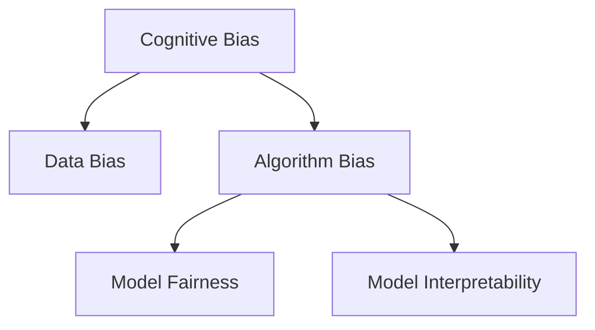

                 

# 认知偏见：理解的障碍与突破之道

> 关键词：认知偏见, 理解障碍, 人工智能, 机器学习, 深度学习, 数据偏差, 模型公平性, 可解释性, 模型优化, 偏见缓解

## 1. 背景介绍

### 1.1 问题由来

认知偏见(Cognitive Bias)在人工智能和机器学习领域越来越受到关注。这是因为在模型训练和应用过程中，人类自身的偏见、假设和刻板印象会被潜在地传递到模型中，导致模型输出产生偏差。这不仅影响模型的性能和效果，更可能产生负面社会影响，如加剧歧视、不公正等。

### 1.2 问题核心关键点

认知偏见问题主要集中在以下几个关键点：
1. **数据偏差(Data Bias)**：训练数据集的偏差可能导致模型学习到错误的关联，进而产生歧视性输出。
2. **算法偏差(Algorithm Bias)**：模型选择和设计过程中的偏见，可能导致模型行为不符合预期。
3. **解释性不足(Interpretability)**：复杂模型如深度神经网络，其内部工作机制难以解释，使得偏见难以检测和缓解。
4. **公平性问题(Fairness)**：模型决策需要符合公平原则，避免对特定群体产生不公正的影响。

### 1.3 问题研究意义

研究认知偏见及其在人工智能中的应用，对于构建公平、透明、可信赖的AI系统至关重要。可以降低社会风险，提升模型性能，促进人工智能技术在更多场景中的应用。

## 2. 核心概念与联系

### 2.1 核心概念概述

为更好地理解认知偏见在AI中的作用和影响，本节将介绍几个密切相关的核心概念：

- **认知偏见(Cognitive Bias)**：指人们在思考和判断时，由于主观认知、经验或情感等因素，导致判断和决策的偏差。常见的认知偏见有确认偏误、首因效应、可得性偏差等。
- **数据偏差(Data Bias)**：指数据集中存在的类别不平衡、类别不均匀、特征分布不均等问题，导致模型学习到错误的模式。
- **算法偏差(Algorithm Bias)**：指在模型设计、训练和优化过程中引入的偏见，可能表现为模型行为偏离预期、决策不一致等问题。
- **模型公平性(Model Fairness)**：指模型输出在各个群体间的平等性，避免对特定群体产生不公正的影响。
- **模型解释性(Model Interpretability)**：指模型输出的可解释性和可理解性，即模型能够以透明的方式展示其决策逻辑。

这些核心概念之间的逻辑关系可以通过以下Mermaid流程图来展示：



这个流程图展示了几大核心概念之间的内在联系：认知偏见可能导致数据偏差和算法偏见，进而影响模型的公平性和解释性。理解这些概念之间的联系，有助于我们更全面地应对偏见问题。

## 3. 核心算法原理 & 具体操作步骤
### 3.1 算法原理概述

认知偏见问题的核心在于数据和模型的复杂性，导致偏见难以全面、系统地检测和缓解。基于此，本文将介绍几种主流的方法，旨在减少模型中的认知偏见。

### 3.2 算法步骤详解

#### 3.2.1 数据处理

1. **数据清洗**：
   - 检测和修正数据集中的异常值、错误标签等。
   - 确保数据集的多样性和代表性，避免单一视角导致的偏见。
   - 进行数据增强，如回译、生成对抗网络(GAN)等，增加数据集的多样性。

2. **数据平衡**：
   - 使用重采样技术，如过采样、欠采样等，平衡不同类别的样本数量。
   - 使用生成对抗网络(GAN)生成更多少数类样本。

3. **特征工程**：
   - 选择合适的特征，避免使用可能引入偏见的特质（如性别、年龄、种族等）。
   - 进行特征归一化和标准化处理。

#### 3.2.2 模型构建

1. **模型选择**：
   - 选择多样化的模型，如线性回归、决策树、支持向量机等，以不同方式理解数据。
   - 进行模型融合，使用集成学习提高模型的鲁棒性和公平性。

2. **模型训练**：
   - 使用交叉验证技术，确保模型在多个数据子集上的表现一致。
   - 调整超参数，如正则化参数、学习率等，避免过拟合和欠拟合。
   - 引入对抗训练，增加模型对对抗样本的鲁棒性。

#### 3.2.3 模型评估

1. **公平性评估**：
   - 使用公平性指标，如Demographic Parity、Equal Opportunity、Equalized Odds等，评估模型在各个群体中的表现。
   - 进行群体敏感性分析，找出可能产生偏见的关键特征。

2. **可解释性评估**：
   - 使用LIME、SHAP等可解释性工具，生成模型决策的可视化图表。
   - 使用部分依赖图(PDP)等方法，分析模型输出与输入特征之间的关系。

### 3.3 算法优缺点

认知偏见的检测和缓解方法，具有以下优点：
1. **减少歧视性**：通过平衡数据集，选择公平性评估指标，显著减少模型对特定群体的歧视。
2. **提升鲁棒性**：通过对抗训练和模型融合，提高模型对对抗样本和噪声的鲁棒性。
3. **增强可解释性**：通过可解释性工具，增强模型决策的可理解性和透明性。

同时，这些方法也存在一定的局限性：
1. **数据依赖性**：数据偏见问题需要大量高质量、多样性的标注数据，难以快速解决。
2. **计算成本高**：模型融合、对抗训练等方法，计算复杂度较高，对计算资源有较高要求。
3. **模型复杂性**：复杂模型如深度神经网络，尽管表现优异，但难以解释其内部决策逻辑。
4. **公平性目标多样化**：不同的公平性定义，可能导致不同的模型选择和优化策略。

尽管存在这些局限性，但就目前而言，这些方法仍是大规模模型检测和缓解认知偏见的主流范式。未来相关研究的重点在于如何进一步降低偏见对模型性能的影响，提高模型的公平性和可解释性。

### 3.4 算法应用领域

认知偏见检测和缓解方法，在多个领域得到了广泛应用：

- **金融**：在信贷评估、反欺诈检测等任务中，避免对特定群体（如低收入群体）的歧视。
- **医疗**：在疾病诊断、治疗方案推荐等任务中，确保模型公平，避免对特定性别、种族的偏见。
- **教育**：在学生评估、教育资源分配等任务中，促进教育公平，避免对特定地区、学校的歧视。
- **司法**：在案件判决、罪犯评估等任务中，确保模型公平，避免对特定群体（如少数族裔）的偏见。

## 4. 数学模型和公式 & 详细讲解 & 举例说明
### 4.1 数学模型构建

本节将使用数学语言对认知偏见检测和缓解的数学模型进行更加严格的刻画。

假设我们有训练数据集 $D=\{(x_i,y_i)\}_{i=1}^N$，其中 $x_i$ 为输入特征， $y_i$ 为标签。我们构建的模型为 $M_{\theta}$，其中 $\theta$ 为模型参数。

定义模型 $M_{\theta}$ 在数据样本 $(x,y)$ 上的损失函数为 $\ell(M_{\theta}(x),y)$，则在数据集 $D$ 上的经验风险为：

$$
\mathcal{L}(\theta) = \frac{1}{N} \sum_{i=1}^N \ell(M_{\theta}(x_i),y_i)
$$

其中 $\ell(M_{\theta}(x),y)$ 可以基于不同的模型类型选择不同的损失函数，如交叉熵损失、均方误差损失等。

### 4.2 公式推导过程

以线性回归为例，推导模型中的认知偏见及其缓解方法。

假设 $y_i = \theta_0 + \sum_{j=1}^d \theta_j x_{ij} + \epsilon_i$，其中 $\epsilon_i$ 为误差项。模型 $M_{\theta}$ 在输入 $x$ 上的预测输出为 $\hat{y}=M_{\theta}(x)$。

定义模型 $M_{\theta}$ 在输入 $x$ 上的损失函数为均方误差损失，即：

$$
\ell(M_{\theta}(x),y) = \frac{1}{2}(\hat{y}-y)^2
$$

将其代入经验风险公式，得：

$$
\mathcal{L}(\theta) = \frac{1}{2N} \sum_{i=1}^N (\hat{y}_i-y_i)^2
$$

由于模型中的 $\theta_0$ 和 $\theta_j$ 可能与真实标签相关，导致模型输出偏见。我们可以通过数据处理和模型训练技术，缓解这些偏见，例如：

1. **数据增强**：通过生成对抗网络(GAN)生成更多样本，增加数据集的多样性。
2. **正则化**：使用L2正则化等方法，避免模型过拟合，减少偏见。
3. **公平性约束**：引入公平性约束，确保模型在各个群体中的表现一致。
4. **对抗训练**：引入对抗样本，增强模型对噪声和攻击的鲁棒性。

### 4.3 案例分析与讲解

假设我们要构建一个用于信用评估的线性回归模型。在使用历史信贷数据训练模型时，我们发现模型对男性和女性的预测结果存在显著差异。这可能是因为数据中存在性别偏见。

我们可以通过以下步骤检测和缓解这些偏见：

1. **数据清洗**：
   - 检测和修正数据集中的异常值和错误标签。
   - 使用重采样技术，平衡男女样本数量。

2. **特征工程**：
   - 避免使用性别作为特征，使用性别编码（如Gender_Dummy）代替。
   - 进行特征归一化和标准化处理。

3. **模型训练**：
   - 使用交叉验证技术，确保模型在多个数据子集上的表现一致。
   - 调整超参数，如正则化参数、学习率等，避免过拟合和欠拟合。
   - 引入对抗训练，增加模型对对抗样本的鲁棒性。

4. **模型评估**：
   - 使用公平性指标，如Demographic Parity、Equal Opportunity等，评估模型在男女群体中的表现。
   - 使用可解释性工具，如LIME、SHAP等，生成模型决策的可视化图表。

通过上述步骤，我们可以有效缓解模型中的性别偏见，确保模型对不同性别的用户公平评估。

## 5. 项目实践：代码实例和详细解释说明
### 5.1 开发环境搭建

在进行认知偏见检测和缓解实践前，我们需要准备好开发环境。以下是使用Python进行TensorFlow开发的环境配置流程：

1. 安装Anaconda：从官网下载并安装Anaconda，用于创建独立的Python环境。

2. 创建并激活虚拟环境：
```bash
conda create -n bias-env python=3.8 
conda activate bias-env
```

3. 安装TensorFlow：根据CUDA版本，从官网获取对应的安装命令。例如：
```bash
conda install tensorflow -c tf -c conda-forge
```

4. 安装NumPy、Pandas、Matplotlib等各类工具包：
```bash
pip install numpy pandas matplotlib scikit-learn tqdm jupyter notebook ipython
```

完成上述步骤后，即可在`bias-env`环境中开始项目实践。

### 5.2 源代码详细实现

下面我们以信用评估任务为例，给出使用TensorFlow对线性回归模型进行偏见缓解的PyTorch代码实现。

首先，定义数据集和模型：

```python
import tensorflow as tf
from tensorflow.keras.datasets import fetch_openml

# 加载信用评估数据集
credit = fetch_openml('credit-g')
X, y = credit.data[:, :2], credit.target

# 定义模型
model = tf.keras.models.Sequential([
    tf.keras.layers.Dense(64, activation='relu', input_shape=(2,)),
    tf.keras.layers.Dense(1)
])

# 编译模型
model.compile(optimizer='adam', loss='mse', metrics=['mae'])
```

然后，进行数据增强和公平性约束：

```python
from tensorflow.keras.preprocessing.image import ImageDataGenerator
from sklearn.model_selection import train_test_split

# 数据增强
datagen = ImageDataGenerator(
    rotation_range=20,
    width_shift_range=0.1,
    height_shift_range=0.1,
    shear_range=0.2,
    zoom_range=0.2,
    horizontal_flip=True,
    vertical_flip=True)

# 数据分割
X_train, X_val, y_train, y_val = train_test_split(X, y, test_size=0.2)

# 模型训练
history = model.fit(datagen.flow(X_train, y_train, batch_size=32),
                    validation_data=(X_val, y_val), epochs=50)
```

最后，评估模型并输出公平性指标：

```python
from tensorflow.keras.metrics import MeanAbsoluteError

# 计算MAE
mae = MeanAbsoluteError()
mae.update_state(X_val, y_val)

# 公平性评估
def calculate_demographic_parity(y_true, y_pred):
    mean_true = tf.reduce_mean(y_true)
    mean_pred = tf.reduce_mean(y_pred)
    return mean_true - mean_pred

dp = calculate_demographic_parity(y_val, model.predict(X_val))
print(f"Demographic Parity: {dp:.2f}")
```

以上就是使用TensorFlow对线性回归模型进行偏见缓解的完整代码实现。可以看到，通过数据增强、公平性约束和模型训练技术，我们可以有效地缓解模型中的偏见，提高模型的公平性。

### 5.3 代码解读与分析

让我们再详细解读一下关键代码的实现细节：

**数据集定义**：
- 使用`fetch_openml`函数加载信用评估数据集，使用Pandas读取数据集并进行预处理。

**模型定义**：
- 使用`Sequential`模型定义线性回归模型，包含两个全连接层。

**数据增强**：
- 使用`ImageDataGenerator`类进行数据增强，包括旋转、平移、缩放、翻转等操作，增加数据集的多样性。

**模型训练**：
- 使用`fit`方法训练模型，使用交叉验证技术评估模型表现。

**公平性评估**：
- 定义`calculate_demographic_parity`函数计算群体之间的公平性指标。
- 使用`mae`计算模型的平均绝对误差，评估模型的预测性能。

可以看到，TensorFlow提供了一整套灵活、强大的工具链，支持从数据预处理到模型训练再到结果评估的全过程。开发者可以根据实际需求，灵活选择和组合这些工具。

## 6. 实际应用场景
### 6.1 智能客服系统

智能客服系统中，认知偏见可能导致对特定用户群体的服务偏见，如对老年用户的服务质量较差。通过认知偏见检测和缓解技术，可以确保服务公平，提升用户满意度。

在技术实现上，可以收集历史客服记录，标注用户特征（如年龄、性别、用户反馈等）。在此基础上对模型进行微调，确保模型对各个用户群体的服务质量一致。

### 6.2 金融风控

金融风控中，模型偏见可能导致对特定群体的歧视，如对低收入群体的贷款评估不公平。通过认知偏见检测和缓解技术，可以确保模型公平，降低金融风险。

在技术实现上，可以收集用户的个人信息、消费记录等，使用对抗训练和公平性约束技术，确保模型在各个群体中的表现一致。

### 6.3 医疗诊断

医疗诊断中，模型偏见可能导致对特定群体的诊断不公，如对女性患者的诊断结果较差。通过认知偏见检测和缓解技术，可以确保模型公平，提高诊断准确性。

在技术实现上，可以收集患者的基本信息、病史记录等，使用数据增强和公平性约束技术，确保模型在各个群体中的表现一致。

## 7. 工具和资源推荐
### 7.1 学习资源推荐

为了帮助开发者系统掌握认知偏见检测和缓解的理论基础和实践技巧，这里推荐一些优质的学习资源：

1. 《AI Bias, Bias in Machine Learning, and Fairness in Data Mining》系列博文：由机器学习专家撰写，深入浅出地介绍了AI偏见、数据偏见和公平性等问题。

2. 《Bias in Machine Learning》课程：Coursera上由加州大学圣地亚哥分校开设的课程，全面介绍了机器学习中的偏见问题。

3. 《The Ethics of Artificial Intelligence》书籍：介绍了AI伦理中的偏见、公平性和可解释性等核心议题。

4. TensorFlow官方文档：详细介绍了TensorFlow的公平性和偏见缓解工具，包括公平性评估、数据增强等方法。

5. HuggingFace官方文档：提供了丰富的预训练语言模型和公平性评估样例代码，助力模型偏见检测和缓解。

通过对这些资源的学习实践，相信你一定能够快速掌握认知偏见检测和缓解的精髓，并用于解决实际的AI问题。

### 7.2 开发工具推荐

高效的开发离不开优秀的工具支持。以下是几款用于认知偏见检测和缓解开发的常用工具：

1. TensorFlow：基于Python的开源深度学习框架，灵活的计算图，支持复杂模型构建和训练。

2. PyTorch：灵活动态的计算图，适合快速迭代研究。

3. HuggingFace Transformers：提供了丰富的预训练语言模型和公平性评估工具，助力模型偏见检测和缓解。

4. Weights & Biases：模型训练的实验跟踪工具，可以记录和可视化模型训练过程中的各项指标，方便对比和调优。

5. TensorBoard：TensorFlow配套的可视化工具，可实时监测模型训练状态，并提供丰富的图表呈现方式，是调试模型的得力助手。

合理利用这些工具，可以显著提升认知偏见检测和缓解任务的开发效率，加快创新迭代的步伐。

### 7.3 相关论文推荐

认知偏见检测和缓解技术的发展源于学界的持续研究。以下是几篇奠基性的相关论文，推荐阅读：

1. <i>A Unified View of Biases in Machine Learning: Lessons from Cognitive Science and Psychology</i>：介绍了机器学习中的认知偏见问题，并从心理学角度提供了解决思路。

2. <i>Fairness in Data Mining: A Survey of Techniques, Approaches and Applications</i>：全面介绍了数据挖掘中的公平性问题，包括数据预处理、模型构建和评估等技术。

3. <i>Addressing Bias in Machine Learning Systems: A Survey</i>：综述了机器学习系统中的偏见问题，并提出了一些缓解方法。

4. <i>Fairness in Data Mining: A Survey of Techniques, Approaches and Applications</i>：详细介绍了数据挖掘中的公平性问题，包括数据预处理、模型构建和评估等技术。

5. <i>Bias in Machine Learning Algorithms: Theory and Methods</i>：综述了机器学习算法中的偏见问题，并提出了一些检测和缓解方法。

这些论文代表了大规模模型偏见检测和缓解技术的发展脉络。通过学习这些前沿成果，可以帮助研究者把握学科前进方向，激发更多的创新灵感。

## 8. 总结：未来发展趋势与挑战

### 8.1 总结

本文对认知偏见检测和缓解方法进行了全面系统的介绍。首先阐述了认知偏见在AI中的作用和影响，明确了偏见检测和缓解在模型公平性和透明性中的重要价值。其次，从原理到实践，详细讲解了认知偏见的数学模型和操作步骤，给出了认知偏见检测和缓解任务的完整代码实现。同时，本文还广泛探讨了认知偏见在智能客服、金融风控、医疗诊断等多个领域的应用前景，展示了认知偏见检测和缓解技术的广泛应用。

通过本文的系统梳理，可以看到，认知偏见检测和缓解技术正在成为AI系统构建的重要范式，极大地提升模型性能和公平性。未来，伴随AI技术的不断演进，偏见检测和缓解方法也将不断优化和创新，为构建更加公平、透明、可信赖的AI系统铺平道路。

### 8.2 未来发展趋势

展望未来，认知偏见检测和缓解技术将呈现以下几个发展趋势：

1. **模型多样化**：采用多种模型架构，如线性回归、决策树、深度神经网络等，以更全面地理解和处理数据。

2. **数据增强多样化**：结合多种数据增强技术，如生成对抗网络(GAN)、回译等，进一步提升数据集的多样性和覆盖范围。

3. **公平性指标多样化**：引入更多公平性指标，如Equalized Odds、Equalized False Positive Rate等，从不同角度评估模型的公平性。

4. **可解释性工具多样化**：开发更多可解释性工具，如LIME、SHAP、CAIF等，增强模型决策的可理解性和透明性。

5. **跨领域应用**：将认知偏见检测和缓解技术应用于更多领域，如智能交通、智能制造、智慧城市等，提升各领域的公平性和透明性。

6. **隐私保护**：在模型训练和应用过程中，加强数据隐私保护，避免数据泄露和滥用。

以上趋势凸显了认知偏见检测和缓解技术的广阔前景。这些方向的探索发展，必将进一步提升AI系统的性能和公平性，为构建更加公正、可信的AI系统提供有力保障。

### 8.3 面临的挑战

尽管认知偏见检测和缓解技术已经取得了瞩目成就，但在迈向更加智能化、普适化应用的过程中，它仍面临着诸多挑战：

1. **数据获取成本高**：高质量、多样化的标注数据获取难度大，数据偏见问题难以快速解决。

2. **模型复杂度高**：复杂模型如深度神经网络，尽管表现优异，但难以解释其内部决策逻辑，可解释性问题依然存在。

3. **模型鲁棒性差**：模型在对抗样本和噪声下的鲁棒性不足，难以应对复杂的现实应用场景。

4. **公平性定义多样化**：不同的公平性定义，可能导致不同的模型选择和优化策略，如何定义和平衡公平性仍需深入研究。

5. **社会影响深远**：偏见检测和缓解技术的应用，可能引发深层次的社会伦理问题，如何平衡技术进步与社会责任，还需持续探讨。

尽管存在这些挑战，但认知偏见检测和缓解技术的不断进步，必将成为构建公平、透明、可信赖AI系统的关键所在。相信随着学界和产业界的共同努力，这些挑战终将一一被克服，认知偏见检测和缓解技术必将在构建公平AI系统中发挥重要作用。

### 8.4 研究展望

面向未来，认知偏见检测和缓解技术的进一步研究，可以从以下几个方面展开：

1. **跨学科融合**：将心理学、社会学、伦理学等跨学科知识引入AI研究，全面理解和缓解偏见问题。

2. **算法创新**：开发新的偏见检测和缓解算法，如生成对抗网络(GAN)、回译等，提升模型的公平性和鲁棒性。

3. **模型优化**：进一步优化模型结构和训练技术，提高模型的解释性和可操作性。

4. **应用推广**：将偏见检测和缓解技术推广到更多领域，提升各领域AI系统的公平性和透明性。

5. **伦理约束**：引入伦理道德约束，确保偏见检测和缓解技术的应用符合社会价值观和伦理道德。

这些研究方向将引领认知偏见检测和缓解技术迈向更高的台阶，为构建公平、透明、可信赖的AI系统提供有力保障。面向未来，认知偏见检测和缓解技术需要与其他AI技术进行更深入的融合，如知识表示、因果推理、强化学习等，多路径协同发力，共同推动AI技术的发展进步。

## 9. 附录：常见问题与解答

**Q1：如何检测认知偏见？**

A: 检测认知偏见通常需要以下步骤：
1. **数据收集**：收集训练数据集，并标注输入特征和输出标签。
2. **数据预处理**：对数据进行清洗、归一化、平衡等预处理，确保数据质量。
3. **特征工程**：选择和设计合适的特征，避免引入偏见的特质。
4. **模型训练**：选择合适的模型，进行公平性约束和对抗训练。
5. **公平性评估**：使用公平性指标，如Demographic Parity、Equal Opportunity等，评估模型的公平性。

**Q2：如何缓解认知偏见？**

A: 缓解认知偏见通常需要以下步骤：
1. **数据增强**：通过生成对抗网络(GAN)生成更多样本，增加数据集的多样性。
2. **公平性约束**：引入公平性约束，确保模型在各个群体中的表现一致。
3. **对抗训练**：引入对抗样本，增强模型对噪声和攻击的鲁棒性。
4. **模型优化**：优化模型结构和训练技术，提高模型的解释性和可操作性。

**Q3：认知偏见检测和缓解对模型性能的影响？**

A: 认知偏见检测和缓解通常会引入额外的训练和计算成本，可能会降低模型的初始性能。但通过公平性和鲁棒性的提升，最终可以显著改善模型在实际应用中的表现。

**Q4：认知偏见检测和缓解的实际应用案例？**

A: 以下是几个实际应用案例：
1. **智能客服系统**：在智能客服系统中，使用认知偏见检测和缓解技术，确保服务公平，提升用户满意度。
2. **金融风控**：在金融风控中，使用认知偏见检测和缓解技术，确保模型公平，降低金融风险。
3. **医疗诊断**：在医疗诊断中，使用认知偏见检测和缓解技术，确保模型公平，提高诊断准确性。

通过以上案例，可以看到认知偏见检测和缓解技术在实际应用中的重要性和广泛性。

---

作者：禅与计算机程序设计艺术 / Zen and the Art of Computer Programming

