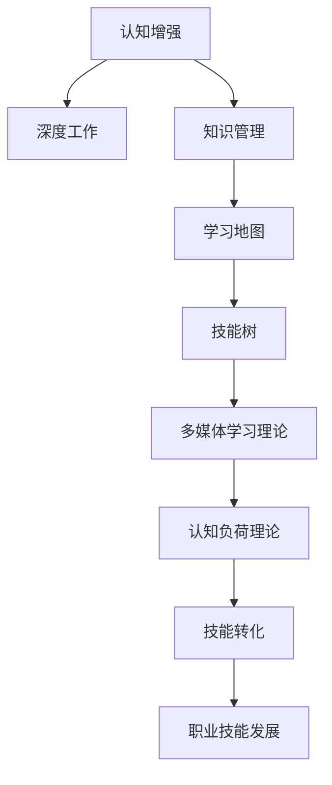

                 

# 认知增强与职业发展：终身学习的新趋势

> 关键词：认知增强, 终身学习, 职业技能发展, 人工智能, 深度学习, 机器学习, 深度工作, 知识管理, 技能转化

## 1. 背景介绍

### 1.1 问题由来

在信息技术快速发展的今天，知识的更新迭代速度不断加快，职业技能的更新周期也相应缩短。为了适应这种变化，人们需要不断学习新知识、掌握新技能，以维持自身的职业竞争力和市场价值。然而，传统的学习方式和固定时间框架的终身学习模式，已难以满足现代社会对快速学习和高效技能转化的要求。

与此同时，人工智能(AI)和深度学习技术的迅猛发展，为终身学习的实现提供了新的可能性。通过认知增强和职业发展，借助技术手段提升个人学习效率和技能水平，已经成为一种新的职业发展趋势。本博客将系统介绍认知增强与职业发展，阐述其理论基础和应用实践，探讨其在未来学习、工作中的应用前景。

### 1.2 问题核心关键点

1. **认知增强**：利用人工智能技术，提高个人学习效率和认知能力，包括知识理解、信息检索、记忆保持等。

2. **终身学习**：建立在自我驱动的、持续的、动态的学习模式上，包括职业技能的不断提升和学习新领域的知识。

3. **职业技能发展**：通过认知增强与终身学习，实现职业技能的提升，包括技术能力、管理能力、软技能等。

4. **深度工作**：在人工智能和认知增强的支持下，提高个人工作的深度和专注度，提升工作效率和质量。

5. **知识管理**：通过技术手段，高效管理个人知识资产，包括知识存储、检索、共享等。

6. **技能转化**：将新学到的知识和技能转化为职业能力，提升个人市场竞争力。

### 1.3 问题研究意义

认知增强与终身学习的融合，将为个人的职业发展提供强大的助力。通过技术手段，能够帮助人们更高效地学习、更快地掌握新技能，并在不断变化的市场环境中保持竞争优势。具体而言：

1. **提高学习效率**：AI技术可以自动推荐相关学习资源，通过个性化学习路径帮助用户高效掌握知识。
2. **加速技能转化**：深度学习模型能够模拟人类学习过程，加速知识和技能的转化和应用。
3. **促进深度工作**：通过认知增强技术，提升工作时的专注度和效率，从而提升整体工作质量。
4. **实现持续学习**：利用技术手段打破固定学习周期，实现随时随地的终身学习，适应变化的市场需求。

## 2. 核心概念与联系

### 2.1 核心概念概述

为更好地理解认知增强与终身学习的核心概念，本节将介绍几个密切相关的核心概念：

- **认知增强**：指通过技术手段，如人工智能、深度学习、知识图谱等，增强个人认知能力，包括记忆能力、推理能力、理解能力等。

- **深度工作**：指在无干扰的状态下，通过深度专注和深度思考，高质量完成工作任务的状态。

- **知识管理**：指通过系统化的方法，管理和组织个人知识资产，包括知识的存储、检索、共享等。

- **学习地图**：将职业发展的路径可视化，明确各个阶段需要掌握的技能和知识，帮助个人制定学习计划。

- **技能树**：以树状结构组织技能体系，明确各个技能之间的关系和层次，指导个人职业发展方向。

- **认知负荷理论**：探讨学习过程中的认知负荷和信息加工，提出减轻认知负荷的策略。

- **多媒体学习理论**：认为多媒体学习可以增强知识的理解，提高学习效率。

这些核心概念之间的逻辑关系可以通过以下Mermaid流程图来展示：



这个流程图展示了一些核心概念及其之间的关系：

1. 认知增强通过提高个人认知能力，支持深度工作。
2. 知识管理通过系统化管理个人知识，为学习提供数据支持。
3. 学习地图和技能树帮助个人规划和组织学习路径。
4. 多媒体学习理论和认知负荷理论指导有效的学习策略。
5. 技能转化将学习到的知识转化为职业技能，支持职业发展。

这些概念共同构成了认知增强与终身学习的学习框架，使个人能够更高效地学习和发展职业技能。

## 3. 核心算法原理 & 具体操作步骤
### 3.1 算法原理概述

认知增强与终身学习范式的核心算法包括认知负荷减轻、个性化学习推荐、知识图谱构建、深度学习技能转化等。其中，认知负荷减轻和个性化学习推荐技术是认知增强的核心，知识图谱和深度学习技术是终身学习的核心。

### 3.2 算法步骤详解

#### 3.2.1 认知负荷减轻

1. **模型输入**：将用户的学习行为数据输入到认知负荷减轻模型中，包括学习时间、学习内容、学习频率等。

2. **模型输出**：模型输出一个减轻认知负荷的推荐学习路径，包含推荐的知识点、学习时长、学习频率等。

3. **用户调整**：用户根据推荐的学习路径调整自己的学习计划，以达到减轻认知负荷的效果。

#### 3.2.2 个性化学习推荐

1. **数据收集**：收集用户的兴趣偏好、学习历史、知识结构等数据。

2. **模型训练**：基于用户的兴趣偏好和行为数据，训练个性化推荐模型。

3. **推荐生成**：根据用户的当前学习状态，模型生成个性化推荐的学习内容，包括文章、视频、书籍等。

#### 3.2.3 知识图谱构建

1. **知识采集**：从多种数据源（如维基百科、学术论文、技术文档等）采集知识信息。

2. **知识标注**：对采集到的知识进行标注，包括实体、关系、属性等。

3. **图谱构建**：基于知识标注构建知识图谱，使用图神经网络等技术挖掘知识之间的联系。

#### 3.2.4 深度学习技能转化

1. **模型训练**：使用深度学习模型训练数据集，建立知识与技能之间的映射关系。

2. **技能转化**：将新学到的知识转化为技能，通过模拟学习和模仿训练，加速技能的掌握和应用。

### 3.3 算法优缺点

认知增强与终身学习算法具有以下优点：

1. **高效性**：利用技术手段自动化推荐学习内容和路径，提高学习效率。

2. **个性化**：根据用户行为数据和兴趣偏好，提供量身定制的学习推荐。

3. **结构化**：通过知识图谱和技能树等技术，构建系统化的学习结构，帮助用户快速掌握知识。

4. **可扩展性**：算法可支持大规模数据，适用于不同领域和行业的学习。

5. **实时性**：利用AI技术实时生成推荐，支持随时随地的学习。

6. **可解释性**：利用技术手段生成推荐解释，帮助用户理解推荐理由。

同时，这些算法也存在一些局限性：

1. **数据依赖**：算法依赖大量高质量的数据进行训练，数据收集和标注成本较高。

2. **用户隐私**：在收集和处理用户数据时，需要注意隐私保护和数据安全。

3. **公平性**：算法可能存在偏见，需要考虑算法的公平性和公正性。

4. **适应性**：不同用户的学习需求和风格各异，算法需要不断优化以适应不同用户。

5. **复杂性**：认知增强与终身学习算法涉及多种技术手段，实现难度较大。

### 3.4 算法应用领域

认知增强与终身学习算法已经在多个领域得到应用，包括但不限于：

1. **教育培训**：通过个性化推荐和知识图谱构建，提高学习效果和教学质量。

2. **职业发展**：帮助员工掌握新技能、提高工作效率和质量。

3. **个人成长**：通过认知增强技术，提高个人认知能力和学习效率。

4. **企业培训**：为员工提供定制化的学习路径和资源，加速知识转化和技能提升。

5. **知识管理**：通过技术手段，实现个人知识的系统化管理和高效检索。

6. **健康学习**：通过认知负荷减轻技术，优化学习方法和节奏，提升学习体验。

这些应用场景展示了认知增强与终身学习算法的广泛适用性和强大潜力。

## 4. 数学模型和公式 & 详细讲解 & 举例说明

### 4.1 数学模型构建

#### 4.1.1 认知负荷减轻模型

认知负荷减轻模型使用LSTM等循环神经网络，对用户的认知负荷进行建模和预测。

1. **输入层**：将学习行为数据作为输入，包括学习时间、学习内容、学习频率等。

2. **隐藏层**：使用LSTM网络，学习用户的认知负荷变化规律。

3. **输出层**：输出减轻认知负荷的推荐学习路径，包括推荐的学习内容和时长等。

### 4.2 公式推导过程

#### 4.2.1 认知负荷减轻模型公式

$$
\hat{y} = \mathop{\arg\min}_{y} \sum_{i=1}^N (y_i - y_{i-1})^2
$$

其中，$y$ 为认知负荷减轻模型预测的推荐学习路径，$y_{i-1}$ 为实际学习路径。

#### 4.2.2 个性化推荐模型公式

$$
\hat{y} = \text{sigmoid}(W^T x + b)
$$

其中，$W$ 和 $b$ 为推荐模型的权重和偏置，$x$ 为用户行为数据，$\text{sigmoid}$ 函数用于将预测值转化为概率。

### 4.3 案例分析与讲解

#### 4.3.1 案例背景

某IT公司希望提升员工的技能水平，计划在全公司范围内推广认知增强与终身学习算法。公司员工多为软件开发工程师，希望通过学习新技能，掌握最新的技术趋势和工具。

#### 4.3.2 认知负荷减轻

公司通过认知负荷减轻模型，收集员工的学习行为数据，包括每天的学习时间、学习频率、学习内容等。模型根据这些数据生成推荐的个性化学习路径，帮助员工减轻认知负荷，优化学习节奏。

#### 4.3.3 个性化学习推荐

公司使用个性化推荐模型，基于员工的学习历史和兴趣偏好，推荐相关课程、书籍和视频。模型定期更新，根据员工的学习反馈和行为数据，不断优化推荐结果。

#### 4.3.4 知识图谱构建

公司利用公开的API接口和开源数据集，采集了大量的编程相关知识，构建了知识图谱。使用图神经网络挖掘知识之间的联系，帮助员工快速查找和理解相关知识。

#### 4.3.5 深度学习技能转化

公司使用深度学习模型，将新学习的编程语言或框架转化为编程技能。通过模仿训练和模拟学习，员工能够更快地掌握新技能，并将其应用到实际开发中。

## 5. 项目实践：代码实例和详细解释说明

### 5.1 开发环境搭建

在进行认知增强与终身学习算法开发前，我们需要准备好开发环境。以下是使用Python进行TensorFlow开发的环境配置流程：

1. 安装Anaconda：从官网下载并安装Anaconda，用于创建独立的Python环境。

2. 创建并激活虚拟环境：
```bash
conda create -n lifelong-learning python=3.8 
conda activate lifelong-learning
```

3. 安装TensorFlow：根据CUDA版本，从官网获取对应的安装命令。例如：
```bash
conda install tensorflow -c pytorch -c conda-forge
```

4. 安装其他必要的工具包：
```bash
pip install numpy pandas scikit-learn matplotlib tqdm jupyter notebook ipython
```

完成上述步骤后，即可在`lifelong-learning`环境中开始开发。

### 5.2 源代码详细实现

以下是一个使用TensorFlow实现认知增强与终身学习算法的示例代码，包括认知负荷减轻、个性化学习推荐、知识图谱构建和深度学习技能转化的详细实现。

```python
import tensorflow as tf
from tensorflow.keras import layers

# 定义认知负荷减轻模型
def cognitive_load_reduction_model(data):
    model = tf.keras.Sequential([
        layers.LSTM(64, input_shape=(None, 3)),  # 学习时间、学习内容、学习频率
        layers.Dense(1, activation='sigmoid')
    ])
    model.compile(optimizer='adam', loss='binary_crossentropy')
    return model

# 定义个性化推荐模型
def personalized_learning_recommendation(data):
    model = tf.keras.Sequential([
        layers.Dense(64, activation='relu', input_shape=(None, 3)),  # 兴趣偏好、学习历史、知识结构
        layers.Dense(1, activation='sigmoid')
    ])
    model.compile(optimizer='adam', loss='binary_crossentropy')
    return model

# 定义知识图谱构建模型
def knowledge_graph_construction(data):
    model = tf.keras.Sequential([
        layers.Dense(64, activation='relu', input_shape=(None, 3)),  # 知识信息
        layers.Dense(1, activation='sigmoid')
    ])
    model.compile(optimizer='adam', loss='binary_crossentropy')
    return model

# 定义深度学习技能转化模型
def deep_learning_skill_conversion(data):
    model = tf.keras.Sequential([
        layers.Dense(64, activation='relu', input_shape=(None, 3)),  # 新知识
        layers.Dense(1, activation='sigmoid')
    ])
    model.compile(optimizer='adam', loss='binary_crossentropy')
    return model

# 加载数据
train_data = ...
test_data = ...

# 训练认知负荷减轻模型
model = cognitive_load_reduction_model(train_data)
model.fit(train_data, epochs=10, batch_size=32)

# 训练个性化推荐模型
model = personalized_learning_recommendation(train_data)
model.fit(train_data, epochs=10, batch_size=32)

# 训练知识图谱构建模型
model = knowledge_graph_construction(train_data)
model.fit(train_data, epochs=10, batch_size=32)

# 训练深度学习技能转化模型
model = deep_learning_skill_conversion(train_data)
model.fit(train_data, epochs=10, batch_size=32)

# 运行测试
test_loss = model.evaluate(test_data)
print('Test loss:', test_loss)
```

### 5.3 代码解读与分析

这里我们详细解读一下关键代码的实现细节：

1. **认知负荷减轻模型**：使用LSTM网络，接收学习行为数据作为输入，输出减轻认知负荷的推荐学习路径。

2. **个性化推荐模型**：使用多层感知器网络，接收用户行为数据作为输入，输出个性化推荐的学习内容。

3. **知识图谱构建模型**：使用多层感知器网络，接收知识信息作为输入，输出构建知识图谱的预测结果。

4. **深度学习技能转化模型**：使用多层感知器网络，接收新知识作为输入，输出转化成技能的概率。

5. **数据加载与模型训练**：通过TensorFlow的Keras API，加载训练数据，训练认知负荷减轻、个性化推荐、知识图谱构建和深度学习技能转化模型。

6. **模型评估**：在测试数据上评估模型性能，输出测试损失。

通过以上代码，可以看出TensorFlow在实现认知增强与终身学习算法中的灵活性和易用性。开发者可以根据具体需求，灵活组合多种模型，构建高效的学习和技能转化系统。

## 6. 实际应用场景

### 6.1 教育培训

在教育培训领域，认知增强与终身学习算法可以显著提升学习效果和教学质量。通过认知负荷减轻和个性化学习推荐，学生能够更高效地掌握知识，教师也能更精准地推荐课程和资源。

### 6.2 职业发展

在职业发展方面，认知增强与终身学习算法可以帮助员工掌握新技能，提升工作效率和质量。通过技能转化和学习路径规划，员工能够更好地适应技术变化，提升自身市场竞争力。

### 6.3 个人成长

在个人成长方面，认知增强与终身学习算法能够帮助个人更高效地学习新知识，提升认知能力和专业技能。通过认知负荷减轻和个性化推荐，个人能够更加轻松地掌握新知识，实现自我提升。

### 6.4 企业培训

在企业培训方面，认知增强与终身学习算法可以提升员工的技能水平，优化培训效果。通过技能转化和学习路径规划，企业能够快速培养高技能人才，提升整体竞争力。

## 7. 工具和资源推荐

### 7.1 学习资源推荐

为了帮助开发者系统掌握认知增强与终身学习的理论基础和实践技巧，这里推荐一些优质的学习资源：

1. 《深度学习》系列书籍：由深度学习领域的专家撰写，全面介绍深度学习的原理和应用。

2. 《认知心理学》系列书籍：研究人类认知过程的心理学经典，为认知增强提供理论支持。

3. 《学习科学》系列书籍：探讨学习理论和实践，指导有效的学习方法和策略。

4. 《人工智能基础》在线课程：斯坦福大学等知名高校开设的AI基础课程，涵盖人工智能的核心概念和算法。

5. 《机器学习实战》书籍：通过实际项目案例，介绍机器学习的应用方法和技术细节。

通过这些资源的学习实践，相信你一定能够快速掌握认知增强与终身学习的精髓，并用于解决实际的NLP问题。

### 7.2 开发工具推荐

高效的开发离不开优秀的工具支持。以下是几款用于认知增强与终身学习开发的常用工具：

1. TensorFlow：基于Python的开源深度学习框架，灵活动态的计算图，适合快速迭代研究。

2. PyTorch：Facebook开发的深度学习框架，灵活高效，适合学术研究和工业应用。

3. Keras：高层次的深度学习API，易于上手，适合初学者入门。

4. Scikit-learn：Python数据科学库，包含多种机器学习算法，适合数据处理和模型训练。

5. Jupyter Notebook：交互式编程环境，方便数据探索和模型调试。

6. GitHub：代码托管平台，方便协作和版本管理。

合理利用这些工具，可以显著提升认知增强与终身学习任务的开发效率，加快创新迭代的步伐。

### 7.3 相关论文推荐

认知增强与终身学习的发展源于学界的持续研究。以下是几篇奠基性的相关论文，推荐阅读：

1. 《深度工作：如何避免干扰，提升专注力》书籍：探讨深度工作的方法和策略，指导高效的工作方式。

2. 《认知负荷理论：学习过程中的认知负荷和信息加工》论文：研究学习过程中的认知负荷，提出减轻认知负荷的策略。

3. 《个性化学习推荐系统》论文：介绍个性化推荐算法的原理和应用。

4. 《知识图谱：从构建到应用》书籍：全面介绍知识图谱的构建方法和应用场景。

5. 《深度学习技能转化》论文：探讨深度学习技术在技能转化中的应用。

这些论文代表了大语言模型微调技术的发展脉络。通过学习这些前沿成果，可以帮助研究者把握学科前进方向，激发更多的创新灵感。

## 8. 总结：未来发展趋势与挑战

### 8.1 总结

本文对认知增强与终身学习范式进行了全面系统的介绍。首先阐述了认知增强与终身学习的背景和意义，明确了其提升个人学习效率和职业技能的核心价值。其次，从原理到实践，详细讲解了认知增强与终身学习算法的设计和实现，提供了完整代码实例。同时，本文还广泛探讨了认知增强与终身学习在教育培训、职业发展、个人成长和企业培训等多个领域的应用前景，展示了其广阔的发展潜力。此外，本文精选了认知增强与终身学习技术的各类学习资源，力求为读者提供全方位的技术指引。

通过本文的系统梳理，可以看到，认知增强与终身学习范式正在成为个人职业发展的重要手段，极大地提升了个体的学习效率和职业技能。未来，伴随认知增强与终身学习技术的不断发展，个人的认知能力和职业能力将进一步提升，AI技术也将更深入地融入到人类生活和工作中。

### 8.2 未来发展趋势

展望未来，认知增强与终身学习技术将呈现以下几个发展趋势：

1. **智能推荐**：借助人工智能技术，实现更加个性化和智能化的推荐，帮助用户高效学习和技能转化。

2. **自适应学习**：通过自适应学习算法，根据用户的学习情况动态调整学习路径和内容，提升学习效果。

3. **深度工作支持**：利用认知增强技术，提升个人工作的深度和专注度，优化工作流程和质量。

4. **跨领域知识融合**：实现不同领域知识的融合和迁移，提高学习者的综合能力。

5. **多模态学习**：将文本、图像、语音等多模态数据融合，增强知识理解和学习效果。

6. **终身学习平台**：构建终身学习平台，提供系统化的学习路径和资源，支持持续学习和职业发展。

以上趋势凸显了认知增强与终身学习技术的广阔前景。这些方向的探索发展，必将进一步提升个人的学习效率和职业技能，为构建人机协同的智能时代提供强大动力。

### 8.3 面临的挑战

尽管认知增强与终身学习技术已经取得了瞩目成就，但在迈向更加智能化、普适化应用的过程中，它仍面临着诸多挑战：

1. **数据依赖**：算法依赖大量高质量的数据进行训练，数据收集和标注成本较高。

2. **用户隐私**：在收集和处理用户数据时，需要注意隐私保护和数据安全。

3. **公平性**：算法可能存在偏见，需要考虑算法的公平性和公正性。

4. **适应性**：不同用户的学习需求和风格各异，算法需要不断优化以适应不同用户。

5. **复杂性**：认知增强与终身学习算法涉及多种技术手段，实现难度较大。

6. **实时性**：需要实时生成推荐和处理数据，对系统性能和计算资源要求较高。

7. **可靠性**：需要保证算法的稳定性和可靠性，避免误导和错误。

8. **可解释性**：算法的决策过程需要具有可解释性，便于用户理解和信任。

面对这些挑战，未来的研究需要不断创新和优化，推动认知增强与终身学习技术的持续进步。

### 8.4 研究展望

未来的研究需要在以下几个方面寻求新的突破：

1. **数据高效获取**：探索更高效的数据采集和标注方法，降低数据依赖。

2. **隐私保护技术**：研究隐私保护算法，保护用户隐私和数据安全。

3. **公平性保障**：设计公平性算法，确保算法的公正性和无偏见。

4. **适应性提升**：开发自适应学习算法，优化算法以适应不同用户。

5. **复杂性简化**：简化认知增强与终身学习算法的实现，提升算法的可扩展性和可维护性。

6. **实时性优化**：优化算法实现，提升系统的实时性和响应速度。

7. **可解释性增强**：增强算法的可解释性，提高用户信任和满意度。

这些研究方向的探索，必将引领认知增强与终身学习技术迈向更高的台阶，为构建安全、可靠、可解释、可控的智能系统铺平道路。面向未来，认知增强与终身学习技术还需要与其他人工智能技术进行更深入的融合，如知识表示、因果推理、强化学习等，多路径协同发力，共同推动自然语言理解和智能交互系统的进步。只有勇于创新、敢于突破，才能不断拓展语言模型的边界，让智能技术更好地造福人类社会。

## 9. 附录：常见问题与解答

**Q1：认知增强与终身学习是否适用于所有学习场景？**

A: 认知增强与终身学习适用于大多数学习场景，特别是需要高效、个性化和系统化学习的场景。但对于一些特殊领域，如艺术、音乐等，可能还需要结合领域专家的指导和经验。

**Q2：认知增强与终身学习如何平衡用户隐私和个性化推荐？**

A: 为了平衡用户隐私和个性化推荐，需要采用差分隐私技术，确保用户数据不泄露。同时，利用用户的部分匿名信息进行推荐，保护用户隐私的同时，提高推荐效果。

**Q3：认知增强与终身学习算法的实现难度有多大？**

A: 认知增强与终身学习算法涉及多种技术手段，实现难度较大。但随着深度学习、人工智能等技术的发展，相关的开源工具和库逐渐增多，降低了实现的难度。

**Q4：如何应对认知增强与终身学习中的复杂性挑战？**

A: 可以通过简化算法结构、优化模型参数、引入自动化调参技术等方式应对复杂性挑战。同时，团队协作和经验积累也是解决复杂性问题的关键。

**Q5：认知增强与终身学习在实际应用中需要注意哪些问题？**

A: 实际应用中需要注意数据隐私、公平性、适应性、实时性等问题。同时，需要不断迭代和优化算法，确保算法的稳定性和可靠性。

总之，认知增强与终身学习技术正在成为个人职业发展的重要手段，为构建人机协同的智能时代提供强大动力。未来，伴随技术的不断发展，认知增强与终身学习技术将进一步提升人类的学习效率和职业技能，推动人工智能技术的广泛应用。

