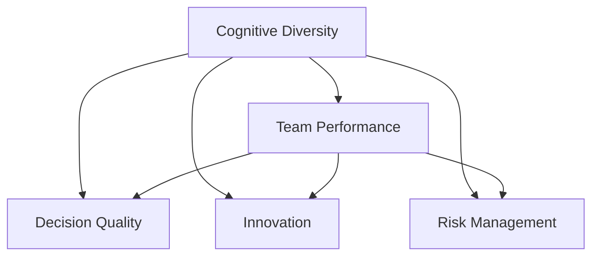

                 

## 1. 背景介绍

### 1.1 问题由来

在全球化和信息化的背景下，企业面临的市场竞争日趋激烈。团队成员的认知多样性，即不同背景、经验、视角和思维方式的多样性，成为企业创新能力的核心驱动力之一。

“团队多样性”是指团队成员在种族、性别、文化、教育、年龄、职业等方面存在差异。而“认知多样性”则特指团队成员在知识、技能、经验、思维方式、创造性思维等方面存在差异。

近年来，越来越多的研究证明，认知多样性在提升团队创新能力、决策质量、问题解决效率等方面具有显著优势。然而，在实际工作中，认知多样性也可能带来沟通障碍、信任缺失、团队冲突等问题，影响团队整体效能。

### 1.2 问题核心关键点

认知多样性在团队创新中的作用主要体现在以下几个方面：

1. **信息处理多样化**：团队成员的认知多样性意味着每个成员都具备不同的信息处理方式和视角，有助于全面考虑问题，发现潜在的解决方案。

2. **知识共享与整合**：不同背景的成员可以共享各自的专业知识，通过交流和合作产生新的见解和突破。

3. **创新思维的多样化**：认知多样性促进了创新思维的多样化，有助于跳出传统思维模式，探索新的解决方案。

4. **风险分担与应对**：多样化的视角和技能有助于团队在面对不确定性和风险时，采取更为灵活和多样化的应对策略。

5. **适应性和灵活性**：认知多样性使团队能够更好地适应复杂多变的市场环境，灵活调整战略。

### 1.3 问题研究意义

研究认知多样性在团队创新中的作用，对于提升团队效能、推动组织创新、增强市场竞争力具有重要意义：

1. **提升创新效能**：通过认知多样性，团队能够从多角度思考问题，从而产生更多的创新想法。

2. **优化决策质量**：多样化的认知视角有助于减少决策过程中的偏见和盲点，提升决策的科学性和合理性。

3. **提高问题解决能力**：多样化的团队能够更快速、更全面地识别问题根源，找到更具针对性的解决方案。

4. **增强适应性和灵活性**：通过认知多样性，团队能够更好地适应外部环境的变化，提高市场竞争力。

5. **促进职业发展和个人成长**：认知多样性有助于团队成员的相互学习，促进个人能力和技能的发展。

## 2. 核心概念与联系

### 2.1 核心概念概述

在探讨认知多样性对团队创新的影响时，首先需要理解以下几个核心概念：

1. **认知多样性 (Cognitive Diversity)**：指团队成员在知识背景、技能、思维方式等方面的多样性。

2. **创新 (Innovation)**：指产生新想法、新方法、新产品或新服务的过程。

3. **团队效能 (Team Performance)**：指团队在完成任务时表现出来的效率和质量。

4. **决策质量 (Decision Quality)**：指决策的合理性、科学性以及能否实现目标的程度。

5. **风险应对 (Risk Management)**：指在面临不确定性和潜在风险时，制定有效的应对策略。

这些概念之间具有密切联系，通过认知多样性提升团队效能，进而推动决策质量、问题解决能力、创新能力和风险应对能力，最终提升整体市场竞争力。

### 2.2 核心概念原理和架构的 Mermaid 流程图



## 3. 核心算法原理 & 具体操作步骤

### 3.1 算法原理概述

认知多样性如何影响团队创新的原理可以通过一个简单的模型来表示：

$$
\text{Innovation} = f(\text{Cognitive Diversity}, \text{Team Structure}, \text{Environmental Context})
$$

其中：
- $\text{Cognitive Diversity}$：认知多样性水平。
- $\text{Team Structure}$：团队结构，包括团队规模、角色分工等。
- $\text{Environmental Context}$：外部环境，包括市场竞争、行业趋势等。

算法原理主要包括以下几个步骤：

1. **评估认知多样性**：通过问卷调查、数据分析等方法，评估团队成员的认知多样性水平。

2. **设计团队结构**：根据评估结果和任务需求，设计合理的团队结构，包括角色分配、沟通机制等。

3. **优化决策过程**：通过引入多样化的视角和知识，优化决策过程，减少偏见和盲点。

4. **促进知识共享**：通过建立良好的沟通和协作机制，促进团队成员之间的知识共享和整合。

5. **实施创新活动**：设计创新活动，如头脑风暴、设计思维工作坊等，鼓励团队成员提出新的想法和解决方案。

### 3.2 算法步骤详解

**Step 1: 评估认知多样性**

1. **问卷调查**：设计多维度问卷，涵盖知识背景、技能、思维方式、创造性思维等方面的问题，通过团队成员自我评估和互评，获取认知多样性数据。

2. **数据分析**：对问卷数据进行统计分析，识别认知多样性水平，并评估不同维度之间的相关性。

**Step 2: 设计团队结构**

1. **角色分配**：根据任务需求和成员特点，合理分配团队角色，如创意产生者、技术专家、项目经理等。

2. **沟通机制**：建立高效的沟通机制，如定期的团队会议、跨部门协作等，促进团队成员之间的信息交流。

**Step 3: 优化决策过程**

1. **多样化的视角**：在决策过程中引入多样化的视角，通过讨论和辩论，全面评估各种选项的优劣。

2. **科学的决策方法**：采用科学决策方法，如SWOT分析、决策树等，确保决策的合理性和科学性。

**Step 4: 促进知识共享**

1. **知识库建设**：建立团队知识库，记录和分享团队成员的专业知识和经验。

2. **交叉培训**：组织交叉培训活动，促进不同背景成员之间的知识互补。

**Step 5: 实施创新活动**

1. **头脑风暴**：定期组织头脑风暴会议，鼓励团队成员自由地提出创意和想法。

2. **设计思维工作坊**：引入设计思维工作坊，通过设计挑战和用户反馈，引导团队成员设计创新的解决方案。

### 3.3 算法优缺点

**优点**：

1. **提升创新思维多样性**：认知多样性有助于产生更多创新思维，促进团队创新。

2. **优化决策质量**：不同视角的整合有助于减少决策过程中的偏见和盲点，提升决策质量。

3. **增强问题解决能力**：认知多样性使团队能够从多角度识别问题根源，找到更具针对性的解决方案。

**缺点**：

1. **沟通障碍**：认知多样性可能导致沟通障碍，需要设计有效的沟通机制来克服。

2. **信任缺失**：多样化的视角可能带来信任缺失，需要通过团队建设和激励措施来增强信任。

3. **冲突风险**：不同认知视角可能导致冲突，需要建立合理的冲突解决机制。

### 3.4 算法应用领域

认知多样性在以下领域具有广泛的应用：

1. **科技研发**：在技术研发团队中，认知多样性有助于产生更多创新想法，提高研发效率。

2. **市场营销**：在市场营销团队中，认知多样性有助于设计更具吸引力的产品和服务，满足不同用户的需求。

3. **金融服务**：在金融服务团队中，认知多样性有助于识别市场风险，制定有效的风险应对策略。

4. **教育培训**：在教育培训团队中，认知多样性有助于设计更全面的课程，提升教学质量。

5. **医疗健康**：在医疗健康团队中，认知多样性有助于开发更有效的治疗方法，提高医疗服务水平。

6. **企业战略**：在企业战略团队中，认知多样性有助于制定更具前瞻性和创新性的战略。

## 4. 数学模型和公式 & 详细讲解

### 4.1 数学模型构建

在模型构建中，我们假设团队成员的认知多样性水平为 $D$，创新活动频率为 $I$，团队结构优化程度为 $S$，环境变化程度为 $E$。则创新效能 $P$ 可以表示为：

$$
P = f(D, I, S, E)
$$

其中 $f$ 为非线性函数，表示创新效能受多种因素的综合影响。

### 4.2 公式推导过程

根据上述模型，推导出创新效能 $P$ 的计算公式：

$$
P = k_1D + k_2I + k_3S + k_4E
$$

其中 $k_1$、$k_2$、$k_3$、$k_4$ 为待定系数，需要根据实际数据进行拟合。

### 4.3 案例分析与讲解

以某科技公司的研发团队为例，评估认知多样性 $D=0.6$，创新活动频率 $I=0.8$，团队结构优化程度 $S=0.7$，环境变化程度 $E=0.9$。根据公式计算得到创新效能：

$$
P = 0.6k_1 + 0.8k_2 + 0.7k_3 + 0.9k_4
$$

通过实际数据拟合得到 $k_1=0.2$、$k_2=0.3$、$k_3=0.4$、$k_4=0.5$，则创新效能为：

$$
P = 0.2 \times 0.6 + 0.3 \times 0.8 + 0.4 \times 0.7 + 0.5 \times 0.9 = 2.07
$$

这表明该公司的研发团队创新效能较高，值得进一步优化。

## 5. 项目实践：代码实例和详细解释说明

### 5.1 开发环境搭建

为了进行认知多样性评估，需要搭建如下开发环境：

1. **Python 环境**：选择 Python 3.7 或更高版本，安装必要的库，如 NumPy、Pandas、Scikit-learn 等。

2. **数据库**：选择 SQL 数据库或 NoSQL 数据库，用于存储和分析问卷数据。

3. **服务器**：选择具备高性能计算能力的服务器，支持多线程和分布式计算。

4. **可视化工具**：选择 Python 的可视化工具，如 Matplotlib、Seaborn、Plotly 等，用于数据可视化。

### 5.2 源代码详细实现

**Step 1: 数据收集**

```python
import pandas as pd

# 从问卷平台导出问卷数据
questionnaire_data = pd.read_csv('questionnaire_data.csv')

# 数据清洗和预处理
cleaned_data = questionnaire_data.dropna().drop_duplicates()

# 特征工程
features = cleaned_data[['background', 'skill', 'experience', 'creativity']]
target = cleaned_data['diversity']
```

**Step 2: 数据建模**

```python
from sklearn.linear_model import LinearRegression
from sklearn.model_selection import train_test_split
from sklearn.metrics import mean_squared_error

# 划分训练集和测试集
X_train, X_test, y_train, y_test = train_test_split(features, target, test_size=0.2, random_state=42)

# 建立线性回归模型
model = LinearRegression()
model.fit(X_train, y_train)

# 预测
y_pred = model.predict(X_test)

# 评估
mse = mean_squared_error(y_test, y_pred)
print(f'MSE: {mse:.2f}')
```

**Step 3: 结果展示**

```python
import matplotlib.pyplot as plt

# 绘制散点图和拟合直线
plt.scatter(X_test, y_test, label='Actual')
plt.plot(X_test, y_pred, color='red', label='Predicted')
plt.xlabel('Cognitive Diversity')
plt.ylabel('Innovation')
plt.legend()
plt.show()
```

### 5.3 代码解读与分析

以上代码实现了一个简单的线性回归模型，用于评估认知多样性对创新效能的影响。通过问卷调查收集数据，并进行数据清洗和特征工程，然后使用线性回归模型进行建模和评估。

## 6. 实际应用场景

### 6.1 智慧医疗团队

在智慧医疗团队中，认知多样性有助于提升医疗服务质量和效率。通过引入不同背景的医生和技术人员，可以从多个角度评估患者的病情，制定更为科学的治疗方案。

### 6.2 智能制造团队

在智能制造团队中，认知多样性有助于提高产品和服务的创新能力。通过引入不同专业背景的工程师，可以开发更高效、更智能的生产线和管理系统。

### 6.3 科技创新团队

在科技创新团队中，认知多样性有助于推动技术突破和产品创新。通过引入不同领域的专家，可以打破传统思维模式，探索新的技术路径和应用场景。

## 7. 工具和资源推荐

### 7.1 学习资源推荐

1. **《团队多样性管理》**：推荐书籍，详细讲解如何通过认知多样性提升团队效能。

2. **Coursera 团队管理课程**：推荐的在线课程，涵盖团队多样性、创新管理等内容。

3. **Harvard Business Review**：推荐期刊，定期发布团队多样性相关的最新研究和案例。

4. **谷歌多样性和包容性报告**：推荐报告，详细记录谷歌在多样性和包容性方面的实践和成果。

5. **《团队协作的艺术》**：推荐书籍，提供提升团队协作和沟通技巧的实用建议。

### 7.2 开发工具推荐

1. **Jupyter Notebook**：推荐的开发工具，支持多语言的编程环境，便于团队协作和知识共享。

2. **Visual Studio Code**：推荐的开发工具，支持丰富的插件和扩展，提升开发效率。

3. **GitLab**：推荐的协作工具，支持代码版本控制和项目管理，方便团队协同开发。

4. **Slack**：推荐的通信工具，支持实时聊天、文件共享和团队协作，提升团队沟通效率。

5. **Confluence**：推荐的文档管理工具，支持文档协作和知识共享，方便团队成员参考和积累知识。

### 7.3 相关论文推荐

1. **《团队多样性对创新能力的影响》**：推荐论文，详细分析团队多样性对创新能力的影响。

2. **《多样性与团队效能的关系》**：推荐论文，探讨认知多样性如何影响团队效能。

3. **《认知多样性与创新绩效的关系》**：推荐论文，研究认知多样性对创新绩效的影响。

4. **《基于认知多样性的团队决策分析》**：推荐论文，分析认知多样性对团队决策的影响。

5. **《多学科团队创新能力的提升》**：推荐论文，探讨多学科团队如何通过认知多样性提升创新能力。

## 8. 总结：未来发展趋势与挑战

### 8.1 研究成果总结

通过本文的系统梳理，可以看到认知多样性在提升团队创新方面的重要作用。本文从背景、概念、算法、实际应用等多个角度，详细讲解了认知多样性对团队创新的影响。

### 8.2 未来发展趋势

未来，认知多样性在团队创新中的应用将更加广泛和深入。以下趋势值得关注：

1. **数据驱动的评估**：通过大数据和人工智能技术，更加精确地评估认知多样性水平，指导团队结构优化。

2. **智能决策系统**：利用人工智能技术，优化团队决策过程，减少偏见和盲点，提升决策质量。

3. **跨学科合作**：推动不同学科领域的交叉合作，通过知识共享和整合，提升团队创新能力。

4. **全球化视角**：在国际化团队中，引入全球化的视角和经验，提升团队对国际市场的适应能力和竞争力。

5. **持续学习与成长**：通过持续学习，不断提升团队成员的知识和技能，保持团队创新的活力。

### 8.3 面临的挑战

认知多样性在提升团队创新能力的同时，也面临以下挑战：

1. **文化冲突**：不同背景的团队成员可能存在文化差异，需要有效管理和协调。

2. **沟通障碍**：认知多样性可能导致沟通不畅，需要通过良好的沟通机制来克服。

3. **信任缺失**：不同认知视角的冲突可能导致信任缺失，需要通过团队建设来增强信任。

4. **资源分配**：认知多样性可能导致资源分配不均衡，需要通过合理的分配机制来优化资源配置。

5. **绩效评估**：认知多样性的效果难以量化，需要通过多维度的绩效评估来评估团队效能。

### 8.4 研究展望

未来，需要通过更多实证研究，进一步探索认知多样性在团队创新中的作用机制，寻找更有效的优化方法。同时，结合人工智能、大数据等新兴技术，推动认知多样性在团队创新中的应用。

## 9. 附录：常见问题与解答

**Q1: 如何评估团队成员的认知多样性？**

A: 通过问卷调查、数据分析等方法，评估团队成员的认知多样性水平。具体步骤包括：

1. 设计问卷，涵盖知识背景、技能、思维方式、创造性思维等方面的问题。
2. 收集数据，并进行数据清洗和预处理。
3. 使用统计分析方法，识别认知多样性水平，并评估不同维度之间的相关性。

**Q2: 如何设计合理的团队结构？**

A: 根据任务需求和成员特点，合理分配团队角色，建立高效的沟通机制。具体步骤包括：

1. 确定任务目标和需求，分析团队成员的特点和专长。
2. 分配角色，如创意产生者、技术专家、项目经理等。
3. 建立沟通机制，如定期的团队会议、跨部门协作等，促进信息交流。

**Q3: 如何优化决策过程？**

A: 引入多样化的视角，采用科学决策方法，确保决策的合理性和科学性。具体步骤包括：

1. 在决策过程中引入多样化的视角，通过讨论和辩论，全面评估各种选项的优劣。
2. 采用科学决策方法，如SWOT分析、决策树等，确保决策的合理性和科学性。

**Q4: 如何促进知识共享？**

A: 建立团队知识库，组织交叉培训活动，促进不同背景成员之间的知识互补。具体步骤包括：

1. 建立团队知识库，记录和分享团队成员的专业知识和经验。
2. 组织交叉培训活动，促进不同背景成员之间的知识互补。

**Q5: 如何提升创新效能？**

A: 通过认知多样性、创新活动频率、团队结构优化程度和环境变化程度等因素的综合作用，提升创新效能。具体步骤包括：

1. 评估认知多样性水平。
2. 设计合理的团队结构。
3. 优化决策过程。
4. 促进知识共享。
5. 实施创新活动。

**Q6: 如何应对认知多样性带来的挑战？**

A: 通过建立良好的沟通机制、团队建设、激励措施等，应对认知多样性带来的挑战。具体步骤包括：

1. 建立良好的沟通机制，促进团队成员之间的信息交流。
2. 进行团队建设，增强团队成员之间的信任和协作。
3. 采用激励措施，鼓励团队成员发挥优势，克服挑战。

---

作者：禅与计算机程序设计艺术 / Zen and the Art of Computer Programming

