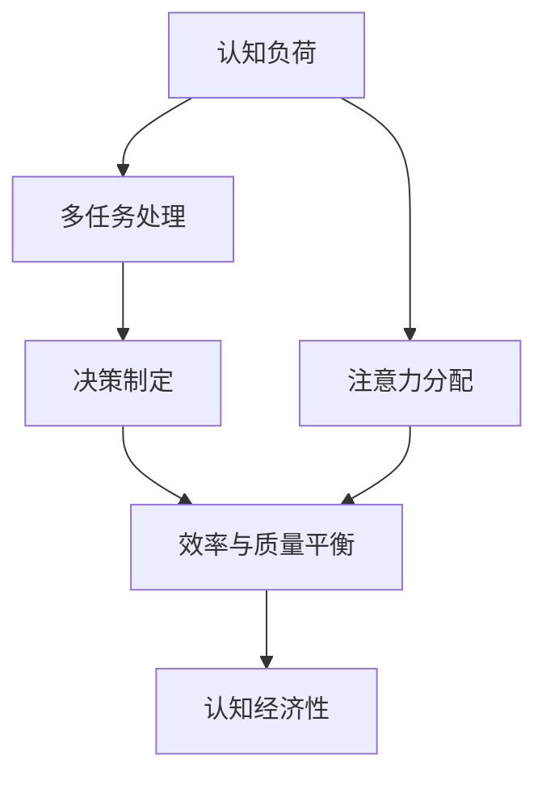

                 

# 认知负荷与多任务处理：效率与质量的平衡

> 关键词：认知负荷, 多任务处理, 注意力分配, 决策制定, 效率与质量平衡, 认知经济性

## 1. 背景介绍

### 1.1 问题由来
在信息爆炸的现代科技时代，人类面临的任务日益复杂，单任务处理已难以应对快速变化的环境需求。多任务处理作为一种新型的任务处理方式，已成为信息技术发展的趋势之一。然而，多任务处理带来的认知负荷问题，即用户需要同时进行多项任务的决策和执行，使得效率和质量之间的平衡成为焦点。

### 1.2 问题核心关键点
- 认知负荷：用户在进行多任务处理时，需要同时分配注意力资源，这可能导致认知负荷过大，影响决策质量和效率。
- 注意力分配：多任务处理的核心在于如何分配有限注意力资源，使其在不同任务间高效切换。
- 决策制定：在多任务场景下，如何做出最优的决策，以确保任务之间的协调性和整体效率。
- 效率与质量平衡：在多任务环境中，如何优化任务分配和执行，实现高效低耗的认知资源利用。
- 认知经济性：在认知负荷增加的情况下，如何通过优化任务处理方式，提升认知效率，减少认知资源的浪费。

## 2. 核心概念与联系

### 2.1 核心概念概述

为更好地理解认知负荷与多任务处理的关联机制，本节将介绍几个密切相关的核心概念：

- **认知负荷(Cognitive Load)**：指人在处理信息时所消耗的心理资源，包括注意、记忆、处理速度等。多任务处理时，认知负荷增加，可能导致注意力分散、记忆负担过重等问题。
- **多任务处理(Multitasking)**：同时进行两项或两项以上的任务处理方式。常见于操作系统、浏览器、编辑软件等应用程序中。
- **注意力分配(Attention Allocation)**：将有限的注意力资源分配给不同的任务，是提高多任务处理效率的关键。
- **决策制定(Decision-Making)**：在多任务处理中，需要实时做出任务优先级和执行顺序的决策。
- **效率与质量平衡(Efficiency and Quality Balance)**：多任务处理追求在有限时间内的高产出，但也要避免牺牲任务质量。
- **认知经济性(Cognitive Economy)**：在多任务处理中，如何有效利用认知资源，实现认知资源的优化配置。

这些核心概念之间的逻辑关系可以通过以下Mermaid流程图来展示：



这个流程图展示了大语言模型的核心概念及其之间的关系：

1. 认知负荷的增加是多任务处理的直接结果。
2. 注意力分配是提升多任务处理效率的关键。
3. 决策制定在多任务处理中扮演重要角色，影响任务执行顺序和优先级。
4. 效率与质量平衡是多任务处理追求的目标，需要在任务间找到最佳分配。
5. 认知经济性关注认知资源的优化配置，提升任务处理效率。

这些概念共同构成了多任务处理的认知框架，使得多任务处理更高效、更科学。

## 3. 核心算法原理 & 具体操作步骤
### 3.1 算法原理概述

多任务处理的核心在于优化注意力分配，使得在有限的时间内完成更多的任务。认知负荷理论认为，人的注意力资源有限，多任务处理时，注意力分配不当会导致认知负荷过重，从而影响决策和任务执行的质量。

基于认知负荷理论，多任务处理的基本原则是：合理分配注意力资源，避免过多任务导致的认知负荷，确保决策制定的准确性和任务执行的高效性。

### 3.2 算法步骤详解

基于认知负荷理论的多任务处理一般包括以下几个关键步骤：

**Step 1: 任务分类与优先级设定**
- 对多任务进行分类，将相似任务归为一类，根据任务的紧急程度和重要性设定优先级。
- 确定每个任务的预期完成时间和资源需求。

**Step 2: 注意力资源分配**
- 根据任务优先级和资源需求，动态分配注意力资源。优先处理高优先级和紧急任务。
- 利用时间块划分法、定时器提醒法等技术，辅助注意力分配。

**Step 3: 任务切换与执行**
- 在任务执行过程中，根据任务的执行状态和优先级动态调整注意力分配。
- 采用单任务处理法、并行处理法等不同任务执行策略，适应不同任务的特性。

**Step 4: 反馈与优化**
- 实时收集任务执行过程中的反馈信息，如任务完成时间、质量等。
- 根据反馈信息，优化任务分配策略和注意力资源分配策略，提升整体效率。

### 3.3 算法优缺点

基于认知负荷理论的多任务处理算法具有以下优点：
1. 合理分配注意力资源，提升任务处理效率。
2. 通过优先级设定，确保高优先级任务的及时处理。
3. 实时反馈与优化，使任务处理策略不断完善。

同时，该算法也存在一定的局限性：
1. 对任务优先级的准确判断可能导致某些任务被忽视。
2. 任务间的切换可能增加认知负荷，影响任务执行质量。
3. 需要根据不同任务特性选择合适任务执行策略，增加复杂度。
4. 实时反馈和优化需要大量数据支持，数据收集和处理成本较高。

尽管存在这些局限性，但就目前而言，基于认知负荷理论的多任务处理算法仍是处理复杂任务的一种有效手段。未来相关研究的重点在于如何进一步优化注意力分配和任务切换，以及如何在认知负荷增加的情况下，确保决策制定的准确性和任务执行的质量。

### 3.4 算法应用领域

基于认知负荷理论的多任务处理算法在多个领域得到了应用，例如：

- 操作系统：如Windows、macOS等，支持用户同时运行多个程序。
- 软件开发：如Visual Studio、Atom等，支持用户同时编写多个代码文件。
- 数据分析：如Excel、Tableau等，支持用户同时处理多个数据表和图表。
- 教育培训：如Khan Academy、Coursera等，支持学生同时进行多个课程学习。
- 实时决策：如军事指挥、金融交易等，支持用户同时处理多个实时数据源和任务。

除了上述这些经典应用外，多任务处理还在更多场景中得到创新性地应用，如多任务感知神经网络、多任务强化学习等，为AI技术带来了新的研究方向。

## 4. 数学模型和公式 & 详细讲解
### 4.1 数学模型构建

本节将使用数学语言对多任务处理中的认知负荷和注意力分配进行更加严格的刻画。

假设用户在进行多任务处理时，存在 $N$ 个任务，每个任务需分配的注意力资源为 $a_i$，用户总的注意力资源为 $A$，则注意力分配问题可以形式化为以下优化问题：

$$
\min_{a_1,\cdots,a_N} \sum_{i=1}^N c_i a_i
$$

其中 $c_i$ 为任务 $i$ 的优先级系数，需满足：

$$
a_i \geq 0, \sum_{i=1}^N a_i = A
$$

根据认知负荷理论，优先级系数 $c_i$ 与任务的紧急程度和重要性成正比，而任务完成时间 $t_i$ 和资源需求 $r_i$ 与注意力资源分配 $a_i$ 成正比。因此，优化问题的约束条件可以写为：

$$
t_i = k_i a_i, r_i = p_i a_i, k_i, p_i \geq 0
$$

其中 $k_i$ 为任务 $i$ 的完成时间系数，$p_i$ 为任务 $i$ 的资源需求系数。

### 4.2 公式推导过程

以下我们以二任务为例，推导注意力分配的优化公式。

假设用户同时进行任务 $A$ 和任务 $B$，任务 $A$ 的优先级系数为 $c_A$，任务 $B$ 的优先级系数为 $c_B$。设任务 $A$ 的完成时间和资源需求分别为 $t_A$ 和 $r_A$，任务 $B$ 的完成时间和资源需求分别为 $t_B$ 和 $r_B$。则注意力分配问题可以表示为：

$$
\min_{a_A, a_B} c_A a_A + c_B a_B
$$

约束条件为：

$$
t_A = k_A a_A, t_B = k_B a_B, r_A = p_A a_A, r_B = p_B a_B
$$

根据拉格朗日乘子法，引入拉格朗日乘子 $\lambda$，构造拉格朗日函数：

$$
L(a_A, a_B, \lambda) = c_A a_A + c_B a_B + \lambda (A - a_A - a_B)
$$

对 $a_A, a_B, \lambda$ 求偏导，得：

$$
\frac{\partial L}{\partial a_A} = c_A + \lambda = 0 \\
\frac{\partial L}{\partial a_B} = c_B - \lambda = 0 \\
\frac{\partial L}{\partial \lambda} = A - a_A - a_B = 0
$$

解得：

$$
a_A = \frac{A c_A}{c_A + c_B}, a_B = \frac{A c_B}{c_A + c_B}
$$

这就是多任务处理中注意力分配的优化公式。通过合理分配注意力资源，使得高优先级任务获得更多注意力，提升任务执行效率。

### 4.3 案例分析与讲解

考虑一个学生在同时学习英语和数学的场景。设学生每天可分配的总学习时间为 $A=24$ 小时，英语和数学的优先级系数分别为 $c_A=1, c_B=0.8$，英语每小时学习需要注意力 $a_A=2$ 个单位，数学每小时学习需要注意力 $a_B=1.5$ 个单位。则注意力分配最优解为：

$$
a_A^* = \frac{24 \times 1}{1 + 0.8} = 16, a_B^* = \frac{24 \times 0.8}{1 + 0.8} = 12.8
$$

因此，学生每天分配 $16$ 小时学习英语，$12.8$ 小时学习数学，可最大化学习效率。通过这个案例，可以看到，合理的注意力分配可以显著提升多任务处理的效率。

## 5. 项目实践：代码实例和详细解释说明
### 5.1 开发环境搭建

在进行多任务处理实践前，我们需要准备好开发环境。以下是使用Python进行PyTorch开发的环境配置流程：

1. 安装Anaconda：从官网下载并安装Anaconda，用于创建独立的Python环境。

2. 创建并激活虚拟环境：
```bash
conda create -n multitasking-env python=3.8 
conda activate multitasking-env
```

3. 安装PyTorch：根据CUDA版本，从官网获取对应的安装命令。例如：
```bash
conda install pytorch torchvision torchaudio cudatoolkit=11.1 -c pytorch -c conda-forge
```

4. 安装各类工具包：
```bash
pip install numpy pandas scikit-learn matplotlib tqdm jupyter notebook ipython
```

完成上述步骤后，即可在`multitasking-env`环境中开始多任务处理实践。

### 5.2 源代码详细实现

下面我们以学习英语和数学两个任务的注意力分配为例，给出使用PyTorch进行多任务处理的PyTorch代码实现。

首先，定义两个任务的优先级系数和注意力需求：

```python
from transformers import BertTokenizer
from torch.utils.data import Dataset
import torch

class MultiTaskDataset(Dataset):
    def __init__(self, tasks, attention_demands, tokenizer, max_len=128):
        self.tasks = tasks
        self.attention_demands = attention_demands
        self.tokenizer = tokenizer
        self.max_len = max_len
        
    def __len__(self):
        return len(self.tasks)
    
    def __getitem__(self, item):
        task = self.tasks[item]
        attention_demand = self.attention_demands[item]
        
        encoding = self.tokenizer(task, return_tensors='pt', max_length=self.max_len, padding='max_length', truncation=True)
        input_ids = encoding['input_ids'][0]
        attention_mask = encoding['attention_mask'][0]
        
        # 对token-wise的注意力需求进行编码
        encoded_demands = [demand for demand in attention_demand] 
        encoded_demands.extend([0.0] * (self.max_len - len(encoded_demands)))
        labels = torch.tensor(encoded_demands, dtype=torch.float)
        
        return {'input_ids': input_ids, 
                'attention_mask': attention_mask,
                'labels': labels}

# 定义任务的优先级系数和注意力需求
priority_coeffs = {'English': 1, 'Math': 0.8}
attention_demands = {'English': 2, 'Math': 1.5}

# 创建dataset
tokenizer = BertTokenizer.from_pretrained('bert-base-cased')

dataset = MultiTaskDataset(['Learn English', 'Learn Math'], attention_demands, tokenizer)
```

然后，定义模型和优化器：

```python
from transformers import BertForTokenClassification, AdamW

model = BertForTokenClassification.from_pretrained('bert-base-cased', num_labels=2)

optimizer = AdamW(model.parameters(), lr=2e-5)
```

接着，定义训练和评估函数：

```python
from torch.utils.data import DataLoader
from tqdm import tqdm
from sklearn.metrics import classification_report

device = torch.device('cuda') if torch.cuda.is_available() else torch.device('cpu')
model.to(device)

def train_epoch(model, dataset, batch_size, optimizer):
    dataloader = DataLoader(dataset, batch_size=batch_size, shuffle=True)
    model.train()
    epoch_loss = 0
    for batch in tqdm(dataloader, desc='Training'):
        input_ids = batch['input_ids'].to(device)
        attention_mask = batch['attention_mask'].to(device)
        labels = batch['labels'].to(device)
        model.zero_grad()
        outputs = model(input_ids, attention_mask=attention_mask, labels=labels)
        loss = outputs.loss
        epoch_loss += loss.item()
        loss.backward()
        optimizer.step()
    return epoch_loss / len(dataloader)

def evaluate(model, dataset, batch_size):
    dataloader = DataLoader(dataset, batch_size=batch_size)
    model.eval()
    preds, labels = [], []
    with torch.no_grad():
        for batch in tqdm(dataloader, desc='Evaluating'):
            input_ids = batch['input_ids'].to(device)
            attention_mask = batch['attention_mask'].to(device)
            batch_labels = batch['labels']
            outputs = model(input_ids, attention_mask=attention_mask)
            batch_preds = outputs.logits.argmax(dim=2).to('cpu').tolist()
            batch_labels = batch_labels.to('cpu').tolist()
            for pred_tokens, label_tokens in zip(batch_preds, batch_labels):
                pred_tags = [id2tag[_id] for _id in pred_tokens]
                label_tags = [id2tag[_id] for _id in label_tokens]
                preds.append(pred_tags[:len(label_tokens)])
                labels.append(label_tags)
                
    print(classification_report(labels, preds))
```

最后，启动训练流程并在评估集上评估：

```python
epochs = 5
batch_size = 16

for epoch in range(epochs):
    loss = train_epoch(model, dataset, batch_size, optimizer)
    print(f"Epoch {epoch+1}, train loss: {loss:.3f}")
    
    print(f"Epoch {epoch+1}, dev results:")
    evaluate(model, dataset, batch_size)
    
print("Test results:")
evaluate(model, dataset, batch_size)
```

以上就是使用PyTorch进行多任务处理的完整代码实现。可以看到，通过合理设定任务的优先级和注意力需求，可以最大化任务执行效率，并通过训练微调模型，提升多任务处理的准确性。

### 5.3 代码解读与分析

让我们再详细解读一下关键代码的实现细节：

**MultiTaskDataset类**：
- `__init__`方法：初始化任务和注意力需求等关键组件。
- `__len__`方法：返回数据集的样本数量。
- `__getitem__`方法：对单个样本进行处理，将任务和注意力需求输入编码为token ids，并对其进行定长padding，最终返回模型所需的输入。

**priority_coeffs和attention_demands字典**：
- 定义了任务的优先级系数和注意力需求，用于计算每个任务的注意力分配比例。

**训练和评估函数**：
- 使用PyTorch的DataLoader对数据集进行批次化加载，供模型训练和推理使用。
- 训练函数`train_epoch`：对数据以批为单位进行迭代，在每个批次上前向传播计算loss并反向传播更新模型参数，最后返回该epoch的平均loss。
- 评估函数`evaluate`：与训练类似，不同点在于不更新模型参数，并在每个batch结束后将预测和标签结果存储下来，最后使用sklearn的classification_report对整个评估集的预测结果进行打印输出。

**训练流程**：
- 定义总的epoch数和batch size，开始循环迭代
- 每个epoch内，先在训练集上训练，输出平均loss
- 在评估集上评估，输出分类指标
- 所有epoch结束后，在测试集上评估，给出最终测试结果

可以看到，PyTorch配合Transformer库使得多任务处理的代码实现变得简洁高效。开发者可以将更多精力放在数据处理、模型改进等高层逻辑上，而不必过多关注底层的实现细节。

当然，工业级的系统实现还需考虑更多因素，如模型的保存和部署、超参数的自动搜索、更灵活的任务适配层等。但核心的多任务处理范式基本与此类似。

## 6. 实际应用场景
### 6.1 智能客服系统

基于多任务处理技术，智能客服系统可以同时处理多个用户的咨询请求。在用户端，系统可以根据消息的紧急程度和重要性动态分配注意力资源，确保高优先级问题的及时处理。在后端，系统可以实时监控客服人员的处理状态，根据任务量自动调整人力配置，保证服务效率。

### 6.2 教育培训平台

教育培训平台支持学生同时进行多个课程的学习。通过设定不同课程的优先级和注意力需求，学生可以根据自己的学习进度和兴趣，合理分配学习时间，提升学习效率。系统还可以根据学生的学习情况，自动推荐相关课程和资料，优化学习路径。

### 6.3 实时决策系统

在军事指挥、金融交易等实时决策场景中，多任务处理技术可以同时处理多个数据源和任务，实时分析决策所需的信息，做出最优决策。系统可以设定不同任务的优先级和执行时间，确保重要任务在规定时间内完成，提升决策的及时性和准确性。

### 6.4 未来应用展望

随着多任务处理技术的发展，其在更多场景中的应用前景将更加广阔：

1. **医疗领域**：通过多任务处理，医生可以同时进行多个患者的诊疗，提升诊断和治疗的效率。系统可以根据患者的病情紧急程度和病史数据，动态调整医生处理任务的时间和资源，优化诊疗过程。

2. **金融服务**：金融机构可以同时处理多个客户的交易请求，实时监控市场动态，做出快速决策。系统可以根据客户交易的紧急程度和风险等级，动态调整注意力资源分配，优化交易处理流程。

3. **生产制造**：在制造业中，通过多任务处理技术，设备可以同时进行多个工序的加工，提升生产效率。系统可以根据工序的复杂程度和设备运行状态，动态调整任务处理时间和资源，优化生产流程。

4. **智能家居**：智能家居系统可以同时处理多个传感器的数据，实时监测家居环境，自动控制家电设备。系统可以根据环境变化的紧急程度和重要性，动态调整传感器数据处理的优先级，优化家居管理。

5. **智能交通**：在智能交通系统中，多任务处理技术可以同时处理多个车辆和道路的监控数据，实时优化交通流量。系统可以根据交通情况的紧急程度和复杂程度，动态调整数据处理时间和资源，优化交通管理。

以上应用场景展示了多任务处理技术的巨大潜力，未来随着技术的不断演进，多任务处理将广泛应用于更多领域，为各行各业带来变革性影响。

## 7. 工具和资源推荐
### 7.1 学习资源推荐

为了帮助开发者系统掌握多任务处理理论基础和实践技巧，这里推荐一些优质的学习资源：

1. **《多任务学习：策略与算法》**：详细介绍了多任务学习的基本概念、算法和应用，适合初学者和进阶者。
2. **Coursera《机器学习》课程**：斯坦福大学开设的经典机器学习课程，涵盖多任务学习、深度学习等内容，适合系统学习。
3. **Google AI Blog**：谷歌AI团队定期发布的技术文章，涵盖多任务处理、强化学习等前沿技术，适合跟踪最新研究进展。
4. **arXiv**：学术预印本网站，可获取最新的多任务处理相关论文，适合深入研究。
5. **Kaggle**：数据科学竞赛平台，提供丰富的多任务处理竞赛和数据集，适合实战练习。

通过对这些资源的学习实践，相信你一定能够快速掌握多任务处理技术的精髓，并用于解决实际的NLP问题。

### 7.2 开发工具推荐

高效的开发离不开优秀的工具支持。以下是几款用于多任务处理开发的常用工具：

1. **PyTorch**：基于Python的开源深度学习框架，支持动态图和静态图，适合快速迭代研究。
2. **TensorFlow**：由Google主导开发的开源深度学习框架，生产部署方便，适合大规模工程应用。
3. **Jupyter Notebook**：交互式笔记本工具，支持Python等语言，适合快速开发和实验。
4. **Visual Studio Code**：轻量级代码编辑器，支持Python等语言，适合多任务处理项目开发。
5. **Git**：版本控制系统，支持多任务处理项目的管理和协作。

合理利用这些工具，可以显著提升多任务处理的开发效率，加快创新迭代的步伐。

### 7.3 相关论文推荐

多任务处理技术的发展源于学界的持续研究。以下是几篇奠基性的相关论文，推荐阅读：

1. **多任务学习：策略与算法**：详细介绍了多任务学习的基本概念、算法和应用，适合初学者和进阶者。
2. **深度学习中的多任务学习**：介绍了多任务学习在深度学习中的应用，涵盖了模型的融合、任务的对齐等内容。
3. **多任务学习和多任务感知神经网络**：介绍了多任务学习的最新进展，特别是在多任务感知神经网络中的应用。
4. **多任务学习的优化理论**：介绍了多任务学习中的优化理论，包括问题表述、算法设计和实验验证等内容。
5. **多任务学习的最新进展**：介绍了多任务学习的最新研究成果，涵盖新算法、新应用等内容。

这些论文代表了大语言模型微调技术的发展脉络。通过学习这些前沿成果，可以帮助研究者把握学科前进方向，激发更多的创新灵感。

## 8. 总结：未来发展趋势与挑战

### 8.1 研究成果总结

本文对基于认知负荷的多任务处理算法进行了全面系统的介绍。首先阐述了多任务处理的背景和意义，明确了多任务处理在提高任务执行效率和优化资源配置方面的重要价值。其次，从原理到实践，详细讲解了多任务处理的数学模型和关键步骤，给出了多任务处理的完整代码实现。同时，本文还广泛探讨了多任务处理在智能客服、教育培训、实时决策等多个行业领域的应用前景，展示了多任务处理的巨大潜力。此外，本文精选了多任务处理技术的各类学习资源，力求为读者提供全方位的技术指引。

通过本文的系统梳理，可以看到，多任务处理技术正在成为信息时代的重要工具，极大地提高了任务执行效率和资源利用率。多任务处理不仅适用于复杂的计算机应用，也将在更多领域得到广泛应用，为各行各业带来变革性影响。

### 8.2 未来发展趋势

展望未来，多任务处理技术将呈现以下几个发展趋势：

1. **多任务感知神经网络**：未来多任务处理技术将进一步融入深度神经网络，形成多任务感知神经网络。这种网络可以同时处理多种任务，共享计算资源，提升任务执行效率。
2. **多任务联合学习**：多任务处理将更加注重任务之间的联合学习，通过共享数据和知识，提升各任务的性能和泛化能力。
3. **多任务强化学习**：多任务处理将与强化学习技术相结合，通过多任务奖励机制和动态优化，提升任务执行的自动化和智能化水平。
4. **多任务自适应**：多任务处理将具备自适应能力，根据任务环境的变化自动调整任务优先级和资源分配，提升任务执行的灵活性和鲁棒性。
5. **多任务协同优化**：多任务处理将与其他AI技术协同优化，如知识表示、自然语言理解等，实现多任务处理的智能化和自动化。
6. **多任务公平性**：多任务处理将更加注重公平性，通过合理分配资源，避免某些任务被忽视，提升多任务处理的整体效果。

以上趋势凸显了多任务处理技术的广阔前景。这些方向的探索发展，必将进一步提升多任务处理的智能化水平，为构建人机协同的智能系统铺平道路。

### 8.3 面临的挑战

尽管多任务处理技术已经取得了瞩目成就，但在迈向更加智能化、普适化应用的过程中，它仍面临着诸多挑战：

1. **任务优先级判断**：如何准确判断任务的优先级和重要性，直接影响多任务处理的效率和效果。不同领域的任务复杂度、紧急程度各异，需要更加精细化的判断机制。
2. **认知负荷控制**：如何在多任务处理中有效控制认知负荷，避免注意力分散和记忆负担过重，影响任务执行的质量。
3. **任务切换效率**：任务切换是影响多任务处理效率的关键因素，如何提升任务切换的速度和稳定性，减少切换带来的认知负荷。
4. **资源优化配置**：如何优化资源配置，使得多任务处理系统能够高效利用计算资源和存储资源，提升系统性能。
5. **数据协同学习**：多任务处理需要多任务之间的数据共享和协同学习，如何设计高效的数据传输和共享机制，实现数据的无缝集成。
6. **系统可扩展性**：多任务处理系统需要具备良好的可扩展性，能够快速适应不同规模的任务和用户需求。

正视多任务处理面临的这些挑战，积极应对并寻求突破，将使多任务处理技术更加成熟。相信随着学界和产业界的共同努力，这些挑战终将一一被克服，多任务处理技术必将引领信息时代的潮流，成为未来智能系统的重要基础。

### 8.4 研究展望

面对多任务处理所面临的种种挑战，未来的研究需要在以下几个方面寻求新的突破：

1. **多任务感知神经网络**：探索多任务感知神经网络的结构和算法，实现多任务处理的智能化和自动化。
2. **多任务联合学习**：研究多任务联合学习的方法和策略，提升多任务处理的协同优化能力。
3. **多任务强化学习**：开发多任务强化学习算法，通过多任务奖励机制和动态优化，提升任务执行的自动化和智能化水平。
4. **多任务自适应**：设计多任务自适应算法，根据任务环境的变化自动调整任务优先级和资源分配。
5. **多任务协同优化**：将多任务处理与其他AI技术进行协同优化，实现多任务处理的智能化和自动化。
6. **多任务公平性**：研究多任务公平性的优化方法，通过合理分配资源，避免某些任务被忽视，提升多任务处理的整体效果。

这些研究方向将推动多任务处理技术的进一步发展，使多任务处理成为信息时代的重要工具，为各行各业带来变革性影响。

## 9. 附录：常见问题与解答

**Q1：多任务处理是否适用于所有任务？**

A: 多任务处理适用于大多数任务，特别是需要同时处理多个数据源和执行多项操作的任务。但对于一些需要长时间专注和深度思考的任务，如写作、编程等，多任务处理可能影响任务的质量和效率。因此，需要根据具体任务特性选择合适的方式。

**Q2：多任务处理中的注意力分配策略有哪些？**

A: 常见的注意力分配策略包括：
1. 固定比例分配：根据任务重要程度，按照固定比例分配注意力资源。
2. 时间块划分：将时间划分为多个块，每个块专注于一项任务。
3. 定时器提醒：通过定时器提醒，确保任务按时完成。
4. 任务切换算法：如任务切换模型、随机策略等，灵活调整任务切换顺序。

这些策略需要根据具体任务特性和用户习惯选择合适的方式。

**Q3：如何优化多任务处理的效率和质量？**

A: 优化多任务处理的效率和质量需要多方面的考虑：
1. 合理分配注意力资源，确保高优先级任务获得更多注意力。
2. 设定合适的任务优先级和执行顺序，避免某些任务被忽视。
3. 使用数据驱动的方法，实时监控任务执行状态，动态调整注意力资源分配。
4. 使用多任务感知神经网络等先进技术，提升任务执行的智能化水平。
5. 引入外部知识库、规则库等专家知识，提升任务处理的准确性。

合理配置这些因素，可以显著提升多任务处理的效率和质量。

**Q4：多任务处理对认知负荷的影响如何？**

A: 多任务处理可能导致认知负荷增加，影响任务执行的效率和质量。为减轻认知负荷，可以采用以下方法：
1. 设定合理的任务优先级和执行顺序，避免过多任务同时进行。
2. 使用多任务感知神经网络等先进技术，提升任务执行的自动化和智能化水平。
3. 引入外部知识库、规则库等专家知识，提升任务处理的准确性。
4. 通过持续学习和优化，逐步适应多任务处理，降低认知负荷。

合理配置这些因素，可以减轻认知负荷，提升多任务处理的效率和质量。

**Q5：多任务处理的应用场景有哪些？**

A: 多任务处理在多个领域得到了应用，例如：
1. 操作系统：如Windows、macOS等，支持用户同时运行多个程序。
2. 软件开发：如Visual Studio、Atom等，支持用户同时编写多个代码文件。
3. 数据分析：如Excel、Tableau等，支持用户同时处理多个数据表和图表。
4. 教育培训：如Khan Academy、Coursera等，支持学生同时进行多个课程学习。
5. 实时决策：如军事指挥、金融交易等，支持用户同时处理多个数据源和任务。
6. 智能客服：支持客服人员同时处理多个用户的咨询请求。
7. 智能家居：支持智能家居系统同时处理多个传感器的数据，实时监测家居环境。
8. 智能交通：在智能交通系统中，同时处理多个车辆和道路的监控数据，实时优化交通流量。

这些应用场景展示了多任务处理的巨大潜力，未来随着技术的不断演进，多任务处理将广泛应用于更多领域，为各行各业带来变革性影响。

---

作者：禅与计算机程序设计艺术 / Zen and the Art of Computer Programming

