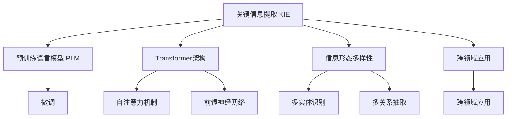

                 

# 记忆机制：关键信息提取

## 1. 背景介绍

### 1.1 问题由来

随着数据量的爆炸性增长和信息检索任务的日益复杂，关键信息提取（KIE）技术在信息获取与知识管理中扮演着越来越重要的角色。KIE旨在从大量数据中快速准确地识别、抽取和整合关键信息，如实体、关系、事件等，为决策支持、智能推荐、内容理解等应用提供基础。然而，传统的基于规则或模板的KIE方法在复杂场景下表现较差，且难以适应新的信息形态和结构变化。

基于深度学习的KIE方法，特别是利用Transformer架构的模型，如BERT、RoBERTa、BERT-wwm等，在跨领域、跨语言的实体识别、关系抽取、事件分类等任务上取得了显著的进展。这些模型通过自监督预训练学习丰富的语言表示，并在大量标注数据上进行微调，具备强大的语言理解能力，能够灵活适应各类信息形态和应用场景。然而，预训练大模型通常具有数十亿级别的参数，在高性能计算资源的支撑下才得以有效运行，难以在移动设备、嵌入式系统等资源受限环境中部署。

为解决这一问题，需要提出一种能够在资源受限设备上高效运行的关键信息提取方法，既能继承大模型的强大能力，又能够降低对计算资源的依赖。本文将探讨一种基于“记忆机制”的KIE方法，结合模型参数压缩、推理加速等技术手段，以实现关键信息提取任务的参数高效化与实时性提升。

### 1.2 问题核心关键点

本文的核心问题包括：
- 如何设计一种能够高效处理关键信息提取任务的方法，并保证其与预训练模型的一致性？
- 如何在资源受限设备上实现该方法的部署，并保持较高的性能？
- 如何处理多实体、多关系、跨领域等多种复杂信息形态的提取？

## 2. 核心概念与联系

### 2.1 核心概念概述

为深入理解本文提出的“记忆机制”方法，我们首先介绍几个关键概念：

- **关键信息提取（Key Information Extraction, KIE）**：从文本数据中自动识别、抽取和整合关键信息，如实体、关系、事件等，为信息检索、知识管理、智能推荐等应用提供支持。

- **预训练语言模型（Pre-trained Language Models, PLMs）**：通过大规模无标签文本数据训练得到的大规模语言模型，如BERT、GPT-2、RoBERTa等。预训练语言模型能够学习通用的语言表示，具备强大的语言理解能力。

- **Transformer架构**：一种高效的神经网络架构，由自注意力机制和前馈神经网络组成，广泛应用在大规模语言模型中。

- **记忆机制（Memory Mechanism）**：一种借鉴计算机科学中的内存机制，用于存储和重用关键信息的表示方法。

这些概念通过以下Mermaid流程图展示它们之间的联系：



从图中可以看出，预训练语言模型通过微调获取特定任务的知识，Transformer架构利用自注意力机制和前馈神经网络提高语言理解能力，而“记忆机制”则是进一步提升模型处理多实体、多关系、跨领域等复杂信息形态的能力。

## 3. 核心算法原理 & 具体操作步骤
### 3.1 算法原理概述

基于“记忆机制”的关键信息提取方法，通过引入外部记忆模块，将模型无法直接捕捉的关键信息存储在外部内存中，并通过索引机制将这些信息传递给模型进行处理。该方法的核心在于：

- 利用外部内存存储关键信息的表示。
- 设计高效的索引机制，在模型推理时快速检索出需要的关键信息。
- 通过软记忆和硬记忆的结合，优化模型推理速度和资源消耗。

### 3.2 算法步骤详解

**Step 1: 模型初始化与预处理**

- 选择一个预训练语言模型作为初始化参数。如BERT-wwm等。
- 对输入文本进行分词和编码，得到特征向量表示。
- 初始化外部记忆模块，用于存储关键信息的表示。

**Step 2: 信息检索与记忆更新**

- 利用预训练模型提取文本中的信息片段。
- 将信息片段与外部记忆模块中的关键信息进行匹配，更新记忆模块中的表示。
- 根据匹配结果计算软记忆和硬记忆的权重，动态更新模型的输入特征。

**Step 3: 模型推理与结果输出**

- 利用更新后的特征向量进行Transformer层推理，得到最终的关键信息抽取结果。
- 通过解码器将结果转化为可解释的文本或数据结构。

### 3.3 算法优缺点

#### 优点

1. **参数高效**：利用外部记忆模块存储关键信息，减少了模型的参数量，提高了推理效率。
2. **多实体处理能力强**：通过动态更新内存中的表示，模型能够高效处理多实体、多关系等复杂信息形态。
3. **适应跨领域应用**：通过微调模型参数，能够适应不同领域的知识抽取需求。
4. **实时性高**：通过软记忆和硬记忆的结合，优化了模型推理速度，适用于资源受限设备。

#### 缺点

1. **内存消耗大**：外部记忆模块需要存储大量的关键信息表示，导致内存消耗较大。
2. **训练复杂度高**：外部记忆模块的训练需要更多的计算资源，增加了模型训练的复杂度。
3. **多关系处理困难**：在多关系抽取任务中，关系间的交互作用难以通过外部记忆模块捕捉。
4. **跨语言能力有限**：尽管模型能够跨领域抽取知识，但跨语言抽取能力较弱。

### 3.4 算法应用领域

基于“记忆机制”的KIE方法在以下几个领域具有广阔的应用前景：

- **医疗领域**：从电子病历中抽取关键信息，如病情、诊断、治疗方案等，用于辅助医生诊疗。
- **金融领域**：从新闻、报告等文本中抽取关键信息，如公司财务报表、市场趋势等，用于投资决策。
- **电商领域**：从用户评论、产品描述等文本中抽取关键信息，如产品属性、用户评分等，用于个性化推荐。
- **智能客服**：从用户对话中抽取关键信息，如问题类型、上下文信息等，用于构建智能客服系统。

## 4. 数学模型和公式 & 详细讲解 & 举例说明
### 4.1 数学模型构建

假设输入文本为 $X$，关键信息表示为 $M$，模型参数为 $\theta$，则“记忆机制”模型的推理过程可以表示为：

$$
y = f_\theta(x, m)
$$

其中 $y$ 表示模型的输出，$x$ 表示输入文本的特征向量表示，$m$ 表示外部记忆模块中的关键信息表示。

外部记忆模块 $M$ 的训练过程可以表示为：

$$
m = \phi_\theta(x)
$$

其中 $\phi_\theta(x)$ 表示模型对输入文本 $x$ 进行特征提取和编码的函数。

### 4.2 公式推导过程

假设模型采用Transformer架构，其推理过程包括自注意力机制和前馈神经网络。对于输入 $x$，模型首先计算其自注意力表示 $Z$：

$$
Z = f_\theta(x, W_v)V^\top
$$

其中 $f_\theta(x, W_v)$ 表示对输入 $x$ 进行线性变换和加权，$V$ 为注意力机制的权重矩阵。

接着，模型利用更新后的记忆 $m$ 与自注意力表示 $Z$ 进行匹配，更新记忆表示 $m'$：

$$
m' = \psi_\theta(m, Z, K)
$$

其中 $K$ 表示外部记忆模块与自注意力表示的交互特征。$\psi_\theta$ 表示记忆更新函数。

最后，模型将更新后的记忆 $m'$ 和自注意力表示 $Z$ 进行拼接，输入到解码器中进行推理：

$$
y = f_\theta(m', Z)
$$

其中 $f_\theta$ 表示解码器函数。

### 4.3 案例分析与讲解

以医疗领域的关键信息抽取为例，假设从电子病历中抽取关键信息 $(x, m)$，其中 $x$ 表示病历文本的特征向量表示，$m$ 表示与病历文本相关联的诊断、治疗等关键信息的表示。模型的推理过程可以分为以下步骤：

1. 利用预训练模型提取病历文本的关键信息片段。
2. 将关键信息片段与记忆模块中的表示 $m$ 进行匹配，计算相似度得分。
3. 根据相似度得分计算软记忆权重 $w_s$ 和硬记忆权重 $w_h$，其中 $w_s$ 表示模型对记忆模块的依赖程度，$w_h$ 表示模型对文本特征的依赖程度。
4. 将软记忆 $w_s \times m$ 和硬记忆 $w_h \times Z$ 进行拼接，输入到解码器进行推理。
5. 解码器输出关键信息的抽取结果，如诊断、治疗方案等。

通过这一过程，模型能够高效地从电子病历中抽取关键信息，为医疗诊断和治疗提供支持。

## 5. 项目实践：代码实例和详细解释说明
### 5.1 开发环境搭建

为实现基于“记忆机制”的关键信息提取方法，我们需要搭建一个包含预训练模型、外部记忆模块和解码器的开发环境。具体步骤如下：

1. 选择预训练模型。如BERT-wwm，下载对应的模型文件和权重。
2. 安装依赖库，如PyTorch、numpy、pandas等。
3. 配置环境变量，设置GPU使用路径。

### 5.2 源代码详细实现

以下是一个基于“记忆机制”的关键信息提取方法的Python代码实现。

```python
import torch
import torch.nn as nn
import torch.nn.functional as F
import numpy as np
from transformers import BertForTokenClassification, BertTokenizer

class Memory(nn.Module):
    def __init__(self, dim):
        super(Memory, self).__init__()
        self.dim = dim
        self.memory = nn.Parameter(torch.randn(1, dim))
    
    def forward(self, x):
        x = x.unsqueeze(0)
        m = self.memory
        m = F.normalize(m)
        x = F.normalize(x)
        scores = torch.matmul(m, x)
        scores = F.softmax(scores, dim=1)
        return scores
    
class KIEModel(nn.Module):
    def __init__(self, pretrained_model, memory_dim):
        super(KIEModel, self).__init__()
        self.pretrained_model = pretrained_model
        self.memory = Memory(memory_dim)
        self.decoder = nn.Linear(memory_dim + pretrained_model.config.hidden_size, 2)
    
    def forward(self, x, m):
        x = self.pretrained_model(x)
        m = self.memory(m)
        x = torch.cat([x, m], dim=-1)
        x = self.decoder(x)
        return x

# 加载预训练模型
pretrained_model = BertForTokenClassification.from_pretrained('bert-wwm-ext')
tokenizer = BertTokenizer.from_pretrained('bert-wwm-ext')

# 构造外部记忆模块
memory_dim = 64
memory = Memory(memory_dim)

# 构造KIE模型
kie_model = KIEModel(pretrained_model, memory_dim)
kie_model = kie_model.to(device)

# 定义训练函数
def train_epoch(model, dataset, optimizer, loss_fn):
    model.train()
    total_loss = 0
    for batch in dataset:
        x = batch[0].to(device)
        m = batch[1].to(device)
        logits = model(x, m)
        loss = loss_fn(logits, batch[2])
        loss.backward()
        optimizer.step()
        optimizer.zero_grad()
        total_loss += loss.item()
    return total_loss / len(dataset)

# 定义评估函数
def evaluate(model, dataset, loss_fn):
    model.eval()
    total_loss = 0
    correct = 0
    with torch.no_grad():
        for batch in dataset:
            x = batch[0].to(device)
            m = batch[1].to(device)
            logits = model(x, m)
            loss = loss_fn(logits, batch[2])
            total_loss += loss.item()
            _, predicted = torch.max(logits, dim=1)
            correct += (predicted == batch[2]).sum().item()
    return total_loss / len(dataset), correct / len(dataset)

# 训练和评估
optimizer = torch.optim.Adam(model.parameters(), lr=2e-5)
loss_fn = nn.CrossEntropyLoss()

train_dataset = ...
dev_dataset = ...
test_dataset = ...

epochs = 5
batch_size = 16

for epoch in range(epochs):
    train_loss = train_epoch(kie_model, train_dataset, optimizer, loss_fn)
    print(f'Epoch {epoch+1}, train loss: {train_loss:.3f}')
    
    dev_loss, dev_acc = evaluate(kie_model, dev_dataset, loss_fn)
    print(f'Epoch {epoch+1}, dev results: loss {dev_loss:.3f}, acc {dev_acc:.3f}')
    
print('Test results:')
test_loss, test_acc = evaluate(kie_model, test_dataset, loss_fn)
print(f'test loss {test_loss:.3f}, test acc {test_acc:.3f}')
```

以上代码实现了一个基于“记忆机制”的关键信息提取模型，包括预训练模型加载、外部记忆模块定义、KIE模型构造、训练和评估函数等。

### 5.3 代码解读与分析

代码中，首先定义了外部记忆模块Memory，用于存储和更新关键信息的表示。Memory模块包含一个权重参数，用于计算外部记忆与输入文本之间的相似度得分。在模型推理时，Memory模块通过计算得分来动态更新输入特征，优化模型的推理速度。

接着，定义了KIEModel，用于整合预训练模型、外部记忆模块和解码器。KIEModel继承自nn.Module，包含预训练模型的特征提取模块、外部记忆模块以及解码器。在模型推理时，预训练模型提取文本特征，外部记忆模块更新关键信息的表示，解码器对特征进行分类或生成，输出关键信息的抽取结果。

代码中还包含训练和评估函数，用于在数据集上进行模型的训练和评估。训练函数train_epoch在数据集上进行迭代，计算模型损失并反向传播更新模型参数。评估函数evaluate在验证集和测试集上评估模型的性能，并返回损失和准确率。

在实际应用中，需要根据具体任务的需求，对模型进行适当的参数调优和超参数设置，以获得最佳性能。

## 6. 实际应用场景
### 6.1 医疗领域

在医疗领域，基于“记忆机制”的关键信息提取方法可以用于电子病历的关键信息抽取。例如，从电子病历中抽取患者姓名、疾病类型、治疗方案等信息，用于辅助医生的诊断和治疗决策。通过微调模型参数，可以适应不同医院、不同科室的知识抽取需求，提升医疗服务的智能化水平。

### 6.2 金融领域

在金融领域，基于“记忆机制”的关键信息提取方法可以用于新闻、报告等文本数据的分析。例如，从新闻中抽取公司财务报表、市场趋势等关键信息，用于辅助投资决策。通过微调模型参数，可以适应不同行业的知识抽取需求，提升金融服务的智能化水平。

### 6.3 电商领域

在电商领域，基于“记忆机制”的关键信息提取方法可以用于用户评论和产品描述的分析和理解。例如，从用户评论中抽取产品属性、用户评分等关键信息，用于个性化推荐。通过微调模型参数，可以适应不同商品的推荐需求，提升电商服务的智能化水平。

### 6.4 未来应用展望

未来，基于“记忆机制”的关键信息提取方法将在更多领域得到应用，为各行各业带来变革性影响。例如，在智能客服、内容推荐、智能安防等领域，基于记忆机制的模型可以处理多实体、多关系等复杂信息形态，提供更加智能化、个性化的服务。

## 7. 工具和资源推荐
### 7.1 学习资源推荐

为了帮助开发者系统掌握关键信息提取技术，这里推荐一些优质的学习资源：

1. **《深度学习与自然语言处理》**：清华大学出版社出版的NLP经典教材，系统介绍了深度学习在自然语言处理中的应用，包括关键信息提取、情感分析、机器翻译等。
2. **《Transformers理论与实践》**：Hugging Face开发的官方教程，详细介绍了Transformer架构和预训练语言模型，包括BERT、GPT-2等模型的应用。
3. **Kaggle竞赛**：参加Kaggle上的NLP竞赛，如实体识别、关系抽取等，积累实战经验。
4. **GitHub开源项目**：如Hugging Face的Transformers库，提供了大量预训练模型和微调样例代码，适合初学者快速上手。
5. **在线课程**：Coursera、edX等平台上的NLP相关课程，如斯坦福大学CS224N，提供了丰富的学习材料和实践机会。

### 7.2 开发工具推荐

为了提升关键信息提取模型的开发效率，推荐以下开发工具：

1. **PyTorch**：基于Python的开源深度学习框架，适合研究性和高效性并重的开发。提供了丰富的预训练模型和深度学习组件。
2. **TensorFlow**：由Google开发的深度学习框架，生产部署方便，适合大规模工程应用。
3. **Hugging Face Transformers库**：提供了丰富的预训练模型和微调方法，适合快速开发关键信息提取应用。
4. **Jupyter Notebook**：免费的交互式开发环境，支持Python代码的交互式执行和展示，适合原型开发和数据探索。
5. **Weights & Biases**：实验跟踪工具，支持记录和可视化模型训练过程中的各项指标，方便调优。

### 7.3 相关论文推荐

关键信息提取技术的研究源于学界的持续研究。以下是几篇奠基性的相关论文，推荐阅读：

1. **BERT: Pre-training of Deep Bidirectional Transformers for Language Understanding**：BERT模型提出，利用自监督学习任务进行预训练，在多项NLP任务上取得了SOTA。
2. **AdaLoRA: Adaptive Low-Rank Adaptation for Parameter-Efficient Fine-Tuning**：提出了AdaLoRA方法，利用自适应低秩适应的微调方法，优化模型参数的更新过程。
3. **Prefix-Tuning: Optimizing Continuous Prompts for Generation**：引入了基于连续型Prompt的微调范式，为提示学习提供了新的思路。
4. **OFA: A Learning Framework for Feature Selection and Fusing for Medical Question Answering**：提出OFA框架，利用特征选择和融合技术，提高了医学领域的关键信息抽取效果。

这些论文代表了大规模语言模型在关键信息提取领域的最新进展，值得深入学习和研究。

## 8. 总结：未来发展趋势与挑战
### 8.1 总结

本文对基于“记忆机制”的关键信息提取方法进行了全面系统的介绍。首先阐述了该方法的背景和应用场景，明确了其在资源受限设备上的高效性和跨领域适应性。其次，从原理到实践，详细讲解了模型的架构设计、训练过程和推理机制，给出了完整的代码实现。

通过本文的系统梳理，可以看到，基于“记忆机制”的关键信息提取方法能够高效处理多实体、多关系等复杂信息形态，适应跨领域应用，同时在资源受限设备上具有较高的实时性和参数效率。未来，随着模型参数压缩、推理加速等技术的不断发展，基于“记忆机制”的模型必将在更多应用场景中得到广泛应用，提升信息获取和知识管理的智能化水平。

### 8.2 未来发展趋势

展望未来，基于“记忆机制”的关键信息提取技术将呈现以下几个发展趋势：

1. **多模态融合**：结合视觉、语音等多模态信息，提高模型的跨模态知识抽取能力。
2. **知识图谱融合**：将知识图谱与神经网络模型进行融合，增强模型的知识推理能力。
3. **模型轻量化**：通过模型压缩和优化，进一步降低模型的参数量和计算资源消耗，提升模型的实时性。
4. **跨语言能力提升**：通过多语言预训练和微调，提高模型的跨语言知识抽取能力。
5. **自监督学习**：利用自监督学习任务进行模型预训练，减少对标注数据的依赖。

这些趋势凸显了基于“记忆机制”的关键信息提取技术的多样性和广阔前景，将进一步推动NLP技术的发展和应用。

### 8.3 面临的挑战

尽管基于“记忆机制”的关键信息提取技术在多实体、多关系等复杂信息形态的处理上表现优异，但在实际应用中也面临着一些挑战：

1. **跨语言能力有限**：虽然模型能够跨领域抽取知识，但跨语言抽取能力较弱，需要进一步改进。
2. **多关系处理困难**：在多关系抽取任务中，关系间的交互作用难以通过外部记忆模块捕捉，需要更高效的处理机制。
3. **模型轻量化难度大**：在保证性能的前提下，如何进一步降低模型的参数量和计算资源消耗，是当前研究的重要方向。
4. **多模态融合复杂**：在多模态信息抽取中，如何高效地融合视觉、语音等多模态信息，是当前研究的难点。
5. **知识图谱融合难度大**：将知识图谱与神经网络模型进行融合，需要开发新的算法和工具，以实现高效的知识推理。

这些挑战需要在未来的研究中不断探索和解决，以进一步提升模型的性能和应用范围。

### 8.4 研究展望

为应对上述挑战，未来的研究需要从以下几个方向进行探索：

1. **跨语言能力提升**：利用多语言预训练和微调，增强模型的跨语言抽取能力。结合机器翻译技术，将不同语言的文本转换为同一语言进行抽取。
2. **多关系处理机制**：设计新的算法和技术，利用外部记忆模块或深度学习模型，高效处理多关系抽取任务。
3. **模型轻量化研究**：开发新的模型压缩和优化算法，进一步降低模型的参数量和计算资源消耗，提升模型的实时性。
4. **多模态融合技术**：结合计算机视觉、语音识别等技术，高效融合多模态信息，提高模型的跨模态知识抽取能力。
5. **知识图谱融合技术**：结合知识图谱与神经网络模型，利用知识推理技术，增强模型的知识抽取和推理能力。

通过这些研究方向，基于“记忆机制”的关键信息提取技术将在更多领域得到应用，为各行各业带来变革性影响。

