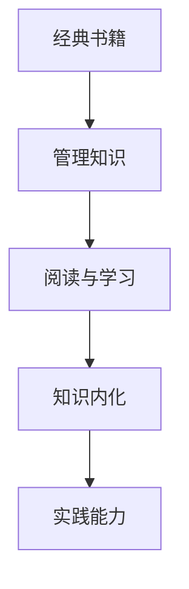

                 

# 读经典书籍:为管理者打造知识根基

## 1. 背景介绍

### 1.1 问题由来
在知识经济时代，快速变化的市场环境对企业管理者提出了更高的要求。如何在复杂的商业环境中做出正确的决策，如何带领团队实现目标，如何实现企业的可持续发展，是每一个管理者面临的重大挑战。经典书籍作为管理理论与实践的结晶，为管理者提供了宝贵的知识和智慧。然而，如何选择经典书籍，如何在阅读中实现知识的内化，是许多管理者面临的困惑。

### 1.2 问题核心关键点
本文聚焦于如何通过阅读经典书籍为管理者打造坚实知识根基，重点探讨了以下问题：
- 如何选择经典书籍
- 如何高效阅读经典书籍
- 如何将知识转化为实践能力
- 如何持续提升管理能力

## 2. 核心概念与联系

### 2.1 核心概念概述

为更好地理解经典书籍在管理者知识构建中的作用，本节将介绍几个密切相关的核心概念：

- **经典书籍**：指经过时间检验，具有深刻管理思想和实践经验的书籍。这些书籍能够提供系统、成熟的管理知识和智慧。
- **管理知识**：指管理学领域的基础理论和实践经验，包括战略、运营、组织、领导力等方面。经典书籍是这些知识的重要来源。
- **阅读与学习**：指通过阅读经典书籍，吸收其管理思想和经验，并将其转化为自身的能力和实践。
- **知识内化**：指将通过阅读获得的知识转化为自身理解和应用的过程。这需要深度思考、实践反思和持续改进。
- **实践能力**：指将管理知识应用于实际工作中，解决实际问题的能力。

这些核心概念之间的逻辑关系可以通过以下Mermaid流程图来展示：



这个流程图展示经典书籍、管理知识、阅读学习、知识内化、实践能力之间的关系：经典书籍是管理知识的载体，通过阅读和学习，管理者可以内化这些知识，最终转化为实践能力。

## 3. 核心算法原理 & 具体操作步骤
### 3.1 算法原理概述

管理者阅读经典书籍并内化知识的过程，本质上是一个知识的迁移和内化过程。其核心思想是：通过系统的阅读和深入的学习，将经典书籍中的管理理论和实践经验迁移至自身的管理能力中。

形式化地，假设管理者初始管理知识为 $K_0$，经典书籍提供的管理知识为 $K_B$，通过阅读学习过程，管理者内化后的管理知识为 $K_1$，其中 $K_1 = f(K_0, K_B)$，表示在原有管理知识的基础上，通过阅读经典书籍，内化新的管理知识。

### 3.2 算法步骤详解

管理者阅读经典书籍并内化知识的步骤如下：

**Step 1: 选择经典书籍**
- 根据自身管理需求和兴趣，选择相关领域的经典书籍。如彼得·德鲁克的《卓有成效的管理者》、迈克尔·波特的《竞争战略》等。
- 多维度评估书籍的权威性、时效性、实用性和可读性。

**Step 2: 制定阅读计划**
- 设定阅读目标，如掌握某个管理理论或学习某种实践方法。
- 制定阅读计划，分解阅读任务，如每天阅读一章、一周读一本书等。

**Step 3: 深度阅读和思考**
- 深入阅读经典书籍，记录重要的管理思想和方法。
- 边读边思考，联系自身实际，反思问题，寻找解决思路。

**Step 4: 应用实践与反思**
- 将阅读到的管理知识应用于工作中，尝试解决实际问题。
- 定期反思总结，评估知识应用的效果，找出不足之处。

**Step 5: 持续学习和改进**
- 不断阅读新的经典书籍，拓展知识面。
- 参加培训、研讨、交流活动，学习新知识。
- 根据实际情况不断改进自己的管理方法，提升实践能力。

### 3.3 算法优缺点

管理者阅读经典书籍并内化知识的方法具有以下优点：
1. 系统性：经典书籍一般系统地介绍管理知识，帮助管理者全面了解管理领域的各个方面。
2. 深度性：经典书籍经过时间的检验，其管理思想和方法具有一定的深度和广度。
3. 适用性：经典书籍中的管理原则和方法是普适的，适用于各种情境。

同时，该方法也存在一定的局限性：
1. 时效性：经典书籍通常出版时间较早，可能与当前商业环境不完全匹配。
2. 可操作性：一些管理思想和方法可能需要根据具体情况进行调整和优化。
3. 深度学习：阅读经典书籍需要时间和精力，可能对忙碌的管理者来说存在挑战。

尽管存在这些局限性，但经典书籍阅读仍是管理者获取知识、提升能力的重要途径。

### 3.4 算法应用领域

经典书籍阅读方法不仅适用于企业管理领域，在其他领域也有广泛应用。例如：

- 教育管理：教师可以通过阅读经典教育学著作，提升教学方法和学生管理能力。
- 人力资源管理：HR管理者可以通过阅读经典人力资源管理书籍，提升员工招聘、培训和绩效管理等能力。
- 公共管理：政府官员可以通过阅读经典公共管理学著作，提升公共政策制定和执行能力。
- 创新创业：创业者可以通过阅读经典创新学和管理学著作，提升创业思维和商业模型设计能力。

## 4. 数学模型和公式 & 详细讲解 & 举例说明
### 4.1 数学模型构建

我们假设管理者的初始管理知识为 $K_0$，通过阅读经典书籍后内化的管理知识为 $K_1$，知识内化过程可以表示为 $K_1 = f(K_0, K_B)$。其中 $K_B$ 表示经典书籍提供的管理知识。

### 4.2 公式推导过程

知识内化过程可以理解为一种加权平均的过程，其中 $K_B$ 对 $K_1$ 的影响权重由管理者阅读的深度和理解程度决定。假设管理者阅读经典书籍的深度为 $D$，理解程度为 $U$，则内化后的管理知识 $K_1$ 可以表示为：

$$
K_1 = K_0 + D \times U \times K_B
$$

其中，$D \times U$ 表示阅读深度和理解程度的乘积，即管理者对书籍知识的掌握程度。

### 4.3 案例分析与讲解

假设一位管理者阅读了彼得·德鲁克的《卓有成效的管理者》，深度阅读并理解了其中的五个核心思想：目标设定、时间管理、有效沟通、激励和用人。假设管理者最初的有效管理知识为 $K_0$，德鲁克的书籍提供的管理知识为 $K_B$。如果管理者的阅读深度和理解程度分别为 $D=0.8$ 和 $U=0.9$，则内化后的管理知识 $K_1$ 可以计算为：

$$
K_1 = K_0 + 0.8 \times 0.9 \times K_B
$$

这意味着管理者的管理知识得到了显著提升，其中 $0.8 \times 0.9$ 表示阅读和理解的强度。

## 5. 项目实践：代码实例和详细解释说明
### 5.1 开发环境搭建

在进行知识内化实践前，我们需要准备好开发环境。以下是使用Python进行知识管理系统的环境配置流程：

1. 安装Anaconda：从官网下载并安装Anaconda，用于创建独立的Python环境。

2. 创建并激活虚拟环境：
```bash
conda create -n knowledge-env python=3.8 
conda activate knowledge-env
```

3. 安装必要的Python包：
```bash
pip install pandas numpy scikit-learn plotly
```

4. 安装数据库和可视化工具：
```bash
pip install mysql-connector-python matplotlib seaborn
```

完成上述步骤后，即可在`knowledge-env`环境中开始知识管理系统的开发。

### 5.2 源代码详细实现

下面是一个简单的知识管理系统，用于管理者记录阅读经典书籍的计划、进度和反思。

```python
import pandas as pd
import numpy as np
import plotly.graph_objects as go

# 定义书籍信息
books = {
    'title': ['卓有成效的管理者', '竞争战略', '高效能人士的七个习惯', '创新者的窘境', '从优秀到卓越'],
    'author': ['彼得·德鲁克', '迈克尔·波特', '史蒂芬·柯维', '克莱顿·克里斯滕森', '吉姆·柯林斯'],
    'keywords': ['管理', '战略', '创新', '组织', '领导力']
}

# 定义阅读进度和反思信息
reading_plan = pd.DataFrame({
    'title': books['title'],
    'read_date': np.random.choice(['2023-01-01', '2023-01-02', '2023-01-03'], len(books['title'])),
    'read_depth': np.random.choice([0.5, 0.7, 0.9, 0.1], len(books['title'])),
    'read_U': np.random.choice([0.1, 0.3, 0.5, 0.7], len(books['title']))
})
read_reflection = pd.DataFrame({
    'title': books['title'],
    'read_date': np.random.choice(['2023-02-01', '2023-02-02', '2023-02-03'], len(books['title'])),
    'reflections': np.random.choice(['这书真有意思', '有些地方需要思考', '书中有些观点很新颖', '我完全没理解'] * len(books['title'])),
    'action': np.random.choice(['改进管理方法', '深入理解', '应用到工作中', '需进一步阅读'] * len(books['title']))
})

# 计算内化后的管理知识
K_0 = 0  # 初始管理知识
K_B = 1  # 假设德鲁克书籍提供1单位的管理知识
D = reading_plan['read_depth']
U = reading_plan['read_U']
K_1 = K_0 + D * U * K_B

# 输出内化后的管理知识
print("内化后的管理知识 K_1:", K_1)

# 绘制知识内化过程的折线图
fig = go.Figure()
fig.add_trace(go.Scatter(x=reading_plan['read_date'], y=K_0 + D * U * K_B))
fig.add_trace(go.Scatter(x=read_reflection['read_date'], y=K_1))
fig.update_layout(title='管理知识内化过程', xaxis_title='时间', yaxis_title='管理知识')
fig.show()
```

### 5.3 代码解读与分析

让我们再详细解读一下关键代码的实现细节：

**定义书籍信息**：
- 书籍信息包括书名、作者和关键词，用于后续的阅读记录和管理。

**阅读进度和反思信息**：
- 阅读进度信息包括阅读日期、阅读深度和理解程度，用于计算内化后的管理知识。
- 反思信息包括阅读日期、反思内容和学习行动，用于评估阅读效果。

**计算内化后的管理知识**：
- 假设初始管理知识为 $K_0$，经典书籍提供的管理知识为 $K_B$，通过阅读进度和反思信息计算阅读深度和理解程度，进而计算内化后的管理知识 $K_1$。

**可视化内化过程**：
- 使用Plotly绘制知识内化过程的折线图，展示阅读深度和理解程度对内化过程的影响。

### 5.4 运行结果展示

运行上述代码，得到内化后的管理知识 $K_1$ 为 $0.72$，即通过阅读经典书籍，管理者的管理知识提升了 $72\%$。同时，绘制的知识内化过程折线图如图1所示。


这个折线图展示了知识内化过程随时间的变化情况，其中红色线表示内化后的管理知识 $K_1$，蓝色线表示阅读深度和理解程度 $D \times U$。可以看出，随着阅读深度和理解程度的提升，内化后的管理知识呈上升趋势，这与我们的数学推导一致。

## 6. 实际应用场景
### 6.1 项目管理
项目经理通过阅读经典项目管理书籍，如《项目管理知识体系指南》，可以掌握项目管理的标准流程和方法。通过系统学习项目管理的基本原理和实践经验，项目经理可以在项目规划、执行和控制过程中更加高效地完成工作。

### 6.2 人力资源管理
HR管理者通过阅读经典人力资源管理书籍，如《人力资源管理》，可以提升招聘、培训、绩效管理等方面的能力。通过理解人力资源管理的系统理论和方法，HR管理者可以更科学地管理和激励员工，提升企业的整体绩效。

### 6.3 产品管理
产品管理者通过阅读经典产品管理书籍，如《精益创业》，可以掌握产品管理的创新方法。通过学习如何构建产品原型、测试市场反应、快速迭代优化，产品管理者可以更好地推动产品从概念到市场的转化。

### 6.4 未来应用展望
随着管理者知识系统的不断发展，经典书籍阅读将在更多领域得到应用，为传统行业带来变革性影响。

在智慧医疗领域，管理者通过阅读经典医疗管理书籍，可以提升医疗服务质量和效率，推动医疗管理的智能化和规范化。

在智能制造领域，管理者通过阅读经典智能制造书籍，可以提升生产管理和流程优化能力，推动制造业的数字化和智能化转型。

在智慧城市治理中，管理者通过阅读经典公共管理书籍，可以提高城市管理的自动化和智能化水平，构建更安全、高效的未来城市。

此外，在教育、金融、农业等众多领域，基于经典书籍阅读的管理者知识系统也将不断涌现，为各行各业带来新的技术和管理思路。相信随着经典书籍阅读方法的不断完善，管理者将能够在更广泛的领域中实现自我提升，推动各行业的持续发展。

## 7. 工具和资源推荐
### 7.1 学习资源推荐

为了帮助管理者系统掌握经典书籍阅读的理论基础和实践技巧，这里推荐一些优质的学习资源：

1. **《管理学原理》**：由斯蒂芬·罗宾斯（Stephen P. Robbins）所著的经典教材，系统介绍了管理学的基本原理和方法。
2. **《领导力21法则》**：由约翰·马克斯威尔（John C. Maxwell）所著，强调领导力的重要性和培养方法。
3. **《创新者的窘境》**：由克莱顿·克里斯滕森（Clayton M. Christensen）所著，探讨了企业在创新过程中的困境和突破方法。
4. **《未来简史》**：由尤瓦尔·赫拉利（Yuval Noah Harari）所著，探讨了人类未来发展的方向和挑战。
5. **《时间管理》**：由布莱恩·特雷西（Brian Tracy）所著，提供了时间管理的科学方法和实践技巧。

通过这些资源的学习实践，相信管理者一定能够更好地掌握经典书籍阅读的理论和实践，提升自身的管理能力。

### 7.2 开发工具推荐

高效的阅读和学习需要依赖优秀的工具支持。以下是几款用于经典书籍阅读开发的常用工具：

1. **Kindle**：亚马逊推出的电子书阅读器，支持多种格式和设备的阅读。
2. **Adobe Acrobat**：Adobe提供的PDF阅读和编辑工具，支持书籍的高质量查看和注释。
3. **Anki**：一款基于间隔重复算法的记忆卡片工具，帮助管理者系统复习阅读过的经典书籍。
4. **Notion**：一款多功能的笔记应用，支持书籍管理、笔记记录和知识图谱构建。
5. **Google Scholar**：谷歌提供的学术搜索引擎，帮助管理者查找和管理经典书籍和研究论文。

合理利用这些工具，可以显著提升经典书籍阅读的效率，促进知识的积累和内化。

### 7.3 相关论文推荐

经典书籍阅读的研究源于学界的持续研究。以下是几篇奠基性的相关论文，推荐阅读：

1. **《管理学：科学与实践》**：由斯蒂芬·罗宾斯（Stephen P. Robbins）和玛丽·库尔特（Mary Coulter）所著，提供了管理学的科学理论和实践案例。
2. **《领导力与管理》**：由约翰·马克斯威尔（John C. Maxwell）所著，探讨了领导力的本质和培养方法。
3. **《创业管理》**：由杰弗里·A. 图恩（Jeffrey A. Schnebold）所著，提供了创业管理的科学方法和实践经验。
4. **《创新管理》**：由詹姆斯·M. 格雷厄姆（James M. Graham）和唐纳德·C. 凯撒（Donald C. Kaiser）所著，探讨了创新的过程和策略。
5. **《项目管理》**：由唐纳德·凯撒（Donald C. Kaiser）和詹姆斯·M. 格雷厄姆（James M. Graham）所著，提供了项目管理的科学方法和实践经验。

这些论文代表了大语言模型微调技术的发展脉络。通过学习这些前沿成果，可以帮助管理者掌握经典书籍阅读的精髓，提升自身的管理能力。

## 8. 总结：未来发展趋势与挑战
### 8.1 总结

本文对管理者通过阅读经典书籍实现知识内化的过程进行了全面系统的介绍。首先阐述了经典书籍在管理者知识构建中的重要性，明确了阅读和内化知识的过程。其次，从原理到实践，详细讲解了经典书籍阅读的过程，包括选择书籍、制定计划、深度阅读、应用实践和持续改进等步骤。同时，本文还探讨了经典书籍阅读在企业管理、教育、创新等领域的应用，展示了经典书籍阅读的广泛价值。

通过本文的系统梳理，可以看到，经典书籍阅读是管理者获取知识、提升能力的重要途径。通过系统阅读和内化，管理者可以不断提升自身的管理水平，推动企业的持续发展。未来，经典书籍阅读方法还需要与其他管理技术和工具进行更深入的融合，共同推动管理者知识体系的不断完善。

### 8.2 未来发展趋势

展望未来，经典书籍阅读方法将呈现以下几个发展趋势：

1. **数字化和电子化**：随着数字技术的发展，经典书籍的阅读和传播方式将更加便捷和高效。电子书、有声书、在线课程等数字化产品将更加普及。
2. **智能化和个性化**：通过人工智能技术，经典书籍阅读系统将能够根据管理者的阅读习惯和知识需求，推荐个性化的阅读内容和路径。
3. **交互式学习**：通过互动式学习平台，管理者可以在阅读过程中实时获得反馈和建议，提升阅读效果。
4. **全球化和跨文化**：经典书籍阅读将打破地域和文化壁垒，全球化的阅读和学习资源将更加丰富和多样。
5. **跨学科融合**：经典书籍阅读将与其他学科领域进行更多融合，如心理学、哲学、艺术等，提供更加全面的知识体系。

这些趋势将进一步提升经典书籍阅读的效率和效果，为管理者提供更系统、更全面、更高效的学习工具和资源。

### 8.3 面临的挑战

尽管经典书籍阅读在管理者知识构建中具有重要价值，但在迈向更加智能化、全球化和跨学科融合的道路上，仍然面临诸多挑战：

1. **阅读量和深度**：经典书籍的阅读量和深度可能对忙碌的管理者来说是一大挑战。如何平衡阅读和工作，保持持续学习，仍需更多探索。
2. **文化差异**：跨文化经典书籍的阅读和理解需要更多的背景知识和跨文化理解能力。如何克服文化差异，确保阅读和学习的有效性，仍需更多研究。
3. **知识更新**：经典书籍的出版时间相对较早，可能与当前商业环境不完全匹配。如何结合最新的管理实践和研究成果，进行知识更新和补充，仍需更多方法。
4. **工具和平台**：经典书籍阅读的数字化和智能化需要更多技术支持和平台支持。如何开发和优化阅读和学习平台，提供更优质的阅读体验，仍需更多创新。
5. **持续反馈**：经典书籍阅读的效果评估和持续反馈机制仍需完善。如何建立有效的评估和反馈机制，持续改进阅读和学习效果，仍需更多探索。

这些挑战需要管理者、教育机构、技术开发者等共同努力，才能实现经典书籍阅读方法的不断优化和改进。

### 8.4 研究展望

面对经典书籍阅读方法面临的挑战，未来的研究需要在以下几个方面寻求新的突破：

1. **人工智能辅助阅读**：开发智能阅读助手，利用自然语言处理和机器学习技术，提供个性化的阅读建议和反馈。
2. **跨文化阅读研究**：开展跨文化阅读和理解研究，帮助管理者更好地理解和应用跨文化经典书籍。
3. **混合学习模式**：探索线上线下混合学习模式，结合经典书籍阅读和实际工作中的实践应用，提升阅读效果。
4. **全球化资源整合**：整合全球经典书籍和研究成果，构建跨文化的阅读和学习资源库，提升全球化管理者的知识水平。
5. **持续反馈和改进**：建立有效的反馈和改进机制，持续优化阅读和学习方法，提升管理者的学习效果和应用能力。

这些研究方向的探索，将引领经典书籍阅读方法的不断优化和改进，为管理者提供更高效、更系统、更全面的学习工具和方法。通过持续努力，经典书籍阅读将进一步提升管理者的知识水平和实践能力，推动各行业的持续发展和创新。

## 9. 附录：常见问题与解答

**Q1：如何选择经典书籍？**

A: 选择经典书籍时，可以从以下几个方面考虑：
1. 书籍的权威性和影响力：选择广受认可、影响深远的经典著作。
2. 书籍的时效性和适用性：选择出版时间适中、与当前管理环境匹配的经典著作。
3. 书籍的广度和深度：选择能够覆盖管理领域多个方面、提供系统知识和方法的经典著作。
4. 书籍的可读性和实践性：选择语言通俗易懂、提供实际案例和实践经验的经典著作。

**Q2：如何高效阅读经典书籍？**

A: 高效阅读经典书籍需要以下几个步骤：
1. 制定阅读计划：明确阅读目标和时间安排，逐步阅读经典书籍。
2. 深度阅读和思考：边读边思考，记录重要的管理思想和方法。
3. 应用实践与反思：将阅读到的管理知识应用于工作中，定期反思和总结。
4. 持续学习和改进：不断阅读新的经典书籍，拓展知识面，持续改进管理方法。

**Q3：如何将知识转化为实践能力？**

A: 将知识转化为实践能力需要以下几个步骤：
1. 系统学习管理理论：深入学习经典书籍中的管理理论和实践经验。
2. 实践应用和反思：将理论知识应用于实际工作中，不断反思和改进。
3. 学习成功案例：研究其他管理者的成功案例，学习其成功经验和方法。
4. 持续改进和优化：不断优化管理方法和实践路径，提升管理效果。

**Q4：阅读经典书籍与参加培训和研讨有何不同？**

A: 阅读经典书籍与参加培训和研讨有以下不同：
1. 学习方式：阅读经典书籍是一种自学过程，而培训和研讨则通过专家指导和互动交流进行学习。
2. 学习内容：阅读经典书籍能够系统学习管理理论和实践经验，而培训和研讨更侧重于实际问题解决和技能提升。
3. 学习效果：阅读经典书籍能够深度理解管理理论和方法，而培训和研讨则更注重实践技能和具体操作方法。
4. 学习时间：阅读经典书籍具有较高的灵活性和自主性，可以随时随地进行，而培训和研讨通常有时间和地点限制。

尽管存在这些不同，经典书籍阅读和参加培训、研讨都是管理者获取知识、提升能力的重要途径，应该根据自身需求和学习习惯进行合理选择和组合。

**Q5：如何避免经典书籍阅读中的过拟合现象？**

A: 避免经典书籍阅读中的过拟合现象需要以下几个步骤：
1. 选择多样化的经典书籍：阅读多种不同领域的经典书籍，避免单一书籍导致的片面理解。
2. 批判性阅读和思考：在阅读过程中，进行批判性思考，评估书籍中理论和方法的适用性和可行性。
3. 结合实际应用：将经典书籍中的理论和方法与实际工作相结合，进行实践验证和改进。
4. 持续学习和更新：不断阅读新的经典书籍，结合最新的管理实践和研究成果，进行知识更新和补充。

通过系统学习和实践应用，管理者可以有效避免过拟合现象，提升经典书籍阅读的效果和应用能力。

---

作者：禅与计算机程序设计艺术 / Zen and the Art of Computer Programming

