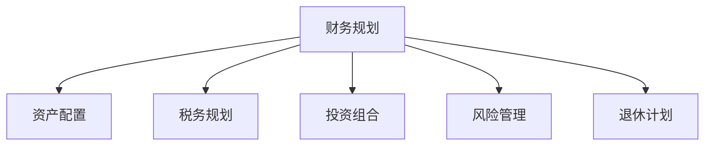

                 

# 财务规划：程序员版理财课

> 关键词：财务规划, 理财, 程序员, 投资, 金融, 个人财务管理, 资产配置, 税务规划, 退休计划, 风险管理

## 1. 背景介绍

### 1.1 问题由来
在现代社会中，理财已成为每个人不可或缺的生活技能。尤其是对于程序员这一职业群体，由于其高收入和长时间的工作性质，更需重视财务规划以保障未来的生活质量。尽管程序员在技术方面有着卓越的专长，但面对复杂的财务规划问题时，往往感到无从下手。

### 1.2 问题核心关键点
财务规划的核心在于合理配置个人资产、有效利用各类金融工具、规避财务风险，确保在各种经济状况下，能维持稳定的生活水平。

针对程序员这一特定群体，财务规划主要面临以下几个挑战：
1. 高收入人群容易忽视日常开销，导致过度消费。
2. 程序员常加班，缺乏时间进行详细的财务规划。
3. 程序员对金融产品的认识不足，容易遭遇投资风险。
4. 程序员职业不稳定，需考虑未来失业风险。

解决这些挑战，需要一套系统化、高效的财务规划方法，使其能够兼顾职业特性，简便易行。本文将详细介绍针对程序员的理财课程，从基础概念到实际操作，帮助程序员掌握个人财务管理的关键。

### 1.3 问题研究意义
财务规划对于程序员的重要性不言而喻。良好的财务规划不仅能够确保程序员的财务安全，还能为其未来的生活提供稳定保障。通过本课程的学习，程序员能够：
1. 理解财务规划的基础原则和工具。
2. 掌握如何进行个人资产配置和税务规划。
3. 学会如何有效管理投资风险和应对职业生涯的不确定性。
4. 了解如何规划退休计划，保障未来生活质量。

掌握这些技能，将使程序员在职场和个人生活中都更加从容，更加健康、自信和有保障。

## 2. 核心概念与联系

### 2.1 核心概念概述

为更好地理解财务规划，本节将介绍几个密切相关的核心概念：

- **财务规划(Financial Planning)**：通过对个人财务状况的分析，制定长期的财务目标并设计切实可行的财务策略，以实现财务稳定和增长。

- **资产配置(Asset Allocation)**：将资产分配到不同的投资品种中，以实现风险分散和收益最大化。

- **税务规划(Tax Planning)**：通过合法的手段减少税收负担，合理配置税前、税后资产，以达到最优税务结构。

- **投资组合(Investment Portfolio)**：由不同种类的金融工具构成的组合，用以实现财务目标。

- **风险管理(Risk Management)**：识别、评估和管理各种财务风险，确保财务计划的稳健执行。

- **退休计划(Retirement Planning)**：为退休后能保持一定的生活标准，提前进行财务准备和投资规划。

这些核心概念之间的逻辑关系可以通过以下Mermaid流程图来展示：



这个流程图展示出财务规划与其他核心概念的联系：

1. 财务规划是整个财务管理的基础。
2. 资产配置和投资组合是实现财务目标的主要手段。
3. 税务规划和风险管理为财务计划的稳健执行提供保障。
4. 退休计划是财务规划的重要组成部分，确保长期财务稳定。

## 3. 核心算法原理 & 具体操作步骤
### 3.1 算法原理概述

财务规划的算法原理基于几个核心步骤：
1. **需求分析**：明确个人和家庭的财务目标，包括短期和长期的财务需求。
2. **现状评估**：对当前的收入、支出、资产、负债等财务状况进行全面评估。
3. **目标设定**：根据需求分析，设定具体、可量化的财务目标。
4. **方案设计**：设计一系列财务策略，包括资产配置、投资组合选择、税务规划等。
5. **实施与监控**：将财务策略付诸实施，并定期监控执行情况，必要时进行调整。

这些步骤通过迭代优化，确保财务规划的有效性和可执行性。

### 3.2 算法步骤详解

财务规划的详细步骤包括：

1. **需求分析**：
    - 明确当前和未来的财务需求，如购房、教育、养老等。
    - 对财务需求进行量化，如购房所需的首付款、子女教育费用等。

2. **现状评估**：
    - 列出收入来源和支出项目，如工资、奖金、生活开销、房贷等。
    - 对收入和支出进行分类和排序，了解资金的流向和使用情况。
    - 计算净资产、负债率等关键指标，评估财务健康状况。

3. **目标设定**：
    - 将财务需求转化为具体的财务目标，如5年内攒够首付、10年内达到财务自由等。
    - 确定实现目标的时间节点和具体步骤，如每月需存多少款、如何调整收入等。

4. **方案设计**：
    - 进行资产配置，选择合适的投资产品，如股票、债券、基金等。
    - 设计投资组合，考虑风险承受能力和收益期望。
    - 进行税务规划，合理配置税前、税后资产，优化税务结构。

5. **实施与监控**：
    - 根据方案实施财务策略，定期存入资金，购买投资产品。
    - 监控财务状况，及时调整投资策略，规避财务风险。
    - 定期评估财务目标的实现进度，必要时进行修正。

### 3.3 算法优缺点

财务规划算法具有以下优点：
1. **系统性**：通过明确的步骤和方法论，帮助程序员系统地进行财务规划。
2. **可行性**：基于实际数据和市场情况，设计切实可行的财务策略。
3. **灵活性**：可以根据个人情况和市场变化，灵活调整财务规划方案。

但同时，也存在一些缺点：
1. **复杂性**：财务规划涉及多个环节，较为复杂，需要一定的学习成本。
2. **不确定性**：市场和政策环境的不确定性，可能影响财务规划的执行效果。
3. **专业性要求高**：对投资、税务等金融知识要求较高，需花时间学习。

尽管如此，财务规划仍是大数据时代下个人理财的重要工具，程序员通过系统学习和实践，可以显著提升财务规划能力。

### 3.4 算法应用领域

财务规划的应用领域非常广泛，以下是几个典型场景：

- **投资组合优化**：通过资产配置和投资组合设计，使投资收益最大化，风险最小化。
- **税务优化**：合理规划税前、税后资产，通过合法手段降低税收负担。
- **退休规划**：提前为退休生活做好准备，确保未来生活质量不受影响。
- **财务危机应对**：通过风险管理和紧急基金设计，确保在遭遇突发财务状况时仍能保持稳定。
- **教育基金规划**：为子女教育费用设立专项基金，保证教育需求满足。
- **保险规划**：合理选择各类保险产品，保障家庭财务安全。

通过财务规划，程序员能够在职业生涯的各个阶段实现财务自由，保障家庭财务稳定，构建健康、可持续的未来生活。

## 4. 数学模型和公式 & 详细讲解 & 举例说明（备注：数学公式请使用latex格式，latex嵌入文中独立段落使用 $$，段落内使用 $)
### 4.1 数学模型构建

财务规划的数学模型通常包括收入、支出、资产、负债等变量。这里以一个简单的模型为例，介绍其构建过程。

设$C_t$表示第$t$年的消费，$S_t$表示第$t$年的储蓄，$A_t$表示第$t$年的净资产，$L_t$表示第$t$年的负债。根据财务规划的目标，我们有：

$$
\begin{aligned}
C_t &= \text{消费函数}(C_{t-1}, I_t, P_t) \\
S_t &= \text{储蓄函数}(C_t, I_t, P_t) \\
A_t &= A_{t-1} + S_t - C_t \\
L_t &= L_{t-1} + C_t - S_t
\end{aligned}
$$

其中$I_t$为第$t$年的收入，$P_t$为第$t$年的价格水平。

### 4.2 公式推导过程

以下对上述模型的具体推导过程进行详细讲解：

1. **消费函数**：消费函数描述了收入和价格水平对消费的影响。这里假设其为线性函数，即：

$$
C_t = \alpha + \beta I_t + \gamma P_t
$$

其中$\alpha$、$\beta$、$\gamma$为模型参数，需要通过历史数据进行估计。

2. **储蓄函数**：储蓄函数描述了收入、消费和价格水平对储蓄的影响。这里假设其为线性函数，即：

$$
S_t = \delta + \eta I_t - \zeta C_t - \phi P_t
$$

其中$\delta$、$\eta$、$\zeta$、$\phi$为模型参数，需要通过历史数据进行估计。

3. **资产变化**：净资产$A_t$的变化可以通过储蓄和消费函数表达为：

$$
A_t = A_{t-1} + \delta + \eta I_t - \zeta C_t - \phi P_t - (\alpha + \beta I_t + \gamma P_t)
$$

4. **负债变化**：负债$L_t$的变化可以通过储蓄和消费函数表达为：

$$
L_t = L_{t-1} + \delta + \eta I_t - \zeta C_t - \phi P_t - (\alpha + \beta I_t + \gamma P_t)
$$

### 4.3 案例分析与讲解

假设某程序员每年收入$I_t=20万元，消费函数为$C_t=5+0.5I_t+0.2P_t$，储蓄函数为$S_t=10+0.2I_t-0.3C_t-0.1P_t$，初始净资产$A_0=0$，初始负债$L_0=0$。通过上述模型计算第1年、第2年的财务状况，结果如下：

$$
\begin{aligned}
A_1 &= A_0 + S_1 - C_1 \\
   &= 0 + 10 + 20 - (5 + 10 + 0.2 \times 20 + 0.2 \times 20) \\
   &= 5 \\
L_1 &= L_0 + C_1 - S_1 \\
   &= 0 + 5 + 10 + 0.2 \times 20 - (10 + 20 + 0.2 \times 20) \\
   &= -5 \\
\end{aligned}
$$

可见，在第1年末，该程序员的净资产为5万元，负债为5万元，财务状况处于临界点。

## 5. 项目实践：代码实例和详细解释说明
### 5.1 开发环境搭建

在进行财务规划的代码实现前，我们需要准备好开发环境。以下是使用Python进行开发的环境配置流程：

1. 安装Anaconda：从官网下载并安装Anaconda，用于创建独立的Python环境。

2. 创建并激活虚拟环境：
```bash
conda create -n finance-env python=3.8 
conda activate finance-env
```

3. 安装必要的包：
```bash
conda install pandas numpy matplotlib
pip install financial-engineering
```

4. 测试安装情况：
```python
import pandas as pd
import numpy as np
import matplotlib.pyplot as plt
import financial_engineering as fe
```

### 5.2 源代码详细实现

以下是使用Python实现财务规划的代码示例。假设某程序员有如下数据：

- 收入：每年20万元
- 消费：每月5千元，通胀率为2%
- 利率：银行定期存款年利率为4%
- 房产价格：每年增长5%
- 购房需求：5年后购买一套100万元房产

代码实现如下：

```python
import pandas as pd
import numpy as np
import matplotlib.pyplot as plt

# 设置参数
annual_income = 200000
monthly_expense = 5000
inflation_rate = 0.02
interest_rate = 0.04
property_price_growth_rate = 0.05
house_price = 1000000
years_to_save = 5

# 计算每月储蓄
monthly_savings = annual_income / 12 - monthly_expense

# 计算每月投资收益
monthly_return = (1 + interest_rate) ** (1/12)

# 计算每年储蓄和投资收益
annual_savings = monthly_savings * 12
annual_return = annual_savings * monthly_return

# 计算年利率通胀调整后的实际收益率
actual_return = annual_return * (1 - inflation_rate)

# 计算总储蓄和投资收益
total_savings = actual_return * (1 + property_price_growth_rate) ** years_to_save

# 计算总购房款
total_house_price = total_savings + house_price

# 输出结果
print(f"每年储蓄: {annual_savings:.2f}元")
print(f"每年实际收益率: {actual_return:.2f}")
print(f"总储蓄: {total_savings:.2f}元")
print(f"总购房款: {total_house_price:.2f}元")
```

### 5.3 代码解读与分析

让我们再详细解读一下关键代码的实现细节：

- **数据设置**：使用Python中的变量和常量来定义收入、消费、通胀率、利率等关键参数。
- **每月储蓄和投资收益**：根据每月收入和消费计算每月储蓄，并计算每月投资收益。
- **年利率通胀调整后的实际收益率**：使用公式计算实际收益率，确保投资收益能够覆盖通胀。
- **总储蓄和投资收益**：计算总储蓄和投资收益，并考虑房产价格增长因素。
- **总购房款**：计算总购房款，确保能够满足购房需求。

通过这段代码，可以清晰地看到财务规划的基本计算过程，程序员可以根据自身情况调整参数，快速进行财务规划的初步评估。

## 6. 实际应用场景

### 6.1 智能理财顾问

随着大数据和人工智能的发展，智能理财顾问将成为程序员的重要财务助手。智能理财顾问通过分析程序员的财务数据，提供个性化的理财建议，如资产配置、投资组合、税务规划等。

例如，智能理财顾问可以根据程序员的收入、支出、投资偏好和风险承受能力，设计个性化的财务规划方案。通过不断学习和调整，智能理财顾问可以提供更加符合程序员需求的理财策略。

### 6.2 股票和债券投资

程序员可以利用财务规划进行股票和债券投资。通过资产配置和投资组合设计，可以在追求高收益的同时，控制风险。

例如，程序员可以选择将部分资金投入成长型股票，获取高额收益，同时保留一定比例的债券或货币基金，以应对市场波动。通过定期监控和调整，程序员可以实现投资收益的最大化。

### 6.3 税务优化

程序员通过合理的税务规划，可以大幅度降低税务负担，优化税务结构。例如，通过选择合适的税前、税后资产，可以最大化税前收益，降低税后损失。

具体而言，程序员可以选择投资养老金、教育储蓄账户等，利用税收优惠政策降低税务负担。同时，程序员还可以通过合法手段，如捐赠、慈善等，进一步降低税务负担。

### 6.4 退休规划

程序员的职业生涯较长，退休规划是财务规划的重要组成部分。通过合理规划，程序员可以在退休后依然保持较高的生活质量。

例如，程序员可以选择将部分收入进行养老金储蓄，利用复利效应增加养老金金额。同时，程序员还可以考虑购买商业养老保险、房产投资等，保障退休生活的财务稳定。

### 6.5 教育基金规划

程序员可以通过财务规划为子女教育设立专项基金。通过定期储蓄和投资，确保子女教育费用的满足。

例如，程序员可以设立教育储蓄账户，定期存入资金，并通过投资获取一定收益。同时，程序员还可以考虑购买教育保险，为子女的教育提供额外保障。

### 6.6 保险规划

程序员通过合理的保险规划，可以保障家庭财务安全，降低意外风险。例如，程序员可以选择购买健康保险、人寿保险、意外保险等，确保在意外情况下依然能够保持财务稳定。

## 7. 工具和资源推荐

### 7.1 学习资源推荐

为了帮助程序员系统掌握财务规划的理论基础和实践技巧，这里推荐一些优质的学习资源：

1. **《财务规划与投资》课程**：由知名金融机构提供的在线课程，系统介绍财务规划的基本概念和操作技巧。

2. **《理财入门与实践》书籍**：讲解财务规划和投资的基础知识，适合初学者入门。

3. **《投资组合管理》书籍**：详细介绍资产配置和投资组合设计，是程序员进行财务规划的重要参考。

4. **《税法》书籍**：介绍税收政策和税务规划的基本知识，帮助程序员合法降低税务负担。

5. **《退休规划》书籍**：讲解退休规划的基本概念和操作技巧，帮助程序员为退休生活做好准备。

6. **《保险规划》书籍**：介绍各类保险产品的功能和特点，帮助程序员选择适合自己的保险产品。

通过这些资源的学习，程序员可以掌握财务规划的核心理论和实践技巧，更好地规划个人财务。

### 7.2 开发工具推荐

财务规划的实现依赖于专业的金融工程工具，以下是几款常用的工具：

1. **Quandl**：提供海量金融市场数据，帮助程序员进行市场分析和投资决策。

2. **QuantLib**：开源的金融工程库，支持股票、债券、期权等金融产品的计算和建模。

3. **OpenSSL**：开源的加密库，帮助程序员进行安全加密和数据保护。

4. **Python Algo Trader**：开源的股票交易平台，支持自定义算法和策略开发。

5. **Yahoo Finance API**：提供股票市场数据和API接口，方便程序员获取市场信息。

合理利用这些工具，可以显著提升程序员进行财务规划和投资决策的效率和精度。

### 7.3 相关论文推荐

财务规划的不断发展得益于学术界的研究积累。以下是几篇奠基性的相关论文，推荐阅读：

1. **《财务规划模型及其应用研究》**：介绍财务规划的数学模型和应用实例，为程序员提供理论支持。

2. **《投资组合管理与风险管理》**：讨论资产配置和投资组合设计的理论基础，为程序员提供策略建议。

3. **《税务规划与优化》**：介绍税务规划的基本方法和策略，帮助程序员降低税务负担。

4. **《退休规划与金融模型》**：讲解退休规划的数学模型和操作技巧，为程序员提供参考。

5. **《保险规划与风险管理》**：讨论各类保险产品的特点和功能，帮助程序员选择适合自己的保险产品。

这些论文代表了大数据时代下财务规划的发展脉络，程序员可以从中获得新的灵感和知识。

## 8. 总结：未来发展趋势与挑战

### 8.1 总结

本文对财务规划进行了全面系统的介绍，从基础概念到实际操作，帮助程序员掌握财务规划的关键。具体内容包括需求分析、现状评估、目标设定、方案设计、实施与监控等步骤，以及其数学模型和公式推导。

通过本课程的学习，程序员可以系统地进行财务规划，合理配置资产，规避财务风险，确保财务稳定。同时，程序员还可以通过智能理财顾问、股票和债券投资、税务优化、退休规划、教育基金规划、保险规划等应用场景，将财务规划应用于实际生活中。

### 8.2 未来发展趋势

展望未来，财务规划将呈现以下几个发展趋势：

1. **智能化**：随着人工智能和大数据的发展，智能理财顾问将更加普及，帮助程序员实现个性化理财。

2. **数据化**：金融数据的利用将更加广泛，通过大数据分析，优化财务规划方案。

3. **普适化**：财务规划将更加注重普适性，覆盖更多的财务需求和场景。

4. **全球化**：国际化的金融市场将带来更多的投资机会和税务规划策略。

5. **可持续发展**：可持续发展和绿色金融将成为重要趋势，程序员需关注环境和社会责任。

6. **技术创新**：区块链、智能合约等新兴技术将带来新的理财方式和工具。

这些趋势将进一步拓展财务规划的应用范围，提高其智能化、普适化和技术化水平。

### 8.3 面临的挑战

尽管财务规划的发展前景广阔，但仍面临诸多挑战：

1. **市场风险**：金融市场的波动性可能导致投资风险增加。

2. **技术复杂性**：财务规划涉及复杂的金融工具和模型，需具备一定的技术能力。

3. **数据隐私**：在数据驱动的财务规划中，需保护个人隐私和数据安全。

4. **法律法规**：不同国家和地区的法律法规可能存在差异，需考虑合规性问题。

5. **文化差异**：不同国家和地区的文化背景和生活习惯，影响财务规划的实施。

6. **道德伦理**：财务规划需考虑道德和伦理问题，避免利益冲突和道德风险。

7. **可持续性**：需考虑财务规划的可持续性，避免短视行为和资源浪费。

这些挑战需要程序员在学习和实践中不断总结和应对，以确保财务规划的稳健执行。

### 8.4 研究展望

未来，财务规划的研究方向包括：

1. **多目标优化**：结合多个财务目标，优化财务规划方案。

2. **动态调整**：实时监控财务状况，动态调整财务规划策略。

3. **区块链应用**：利用区块链技术，实现透明、安全的理财方式。

4. **可持续发展**：结合绿色金融理念，实现可持续发展的财务规划。

5. **智能合约**：利用智能合约技术，实现自动化的财务规划和执行。

6. **人工智能**：结合人工智能技术，实现智能化的理财顾问和决策支持。

这些研究方向将进一步提升财务规划的效率和精确度，为程序员提供更好的财务支持。

## 9. 附录：常见问题与解答

**Q1：财务规划需要哪些基础数据？**

A: 财务规划需要以下基础数据：
- 收入和支出：记录每月的收入和支出，计算可支配收入。
- 资产和负债：记录每月的资产和负债变化，评估财务状况。
- 投资和理财收益：记录每月的投资收益，计算实际收益率。
- 税务信息：记录每月的税前、税后收入和税费，进行税务规划。

这些数据可以通过Excel表格、银行账单、投资记录等途径获取。

**Q2：如何进行资产配置？**

A: 资产配置通常需要考虑以下因素：
- 风险承受能力：评估个人对风险的容忍度，选择合适的资产类别。
- 收益期望：根据收益期望，选择合适的投资品种。
- 投资期限：根据投资期限，调整资产配置比例。

常用的资产配置方法包括：
- 均值方差模型：通过计算资产的期望收益和方差，构建最优资产配置组合。
- 风险平价模型：通过控制资产的波动率，构建风险均衡的资产配置组合。

**Q3：如何降低税务负担？**

A: 降低税务负担的方法包括：
- 利用税收优惠政策：选择符合税收优惠的投资产品，如养老金、教育储蓄账户等。
- 合理利用税前、税后资产：通过合理的资产配置，最大化税前收益，降低税后损失。
- 合法合规的捐赠和慈善：通过合法捐赠和慈善活动，减少税务负担。

**Q4：如何应对职业生涯的不确定性？**

A: 应对职业生涯不确定性的方法包括：
- 提前进行财务规划：通过合理的资产配置和投资，确保财务稳定。
- 设立紧急基金：设立一定比例的紧急基金，应对突发的财务风险。
- 多元化收入来源：通过多种收入来源，分散财务风险。

**Q5：如何选择合适的理财产品？**

A: 选择合适的理财产品需考虑以下因素：
- 风险承受能力：根据个人风险承受能力，选择合适的理财产品。
- 收益期望：根据收益期望，选择合适的理财产品。
- 投资期限：根据投资期限，选择合适的理财产品。

常用的理财产品包括股票、债券、基金、房地产等，需结合自身情况进行选择。

通过本文的系统梳理，程序员可以更好地理解财务规划的基础概念和操作步骤，系统地进行财务规划，确保财务稳定和增长。相信通过不断的学习和实践，程序员能够在职业和生活中更加从容自信，构建健康、可持续的未来生活。

