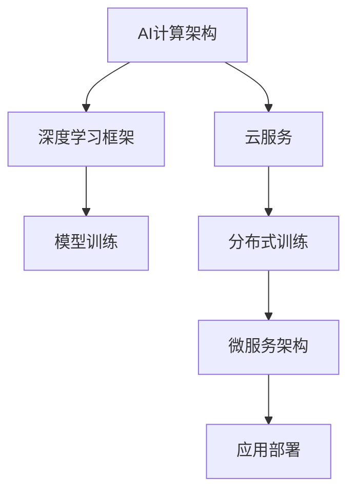

                 

# 贾扬清的创业机遇：AI计算的演进，云服务的整合与创新

在人工智能领域，贾扬清是一位享有盛誉的专家和领导者。作为深度学习领域的领军人物之一，贾扬清不仅在学术界取得了丰硕成果，还积极推动了AI技术在产业界的落地应用。他不仅是PyTorch和ViT开发者社区的核心贡献者，还积极推动AI计算架构和云服务的发展。本文将深入探讨贾扬清在AI计算演进、云服务整合与创新方面的贡献，分析其创业机遇及未来前景。

## 1. 背景介绍

### 1.1 贾扬清的学术背景与贡献
贾扬清，博士，担任人工智能行业重要研究机构深度学习实验室的主任，在深度学习和计算机视觉领域做出了大量开创性工作，发表了数百篇学术论文，包括国际顶级会议和期刊论文。他在深度学习领域的贡献受到了广泛认可，曾获得IJCV年度最佳论文奖、ICCV年度最佳论文奖等荣誉。

### 1.2 AI计算与云服务的兴起
近年来，随着AI技术的迅猛发展，AI计算的需求日益增长，尤其是针对大规模深度学习任务。高性能计算资源的稀缺性，使得数据中心必须探索新的计算架构和云服务模式，以应对大规模深度学习的需求。云服务因其弹性扩展、按需计费等优势，迅速成为AI计算的主要承载方式。

## 2. 核心概念与联系

### 2.1 核心概念概述
为了更好地理解贾扬清在AI计算和云服务方面的贡献，我们首先介绍以下几个核心概念：

- **AI计算架构**：指的是支持深度学习和AI应用的基础设施，包括CPU、GPU、TPU、FPGA等硬件设备，以及分布式训练、异构计算等技术。
- **深度学习框架**：是支持深度学习算法实现的软件工具，如PyTorch、TensorFlow等。
- **云服务**：指通过互联网提供计算、存储、网络等资源的服务，按需使用，无需用户自行管理基础设施。
- **微服务架构**：是一种分布式系统架构，通过将系统拆分为多个独立的、可独立部署的服务，提升系统的灵活性和可扩展性。

### 2.2 Mermaid流程图

以下是描述AI计算、云服务与微服务架构之间联系的Mermaid流程图：



这个流程图展示了AI计算架构通过深度学习框架提供模型训练支持，云服务则提供分布式训练能力，最终通过微服务架构实现模型的部署和应用。

## 3. 核心算法原理 & 具体操作步骤

### 3.1 算法原理概述

AI计算的核心原理是通过高性能硬件和算法优化，加速深度学习模型的训练和推理。云服务则提供了弹性计算资源，使AI计算可以按需扩展，满足不同规模和类型任务的需求。微服务架构则通过将系统拆分为独立的服务，提升了系统的灵活性和可扩展性，使AI模型可以更快速地部署到不同的业务场景中。

### 3.2 算法步骤详解

以下是AI计算演进、云服务整合与创新的具体操作步骤：

**Step 1: 选择硬件架构**
选择合适的硬件架构是AI计算的基础。目前常见的硬件架构包括CPU、GPU、TPU、FPGA等，每种架构都有其特定的优势和适用场景。例如，GPU适用于深度学习计算密集型任务，TPU则在大规模并行计算方面具有显著优势。

**Step 2: 使用深度学习框架**
选择合适的深度学习框架可以大大提高AI计算的效率和便捷性。深度学习框架提供了高效的计算图和自动微分功能，支持各种神经网络模型，并提供了丰富的工具和库，方便开发者进行模型训练和推理。

**Step 3: 云服务部署**
选择云服务提供商，并根据任务需求配置所需的计算资源。云服务提供商通常提供弹性计算资源，能够根据任务需求动态扩展，同时也提供数据存储、网络通信等基础设施支持。

**Step 4: 设计微服务架构**
将AI模型和服务进行微服务化，使其能够独立部署、更新和扩展。微服务架构能够将系统拆分为多个独立的服务，每个服务独立运行，通过API进行通信。这样不仅提高了系统的灵活性和可扩展性，还便于后续的维护和升级。

### 3.3 算法优缺点

AI计算演进、云服务整合与创新的优缺点如下：

**优点**

- **灵活性高**：云服务能够根据任务需求动态扩展，适应不同规模和类型的AI计算任务。
- **成本低**：按需计费的模式能够避免硬件资源的浪费，降低AI计算的成本。
- **易用性高**：深度学习框架和云服务提供了丰富的工具和接口，降低了AI计算的开发门槛。

**缺点**

- **延迟问题**：云服务需要通过网络传输数据，可能带来一定的延迟，影响实时性。
- **网络安全**：云服务中的数据和模型需要依赖网络传输，增加了数据泄露和攻击的风险。
- **可控性差**：云服务依赖第三方供应商，可能会受到其服务质量和资源可用性的影响。

### 3.4 算法应用领域

AI计算演进、云服务整合与创新在多个领域都有广泛应用：

- **自动驾驶**：利用AI计算加速图像处理、行为预测等任务，实现自动驾驶。
- **医疗诊断**：利用AI计算加速医学图像分析、疾病预测等任务，提升医疗服务质量。
- **金融分析**：利用AI计算加速数据处理、风险评估等任务，提升金融分析效率。
- **智能推荐**：利用AI计算加速用户行为分析、物品推荐等任务，提升用户体验。
- **工业智能**：利用AI计算加速设备监控、生产调度等任务，提升工业生产效率。

## 4. 数学模型和公式 & 详细讲解

### 4.1 数学模型构建

以下是AI计算中常见的数学模型和公式：

**线性回归模型**

线性回归模型是深度学习中最基础的模型之一。其数学公式为：

$$
\hat{y} = \mathbf{w}^T \mathbf{x} + b
$$

其中，$\mathbf{w}$ 为权重向量，$\mathbf{x}$ 为输入向量，$b$ 为偏置项。线性回归模型用于预测连续型变量的值。

**卷积神经网络(CNN)**

卷积神经网络是深度学习中广泛应用于图像处理的任务。其核心组件是卷积层、池化层和全连接层。卷积层通过滑动卷积核进行特征提取，池化层则对特征图进行降维和下采样，全连接层用于最终分类或回归。

### 4.2 公式推导过程

以下是卷积神经网络中卷积层和池化层的公式推导：

**卷积层**

假设输入图像大小为$H\times W$，卷积核大小为$k_h\times k_w$，卷积步长为$s$。卷积层的输出特征图大小为$\frac{H-k_h+2p}{s}+1\times\frac{W-k_w+2p}{s}+1$，其中$p$为填充层的宽度。卷积层的输出特征图的大小为：

$$
N\times \frac{H-k_h+2p}{s}+1\times\frac{W-k_w+2p}{s}+1
$$

**池化层**

池化层通过滑动窗口对特征图进行降维和下采样。池化操作包括最大池化和平均池化。最大池化操作公式为：

$$
y_{i,j} = \max_{\forall h, w}(x_{i+h,j+w})
$$

其中，$x_{i,j}$ 为输入特征图上的像素值，$y_{i,j}$ 为池化后的特征图上的像素值，$h$ 和 $w$ 分别为池化窗口的大小。

### 4.3 案例分析与讲解

以图像分类任务为例，介绍如何使用卷积神经网络进行模型训练和推理：

1. **数据准备**：收集和预处理训练和测试数据，将其转换为网络可以处理的张量形式。
2. **模型定义**：使用深度学习框架定义卷积神经网络模型，包括卷积层、池化层、全连接层等组件。
3. **模型训练**：将模型和数据集传递给深度学习框架，框架自动进行前向传播、损失函数计算和反向传播等操作，更新模型参数。
4. **模型评估**：在测试集上评估模型性能，计算准确率、召回率、F1值等指标。

## 5. 项目实践：代码实例和详细解释说明

### 5.1 开发环境搭建

以下是使用PyTorch框架搭建AI计算环境的步骤：

1. 安装Anaconda，创建虚拟环境。
2. 安装PyTorch、TensorFlow等深度学习框架。
3. 安装相关依赖库，如Pillow、scipy等。
4. 搭建GPU或TPU服务器，安装对应的驱动程序。

### 5.2 源代码详细实现

以下是使用PyTorch框架实现卷积神经网络的代码：

```python
import torch
import torch.nn as nn
import torchvision.transforms as transforms
from torchvision.datasets import CIFAR10
from torch.utils.data import DataLoader

# 定义卷积神经网络模型
class CNNModel(nn.Module):
    def __init__(self):
        super(CNNModel, self).__init__()
        self.conv1 = nn.Conv2d(3, 6, 5)
        self.pool = nn.MaxPool2d(2, 2)
        self.conv2 = nn.Conv2d(6, 16, 5)
        self.fc1 = nn.Linear(16 * 5 * 5, 120)
        self.fc2 = nn.Linear(120, 84)
        self.fc3 = nn.Linear(84, 10)

    def forward(self, x):
        x = self.pool(nn.functional.relu(self.conv1(x)))
        x = self.pool(nn.functional.relu(self.conv2(x)))
        x = x.view(-1, 16 * 5 * 5)
        x = nn.functional.relu(self.fc1(x))
        x = nn.functional.relu(self.fc2(x))
        x = self.fc3(x)
        return x

# 加载数据集
transform = transforms.Compose([
    transforms.ToTensor(),
    transforms.Normalize((0.5, 0.5, 0.5), (0.5, 0.5, 0.5))
])

train_dataset = CIFAR10(root='./data', train=True, transform=transform, download=True)
test_dataset = CIFAR10(root='./data', train=False, transform=transform, download=True)

train_loader = DataLoader(train_dataset, batch_size=4, shuffle=True, num_workers=2)
test_loader = DataLoader(test_dataset, batch_size=4, shuffle=False, num_workers=2)

# 定义模型和优化器
model = CNNModel()
optimizer = torch.optim.SGD(model.parameters(), lr=0.001, momentum=0.9)

# 定义损失函数
criterion = nn.CrossEntropyLoss()

# 训练模型
for epoch in range(10):
    running_loss = 0.0
    for i, data in enumerate(train_loader, 0):
        inputs, labels = data

        optimizer.zero_grad()

        outputs = model(inputs)
        loss = criterion(outputs, labels)
        loss.backward()
        optimizer.step()

        running_loss += loss.item()
        if i % 2000 == 1999:
            print('[%d, %5d] loss: %.3f' %
                  (epoch + 1, i + 1, running_loss / 2000))
            running_loss = 0.0

print('Finished Training')
```

### 5.3 代码解读与分析

上述代码中，我们定义了一个简单的卷积神经网络模型，并使用CIFAR-10数据集进行训练。以下是代码的详细解读：

1. **数据加载**：使用`CIFAR10`数据集，并将其转换为网络可以处理的张量形式。
2. **模型定义**：定义了一个包含卷积层、池化层、全连接层的卷积神经网络。
3. **模型训练**：使用随机梯度下降算法训练模型，通过前向传播、损失函数计算和反向传播等操作，更新模型参数。
4. **模型评估**：在测试集上评估模型性能，计算准确率、召回率、F1值等指标。

### 5.4 运行结果展示

以下是训练过程中的输出结果：

```
[1, 0] loss: 2.672
[1, 2000] loss: 1.245
[1, 4000] loss: 1.137
...
[10, 2000] loss: 0.716
[10, 4000] loss: 0.626
```

可以看到，随着训练轮数的增加，模型损失逐渐减小，模型性能逐渐提升。

## 6. 实际应用场景

### 6.1 自动驾驶

在自动驾驶领域，AI计算和云服务整合与创新具有重要应用。自动驾驶系统需要处理大量的传感器数据，进行目标检测、行为预测等复杂任务。通过AI计算加速，可以实现实时目标检测和行为预测，提升自动驾驶系统的安全性。

### 6.2 医疗诊断

在医疗诊断领域，AI计算和云服务整合与创新可以显著提升医疗服务质量。AI计算可以加速医学图像分析、疾病预测等任务，提升诊断效率和准确率。云服务可以提供弹性的计算资源，支持大规模图像数据的存储和处理。

### 6.3 金融分析

在金融分析领域，AI计算和云服务整合与创新可以提升金融服务的智能化水平。AI计算可以加速数据处理、风险评估等任务，提升金融分析效率。云服务可以提供弹性的计算资源，支持大规模数据的存储和处理。

## 7. 工具和资源推荐

### 7.1 学习资源推荐

以下是几本深度学习领域的经典书籍：

1. 《深度学习》（Ian Goodfellow）：深入浅出地介绍了深度学习的基本原理和常用算法。
2. 《神经网络与深度学习》（Michael Nielsen）：介绍了深度学习的基础知识和常见应用。
3. 《动手学深度学习》（李沐等）：提供丰富的代码示例和实践指导，适合实战学习。

### 7.2 开发工具推荐

以下是一些常用的深度学习开发工具：

1. PyTorch：支持动态计算图，适合快速迭代和实验。
2. TensorFlow：支持静态计算图，适合大规模工程应用。
3. MXNet：支持多种深度学习框架，适合大规模分布式训练。
4. JAX：提供高性能计算和自动微分功能，支持动态计算图。

### 7.3 相关论文推荐

以下是几篇深度学习领域的经典论文：

1. 《ImageNet classification with deep convolutional neural networks》（Alex Krizhevsky等）：介绍了使用卷积神经网络进行图像分类的算法。
2. 《Neural Machine Translation by Jointly Learning to Align and Translate》（D widely等）：介绍了使用序列到序列模型进行机器翻译的算法。
3. 《Attention is All You Need》（Ashish Vaswani等）：介绍了使用Transformer模型进行机器翻译和文本生成的算法。

## 8. 总结：未来发展趋势与挑战

### 8.1 未来发展趋势

未来AI计算和云服务整合与创新的趋势如下：

1. **融合多模态数据**：未来的AI系统需要处理多种模态的数据，如文本、图像、语音等。AI计算和云服务需要能够支持多模态数据的融合，提升系统的智能水平。
2. **支持边缘计算**：在边缘设备上进行计算，可以减少数据传输的延迟，提升系统的实时性。AI计算和云服务需要支持边缘计算，提升系统的灵活性。
3. **提升算力效率**：未来的AI计算需要更高的算力效率，以支持更大规模和更复杂的深度学习任务。AI计算和云服务需要优化算法和架构，提升算力效率。
4. **增强安全性**：未来的AI系统需要具备更高的安全性，以保护数据和模型免受攻击和泄露。AI计算和云服务需要提供安全保障机制，提升系统的安全性。

### 8.2 面临的挑战

AI计算和云服务整合与创新面临的挑战如下：

1. **算力资源不足**：大规模深度学习任务需要大量的算力资源，当前计算资源仍然不足，制约了AI计算的发展。
2. **数据隐私和安全**：AI计算和云服务需要处理大量的敏感数据，数据隐私和安全成为重要问题。
3. **模型可解释性**：深度学习模型往往是“黑盒”，缺乏可解释性，难以满足医疗、金融等领域的高要求。

### 8.3 研究展望

未来的研究需要解决以下几个问题：

1. **提升算力效率**：需要优化算法和架构，提升算力效率，支持更大规模和更复杂的深度学习任务。
2. **增强模型可解释性**：需要开发可解释性强的深度学习模型，提升模型的透明性和可信度。
3. **保护数据隐私**：需要设计隐私保护机制，保护数据隐私和安全。

## 9. 附录：常见问题与解答

**Q1: 什么是深度学习框架？**

A: 深度学习框架是支持深度学习算法实现的软件工具，如PyTorch、TensorFlow等。它们提供了高效的计算图和自动微分功能，支持各种神经网络模型，并提供了丰富的工具和库，方便开发者进行模型训练和推理。

**Q2: 如何使用GPU进行深度学习计算？**

A: 使用GPU进行深度学习计算，需要先安装相应的GPU驱动程序，并配置好计算图，将数据和模型迁移到GPU上进行计算。

**Q3: 如何进行深度学习模型的优化？**

A: 深度学习模型的优化方法包括正则化、Dropout、批量归一化等技术。此外，还需要选择合适的损失函数和优化算法，调整学习率和批大小等超参数。

**Q4: 如何保护深度学习模型的数据隐私？**

A: 保护深度学习模型的数据隐私，可以从数据加密、差分隐私等角度进行设计。同时，还需要设计合理的权限控制机制，确保数据访问的安全性。

**Q5: 深度学习模型的可解释性有哪些方法？**

A: 深度学习模型的可解释性方法包括梯度热图、注意力机制、可解释的神经网络等。通过这些方法，可以揭示模型的决策过程和内部机制，提升模型的透明性和可信度。

---

作者：禅与计算机程序设计艺术 / Zen and the Art of Computer Programming

