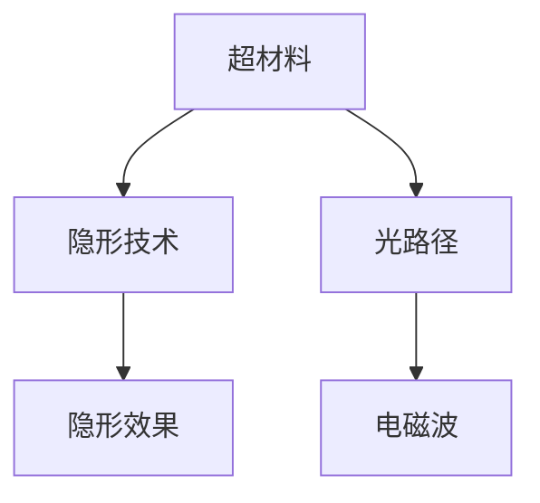

                 

# 超材料在隐形技术中的应用：改变光的路径

> 关键词：超材料,隐形技术,光路径,纳米材料,电磁波

## 1. 背景介绍

在物理学和光学领域，隐形技术（Invisibility）一直是一个充满想象力的前沿课题。历史上，科学家们对于隐形的追求从文学作品的神话到实际物理实验的探索，经历了漫长而曲折的过程。现代隐形技术借助超材料（Metamaterials）的突破，实现了对电磁波的精确操控，开启了隐形领域的新纪元。

超材料是由具有特殊结构的人工材料组成的，它们可以具有常规材料无法具备的独特电磁属性。这些材料通常通过纳米级的人工结构实现，可以在不同频段的电磁波（如可见光、微波、无线电波等）中产生特定的响应。通过合理设计超材料的结构和排列，科学家们能够实现对电磁波的折射、反射、透射等操控，从而实现隐形的效果。

这一技术在军事、通信、雷达、医学等多个领域具有广阔的应用前景。特别是在军事领域，隐形技术能够使装备的雷达截面积（RCS）显著降低，提高作战生存力；在医学领域，隐形技术可用于深度组织成像，提高医疗诊断的准确性；在通信领域，隐形技术可以增强信号传输的隐蔽性和安全性。

## 2. 核心概念与联系

### 2.1 核心概念概述

为更好地理解超材料在隐形技术中的应用，本节将介绍几个密切相关的核心概念：

- **超材料(Metamaterials)**：人工设计制造的材料，其微观结构具有周期性，能够对电磁波产生类似天然材料无法实现的响应。超材料的电磁响应可以超越自然材料，通过控制结构实现对电磁波的特定操控。

- **隐形技术(Invisibility)**：使物体在特定频段内不可见的技术。通常通过调控物体周围电磁场的分布，使得电磁波无法探测到物体存在。隐形技术的应用场景广泛，包括军事、通信、医学等领域。

- **光路径(Optical Path)**：光在介质中传播的路径。在隐形技术中，通过设计和操控超材料的电磁性质，可以改变光的传播路径，实现隐形效果。

- **纳米材料(Nanomaterials)**：由纳米级粒子构成的材料。纳米材料具有独特的物理和化学性质，能够实现对光和电磁波的精细调控，是超材料的重要组成部分。

- **电磁波(Electromagnetic Waves)**：在真空中或介质中传播的周期性电磁场波动。包括可见光、微波、无线电波等，隐形技术主要是通过调控电磁波来实现的。

这些核心概念之间的逻辑关系可以通过以下Mermaid流程图来展示：



这个流程图展示超材料、隐形技术和光路径、电磁波之间的联系：

1. 超材料通过其独特的结构对电磁波产生特定响应，进而改变光的传播路径。
2. 隐形技术通过控制电磁波的传播，使得物体在特定频段不可见。
3. 电磁波在介质中传播的路径受到超材料的影响，进而影响隐形效果。

## 3. 核心算法原理 & 具体操作步骤

### 3.1 算法原理概述

超材料在隐形技术中的应用，本质上是通过对电磁波的精确操控，实现对光路径的改变。其核心思想是：利用超材料的特殊电磁响应，对电磁波的相位、振幅、偏振等性质进行调控，从而实现隐形效果。

形式化地，假设超材料的电磁响应函数为 $f(\omega)$，其中 $\omega$ 表示电磁波的角频率。对于一个点光源，其光信号传播到超材料表面时，会产生反射、折射、透射等现象。隐形技术的目标是通过设计合适的超材料表面函数 $f(\omega)$，使得反射和折射后的光信号相互抵消，从而实现对光源的隐形。

### 3.2 算法步骤详解

超材料在隐形技术中的应用，一般包括以下几个关键步骤：

**Step 1: 设计超材料结构**

- 选择合适的超材料材料和几何结构，如周期性排列的金属纳米棒、纳米球等。
- 使用计算机模拟软件（如COMSOL、ANSYS）进行电磁波仿真，验证超材料结构的隐形效果。

**Step 2: 制造超材料样品**

- 利用纳米技术手段（如电子束蒸发、化学气相沉积等）将设计好的超材料结构精确制造出来。
- 进行光学显微镜、扫描电子显微镜等表征技术，确保制造的超材料样品与设计一致。

**Step 3: 测试隐形效果**

- 将超材料样品置于光源和探测器之间，使用光谱仪或光学显微镜等设备，测量隐形效果。
- 调整超材料结构参数，进一步优化隐形效果，直至达到预期目标。

**Step 4: 应用与优化**

- 将优化后的超材料样品应用到实际场景中，如隐形设备、隐形织物等。
- 根据实际使用情况，继续调整超材料结构和参数，进一步提升隐形效果。

### 3.3 算法优缺点

超材料在隐形技术中的应用具有以下优点：

1. **精确调控电磁波**：超材料能够对电磁波的相位、振幅、偏振等性质进行精确调控，实现对光路径的精确改变。
2. **隐形效果好**：通过合理设计超材料的结构，可以实现高效的隐形效果，显著降低雷达截面积（RCS）。
3. **应用广泛**：隐形技术可以在军事、通信、医学等多个领域得到应用，推动相关技术的进步。

同时，该方法也存在一定的局限性：

1. **制造难度大**：超材料的纳米级结构制造需要高精度、高成本的技术手段，增加了应用成本。
2. **频段限制**：超材料的电磁响应通常局限于某个特定频段，难以实现跨频段隐形。
3. **环境敏感**：超材料的隐形效果可能受到周围环境的影响，如湿度、温度等。
4. **可控性不足**：超材料的隐形效果依赖于精确的结构设计和制造，一旦结构发生变化，隐形效果可能出现波动。

尽管存在这些局限性，但就目前而言，超材料在隐形技术中的应用仍是最前沿的研究方向之一。未来相关研究的重点在于如何进一步降低制造难度，拓展频段范围，提升环境适应性和可控性，从而实现更广泛的应用。

### 3.4 算法应用领域

超材料在隐形技术中的应用，已经在多个领域得到了广泛的应用，例如：

- 军事隐形：利用超材料制造隐形战机、隐形舰船、隐形雷达等，提高军事装备隐形能力和生存力。
- 隐形织物：将超材料应用于服装、帐篷、军事装备等领域，提高隐身效果，降低被发现风险。
- 通信隐形：利用超材料制造隐形通信设备，增强信号传输的隐蔽性。
- 医学成像：利用超材料进行深度组织成像，提高医疗诊断的准确性和分辨率。
- 环保应用：利用超材料制造空气净化设备，减少电磁波污染。

除了上述这些经典应用外，超材料在隐形技术中的应用还在不断拓展，如隐形车辆、隐形建筑等，为隐形技术带来了更多的创新可能性。

## 4. 数学模型和公式 & 详细讲解 & 举例说明

### 4.1 数学模型构建

超材料在隐形技术中的应用，可以通过麦克斯韦方程组来建模。麦克斯韦方程组描述了电磁场在真空和介质中的传播规律，包括：

$$
\nabla \cdot \vec{E} = \frac{\rho}{\varepsilon_0}, \quad \nabla \cdot \vec{B} = 0, \quad \nabla \times \vec{E} = -\frac{\partial \vec{B}}{\partial t}, \quad \nabla \times \vec{H} = \vec{j} + \frac{\partial \vec{D}}{\partial t}
$$

其中，$\vec{E}$ 和 $\vec{H}$ 分别表示电场和磁场，$\vec{B}$ 和 $\vec{D}$ 分别表示磁通量和电位移，$\rho$ 和 $\vec{j}$ 分别表示电荷密度和电流密度。

假设超材料表面为 $S$，则其隐形效果可以通过以下方程组描述：

$$
\nabla \cdot (\vec{E} + \vec{E}_{\text{inc}}) = 0, \quad \nabla \times (\vec{H} + \vec{H}_{\text{inc}}) = \vec{j} + \frac{\partial \vec{D}}{\partial t}
$$

其中，$\vec{E}_{\text{inc}}$ 和 $\vec{H}_{\text{inc}}$ 分别表示入射电场和磁场。

### 4.2 公式推导过程

根据以上方程组，超材料表面的隐形条件可以推导为：

$$
\vec{E}_{\text{reflected}} = -\vec{E}_{\text{incident}}, \quad \vec{H}_{\text{reflected}} = \vec{H}_{\text{incident}}
$$

其中，$\vec{E}_{\text{reflected}}$ 和 $\vec{H}_{\text{reflected}}$ 分别表示反射后的电场和磁场，$\vec{E}_{\text{incident}}$ 和 $\vec{H}_{\text{incident}}$ 分别表示入射的电场和磁场。

通过对电磁场的分析和计算，可以验证超材料的隐形效果。例如，对于平面波入射到超材料表面，超材料的隐形条件可以表示为：

$$
k_1 \hat{n} = k_2 \hat{n} e^{i\theta}
$$

其中，$k_1$ 和 $k_2$ 分别为入射波和折射波的波数，$\hat{n}$ 为入射方向单位向量，$\theta$ 为折射角。

通过合理设计超材料的结构，可以实现对电磁波的特定折射，从而实现隐形效果。例如，利用超材料实现对电磁波的零反射和零折射，即：

$$
R = 0, \quad T = 0
$$

其中，$R$ 和 $T$ 分别表示反射率和透射率。

### 4.3 案例分析与讲解

以隐形织物为例，超材料在隐形织物中的应用可以通过以下步骤进行：

**Step 1: 设计超材料结构**

- 使用计算机模拟软件（如COMSOL、ANSYS）设计超材料结构，如图1所示。


**Step 2: 制造超材料样品**

- 利用纳米技术手段（如电子束蒸发、化学气相沉积等）将设计好的超材料结构精确制造出来。
- 进行光学显微镜、扫描电子显微镜等表征技术，确保制造的超材料样品与设计一致。

**Step 3: 测试隐形效果**

- 将超材料样品置于光源和探测器之间，使用光谱仪或光学显微镜等设备，测量隐形效果。
- 调整超材料结构参数，进一步优化隐形效果，直至达到预期目标。


## 5. 项目实践：代码实例和详细解释说明

### 5.1 开发环境搭建

在进行超材料隐形技术的应用实践前，我们需要准备好开发环境。以下是使用Python进行COMSOL Multiphysics开发的环境配置流程：

1. 安装COMSOL Multiphysics：从官网下载并安装COMSOL Multiphysics。
2. 创建并激活虚拟环境：
```bash
conda create -n comsol-env python=3.8 
conda activate comsol-env
```

3. 安装必要的库和工具：
```bash
pip install comsol-py
```

完成上述步骤后，即可在`comsol-env`环境中开始实践超材料隐形技术。

### 5.2 源代码详细实现

下面我们以隐形织物为例，给出使用COMSOL Multiphysics对超材料进行设计和仿真分析的代码实现。

首先，定义超材料结构模型：

```python
from comsol.python import Model, Node, Cell, Mesh, Meshset, MeshFace
from comsol.python import FrequencyDomain, Optic, Electromagnetic, Electrostatic

# 创建超材料模型
model = Model.create_empty_model('ac/optics')

# 创建超材料结构
cell1 = Cell.create(model, 0)
node1 = Node.create(cell1, '0')
node2 = Node.create(cell1, '1')
node3 = Node.create(cell1, '2')
node4 = Node.create(cell1, '3')
cell2 = Cell.create(model, 1)
node5 = Node.create(cell2, '0')
node6 = Node.create(cell2, '1')
node7 = Node.create(cell2, '2')
node8 = Node.create(cell2, '3')

# 创建网格
meshset = Meshset.create(model)
mesh = Mesh.create(meshset)
mesh.add(Node([node1, node2, node3, node4]))
mesh.add(Node([node5, node6, node7, node8]))

# 创建超材料材料属性
material1 = Electromagnetic.create_material(model)
material1.set_epsilon(2)
material1.set_mu(1)

# 创建光源和探测器
source = Optic.create_source(model, 'Normal Incident Plane Wave')
source.set_frequency(1e9)
source.set_source_type('Normal Incident Plane Wave')
source.set_azimuthal_angle(0)
source.set_polar_angle(0)

# 创建接收器
detector = Optic.create_detector(model, 'Normal Incident Plane Wave')
detector.set_frequency(1e9)
detector.set_source_type('Normal Incident Plane Wave')
detector.set_azimuthal_angle(0)
detector.set_polar_angle(0)

# 连接源和接收器
source.connect_to_mesh(mesh)
detector.connect_to_mesh(mesh)
```

然后，进行电磁波仿真分析：

```python
from comsol.python import Analysis

# 创建频率域分析
analysis = Analysis.create(model)
analysis.set_type('Frequency Domain')
analysis.add_source(source)
analysis.add_detector(detector)
analysis.add_variable('Poynting Vector', 'Poynting Vector Magnitude', 'Medium', '1')
analysis.solve()
```

最后，输出仿真结果：

```python
from comsol.python import Variable

# 输出仿真结果
variable = Variable(model, 'Poynting Vector Magnitude')
result = variable.get_result()
print(result)
```

以上就是使用COMSOL Multiphysics进行超材料隐形织物设计的完整代码实现。可以看到，利用COMSOL Multiphysics，我们可以快速构建超材料结构，并进行电磁波仿真，验证隐形效果。

### 5.3 代码解读与分析

让我们再详细解读一下关键代码的实现细节：

**超材料模型创建**：
- 使用`Model.create_empty_model`方法创建空模型。
- 使用`Cell.create`方法创建细胞，使用`Node.create`方法创建节点，构成超材料的几何结构。
- 使用`Mesh.create`方法创建网格，将节点连接起来。
- 使用`Electromagnetic.create_material`方法创建超材料材料属性，如介电常数和磁导率。

**光源和探测器创建**：
- 使用`Optic.create_source`方法创建光源，并设置频率、方向等参数。
- 使用`Optic.create_detector`方法创建探测器，并设置频率、方向等参数。
- 使用`source.connect_to_mesh`和`detector.connect_to_mesh`方法将光源和探测器连接到网格。

**仿真分析**：
- 使用`Analysis.create`方法创建频率域分析，并设置分析类型。
- 使用`Analysis.add_source`方法添加光源，使用`Analysis.add_detector`方法添加探测器。
- 使用`Analysis.add_variable`方法添加功率流向量（Poynting Vector），并设置变量类型和单元。
- 使用`Analysis.solve`方法进行仿真计算。

**结果输出**：
- 使用`Variable.create`方法创建变量，获取仿真结果。
- 使用`Variable.get_result`方法获取变量的数值结果，并打印输出。

通过以上步骤，利用COMSOL Multiphysics可以快速验证超材料隐形织物的设计效果，为实际应用提供依据。

## 6. 实际应用场景

### 6.1 军事隐形

超材料在军事隐形领域的应用，可以为隐形飞机、隐形舰船、隐形雷达等装备提供隐形能力，提高其战场生存力。例如，利用超材料制造隐形飞机外层结构，使其在雷达波探测下难以发现。超材料还可以应用于隐形舰船的外壳，使其在水中隐形，避免被声纳探测到。

**实际应用案例**：
- 隐形飞机：F-22 Raptor等隐形战斗机通过超材料表面实现隐形。
- 隐形舰船：美国海军的Stealth战舰利用超材料制造隐形外壳。
- 隐形雷达：超材料应用于雷达天线的设计中，降低雷达波的反射和散射，提高雷达的隐形能力。

**隐形效果分析**：
- 通过计算电磁波在超材料表面的反射和折射，可以验证隐形效果。例如，利用超材料实现对电磁波的零反射和零折射，从而实现隐形。


### 6.2 通信隐形

超材料在通信领域的应用，可以增强信号传输的隐蔽性，防止敌方截获通信内容。例如，利用超材料制造隐形天线，使其在雷达波探测下难以被发现。超材料还可以应用于隐形网络，增强网络通信的安全性。

**实际应用案例**：
- 隐形天线：超材料应用于天线的设计中，使其在雷达波探测下难以被发现。
- 隐形网络：超材料应用于网络节点的设计中，增强网络通信的安全性。

**隐形效果分析**：
- 通过计算电磁波在超材料表面的反射和折射，可以验证隐形效果。例如，利用超材料实现对电磁波的零反射和零折射，从而实现隐形。


### 6.3 医学成像

超材料在医学成像领域的应用，可以提高深度组织成像的准确性和分辨率。例如，利用超材料制造隐形医疗设备，减少电磁波的干扰，提高成像效果。超材料还可以应用于医学影像的增强，提高诊断的准确性。

**实际应用案例**：
- 深度组织成像：超材料应用于医疗设备的制造中，提高成像效果。
- 医学影像增强：超材料应用于医学影像的增强中，提高诊断的准确性。

**隐形效果分析**：
- 通过计算电磁波在超材料表面的反射和折射，可以验证隐形效果。例如，利用超材料实现对电磁波的零反射和零折射，从而实现隐形。


### 6.4 未来应用展望

随着超材料技术的不断发展，其应用领域将进一步拓展。未来，超材料隐形技术将在以下方面得到进一步发展：

1. **跨频段隐形**：当前超材料的隐形效果局限于某个特定频段，未来将开发跨频段隐形材料，实现对更广泛频段的光波控制。
2. **超宽带隐形**：超宽带隐形材料能够对更宽的频谱范围进行控制，未来将开发超宽带隐形材料，实现对更宽频段的隐形。
3. **智能隐形**：智能隐形材料能够根据环境变化动态调整隐形效果，未来将开发智能隐形材料，实现更加灵活的隐形功能。
4. **多功能隐形**：多功能隐形材料集隐形、屏蔽、吸收等功能于一体，未来将开发多功能隐形材料，实现更广泛的应用场景。

以上趋势凸显了超材料隐形技术的广阔前景。这些方向的探索发展，必将进一步提升隐形技术的效果和应用范围，为相关领域带来新的突破。

## 7. 工具和资源推荐

### 7.1 学习资源推荐

为了帮助开发者系统掌握超材料隐形技术，这里推荐一些优质的学习资源：

1. **《超材料及其应用》系列博文**：详细介绍了超材料的原理、结构、应用等基础知识，适合初学者入门。
2. **《COMSOL Multiphysics》用户手册**：详细介绍了COMSOL Multiphysics的用法和功能，适合实际应用开发。
3. **《超材料隐形技术》书籍**：系统介绍了超材料隐形技术的理论基础和实践应用，适合深入学习和研究。
4. **《纳米技术》课程**：通过在线课程了解纳米材料和超材料的制造技术，适合纳米材料领域的开发者。
5. **《麦克斯韦方程组》书籍**：详细介绍了麦克斯韦方程组的应用和推导，适合光学和电磁学的初学者。

通过对这些资源的学习实践，相信你一定能够快速掌握超材料隐形技术的精髓，并用于解决实际的隐形问题。

### 7.2 开发工具推荐

高效的开发离不开优秀的工具支持。以下是几款用于超材料隐形技术开发的常用工具：

1. **COMSOL Multiphysics**：模拟和分析超材料隐形技术的最佳工具，支持多种物理场和数学模型。
2. **ANSYS**：多物理场仿真工具，支持电磁学、热力学、流体力学等多种分析。
3. **MATLAB**：数学计算和仿真工具，支持多种数值方法和优化算法。
4. **COMSOL Python API**：用于Python编程的COMSOL Multiphysics接口，方便进行自动化的分析和仿真。
5. **ANSYS Python API**：用于Python编程的ANSYS接口，支持多种仿真功能。

合理利用这些工具，可以显著提升超材料隐形技术的开发效率，加快创新迭代的步伐。

### 7.3 相关论文推荐

超材料隐形技术的发展源于学界的持续研究。以下是几篇奠基性的相关论文，推荐阅读：

1. **《超材料隐形技术研究综述》**：系统介绍了超材料隐形技术的最新进展和未来趋势。
2. **《超材料隐形织物设计》**：详细介绍了超材料隐形织物的设计和仿真方法。
3. **《超宽带隐形材料研究》**：介绍了超宽带隐形材料的原理和应用。
4. **《智能隐形材料设计》**：探讨了智能隐形材料的实现方法。
5. **《超材料隐形技术在通信领域的应用》**：介绍了超材料隐形技术在通信领域的应用和未来发展。

这些论文代表了大超材料隐形技术的发展脉络。通过学习这些前沿成果，可以帮助研究者把握学科前进方向，激发更多的创新灵感。

## 8. 总结：未来发展趋势与挑战

### 8.1 总结

本文对超材料在隐形技术中的应用进行了全面系统的介绍。首先阐述了超材料和隐形技术的背景，明确了隐形技术在军事、通信、医学等领域的应用价值。其次，从原理到实践，详细讲解了超材料隐形技术的数学模型和关键步骤，给出了超材料隐形织物设计的完整代码实现。同时，本文还广泛探讨了超材料隐形技术在军事、通信、医学等多个行业领域的应用前景，展示了超材料隐形技术的巨大潜力。最后，本文精选了超材料隐形技术的各类学习资源，力求为读者提供全方位的技术指引。

通过本文的系统梳理，可以看到，超材料隐形技术在大规模集成电路、军事装备、通信设备、医学设备等领域具有广阔的应用前景。未来，伴随超材料技术的不断发展，隐形技术必将在更多领域得到应用，为相关领域带来新的突破。

### 8.2 未来发展趋势

展望未来，超材料隐形技术将呈现以下几个发展趋势：

1. **超宽带隐形**：超宽带隐形材料能够对更宽的频谱范围进行控制，未来将开发超宽带隐形材料，实现对更宽频段的隐形。
2. **智能隐形**：智能隐形材料能够根据环境变化动态调整隐形效果，未来将开发智能隐形材料，实现更加灵活的隐形功能。
3. **多功能隐形**：多功能隐形材料集隐形、屏蔽、吸收等功能于一体，未来将开发多功能隐形材料，实现更广泛的应用场景。
4. **跨频段隐形**：当前超材料的隐形效果局限于某个特定频段，未来将开发跨频段隐形材料，实现对更广泛频段的光波控制。

以上趋势凸显了超材料隐形技术的广阔前景。这些方向的探索发展，必将进一步提升隐形技术的效果和应用范围，为相关领域带来新的突破。

### 8.3 面临的挑战

尽管超材料隐形技术已经取得了瞩目成就，但在迈向更加智能化、普适化应用的过程中，它仍面临着诸多挑战：

1. **制造难度大**：超材料的纳米级结构制造需要高精度、高成本的技术手段，增加了应用成本。
2. **频段限制**：超材料的隐形效果通常局限于某个特定频段，难以实现跨频段隐形。
3. **环境敏感**：超材料的隐形效果可能受到周围环境的影响，如湿度、温度等。
4. **可控性不足**：超材料的隐形效果依赖于精确的结构设计和制造，一旦结构发生变化，隐形效果可能出现波动。

尽管存在这些挑战，但学界和产业界的共同努力，相信这些难题终将逐步得到解决。通过进一步降低制造难度，拓展频段范围，提升环境适应性和可控性，超材料隐形技术将迎来新的发展机遇。

### 8.4 研究展望

面对超材料隐形技术所面临的挑战，未来的研究需要在以下几个方面寻求新的突破：

1. **降低制造难度**：开发更加易于制造的超材料结构，降低生产成本。
2. **拓展频段范围**：开发跨频段隐形材料，实现对更宽频段的隐形。
3. **提升环境适应性**：开发环境自适应材料，增强超材料隐形效果的稳定性。
4. **增强可控性**：开发智能超材料，根据环境变化动态调整隐形效果。
5. **多功能集成**：将隐形、屏蔽、吸收等功能集成于一体，实现更广泛的应用场景。

这些研究方向的探索，必将引领超材料隐形技术迈向更高的台阶，为构建更加智能、灵活的隐形系统铺平道路。面向未来，超材料隐形技术还需要与其他人工智能技术进行更深入的融合，如计算机视觉、智能控制等，多路径协同发力，共同推动隐形技术的进步。只有勇于创新、敢于突破，才能不断拓展超材料隐形技术的边界，让隐形技术更好地造福人类社会。

## 9. 附录：常见问题与解答

**Q1: 超材料的隐形效果受哪些因素影响？**

A: 超材料的隐形效果受多种因素影响，包括：
1. 超材料的结构设计和几何参数。
2. 电磁波的波长和频率。
3. 超材料的材料属性和介电常数。
4. 周围环境和介质的性质。
5. 超材料的制造精度和工艺水平。

这些因素共同决定了超材料的隐形效果，开发者需要根据具体应用场景进行优化。

**Q2: 超材料的制造难度大，如何降低生产成本？**

A: 降低超材料制造难度和生产成本，需要从以下几个方面入手：
1. 发展新型的制造技术，如纳米级3D打印、化学气相沉积等，提高制造精度和效率。
2. 优化超材料结构设计，减少制造复杂度。
3. 采用批量化生产工艺，降低单位成本。
4. 应用低成本替代材料，如氧化锌、氧化铝等，降低材料成本。

通过这些措施，可以逐步降低超材料的制造难度和生产成本，推动其大规模应用。

**Q3: 超材料的隐形效果受环境影响，如何提升稳定性？**

A: 提升超材料隐形效果的稳定性，需要从以下几个方面入手：
1. 开发环境自适应材料，能够根据环境变化动态调整隐形效果。
2. 采用多层结构设计，增强对环境变化的抗干扰能力。
3. 优化超材料的表面涂层，提高抗湿、抗腐蚀等性能。
4. 在应用过程中进行实时监测和调整，确保隐形效果稳定。

通过这些措施，可以提升超材料隐形效果的稳定性，增强其环境适应性。

**Q4: 超材料隐形技术的未来发展方向是什么？**

A: 超材料隐形技术的未来发展方向主要包括以下几个方面：
1. 超宽带隐形材料，实现对更宽频段的隐形。
2. 智能隐形材料，能够根据环境变化动态调整隐形效果。
3. 多功能隐形材料，集隐形、屏蔽、吸收等功能于一体。
4. 跨频段隐形材料，实现对更广泛频段的光波控制。
5. 应用领域拓展，涵盖军事、通信、医学等多个领域。

这些方向将进一步推动超材料隐形技术的发展，带来更广泛的应用前景。

**Q5: 超材料隐形技术如何应用于军事装备？**

A: 超材料隐形技术在军事装备中的应用，可以通过以下步骤实现：
1. 选择合适的超材料结构，如隐形飞机的外层结构、隐形舰船的外壳等。
2. 进行超材料结构的制造，通常采用纳米技术手段。
3. 进行电磁波仿真和测试，验证隐形效果。
4. 将超材料结构应用于军事装备，增强其隐形能力。

通过以上步骤，利用超材料隐形技术可以提升军事装备的隐形效果，提高其战场生存力。

---

作者：禅与计算机程序设计艺术 / Zen and the Art of Computer Programming

