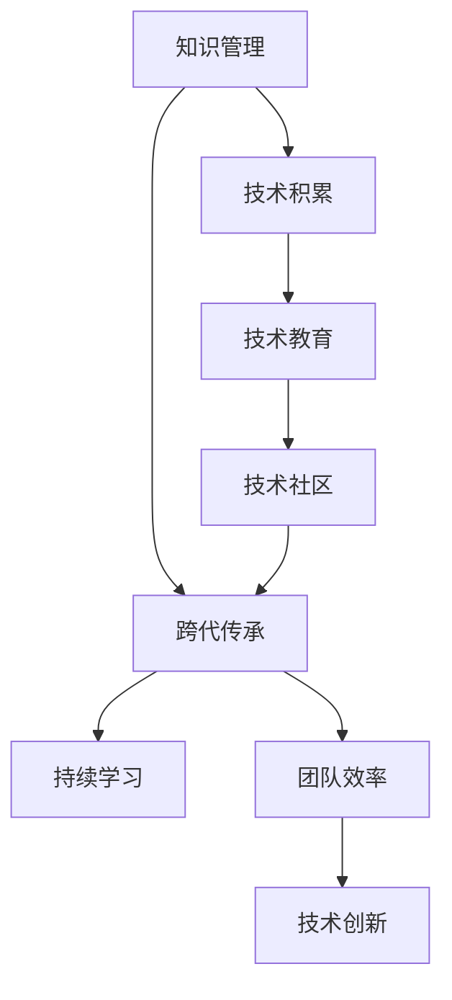

                 

# 跨代知识传承：bridging the gap

> 关键词：知识管理, 跨代传承, 技术积累, 软件开发, 人工智能教育

## 1. 背景介绍

### 1.1 问题由来

随着科技的飞速发展，各个行业和企业都在努力适应并融入这一变革中。然而，知识的积累与传承是一个长期且复杂的过程。如何有效地管理知识，让技术不断传承并迭代发展，成为了一个重要的课题。尤其是在高科技领域，如软件开发、人工智能等，技术更新迭代迅速，对知识的传承提出了更高的要求。

### 1.2 问题核心关键点

1. **技术知识库的构建和管理**：如何构建一个集中的、系统的知识库，对技术和最佳实践进行管理和分享，以便新员工可以快速了解并掌握相关知识。
2. **跨代知识传承**：如何有效地将技术知识传递给新员工，特别是那些没有经历过早期项目和技术积累的年轻一代。
3. **持续学习和自我提升**：如何在技术快速变化的环境中，鼓励团队成员持续学习和自我提升，保持与时代同步。
4. **技术和教育的融合**：如何将技术教育与实际项目相结合，确保技术传承不仅仅是知识的传递，更是技能的培养。

### 1.3 问题研究意义

研究跨代知识传承的方法和策略，对于提高企业的技术能力和创新力，培养下一代的科技精英，具有重要的意义：

1. 提升团队效率：通过有效的知识管理和传承，团队成员可以快速适应新技术和新方法，提高工作效率。
2. 增强知识积累：跨代知识传承机制可以积累更多的技术经验和实践知识，为企业长期发展打下坚实基础。
3. 促进人才成长：通过系统的技术教育和实践，帮助年轻员工快速成长，成为行业内的技术骨干。
4. 推动技术创新：不断的技术积累和知识传承，有助于企业在快速变化的市场环境中保持竞争力，实现技术创新和突破。

## 2. 核心概念与联系

### 2.1 核心概念概述

为更好地理解跨代知识传承的技术框架，本节将介绍几个密切相关的核心概念：

- **知识管理(Knowledge Management, KMS)**：通过系统化的手段管理和共享组织内部和外部的知识，以便更好地支持决策和创新。
- **技术积累(Technical Accumulation)**：企业在长期发展过程中积累的技术经验、最佳实践和解决方案。
- **跨代传承(Inter-Generational Knowledge Transfer, IGKT)**：将前一代的知识传递给新一代员工，帮助他们快速适应和掌握新技术。
- **持续学习(Continuous Learning)**：在技术快速发展的环境中，持续获取新知识，提升个人和团队的技术能力。
- **技术教育(Technical Education)**：通过培训和教育，使员工掌握必要的技术技能和知识，适应工作需求。
- **技术社区(Tech Community)**：企业内部或外部的技术交流和合作平台，促进知识共享和技术创新。

这些核心概念之间的逻辑关系可以通过以下Mermaid流程图来展示：



这个流程图展示了一系列概念之间的联系：

1. 知识管理为技术积累提供平台和工具，帮助企业系统化地管理知识和经验。
2. 跨代传承机制使新老员工之间进行知识传递，提升团队整体的技术水平。
3. 持续学习促进员工在技术变化中不断更新知识，适应新的技术要求。
4. 技术教育为员工提供必要的技术培训和知识传授，帮助他们掌握所需技能。
5. 技术社区提供交流和合作平台，促进知识共享和技术创新。

这些概念共同构成了企业跨代知识传承的框架，帮助企业在技术不断变化的环境中保持竞争力。通过理解这些概念，我们可以更好地把握跨代知识传承的实现路径。

## 3. 核心算法原理 & 具体操作步骤

### 3.1 算法原理概述

跨代知识传承本质上是一个信息传递和共享的过程，核心在于构建一个系统化的知识库，并设计有效的传递机制，使知识能够从一代传递到另一代。

在这个过程中，我们可以采用以下核心算法：

- **知识库构建**：通过集中管理和索引，建立一个包含技术文档、案例分析、代码库等内容的知识库。
- **知识索引与搜索**：利用文本分析和自然语言处理技术，快速索引和搜索知识库中的内容，以便员工快速找到所需信息。
- **知识共享与协作**：通过知识共享平台和协作工具，促进知识在团队内部和外部进行传递和交流。
- **跨代知识传递**：设计机制和方法，使新员工能够快速获取和理解前一代的知识，适应工作需求。

### 3.2 算法步骤详解

#### 第一步：知识库构建

1. **内容收集**：收集企业内部和外部的技术文档、项目报告、代码库等，作为知识库的基础内容。
2. **知识分类**：根据内容的不同类型和主题，进行分类和组织，便于查找和利用。
3. **知识索引**：利用文本分析和自然语言处理技术，对知识库中的文本内容进行索引，实现快速搜索和检索。
4. **知识共享**：通过内网、云平台或专用的知识管理系统，提供知识库的访问权限，支持员工随时查看和利用。

#### 第二步：知识索引与搜索

1. **文本分析**：使用自然语言处理技术，对知识库中的文本内容进行分析和处理，提取关键词、主题等。
2. **索引建立**：根据文本分析结果，建立索引，将内容与相关的关键词、主题等关联起来。
3. **搜索实现**：设计搜索算法，支持用户通过关键词、主题、日期等进行搜索，快速定位所需信息。
4. **结果展示**：将搜索结果以列表、摘要、全文展示等方式呈现给用户，方便查阅。

#### 第三步：知识共享与协作

1. **协作工具**：引入协作工具，如Confluence、Slack等，支持团队成员之间的交流和合作。
2. **知识同步**：利用版本控制工具，如Git，实现知识库的同步和更新，确保内容的一致性。
3. **知识分享**：鼓励团队成员分享自己的技术经验和学习心得，通过文档、博客、会议等方式进行传播。
4. **知识评估**：定期评估知识库的内容质量和更新频率，确保知识的准确性和时效性。

#### 第四步：跨代知识传递

1. **新员工培训**：设计系统的培训计划，涵盖基础知识、技术栈、最佳实践等内容。
2. **导师制度**：建立导师制度，让有经验的员工指导新员工，传授经验和技能。
3. **任务分配**：通过项目任务分配，让新员工参与实际项目，积累实战经验。
4. **持续反馈**：定期收集新员工的反馈，评估培训效果，优化培训计划。

### 3.3 算法优缺点

跨代知识传承的方法具有以下优点：

1. **系统性**：通过集中管理和共享知识，确保知识传承的系统性和规范性。
2. **效率高**：利用现代技术手段，快速索引和搜索知识库，方便员工获取所需信息。
3. **灵活性**：通过协作工具和协作机制，促进知识在团队内部和外部自由传递和交流。
4. **成本低**：相对于传统的经验传授方式，系统化的知识库和共享平台成本较低，易于维护。

但这种方法也存在一些局限性：

1. **知识碎片化**：如果知识库管理不当，容易产生内容碎片化，难以形成系统的知识体系。
2. **内容过时**：如果知识库的更新不及时，容易导致内容过时，影响实际应用。
3. **技术依赖**：过度依赖现代技术手段，可能降低知识的可读性和理解性。
4. **文化差异**：不同代际之间的沟通和理解可能存在文化差异，影响知识传递的效果。

尽管如此，跨代知识传承的利大于弊，通过合理的机制设计和工具支持，可以显著提升企业的技术能力和知识水平。

### 3.4 算法应用领域

跨代知识传承的应用领域广泛，包括但不限于：

- **软件开发**：通过代码库、技术文档、项目报告等，帮助新员工快速上手新技术。
- **人工智能**：通过论文、案例、代码库等，分享最新的研究成果和实践经验。
- **数据科学**：通过数据集、模型、算法文档等，帮助新员工掌握数据处理和建模技能。
- **系统架构**：通过架构图、设计文档、技术方案等，帮助新员工理解系统设计和技术栈。
- **产品管理**：通过需求文档、市场分析、用户反馈等，帮助新员工了解产品需求和市场动态。

跨代知识传承不仅适用于技术领域，还可以广泛应用于其他行业，帮助企业在知识传承中实现创新和提升。

## 4. 数学模型和公式 & 详细讲解 & 举例说明

### 4.1 数学模型构建

为了更好地理解跨代知识传承的实现过程，我们可以通过数学模型来建模这一过程。

设企业知识库中的知识总数为 $K$，知识库的访问频率为 $A$，知识库的搜索效率为 $S$，知识库的更新频率为 $U$。

知识库的总体效率 $E$ 可以表示为：

$$
E = A \times S \times U
$$

其中 $A$、$S$ 和 $U$ 都是需要优化的关键参数。

### 4.2 公式推导过程

#### 知识库访问频率 $A$

知识库的访问频率 $A$ 与知识库的内容质量、可用性和用户体验有关。假设知识库的内容质量为 $Q$，知识库的可用性为 $R$，用户满意度为 $U_s$。

$$
A = Q \times R \times U_s
$$

#### 知识库搜索效率 $S$

知识库的搜索效率 $S$ 取决于搜索算法和索引的质量。假设搜索算法的效果为 $A_s$，索引的完备性为 $I$。

$$
S = A_s \times I
$$

#### 知识库更新频率 $U$

知识库的更新频率 $U$ 与团队的知识管理能力和更新机制有关。假设知识管理的严格性为 $M$，更新的及时性为 $T$。

$$
U = M \times T
$$

将这些公式代入总体效率 $E$ 的公式中，得到：

$$
E = (Q \times R \times U_s) \times (A_s \times I) \times (M \times T)
$$

### 4.3 案例分析与讲解

以软件开发为例，分析如何通过跨代知识传承提升团队效率。

假设团队中有10名新员工加入，他们需要熟悉以下知识：

- 编程语言（如Python、Java）
- 开发框架（如Django、Flask）
- 数据库（如MySQL、PostgreSQL）
- 版本控制（如Git）
- 项目管理和协作工具（如Jira、Confluence）

知识库中包含了以下内容：

- 编程语言的标准文档和指南
- 开发框架的示例项目和案例分析
- 数据库的使用手册和最佳实践
- 版本控制的操作手册和常见问题
- 项目管理和协作工具的使用指南和案例

为了提升新员工的知识获取效率，可以采取以下措施：

- **知识库索引**：对知识库中的内容进行索引，快速定位所需信息。
- **导师制度**：指定有经验的员工作为导师，为新员工提供一对一的指导。
- **任务分配**：分配实际的项目任务，让新员工在实践中学习。
- **持续反馈**：定期收集新员工的反馈，优化培训计划。

通过这些措施，知识库的总体效率 $E$ 可以得到显著提升。

## 5. 项目实践：代码实例和详细解释说明

### 5.1 开发环境搭建

在进行跨代知识传承实践前，我们需要准备好开发环境。以下是使用Python进行知识库管理的开发环境配置流程：

1. 安装Anaconda：从官网下载并安装Anaconda，用于创建独立的Python环境。

2. 创建并激活虚拟环境：
```bash
conda create -n knowledge-management python=3.8 
conda activate knowledge-management
```

3. 安装必要的库：
```bash
conda install pandas numpy spacy transformers sklearn
```

4. 安装相关工具包：
```bash
pip install scikit-learn nltk
```

5. 配置搜索引擎：
```bash
brew install elasticsearch
```

完成上述步骤后，即可在`knowledge-management`环境中开始实践。

### 5.2 源代码详细实现

下面是一个简单的Python代码实例，用于构建和搜索知识库：

```python
from elasticsearch import Elasticsearch
from nltk.tokenize import word_tokenize
from sklearn.feature_extraction.text import TfidfVectorizer

# 初始化Elasticsearch连接
es = Elasticsearch([{'host': 'localhost', 'port': 9200}])

# 定义知识库
knowledge_base = {
    "code": {
        "python": ["def hello():\n    print('Hello, World!')"],
        "java": ["public static void main(String[] args) {\n    System.out.println('Hello, World!');\n}"]
    },
    "docs": {
        "Hello, World!": ["Welcome to the world of programming!"]
    }
}

# 索引知识库
for topic, content in knowledge_base.items():
    for lang, code in content.items():
        for i, line in enumerate(code.splitlines()):
            doc = {
                "topic": topic,
                "lang": lang,
                "line": line,
                "i": i
            }
            es.index(index="code", doc_type="line", body=doc)

# 搜索知识库
query = {
    "query": {
        "multi_match": {
            "query": "Hello, World!", 
            "fields": ["python", "java"]
        }
    }
}

res = es.search(index="code", body=query)
print([doc["_source"] for doc in res["hits"]["hits"]])
```

这个代码实例展示了如何使用Elasticsearch构建和搜索知识库。在实践中，我们可以使用更复杂的技术手段，如自然语言处理、机器学习等，来提高知识库的索引和搜索效率。

### 5.3 代码解读与分析

让我们再详细解读一下关键代码的实现细节：

**Elasticsearch初始化**：
- 使用Elasticsearch库初始化连接，连接到本地的Elasticsearch实例。

**知识库构建**：
- 定义一个包含编程语言和文档的知识库，每个知识库包含多个语言和文档。
- 对每个文档中的每一行代码进行索引，包括文档主题、语言、行号和内容。

**知识库搜索**：
- 定义一个查询，搜索包含特定内容的代码行。
- 使用Elasticsearch的搜索接口，执行查询，获取搜索结果。

通过Elasticsearch等现代技术手段，可以大大提升知识库的搜索效率，帮助员工快速找到所需信息。

## 6. 实际应用场景

### 6.1 软件开发

在软件开发领域，跨代知识传承尤为重要。随着技术的快速迭代，新员工需要快速掌握各种编程语言、开发框架和工具。通过知识库和搜索工具，可以帮助新员工迅速了解公司内部的最佳实践和项目规范。

### 6.2 人工智能

在人工智能领域，跨代知识传承同样重要。AI技术发展迅速，新员工需要掌握最新的算法和模型。通过知识库和案例分析，可以有效地传递最新的研究成果和实践经验。

### 6.3 数据科学

在数据科学领域，跨代知识传承能够帮助新员工掌握数据处理和建模技能。通过数据集、模型文档和算法解释，新员工可以迅速上手数据科学项目。

### 6.4 系统架构

在系统架构领域，跨代知识传承能够帮助新员工理解系统的设计和技术栈。通过架构图、设计文档和案例分析，新员工可以全面了解系统的实现和优化。

## 7. 工具和资源推荐

### 7.1 学习资源推荐

为了帮助开发者系统掌握跨代知识传承的理论基础和实践技巧，这里推荐一些优质的学习资源：

1. **《知识管理与组织》**：介绍知识管理的理论基础和实际应用，帮助企业构建高效的知识管理体系。
2. **《技术转移与传承》**：讨论技术传承的策略和方法，帮助企业培养下一代技术人才。
3. **《现代软件开发实践》**：涵盖软件开发的最佳实践和工具，帮助开发者提升开发效率。
4. **《机器学习实战》**：通过实际案例，介绍机器学习的应用和实现，帮助开发者掌握最新的AI技术。
5. **《数据科学入门》**：介绍数据科学的基础知识和实践技能，帮助数据科学家快速上手项目。

通过对这些资源的学习实践，相信你一定能够快速掌握跨代知识传承的精髓，并用于解决实际的开发和应用问题。

### 7.2 开发工具推荐

高效的开发离不开优秀的工具支持。以下是几款用于跨代知识传承开发的常用工具：

1. **Confluence**：企业知识管理和协作平台，支持文档的创建、共享和搜索。
2. **Slack**：团队沟通和协作工具，支持实时消息传递和文件共享。
3. **GitLab**：版本控制和项目管理工具，支持代码库的创建、管理和搜索。
4. **Jira**：项目管理工具，支持任务分配、进度跟踪和报告生成。
5. **Elasticsearch**：搜索和分析引擎，支持大规模数据的高效索引和搜索。

合理利用这些工具，可以显著提升跨代知识传承的效率和效果，加快创新迭代的步伐。

### 7.3 相关论文推荐

跨代知识传承的研究源于学界的持续研究。以下是几篇奠基性的相关论文，推荐阅读：

1. **《跨代知识传承：理论和实践》**：讨论跨代知识传承的理论基础和实践方法，帮助企业构建高效的知识管理体系。
2. **《技术传承与创新》**：探讨技术传承和创新的关系，帮助企业培养下一代技术人才。
3. **《知识管理技术进展》**：综述知识管理技术的最新进展，帮助企业实现高效的跨代知识传承。
4. **《数据科学教育》**：介绍数据科学的教育方法和实践技能，帮助数据科学家快速上手项目。

这些论文代表了大语言模型微调技术的发展脉络。通过学习这些前沿成果，可以帮助研究者把握学科前进方向，激发更多的创新灵感。

## 8. 总结：未来发展趋势与挑战

### 8.1 总结

本文对跨代知识传承的方法和策略进行了全面系统的介绍。首先阐述了跨代知识传承的研究背景和意义，明确了知识管理、技术积累和持续学习在企业发展中的重要性。其次，从原理到实践，详细讲解了跨代知识传承的数学模型和具体步骤，给出了知识库构建和搜索的代码实例。同时，本文还广泛探讨了跨代知识传承在软件开发、人工智能等诸多领域的应用前景，展示了其广阔的发展空间。

通过本文的系统梳理，可以看到，跨代知识传承机制在企业技术传承和创新中具有重要作用。通过系统的知识库管理和合理的传递机制，企业可以有效地传承技术知识，培养下一代的科技精英，保持技术能力和创新力的持续提升。

### 8.2 未来发展趋势

展望未来，跨代知识传承技术将呈现以下几个发展趋势：

1. **智能化**：利用人工智能技术，如自然语言处理和机器学习，提升知识库的搜索和索引效率。
2. **云端化**：将知识库和搜索服务云端化，实现知识的远程共享和协作。
3. **个性化**：根据员工的学习需求和技能水平，提供个性化的学习资源和路径。
4. **移动化**：通过移动应用，随时随地访问和利用知识库，提高知识管理的便捷性。
5. **社交化**：利用社交网络平台，促进知识的交流和共享，构建企业内部的知识社区。

这些趋势凸显了跨代知识传承技术的广阔前景。通过不断地技术创新和实践优化，企业可以在知识传承中实现更高的效率和效果，保持技术竞争力的领先地位。

### 8.3 面临的挑战

尽管跨代知识传承技术已经取得了一定成果，但在迈向更加智能化、普适化应用的过程中，它仍面临着诸多挑战：

1. **知识碎片化**：知识库的内容如果缺乏系统的组织和索引，容易产生内容碎片化，难以形成系统的知识体系。
2. **内容过时**：知识库的更新不及时，容易导致内容过时，影响实际应用。
3. **技术依赖**：过度依赖现代技术手段，可能降低知识的可读性和理解性。
4. **文化差异**：不同代际之间的沟通和理解可能存在文化差异，影响知识传递的效果。

尽管如此，跨代知识传承的利大于弊，通过合理的机制设计和工具支持，可以显著提升企业的技术能力和知识水平。

### 8.4 研究展望

面对跨代知识传承所面临的种种挑战，未来的研究需要在以下几个方面寻求新的突破：

1. **知识体系化**：构建系统化的知识体系，确保知识库内容的连贯性和完整性。
2. **知识更新机制**：建立及时的知识更新机制，确保知识库的内容始终保持最新。
3. **技术融合**：将人工智能技术与知识管理技术相结合，提升知识库的智能化和个性化水平。
4. **文化融合**：促进不同代际之间的沟通和理解，建立包容和多样化的知识传承环境。
5. **技术普及**：推动知识管理技术的普及和应用，帮助更多企业实现高效的跨代知识传承。

这些研究方向的探索，必将引领跨代知识传承技术迈向更高的台阶，为构建安全、可靠、可解释、可控的智能系统铺平道路。面向未来，跨代知识传承技术还需要与其他人工智能技术进行更深入的融合，如知识表示、因果推理、强化学习等，多路径协同发力，共同推动自然语言理解和智能交互系统的进步。只有勇于创新、敢于突破，才能不断拓展知识传承的边界，让智能技术更好地造福人类社会。

## 9. 附录：常见问题与解答

**Q1：如何构建高效的知识库？**

A: 构建高效的知识库需要遵循以下原则：

1. **系统化**：对知识进行分类和组织，形成系统化的知识体系。
2. **结构化**：使用结构化的数据模型，便于索引和搜索。
3. **元数据**：为知识库中的每条内容添加元数据，包括创建时间、修改时间、作者等。
4. **动态更新**：定期更新知识库，确保内容的时效性。
5. **用户友好**：界面设计和搜索功能要符合用户习惯，便于员工使用。

**Q2：如何促进知识共享和协作？**

A: 促进知识共享和协作需要以下措施：

1. **协作工具**：引入协作工具，如Confluence、Slack等，支持团队成员之间的交流和合作。
2. **文档共享**：利用文档管理系统，如Google Drive、Dropbox等，共享和访问文档。
3. **代码库管理**：使用版本控制工具，如Git，管理代码库的同步和更新。
4. **知识同步**：定期同步知识库和文档，确保信息的一致性。

**Q3：如何优化知识库的搜索效率？**

A: 优化知识库的搜索效率需要以下措施：

1. **索引优化**：使用高效的索引技术，如倒排索引、向量空间模型等。
2. **搜索算法**：使用先进的搜索算法，如TF-IDF、BM25等，提高搜索的准确性。
3. **搜索结果展示**：优化搜索结果的展示方式，如相关文档、摘要、全文等，方便员工查阅。
4. **搜索反馈**：收集员工对搜索效果的反馈，持续优化搜索体验。

通过这些措施，可以显著提升知识库的搜索效率，帮助员工快速找到所需信息。

**Q4：如何确保知识库的内容质量？**

A: 确保知识库的内容质量需要以下措施：

1. **审核机制**：建立知识审核机制，确保内容的质量和准确性。
2. **标准化**：制定内容标准和格式规范，确保内容的格式统一和一致。
3. **反馈机制**：收集员工的反馈，及时纠正错误和不准确的信息。
4. **持续改进**：定期评估知识库的内容质量，持续改进和优化。

通过这些措施，可以确保知识库的内容质量，提升知识库的实用性和可靠性。

**Q5：如何提高知识库的更新频率？**

A: 提高知识库的更新频率需要以下措施：

1. **团队协作**：建立知识管理团队，负责知识库的更新和维护。
2. **定期审核**：定期审核知识库的内容，及时更新和补充。
3. **自动化工具**：利用自动化工具，如爬虫、脚本等，定期抓取和更新内容。
4. **员工参与**：鼓励员工积极参与知识库的更新和完善，提供有价值的内容。

通过这些措施，可以显著提高知识库的更新频率，确保内容的时效性和实用性。

---

作者：禅与计算机程序设计艺术 / Zen and the Art of Computer Programming

