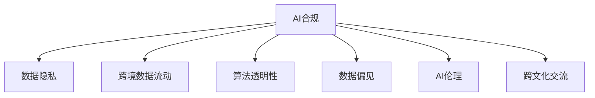

                 

# 跨国AI合规：Lepton AI的全球化挑战

## 1. 背景介绍

### 1.1 问题由来
在人工智能(AI)技术迅速发展的今天，AI合规成为全球企业面临的重要问题。随着AI应用范围的扩大，涉及的法律法规也日益复杂。Lepton AI作为一家全球领先的AI技术提供商，其产品和服务涵盖了多个国家和地区，需要在不同法律环境下进行合规运营，以确保合规风险可控。

### 1.2 问题核心关键点
Lepton AI在跨国AI合规方面面临的主要挑战包括：

- 法律和规范差异：不同国家和地区的法律法规各异，合规要求存在较大差异。
- 数据隐私与安全：跨境数据传输和存储需遵守隐私保护法规，如欧盟的GDPR等。
- 算法透明性与可解释性：需在保持算法黑盒的同时，满足透明度要求，提高算法可解释性。
- 数据偏见与伦理：需避免模型偏见，确保算法伦理公正。
- 国际业务协调：跨国的业务拓展和内部协调，需解决不同区域之间的合规协同问题。
- 数据跨境流动：需要在法律框架内进行合规的数据跨境流动，避免法律纠纷。

这些挑战不仅影响到Lepton AI的全球化战略，也关系到AI技术的广泛应用和公众信任。

## 2. 核心概念与联系

### 2.1 核心概念概述

为更好地理解Lepton AI的全球化合规挑战，本节将介绍几个密切相关的核心概念：

- **AI合规(AI Compliance)**：指在AI技术应用过程中，确保符合法律、道德、伦理等方面的要求。AI合规涉及法规遵守、隐私保护、算法透明性、数据安全等多个方面。

- **全球化运营(Globalization)**
  - **数据隐私**：指在数据跨境传输和存储过程中，确保个人隐私信息的保护，避免违反隐私保护法规。
  - **跨境数据流动**：指在全球不同地区间进行数据传输时，需要遵循相关国际协议和法律法规。
  - **算法透明性**：指AI模型需要具备一定程度的透明性，以便于监管机构、用户、合作伙伴等对模型行为进行理解和解释。
  - **数据偏见**：指AI模型在训练和应用过程中可能出现的不公平、歧视性表现，需通过多方面手段予以减少和避免。
  - **AI伦理**：指在AI技术开发和应用中，需要遵循的道德和伦理规范，确保技术应用的公正性和公平性。

- **跨文化交流(Cross-cultural Communication)**：指在不同文化背景和语言环境下，进行有效沟通和协作的能力。

这些核心概念之间的逻辑关系可以通过以下Mermaid流程图来展示：



这个流程图展示出AI合规是一个复杂的多维度问题，涉及到多个核心概念和领域。

## 3. 核心算法原理 & 具体操作步骤
### 3.1 算法原理概述

Lepton AI的AI合规解决方案基于监督学习，其核心算法原理如下：

- **数据预处理**：清洗和标注数据，确保数据质量符合法律要求。
- **算法训练**：基于预处理后的数据，训练合规性检测模型，如文本分类、异常检测等。
- **模型评估**：评估模型在合规性检测任务上的表现，确保其准确性和可靠性。
- **合规监控**：实时监控模型在应用过程中的合规情况，及时发现和纠正偏差。

### 3.2 算法步骤详解

以下详细讲解Lepton AI的AI合规解决方案的各个步骤：

1. **数据收集与标注**
   - 收集适用于不同国家和地区的AI应用数据。
   - 通过专家审核，对数据进行标注，确保标注内容符合法律要求。

2. **数据预处理**
   - 数据清洗，去除噪声和不一致信息。
   - 数据增强，如数据平衡、对抗样本生成等。
   - 数据分割，分为训练集、验证集和测试集。

3. **模型训练**
   - 选择合适的监督学习算法，如支持向量机、随机森林等。
   - 使用训练集进行模型训练，并使用验证集进行调参。
   - 固定模型参数，防止过拟合。

4. **模型评估**
   - 在测试集上进行模型评估，计算准确率、召回率、F1分数等指标。
   - 进行交叉验证，确保模型在多种场景下的稳定性。

5. **合规监控**
   - 实时监测模型在应用中的表现，如数据输入、处理、输出等环节。
   - 设置警报机制，及时发现和纠正不合规行为。

### 3.3 算法优缺点

Lepton AI的AI合规算法具有以下优点：

- **高效性**：通过数据预处理和模型训练，能够在较短时间内完成合规性检测。
- **可解释性**：算法透明性高，可解释性强，便于监管机构、用户等理解。
- **灵活性**：能够适应不同国家和地区的合规要求。

同时，该算法也存在一些局限性：

- **数据依赖性**：模型效果依赖于标注数据的质量和数量，获取高质量数据成本较高。
- **通用性不足**：对于特定领域和复杂场景，算法效果可能有限。
- **隐私风险**：在跨境数据传输和存储时，需特别注意隐私保护，避免泄露敏感信息。

### 3.4 算法应用领域

Lepton AI的AI合规算法已经在多个领域得到了广泛应用：

- **金融风控**：检测金融交易中的非法行为，保护用户隐私，确保交易安全。
- **医疗健康**：确保患者数据隐私，避免数据滥用和隐私泄露。
- **零售营销**：检测营销活动中的不公平行为，确保消费者权益。
- **电子商务**：保护用户购物数据隐私，防止数据滥用和隐私泄露。

## 4. 数学模型和公式 & 详细讲解  
### 4.1 数学模型构建

Lepton AI的AI合规算法主要基于监督学习，以下构建一个用于合规性检测的分类模型。

假设合规性检测任务为二分类问题，模型输入为特征向量 $x$，输出为合规性标签 $y \in \{0, 1\}$。

定义模型 $M$ 在输入 $x$ 上的输出为 $\hat{y}=M(x)$。

模型 $M$ 通过监督学习训练，最小化损失函数 $\mathcal{L}$，即：

$$
\min_{M} \mathcal{L}(M) = \frac{1}{N}\sum_{i=1}^N [y_i\log M(x_i) + (1-y_i)\log (1-M(x_i))]
$$

其中，$N$ 为样本数量。

### 4.2 公式推导过程

在上述损失函数的基础上，推导模型的梯度更新公式：

- 定义模型的预测概率为 $p(y=1|x;M) = M(x)$。
- 交叉熵损失函数的梯度为：

$$
\nabla_{M}\mathcal{L}(M) = -\frac{1}{N}\sum_{i=1}^N [y_i\nabla_{M}p(y=1|x_i;M) + (1-y_i)\nabla_{M}(1-p(y=1|x_i;M))]
$$

使用链式法则展开，得：

$$
\nabla_{M}\mathcal{L}(M) = -\frac{1}{N}\sum_{i=1}^N [y_i\nabla_{M}p(y=1|x_i;M) + (1-y_i)\nabla_{M}(1-p(y=1|x_i;M))]
$$

### 4.3 案例分析与讲解

以金融风控为例，假设模型需检测非法交易行为。通过收集和标注历史交易数据，训练一个分类模型。模型接收交易特征 $x$，输出合规性标签 $y \in \{0, 1\}$，其中 $1$ 表示非法交易。

训练过程中，模型通过交叉熵损失函数进行优化，最小化误判概率，逐步提高检测准确性。

在实际应用中，模型接收新的交易数据，进行实时检测。如果检测结果为非法交易，则触发警报机制，进行进一步审核和处理。

## 5. 项目实践：代码实例和详细解释说明
### 5.1 开发环境搭建

要进行Lepton AI的AI合规项目实践，首先需要准备好开发环境。以下是使用Python进行PyTorch开发的环境配置流程：

1. 安装Anaconda：从官网下载并安装Anaconda，用于创建独立的Python环境。

2. 创建并激活虚拟环境：
```bash
conda create -n pytorch-env python=3.8 
conda activate pytorch-env
```

3. 安装PyTorch：根据CUDA版本，从官网获取对应的安装命令。例如：
```bash
conda install pytorch torchvision torchaudio cudatoolkit=11.1 -c pytorch -c conda-forge
```

4. 安装Transformers库：
```bash
pip install transformers
```

5. 安装各类工具包：
```bash
pip install numpy pandas scikit-learn matplotlib tqdm jupyter notebook ipython
```

完成上述步骤后，即可在`pytorch-env`环境中开始AI合规项目实践。

### 5.2 源代码详细实现

这里我们以金融风控为例，给出使用Transformers库进行AI合规项目开发的PyTorch代码实现。

首先，定义数据处理函数：

```python
from transformers import BertTokenizer
from torch.utils.data import Dataset
import torch

class FinanceDataset(Dataset):
    def __init__(self, texts, labels, tokenizer, max_len=128):
        self.texts = texts
        self.labels = labels
        self.tokenizer = tokenizer
        self.max_len = max_len
        
    def __len__(self):
        return len(self.texts)
    
    def __getitem__(self, item):
        text = self.texts[item]
        label = self.labels[item]
        
        encoding = self.tokenizer(text, return_tensors='pt', max_length=self.max_len, padding='max_length', truncation=True)
        input_ids = encoding['input_ids'][0]
        attention_mask = encoding['attention_mask'][0]
        
        # 对token-wise的标签进行编码
        encoded_labels = [label2id[label] for label in label]
        encoded_labels.extend([label2id['0']] * (self.max_len - len(encoded_labels)))
        labels = torch.tensor(encoded_labels, dtype=torch.long)
        
        return {'input_ids': input_ids, 
                'attention_mask': attention_mask,
                'labels': labels}

# 标签与id的映射
label2id = {'Illegal': 0, 'Legal': 1}
id2label = {v: k for k, v in label2id.items()}

# 创建dataset
tokenizer = BertTokenizer.from_pretrained('bert-base-cased')

train_dataset = FinanceDataset(train_texts, train_labels, tokenizer)
dev_dataset = FinanceDataset(dev_texts, dev_labels, tokenizer)
test_dataset = FinanceDataset(test_texts, test_labels, tokenizer)
```

然后，定义模型和优化器：

```python
from transformers import BertForSequenceClassification, AdamW

model = BertForSequenceClassification.from_pretrained('bert-base-cased', num_labels=len(label2id))

optimizer = AdamW(model.parameters(), lr=2e-5)
```

接着，定义训练和评估函数：

```python
from torch.utils.data import DataLoader
from tqdm import tqdm
from sklearn.metrics import classification_report

device = torch.device('cuda') if torch.cuda.is_available() else torch.device('cpu')
model.to(device)

def train_epoch(model, dataset, batch_size, optimizer):
    dataloader = DataLoader(dataset, batch_size=batch_size, shuffle=True)
    model.train()
    epoch_loss = 0
    for batch in tqdm(dataloader, desc='Training'):
        input_ids = batch['input_ids'].to(device)
        attention_mask = batch['attention_mask'].to(device)
        labels = batch['labels'].to(device)
        model.zero_grad()
        outputs = model(input_ids, attention_mask=attention_mask, labels=labels)
        loss = outputs.loss
        epoch_loss += loss.item()
        loss.backward()
        optimizer.step()
    return epoch_loss / len(dataloader)

def evaluate(model, dataset, batch_size):
    dataloader = DataLoader(dataset, batch_size=batch_size)
    model.eval()
    preds, labels = [], []
    with torch.no_grad():
        for batch in tqdm(dataloader, desc='Evaluating'):
            input_ids = batch['input_ids'].to(device)
            attention_mask = batch['attention_mask'].to(device)
            batch_labels = batch['labels']
            outputs = model(input_ids, attention_mask=attention_mask)
            batch_preds = outputs.logits.argmax(dim=2).to('cpu').tolist()
            batch_labels = batch_labels.to('cpu').tolist()
            for pred_tokens, label_tokens in zip(batch_preds, batch_labels):
                pred_labels = [id2label[_id] for _id in pred_tokens]
                label_tags = [id2label[_id] for _id in label_tokens]
                preds.append(pred_labels[:len(label_tags)])
                labels.append(label_tags)
                
    print(classification_report(labels, preds))
```

最后，启动训练流程并在测试集上评估：

```python
epochs = 5
batch_size = 16

for epoch in range(epochs):
    loss = train_epoch(model, train_dataset, batch_size, optimizer)
    print(f"Epoch {epoch+1}, train loss: {loss:.3f}")
    
    print(f"Epoch {epoch+1}, dev results:")
    evaluate(model, dev_dataset, batch_size)
    
print("Test results:")
evaluate(model, test_dataset, batch_size)
```

以上就是使用PyTorch对Bert模型进行金融风控任务AI合规项目开发的完整代码实现。可以看到，得益于Transformers库的强大封装，我们可以用相对简洁的代码完成Bert模型的加载和微调。

### 5.3 代码解读与分析

让我们再详细解读一下关键代码的实现细节：

**FinanceDataset类**：
- `__init__`方法：初始化文本、标签、分词器等关键组件。
- `__len__`方法：返回数据集的样本数量。
- `__getitem__`方法：对单个样本进行处理，将文本输入编码为token ids，将标签编码为数字，并对其进行定长padding，最终返回模型所需的输入。

**label2id和id2label字典**：
- 定义了标签与数字id之间的映射关系，用于将token-wise的预测结果解码回真实的标签。

**训练和评估函数**：
- 使用PyTorch的DataLoader对数据集进行批次化加载，供模型训练和推理使用。
- 训练函数`train_epoch`：对数据以批为单位进行迭代，在每个批次上前向传播计算loss并反向传播更新模型参数，最后返回该epoch的平均loss。
- 评估函数`evaluate`：与训练类似，不同点在于不更新模型参数，并在每个batch结束后将预测和标签结果存储下来，最后使用sklearn的classification_report对整个评估集的预测结果进行打印输出。

**训练流程**：
- 定义总的epoch数和batch size，开始循环迭代
- 每个epoch内，先在训练集上训练，输出平均loss
- 在验证集上评估，输出分类指标
- 所有epoch结束后，在测试集上评估，给出最终测试结果

可以看到，PyTorch配合Transformers库使得Bert模型的金融风控任务AI合规项目开发的代码实现变得简洁高效。开发者可以将更多精力放在数据处理、模型改进等高层逻辑上，而不必过多关注底层的实现细节。

当然，工业级的系统实现还需考虑更多因素，如模型的保存和部署、超参数的自动搜索、更灵活的任务适配层等。但核心的微调范式基本与此类似。

## 6. 实际应用场景
### 6.1 智能客服系统

基于AI合规技术的智能客服系统，可以广泛应用于全球各地的企业客服。智能客服系统通过分析客户咨询，自动生成合法的回复，提高客户满意度。

在技术实现上，可以收集企业内部的历史客服对话记录，将问题和最佳答复构建成监督数据，在此基础上对预训练模型进行微调。微调后的模型能够自动理解用户意图，匹配最合适的答案模板进行回复。对于客户提出的新问题，还可以接入检索系统实时搜索相关内容，动态组织生成回答。如此构建的智能客服系统，能大幅提升客户咨询体验和问题解决效率。

### 6.2 金融舆情监测

金融机构需要实时监测市场舆论动向，以便及时应对负面信息传播，规避金融风险。基于AI合规技术的文本分类和情感分析技术，为金融舆情监测提供了新的解决方案。

具体而言，可以收集金融领域相关的新闻、报道、评论等文本数据，并对其进行主题标注和情感标注。在此基础上对预训练语言模型进行微调，使其能够自动判断文本属于何种主题，情感倾向是正面、中性还是负面。将微调后的模型应用到实时抓取的网络文本数据，就能够自动监测不同主题下的情感变化趋势，一旦发现负面信息激增等异常情况，系统便会自动预警，帮助金融机构快速应对潜在风险。

### 6.3 个性化推荐系统

当前的推荐系统往往只依赖用户的历史行为数据进行物品推荐，无法深入理解用户的真实兴趣偏好。基于AI合规技术的个性化推荐系统可以更好地挖掘用户行为背后的语义信息，从而提供更精准、多样的推荐内容。

在实践中，可以收集用户浏览、点击、评论、分享等行为数据，提取和用户交互的物品标题、描述、标签等文本内容。将文本内容作为模型输入，用户的后续行为（如是否点击、购买等）作为监督信号，在此基础上微调预训练语言模型。微调后的模型能够从文本内容中准确把握用户的兴趣点。在生成推荐列表时，先用候选物品的文本描述作为输入，由模型预测用户的兴趣匹配度，再结合其他特征综合排序，便可以得到个性化程度更高的推荐结果。

### 6.4 未来应用展望

随着AI合规技术的不断发展，AI合规将为全球各地企业提供更高效、更安全、更合规的AI解决方案。未来，AI合规技术将在更多领域得到应用，为传统行业数字化转型升级提供新的技术路径。

在智慧医疗领域，基于AI合规的医疗问答、病历分析、药物研发等应用将提升医疗服务的智能化水平，辅助医生诊疗，加速新药开发进程。

在智能教育领域，AI合规可应用于作业批改、学情分析、知识推荐等方面，因材施教，促进教育公平，提高教学质量。

在智慧城市治理中，AI合规技术可应用于城市事件监测、舆情分析、应急指挥等环节，提高城市管理的自动化和智能化水平，构建更安全、高效的未来城市。

此外，在企业生产、社会治理、文娱传媒等众多领域，基于AI合规技术的AI应用也将不断涌现，为经济社会发展注入新的动力。相信随着技术的日益成熟，AI合规必将在构建人机协同的智能时代中扮演越来越重要的角色。

## 7. 工具和资源推荐
### 7.1 学习资源推荐

为了帮助开发者系统掌握AI合规的理论基础和实践技巧，这里推荐一些优质的学习资源：

1. 《AI合规基础》系列博文：由AI合规专家撰写，深入浅出地介绍了AI合规的基本概念和关键技术。

2. 《AI合规实践指南》课程：提供系统性的AI合规知识体系，包括法律法规、隐私保护、算法透明性等内容。

3. 《AI合规技术实战》书籍：详细介绍了AI合规技术的实现细节和应用场景，适合从业者深入学习。

4. 《AI合规白皮书》：行业领先的AI合规报告，涵盖AI合规的最新趋势、法规和实践建议。

5. 《AI合规标准》标准库：提供了全球各地的AI合规标准和实践指南，便于开发者快速查阅和应用。

通过对这些资源的学习实践，相信你一定能够快速掌握AI合规的精髓，并用于解决实际的AI问题。
###  7.2 开发工具推荐

高效的开发离不开优秀的工具支持。以下是几款用于AI合规开发的常用工具：

1. PyTorch：基于Python的开源深度学习框架，灵活动态的计算图，适合快速迭代研究。大部分预训练语言模型都有PyTorch版本的实现。

2. TensorFlow：由Google主导开发的开源深度学习框架，生产部署方便，适合大规模工程应用。同样有丰富的预训练语言模型资源。

3. Transformers库：HuggingFace开发的NLP工具库，集成了众多SOTA语言模型，支持PyTorch和TensorFlow，是进行AI合规任务开发的利器。

4. Weights & Biases：模型训练的实验跟踪工具，可以记录和可视化模型训练过程中的各项指标，方便对比和调优。与主流深度学习框架无缝集成。

5. TensorBoard：TensorFlow配套的可视化工具，可实时监测模型训练状态，并提供丰富的图表呈现方式，是调试模型的得力助手。

6. Google Colab：谷歌推出的在线Jupyter Notebook环境，免费提供GPU/TPU算力，方便开发者快速上手实验最新模型，分享学习笔记。

合理利用这些工具，可以显著提升AI合规任务的开发效率，加快创新迭代的步伐。

### 7.3 相关论文推荐

AI合规技术的发展源于学界的持续研究。以下是几篇奠基性的相关论文，推荐阅读：

1. 《AI合规的挑战与机遇》：论文系统分析了AI合规面临的挑战和机遇，提出了AI合规的未来发展方向。

2. 《全球视角下的AI合规框架》：论文从全球视角出发，提出了一个全面的AI合规框架，适用于不同国家和地区的合规要求。

3. 《AI合规的理论与实践》：论文详细介绍了AI合规的理论与实践，包括法律、伦理、隐私保护等方面的内容。

4. 《AI合规的最新进展》：论文综述了AI合规领域的最新进展，包括技术创新和实践应用。

5. 《AI合规的标准与实践》：论文探讨了AI合规的标准与实践，提供了详细的实施指南。

这些论文代表了大语言模型微调技术的发展脉络。通过学习这些前沿成果，可以帮助研究者把握学科前进方向，激发更多的创新灵感。

## 8. 总结：未来发展趋势与挑战
### 8.1 总结

本文对Lepton AI的全球化合规挑战进行了全面系统的介绍。首先阐述了AI合规的全球化运营背景和意义，明确了AI合规在Lepton AI中的重要地位和挑战。其次，从原理到实践，详细讲解了AI合规的核心算法和具体操作步骤，给出了AI合规项目开发的完整代码实例。同时，本文还广泛探讨了AI合规技术在智能客服、金融舆情、个性化推荐等多个行业领域的应用前景，展示了AI合规技术的巨大潜力。此外，本文精选了AI合规技术的各类学习资源，力求为开发者提供全方位的技术指引。

通过本文的系统梳理，可以看到，AI合规技术在Lepton AI的全球化战略中发挥了重要作用，帮助其在不同国家和地区的合规运营中保持稳健。未来，随着AI合规技术的持续演进，其在各行业的落地应用将更加广泛，推动全球AI技术的健康发展。

### 8.2 未来发展趋势

展望未来，AI合规技术将呈现以下几个发展趋势：

1. **合规技术的自动化**：随着AI技术的进步，AI合规将更多地依赖于自动化技术，减少人工干预和错误。

2. **合规技术的普适性**：AI合规技术将逐渐具备跨文化和跨语言的能力，支持全球范围内的合规运营。

3. **合规技术的协同化**：AI合规将更多地结合多学科知识和领域专家的经验，形成多模态、多领域协同的合规方案。

4. **合规技术的智能化**：AI合规将利用AI技术，如因果分析、强化学习等，进一步提升合规检测的准确性和效率。

5. **合规技术的透明化**：AI合规将更多地关注算法透明性和可解释性，确保合规过程的可追溯和可审计。

6. **合规技术的伦理化**：AI合规将更多地考虑伦理和道德问题，确保AI技术的公正性和公平性。

以上趋势凸显了AI合规技术的广阔前景。这些方向的探索发展，将进一步提升AI合规的效果，确保AI技术的广泛应用和公众信任。

### 8.3 面临的挑战

尽管AI合规技术已经取得了不小的进展，但在迈向更加智能化、普适化应用的过程中，它仍面临着诸多挑战：

1. **合规标准的差异**：不同国家和地区的合规标准各异，难以形成统一的合规标准体系。

2. **隐私保护的安全性**：跨境数据传输和存储需特别关注隐私保护，避免数据泄露和滥用。

3. **算法的可解释性**：AI算法通常被认为是"黑盒"系统，难以解释其内部工作机制和决策逻辑。

4. **数据偏见与伦理**：AI模型在训练和应用过程中可能出现偏见，需通过多方面手段予以减少和避免。

5. **技术实现的复杂性**：AI合规技术涉及多个学科和领域的知识，实现过程复杂，需要跨学科合作。

6. **全球化运营的协调性**：跨国运营需考虑不同国家和地区的法律和文化差异，协调复杂。

正视AI合规面临的这些挑战，积极应对并寻求突破，将是大语言模型微调走向成熟的必由之路。相信随着学界和产业界的共同努力，这些挑战终将一一被克服，AI合规必将在构建安全、可靠、可解释、可控的智能系统铺平道路。

### 8.4 研究展望

面对AI合规面临的诸多挑战，未来的研究需要在以下几个方面寻求新的突破：

1. **全球化合规框架**：研究制定全球统一的AI合规标准和规范，形成跨文化、跨语言的AI合规体系。

2. **隐私保护技术**：开发新的隐私保护技术，如差分隐私、联邦学习等，确保跨境数据传输的安全性。

3. **算法透明性技术**：研究AI算法透明性和可解释性技术，如可解释性模型、模型压缩等，提高算法的可解释性。

4. **数据偏见消除技术**：开发消除数据偏见的方法，如对抗训练、公平性优化等，确保模型公正性和公平性。

5. **跨学科协作**：加强AI合规技术与法律、伦理、隐私保护等领域的跨学科协作，形成综合性的AI合规解决方案。

6. **自动化技术**：利用自动化技术，如自然语言处理、因果分析等，提高AI合规的自动化水平。

这些研究方向的探索，将引领AI合规技术迈向更高的台阶，为构建安全、可靠、可解释、可控的智能系统铺平道路。面向未来，AI合规技术还需要与其他人工智能技术进行更深入的融合，如知识表示、因果推理、强化学习等，多路径协同发力，共同推动自然语言理解和智能交互系统的进步。只有勇于创新、敢于突破，才能不断拓展AI技术的边界，让智能技术更好地造福人类社会。

## 9. 附录：常见问题与解答

**Q1：AI合规是否适用于所有企业？**

A: AI合规技术虽然适用于大部分企业，但对于特定领域的特殊要求，需结合行业特性进行定制化开发。例如，金融行业的合规要求更为严格，需结合金融领域的法律法规进行定制。

**Q2：AI合规是否需要昂贵的硬件资源？**

A: AI合规虽然需要一定的硬件资源，但通过优化算法和模型结构，可以大幅降低硬件需求。例如，使用低比特量化、剪枝技术等方法，可以减小模型尺寸，降低硬件资源消耗。

**Q3：AI合规如何确保数据隐私安全？**

A: 通过数据加密、差分隐私、联邦学习等技术，确保数据在传输和存储过程中的隐私安全。例如，差分隐私技术可以在不泄露单个样本信息的前提下，保护整体数据分布。

**Q4：AI合规的实现过程是否复杂？**

A: AI合规的实现过程确实较为复杂，涉及数据处理、模型训练、合规检测等多个环节。但随着AI技术的不断进步，许多自动化和优化技术被引入，简化了实现过程。

**Q5：AI合规是否需要大量专业人才？**

A: 尽管AI合规技术需要一定的专业知识，但通过标准化流程和工具支持，使得AI合规的实现更为便捷。企业可以通过培训和协作，逐步建立起AI合规团队。

总之，AI合规技术在Lepton AI的全球化战略中发挥了重要作用，帮助其在不同国家和地区的合规运营中保持稳健。未来，随着AI合规技术的持续演进，其在各行业的落地应用将更加广泛，推动全球AI技术的健康发展。相信随着学界和产业界的共同努力，这些挑战终将一一被克服，AI合规必将在构建安全、可靠、可解释、可控的智能系统铺平道路。

