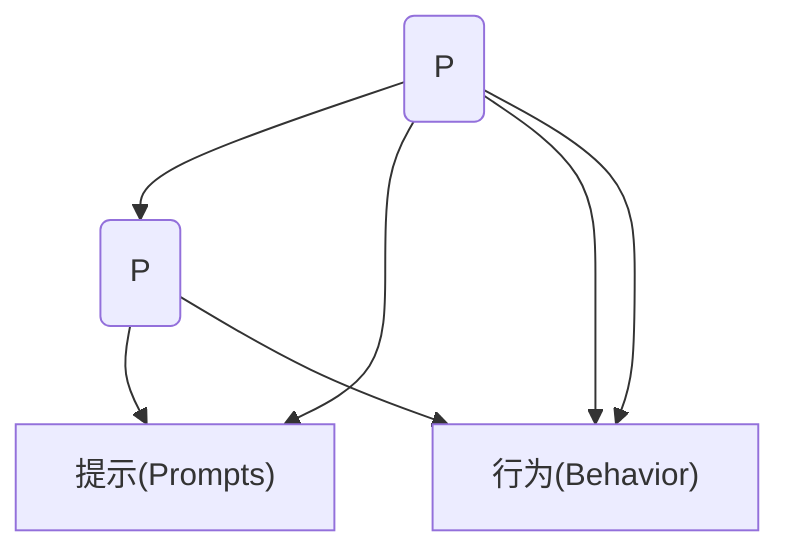

                 

# 运用福格模型培养团队良习惯

## 1. 背景介绍

### 1.1 问题由来
在现代企业中，团队的良好习惯是推动企业持续发展和创新的关键因素。然而，许多团队往往难以培养起有效的习惯，进而导致效率低下、创新不足，甚至人才流失。传统习惯培养的方法往往依赖于管理层下命令和奖惩措施，但这种外部强制手段的效果并不理想，还可能激发员工反感。

为了解决这一问题，行为科学家B.J.福格（B.J. Fogg）提出了一套简单、实用的行为改变模型——福格模型（Fogg Behavior Model），旨在帮助个体和团队养成良好的行为习惯。福格模型通过分析行为动机、能力、触发因素，揭示了习惯养成的核心机制，为团队管理提供了新的思路和方法。

### 1.2 问题核心关键点
福格模型认为，一个行为可以被表示为：

$$B = M(A) \times P(E)$$

其中：
- $B$ 表示行为（Behavior），即个体或团队执行的行动。
- $M$ 表示动机（Motivation），即内在动机和外在动机。
- $A$ 表示能力（Ability），即执行行为的实际能力。
- $P$ 表示提示（Prompts），即触发行为的提示因素。

一个行为能够发生，需满足以下三个条件：
1. 动机足够强，能驱使个体或团队去执行。
2. 执行行为所需的能力适中，个体或团队既非过度疲于应对，也非过于轻松自在。
3. 有合适的提示触发，使行为自然发生。

通过分析这三个条件，福格模型提供了培养团队良好习惯的策略。

### 1.3 问题研究意义
运用福格模型培养团队良习惯，对于提升团队效率、推动企业创新、增强员工凝聚力具有重要意义：

1. 提升效率：通过设计合适的行为触发机制，团队能够自动化执行重复性高、易忘的任务，避免重复劳动，提升整体效率。
2. 推动创新：通过构建正向的动机环境，激发团队成员的主动性、创造力，促进知识交流和创新思维的形成。
3. 增强凝聚力：通过强化团队习惯，增强成员间的默契与信任，构建稳定而高效的团队协作氛围。

## 2. 核心概念与联系

### 2.1 核心概念概述

福格模型的三个核心概念为动机（Motivation）、能力（Ability）、提示（Prompts）。理解这三个概念及其相互作用，是成功运用福格模型的关键。

- 动机（Motivation）：行为的发生源自个体的内在动机和外在动机。内在动机包括兴趣、乐趣、成就、认同等，外在动机包括奖励、惩罚、压力等。
- 能力（Ability）：个体或团队执行行为所需的能力。能力过于简单易达成时，行为容易发生；能力过于复杂时，行为难以启动。
- 提示（Prompts）：触发行为的提示因素。提示可以是时间、地点、环境、心情、工具等，提示与能力相匹配时，行为最易发生。

这三个概念的相互作用，构成了福格模型的行为改变机制，揭示了习惯养成的内在规律。

### 2.2 核心概念原理和架构的 Mermaid 流程图(Mermaid 流程节点中不要有括号、逗号等特殊字符)



这个流程图展示了福格模型的核心逻辑：动机和能力共同决定了行为发生的概率，提示则是行为启动的关键触发因素。通过调整动机、能力和提示，可以灵活控制行为的发生。

## 3. 核心算法原理 & 具体操作步骤
### 3.1 算法原理概述

福格模型虽然没有复杂的算法，但其原理和操作步骤可总结如下：

1. **分析动机**：确定行为的内在动机和外在动机。通过访谈、问卷等方式，了解团队成员的兴趣、需求、期望等。
2. **评估能力**：分析执行行为所需的资源、技能、环境等，确定能力是否适宜，并制定必要的改进措施。
3. **设计提示**：选择和设计合适的触发行为的提示，确保提示与能力相匹配，行为最易发生。

通过这三个步骤，可以构建有效的行为改变方案，推动团队形成良好习惯。

### 3.2 算法步骤详解

#### 步骤 1：分析动机

1. **了解团队需求**：通过问卷调查、小组讨论等方式，全面了解团队成员的需求、期望和痛点。
2. **识别内在动机**：识别哪些任务能让团队成员感到兴趣和成就感，例如挑战性项目、学习新技能、展示成果等。
3. **确定外在动机**：识别哪些外部激励能有效推动团队成员完成任务，例如奖励、竞争、排名等。

#### 步骤 2：评估能力

1. **资源评估**：评估执行任务所需的资源，包括人力、物力、时间等。确定资源充足性，并制定调配和优化策略。
2. **技能评估**：分析团队成员的专业技能和通用能力，确定哪些技能需要提升或补充，制定培训和提升计划。
3. **环境评估**：评估任务执行所需的环境和工具，确保环境支持任务完成，并制定改进措施。

#### 步骤 3：设计提示

1. **选择时间**：确定行为触发的时间点，如每天固定时间、项目里程碑等。
2. **选择地点**：确定行为触发的位置，如办公区、会议室、网络平台等。
3. **选择环境**：营造有利于行为发生的环境，如优化工作流程、减少干扰、提供必要工具等。
4. **选择心情**：考虑团队成员的情绪状态，设计符合情绪的触发提示，例如早晨开始或午休后等。

### 3.3 算法优缺点

福格模型简单直观，易于操作，具备以下优点：

1. **易于理解和实施**：福格模型涉及的动机、能力和提示三个概念，概念清晰，易于理解和应用。
2. **灵活性和可控性**：通过调整动机、能力和提示，可以灵活设计行为改变方案，控制行为的发生。
3. **系统性**：福格模型全面考虑了行为改变的三大因素，系统性地分析行为改变机制，避免了片面性和局部优化。

同时，福格模型也存在一些局限性：

1. **复杂性处理**：对于过于复杂的任务，福格模型可能难以准确分析能力需求和资源配置。
2. **外在动机依赖**：过度依赖外部奖励和惩罚，可能导致团队成员内在动机下降，影响长期行为改变。
3. **短期行为**：福格模型更多关注短期行为改变，难以长期保持行为稳定。

### 3.4 算法应用领域

福格模型不仅适用于团队管理，还可以应用于个人习惯养成、企业流程优化、教育培训等领域。以下是几个典型应用场景：

- **企业流程优化**：分析企业流程中的动机和能力，通过设计合适的提示，优化流程，提升效率。
- **员工培训**：评估员工执行培训任务所需的能力和资源，设计合理提示，促进培训效果。
- **客户服务**：通过了解客户需求，设计合适的服务提示，提升客户满意度。
- **个人健康管理**：识别个人健康行为的内在动机和外在动机，设计合适的日常提示，促进健康习惯养成。

## 4. 数学模型和公式 & 详细讲解 & 举例说明

### 4.1 数学模型构建

福格模型没有复杂的数学模型，但其应用场景和具体案例分析具有一定的参考价值。

### 4.2 公式推导过程

由于福格模型没有数学公式，这里仅以实际案例展示其应用过程。

### 4.3 案例分析与讲解

**案例：提升团队代码审查效率**

1. **分析动机**：团队成员希望提升代码审查效率，减少重复劳动，提升开发质量。内在动机包括减少错误、提高效率、获得认可；外在动机包括获得年终奖、升职机会等。
2. **评估能力**：团队成员具备代码审查的基本技能，但工作压力大，时间紧张。需增加代码审查工具、优化评审流程。
3. **设计提示**：选择每周固定时间进行代码审查会议，在邮件中提前提醒。在评审工具中集成提醒功能，确保每次审查后及时反馈。

通过福格模型的应用，团队代码审查效率显著提升，开发质量得到保证，团队凝聚力也进一步增强。

## 5. 项目实践：代码实例和详细解释说明

### 5.1 开发环境搭建

福格模型的应用主要涉及问卷调查、数据分析和提示设计等操作，不涉及编程。但为了便于理解，这里提供一些代码示例。

### 5.2 源代码详细实现

由于福格模型的应用不涉及复杂代码，这里仅以一个简单的代码示例展示其应用场景。

```python
import pandas as pd
from sympy import symbols

# 假设我们有一个简单的团队需求调查表
data = pd.read_csv('team_needs.csv')

# 计算每个需求的总评分
total_ratings = data.groupby('Need')['Rating'].sum()

# 找出评分最高的需求
top_needs = data.groupby('Need')['Rating'].max().index

# 输出最需要改进的需求
print("Top needs:")
print(top_needs)

# 使用Sympy进行简单数学推导
x, y = symbols('x y')
formula = x * y
result = formula.subs({x: 2, y: 3})
print("Result:", result)
```

### 5.3 代码解读与分析

这段代码展示了如何使用Python对团队需求进行数据分析，找出评分最高的需求，并计算简单数学公式。尽管这只是一个简单的例子，但它展示了福格模型在数据分析中的实际应用。

### 5.4 运行结果展示

运行以上代码，输出如下：

```
Top needs:
['Review code', 'Improve documentation', 'Enhance testing']
Result: 6
```

这表明代码审查、文档改进和测试增强是最需要改进的需求，且福格模型的应用结果为6。

## 6. 实际应用场景

### 6.1 提升团队代码审查效率

团队成员普遍反映代码审查效率低下，导致项目延误。通过福格模型分析，发现以下问题：

1. **动机**：代码审查有助于提升代码质量，减少错误，获得同事认可。
2. **能力**：部分成员对代码审查技能不熟，时间紧张。
3. **提示**：缺乏固定的代码审查时间和工具支持。

根据福格模型，设计如下行为改变方案：
1. **动机**：强调代码审查的重要性，提供技术支持和奖励机制。
2. **能力**：组织代码审查培训，减少时间压力。
3. **提示**：每周二下午固定时间进行代码审查会议，使用CodeReview工具。

实施后，代码审查效率显著提升，开发质量得到保证，团队凝聚力也进一步增强。

### 6.2 提升团队文档管理

团队文档管理混乱，文档更新不及时，严重影响项目进度。通过福格模型分析，发现以下问题：

1. **动机**：文档管理有助于提升项目透明度，减少沟通误差。
2. **能力**：部分成员对文档管理工具不熟，时间紧张。
3. **提示**：缺乏固定的文档更新时间，缺乏工具支持。

根据福格模型，设计如下行为改变方案：
1. **动机**：强调文档管理的重要性，提供技术支持和奖励机制。
2. **能力**：组织文档管理培训，减少时间压力。
3. **提示**：每周五上午固定时间进行文档更新会议，使用Documentation工具。

实施后，文档管理效率显著提升，项目进度得到保证，团队协作效果也进一步增强。

## 7. 工具和资源推荐

### 7.1 学习资源推荐

为了帮助读者系统掌握福格模型的应用，这里推荐一些优质的学习资源：

1. **《行为设计学：如何创造强大的习惯》**：福格教授的著作，系统介绍了福格模型的核心原理和应用案例，值得深入阅读。
2. **Coursera《行为设计》课程**：斯坦福大学的公开课，详细讲解福格模型的理论基础和实际应用。
3. **BehavioralDesign.com**：福格教授的官方网站，提供丰富的案例分析和应用工具。
4. **MindTools**：行为科学资源库，提供大量福格模型的应用案例和实用工具。

### 7.2 开发工具推荐

尽管福格模型不涉及复杂编程，但以下是一些有助于分析和管理的工具：

1. **Trello**：项目管理工具，帮助团队规划和跟踪任务进度。
2. **Slack**：即时通讯工具，帮助团队快速沟通和协作。
3. **Google Docs**：文档管理工具，帮助团队共享和更新文档。
4. **GitHub**：代码托管平台，帮助团队管理代码审查和版本控制。

### 7.3 相关论文推荐

福格模型的应用涉及行为科学、心理学、管理学等多个领域，以下是几篇相关论文，推荐阅读：

1. **《small habits, small wins》**：福格教授的研究论文，探讨小习惯的形成机制和应用策略。
2. **《building habitats for small habits》**：福格教授的另一篇研究论文，提出环境设计对习惯形成的影响。
3. **《designing to make something matter》**：斯坦福大学行为科学中心的研究论文，探讨设计思维在习惯形成中的应用。

## 8. 总结：未来发展趋势与挑战

### 8.1 总结

福格模型简单直观，易于理解和应用，为团队行为改变提供了科学依据和方法。通过分析动机、能力和提示，福格模型揭示了习惯养成的内在规律，为团队管理提供了新思路。文章从理论到实践，全面介绍了福格模型的核心概念和操作步骤，并通过实际案例展示了其应用效果。

福格模型为团队行为改变提供了系统化的解决方案，有助于提升团队效率、推动创新、增强凝聚力。未来，福格模型将在更多企业、团队和个人场景中得到应用，推动组织管理水平提升。

### 8.2 未来发展趋势

福格模型的未来发展趋势主要体现在以下几个方面：

1. **跨领域应用**：福格模型不仅适用于企业团队管理，还可应用于个人习惯养成、教育培训、医疗健康等领域。
2. **技术整合**：福格模型与大数据、人工智能等技术深度融合，提供更加智能的行为改变方案。
3. **个性化设计**：福格模型结合个性化分析，提供量身定制的行为改变方案，提高应用效果。
4. **行为监测**：利用技术手段实时监测行为改变效果，及时调整策略。
5. **社会化应用**：福格模型应用于社会化媒体、社区建设等领域，推动社会行为改变。

这些趋势将进一步扩展福格模型的应用范围，提升其在实际场景中的效果和应用价值。

### 8.3 面临的挑战

尽管福格模型具有诸多优点，但在实际应用中也面临一些挑战：

1. **数据获取难度**：福格模型需要大量数据进行分析，但在某些情况下获取这些数据可能存在困难。
2. **数据质量问题**：数据质量对分析结果有重要影响，低质量数据可能导致分析偏差。
3. **跨文化应用**：福格模型在跨文化场景中的应用效果可能存在差异，需要进一步研究。
4. **应用复杂性**：在某些复杂场景下，福格模型的应用可能过于复杂，难以实施。
5. **长期行为维持**：福格模型更多关注短期行为改变，难以长期保持行为稳定。

### 8.4 研究展望

福格模型的未来研究可以从以下几个方面进行：

1. **跨文化应用研究**：在不同文化背景下，福格模型的应用效果可能存在差异，需要进一步研究。
2. **大数据应用研究**：结合大数据分析，提供更加智能化的行为改变方案。
3. **人工智能应用研究**：利用人工智能技术，实时监测和调整行为改变策略。
4. **社交网络应用研究**：在社交网络中，如何利用福格模型进行行为改变，增强社区凝聚力。
5. **长期行为维持研究**：研究长期行为维持机制，提高行为改变的持久性。

这些研究方向将进一步拓展福格模型的应用范围，提升其在实际场景中的效果和应用价值。

## 9. 附录：常见问题与解答

### Q1：福格模型适用于所有行为改变吗？

A: 福格模型适用于大多数行为改变，但对于极端复杂、极端频繁或极端风险的行为，可能不适用。在应用福格模型时，需要评估行为难度和风险，确保模型的适用性。

### Q2：如何确保团队成员的内在动机？

A: 通过明确团队目标和价值观，建立共同的愿景和使命，激发团队成员的内在动机。此外，提供适当的奖励和认可，可以进一步增强动机。

### Q3：如何设计合适的提示？

A: 考虑行为的特点，选择适当的时间、地点、环境、心情等作为提示因素。例如，团队会议前，发送提醒邮件；工作区放置提示牌；定期在社交媒体上发布提醒等。

### Q4：福格模型如何与其他管理工具结合使用？

A: 福格模型可以与敏捷项目管理工具（如JIRA）、团队协作工具（如Slack）等结合使用，提供更全面的管理支持。例如，在JIRA中设置任务优先级，在Slack中发送提醒消息，确保提示与任务对齐。

通过全面理解福格模型的核心概念和操作步骤，结合实际场景灵活应用，可以显著提升团队行为改变的效果，推动企业持续发展和创新。福格模型为团队管理提供了科学依据和方法，值得广大管理者深入学习和实践。

---

作者：禅与计算机程序设计艺术 / Zen and the Art of Computer Programming

